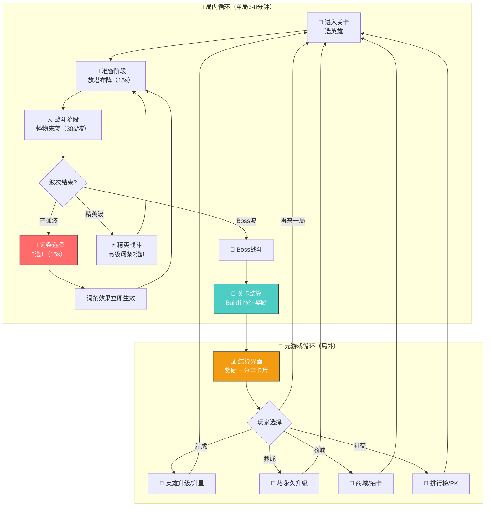
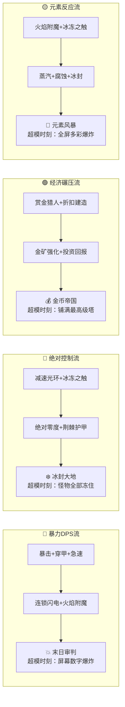
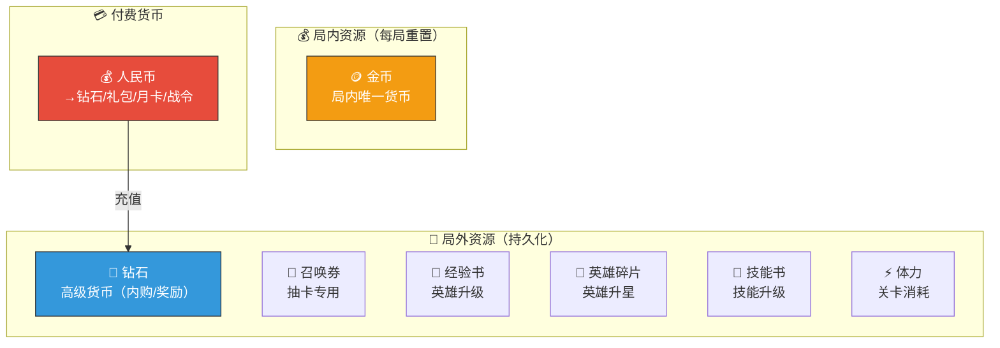
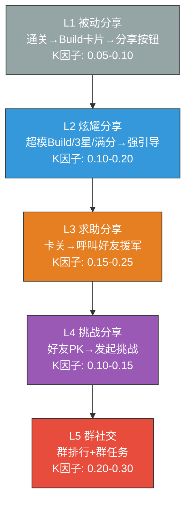
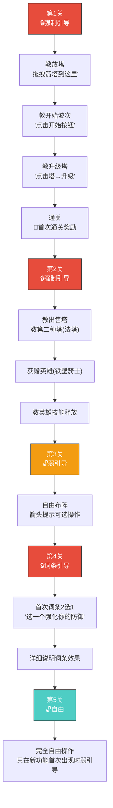


# 🏰 AetheraSurvivors — 游戏设计文档（GDD）

> **文档版本**：v2.0
> **最后更新**：2026-03-25
> **文档定位**：**本文档是 AetheraSurvivors 项目的唯一真相来源（Single Source of Truth）**，后续所有开发、设计、数值工作都以此为准。
> **前置决策**：已完成竞品分析（12款）→ 确认方案A「词条锻造」→ 用户画像分析 → 技术路线（Unity + minigame-unity-sdk）→ 版本锁定（Unity 2022.3 LTS）


---

## 📋 文档变更记录

| 版本 | 日期 | 变更内容 | 相关交互 |
|------|------|---------|---------|
| v1.0 | 2026-03-24 | 初始GDD框架创建 | 阶段一 #4 |
| v1.1 | 2026-03-24 | 关联核心战斗循环详细设计文档 | 阶段一 #5 |
| v1.2 | 2026-03-24 | 关联Roguelike词条系统详细设计文档 | 阶段一 #6 |
| v1.3 | 2026-03-24 | 关联塔体系详细设计文档 | 阶段一 #7 |
| v1.4 | 2026-03-24 | 关联怪物体系详细设计文档 | 阶段一 #8 |
| v1.5 | 2026-03-24 | 关联经济系统详细设计文档 | 阶段一 #9 |
| v1.6 | 2026-03-24 | 关联付费系统与商业化方案文档 | 阶段一 #10 |
| v1.7 | 2026-03-24 | 关联社交裂变系统设计文档 | 阶段一 #11 |
| v1.8 | 2026-03-24 | 关联社交裂变子系统详细设计文档 | 阶段一 #11.1-11.4 |
| v1.9 | 2026-03-24 | 关联美术风格方案文档 | 阶段一 #12 |
| v1.10 | 2026-03-24 | 关联UI/UX框架设计文档 | 阶段一 #13 |
| v1.11 | 2026-03-24 | 关联视觉规范文档 | 阶段一 #14 |
| v1.12 | 2026-03-24 | 关联爽感与留存钩子设计文档(Wow Moment) | 阶段一 #14.1 |
| v1.13 | 2026-03-24 | 关联爽感与留存钩子设计文档(战斗心流曲线) | 阶段一 #14.2 |
| v1.14 | 2026-03-24 | 关联爽感与留存钩子设计文档(超模Build设计) | 阶段一 #14.3 |
| v1.15 | 2026-03-24 | 关联爽感与留存钩子设计文档(留存钩子系统) | 阶段一 #14.4 |
| v1.16 | 2026-03-24 | 关联爽感与留存钩子设计文档(战斗分享卡片) | 阶段一 #14.5 |
| v1.17 | 2026-03-24 | 关联爽感与留存钩子设计文档(高光时刻系统) | 阶段一 #14.6 |
| v1.18 | 2026-03-24 | 关联英雄系统骨架设计文档 | 阶段一 #15 |
| v1.19 | 2026-03-24 | 关联外围系统骨架合集文档 | 阶段一 #16 |
| v1.20 | 2026-03-24 | 关联新手引导流程设计文档 | 阶段一 #17 |
| v1.21 | 2026-03-24 | 关联怪物属性数值表(1-30章)CSV | 阶段一 #18 |
| v1.22 | 2026-03-24 | 关联塔属性数值表CSV+永久升级系数表+DPS平衡验证表 | 阶段一 #19 |
| v1.23 | 2026-03-24 | 关联词条数值表CSV（44词条完整数值+权重+联动） | 阶段一 #20 |
| v1.24 | 2026-03-24 | 关联英雄属性数值表（基础信息+升级升星+技能升级+消耗表） | 阶段一 #21 |
| v1.25 | 2026-03-24 | 关联局外经济数值表集（关卡奖励+商城定价+战令+资源平衡） | 阶段一 #22 |
| v1.26 | 2026-03-24 | 关联经济系统30天数值模拟验证报告+Python脚本 | 阶段一 #23 |
| v1.27 | 2026-03-24 | 关联世界观设计文档（背景故事+势力划分+核心冲突+英雄身世+30章叙事线） | 阶段一 #24 |
| v1.28 | 2026-03-24 | 关联角色文案（6塔背景故事+游戏内描述+升级台词 + 前3英雄档案+描述+战斗台词） | 阶段一 #25 |
| v1.29 | 2026-03-24 | 关联前10章关卡剧情台词（50关开场/通关台词+Boss台词+叙事节点） | 阶段一 #26 |
| v1.30 | 2026-03-24 | 关联第11-15章关卡剧情台词（25关台词+双Boss台词+炎魔法师首次登场） | 阶段一 #27 |
| v1.31 | 2026-03-24 | 关联第16-20章关卡剧情台词（25关台词+矮人矿工首次登场+ACT3完结） | 阶段一 #28 |
| v1.32 | 2026-03-24 | 关联第21-25章关卡剧情台词（25关台词+天选者首次登场+虚空版双Boss） | 阶段一 #29 |
| v1.33 | 2026-03-24 | 关联第26-30章关卡剧情台词（25关+终极Boss+后3英雄文案+Boss台词汇总+698条总台词） | 阶段一 #30 |
| v1.34 | 2026-03-24 | 关联最小技术原型（搭建指南+4个C#脚本+JS桥接层+验证清单），#31-35跳过延迟到MVP后 | 阶段一 #36 |
| v2.0 | 2026-03-25 | **GDD终审**：修正Unity版本为2021.3.7（实际环境）、调整单局时长目标为4-6分钟、增加词条系统MVP验证备注、增加商业化优先级说明、通过制作人角色扮演审查 | 阶段一 #37-40 |
| v2.1 | 2026-03-25 | Unity版本升级为2022.3.62f3c1 LTS（用户实际环境升级）、WebGL模块已安装、minigame-unity-sdk V2已导入、技术原型已导出成功、.NET Standard 2.1可用 | 阶段一 G1-4验收 |


---

## 一、游戏概述

### 1.1 基础信息

| 维度 | 内容 |
|------|------|
| **项目代号** | AetheraSurvivors |
| **游戏类型** | 塔防 × Roguelike × 养成 |
| **目标平台** | 微信小游戏（WebGL） |
| **技术方案** | Unity 2022.3 LTS (2022.3.62f3c1) + minigame-unity-sdk V2 |


| **视角** | 2D俯视角 |
| **商业模式** | F2P（免费游玩 + 广告 + 内购） |
| **商业目标** | 月流水百万级 |
| **单局时长** | 4-6分钟（目标值，前5章3-4分钟） |

| **目标用户** | 25-35岁男性为主（70%），策略游戏爱好者，微信重度用户 |

### 1.2 一句话描述

> **在经典塔防的策略布阵基础上，融入Roguelike词条3选1系统，让每一局都创造独一无二的Build体验，通过微信社交裂变实现自增长。**

### 1.3 核心卖点（Unique Selling Points）

| # | 卖点 | 说明 |
|---|------|------|
| 1 | **Roguelike词条Build** | 每局随机词条3选1，40+词条 × 4条Build路线，每局体验不同 |
| 2 | **5分钟策略深度** | 单局4-6分钟，操作简单（放塔+选词条），策略靠选择而非操作 |

| 3 | **超模时刻** | 精心设计的「屏幕爆炸」时刻——暴击数字满屏飞、全屏元素反应、Boss秒杀 |
| 4 | **微信社交裂变** | Build卡片分享、好友PK、群排行榜、好友援军——5层裂变设计 |
| 5 | **深度不氪金** | 英雄+塔+词条三线养成，付费加速但不影响局内策略公平性 |

---

## 二、核心游戏循环

### 2.1 核心循环图（Core Loop）



### 2.2 单局完整时序图

```
时间线  事件                              玩家操作           系统反馈
──────  ──────────────────────────────   ────────────────   ──────────────
0:00    选择关卡 → 选择英雄 → 加载        点击确认           加载动画
0:15    🔔 第1波预告                       查看怪物类型       UI显示怪物图标+数量
0:20    准备时间(15s)                      拖拽放塔布阵       放塔音效+可视化射程
0:35    第1波怪物来袭(30s)                 观察/微调塔位       战斗音效+伤害飘字
1:05    💎 词条选择(15s限时)               从3张词条中选1张    词条效果说明+推荐标签
1:20    准备+第2波(30s)                    调整塔阵           —
2:05    💎 词条选择                        选词条             Build逐渐成型
2:20    第3波(30s)                         —                 —
2:50    💎 词条选择                        选词条             —
3:05    第4波(30s)                         —                 —
3:35    💎 词条选择                        选词条             —
4:00    ⚡ 精英波(40s)                     英雄技能释放       精英怪特殊机制
4:40    💎 高级词条2选1                    选词条             紫色/金色词条出现
4:55    第6-8波(90s)                       —                 Build效果显现
6:25    🐉 Boss波(60s)                     英雄技能+策略调整  Boss机制+阶段切换
7:25    🎉 通关结算                         —                 Build评分+星级+奖励
7:35    📊 结算界面                        查看/分享/再来一局  分享卡片生成
────────────────────────────────────────────────────────────────────────
总计: ~5分钟30秒（优化目标，正式版通过减少波次间隔+自动开波实现）

```

### 2.3 核心操作列表

| 操作 | 触发方式 | 频率 | 说明 |
|------|---------|------|------|
| **放塔** | 拖拽塔图标到合法位置 | 每波1-3次 | 核心操作，决定布阵策略 |
| **升级塔** | 点击已有塔 → 升级按钮 | 每2-3波1次 | 最多3级，消耗金币 |
| **出售塔** | 点击已有塔 → 出售按钮 | 偶尔 | 返还50%金币 |
| **选词条** | 从3张卡片中点选1张 | 每波1次（5-7次/局） | Roguelike核心，决定Build方向 |
| **英雄技能** | 点击技能按钮 | 每60s可用1次 | 关键时刻翻盘用 |
| **战斗加速** | 点击加速按钮 | 随时 | 1x/2x切换 |
| **暂停** | 点击暂停按钮 | 随时 | 暂停+菜单 |

---

## 三、Roguelike词条系统

### 3.1 系统概述

| 维度 | 设计 |
|------|------|
| **获取时机** | 每过1波普通波次后；精英波后获得高级词条 |
| **选择方式** | 3选1（前期2选1引导），限时15秒，超时随机选 |
| **词条总量** | 40+（首版），后续赛季持续扩充 |
| **稀有度** | ⬜白(12) / 🔵蓝(14) / 🟣紫(11) / 🟡金(3+) |
| **每局获取量** | 5-7个词条（普通波5个 + 精英波1-2个） |
| **词条叠加** | 同名词条可叠加（如「暴击+15%」选2次=+30%） |
| **Build路线** | 4条主要路线，可混搭 |

### 3.2 词条分类

| 类型 | 图标 | 数量 | 设计目标 |
|------|------|------|---------|
| 🔴 **攻击词条** | 剑/火焰 | 12+ | 提升输出，直接体感最强 |
| 🔵 **防御词条** | 盾牌/绿十字 | 8+ | 提升容错，适合新手 |
| 🟢 **经济词条** | 金币/宝箱 | 8+ | 提升收入，高风险高回报 |
| 🟡 **特殊词条** | 星星/闪电 | 12+ | 改变玩法规则，最有趣 |

### 3.3 词条池详细设计（骨架级，详细数值见后续第20条）

#### 🔴 攻击词条示例

| 词条名 | 稀有度 | 效果 | Build关联 |
|--------|--------|------|-----------|
| 锋利 | ⬜白 | 全塔伤害+8% | 通用 |
| 穿甲 | ⬜白 | 忽视目标20点护甲 | 暴力DPS流 |
| 急速 | ⬜白 | 全塔攻速+10% | 暴力DPS流 |
| 暴击强化 | 🔵蓝 | 暴击率+15%，暴击伤害+20% | 暴力DPS流 |
| 火焰附魔 | 🔵蓝 | 攻击附带灼烧（3s内造成额外30%伤害） | 元素反应流 |
| 连锁闪电 | 🟣紫 | 攻击弹射到附近2个敌人（50%伤害） | 暴力DPS流 |
| 巨人杀手 | 🟣紫 | 对Boss/精英怪伤害+30% | 通用 |
| 末日审判 | 🟡金 | 所有塔每第5次攻击触发一次全伤害爆发 | 暴力DPS流 |

#### 🔵 防御词条示例

| 词条名 | 稀有度 | 效果 | Build关联 |
|--------|--------|------|-----------|
| 坚韧 | ⬜白 | 基地+1生命值 | 通用 |
| 减速光环 | ⬜白 | 全塔减速效果+10% | 控制流 |
| 冰冻之触 | 🔵蓝 | 15%概率冰冻敌人1秒 | 控制流 |
| 荆棘护甲 | 🔵蓝 | 敌人经过塔射程时受到反伤 | 控制流 |
| 绝对零度 | 🟣紫 | 冰塔范围+50%，减速效果+25% | 控制流 |

#### 🟢 经济词条示例

| 词条名 | 稀有度 | 效果 | Build关联 |
|--------|--------|------|-----------|
| 赏金猎人 | ⬜白 | 击杀金币+15% | 经济碾压流 |
| 折扣建造 | ⬜白 | 造塔费用-10% | 经济碾压流 |
| 金矿强化 | 🔵蓝 | 金矿产出+25% | 经济碾压流 |
| 投资回报 | 🟣紫 | 每波开始时获得已放塔数量×5金币 | 经济碾压流 |

#### 🟡 特殊词条示例

| 词条名 | 稀有度 | 效果 | Build关联 |
|--------|--------|------|-----------|
| 塔联动 | 🔵蓝 | 相邻塔互相+10%攻击 | 通用 |
| 禁区 | 🔵蓝 | 选定一片区域，敌人进入减速50% | 控制流 |
| 元素反应：蒸汽 | 🟣紫 | 火+冰同时作用于敌人→蒸汽爆炸AOE | 元素反应流 |
| 元素反应：腐蚀 | 🟣紫 | 毒+火同时作用→持续腐蚀（忽视护甲） | 元素反应流 |
| 元素反应：冰封 | 🟣紫 | 冰+冰叠加→完全冻结3秒（不可行动） | 控制流/元素反应流 |
| 命运之轮 | 🟡金 | 本局所有词条效果+50% | 通用（极稀有） |
| 全能之力 | 🟡金 | 同时获得1个随机攻击+防御+经济词条 | 通用（极稀有） |

### 3.4 四条Build路线



### 3.5 新手词条引导策略（基于用户画像调整）

| 关卡 | 词条机制 | 说明 |
|------|---------|------|
| 第1-3关 | ❌ 不出词条 | 纯塔防教学，降低认知负担 |
| 第4-5关 | 2选1，仅⬜白色词条 | 效果极直白（「伤害+8%」vs「金币+15%」），自带⭐推荐标签 |
| 第6-10关 | 3选1，⬜白+🔵蓝 | 开始出现有趣的组合（减速+暴击等） |
| 第11关+ | 3选1，全稀有度 | 完整词条池开放，紫色/金色出现 |
| 精英波后 | 高级词条2选1 | 保证🔵蓝色以上，增加Build深度 |

> **⚠️ MVP 验证备注（#39 审查结论）**：
> 44 词条 + 元素反应的复杂度可能对微信小游戏轻度用户过高。
> **阶段三 MVP 必须重点验证「词条选择是否让新手困惑」。**
> - 如果测试发现词条太复杂，**备选简化方案**：增加「智能推荐」按钮（一键选择 AI 推荐词条），降低决策压力
> - 词条描述文案必须控制在 15 字以内，一看就懂
> - 考虑增加「词条效果预览」（选中时实时显示 DPS 变化数字）


---

## 四、塔体系

### 4.1 六种基础塔

| 塔类型 | 图标 | 定位 | 攻击方式 | 伤害类型 | 特殊能力（3级解锁） |
|--------|------|------|---------|---------|-------------------|
| 🏹 **箭塔** | 弓箭 | 单体高DPS | 发射箭矢（追踪弹） | 物理 | 穿透（箭矢穿过第一个目标命中第二个） |
| 🔮 **法塔** | 魔法球 | AOE群体 | 发射魔法弹（范围爆炸） | 魔法 | 附带减速（命中目标减速20%） |
| ❄️ **冰塔** | 冰晶 | 减速控制 | 释放冰冻射线 | 魔法 | 范围冰冻光环（周围敌人-30%移速） |
| 💣 **炮塔** | 炮管 | 范围爆炸 | 发射炮弹（抛物线+AOE） | 物理 | 击退效果（爆炸推开敌人） |
| ☠️ **毒塔** | 毒瓶 | DOT持续 | 释放毒雾（持续伤害区域） | 真实伤害 | 毒雾扩散（范围+50%） |
| ⛏️ **金矿** | 金锭 | 经济产出 | 不攻击 | — | 产出效率+50% |

### 4.2 塔的升级体系

| 等级 | 消耗金币(基数) | 属性提升 | 视觉变化 |
|------|-------------|---------|---------|
| 1级（建造） | 100% | 基础属性 | 基础外观 |
| 2级 | 60% | 攻击+30%，攻速+10% | 外观变化（加装饰） |
| 3级 | 100% | 攻击+50%，攻速+20%，**解锁特殊能力** | 外观大幅变化（发光+特效） |

> **设计原则**：3级升级解锁特殊能力是关键决策——玩家需要决定是升级1个塔到3级，还是多建2个1级塔。

### 4.3 塔的攻击目标选择策略

玩家可为每个塔切换攻击优先级：

| 策略 | 说明 | 适用场景 |
|------|------|---------|
| **最近** | 攻击距离塔最近的敌人 | 默认策略 |
| **最前** | 攻击最接近终点的敌人 | 防止漏怪 |
| **血最少** | 攻击剩余血量最少的敌人 | 快速清小怪 |
| **最强** | 攻击血量最多的敌人 | 集火精英/Boss |

### 4.4 塔的放置规则

- 每个合法格子只能放1个塔
- 放塔不能阻断怪物路径（必须保留至少1条通路）
- 金矿有最大建造数量限制（初始上限3个，可通过词条增加）
- 放塔消耗局内金币

---

## 五、怪物体系

### 5.1 怪物分类

| 类型 | 比例 | 特征 | 出现频率 |
|------|------|------|---------|
| **普通怪** | 60% | 基础属性，纯血量/速度差异，配置驱动无需独立子类 | 每波主力 |
| **精英怪** | 25% | 带1个特殊机制（治疗/分裂/隐身/护盾） | 精英波 |
| **Boss** | 15% | 多阶段+独特技能+出场演出 | 每关最后1波 |

### 5.2 普通怪类型（配置驱动）

| 怪物类型 | 血量 | 速度 | 护甲 | 魔抗 | 特征 |
|---------|------|------|------|------|------|
| 步兵 | 中 | 中 | 低 | 低 | 基准单位 |
| 刺客 | 低 | 高 | 无 | 低 | 速度快，容易漏 |
| 骑士 | 高 | 慢 | 高 | 低 | 物理减伤高，需魔法塔 |
| 法师兵 | 中 | 中 | 低 | 高 | 魔法减伤高，需物理塔 |
| 飞行单位 | 低 | 快 | 无 | 无 | 走直线（不沿路径），无视地形 |

### 5.3 精英怪类型（需独立逻辑）

| 精英怪 | 特殊机制 | 克制方式 |
|--------|---------|---------|
| 🩹 **治疗者** | 定时为周围友军回血 | 优先击杀/AOE |
| 🟢 **分裂史莱姆** | 死亡时分裂为2-3个小史莱姆 | DOT持续伤害/AOE |
| 👻 **隐身盗贼** | 定时隐身（不可被选为攻击目标） | AOE可命中取消隐身 |
| 🛡️ **护盾法师** | 为周围友军施加护盾 | 集火护盾法师本体 |

### 5.4 Boss设计（首版2种）

| Boss | 血量 | 特殊机制 | 阶段设计 |
|------|------|---------|---------|
| 🐉 **火龙** | 极高 | 火焰吐息（锥形范围伤害，可毁塔） | P1(100-60%血)正常行走+吐息 → P2(60-0%血)暴怒加速+连续吐息 |
| 🗿 **石巨人** | 超高 | 践踏AOE（周围范围伤害）+ 缓慢但势不可挡 | P1(100-50%血)缓慢行走+践踏 → P2(50-0%血)进入狂暴速度+50% |

---

## 六、英雄/指挥官系统

### 6.1 系统概述

| 维度 | 设计 |
|------|------|
| **定位** | 英雄是「大招按钮」，不是常态输出。关键时刻翻盘用 |
| **出战规则** | 每局选1个英雄出战 |
| **技能设计** | 1个主动技能（CD 60s）+ 1个被动技能（始终生效） |
| **英雄站位** | 英雄站在地图上但不自动攻击，仅通过技能参与战斗 |
| **英雄总量规划** | 首版6个英雄，后续每赛季+1-2个 |

### 6.2 首版英雄阵容（6个）

| 英雄 | 稀有度 | 定位 | 主动技能 | 被动技能 | 获取方式 |
|------|--------|------|---------|---------|---------|
| ⚔️ **铁壁骑士** | R | 防御型 | 无敌护盾：基地3秒无敌 | 坚韧意志：基地+2生命 | 第2关教学赠送 |
| 🏹 **精灵射手** | R | 输出型 | 万箭齐发：全屏随机箭雨5秒 | 鹰眼：全塔射程+10% | 第5关赠送 |
| ❄️ **霜雪女巫** | SR | 控制型 | 暴风雪：全屏冰冻所有敌人3秒 | 寒冰之力：冰塔效果+15% | 抽卡获取 |
| 🔥 **炎魔法师** | SR | 爆发型 | 陨石术：对目标区域造成大量AOE伤害 | 火焰亲和：火系词条效果+20% | 抽卡获取 |
| 💰 **矮人矿工** | SR | 经济型 | 淘金热：10秒内击杀金币翻倍 | 矿脉感知：金矿产出+20% | 抽卡获取 |
| 🌟 **天选者** | SSR | 全能型 | 神之裁决：对全屏敌人造成当前血量20%伤害 | 命运垂青：词条选择时多看1张（4选1） | 抽卡获取（保底50次） |

### 6.3 英雄养成

| 养成维度 | 消耗 | 效果 | 上限 |
|---------|------|------|------|
| **升级** | 经验书+金币 | 基础属性（血量/技能伤害）提升 | 60级 |
| **升星** | 英雄碎片 | 解锁星级被动+属性大幅提升 | 6星 |
| **技能升级** | 技能书+金币 | 技能数值+CD缩短 | 10级 |

---

## 七、关卡结构

### 7.1 章节结构

| 章节 | 关卡数 | 难度定位 | 新机制引入 |
|------|--------|---------|-----------|
| 第1章「新手之路」 | 5关 | 教学 | 基础放塔+升级+出售 |
| 第2章「觉醒之森」 | 5关 | 入门 | 词条系统解锁（2选1→3选1） |
| 第3章「冰霜山脉」 | 5关 | 初级 | 冰塔+减速机制 |
| 第4-6章 | 各5关 | 中初级 | 飞行怪+隐身怪+精英怪 |
| 第7-10章 | 各5关 | 中级 | Boss机制（火龙/石巨人） |
| 第11-20章 | 各5关 | 中高级 | 多路线+复合波次+新精英 |
| 第21-30章 | 各5关 | 困难 | 极限波次+多Boss+高级组合 |
| **合计** | **150关** | — | — |

### 7.2 难度模式

| 模式 | 解锁条件 | 敌人属性倍率 | 奖励倍率 | 星级评定 |
|------|---------|------------|---------|---------|
| 普通 | 默认 | 1.0x | 1.0x | 最高3星 |
| 困难 | 普通3星通关 | 1.5x | 1.5x | 最高3星 |
| 噩梦 | 困难3星通关 | 2.5x | 2.5x | 最高3星 |

### 7.3 星级评定

| 星级 | 条件 | 说明 |
|------|------|------|
| ⭐ | 通关（基地生命>0） | 基础通关 |
| ⭐⭐ | 通关 + 基地生命≥50% | 良好防御 |
| ⭐⭐⭐ | 通关 + 基地生命=100%（零伤） | 完美防御 |

### 7.4 单关波次结构（标准模板）

```
波次1:  [步兵×10]                     → 💎词条选择
波次2:  [步兵×8, 刺客×5]              → 💎词条选择
波次3:  [骑士×5, 步兵×10]             → 💎词条选择
波次4:  [刺客×8, 法师兵×5]            → 💎词条选择
波次5:  [飞行×5, 步兵×15]             → 💎词条选择
⚡精英: [治疗者×2, 骑士×10, 步兵×20]  → 💎高级词条2选1
波次6:  [刺客×10, 法师兵×8]           → 💎词条选择
波次7:  [全种类混合×25]               → 💎词条选择  
🐉Boss: [火龙 + 步兵×10]             → 🎉 关卡结算
```

---

## 八、经济系统骨架

### 8.1 资源总览



### 8.2 局内经济（金币）

| 金币来源 | 数量（基准） | 说明 |
|---------|------------|------|
| 击杀普通怪 | 5-15 | 随章节递增 |
| 击杀精英怪 | 30-50 | — |
| 击杀Boss | 100-200 | — |
| 波次完成奖励 | 20-40 | 每波固定奖励 |
| 金矿产出 | 15/波/矿 | 被动收入 |
| 初始金币 | 200 | 足够放2个塔 |

| 金币消耗 | 数量（基准） | 说明 |
|---------|------------|------|
| 建造塔（1级） | 80-150 | 不同塔不同价格 |
| 升级到2级 | 造价×60% | — |
| 升级到3级 | 造价×100% | — |
| 出售返还 | 投入×50% | — |

### 8.3 局外经济（骨架）

| 货币 | 主要来源 | 主要消耗 | 产出控制 |
|------|---------|---------|---------|
| **💎钻石** | 任务/成就/战令/充值 | 抽卡(150/次)/体力购买/礼包 | 免费日均~50-80钻，付费不限 |
| **🎫召唤券** | 任务/活动/商城兑换 | 抽卡(1券/次) | 免费周均~3-5张 |
| **📕经验书** | 关卡掉落/任务/商城 | 英雄升级 | 按升级曲线控制 |
| **🧩碎片** | 抽卡重复/活动/商城 | 英雄升星 | 按升星需求控制 |
| **⚡体力** | 自然恢复(5min/1点)/任务/好友赠送 | 每关消耗6-10体力 | 上限120，日均自然恢复~288点 |

### 8.4 付费点位与定价（骨架）

| 付费项 | 价格(元) | 内容 | 目标用户 |
|--------|---------|------|---------|
| **首充** | 6 | SSR碎片×30 + 500钻 + 3召唤券 | 全部 |
| **月卡** | 30 | 每日100钻+20体力（30天） | 轻度付费 |
| **战令** | 68 | 60级双轨奖励（赛季内） | 中度付费 |
| **单抽** | ~10（150钻） | 1次英雄抽卡 | — |
| **十连** | ~100（1500钻） | 10次抽卡+保底SR | — |
| **限时礼包** | 6-328 | 按内容定价 | 各层级 |

### 8.5 经济健康度控制原则

| 原则 | 说明 |
|------|------|
| **免费可玩** | 不花钱也能通关30章普通难度，只是速度慢 |
| **付费加速不P2W** | 付费提升养成属性（英雄/塔基础数值），不影响局内词条选择 |
| **资源不断档** | 每3-5关必有1次「资源充裕」感，避免长期贫穷感 |
| **付费卡点自然** | 在玩家「差一点」时推送付费（不是强制），保底有免费替代方案（看广告） |
| **经济曲线后验** | 阶段一#23用Python模拟验证30天资源曲线 |

### 8.6 商业化优先级（#39 审查结论）

> **⚠️ 微信小游戏生态变现优先级**（从高到低）：
>
> | 优先级 | 变现方式 | 预估收入占比 | 说明 |
> |--------|---------|------------|------|
> | 🥇 P0 | **激励视频广告** | 40-50% | 微信小游戏最稳定的收入来源，eCPM ¥30-80 |
> | 🥈 P1 | **小额内购（首充/月卡/战令）** | 25-35% | 6-68元区间，微信用户付费接受度高 |
> | 🥉 P2 | **抽卡/限时礼包** | 10-20% | 大R向，微信小游戏中占比较低但单价高 |
> | P3 | **Banner广告+插屏广告** | 5-10% | 补充收入，注意不影响体验 |
>
> **广告激励点位补充设计**（阶段四实现）：
> - ✅ 通关双倍奖励（已设计）
> - 🆕 词条免费刷新 1 次（每局限 1 次，看广告）
> - 🆕 关卡失败后「复活」（基地恢复 1 点生命，看广告，每局限 1 次）
> - 🆕 每日免费抽卡 1 次 → 第 2 次看广告
> - 🆕 加速训练/建造（减少等待时间，看广告）


---

## 九、社交裂变系统骨架

### 9.1 五层裂变模型



### 9.2 关键裂变功能

| 功能 | 说明 | 实现阶段 |
|------|------|---------|
| **Build分享卡片** | 通关后生成含词条路线+DPS+星级的分享图 | 阶段四 |
| **好友援军** | 好友借1个塔放在你的关卡中（异步） | 阶段四 |
| **好友PK** | 同关卡比分（异步） | 阶段四 |
| **群排行榜** | 微信群内周排行 | 阶段四 |
| **群任务** | 群内3人通关 → 全群奖励 | 阶段四 |
| **邀请奖励** | 邀请新玩家→双方获钻石+碎片 | 阶段四 |

---

## 十、技术约束清单

> 来源：阶段一 #3.1/#3.2 技术路线选型 + 版本锁定

| 约束类型 | 约束内容 | 应对方案 |
|---------|---------|---------|
| **包体** | 主包<4MB | Managed Stripping High + Brotli + 分包 |
| **内存** | 运行内存<256MB | 对象池+资源按需加载卸载 |
| **渲染** | DrawCall<50 | 合批+图集+减少材质 |
| **帧率** | 30fps稳定（100+同屏怪） | 空间分区+对象池+寻路缓存 |
| **代码** | IL2CPP+WASM，不支持JIT/反射 | link.xml+避免反射+AOT泛型 |
| **API兼容** | .NET Standard 2.1（2022.3 LTS 完整支持） | 可使用 Span<T>、ValueTask 等现代API |

| **线程** | 单线程（无Thread.Sleep） | async/await+UniTask+时间分片 |

| **存储** | wx.setStorageSync/getStorageSync | SaveManager平台抽象层 |
| **音频** | wx.InnerAudioContext | AudioManager平台抽象层 |
| **网络** | wx.request（非XMLHttpRequest） | HttpClient平台抽象层 |
| **登录** | wx.login | WXBridge桥接层 |
| **支付** | 微信虚拟支付API | 服务端验签+客户端WXPayment |

---

## 十一、美术风格方向（骨架级）

| 维度 | 方向 |
|------|------|
| **整体风格** | 精致卡通2D，介于Q版和写实之间（类似「皇室战争」偏卡通方向） |
| **色调** | 明亮暖色为主（绿色地图+蓝色天空），战斗特效用高饱和色 |
| **角色设计** | 辨识度高+比例偏Q（头身比约1:2.5），男女角色兼顾 |
| **UI风格** | 圆角+渐变+微光效，按钮有弹性动画，现代游戏UI标准 |
| **包体友好** | 2D为主，精灵图+图集，无3D模型 |

> 详细美术规范见阶段一 #12-14

---

## 十二、外围系统骨架

| 系统 | 核心作用 | 对留存的作用 | 对付费的作用 |
|------|---------|------------|------------|
| **每日任务** | 每天5个任务+活跃度宝箱 | ⭐⭐⭐⭐⭐ 日活核心驱动 | ⭐⭐ 引导消耗 |
| **成就系统** | 长期目标追踪+奖励 | ⭐⭐⭐⭐ 长线留存 | ⭐ 奖励引导 |
| **签到系统** | 每日签到+累计签到 | ⭐⭐⭐⭐ 日活 | ⭐ 小额奖励 |
| **战令/赛季** | 60级双轨奖励，30天重置 | ⭐⭐⭐⭐⭐ 赛季留存 | ⭐⭐⭐⭐⭐ 战令是付费核心 |
| **抽卡系统** | 英雄抽卡，50次保底SSR | ⭐⭐⭐ 收集驱动 | ⭐⭐⭐⭐⭐ 付费核心 |
| **体力系统** | 体力限制游玩频率 | ⭐⭐⭐ 控制节奏 | ⭐⭐⭐ 体力购买 |
| **邮件系统** | 系统奖励/活动通知 | ⭐⭐ 信息触达 | ⭐ 补偿发放 |
| **公告系统** | 活动/更新通知 | ⭐⭐ 信息触达 | — |
| **背包系统** | 道具/材料管理 | ⭐ 基础功能 | — |
| **好友系统** | 好友列表/送体力/PK | ⭐⭐⭐⭐ 社交留存 | ⭐⭐ 社交付费 |
| **排行榜** | 好友/全服排行 | ⭐⭐⭐⭐ 竞争驱动 | ⭐⭐ 攀比付费 |

---

## 十三、新手引导骨架

### 引导流程



### 引导原则

| 原则 | 说明 |
|------|------|
| **30秒内产生Wow Moment** | 第1波怪物自动出现，玩家放1个塔就能看到战斗效果 |
| **前3关不出词条** | 降低认知负担，先掌握塔防基础 |
| **第4关才引入词条** | 2选1白色词条，自带推荐标签 |
| **强制引导尽量少** | 只在必须的地方（放塔/开始/词条）强制，其他用弱引导 |
| **永远不阻断乐趣** | 引导过程中战斗不暂停（除非必须），让玩家感受到流畅感 |

---

## 十四、留存钩子系统骨架

| 钩子类型 | 触发时机 | 表现形式 | 心理学原理 |
|---------|---------|---------|-----------|
| **未完成的Build** | 关卡失败时 | 「你的词条距离超模只差1步！再试一次？」 | 蔡格尼克效应（未完成任务记忆更深） |
| **差一点升级** | 退出游戏前 | 「还差50经验就能升级英雄了！打1关就够」 | 目标梯度效应（越接近目标越有动力） |
| **社交攀比** | 登录时 | 「你的好友XXX超越了你的排名！」 | 社会比较理论 |
| **限时倒计时** | 每日限时活动 | 「精英挑战还有2小时关闭！」 | 稀缺性原理（错过会后悔） |
| **每日奖励** | 每日签到 | 「签到第7天可获得SSR碎片×10」 | 沉没成本（已签6天不想断） |

---

## 十五、核心KPI目标

| 指标 | 目标值 | 行业基准 |
|------|--------|---------|
| 次日留存 | ≥40% | 中度游戏35-45% |
| 7日留存 | ≥20% | 中度游戏15-25% |
| 30日留存 | ≥10% | 中度游戏8-15% |
| 付费率 | ≥5% | 微信小游戏3-8% |
| 月ARPU | ≥¥4.0 | — |
| DAU | ≥8,500 | 月流水100万所需 |
| 日新增 | ≥3,000-5,000 | — |
| K因子 | ≥0.3 | 优秀微信小游戏0.2-0.5 |
| 首屏加载 | <5秒 | 微信小游戏标准 |
| 战斗帧率 | 30fps稳定 | 100+同屏怪物 |

---

## 十六、文档索引——后续交互产出物映射

| GDD章节 | 详细设计交互 | 状态 |
|---------|------------|------|
| 三、词条系统 | #6 词条详细设计 + #20 词条数值表 | ✅ 详见「Roguelike词条系统设计.md」+「词条数值表.csv」 |

| 四、塔体系 | #7 塔详细设计 + #19 塔数值表 | ✅ 详见「塔体系设计.md」+「塔属性数值表.csv」+「塔永久升级加成系数表.csv」+「塔DPS_vs_怪物HP平衡验证表.csv」 |
| 五、怪物体系 | #8 怪物详细设计 + #18 怪物数值表 | ✅ 详见「怪物体系设计.md」+「怪物属性数值表_1-30章.csv」 |
| 六、英雄系统 | #15 英雄骨架 + #21 英雄数值表 | ✅ 详见「英雄系统骨架设计.md」+「英雄基础信息表.csv」+「英雄升级升星数值表.csv」+「英雄技能升级数值表.csv」+「英雄升级消耗表.csv」 |

| 七、关卡结构 | #5 战斗循环 + 波次配置 | ✅ 详见「核心战斗循环设计.md」 |
| 八、经济系统 | #9 经济详细设计 + #22 经济数值表 + #23 数值模拟 | ✅ 详见「经济系统设计.md」+「关卡奖励表.csv」+「商城定价表.csv」+「战令奖励表.csv」+「资源产出消耗平衡表.csv」+「数值模拟验证报告_经济系统30天.md」+「数值模拟_经济系统验证.py」 |


| 九、社交系统 | #11-11.4 社交详细设计 | ✅ 详见「社交裂变系统设计.md」+「社交裂变子系统详细设计(#11.1-11.4).md」 |
| 十、商业化 | #10 付费详细设计 | ✅ 详见「付费系统与商业化方案.md」 |
| 十一、美术风格 | #12-14 美术详细设计 | ✅ 详见「美术风格方案.md」+「UI_UX框架设计.md」+「视觉规范文档.md」 |
| 十二、外围系统 | #16 外围系统骨架合集 | ✅ 详见「外围系统骨架合集.md」 |
| 十三、新手引导 | #17 引导详细设计 | ✅ 详见「新手引导流程设计.md」 |
| 十四、留存钩子 | #14.1-14.6 爽感/钩子专项 | ✅ 详见「爽感与留存钩子设计.md」（#14.1✅ #14.2✅ #14.3✅ #14.4✅ #14.5✅ #14.6✅ 全部完成） |
| 十五、世界观 | #24 世界观设计 | ✅ 详见「世界观设计.md」（背景故事+12势力+6英雄身世+30章叙事线+系统对照表） |
| 十六、角色文案 | #25 塔/英雄文案 | ✅ 详见「角色文案与关卡剧情台词.md」第一部分（6塔背景+描述+升级台词 + 3英雄档案+描述+战斗台词） |
| 十七、关卡剧情 | #26 前10章台词 | ✅ 详见「角色文案与关卡剧情台词.md」第二部分（50关开场/通关台词+Boss台词+叙事节点表） |
| 十八、关卡剧情(续) | #27-29 第11-25章台词 | ✅ 详见「角色文案与关卡剧情台词.md」第三/四/五部分（75关台词+双Boss台词+3英雄首次登场+531条总台词） |
| 十九、关卡剧情(终) | #30 第26-30章台词+终极Boss+后3英雄文案 | ✅ 详见「角色文案与关卡剧情台词.md」第六/七/八/九/十部分（150关698条台词+虚空意志化身+6英雄文案全完成+Boss台词汇总） |
| 二十、技术原型 | #36 最小技术原型（Unity→微信小游戏验证） | ✅ 详见「技术原型搭建指南.md」+「Unity/Assets/Scripts/」4个C#脚本+JS桥接层（待用户实机验证） |


> **⚠️ 本GDD是框架级文档。每个章节的详细设计、数值、配置将在后续对应交互中完成，完成后更新此文档对应章节的状态。**

---

> 📝 **文档维护规则**：
> 1. 每完成一个相关交互，同步更新GDD对应章节
> 2. 设计变更必须先修改GDD，再修改代码
> 3. 任何冲突以GDD为准
> 4. 每个阶段门控前Review GDD完整性
