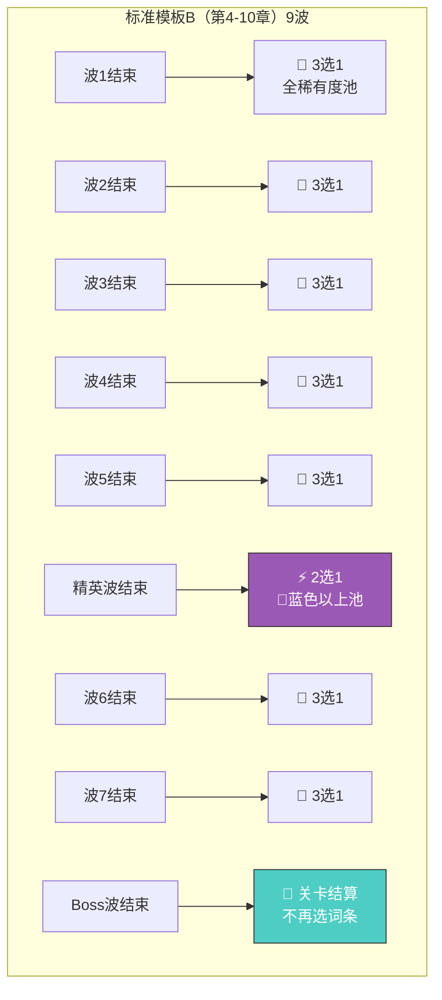
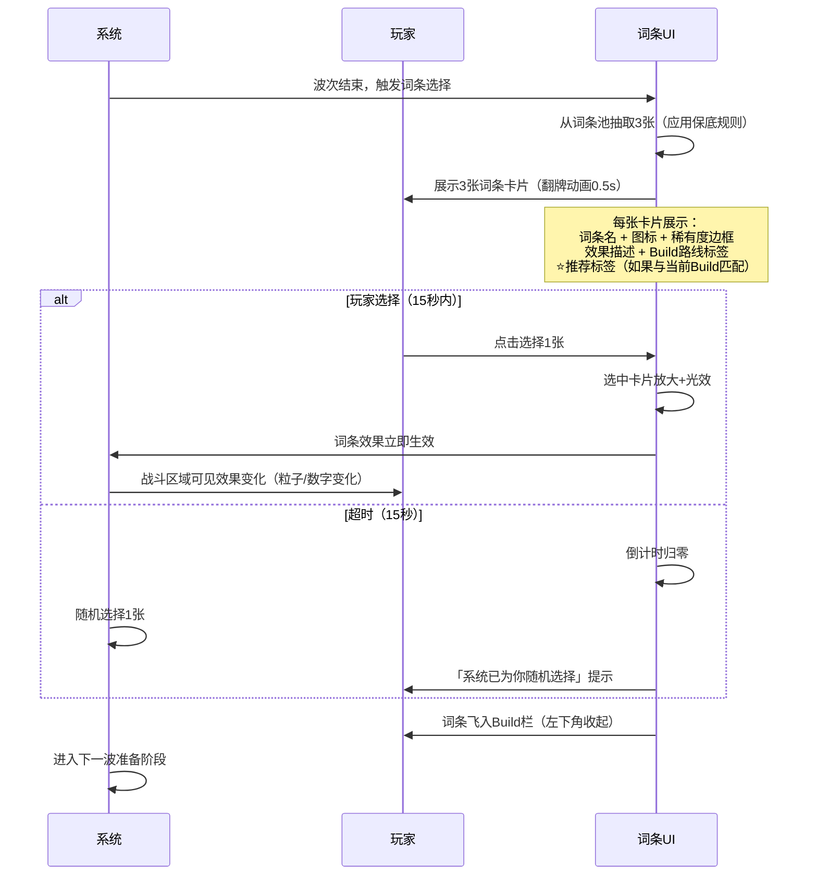
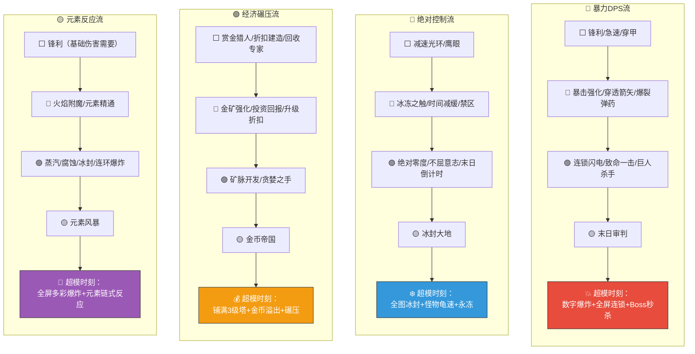
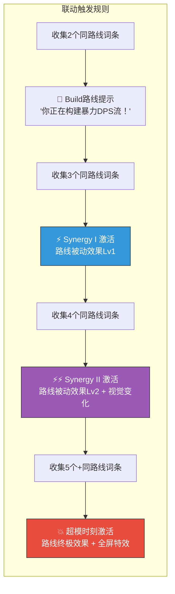
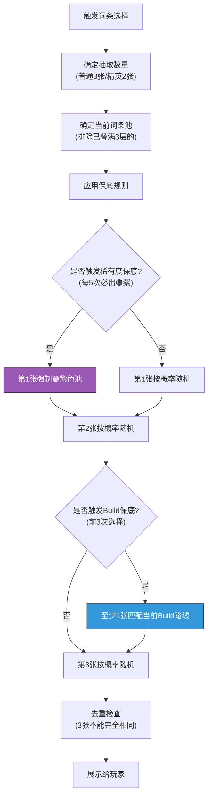


# 🎲 AetheraSurvivors — Roguelike词条系统详细设计

> **文档版本**：v1.0
> **最后更新**：2026-03-24
> **交互编号**：阶段一 #6
> **前置依赖**：GDD.md（v1.0）、核心战斗循环设计.md（v1.0）
> **验收标准**：✅ 至少定义30+词条 + ✅ 有3种以上Build路线

---

## 一、词条系统总览

### 1.1 设计哲学

| 原则 | 说明 | 竞品参考 |
|------|------|---------|
| **选择即策略** | 词条选择是本游戏最核心的策略维度，比放塔更重要 | 杀戮尖塔（卡牌选择=Build构建） |
| **即时反馈** | 选择词条后效果必须在下一波立即可感知 | 吸血鬼幸存者（选完即生效） |
| **Build有方向感** | 玩家在选2-3个词条后就能感知到Build方向 | 黑帝斯（神恩系统→流派成型） |
| **超模可达** | 当Build成型（4-5个同路线词条），必须产生「超模时刻」 | 盗贼传说（满Build碾压快感） |
| **新手友好** | 即使随机选也不会太差，但有策略的选择能碾压 | — |
| **每局不同** | 词条池随机+3选1，确保每局Build组合不同 | 所有Roguelike游戏 |

### 1.2 系统参数总表

| 参数 | 值 | 说明 |
|------|-----|------|
| 词条总量（首版） | **44个** | 攻击13 + 防御9 + 经济9 + 特殊13 |
| 稀有度分布 | ⬜白12 / 🔵蓝14 / 🟣紫13 / 🟡金5 | 总计44个 |
| 每局获取量 | **5-8个** | 标准模板B：普通波5-7个 + 精英波1个 |
| 选择方式 | 3选1（限时15秒） | 精英波为2选1（蓝色以上） |
| 词条叠加 | 同名词条可叠加，最多3层 | 如「锋利」叠3次=伤害+24% |
| Build路线 | **4条主路线 + 混搭** | 暴力DPS / 绝对控制 / 经济碾压 / 元素反应 |
| 超模阈值 | 同路线≥4个词条 | 触发超模时刻的视觉+数值爆发 |

---

## 二、词条获取机制

### 2.1 获取时机详细设计



### 2.2 获取规则详细表

| 规则 | 说明 | 设计目的 |
|------|------|---------|
| **普通波后3选1** | 从当前可用词条池随机抽3张，玩家选1张 | 核心Roguelike选择 |
| **精英波后2选1** | 从🔵蓝色+🟣紫色+🟡金色池随机抽2张 | 保证精英波奖励品质 |
| **15秒限时** | 超时自动随机选1张 | 防止过度分析，保持节奏 |
| **不重复展示** | 同一次选择中3张词条不重复 | 基本规则 |
| **叠加上限3层** | 同名词条可以被选3次，第4次不再出现在池中 | 防止无限叠加 |
| **保底机制** | 前3次选择中必定包含至少1个与已选词条同路线的词条 | 帮助Build成型 |
| **稀有度保底** | 每5次选择必定出现至少1个🟣紫色词条 | 防止全局白色的挫败感 |

### 2.3 新手引导词条机制（前10章特殊规则）

| 章节 | 词条机制 | 词条池范围 | 说明 |
|------|---------|----------|------|
| 第1-3章 | ❌ 不出词条 | — | 纯塔防教学 |
| 第4章 | 2选1 | 仅⬜白色（6个最直观的） | 「伤害+8%」vs「金币+15%」 |
| 第5章 | 2选1 | ⬜白色 + 2个🔵蓝色 | 开始有趣 |
| 第6-10章 | 3选1 | ⬜白+🔵蓝 | 自带⭐推荐标签 |
| 第11章+ | 3选1 | 全稀有度 | 完整词条池开放 |

### 2.4 词条选择界面流程



---

## 三、词条稀有度系统

### 3.1 稀有度定义

| 稀有度 | 边框颜色 | 数量 | 出现概率(标准池) | 效果强度 | 说明 |
|--------|---------|------|----------------|---------|------|
| ⬜ **白色（普通）** | 灰白色 | 12 | 50% | 基础增益（+8%/+10%/+15%） | 小而确定的提升 |
| 🔵 **蓝色（稀有）** | 蓝色发光 | 14 | 30% | 中等增益+特殊效果 | 开始有趣 |
| 🟣 **紫色（史诗）** | 紫色发光+粒子 | 13 | 16% | 强力效果/改变机制 | Build核心词条 |
| 🟡 **金色（传说）** | 金色发光+光柱 | 5 | 4% | 超强/改变玩法规则 | 超模时刻触发器 |

### 3.2 出现概率调控

| 场景 | ⬜白 | 🔵蓝 | 🟣紫 | 🟡金 | 说明 |
|------|------|------|------|------|------|
| 标准池（普通波后） | 50% | 30% | 16% | 4% | 基准概率 |
| 精英池（精英波后） | 0% | 55% | 35% | 10% | 保证蓝色以上 |
| 前5次保底 | +10%白 | -5%蓝 | -4%紫 | -1%金 | 新手前期白色多，降低认知负担 |
| 章节11+加成 | -5%白 | +2%蓝 | +2%紫 | +1%金 | 后期紫金更多，Build更强 |
| 噩梦难度加成 | -10%白 | +3%蓝 | +4%紫 | +3%金 | 高难度=更好词条（但怪也更强） |

### 3.3 稀有度视觉反馈设计

| 稀有度 | 卡片出现动画 | 选择时动画 | 生效时反馈 |
|--------|------------|----------|----------|
| ⬜白 | 普通翻牌 | 白色闪光 | 小型数字飘出 |
| 🔵蓝 | 翻牌+蓝色光晕 | 蓝色粒子爆发 | 中型数字+音效 |
| 🟣紫 | 翻牌+紫色闪电 | 紫色能量风暴+震屏 | 全场紫色波纹+塔外观微变 |
| 🟡金 | 慢动作翻牌+金色光柱+特殊音效 | 全屏金色爆发+「传说！」大字 | 全场金色特效持续3秒+塔明显变化 |

---

## 四、完整词条池（44个词条）

### 4.1 🔴 攻击词条（13个）

| # | 词条名 | 稀有度 | 效果 | 叠加效果（×2/×3） | Build路线 | 与塔的交互 |
|---|--------|--------|------|------------------|----------|-----------|
| A01 | **锋利** | ⬜白 | 全塔伤害+8% | +16%/+24% | 通用 | 所有塔受益 |
| A02 | **急速** | ⬜白 | 全塔攻速+10% | +20%/+30% | 暴力DPS | 箭塔/法塔收益最高 |
| A03 | **穿甲** | ⬜白 | 物理攻击忽视目标20点护甲 | 40/60点 | 暴力DPS | 箭塔/炮塔（物理塔核心词条） |
| A04 | **鹰眼** | ⬜白 | 全塔射程+0.5格 | +1.0/+1.5格 | 通用 | 配合冰塔扩大控制区 |
| A05 | **暴击强化** | 🔵蓝 | 暴击率+15%，暴击伤害+20% | 率30%伤200%/率45%伤220% | 暴力DPS | 箭塔单体暴击最爽 |
| A06 | **火焰附魔** | 🔵蓝 | 攻击附带灼烧（3s内额外30%伤害） | 灼烧40%/50% | 元素反应 | 法塔AOE全附灼烧 |
| A07 | **连锁闪电** | 🟣紫 | 攻击命中后弹射到附近2个敌人（50%伤害） | 弹射3/4个 | 暴力DPS | 箭塔变伪AOE |
| A08 | **巨人杀手** | 🟣紫 | 对Boss/精英怪伤害+30% | +45%/+60% | 通用 | 所有塔对Boss显著提升 |
| A09 | **穿透箭矢** | 🔵蓝 | 箭塔攻击穿透+1个目标（60%伤害） | +2/+3个目标 | 暴力DPS | 仅箭塔生效 |
| A10 | **爆裂弹药** | 🔵蓝 | 炮塔AOE范围+20%，中心伤害+15% | 范围+40%伤+30%/范围+60%伤+45% | 暴力DPS | 仅炮塔生效 |
| A11 | **魔力涌动** | 🟣紫 | 法塔攻击力+25%，AOE范围+15% | 攻+50%范+30%/攻+75%范+45% | 通用 | 仅法塔生效 |
| A12 | **致命一击** | 🟣紫 | 暴击伤害+80%（需已有暴击率） | +120%/+160% | 暴力DPS | 需先拿暴击强化 |
| A13 | **末日审判** | 🟡金 | 所有塔每第5次攻击触发一次全额伤害爆发（对攻击范围内全体） | 每第4次/每第3次 | 暴力DPS | 攻速越高触发越频繁 |

### 4.2 🔵 防御词条（9个）

| # | 词条名 | 稀有度 | 效果 | 叠加效果（×2/×3） | Build路线 | 与塔的交互 |
|---|--------|--------|------|------------------|----------|-----------|
| D01 | **坚韧** | ⬜白 | 基地+1生命值 | +2/+3 | 通用 | — |
| D02 | **减速光环** | ⬜白 | 全塔减速效果+10%（对有减速能力的塔） | +20%/+30% | 控制流 | 冰塔/法塔3级 |
| D03 | **护甲光环** | ⬜白 | 全塔获得10%伤害减免（抗Boss吐息） | 20%/30% | 通用 | 塔更耐打 |
| D04 | **冰冻之触** | 🔵蓝 | 冰塔攻击15%概率冰冻敌人1秒 | 25%/35% | 控制流 | 仅冰塔生效 |
| D05 | **荆棘护甲** | 🔵蓝 | 敌人经过塔射程时每秒受到塔攻击力10%的反伤 | 15%/20% | 控制流 | 高攻塔=高反伤 |
| D06 | **时间减缓** | 🔵蓝 | 全图所有敌人基础移速-8% | -12%/-16% | 控制流 | 全局减速，与冰塔乘算 |
| D07 | **绝对零度** | 🟣紫 | 冰塔射程+50%，减速效果+25% | 射程+75%减速+40%/射程+100%减速+50% | 控制流 | 冰塔核心超模词条 |
| D08 | **不屈意志** | 🟣紫 | 基地生命降至1时，触发1次全屏冰冻3秒（每局1次） | 2次/3次 | 控制流 | 翻盘保命词条 |
| D09 | **冰封大地** | 🟡金 | 所有塔的攻击附带减速15%（持续1.5秒），冰塔变为持续冰冻光环（范围内-50%移速） | 冰塔光环-60%/-70% | 控制流 | 全塔变冰塔，冰塔超强化 |

### 4.3 🟢 经济词条（9个）

| # | 词条名 | 稀有度 | 效果 | 叠加效果（×2/×3） | Build路线 | 与塔的交互 |
|---|--------|--------|------|------------------|----------|-----------|
| E01 | **赏金猎人** | ⬜白 | 击杀金币+15% | +30%/+45% | 经济碾压 | 高DPS塔=更多击杀=更多金 |
| E02 | **折扣建造** | ⬜白 | 造塔费用-10% | -20%/-30% | 经济碾压 | 所有塔便宜 |
| E03 | **回收专家** | ⬜白 | 出售塔返还比例50%→65% | →75%/→85% | 经济碾压 | 灵活拆卖策略 |
| E04 | **金矿强化** | 🔵蓝 | 金矿产出+25% | +50%/+75% | 经济碾压 | 仅金矿生效 |
| E05 | **投资回报** | 🔵蓝 | 每波开始时获得已放塔数量×5金币 | ×8/×12 | 经济碾压 | 塔越多收益越高 |
| E06 | **矿脉开发** | 🟣紫 | 金矿建造上限+1，且金矿升级费用-30% | +2上限-40%/+3上限-50% | 经济碾压 | 多金矿核心 |
| E07 | **贪婪之手** | 🟣紫 | 精英怪/Boss掉落金币×2 | ×2.5/×3 | 经济碾压 | 精英波和Boss波暴富 |
| E08 | **升级折扣** | 🔵蓝 | 塔升级费用-20% | -30%/-40% | 经济碾压 | 快速3级全升 |
| E09 | **金币帝国** | 🟡金 | 每持有100金币，全塔伤害+3%（上限+30%）；金矿产出+50% | 每100金+5%(上限50%)/每100金+8%(上限80%) | 经济碾压 | 越有钱越强！ |

### 4.4 🟡 特殊词条（13个）

| # | 词条名 | 稀有度 | 效果 | 叠加效果（×2/×3） | Build路线 | 与塔的交互 |
|---|--------|--------|------|------------------|----------|-----------|
| S01 | **塔联动** | 🔵蓝 | 相邻塔（上下左右）互相+10%攻击力 | +15%/+20% | 通用 | 鼓励紧密布阵 |
| S02 | **禁区** | 🔵蓝 | 选定地图上1个路径格（2×2范围），敌人进入减速50%，持续至关卡结束 | 2个格/3个格 | 控制流 | 与冰塔叠加 |
| S03 | **元素反应：蒸汽** | 🟣紫 | 灼烧+冰冻/减速→蒸汽爆炸AOE（触发者攻击力×200%） | ×250%/×300% | 元素反应 | 需火系+冰系塔配合 |
| S04 | **元素反应：腐蚀** | 🟣紫 | 灼烧+中毒→持续腐蚀4秒（真实伤害，触发者攻击力×50%/秒） | ×75%/s / ×100%/s | 元素反应 | 需火系+毒塔配合 |
| S05 | **元素反应：冰封** | 🟣紫 | 双重冰冻来源→完全冻结3秒（Boss减为1.5秒） | 4秒(Boss2秒)/5秒(Boss2.5秒) | 控制流/元素反应 | 需2个以上冰系来源 |
| S06 | **元素精通** | 🔵蓝 | 元素反应伤害+30%，元素反应冷却-25% | 伤+50%冷-40%/伤+70%冷-50% | 元素反应 | 需先有元素反应词条 |
| S07 | **连环爆炸** | 🟣紫 | 敌人死亡时对周围1格范围造成其最大HP 10%的爆炸伤害 | 15%/20% | 通用 | 密集怪群时链式反应 |
| S08 | **末日倒计时** | 🟣紫 | 敌人在场时间超过15秒后，每秒受到最大HP 2%的真实伤害 | 3%/4% | 控制流 | 配合减速=高甲克星 |
| S09 | **狂战士之怒** | 🔵蓝 | 基地每损失1点生命，全塔伤害+12% | +18%/+25% | 暴力DPS | 风险词条：受伤=变强 |
| S10 | **镜像** | 🟣紫 | 每局第一次放置的塔，自动在对称位置生成1个同类型1级镜像塔（免费） | 前2个/前3个 | 通用 | 省钱+快速铺塔 |
| S11 | **命运之轮** | 🟡金 | 本局所有已获得的词条效果+50% | +75%/+100% | 通用 | 越早拿收益越大 |
| S12 | **全能之力** | 🟡金 | 同时获得1个随机⬜白色攻击词条+1个防御词条+1个经济词条（不占词条选择次数） | +3个蓝色随机/+3个紫色随机 | 通用 | 相当于一次拿4个词条 |
| S13 | **元素风暴** | 🟡金 | 每次攻击30%概率随机施加灼烧/冰冻/中毒之一；所有元素反应伤害+100% | 概率40%伤害+150%/概率50%伤害+200% | 元素反应 | 单个塔=多元素来源 |

---

## 五、Build路线详细设计

### 5.1 四条Build路线总览



### 5.2 Build路线核心词条映射表

| 词条 | 暴力DPS | 控制流 | 经济碾压 | 元素反应 | 通用 |
|------|---------|--------|---------|---------|------|
| A01 锋利 | ○ | | | ○ | ⭐ |
| A02 急速 | ⭐ | | | | |
| A03 穿甲 | ⭐ | | | | |
| A04 鹰眼 | | ○ | | | ⭐ |
| A05 暴击强化 | ⭐ | | | | |
| A06 火焰附魔 | | | | ⭐ | |
| A07 连锁闪电 | ⭐ | | | | |
| A08 巨人杀手 | ○ | | | | ⭐ |
| A09 穿透箭矢 | ⭐ | | | | |
| A10 爆裂弹药 | ⭐ | | | | |
| A11 魔力涌动 | | | | ○ | ⭐ |
| A12 致命一击 | ⭐ | | | | |
| A13 末日审判 | ⭐⭐ | | | | |
| D01 坚韧 | | | | | ⭐ |
| D02 减速光环 | | ⭐ | | | |
| D03 护甲光环 | | | | | ⭐ |
| D04 冰冻之触 | | ⭐ | | ○ | |
| D05 荆棘护甲 | | ⭐ | | | |
| D06 时间减缓 | | ⭐ | | | |
| D07 绝对零度 | | ⭐⭐ | | | |
| D08 不屈意志 | | ⭐ | | | |
| D09 冰封大地 | | ⭐⭐ | | | |
| E01 赏金猎人 | | | ⭐ | | |
| E02 折扣建造 | | | ⭐ | | |
| E03 回收专家 | | | ⭐ | | |
| E04 金矿强化 | | | ⭐ | | |
| E05 投资回报 | | | ⭐ | | |
| E06 矿脉开发 | | | ⭐⭐ | | |
| E07 贪婪之手 | | | ⭐ | | |
| E08 升级折扣 | | | ⭐ | | |
| E09 金币帝国 | | | ⭐⭐ | | |
| S01 塔联动 | ○ | | | | ⭐ |
| S02 禁区 | | ⭐ | | | |
| S03 蒸汽 | | | | ⭐⭐ | |
| S04 腐蚀 | | | | ⭐⭐ | |
| S05 冰封 | | ○ | | ⭐ | |
| S06 元素精通 | | | | ⭐ | |
| S07 连环爆炸 | ○ | | | ○ | ⭐ |
| S08 末日倒计时 | | ⭐ | | | |
| S09 狂战士之怒 | ○ | | | | |
| S10 镜像 | | | ○ | | ⭐ |
| S11 命运之轮 | | | | | ⭐⭐ |
| S12 全能之力 | | | | | ⭐⭐ |
| S13 元素风暴 | | | | ⭐⭐ | |

> ⭐⭐ = 路线核心（缺失会显著削弱Build）；⭐ = 路线增益；○ = 混搭可用

### 5.3 四条Build路线详细拆解

#### 🔴 Build路线A：暴力DPS流

| 维度 | 详情 |
|------|------|
| **核心理念** | 纯粹的数值碾压——伤害×暴击×穿甲×连锁，追求最大DPS |
| **推荐塔阵** | 3-4箭塔（主力输出）+ 1炮塔（AOE补充）+ 1冰塔（减速配合） |
| **核心词条** | 暴击强化 → 急速 → 穿甲/穿透箭矢 → 连锁闪电/致命一击 → 末日审判 |
| **超模阈值** | 拥有暴击强化+急速+连锁闪电+末日审判=屏幕数字爆炸 |
| **超模时刻** | 箭塔连射→每箭暴击金字飘满屏→连锁闪电弹射全场→末日审判全场爆发 |
| **弱点** | 对高护甲骑士需要穿甲词条；缺少AOE时密集小怪可能漏 |
| **操作难度** | ⭐（最简单，选伤害就行） |
| **适合玩家** | 新手/追求爽快感的玩家 |

**DPS流超模数值模拟**：

```
基础箭塔3级DPS: 72.0
× 锋利+24%(叠3次): 72 × 1.24 = 89.3
× 急速+20%(叠2次): 89.3 × 1.20 = 107.2
× 暴击(30%率, 200%伤): 107.2 × (0.7×1 + 0.3×2.0) = 107.2 × 1.30 = 139.3
× 穿甲(忽视40点甲): 对骑士减免从50%→37.5%，等效伤害×1.20 = 167.2
+ 连锁闪电(2个×50%): 167.2 + 167.2×2×0.5 = 334.4 等效DPS
+ 末日审判(每5次全伤): +20%等效DPS = 401.3

单个3级箭塔超模DPS: ~401（基础72的5.6倍！）
4个箭塔总DPS: ~1,604
```

#### 🔵 Build路线B：绝对控制流

| 维度 | 详情 |
|------|------|
| **核心理念** | 让怪物寸步难行——减速/冰冻/禁区叠加，怪物走不到终点 |
| **推荐塔阵** | 3冰塔（核心控制）+ 2法塔（AOE+补充输出）+ 1毒塔（持续真伤） |
| **核心词条** | 冰冻之触 → 减速光环 → 绝对零度 → 末日倒计时 → 冰封大地 |
| **超模阈值** | 拥有绝对零度+冰封大地+时间减缓=全图敌人龟速爬行 |
| **超模时刻** | 全场敌人被冻住→紫蓝色冰霜覆盖地图→连Boss都走不动→毒塔持续消耗 |
| **弱点** | 纯输出偏低，Boss血厚时通关时间长；极限波怪物数量太多可能溢出 |
| **操作难度** | ⭐⭐（需要合理放冰塔位置） |
| **适合玩家** | 喜欢控制/策略感的玩家 |

**控制流减速叠加模拟**：

```
基础冰塔3级减速: -32%
+ 减速光环×2: 减速效果+20% → -32% × 1.20 = -38.4%
+ 绝对零度: 减速效果+25% → -38.4% × 1.25 = -48%
+ 冰封大地: 冰塔变持续冰冻光环-50%

3个冰塔乘法叠加:
最终移速 = 100% × (1-0.50) × (1-0.48) × (1-0.48) = 100% × 0.50 × 0.52 × 0.52
         = 13.5% 移速

+ 时间减缓×2(-12%): 13.5% × 0.88 = 11.9% 移速

最终: 怪物只有原始速度的~12%！（几乎不动）
+ 冰冻之触35%(叠3次): 高频触发完全冰冻
```

#### 🟢 Build路线C：经济碾压流

| 维度 | 详情 |
|------|------|
| **核心理念** | 前中期投资经济，后期金币溢出铺满高级塔碾压 |
| **推荐塔阵** | 2-3金矿（经济核心）+ 1箭塔+1冰塔（前期防御）→ 后期补满各类3级塔 |
| **核心词条** | 赏金猎人 → 金矿强化 → 矿脉开发 → 投资回报 → 金币帝国 |
| **超模阈值** | 拥有金矿强化+矿脉开发+金币帝国=后期金币如流水 |
| **超模时刻** | 精英波后突然暴富→一口气建5个3级塔→场面从危机变为碾压 |
| **弱点** | 前期极度薄弱（金矿不输出），波3-5如果漏怪基地可能被打残 |
| **操作难度** | ⭐⭐⭐（前期需要精确计算经济，容错低） |
| **适合玩家** | 高手/喜欢风险回报的玩家 |

**经济流金币模拟（模板B，3金矿+经济词条）**：

```
标准9波总金币(0矿): 1,615金
3金矿基础增量: +405金

经济词条加成:
+ 赏金猎人×2(+30%击杀金): 1,120击杀金 × 0.30 = +336金
+ 金矿强化×1(+25%): 405 × 0.25 = +101金
+ 投资回报(8塔×8金×9波): +576金
+ 矿脉开发(+1矿，4矿): +135金(额外1矿)
+ 金币帝国(+50%金矿): 540 × 0.50 = +270金

经济流总金币: 1,615 + 405 + 336 + 101 + 576 + 135 + 270 = 3,438金
vs 标准0矿: 1,615金

经济优势: 3,438 / 1,615 = 2.13倍！
可多建: (3,438 - 1,615) / 150 ≈ 12个额外基础塔（或6个3级塔）

金币帝国加成: 持有300金 → 全塔+9%伤害（上限+30%）
经济碾压流总DPS倍率: 1.30(金币帝国) × 塔数量2倍+ ≈ 纯战斗流的2-3倍
```

#### 🟡 Build路线D：元素反应流

| 维度 | 详情 |
|------|------|
| **核心理念** | 利用火/冰/毒的元素叠加触发连锁反应，追求全屏多彩爆炸 |
| **推荐塔阵** | 2法塔（火系AOE）+ 2冰塔（冰冻触发）+ 1毒塔（毒素触发）+ 1箭塔 |
| **核心词条** | 火焰附魔 → 冰冻之触 → 蒸汽/腐蚀/冰封 → 元素精通 → 元素风暴 |
| **超模阈值** | 拥有蒸汽+腐蚀+元素精通+元素风暴=每次攻击都触发元素反应 |
| **超模时刻** | 法塔AOE灼烧→冰塔冰冻→蒸汽爆炸AOE→毒雾腐蚀→连环爆炸→全屏特效 |
| **弱点** | 需要多种元素词条配合，前期单个元素词条效果弱；元素反应有冷却 |
| **操作难度** | ⭐⭐⭐（需要理解元素反应机制，合理布塔） |
| **适合玩家** | 追求复杂组合/视觉效果的中高端玩家 |

**元素反应流伤害模拟**：

```
法塔3级单次攻击: 36伤害 × AOE(~3目标)
+ 火焰附魔灼烧: 36 × 30% = 10.8/3s (3个目标各受)
+ 冰塔冰冻之触触发冰冻 → 触发蒸汽爆炸:
  蒸汽爆炸AOE: 36 × 200% = 72 × 1.5格AOE(~5目标)
  = 72 × 5 = 360总伤害

+ 毒塔毒雾 + 灼烧 → 触发腐蚀:
  腐蚀DOT: 36 × 50%/s × 4s = 72真实伤害/目标

+ 元素精通(+30%反应伤害, -25%冷却):
  蒸汽: 72 × 1.3 = 93.6/目标, 冷却1.5s
  腐蚀: 72 × 1.3 = 93.6/目标, 冷却2.25s

+ 元素风暴(30%概率随机元素, +100%反应伤害):
  每次攻击30%额外挂元素 → 反应触发率大幅上升
  蒸汽: 93.6 × 2.0 = 187.2/目标
  
+ 连环爆炸(死亡10%HP AOE): 密集怪群链式连爆

元素反应流：单次攻击循环可造成 500-800 总等效伤害
对比纯法塔: 36×3 = 108 → 5-7倍放大！
```

### 5.4 混搭Build策略

除了4条纯路线外，以下混搭组合也有良好表现：

| 混搭名 | 组合 | 核心词条 | 效果 |
|--------|------|---------|------|
| **暴击冰冻** | DPS+控制 | 暴击强化+冰冻之触+连锁闪电 | 冻住后暴击收割 |
| **火毒流** | 元素+通用 | 火焰附魔+腐蚀+连环爆炸 | 火+毒DOT叠加 |
| **经济DPS** | 经济+DPS | 赏金猎人+急速+投资回报 | 中等经济+中等DPS |
| **镜像流** | 特殊+任意 | 镜像+塔联动+任意路线 | 快速铺塔+联动加成 |
| **狂战士** | DPS+防御 | 狂战士之怒+暴击强化+坚韧 | 故意掉血换伤害 |

---

## 六、词条组合联动效果（Synergy）

### 6.1 联动系统概述

当玩家持有特定的词条组合时，触发额外的联动效果（Synergy Bonus），作为Build成型的奖励。



### 6.2 联动效果详细表

#### 🔴 暴力DPS流联动

| 等级 | 触发条件 | 联动效果 | 视觉表现 |
|------|---------|---------|---------|
| 提示 | 2个DPS词条 | 🔔「暴力DPS流初现」提示 | Build栏DPS图标亮起 |
| Synergy I | 3个DPS词条 | 全塔攻击力+10%（额外加成） | 塔周围出现红色光晕 |
| Synergy II | 4个DPS词条 | 暴击时产生冲击波（0.5格AOE，50%伤害） | 暴击时出现红色冲击波特效 |
| **超模** | 5个+DPS词条 | 每10次攻击触发「审判之矢」（全场最高血量敌人受到1000真实伤害） | 全场红色闪电+「OVERPOWER!」飘字 |

#### 🔵 绝对控制流联动

| 等级 | 触发条件 | 联动效果 | 视觉表现 |
|------|---------|---------|---------|
| 提示 | 2个控制词条 | 🔔「绝对控制流初现」提示 | Build栏冰晶图标亮起 |
| Synergy I | 3个控制词条 | 被减速的敌人受到伤害+10% | 减速敌人头顶出现蓝色易伤标记 |
| Synergy II | 4个控制词条 | 每30秒自动释放1次全屏冰霜脉冲（全体减速50%，1.5秒） | 地图出现冰霜波纹扩散 |
| **超模** | 5个+控制词条 | 被冰冻的敌人受到致命伤害时，冰冻向周围扩散（2格，冻结2秒） | 冰冻连锁扩散+「FROZEN CHAIN!」飘字 |

#### 🟢 经济碾压流联动

| 等级 | 触发条件 | 联动效果 | 视觉表现 |
|------|---------|---------|---------|
| 提示 | 2个经济词条 | 🔔「经济碾压流初现」提示 | Build栏金币图标亮起 |
| Synergy I | 3个经济词条 | 每波额外+20金币固定奖励 | 波次结束时额外金币飞入 |
| Synergy II | 4个经济词条 | 造塔时10%概率免费（不消耗金币） | 免费时出现金色「FREE!」飘字 |
| **超模** | 5个+经济词条 | 金矿每波额外产出等同于关卡波次编号×10金币（第7波=+70金/矿） | 金矿发出金色光柱+金币喷泉特效 |

#### 🟡 元素反应流联动

| 等级 | 触发条件 | 联动效果 | 视觉表现 |
|------|---------|---------|---------|
| 提示 | 2个元素词条 | 🔔「元素反应流初现」提示 | Build栏元素图标亮起 |
| Synergy I | 3个元素词条 | 元素反应冷却时间-30% | 元素反应特效变得更频繁 |
| Synergy II | 4个元素词条 | 元素反应范围+50%（蒸汽爆炸范围1.5→2.25格） | 反应特效范围明显变大+多彩光环 |
| **超模** | 5个+元素词条 | 触发元素反应时20%概率引发「元素共鸣」（同时触发所有已解锁的元素反应） | 全屏多彩元素风暴+「ELEMENTAL STORM!」飘字 |

### 6.3 联动检测逻辑（伪代码）

```
// 每次获得新词条后执行
function CheckSynergy(playerBuild):
    for each buildRoute in [DPS, Control, Economy, Element]:
        count = 0
        for each perk in playerBuild.perks:
            if perk.buildRoute == buildRoute or perk.buildRoute == "通用":
                // 通用词条计入所有路线（但权重0.5）
                count += (perk.buildRoute == "通用") ? 0.5 : 1.0
        
        if count >= 5 and not buildRoute.overpower_activated:
            ActivateOverpower(buildRoute)  // 超模时刻
        elif count >= 4 and not buildRoute.synergy2_activated:
            ActivateSynergy2(buildRoute)
        elif count >= 3 and not buildRoute.synergy1_activated:
            ActivateSynergy1(buildRoute)
        elif count >= 2 and not buildRoute.hint_shown:
            ShowBuildHint(buildRoute)       // 路线提示
```

---

## 七、词条选择的智能推荐系统

### 7.1 推荐标签规则

| 标签 | 触发条件 | 显示位置 | 说明 |
|------|---------|---------|------|
| ⭐ **推荐** | 词条与当前最高计数的Build路线匹配 | 词条卡片左上角 | 帮助新手做选择 |
| 🔥 **超模接近** | 再选1个该路线词条就触发Synergy升级 | 词条卡片右上角 | 强烈吸引力 |
| 🆕 **新类型** | 玩家从未选过该词条 | 词条卡片底部小字 | 鼓励探索 |
| ⚠️ **冲突** | 词条与当前Build路线不匹配 | 不显示标签 | 不阻止但不推荐 |

### 7.2 推荐标签显示示例

```
┌─────────────────────┐  ┌─────────────────────┐  ┌─────────────────────┐
│ ⭐推荐        🟣紫色 │  │ 🔥超模接近    🔵蓝色 │  │              ⬜白色  │
│                     │  │                     │  │                     │
│  ⚡ 连锁闪电         │  │  🎯 暴击强化         │  │  🛡️ 坚韧             │
│                     │  │                     │  │                     │
│  攻击弹射到附近      │  │  暴击率+15%          │  │  基地+1生命          │
│  2个敌人(50%伤害)    │  │  暴击伤害+20%        │  │                     │
│                     │  │                     │  │                     │
│  [暴力DPS流]        │  │  [暴力DPS流]         │  │  [通用]              │
│  🆕 新词条           │  │  已拥有×1            │  │                     │
└─────────────────────┘  └─────────────────────┘  └─────────────────────┘
```

---

## 八、词条抽取算法

### 8.1 抽取流程



### 8.2 概率计算详解

**标准池概率（普通波后）**：

```
Step 1: 确定稀有度
  roll = random(0, 100)
  if roll < 4:    rarity = 🟡金
  elif roll < 20:  rarity = 🟣紫 (16%)
  elif roll < 50:  rarity = 🔵蓝 (30%)
  else:            rarity = ⬜白 (50%)

Step 2: 在对应稀有度池内随机选1个
  候选词条 = 当前稀有度所有词条 - 已叠满3层的词条
  result = random_choice(候选词条)

Step 3: 对3张词条去重
  如果出现重复，重新抽取（最多重试5次）
```

**精英池概率（精英波后）**：

```
  roll = random(0, 100)
  if roll < 10:    rarity = 🟡金
  elif roll < 45:  rarity = 🟣紫 (35%)
  else:            rarity = 🔵蓝 (55%)
  
  // 精英池不出⬜白色
```

### 8.3 保底机制详解

| 保底类型 | 触发条件 | 保底效果 | 重置条件 |
|---------|---------|---------|---------|
| **稀有度保底** | 连续5次选择未出🟣紫色以上 | 第6次必定有1张🟣紫色 | 出现🟣紫或🟡金后重置计数 |
| **Build保底** | 前3次选择（Build尚未成型） | 3张中至少1张匹配已有词条的Build路线 | 第4次选择后取消 |
| **金色保底** | 连续20次选择未出🟡金色 | 第21次必定有1张🟡金色 | 出现🟡金后重置计数 |
| **防脸黑保底** | 全局9波无🔵蓝以上 | 不可能发生（概率极低） | 概率论保证 |

### 8.4 每局词条获取数量分析

| 模板 | 总波次 | 普通波词条 | 精英波词条 | 总词条 | Build路线可能 |
|------|--------|-----------|-----------|--------|-------------|
| A（教学，1-3章） | 5+Boss | 0（不出词条） | 0 | **0** | — |
| B（标准，4-10章） | 7+精英+Boss | 7 | 1 | **8** | 充分（5+超模可达） |
| C（困难，11-20章） | 8+精英×2+Boss | 6 | 2 | **8** | 充分 + 2个高品质 |
| D（极限，21-30章） | 9+精英×2+Boss | 7 | 2 | **9** | 最多（几乎必定超模） |

---

## 九、词条UI/UX设计

### 9.1 词条卡片视觉设计

```
┌─────────────────────────────────────────┐
│  [稀有度边框颜色: 白/蓝/紫/金]           │
│                                         │
│       [词条图标: 64×64]                  │
│       ⚡ 连锁闪电                         │
│                                         │
│  ───────────────────────────────────    │
│  攻击命中后弹射到附近                     │
│  2个敌人（50%伤害）                       │
│  ───────────────────────────────────    │
│  [暴力DPS流] ⭐推荐                      │
│  叠加: 0/3                               │
│                                         │
│  [已拥有×0]                              │
└─────────────────────────────────────────┘
   ↑ 卡片尺寸: 200×300pt (适合手机触控)
```

### 9.2 Build栏UI

```
战斗界面左下角（收起状态）:
┌──────────┐
│ 🎲 ×5    │ ← 点击展开，显示数字是当前已获词条数
└──────────┘

展开状态:
┌──────────────────────────────────────────────┐
│ 🎲 当前Build: 暴力DPS流 (Synergy II)          │
│ ─────────────────────────────────────────── │
│ [🔴急速] [🔴暴击强化×2] [🔴穿甲] [🔴连锁闪电] │
│ ─────────────────────────────────────────── │
│ Synergy II: 暴击时产生冲击波                   │
│ 🔥 再获得1个DPS词条即可触发超模！               │
└──────────────────────────────────────────────┘
```

### 9.3 词条选择时的信息层级

| 层级 | 展示内容 | 设计目的 |
|------|---------|---------|
| **第一眼** | 稀有度边框颜色+词条名 | 0.5秒内判断品质 |
| **第二眼** | 效果描述（1-2行简短文字） | 2秒内理解效果 |
| **第三眼** | Build路线标签+推荐标签 | 5秒内做出决策 |
| **详细** | 叠加进度+已拥有数量 | 给犹豫的玩家更多信息 |
| **隐藏** | 长按查看完整数值+联动效果 | 给硬核玩家 |

---

## 十、词条平衡性框架

### 10.1 词条强度评分标准

每个词条通过以下公式计算「词条强度分」（Perk Power Score, PPS）:

```
PPS = 基础效果分 × 适用范围系数 × 叠加价值系数 ÷ 条件门槛系数

基础效果分:
  直接伤害提升 → 按提升DPS百分比 × 10 计算
  控制效果    → 按等效DPS提升（通过增加敌人停留时间）× 10
  经济效果    → 按增加金币 ÷ 10 计算
  特殊效果    → 人工评估

适用范围系数:
  全塔生效 = 1.5
  特定塔生效 = 1.0
  仅自身 = 0.8

叠加价值系数:
  3层叠加且每层有效 = 1.3
  3层叠加但收益递减 = 1.0
  不可叠加 = 0.8

条件门槛系数:
  无条件 = 1.0
  需要前置词条 = 1.2
  需要特定塔+前置词条 = 1.5
```

### 10.2 各稀有度目标PPS范围

| 稀有度 | 目标PPS | 容差 | 说明 |
|--------|---------|------|------|
| ⬜白 | 5-10 | ±2 | 小幅提升 |
| 🔵蓝 | 12-20 | ±3 | 中等提升，有趣味 |
| 🟣紫 | 22-35 | ±5 | 强力，Build核心 |
| 🟡金 | 40-60 | ±10 | 超强，改变玩法 |

### 10.3 关键词条PPS计算示例

| 词条 | 基础效果分 | 适用范围 | 叠加价值 | 门槛 | PPS | 目标范围 | 状态 |
|------|----------|---------|---------|------|-----|---------|------|
| A01 锋利(⬜) | 8(+8%DPS) | ×1.5(全塔) | ×1.3(叠加有效) | ÷1.0 | **15.6** | 5-10 | ⚠️偏高 |
| A02 急速(⬜) | 10(+10%DPS) | ×1.5 | ×1.3 | ÷1.0 | **19.5** | 5-10 | ⚠️偏高 |
| A05 暴击强化(🔵) | 15(~+19%DPS) | ×1.5 | ×1.3 | ÷1.0 | **29.3** | 12-20 | ⚠️偏高 |
| A07 连锁闪电(🟣) | 25(~+100%等效) | ×1.0(需单体塔) | ×1.3 | ÷1.0 | **32.5** | 22-35 | ✅合理 |
| A13 末日审判(🟡) | 40(~+20%DPS) | ×1.5 | ×1.3 | ÷1.0 | **78** | 40-60 | ⚠️偏高 |
| D07 绝对零度(🟣) | 28(减速≈+40%停留) | ×1.0(冰塔) | ×1.3 | ÷1.2(需冰塔) | **30.3** | 22-35 | ✅合理 |
| E09 金币帝国(🟡) | 45(后期+30%+经济) | ×1.5 | ×1.3 | ÷1.2(需经济词条配合) | **73.1** | 40-60 | ⚠️偏高 |

> ⚠️ 注意：部分词条PPS偏高是**故意为之**——白色/蓝色词条的基础效果需要有实际体感，否则玩家会觉得「选了跟没选一样」。PPS偏高的词条通过叠加上限(3层)和选择机会成本来平衡。

### 10.4 平衡性调参原则

| 原则 | 说明 |
|------|------|
| **宁强勿弱** | 词条效果宁可偏强，也不要让玩家觉得「没用」——Roguelike游戏的乐趣在于变强 |
| **Build间平衡** | 4条Build路线的满Build总DPS（考虑等效输出）差距不超过30% |
| **稀有度有感** | 🟡金色词条体感必须是🔵蓝色的2-3倍，不能只是数值大一点 |
| **叠加有收益** | 叠加3层的效果必须比拿3个不同词条更强（鼓励专注Build） |
| **弱势可挽救** | 即使前3个词条选得不好，后续仍有机会调整方向（通用词条兜底） |
| **后验调参** | 所有数值在#31战斗模拟脚本中验证，再进行微调 |

---

## 十一、词条与英雄的协同设计

### 11.1 英雄-词条增幅矩阵

| 英雄 | 最佳Build路线 | 核心协同词条 | 协同效果说明 |
|------|-------------|------------|-----------|
| ⚔️ 铁壁骑士 | 控制流 | 不屈意志+坚韧+冰封大地 | 被动+2生命=不屈意志多次触发机会 |
| 🏹 精灵射手 | 暴力DPS | 暴击强化+急速+连锁闪电 | 被动全塔射程+10%=更大暴击覆盖 |
| ❄️ 霜雪女巫 | 控制流/元素 | 绝对零度+冰冻之触+蒸汽 | 被动冰塔效果+15%=更强冰冻触发蒸汽 |
| 🔥 炎魔法师 | 元素反应 | 火焰附魔+腐蚀+元素风暴 | 被动火系词条+20%=火焰附魔灼烧增强 |
| 💰 矮人矿工 | 经济碾压 | 金矿强化+矿脉开发+金币帝国 | 被动金矿+20%叠加金矿强化=极致经济 |
| 🌟 天选者 | 任意（通用） | 命运之轮+全能之力 | 被动4选1=更容易拿到稀有词条组合 |

### 11.2 英雄技能与词条联动

| 英雄技能 | 词条联动 | 效果 |
|---------|---------|------|
| 万箭齐发（精灵射手） | 连锁闪电 | 箭雨中每支箭都会弹射 |
| 万箭齐发（精灵射手） | 火焰附魔 | 箭雨全部带灼烧=全屏着火 |
| 暴风雪（霜雪女巫） | 元素反应：冰封 | 暴风雪冰冻+冰塔冰冻=完全冻结 |
| 陨石术（炎魔法师） | 元素反应：蒸汽 | 陨石灼烧+冰冻=全场蒸汽爆炸 |
| 淘金热（矮人矿工） | 赏金猎人 | 10秒击杀翻倍×1.45=极致暴富 |
| 神之裁决（天选者） | 巨人杀手 | 20%当前HP×1.6=Boss近1/3HP |

---

## 十二、词条数据配置格式

### 12.1 JSON配置模板（首版44个词条统一格式）

```json
{
  "perkId": "A05",
  "name": "暴击强化",
  "nameEN": "CriticalStrike",
  "icon": "icon_perk_criticalstrike",
  "rarity": "Blue",
  "category": "Attack",
  "buildRoute": ["DPS"],
  "description": "暴击率+{0}%，暴击伤害+{1}%",
  "descParams": [15, 20],
  "maxStack": 3,
  "stackParams": [
    [15, 20],
    [30, 40],
    [45, 60]
  ],
  "effects": [
    {
      "type": "StatModifier",
      "stat": "CritRate",
      "value": 0.15,
      "stackValue": [0.15, 0.30, 0.45]
    },
    {
      "type": "StatModifier",
      "stat": "CritDamage",
      "value": 0.20,
      "stackValue": [0.20, 0.40, 0.60]
    }
  ],
  "conditions": [],
  "targetFilter": "AllTowers",
  "synergyTags": ["DPS", "Crit"],
  "unlockChapter": 6,
  "tooltipLong": "每次攻击有{0}%概率造成{1}%额外伤害。与致命一击搭配效果更佳。"
}
```

### 12.2 词条效果类型枚举

| 效果类型 | 说明 | 参数 |
|---------|------|------|
| `StatModifier` | 修改基础属性 | stat: 属性名, value: 修改值 |
| `OnHitEffect` | 命中时触发效果 | effectId: Debuff/元素ID, chance: 概率 |
| `PeriodicEffect` | 周期性触发 | interval: 间隔, effectId: 效果ID |
| `ConditionalModifier` | 条件触发属性修改 | condition: 条件, stat/value |
| `GlobalAura` | 全局光环 | stat: 属性, value: 值 |
| `EconomyModifier` | 经济修改 | economyType: 类型, value: 值 |
| `SpawnEffect` | 生成效果 | spawnType: 类型, params: 参数 |
| `SynergyTrigger` | 联动触发 | synergyId: 联动ID, level: 等级 |

---

## 十三、词条统计汇总

### 13.1 按稀有度统计

| 稀有度 | 攻击 | 防御 | 经济 | 特殊 | 合计 |
|--------|------|------|------|------|------|
| ⬜白 | 4 (A01-A04) | 3 (D01-D03) | 3 (E01-E03) | 0 | **12** |
| 🔵蓝 | 4 (A05,A06,A09,A10) | 3 (D04-D06) | 3 (E04,E05,E08) | 4 (S01,S02,S06,S09) | **14** |
| 🟣紫 | 4 (A07,A08,A11,A12) | 2 (D07,D08) | 2 (E06,E07) | 5 (S03-S05,S07,S08,S10) | **13** |
| 🟡金 | 1 (A13) | 1 (D09) | 1 (E09) | 3 (S11-S13) | **5** |
| **合计** | **13** | **9** | **9** | **13** | **44** |

### 13.2 按Build路线统计

| Build路线 | 核心词条(⭐⭐) | 增益词条(⭐) | 可混搭(○) | 合计(含重复) |
|----------|-------------|------------|----------|------------|
| 暴力DPS | A02,A03,A05,A07,A09,A10,A12,A13 (8) | — | A01,A08,S07,S09 (4) | **12** |
| 绝对控制 | D02,D04,D07,D09,S02,S08 (6) | D05,D06,D08 (3) | S05 (1) | **10** |
| 经济碾压 | E01-E09 (9) | — | S10 (1) | **10** |
| 元素反应 | A06,S03,S04,S06,S13 (5) | S05 (1) | A01,A11,S07 (3) | **9** |
| 通用 | — | A01,A04,A08,D01,D03,S01,S07,S10,S11,S12 (10) | — | **10** |

### 13.3 验收标准自检

| 验收项 | 要求 | 实际 | 状态 |
|--------|------|------|------|
| 词条总量 | ≥30个 | **44个** | ✅ 超标 |
| Build路线 | ≥3条 | **4条主路线 + 5种混搭** | ✅ 超标 |
| 稀有度分布 | 有层级差异 | **4级稀有度（白/蓝/紫/金）** | ✅ |
| 词条组合联动 | 有联动效果 | **4条路线各3级联动 + 超模时刻** | ✅ |
| 获取时机 | 有明确设计 | **逐波获取 + 精英波高品质 + 新手引导渐进** | ✅ |
| 获取数量 | 有明确设计 | **5-9个/局（按模板不同）** | ✅ |

---

## 十四、附录

### 14.1 与前置文档的一致性校验

| 对照项 | GDD/战斗循环设计 | 本文档 | 一致性 |
|--------|-----------------|--------|--------|
| 词条总量 | 40+ | 44 | ✅ |
| 稀有度 | ⬜白12/🔵蓝14/🟣紫11/🟡金3+ | ⬜12/🔵14/🟣13/🟡5 | ✅（紫和金略增） |
| Build路线 | 4条 | 4条+混搭 | ✅ |
| 每局获取量 | 5-7个 | 5-9个（按模板） | ✅（范围扩大） |
| 选择方式 | 3选1/限时15秒 | 3选1/限时15秒 | ✅ |
| 元素反应 | 蒸汽/腐蚀/冰封 | 蒸汽/腐蚀/冰封+元素精通+元素风暴 | ✅（扩展） |
| 伤害公式 | 核心战斗循环设计.md §3.3 | 词条效果基于该公式 | ✅ |
| Debuff系统 | 核心战斗循环设计.md §3.4 | 词条Debuff效果引用该系统 | ✅ |

### 14.2 后续待办

| 待办 | 交互编号 | 说明 |
|------|---------|------|
| 词条精确数值调参 | #20 | 基于战斗模拟验证后微调所有数值 |
| 词条美术资源（图标） | #12-14 | 44个词条图标设计 |
| 词条特效设计 | #12-14 | 各稀有度卡片特效+选择动画 |
| 战斗模拟验证 | #31 | Python脚本模拟Build效果 |

---

> 📝 **文档维护规则**：
> 1. 本文档为GDD第三章「Roguelike词条系统」的详细展开
> 2. 数值为初版骨架值，将在阶段一#20中进行精确调参
> 3. 新增词条时需同步更新：词条池表格 + Build路线映射表 + 统计汇总 + JSON模板
> 4. 任何词条修改需同步检查与核心战斗循环设计.md的一致性
