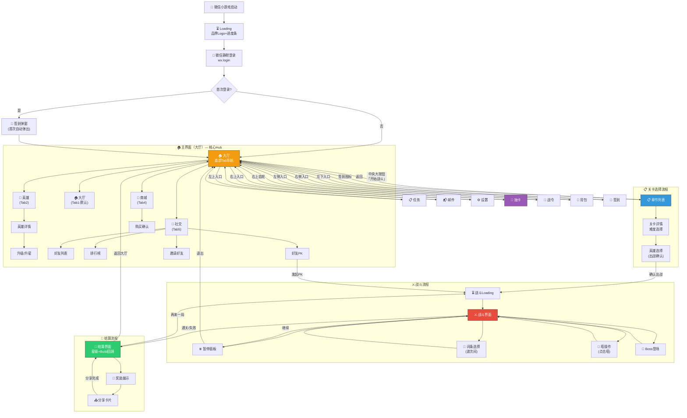
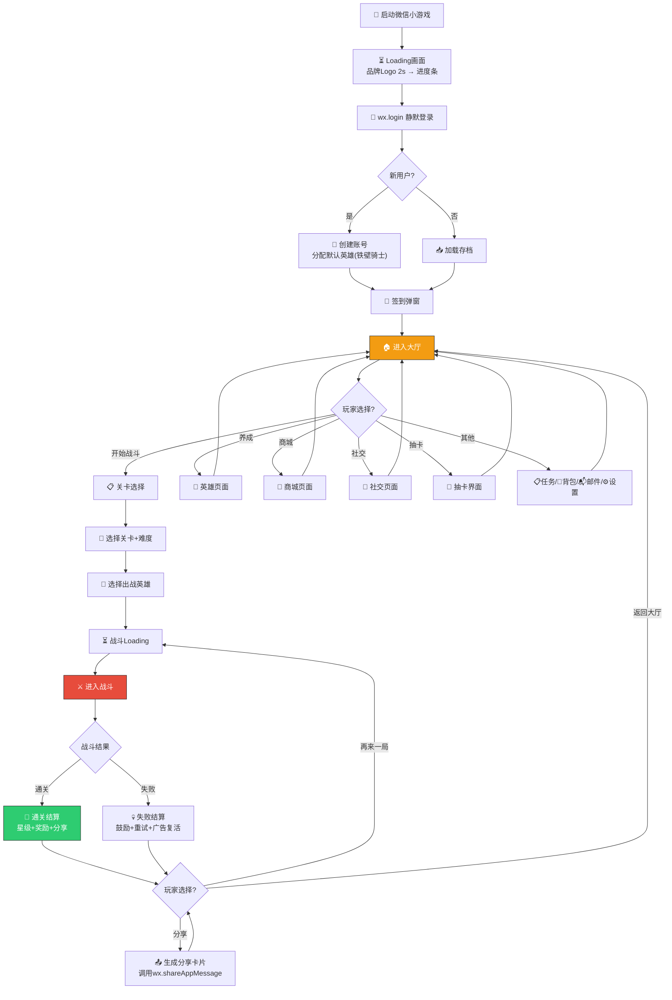
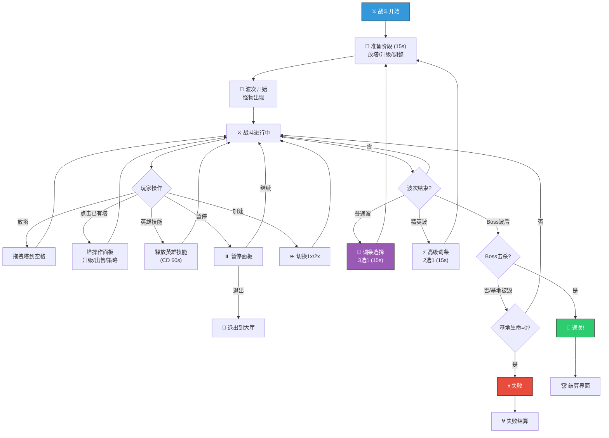
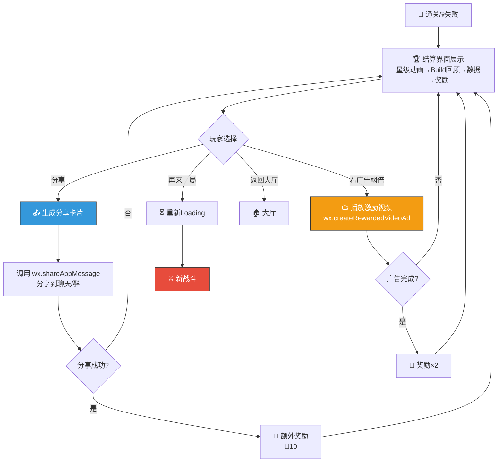


# 🖥️ AetheraSurvivors — UI/UX框架设计（#13）

> **文档版本**：v1.0
> **最后更新**：2026-03-24
> **交互编号**：阶段一 #13
> **前置依赖**：GDD.md（v1.0）、美术风格方案.md（#12 方案A「精致卡通」色板）
> **验收标准**：有完整的页面跳转流程图（覆盖所有一级页面）

---

## 一、UI设计基准与约束

### 1.1 屏幕规格

| 维度 | 值 | 说明 |
|------|------|------|
| **设计基准分辨率** | 720 × 1280 px（竖屏） | 16:9 竖屏，主流安卓/iOS通用 |
| **设计DPI** | 160 dpi（Unity标准） | Canvas Scaler: Scale With Screen Size |
| **匹配模式** | Match Width or Height = 0.5 | 宽高折中适配 |
| **安全区（顶部）** | 距顶 88px（刘海屏） | 避免刘海/状态栏遮挡 |
| **安全区（底部）** | 距底 34px（小横条） | 避免Home Indicator遮挡 |
| **有效设计区域** | 720 × 1158 px | 去除顶底安全区后的可用区域 |

### 1.2 触控规范

| 规范 | 值 | 说明 |
|------|------|------|
| **最小点击热区** | 88 × 88 px（44pt） | Apple HIG 标准 |
| **按钮最小尺寸** | 120 × 80 px | 保证手指精准点击 |
| **按钮间距** | ≥16 px | 防误触 |
| **拖拽灵敏度** | 移动>10px 判定为拖拽 | 区分点击和拖拽 |
| **长按阈值** | 500ms | 长按查看详情 |

### 1.3 色板引用（来自 #12 方案A「精致卡通」）

| UI用途 | 颜色 | 色值 |
|--------|------|------|
| **主按钮（CTA）** | 暖金 | `#F39C12` |
| **次按钮** | 天蓝 | `#3498DB` |
| **危险/取消** | 火红 | `#E74C3C` |
| **成功/确认** | 翠绿 | `#2ECC71` |
| **稀有/高亮** | 皇紫 | `#9B59B6` |
| **面板底色** | 深灰（85%透明度） | `#2C3E50 / D9` |
| **弹窗底色** | 浅灰 | `#ECF0F1` |
| **正文文字** | 深灰 | `#2C3E50` |
| **次要文字** | 中灰 | `#7F8C8D` |
| **白色文字（深底上）** | 白色 | `#FFFFFF` |
| **遮罩层** | 纯黑60%透明 | `#000000 / 99` |

### 1.4 UI层级规范（Unity Sorting Order）

| 层级 | Sorting Order | 内容 |
|------|--------------|------|
| **L0 背景层** | 0-99 | 地图/天空/装饰 |
| **L1 游戏对象层** | 100-199 | 塔/怪物/英雄/特效 |
| **L2 HUD层** | 200-299 | 战斗界面常驻UI（资源栏/塔选择栏） |
| **L3 弹窗层** | 300-399 | 词条选择/暂停面板/确认弹窗 |
| **L4 引导层** | 400-499 | 新手引导遮罩/指引箭头 |
| **L5 系统层** | 500-599 | Loading/Toast提示/网络异常 |

---

## 二、页面层级架构

### 2.1 全局页面树

```
🏠 主界面（大厅）                    ← 一级页面（常驻底部Tab导航）
├── 📋 关卡选择                      ← 一级页面
│   ├── 章节列表                     ← 二级
│   ├── 关卡详情（难度选择+出战）     ← 二级
│   └── 英雄选择（出战前）            ← 二级弹窗
│
├── 🦸 英雄                          ← 一级页面（Tab）
│   ├── 英雄列表                     ← 一级Tab内容
│   ├── 英雄详情                     ← 二级
│   │   ├── 升级面板                 ← 三级弹窗
│   │   ├── 升星面板                 ← 三级弹窗
│   │   └── 技能详情                 ← 三级弹窗
│   └── 英雄图鉴                     ← 二级
│
├── 🛒 商城                          ← 一级页面（Tab）
│   ├── 钻石商城                     ← 一级Tab内容
│   ├── 礼包商城                     ← 一级Tab内容
│   ├── 金币商城                     ← 一级Tab内容
│   └── 购买确认弹窗                 ← 二级弹窗
│
├── 👥 社交                          ← 一级页面（Tab）
│   ├── 好友列表                     ← 一级Tab内容
│   ├── 排行榜                       ← 一级Tab内容
│   │   ├── 好友排行                 ← 二级Tab
│   │   └── 全服排行                 ← 二级Tab
│   ├── 好友PK                       ← 二级
│   └── 邀请好友                     ← 二级
│
├── ⚔️ 战斗界面                      ← 特殊全屏页面
│   ├── HUD（常驻）                  ← 战斗内层级
│   ├── 塔操作面板（点击塔弹出）      ← 战斗内弹窗
│   ├── 词条选择面板（波次间弹出）    ← 战斗内弹窗
│   ├── 暂停面板                     ← 战斗内弹窗
│   └── Boss登场演出                 ← 战斗内全屏
│
├── 🎉 结算界面                      ← 特殊全屏页面
│   ├── 星级评定                     ← 结算内容
│   ├── Build回顾                    ← 结算内容
│   ├── 奖励展示                     ← 结算内容
│   └── 分享卡片                     ← 结算弹窗
│
├── 🎰 抽卡                          ← 一级弹窗（覆盖大厅）
│   ├── 单抽动画                     ← 二级
│   ├── 十连动画                     ← 二级
│   └── 结果展示                     ← 二级
│
├── 📜 战令                          ← 一级弹窗（覆盖大厅）
│   ├── 等级轨道（免费+付费双轨）    ← 内容
│   └── 购买战令弹窗                 ← 二级弹窗
│
├── 📋 任务                          ← 一级弹窗（覆盖大厅）
│   ├── 每日任务                     ← Tab内容
│   ├── 成就                         ← Tab内容
│   └── 活跃度宝箱                   ← 嵌入内容
│
├── 🎒 背包                          ← 一级弹窗（覆盖大厅）
│   ├── 道具列表                     ← 内容
│   └── 道具详情弹窗                 ← 二级弹窗
│
├── 📬 邮件                          ← 一级弹窗（覆盖大厅）
│   ├── 邮件列表                     ← 内容
│   └── 邮件详情                     ← 二级弹窗
│
├── ⚙️ 设置                          ← 一级弹窗（覆盖大厅）
│   ├── 音频设置                     ← 内容
│   ├── 画质设置                     ← 内容
│   ├── 账号信息                     ← 内容
│   └── 关于/反馈                    ← 内容
│
└── 📅 签到                          ← 一级弹窗（登录自动弹出）
    ├── 每日签到日历                 ← 内容
    └── 累计签到奖励                 ← 内容
```

### 2.2 一级页面清单（验收核心）

| # | 页面 | 类型 | 入口位置 | 说明 |
|---|------|------|---------|------|
| 1 | 🏠 **主界面（大厅）** | 常驻场景 | 登录后默认 | 核心Hub，所有功能入口 |
| 2 | 📋 **关卡选择** | 全屏页面 | 大厅-「开始战斗」按钮 | 章节/关卡/难度选择 |
| 3 | 🦸 **英雄** | Tab页面 | 底部Tab第2个 | 英雄列表+养成 |
| 4 | 🛒 **商城** | Tab页面 | 底部Tab第4个 | 钻石/礼包/金币商城 |
| 5 | 👥 **社交** | Tab页面 | 底部Tab第5个 | 好友/排行/PK/邀请 |
| 6 | ⚔️ **战斗界面** | 独立场景 | 关卡选择-确认出战 | 核心玩法界面 |
| 7 | 🎉 **结算界面** | 独立场景 | 战斗结束自动跳转 | 评分/奖励/分享 |
| 8 | 🎰 **抽卡** | 全屏弹窗 | 大厅-抽卡入口 | 英雄召唤 |
| 9 | 📜 **战令** | 全屏弹窗 | 大厅-战令入口 | 赛季通行证 |
| 10 | 📋 **任务** | 全屏弹窗 | 大厅-任务入口 | 每日/成就 |
| 11 | 🎒 **背包** | 全屏弹窗 | 大厅-背包入口 | 道具管理 |
| 12 | 📬 **邮件** | 全屏弹窗 | 大厅-邮件入口 | 系统邮件/奖励 |
| 13 | ⚙️ **设置** | 全屏弹窗 | 大厅-设置按钮 | 系统设置 |
| 14 | 📅 **签到** | 全屏弹窗 | 登录自动弹出/大厅签到入口 | 每日签到 |

---

## 三、全局页面跳转流程图

### 3.1 完整页面跳转流程图（覆盖所有一级页面）



### 3.2 页面跳转矩阵

| 起始页 → | 大厅 | 关卡选择 | 英雄 | 商城 | 社交 | 战斗 | 结算 | 抽卡 | 战令 | 任务 | 背包 | 邮件 | 设置 | 签到 |
|---------|------|---------|------|------|------|------|------|------|------|------|------|------|------|------|
| **大厅** | — | ✅ | ✅Tab | ✅Tab | ✅Tab | — | — | ✅ | ✅ | ✅ | ✅ | ✅ | ✅ | ✅ |
| **关卡选择** | ✅返回 | — | — | — | — | ✅出战 | — | — | — | — | — | — | — | — |
| **英雄** | ✅Tab | — | — | ✅Tab | ✅Tab | — | — | ✅快捷 | — | — | — | — | — | — |
| **商城** | ✅Tab | — | ✅Tab | — | ✅Tab | — | — | — | — | — | — | — | — | — |
| **社交** | ✅Tab | — | ✅Tab | ✅Tab | — | ✅PK | — | — | — | — | — | — | — | — |
| **战斗** | ✅退出 | — | — | — | — | — | ✅结束 | — | — | — | — | — | — | — |
| **结算** | ✅返回 | — | — | — | — | ✅再来 | — | — | — | — | — | — | — | — |
| **弹窗类** | ✅关闭 | — | — | — | — | — | — | — | — | — | — | — | — | — |

---

## 四、主界面（大厅）布局设计

### 4.1 线框图（720×1280）

```
┌─────────────────── 720px ───────────────────┐
│░░░░░░░░░░░░░ 安全区(88px) ░░░░░░░░░░░░░░░░░│ ← 刘海屏
├─────────────────────────────────────────────┤
│                                             │
│ ┌─ 顶部资源栏 ─────────────────────────────┐│ ← H:80px
│ │ [👤Lv.28]  💎1,250  🪙52,800  ⚡96/120  ││
│ │           [📬3] [⚙️]                     ││ ← 邮件+设置
│ └───────────────────────────────────────────┘│
│                                             │
│ ┌─ 活动Banner轮播 ─────────────────────────┐│ ← H:180px
│ │  ╔════════════════════════════════════╗   ││
│ │  ║  🔥 限时活动 / 战令推广 / 公告    ║   ││
│ │  ║     < ● ○ ○ >  自动轮播3s        ║   ││
│ │  ╚════════════════════════════════════╝   ││
│ └───────────────────────────────────────────┘│
│                                             │
│ ┌─ 主角色展示区 ───────────────────────────┐│ ← H:360px
│ │                                           ││
│ │         ┌──────────┐                      ││
│ │         │  🦸      │  ← 当前英雄         ││
│ │         │  立绘    │    (可左右滑动切换)   ││
│ │         │  待机动画│                      ││
│ │         └──────────┘                      ││
│ │                                           ││
│ │ ┌──────┐                    ┌──────┐     ││
│ │ │🎰抽卡│                    │📜战令│     ││ ← 左右浮动入口
│ │ └──────┘                    └──────┘     ││
│ │                                           ││
│ └───────────────────────────────────────────┘│
│                                             │
│ ┌─ 功能快捷入口 ───────────────────────────┐│ ← H:100px
│ │  [📅签到]  [📋任务]  [🎒背包]  [🏆成就] ││ ← 4个图标按钮
│ └───────────────────────────────────────────┘│
│                                             │
│           ╔══════════════════╗               │ ← 中央核心CTA
│           ║  ⚔️ 开始战斗     ║               │    W:320px H:88px
│           ║  (金色大按钮)    ║               │    #F39C12
│           ╚══════════════════╝               │
│                                             │
│ ┌─ 底部Tab导航栏 ──────────────────────────┐│ ← H:120px
│ │ [🏠大厅] [🦸英雄] [  ⚔️  ] [🛒商城] [👥社交]││
│ │  ★选中    普通    中间大   普通    普通   ││
│ └───────────────────────────────────────────┘│
├─────────────────────────────────────────────┤
│░░░░░░░░░░░░░ 安全区(34px) ░░░░░░░░░░░░░░░░░│ ← 底部安全区
└─────────────────────────────────────────────┘
```

### 4.2 大厅各区域详细说明

| 区域 | 高度 | 功能 | 交互 |
|------|------|------|------|
| **顶部资源栏** | 80px | 显示玩家等级/钻石/金币/体力 | 点击钻石→跳转商城；点击体力→体力购买弹窗 |
| **活动Banner** | 180px | 轮播3-5张活动海报 | 自动3s轮播；点击→对应活动页面；手动左右滑动 |
| **角色展示区** | 360px | 展示当前主力英雄立绘+待机动画 | 左右滑动切换英雄；点击英雄→英雄详情 |
| **快捷入口** | 100px | 签到/任务/背包/成就4个高频功能 | 点击→对应弹窗；有红点提示 |
| **开始战斗** | 88px | 核心CTA，进入关卡选择 | 点击→关卡选择页面；带弹性缩放动画 |
| **底部Tab** | 120px | 5个一级Tab页切换 | 点击切换Tab；中间战斗按钮突出设计 |

### 4.3 底部Tab导航详细设计

```
┌─────────────────── 720px ───────────────────┐
│                                             │
│  ┌──────┐ ┌──────┐ ┌────────┐ ┌──────┐ ┌──────┐  │
│  │ 🏠   │ │ 🦸   │ │  ⚔️    │ │ 🛒   │ │ 👥   │  │
│  │ 大厅 │ │ 英雄 │ │开始战斗│ │ 商城 │ │ 社交 │  │
│  │★金色 │ │      │ │(凸起大)│ │      │ │  🔴3│  │
│  └──────┘ └──────┘ └────────┘ └──────┘ └──────┘  │
│  144px    144px     144px      144px    144px     │
│                                             │
└─────────────────────────────────────────────┘

Tab状态：
- 未选中：图标灰色(#7F8C8D) + 文字灰色
- 选中：  图标金色(#F39C12) + 文字金色 + 下方2px金色指示条
- 中间Tab（开始战斗）：凸起设计，按钮底色#F39C12金色，比其他Tab高出20px
- 红点：右上角红色圆点(#E74C3C)，有数字显示未读数量
```

---

## 五、战斗界面布局设计

### 5.1 战斗界面线框图（720×1280）

```
┌─────────────────── 720px ───────────────────┐
│░░░░░░░░░░░░░ 安全区(88px) ░░░░░░░░░░░░░░░░░│
├─────────────────────────────────────────────┤
│                                             │
│ ┌─ 顶部HUD ───────────────────────────────┐│ ← H:70px
│ │ [⏸️] [❤️12/15]  💰2,450  [Wave 3/8] [⏩]││
│ │ 暂停  生命值     金币      波次    加速  ││
│ └───────────────────────────────────────────┘│
│                                             │
│ ┌─ 战斗区域（地图） ──────────────────────┐│ ← H:880px（核心区域）
│ │                                           ││
│ │  ┌────────────────────────────────────┐   ││
│ │  │            天空背景                 │   ││
│ │  │     🔮  ❄️                         │   ││ ← 已放置的塔
│ │  │ ════🟫🟫🟫🟫🟫🟫═══              │   ││ ← 怪物路径
│ │  │      🏹 💣  ←←← 👹👹👹           │   ││ ← 怪物行进
│ │  │ ════🟫🟫🟫🟫🟫🟫═══              │   ││
│ │  │         ☠️                          │   ││
│ │  │              🟫🟫🟫🟫🟫══→ 🏰基地 │   ││ ← 基地（终点）
│ │  │                                     │   ││
│ │  │  🦸英雄                             │   ││ ← 英雄站位
│ │  │  [🌟技能CD:15s]                     │   ││ ← 英雄技能按钮
│ │  │                                     │   ││
│ │  └────────────────────────────────────┘   ││
│ │                                           ││
│ │  空白格子可放塔 ░░（高亮显示可放置区域）  ││
│ │                                           ││
│ └───────────────────────────────────────────┘│
│                                             │
│ ┌─ 底部塔选择栏 ──────────────────────────┐│ ← H:140px
│ │                                           ││
│ │  ┌────┐ ┌────┐ ┌────┐ ┌────┐ ┌────┐ ┌────┐ ││
│ │  │🏹  │ │🔮  │ │❄️  │ │💣  │ │☠️  │ │⛏️  │ ││
│ │  │箭塔│ │法塔│ │冰塔│ │炮塔│ │毒塔│ │金矿│ ││
│ │  │80💰│ │100 │ │90  │ │120 │ │110 │ │150 │ ││
│ │  └────┘ └────┘ └────┘ └────┘ └────┘ └────┘ ││
│ │   102px × 6 = 612px (两侧各留54px)        ││
│ │                                           ││
│ └───────────────────────────────────────────┘│
├─────────────────────────────────────────────┤
│░░░░░░░░░░░░░ 安全区(34px) ░░░░░░░░░░░░░░░░░│
└─────────────────────────────────────────────┘
```

### 5.2 战斗HUD分区详细说明

| 区域 | 位置 | 尺寸 | 内容 | 交互 |
|------|------|------|------|------|
| **暂停按钮** | 左上 | 60×60px | ⏸️ 图标 | 点击→暂停面板 |
| **生命值** | 顶部偏左 | 180×50px | ❤️图标+数值（当前/最大） | 低于30%时红色闪烁警告 |
| **金币** | 顶部中间 | 150×50px | 💰图标+数值 | 获得金币时数字跳动+绿色 |
| **波次指示** | 顶部偏右 | 180×50px | 「Wave 3/8」+进度条 | 显示当前波/总波数 |
| **加速按钮** | 右上 | 60×60px | ⏩ 1x/2x 切换 | 点击切换速度，2x时图标变色 |
| **英雄技能** | 地图左下 | 80×80px | 英雄头像+CD圈 | 可用时发光提示，点击释放 |
| **塔选择栏** | 底部固定 | 720×140px | 6个塔图标+价格 | 长按预览详情，拖拽放置 |

### 5.3 塔操作面板（点击已有塔弹出）

```
                    点击塔后弹出（塔上方）
                    ┌───────────────────┐
                    │   🏹 箭塔 Lv.2    │ ← 塔名+等级
                    │ ATK:45  SPD:1.2s  │ ← 属性
                    │ Range: [可视化圈]  │ ← 射程
                    │                   │
                    │ ┌─────┐ ┌─────┐  │
                    │ │⬆️升级│ │💰出售 │  │ ← 两个操作按钮
                    │ │60💰  │ │返40💰│  │
                    │ └─────┘ └─────┘  │
                    │                   │
                    │ ┌─────────────┐  │
                    │ │🎯 目标策略   │  │ ← 目标选择
                    │ │最近|最前|最弱|最强│
                    │ └─────────────┘  │
                    └───────────────────┘
```

### 5.4 词条选择面板（波次间弹出）

```
┌─────────────────── 720px ───────────────────┐
│                                             │
│  ┌─ 半透明遮罩(黑色60%) ───────────────────┐│
│  │                                           ││
│  │        💎 选择你的强化词条                ││ ← 标题
│  │           ⏰ 12秒                         ││ ← 倒计时
│  │                                           ││
│  │   ┌──────┐  ┌──────┐  ┌──────┐           ││
│  │   │⬜白色│  │🔵蓝色│  │⬜白色│           ││ ← 稀有度边框
│  │   │      │  │      │  │      │           ││
│  │   │ ⚔️   │  │ 🔥   │  │ 💰   │           ││ ← 类型图标
│  │   │      │  │      │  │      │           ││
│  │   │ 锋利 │  │火焰  │  │ 赏金 │           ││ ← 词条名
│  │   │      │  │附魔  │  │ 猎人 │           ││
│  │   │全塔   │  │攻击附│  │击杀  │           ││ ← 简要说明
│  │   │伤害   │  │带灼烧│  │金币  │           ││
│  │   │+8%   │  │30%   │  │+15% │           ││
│  │   │      │  │⭐推荐│  │      │           ││ ← 推荐标签
│  │   │ 200  │  │ 200  │  │ 200  │           ││ ← 卡片尺寸
│  │   │ ×    │  │ ×    │  │ ×    │           ││
│  │   │ 280  │  │ 280  │  │ 280  │           ││
│  │   └──────┘  └──────┘  └──────┘           ││
│  │   ← 200px →  ← 200px →  ← 200px →       ││ ← 间距30px
│  │                                           ││
│  │   「长按查看词条详情」                     ││ ← 提示文字
│  │                                           ││
│  └───────────────────────────────────────────┘│
│                                             │
└─────────────────────────────────────────────┘

交互动效：
1. 3张卡片从下方飞入（弹性动画 EaseOutBack，0.3s）
2. 选中卡片放大1.1x+金色边框
3. 未选卡片缩小0.9x+灰色化
4. 选中后卡片飞向顶部HUD消失（0.2s）
5. 长按0.5s弹出详情浮窗（不遮挡其他卡片）
6. 超时12s未选→自动随机选择+抖动提醒
```

### 5.5 暂停面板

```
┌────────────── 居中弹窗 ──────────────┐
│                                       │
│           ⏸️ 游戏暂停                 │ ← 标题
│                                       │
│     ┌──────────────────────┐         │
│     │ 🔊 音量  ═══●══════ │         │ ← 音量滑条
│     │ 🎵 音效  ═══════●══ │         │ ← 音效滑条
│     └──────────────────────┘         │
│                                       │
│     ╔══════════════════════╗         │
│     ║   ▶️ 继续游戏        ║         │ ← 主按钮(#2ECC71)
│     ╚══════════════════════╝         │
│                                       │
│     ┌──────────────────────┐         │
│     │   🔄 重新开始         │         │ ← 次按钮(#3498DB)
│     └──────────────────────┘         │
│                                       │
│     ┌──────────────────────┐         │
│     │   🚪 退出关卡         │         │ ← 危险按钮(#E74C3C)
│     └──────────────────────┘         │
│                                       │
└───────────────────────────────────────┘
```

---

## 六、关卡选择界面

### 6.1 章节列表（竖向滚动）

```
┌─────────────────── 720px ───────────────────┐
│                                             │
│ ┌─ 顶栏 ──────────────────────────────────┐│
│ │ [←返回]    📋 关卡选择    ⚡96/120       ││
│ └───────────────────────────────────────────┘│
│                                             │
│ ┌─ 章节列表（竖向ScrollView） ────────────┐│
│ │                                           ││
│ │  ╔═══════════════════════════════════╗    ││
│ │  ║ 第1章 · 新手之路                  ║    ││ ← 当前章节(高亮)
│ │  ║ ⭐⭐⭐ ⭐⭐⭐ ⭐⭐☆ ⭐☆☆ ⬜     ║    ││ ← 5关星级
│ │  ║ 进度: 3/5                         ║    ││
│ │  ╚═══════════════════════════════════╝    ││
│ │                                           ││
│ │  ┌───────────────────────────────────┐    ││
│ │  │ 第2章 · 觉醒之森                  │    ││ ← 已解锁未完成
│ │  │ ⬜ ⬜ ⬜ ⬜ ⬜                     │    ││
│ │  │ 进度: 0/5                         │    ││
│ │  └───────────────────────────────────┘    ││
│ │                                           ││
│ │  ┌───────────────────────────────────┐    ││
│ │  │ 🔒 第3章 · 冰霜山脉               │    ││ ← 未解锁(灰色)
│ │  │ 解锁条件: 通关第2章第5关           │    ││
│ │  └───────────────────────────────────┘    ││
│ │                                           ││
│ │  ... 更多章节 ...                         ││
│ │                                           ││
│ └───────────────────────────────────────────┘│
│                                             │
└─────────────────────────────────────────────┘
```

### 6.2 关卡详情弹窗

```
┌────────────── 居中弹窗 550×700 ──────────────┐
│                                               │
│  ┌─ 关卡信息 ──────────────────────────────┐ │
│  │  第1章 - 第3关                            │ │
│  │  ⭐⭐☆ (最佳记录: 2星)                   │ │
│  │                                           │ │
│  │  难度选择:                                │ │
│  │  [✅普通] [🔒困难] [🔒噩梦]              │ │
│  │                                           │ │
│  │  波次: 8波 + 1 Boss                       │ │
│  │  怪物: 👹步兵 🗡️刺客 🛡️骑士             │ │
│  │  Boss: 🐉 火龙                            │ │
│  │                                           │ │
│  │  消耗: ⚡6 体力                           │ │
│  │                                           │ │
│  │  ┌────────────────────────────┐           │ │
│  │  │ 首通奖励:                   │           │ │
│  │  │ 💎50 + 📕经验书×2 + 🧩碎片×5│          │ │
│  │  └────────────────────────────┘           │ │
│  └───────────────────────────────────────────┘ │
│                                               │
│  ╔════════════════════════════════════════╗   │
│  ║  🦸 选择英雄出战                       ║   │ ← 点击进入英雄选择
│  ╚════════════════════════════════════════╝   │
│                                               │
│  ┌────────────────────────────────────────┐   │
│  │  ❌ 取消                                │   │
│  └────────────────────────────────────────┘   │
│                                               │
└───────────────────────────────────────────────┘
```

---

## 七、结算界面布局

### 7.1 通关结算线框

```
┌─────────────────── 720px ───────────────────┐
│                                             │
│              🎉 关卡通关！                   │ ← 大字标题+庆祝粒子
│                                             │
│         ⭐    ⭐    ⭐                       │ ← 星级评定动画
│         (依次亮起, 0.3s间隔)                  │
│                                             │
│ ┌─ Build回顾 ────────────────────────────┐ │ ← 横向展示本局词条
│ │ [⚔️锋利] [🔥火焰附魔] [⚡急速]          │ │
│ │ [🎯暴击强化] [⚡连锁闪电]               │ │
│ │                                         │ │
│ │ Build路线: 🔴暴力DPS流                   │ │
│ │ Build评分: S级 (95/100)                  │ │
│ └─────────────────────────────────────────┘ │
│                                             │
│ ┌─ 战斗数据 ────────────────────────────┐  │
│ │ ⚔️总伤害: 125,840                      │  │
│ │ 🏹最高DPS塔: 箭塔Lv.3 (38,200)         │  │
│ │ 💀击杀数: 142                           │  │
│ │ 🛡️剩余生命: 15/15 (完美!)              │  │
│ └─────────────────────────────────────────┘ │
│                                             │
│ ┌─ 奖励 ────────────────────────────────┐  │
│ │  💎50  📕×2  🧩×5  🪙3,200             │  │ ← 奖励图标依次飞入
│ │  [📺 看广告 ×2 奖励]                    │  │ ← 广告激励(可选)
│ └─────────────────────────────────────────┘ │
│                                             │
│ ╔════════════════╗  ╔════════════════╗     │
│ ║ 📤 分享战绩    ║  ║ ⚔️ 再来一局    ║     │ ← 双CTA
│ ║  (蓝色)        ║  ║  (金色)        ║     │
│ ╚════════════════╝  ╚════════════════╝     │
│                                             │
│     ┌──────────────────────┐               │
│     │  🏠 返回大厅          │               │ ← 次要按钮
│     └──────────────────────┘               │
│                                             │
└─────────────────────────────────────────────┘

动效时序：
0.0s  背景虚化+金色粒子飘落
0.3s  「关卡通关！」文字弹入
0.5s  第1颗星亮起(旋转+放大)
0.8s  第2颗星亮起
1.1s  第3颗星亮起(如果有)
1.5s  Build回顾区域滑入
2.0s  战斗数据数字滚动显示
2.5s  奖励图标依次飞入(0.2s间隔)
3.0s  按钮淡入可操作
```

---

## 八、英雄页面布局

### 8.1 英雄列表（Tab2内容）

```
┌─────────────────── 720px ───────────────────┐
│                                             │
│ ┌─ 顶栏 ──────────────────────────────────┐│
│ │         🦸 英雄                           ││
│ └───────────────────────────────────────────┘│
│                                             │
│ ┌─ 筛选栏 ─────────────────────────────────┐│
│ │ [全部] [R] [SR] [SSR]  排序:▼            ││
│ └───────────────────────────────────────────┘│
│                                             │
│ ┌─ 英雄Grid (3列) ────────────────────────┐│
│ │                                           ││
│ │  ┌──────┐  ┌──────┐  ┌──────┐           ││
│ │  │⚔️    │  │🏹    │  │❄️    │           ││
│ │  │铁壁   │  │精灵   │  │霜雪  │           ││
│ │  │骑士   │  │射手   │  │女巫  │           ││
│ │  │Lv.28 │  │Lv.15 │  │Lv.22 │           ││
│ │  │⭐⭐⭐│  │⭐⭐  │  │⭐⭐⭐│           ││
│ │  │[R]   │  │[R]   │  │[SR]  │           ││
│ │  └──────┘  └──────┘  └──────┘           ││
│ │   216px      216px     216px              ││ ← 间距 24px
│ │                                           ││
│ │  ┌──────┐  ┌──────┐  ┌──────┐           ││
│ │  │🔥    │  │💰    │  │🌟    │           ││
│ │  │炎魔   │  │矮人   │  │天选者│           ││
│ │  │法师   │  │矿工   │  │      │           ││
│ │  │Lv.1  │  │🔒未获│  │🔒未获│           ││
│ │  │⭐    │  │得     │  │得     │           ││
│ │  │[SR]  │  │[SR]  │  │[SSR] │           ││
│ │  └──────┘  └──────┘  └──────┘           ││
│ │                                           ││
│ └───────────────────────────────────────────┘│
│                                             │
│ ┌─ 底部Tab导航栏（同大厅） ────────────────┐│
│ │ [🏠大厅] [🦸英雄★] [⚔️] [🛒商城] [👥社交]││
│ └───────────────────────────────────────────┘│
│                                             │
└─────────────────────────────────────────────┘
```

---

## 九、抽卡界面布局

### 9.1 抽卡主界面

```
┌─────────────────── 720px ───────────────────┐
│                                             │
│ ┌─ 顶栏 ──────────────────────────────────┐│
│ │ [←关闭]    🎰 英雄召唤    💎1,250       ││
│ └───────────────────────────────────────────┘│
│                                             │
│ ┌─ 卡池展示区 ─────────────────────────────┐│ ← H:500px
│ │                                           ││
│ │          🌟 精选英雄UP池                   ││ ← 卡池名称
│ │                                           ││
│ │        ┌────────────────┐                 ││
│ │        │  🌟 天选者      │                 ││ ← UP角色立绘
│ │        │  (SSR)          │                 ││
│ │        │  概率UP!         │                 ││
│ │        └────────────────┘                 ││
│ │                                           ││
│ │    剩余保底: 35次                          ││ ← 保底计数
│ │    [📊 概率公示]                           ││ ← 概率查看
│ │                                           ││
│ └───────────────────────────────────────────┘│
│                                             │
│ ┌─ 抽卡按钮区 ─────────────────────────────┐│ ← H:200px
│ │                                           ││
│ │  ╔══════════╗      ╔══════════╗          ││
│ │  ║ 单抽×1   ║      ║ 十连×10  ║          ││
│ │  ║ 💎150    ║      ║ 💎1,500  ║          ││ ← 金色按钮
│ │  ║ 或🎫×1   ║      ║ 或🎫×10  ║          ││
│ │  ╚══════════╝      ╚══════════╝          ││
│ │                                           ││
│ │  [每日免费单抽 ✅已用] [🎫召唤券: 3张]     ││
│ │                                           ││
│ └───────────────────────────────────────────┘│
│                                             │
└─────────────────────────────────────────────┘
```

---

## 十、商城界面布局

### 10.1 商城主界面

```
┌─────────────────── 720px ───────────────────┐
│                                             │
│ ┌─ 顶栏 ──────────────────────────────────┐│
│ │         🛒 商城       💎1,250  🪙52,800  ││
│ └───────────────────────────────────────────┘│
│                                             │
│ ┌─ 商城Tab ───────────────────────────────┐│ ← H:60px
│ │ [💎充值]  [🎁礼包]  [🪙金币]  [⚡体力]  ││
│ └───────────────────────────────────────────┘│
│                                             │
│ ┌─ 商品列表（竖向滚动） ──────────────────┐│
│ │                                           ││
│ │  ╔═══════════════════════════════════╗    ││ ← 限时置顶推荐
│ │  ║ 🔥 首充礼包 ¥6                    ║    ││
│ │  ║ SSR碎片×30 + 💎500 + 🎫×3        ║    ││
│ │  ║         [立即购买]                 ║    ││
│ │  ╚═══════════════════════════════════╝    ││
│ │                                           ││
│ │  ┌──────────┐  ┌──────────┐              ││ ← 两列Grid
│ │  │ 💎60      │  │ 💎300     │              ││
│ │  │ ¥6        │  │ ¥30       │              ││
│ │  │ +首充翻倍 │  │ +赠50💎   │              ││
│ │  └──────────┘  └──────────┘              ││
│ │                                           ││
│ │  ┌──────────┐  ┌──────────┐              ││
│ │  │ 💎680     │  │ 💎1280    │              ││
│ │  │ ¥68       │  │ ¥128      │              ││
│ │  │ +赠80💎   │  │ +赠200💎  │              ││
│ │  └──────────┘  └──────────┘              ││
│ │                                           ││
│ │  ... 更多商品 ...                         ││
│ │                                           ││
│ └───────────────────────────────────────────┘│
│                                             │
│ ┌─ 底部Tab导航栏 ──────────────────────────┐│
│ │ [🏠大厅] [🦸英雄] [⚔️] [🛒商城★] [👥社交]││
│ └───────────────────────────────────────────┘│
│                                             │
└─────────────────────────────────────────────┘
```

---

## 十一、社交界面布局

### 11.1 社交主界面

```
┌─────────────────── 720px ───────────────────┐
│                                             │
│ ┌─ 顶栏 ──────────────────────────────────┐│
│ │         👥 社交                           ││
│ └───────────────────────────────────────────┘│
│                                             │
│ ┌─ 社交Tab ───────────────────────────────┐│
│ │ [👥好友]  [🏆排行]  [⚔️PK]  [📨邀请]   ││
│ └───────────────────────────────────────────┘│
│                                             │
│ ┌─ 好友列表（示例） ─────────────────────┐  │
│ │                                           ││
│ │  ┌──────────────────────────────────┐    ││
│ │  │ [头像] 张三  Lv.35               │    ││
│ │  │        最高DPS: 28,400            │    ││
│ │  │ [🎁送体力] [⚔️发起PK] [👀查看]  │    ││
│ │  └──────────────────────────────────┘    ││
│ │                                           ││
│ │  ┌──────────────────────────────────┐    ││
│ │  │ [头像] 李四  Lv.28               │    ││
│ │  │        最高DPS: 22,100            │    ││
│ │  │ [🎁已送] [⚔️发起PK] [👀查看]    │    ││
│ │  └──────────────────────────────────┘    ││
│ │                                           ││
│ │  ... 更多好友 ...                         ││
│ │                                           ││
│ └───────────────────────────────────────────┘│
│                                             │
│ ┌─ 底部Tab导航栏 ──────────────────────────┐│
│ │ [🏠大厅] [🦸英雄] [⚔️] [🛒商城] [👥社交★]││
│ └───────────────────────────────────────────┘│
│                                             │
└─────────────────────────────────────────────┘
```

---

## 十二、核心操作流程图

### 12.1 完整游戏流程（从启动到退出）



### 12.2 单局战斗内操作流程



### 12.3 结算→分享→再来一局 流程



---

## 十三、弹窗层级与规范

### 13.1 弹窗分类

| 弹窗类型 | 层级 | 遮罩 | 关闭方式 | 说明 |
|---------|------|------|---------|------|
| **信息提示(Toast)** | L5 | 无 | 2s自动消失 | 「金币不足」「体力不足」 |
| **确认弹窗** | L3 | 黑色60% | 按钮关闭 | 「确定购买？」「确定退出？」 |
| **功能弹窗** | L3 | 黑色60% | 右上×/返回键 | 签到/任务/背包/邮件/设置 |
| **全屏弹窗** | L3 | 覆盖底部 | 左上返回按钮 | 抽卡/战令 |
| **引导弹窗** | L4 | 高亮目标 | 完成操作关闭 | 新手引导蒙版+指引 |
| **系统弹窗** | L5 | 黑色80% | 无法关闭/按钮关闭 | 网络异常/版本更新 |

### 13.2 弹窗设计规范

```
通用弹窗模板（确认类）：
┌──────────── 550×380 ────────────┐
│                                  │
│  [×]                             │ ← 右上关闭(40×40)
│                                  │
│         📢 标题文字               │ ← 18px 粗体 #2C3E50
│                                  │
│    正文内容说明文字               │ ← 16px 普通 #7F8C8D
│    最多3行，超出省略              │
│                                  │
│  ╔═══════════╗ ╔═══════════╗    │
│  ║  ❌ 取消  ║ ║  ✅ 确认  ║    │ ← 左灰(#BDC3C7) 右金(#F39C12)
│  ╚═══════════╝ ╚═══════════╝    │    按钮 200×60px
│                                  │
└──────────────────────────────────┘

弹窗动效：
- 打开：从0.8x缩放到1.0x (EaseOutBack, 0.25s) + 遮罩淡入0.15s
- 关闭：从1.0x缩放到0.8x (EaseIn, 0.15s) + 遮罩淡出0.1s
- 遮罩点击：非内容区域点击可关闭（可配置）
```

### 13.3 弹窗堆叠规则

| 规则 | 说明 |
|------|------|
| **同级互斥** | 同层级弹窗打开新的时，旧的自动关闭 |
| **高级覆盖** | 高层级弹窗可以覆盖低层级 |
| **Toast不阻塞** | Toast提示不阻塞任何操作 |
| **系统最优先** | 系统弹窗（网络异常/更新）覆盖一切 |
| **最多叠2层** | 避免弹窗嵌套过深，最多2层弹窗叠加 |

---

## 十四、竖屏适配规范

### 14.1 屏幕比例适配策略

| 屏幕比例 | 典型设备 | 适配策略 |
|---------|---------|---------|
| **16:9** (基准) | 大多数安卓 | 无需适配 |
| **18:9** | 全面屏安卓 | 上下各增加40px空白，内容不变 |
| **19.5:9** | iPhone X系列 | 刘海区留空88px，底部留空34px |
| **20:9** | 新款安卓 | 同19.5:9策略 |
| **4:3** | iPad(极少数) | 左右裁剪，确保核心区域可见 |

### 14.2 安全区适配实现

```
Unity Canvas设置:
├── Canvas Scaler
│   ├── UI Scale Mode: Scale With Screen Size
│   ├── Reference Resolution: 720 × 1280
│   ├── Screen Match Mode: Match Width Or Height
│   └── Match: 0.5
│
├── SafeArea适配脚本 (挂载在根节点)
│   ├── 读取 Screen.safeArea
│   ├── 顶部偏移: Max(safeArea.y, 88px)
│   └── 底部偏移: Max(Screen.height - safeArea.yMax, 34px)
│
└── 锚点规则
    ├── 顶部UI → Anchor Top + SafeArea Offset
    ├── 底部UI → Anchor Bottom + SafeArea Offset
    ├── 全屏UI → Stretch + SafeArea Padding
    └── 战斗地图 → Stretch (忽略安全区，全屏沉浸)
```

### 14.3 横竖屏策略

| 策略 | 说明 |
|------|------|
| **锁定竖屏** | 整个游戏锁定竖屏方向 |
| **不支持横屏** | 微信小游戏配置 `"deviceOrientation": "portrait"` |
| **原因** | 单手操作友好+碎片化场景适配+微信生态原生竖屏 |

---

## 十五、UI动效规范

### 15.1 通用动效时间表

| 动效类型 | 时长 | 曲线 | 说明 |
|---------|------|------|------|
| **页面切换** | 0.3s | EaseInOut | Tab切换/页面进出 |
| **弹窗打开** | 0.25s | EaseOutBack | 略带回弹感 |
| **弹窗关闭** | 0.15s | EaseIn | 快速消失 |
| **按钮点击** | 0.1s | EaseOut | 缩小到0.95x→回弹到1.0x |
| **元素飞入** | 0.3s | EaseOutCubic | 奖励/词条卡片飞入 |
| **数字滚动** | 0.5s | EaseOut | 金币/伤害数字变化 |
| **Toast** | 2.0s | 淡入0.15s→停留1.5s→淡出0.35s | 信息提示 |
| **红点出现** | 0.2s | Bounce | 红点弹出 |

### 15.2 战斗界面特殊动效

| 动效 | 触发 | 表现 | 时长 |
|------|------|------|------|
| **放塔成功** | 拖拽释放 | 塔从小到大+地面光环扩散 | 0.3s |
| **塔升级** | 升级确认 | 白光从下到上扫过+星星粒子 | 0.5s |
| **伤害飘字** | 怪物受击 | 数字弹出+上漂+淡出 | 0.8s |
| **暴击飘字** | 暴击触发 | 数字放大1.5x+红色+震动 | 0.8s |
| **波次警告** | 新波开始前 | 屏幕边缘红色闪烁+「Wave X」文字 | 1.0s |
| **Boss登场** | Boss波开始 | 全屏暗化→聚光→Boss走入→名字+血条 | 2.0s |
| **通关庆祝** | 通关瞬间 | 白色闪光→金色粒子雨→文字弹入 | 1.5s |

---

## 十六、红点系统规范

### 16.1 红点规则

| 入口 | 红点条件 | 消失条件 |
|------|---------|---------|
| **签到** | 今日未签到 | 签到完成 |
| **任务** | 有可领取奖励的任务 | 所有奖励已领取 |
| **邮件** | 有未读邮件 | 全部已读 |
| **英雄** | 有可升级/升星的英雄 | 所有可操作英雄已处理 |
| **商城** | 有免费领取/每日首充 | 领取完成 |
| **抽卡** | 有免费抽卡次数 | 抽完 |
| **战令** | 有未领取的战令奖励 | 全部领取 |
| **背包** | 有新获得的道具 | 查看过 |

### 16.2 红点传递规则

```
红点向上传递（子页面有红点 → 父入口显示红点）

🏠 大厅
├── 📅签到 🔴 → 大厅签到入口 🔴
├── 📋任务 🔴 → 大厅任务入口 🔴
├── 📬邮件 🔴3 → 大厅邮件图标 🔴3
├── 🦸英雄Tab 🔴 → 底部英雄Tab 🔴
│   └── 英雄详情(铁壁骑士) 🔴 → 英雄列表中该英雄 🔴
├── 🛒商城Tab 🔴 → 底部商城Tab 🔴
│   └── 💎充值(首充) 🔴 → 商城充值Tab 🔴
└── 🎰抽卡 🔴 → 大厅抽卡入口 🔴
```

---

## 十七、验收自检

| 验收标准 | 要求 | 实际 | 状态 |
|---------|------|------|------|
| ✅ **主界面布局** | 有主界面(大厅)布局设计 | §四 完整线框+各区域说明+底部Tab设计 | ✅ |
| ✅ **战斗界面布局** | 有战斗界面布局设计 | §五 完整HUD+塔选择栏+塔操作面板+词条选择面板+暂停面板 | ✅ |
| ✅ **核心操作流程图** | 有核心操作流程图 | §十二 完整游戏流程(3个Mermaid)+单局战斗流程+结算流程 | ✅ |
| ✅ **页面跳转流程图** | 有完整页面跳转流程图（覆盖所有一级页面） | §三 覆盖全部14个一级页面的完整跳转图+跳转矩阵 | ✅ |
| 页面层级架构 | 有页面树 | §二 3级页面树+14个一级页面清单 | ✅ |
| 各一级页面线框 | 每个页面有线框 | §四-§十一 大厅/战斗/关卡/结算/英雄/抽卡/商城/社交 | ✅ |
| UI规范 | 有基本UI规范 | §一 触控规范+色板+层级规范 | ✅ |
| 弹窗规范 | 有弹窗设计 | §十三 6种弹窗类型+堆叠规则 | ✅ |
| 竖屏适配 | 有适配方案 | §十四 5种屏幕比例适配策略 | ✅ |
| 动效规范 | 有动效时间表 | §十五 通用动效+战斗特殊动效 | ✅ |
| 红点系统 | 有红点规则 | §十六 8种红点+传递规则 | ✅ |

---

## 附录：设计变更日志

| 版本 | 变更 | 原因 |
|------|------|------|
| v1.0 | 初始UI/UX框架设计 | 阶段一 #13 |

---

> 📝 **文档维护规则**：
> 1. 本文档的色板引用自 #12 美术风格方案 方案A，如方案变更需同步更新
> 2. #14 视觉规范完成后，本文档的色板/字体/按钮细节以#14为准
> 3. 实际开发中页面可能增减，需同步更新页面跳转流程图
> 4. 战斗界面线框在阶段三原型验证后可能调整布局
