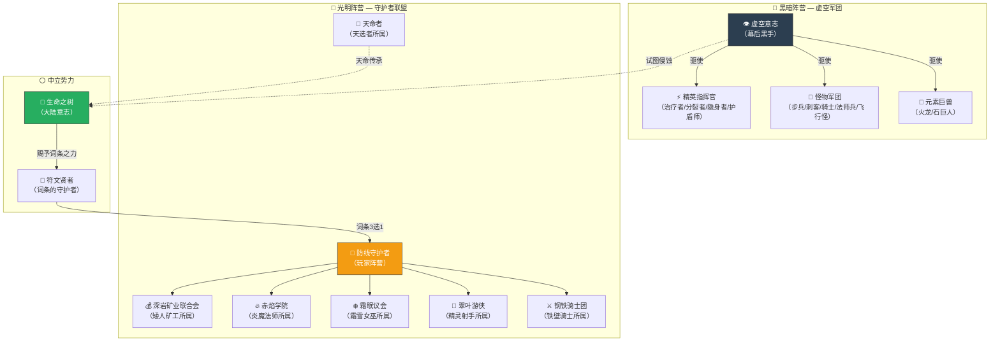
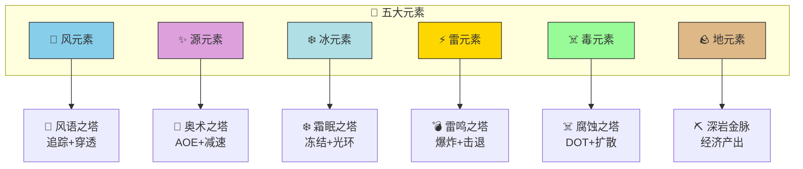
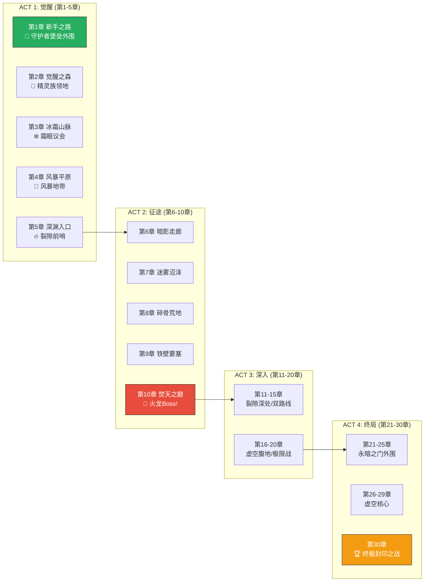


# 🌍 AetheraSurvivors — 世界观设计文档

> **文档版本**：v1.0
> **最后更新**：2026-03-24
> **交互编号**：阶段一 #24
> **前置依赖**：GDD.md、英雄系统骨架设计.md、怪物体系设计.md、新手引导流程设计.md
> **验收标准**：✅ 100字内能说清核心冲突

---

## 〇、核心冲突（100字版）

> **千年前，「虚空裂隙」撕开了大陆的屏障，黑暗潮汐从裂隙中涌出无尽怪物军团。守护者们筑起防线、建造魔导塔阵抵御入侵。如今裂隙再度活跃，新一代守护者必须重拾古老的防塔技艺，锻造命运词条之力，在三十道防线中逐一击退黑暗——否则大陆将彻底沦陷。**

（97字）

---

## 一、世界背景

### 1.1 大陆名称：艾瑟拉大陆（Aetherra）

艾瑟拉是一片被五种元素之力（火、冰、雷、毒、源）所守护的古老大陆。大陆中央是「生命之树」——一棵通天巨树，其根系延伸至大陆每个角落，为万物提供生机。

### 1.2 千年前的浩劫：「大断裂」

一千年前，大陆东方的天穹突然碎裂，出现了一道巨大的虚空裂隙——「永暗之门」。从裂隙中涌出无尽的黑暗生物：步兵、刺客、骑士、法师……它们不是独立的种族，而是被一种名为「虚空意志」的邪恶力量所驱使的傀儡军团。

当年的「初代守护者」——五位传奇英雄——发明了「防塔之术」：利用大陆的元素之力，将其凝聚成不同属性的防御塔阵，在关键路径上层层阻截怪物入侵。他们建造了三十道防线，从大陆边缘一直延伸到生命之树脚下，终于封印了永暗之门。

### 1.3 如今：裂隙再度活跃

一千年后的今天，封印逐渐衰弱。永暗之门再度亮起诡异的光芒，黑暗潮汐卷土重来。三十道古老防线年久失修，沿途的防塔已经崩塌。

新一代守护者挺身而出——他们继承了初代守护者的技艺，同时发现了更强大的力量：**命运词条**。这些刻印在古老符文上的力量碎片，能在战斗中赋予防塔全新的能力，每次战斗都会随机出现不同的词条组合，带来完全不同的战斗体验。

---

## 二、势力划分

### 2.1 势力关系图



### 2.2 光明阵营详细设定

#### 🏰 防线守护者（玩家阵营）

| 维度 | 设定 |
|------|------|
| **身份** | 玩家扮演新一代防线守护者，继承古老的防塔之术 |
| **使命** | 重建三十道防线，逐步从边境推进至永暗之门，最终重新封印裂隙 |
| **核心能力** | 建造元素防塔 + 指挥英雄 + 锻造词条 |
| **大本营** | 守护者堡垒（主界面场景） |

#### ⚔️ 钢铁骑士团

| 维度 | 设定 |
|------|------|
| **理念** | 「盾在人在，盾破人亡」——绝对的防御优先 |
| **特征** | 重甲战士组成的精英骑士团，守护大陆最前线 |
| **代表英雄** | ⚔️ 铁壁骑士 |
| **势力色** | 银白色+钢蓝色 |
| **与玩家关系** | 教学阶段（第1-3章）的主要同盟，铁壁骑士是玩家最初的伙伴 |

#### 🏹 翠叶游侠

| 维度 | 设定 |
|------|------|
| **理念** | 「箭无虚发，猎无遗漏」——精准打击，一箭穿心 |
| **特征** | 精灵族远程射手组成的游击部队，擅长在森林中伏击 |
| **代表英雄** | 🏹 精灵射手 |
| **势力色** | 翠绿色+银白色 |
| **与玩家关系** | 第1章通关后加入（第5关赠送精灵射手） |

#### ❄️ 霜眠议会

| 维度 | 设定 |
|------|------|
| **理念** | 「万物皆可冻结，时间也不例外」——极致的控制之道 |
| **特征** | 由冰系法师组成的古老议会，控制着冰霜山脉的寒冰之力 |
| **代表英雄** | ❄️ 霜雪女巫 |
| **势力色** | 冰蓝色+白色 |
| **与玩家关系** | 第3章「冰霜山脉」中遭遇，可通过抽卡获得霜雪女巫 |

#### 🔥 赤焰学院

| 维度 | 设定 |
|------|------|
| **理念** | 「用最纯粹的火焰，焚尽一切黑暗」——暴力美学 |
| **特征** | 大陆顶级的魔法学院，专研火系毁灭魔法 |
| **代表英雄** | 🔥 炎魔法师 |
| **势力色** | 赤红色+金色 |
| **与玩家关系** | 第6-10章进入熔岩地带时遭遇，可通过抽卡获得 |

#### 💰 深岩矿业联合会

| 维度 | 设定 |
|------|------|
| **理念** | 「金币是最好的武器——有钱就能铺满最高级塔」——经济为王 |
| **特征** | 矮人族组成的矿业商会，掌控大陆的矿产和金币流通 |
| **代表英雄** | 💰 矮人矿工 |
| **势力色** | 金色+棕色 |
| **与玩家关系** | 经济系统的重要支撑，金矿塔就是矮人工匠的杰作 |

#### 🌟 天命者

| 维度 | 设定 |
|------|------|
| **理念** | 「命运并非注定——它是被选择的」——超越命运的力量 |
| **特征** | 千年一遇的天选之人，能感知和操控命运词条的深层力量 |
| **代表英雄** | 🌟 天选者 |
| **势力色** | 金色+虹光 |
| **与玩家关系** | 最稀有的SSR英雄，被动「命运垂青」让词条变为4选1 |
| **背景秘密** | 天选者其实是生命之树的意志化身，每千年诞生一次 |

### 2.3 黑暗阵营详细设定

#### 👁️ 虚空意志（终极反派）

| 维度 | 设定 |
|------|------|
| **本质** | 虚空意志不是一个具体的生物，而是来自另一个维度的混沌意识 |
| **目标** | 侵蚀生命之树 → 吞噬大陆的元素之力 → 将艾瑟拉变成虚空的一部分 |
| **手段** | 通过永暗之门不断涌入怪物军团，消耗守护者的力量 |
| **设计意图** | 虚空意志是无形的恐惧，不需要具体形象——这留给未来版本展开 |

> 💡 **设计笔记**：虚空意志的模糊性是有意为之。玩家在30章通关时不会"击败"虚空意志，而是"重新封印裂隙"——这为后续版本（更强的Boss、新区域、终极决战）留下了叙事空间。

#### 🐉 元素巨兽（Boss阵营）

| Boss | 世界观身份 | 背景故事概要 |
|------|-----------|-------------|
| 🐉 **炎龙·焚天者** | 曾是大陆的守护龙，被虚空意志腐蚀堕落 | 它曾守护熔岩荒原千年，虚空入侵后第一个被侵蚀。它的火焰吐息不再保护大地，而是焚烧一切。 |
| 🗿 **石巨人·震山者** | 大陆深处的远古造物，被虚空唤醒 | 它是上古文明留下的防御兵器，沉睡在地底万年。虚空意志找到了它的控制核心，将它变成了破坏者。 |

#### 👹 怪物军团的世界观解释

| 怪物类型 | 世界观解释 | 视觉主题色 |
|---------|-----------|-----------|
| **步兵** | 虚空之力凝聚的最基础傀儡，数量无限但个体脆弱 | 暗灰色+紫色微光 |
| **刺客** | 被虚空腐蚀的暗影精灵，失去了意识但保留了速度 | 暗紫色+绿色毒光 |
| **骑士** | 曾经的人类骑士，战死后被虚空复活为亡灵重甲兵 | 黑色+暗红光 |
| **法师兵** | 被吞噬的法师灵魂，仍残留着魔法本能 | 深蓝色+虚空紫 |
| **飞行怪** | 虚空蝙蝠——裂隙中的原生飞行生物 | 黑色+暗紫翅膀 |

#### ⚡ 精英指挥官的世界观解释

| 精英怪 | 世界观身份 | 叙事定位 |
|--------|-----------|---------|
| 🩹 **治疗者** | 虚空牧师——能用黑暗之力治愈同伴的邪恶存在 | 打破"无脑输出"策略的关键 |
| 🟢 **分裂史莱姆** | 虚空孢子——来自裂隙深处的原始虚空生物，死亡即裂变 | "以为杀了结果更多了"的恐惧 |
| 👻 **隐身盗贼** | 暗影潜伏者——完全融入虚空的存在，只在攻击时现身 | 防不胜防的威胁感 |
| 🛡️ **护盾法师** | 虚空编织者——能编织虚空能量为护盾的高级傀儡 | 迫使玩家调整优先目标 |

### 2.4 中立势力

#### 🌳 生命之树

| 维度 | 设定 |
|------|------|
| **本质** | 大陆的元素核心，也是大陆的"意志" |
| **作用** | 赐予守护者建造元素防塔的能力，提供词条之力 |
| **状态** | 正在被虚空意志缓慢侵蚀，30章是最后的防线 |
| **游戏表现** | 主界面背景中可以看到远处的巨树剪影；玩家推进章节时，巨树的光芒会逐渐恢复 |

#### 🔮 符文贤者

| 维度 | 设定 |
|------|------|
| **本质** | 古老的学者群体，研究命运词条的奥秘 |
| **作用** | 词条系统的世界观来源——是他们发现了词条碎片的使用方法 |
| **游戏表现** | 词条选择界面的3张卡片，就是由符文贤者在战斗间隙"占卜"出的命运碎片 |
| **设计妙处** | 解释了"为什么每次选词条都是随机3张"——因为命运的启示本就无法完全控制 |

---

## 三、六种防塔的世界观渊源

| 塔类型 | 世界观名称 | 元素归属 | 起源故事 |
|--------|-----------|---------|---------|
| 🏹 箭塔 | **风语之塔** | 风元素 | 翠叶游侠发明，将风元素附于箭矢，使其自动追踪目标。最古老、最可靠的防塔。 |
| 🔮 法塔 | **奥术之塔** | 源元素 | 赤焰学院的标准制式防塔，将纯粹的魔力凝聚为弹幕。升级后附带减速——因为魔力冲击会短暂麻痹神经。 |
| ❄️ 冰塔 | **霜眠之塔** | 冰元素 | 霜眠议会的杰作，能持续释放寒冰射线冻结区域。3级解锁冰冻光环——这是议会的最高禁术。 |
| 💣 炮塔 | **雷鸣之塔** | 雷元素 | 矮人工匠将雷元素封入炮弹，抛物线轨迹+范围爆炸。3级解锁击退——爆炸产生的冲击波推开敌人。 |
| ☠️ 毒塔 | **腐蚀之塔** | 毒元素 | 起源成谜——传说是从虚空裂隙中反向提取的腐蚀之力。释放毒雾造成持续真实伤害。3级毒雾扩散。 |
| ⛏️ 金矿 | **深岩金脉** | 地元素 | 矮人矿工的核心技术——在战场上快速开采地脉金矿。不提供攻击力，但为战线提供经济支撑。 |

### 塔与元素的关系图



---

## 四、词条系统的世界观解释

### 4.1 什么是「命运词条」？

> 当初代守护者封印永暗之门时，封印仪式将大量元素之力碎片化，散落在三十道防线之间。这些碎片被称为**「命运词条」**——每一块都蕴含着独特的力量增幅。

| 词条稀有度 | 世界观解释 |
|-----------|-----------|
| ⬜ 白色（普通） | 常见的元素碎片，力量温和但稳定 |
| 🔵 蓝色（稀有） | 较纯净的元素结晶，蕴含更强的力量 |
| 🟣 紫色（史诗） | 初代守护者留下的遗物碎片，力量强大且独特 |
| 🟡 金色（传说） | 生命之树直接赐予的命运之力，极其稀有，能改变战局 |

### 4.2 为什么是3选1？

> 符文贤者会在每次战斗的间隙进行「命运占卜」，从混沌的元素之流中窥见三种可能的未来。守护者只能选择其中一条命运之路——这就是3选1的本质。

### 4.3 为什么每局词条不同？

> 命运从不重复。每次打开永暗之门的防线，元素之流都会呈现不同的排列——因此每一次战斗，符文贤者看到的命运碎片都不相同。

### 4.4 四条Build路线的世界观映射

| Build路线 | 世界观名称 | 叙事含义 |
|-----------|-----------|---------|
| 🔴 暴力DPS流 | **「灭绝之道」** | 以最纯粹的破坏力碾碎一切——赤焰学院的理念 |
| 🔵 绝对控制流 | **「永冬之道」** | 冻结时间，控制一切——霜眠议会的禁术 |
| 🟢 经济碾压流 | **「黄金之道」** | 用金币堆出铜墙铁壁——矮人矿业联合会的信条 |
| 🟡 元素反应流 | **「调和之道」** | 多元素融合产生质变反应——天选者独有的感知 |

---

## 五、30章叙事线总览

### 5.1 四大区域与叙事弧



### 5.2 章节详细设定

| 章节 | 章节名 | 区域主题 | 叙事事件 | 新机制/Boss |
|------|--------|---------|---------|------------|
| **第1章** | 新手之路 | 🌿 翡翠森林 | 守护者觉醒，学习防塔之术。铁壁骑士引导新手 | 教学关卡 |
| **第2章** | 觉醒之森 | 🌿 翡翠森林 | 进入精灵领地，精灵射手加入。发现怪物入侵痕迹 | 词条系统解锁 |
| **第3章** | 冰霜山脉 | ❄️ 冰霜峡谷 | 求助霜眠议会，了解虚空裂隙的真相 | 冰塔+减速机制 |
| **第4章** | 风暴平原 | ❄️ 冰霜峡谷 | 穿越风暴地带，遭遇首批飞行怪 | 飞行怪+隐身怪 |
| **第5章** | 深渊入口 | 🔥 熔岩荒原(入口) | 抵达裂隙前哨，首次遭遇Boss级威胁 | 🐉 火龙Boss初见 |
| **第6章** | 暗影走廊 | 🔥 熔岩荒原 | 深入裂隙，怪物密度剧增 | 多波密集刺客 |
| **第7章** | 迷雾沼泽 | 🔥 熔岩荒原 | 在迷雾中遭遇隐身精英 | 👻 隐身盗贼精英 |
| **第8章** | 碎骨荒地 | 🔥 熔岩荒原 | 远古战场遗址，石巨人苏醒 | 🗿 石巨人Boss |
| **第9章** | 铁壁要塞 | 🔥 熔岩荒原 | 一座古老要塞中的极限防守战 | 4精英全出 |
| **第10章** | 焚天之巅 | 🔥 熔岩荒原 | ACT2高潮——火龙全力出击 | Boss里程碑 |
| **第11章** | 分裂之路 | 🏰 暗黑城堡(外围) | 道路分叉，必须分兵应对 | 双路线 |
| **第12章** | 铁甲回廊 | 🏰 暗黑城堡 | 遭遇物魔双抗的混合编队 | 骑士+法师混编 |
| **第13章** | 暗牙双子 | 🏰 暗黑城堡 | 两个精英同时出现 | 精英双出 |
| **第14章** | 幽影天穹 | 🏰 暗黑城堡 | 飞行怪与隐身怪的噩梦组合 | 飞行+隐身同波 |
| **第15章** | 王座之前 | 🏰 暗黑城堡 | ACT3中期高潮——双Boss守关 | 双Boss同关 |
| **第16章** | 虚空裂痕 | 🏰 暗黑城堡(深层) | 精英怪变异增强 | 精英属性+30% |
| **第17章** | 狂奔甲胄 | 🏰 暗黑城堡 | 骑士获得虚空加速 | 快速骑士 |
| **第18章** | 不死军团 | 🏰 暗黑城堡 | 治疗+护盾的恐怖组合 | 治疗+护盾同波 |
| **第19章** | 三叉路口 | 🏰 暗黑城堡 | 三路同时进攻 | 三路线 |
| **第20章** | 黑暗大考 | 🏰 暗黑城堡 | ACT3终章——所有机制综合 | 中期大考 |
| **第21章** | 永暗前夕 | ☠️ 虚空领域 | 进入永暗之门，一切变得未知 | 噩梦级步兵潮 |
| **第22章** | 无尽裂变 | ☠️ 虚空领域 | 分裂+治疗的无解循环 | 分裂+治疗组合 |
| **第23章** | 虚空之眼 | ☠️ 虚空领域 | Boss在精英掩护下出击 | Boss+精英同时 |
| **第24章** | 精英集结 | ☠️ 虚空领域 | 四种精英同时出现 | 全精英波 |
| **第25章** | 双龙之殿 | ☠️ 虚空领域 | 火龙+石巨人联手！ | 双Boss同波 |
| **第26章** | 抗性之地 | ☠️ 虚空核心 | 控制手段被削弱 | 怪物减速抗性+20% |
| **第27章** | 天际噩梦 | ☠️ 虚空核心 | 高血量飞行精英 | 飞行精英 |
| **第28章** | 幻影裂变 | ☠️ 虚空核心 | 看不见的分裂怪 | 隐身+分裂同波 |
| **第29章** | 暴怒之焰 | ☠️ 虚空核心 | Boss进入极限暴怒模式 | Boss暴怒加速 |
| **第30章** | **终极封印** | ☠️ 永暗之门 | 最终决战，重新封印虚空裂隙！ | 全部机制·终极关卡 |

### 5.3 叙事节奏设计

```
情绪强度 ↑
        │
  高    │            🐉        🐉🗿     🐉🗿      ★
        │           ╱ ╲      ╱    ╲   ╱    ╲   ╱
  中    │     ╱╲  ╱    ╲  ╱      ╲╱      ╲╱    第30章
        │   ╱    ╲        ╲                      终极封印
  低    │ ╱  觉醒                                  
        │╱ 教学                                    
      0 ├──┬──┬──┬──┬──┬──┬──┬──┬──┬──→ 章节
        1  3  5  8  10 13 15 18 20 23 25 28 30
        
        ACT 1     ACT 2      ACT 3        ACT 4
        觉醒      征途       深入         终局
```

**叙事节奏原则**：
| 原则 | 说明 |
|------|------|
| **三幕式结构** | 觉醒(1-5)→征途(6-10)→深入(11-20)→终局(21-30)，经典叙事弧 |
| **每5章一个高潮** | 第5/10/15/20/25/30章是叙事+难度的双重高潮点 |
| **低谷恢复** | 每个高潮后（如第11章），难度和叙事都有短暂"喘息"，避免疲劳 |
| **信息渐进** | 虚空意志的真相逐步揭露：1-5章只知道"怪物来了"→6-10章了解裂隙→11-20章发现虚空意志→21-30章直面虚空 |

---

## 六、英雄身世背景

### 6.1 ⚔️ 铁壁骑士——加兰德·钢心

> *「只要我还站着，就没有怪物能越过这道防线。」*

| 维度 | 设定 |
|------|------|
| **全名** | 加兰德·钢心（Galland Steelheart） |
| **年龄** | 35岁 |
| **种族** | 人类 |
| **所属** | 钢铁骑士团·团长 |
| **性格** | 沉稳可靠、寡言少语、对新人温和但严厉 |
| **50字背景** | 钢铁骑士团最年轻的团长。十年前的一次虚空入侵中失去了整支小队，从此立誓"盾在人在"。他是新守护者最初的导师和战友。 |
| **获取时机** | 第2关教学赠送（「他将成为你最忠诚的第一位伙伴」） |

### 6.2 🏹 精灵射手——莉拉尔·翠影

> *「在我射程之内，没有任何东西能活着逃走。」*

| 维度 | 设定 |
|------|------|
| **全名** | 莉拉尔·翠影（Lilarel Verdeshade） |

| **年龄** | 外表25岁（精灵实际年龄约200岁） |
| **种族** | 精灵 |
| **所属** | 翠叶游侠·副队长 |
| **性格** | 冷傲自信、话少但精准、对森林有深厚感情 |
| **50字背景** | 翠叶游侠中最出色的神射手。觉醒之森是她的家园，当虚空侵蚀了森林边缘，她决定加入守护者联盟，用箭矢守护最后的绿意。 |

| **获取时机** | 第5关赠送（第1章通关奖励） |

### 6.3 ❄️ 霜雪女巫——艾薇尔·永霜

> *「你以为冰只能冻住身体？不，我冻住的是时间本身。」*

| 维度 | 设定 |
|------|------|
| **全名** | 艾薇尔·永霜（Aevil Frostborne） |
| **年龄** | 外表20岁（实际年龄不明，传说冰冻了自己的衰老） |
| **种族** | 半精灵 |
| **所属** | 霜眠议会·最年轻长老 |
| **性格** | 温柔而疏离、说话缓慢优雅、对"温度"极度敏感 |
| **50字背景** | 霜眠议会史上最年轻的长老。她的冰冻之力如此强大，以至于身边的空气永远凝结着冰晶。她加入战斗不是为了守护——而是因为虚空让她"感到热了"。 |
| **获取方式** | 抽卡获取（SR） |

### 6.4 🔥 炎魔法师——伊格纳斯·焚心

> *「学术界说火焰有温度上限？那是因为他们没见过我。」*

| 维度 | 设定 |
|------|------|
| **全名** | 伊格纳斯·焚心（Ignas Pyreheart） |
| **年龄** | 28岁 |
| **种族** | 人类 |
| **所属** | 赤焰学院·首席研究员 |
| **性格** | 狂热偏执、对火焰有近乎宗教的崇拜、但内心善良 |
| **50字背景** | 赤焰学院有史以来最危险的天才。他的毕业论文是"用陨石术轰平了学院的一栋教学楼"。被学院"强烈建议"到前线"实践学术"。 |
| **获取方式** | 抽卡获取（SR） |

### 6.5 💰 矮人矿工——布朗克·金锤


> *「你们打你们的仗，我来负责让你们永远不缺钱。」*

| 维度 | 设定 |
|------|------|
| **全名** | 布朗克·金锤（Bronk Goldhammer） |

| **年龄** | 120岁（矮人中年） |
| **种族** | 矮人 |
| **所属** | 深岩矿业联合会·会长 |
| **性格** | 精明务实、话痨、对金子有异常的执着、但关键时刻极其慷慨 |
| **50字背景** | 深岩矿业联合会的传奇会长。他的人生信条是"金币解决99%的问题，剩下1%需要更多金币"。当虚空威胁到矿脉时，他亲自上前线——保护金子！ |
| **获取方式** | 抽卡获取（SR） |

### 6.6 🌟 天选者——？？？

> *「你看到的是三条命运——而我，能看到第四条。」*

| 维度 | 设定 |
|------|------|
| **全名** | 未知（玩家可自定义称呼） |
| **年龄** | 未知 |
| **种族** | 未知（疑似生命之树化身） |
| **所属** | 无——独立于所有势力 |
| **性格** | 神秘莫测、偶尔展现幽默、说话方式像在叙述已知的未来 |
| **50字背景** | 没有人知道天选者从哪里来。它在最绝望的时刻出现，说"命运还没有结束"。它的被动能力——让词条变为4选1——暗示着它能看到常人看不到的命运之路。 |
| **获取方式** | 抽卡SSR保底50次 |
| **背景秘密** | 天选者可能是生命之树在危难时刻化出的意志体，只在大陆面临终极危机时才会现世。这个秘密在未来版本中逐步揭露。 |

---

## 七、关键叙事术语词典

| 术语 | 定义 | 游戏中的表现 |
|------|------|-------------|
| **艾瑟拉大陆** | 游戏世界的名字 | 地图背景、Loading画面 |
| **永暗之门** | 虚空裂隙的名称 | 第21-30章的最终目的地 |
| **虚空意志** | 终极反派——混沌意识体 | 暂不出场，为后续版本保留 |
| **生命之树** | 大陆核心，赐予守护者力量 | 主界面远处剪影 |
| **命运词条** | Roguelike词条的世界观名称 | 词条选择界面的标题 |
| **符文贤者** | 帮助守护者解读词条的智者 | 词条选择时的NPC旁白（可选） |
| **防塔之术** | 建造元素塔的技艺 | 放塔操作的世界观解释 |
| **大断裂** | 千年前的浩劫事件 | 开场CG/Loading文本 |
| **守护者** | 玩家的身份 | 玩家称呼 |
| **三十道防线** | 30章关卡的世界观解释 | 每章=修复一道古老防线 |

---

## 八、世界观与游戏系统的对照表

| 游戏系统 | 世界观解释 | 沉浸感设计 |
|---------|-----------|-----------|
| **放塔** | 守护者使用元素之力建造防御工事 | 放塔时有元素粒子特效 |
| **3选1词条** | 符文贤者的命运占卜，窥见三种可能 | 词条卡片有"翻牌"动画 |
| **英雄技能** | 英雄释放全力一击 | 技能释放有角色喊话 |
| **精英波** | 虚空军团派出了精锐指挥官 | 精英波有特殊警报音效 |
| **Boss战** | 被腐蚀的远古巨兽苏醒 | Boss有出场CG+台词 |
| **体力系统** | 守护者需要休息恢复元气 | "你的元气正在恢复..." |
| **抽卡** | 在命运之轮上寻找新的同伴 | 抽卡界面是"命运之轮"主题 |
| **通关结算** | 防线修复成功，虚空后退 | 结算画面：裂隙光芒减弱 |
| **失败** | 防线被突破，必须重来 | 失败画面：虚空侵蚀扩大 |
| **章节推进** | 守护者向永暗之门逐步推进 | 地图上标记从绿→红渐变 |

---

## 九、设计原则与约束

### 9.1 世界观设计原则

| 原则 | 说明 |
|------|------|
| **轻叙事** | 世界观是"调味品"而非"主菜"——玩家可以完全跳过剧情，不影响游戏体验 |
| **可扩展** | 虚空意志未被击败，只是封印——为后续版本（新大陆、新Boss、最终决战）预留空间 |
| **与系统贴合** | 每个游戏系统都有世界观解释，但不强制玩家阅读 |
| **幽默点缀** | 英雄台词可以适度幽默（如矮人的金币执念），避免全程严肃 |
| **文化安全** | 避免敏感题材，保持奇幻通用风格，适合全年龄段 |

### 9.2 世界观信息的呈现方式

| 呈现方式 | 内容 | 强制/可选 |
|---------|------|----------|
| **Loading文本** | 世界观小知识（每次随机1条） | 可选阅读 |
| **关卡开场台词** | 1-2句对话（英雄或NPC） | 可跳过 |
| **关卡通关台词** | 1-2句总结 | 可跳过 |
| **Boss出场台词** | Boss登场时的威胁台词 | 强制但简短（3秒） |
| **英雄档案** | 在英雄界面查看背景故事 | 可选阅读 |
| **升星解锁故事** | 每次升星解锁一段背景故事 | 可选阅读（留存钩子） |
| **怪物图鉴** | 击败后解锁怪物背景 | 可选收集 |

---

## 十、验收自检

| 验收标准 | 要求 | 实际 | 状态 |
|---------|------|------|------|
| ✅ **100字内说清核心冲突** | 核心冲突简洁有辨识度 | §〇 核心冲突(97字) | ✅ |
| **背景故事** | 有完整世界背景 | §一 大陆/浩劫/现状三段式 | ✅ |
| **势力划分** | 有清晰势力关系 | §二 光明6势力+黑暗4势力+中立2势力 | ✅ |
| **核心冲突** | 冲突驱动力明确 | 虚空入侵→守护者防御→逐步推进→封印裂隙 | ✅ |
| **与已有设计一致** | 英雄/塔/怪物/关卡都有世界观对应 | §三-§八 全系统对照 | ✅ |
| **可扩展** | 为后续版本留空间 | 虚空意志未击败，天选者身世待揭 | ✅ |
| **轻叙事原则** | 不影响游戏节奏 | §九 所有叙事均可跳过 | ✅ |

---

> 📝 **文档维护规则**：
> 1. 本文档为GDD世界观章节的详细展开
> 2. 新增英雄/Boss/怪物时，需同步更新本文档对应势力和背景
> 3. 关卡剧情台词（#25-30）基于本文档的叙事线编写
> 4. 世界观修改需确保与GDD其他章节一致
