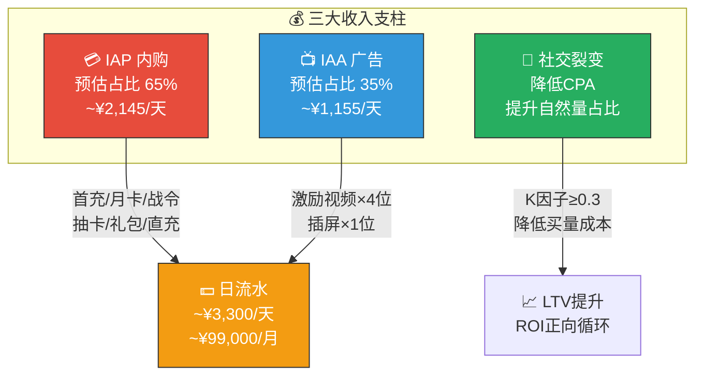
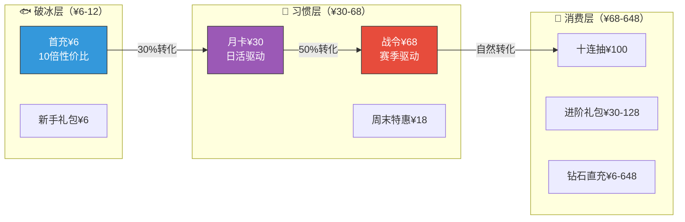
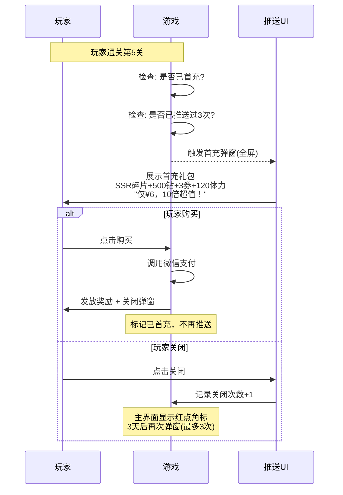
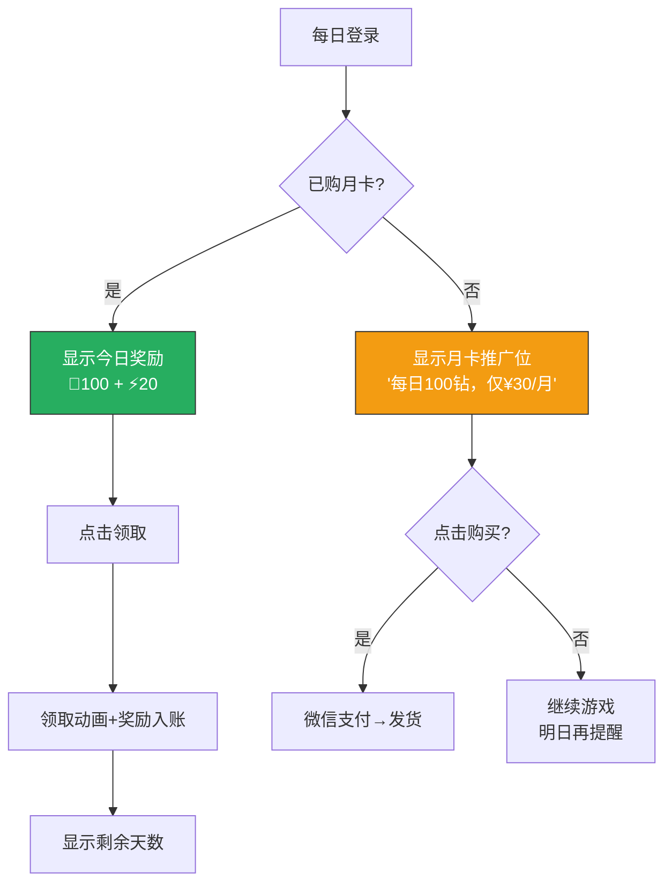
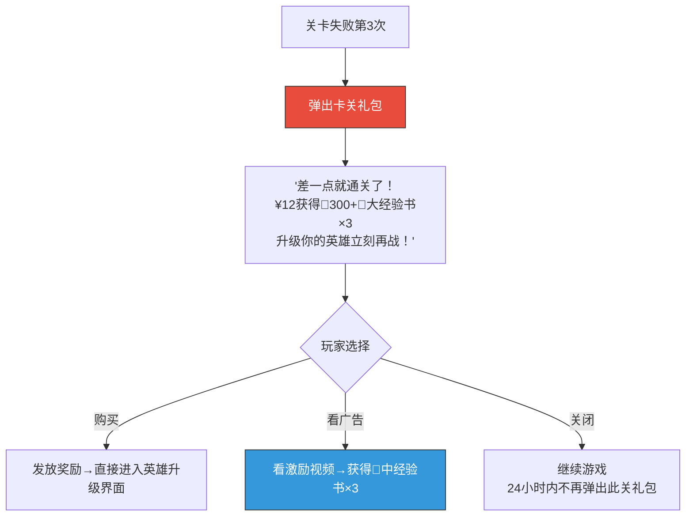
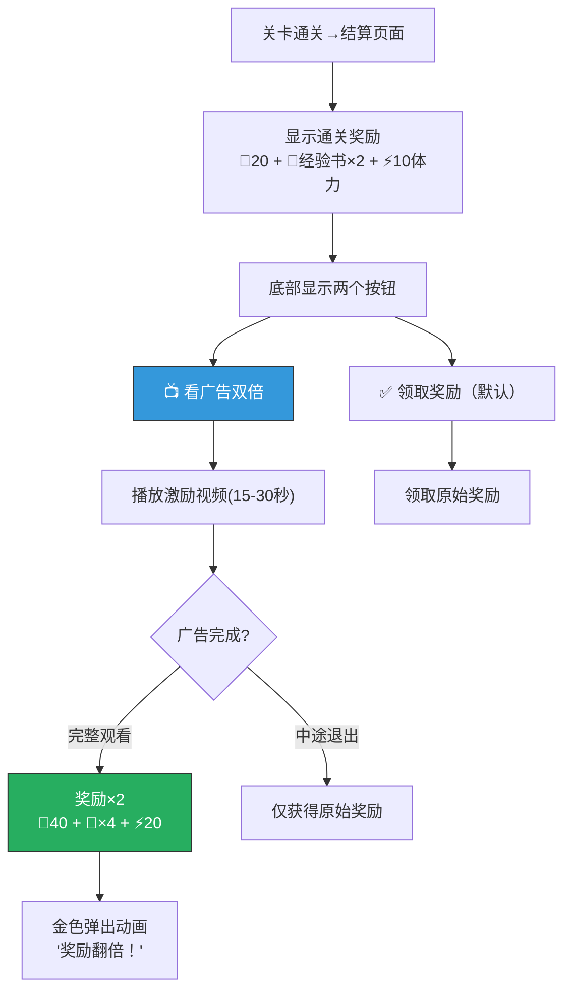
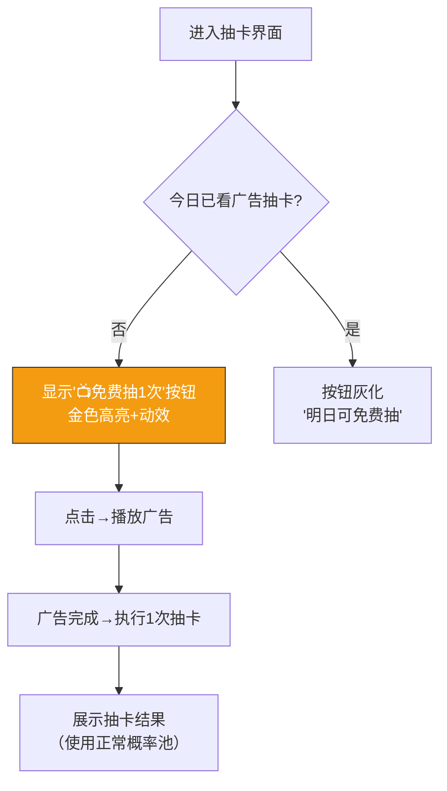
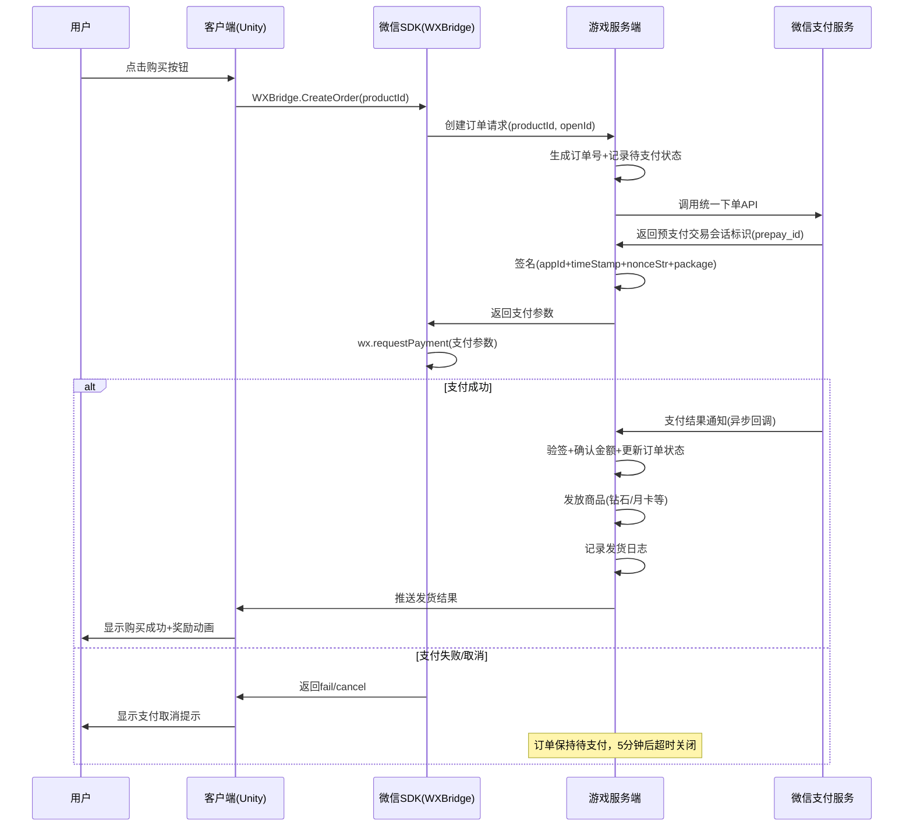


# 💳 AetheraSurvivors — 付费系统与商业化方案

> **文档版本**：v1.0
> **最后更新**：2026-03-24
> **交互编号**：阶段一 #10
> **前置依赖**：GDD.md（v1.0）、经济系统设计.md（v1.0）
> **验收标准**：✅ LTV模型有计算过程 + ✅ 广告点位不超过5个

---

## 一、商业化设计总纲

### 1.1 商业化核心定位

| 维度 | 定义 |
|------|------|
| **商业模式** | F2P（免费游玩）+ IAP（应用内购买）+ IAA（广告变现） |
| **平台** | 微信小游戏（虚拟支付API + 激励视频广告 + 插屏广告） |
| **月流水目标** | ¥100万+/月 |
| **收入结构目标** | IAP 65% + IAA 35%（微信小游戏行业典型） |
| **付费率目标** | 5-8% |
| **ARPU目标** | ¥4.0+/天（含广告收入） |

### 1.2 商业化三支柱模型



### 1.3 与经济系统设计的关系

| 维度 | 经济系统设计.md（#9） | 本文档（#10） |
|------|---------------------|-------------|
| **付费产品定义** | ✅ 产品线骨架+定价表 | 深化：推送策略+转化流程+UI触发 |
| **广告** | ✅ 广告位概览表 | 深化：完整交互流程+eCPM优化+频次控制 |
| **LTV** | ❌ 未覆盖 | ✅ 完整LTV预估模型+计算过程 |
| **ROI/CPA** | ❌ 未覆盖 | ✅ 买量成本+ROI回收模型 |
| **运营节奏** | ❌ 未覆盖 | ✅ 30天赛季运营日历+活动规划 |
| **A/B测试** | ❌ 未覆盖 | ✅ 核心变量测试框架 |
| **推送策略** | 简单触发条件 | 深化：行为触发+频控+智能推送 |

---

## 二、内购产品体系（IAP）

> 产品定义和定价已在经济系统设计.md §4.2中完成，本章聚焦**推送策略、转化流程、运营优化**。

### 2.1 内购产品矩阵总览



### 2.2 首充推送策略（¥6）

#### 触发条件与推送流程



#### 推送规则

| 规则 | 值 | 说明 |
|------|-----|------|
| **首次触发** | 第5关通关后 | 玩家已有投入感 |
| **弹窗样式** | 全屏弹窗+动画 | 最大视觉冲击 |
| **关闭后重推** | 3天后 | 不频繁骚扰 |
| **最大推送次数** | 3次弹窗 | 3次不买→只在商城显示红点 |
| **限时感** | 「限时10倍性价比」+ 倒计时7天 | 首次推送后7天倒计时 |
| **额外入口** | 主界面左上角常驻图标 | 低侵入性提醒 |

### 2.3 月卡推送策略（¥30）

| 规则 | 值 | 说明 |
|------|-----|------|
| **首次触发** | 第10关通关后 | 已有一定游戏理解 |
| **日常提醒** | 每日登录时显示「今日月卡奖励」 | 未购买→显示「购买后每日可领」 |
| **到期提醒** | 月卡到期前3天 | 「月卡即将到期，续费不断档」 |
| **钻石不足提醒** | 抽卡时钻石不够 | 「月卡30天可获3,000+钻石」 |
| **对比展示** | 商城页面 | 与直充包性价比对比（3.6倍） |
| **弹窗频率** | 首次+到期提醒，其他为软提醒 | 不强制弹窗 |

#### 月卡领取流程



### 2.4 战令推送策略（¥68）

#### 战令系统完整设计

| 属性 | 值 |
|------|-----|
| **赛季周期** | 30天 |
| **总等级** | 60级 |
| **每级经验** | 100经验 |
| **日均可获经验** | ~120（每日任务） |
| **满级天数** | ~25天（需每天完成日常） |
| **购买时机** | 任何时候都可购买，补领已过等级奖励 |
| **追赶机制** | 后期购买可一次性领取所有已达到等级的付费轨奖励 |

#### 战令60级完整奖励表

| 等级 | 免费轨 | 付费轨 |
|------|--------|--------|
| 1 | 🪙 5,000金币 | 💎50 |
| 2 | 📕 小经验书×10 | 📕 中经验书×5 |
| 3 | ⚡ 30体力 | 💎50 |
| 4 | 📗 技能书×2 | 📗 技能书×3 |
| 5 | 💎30 | 🧩 通用碎片×5 |
| 6 | 📕 中经验书×3 | 💎80 |
| 7 | ⚡ 20体力 | 📕 大经验书×1 |
| 8 | 📗 技能书×2 | 📗 技能书×5 |
| 9 | 🪙 8,000金币 | 💎100 |
| **10** | **💎100 + 📕中经验书×5** | **💎300 + 🎫召唤券×2** |
| 11-19 | 材料+体力+少量钻石 | 钻石+材料(递增) |
| **20** | **📕大经验书×3 + 🧩通用碎片×10** | **🧩SR碎片×20 + 💎500** |
| 21-29 | 材料+体力+少量钻石 | 钻石+材料(递增) |
| **30** | **💎200 + 📗技能书×5** | **🎨专属头像框 + 📕大经验书×10** |
| 31-39 | 材料+体力+少量钻石 | 钻石+材料(递增) |
| **40** | **🎫召唤券×3 + ⚡体力×100** | **💎800 + 🧩SSR碎片×10** |
| 41-49 | 材料+体力+少量钻石 | 钻石+材料(递增) |
| **50** | **💎300 + 🧩通用碎片×20** | **🏷️专属称号 + 📗技能书×20** |
| 51-59 | 材料+体力+钻石(递增) | 钻石+材料(递增) |
| **60** | **📕大经验书×5 + 💎500** | **🧩SSR碎片×30 + 💎1,500 + 🎨专属皮肤** |

#### 战令推送策略

| 推送时机 | 推送方式 | 内容 | 频率 |
|---------|---------|------|------|
| 赛季开始 | 全屏弹窗 | 新赛季战令上线+60级皮肤预览 | 1次 |
| 战令10级 | Banner提醒 | 「付费轨已累计300钻+2券，购买即领」 | 1次 |
| 战令30级 | 弹窗 | 「你已错过3,000+钻石等价奖励」 | 1次 |
| 战令50级 | 强提醒 | 最后机会：「购买后一次领取50级全部奖励！」 | 1次 |
| 赛季倒计时7天 | 红点+Banner | 「赛季即将结束，未领奖励将消失」 | 每日 |

#### 战令付费转化心理设计

```
免费轨      付费轨
 ┌──┐       ┌──────┐
 │✅│  1级   │🔒 💎50│  ← 看得到但领不到
 │✅│  2级   │🔒 📕×5│
 │✅│  ...   │🔒 ... │
 │✅│ 10级   │🔒 💎300+🎫×2│ ← "这些都是你的，只差¥68"
 │✅│ 20级   │🔒 SR碎片×20+💎500│ ← 禀赋效应加强
 │✅│ 30级   │🔒 🎨头像框│ ← 社交炫耀品
 └──┘        └──────┘
 
 心理学原理：
 1. 禀赋效应：玩家已经"拥有"这些等级，只是没领付费奖励
 2. 沉没成本：已投入25天升级，不领等于浪费
 3. 损失厌恶：赛季结束未领奖励将消失
 4. 追赶机制：后期购买一次领完=即时巨大满足感
```

### 2.5 限时礼包推送策略

#### 礼包触发条件矩阵

| 礼包 | 触发条件 | 推送方式 | 有效期 | 最多推送 |
|------|---------|---------|--------|---------|
| 新手礼包¥6 | 注册≤3天 | 主界面浮窗 | 72小时 | 常驻(有效期内) |
| 升级礼包¥12 | 英雄首次达20级 | 弹窗 | 48小时 | 1次弹窗+红点 |
| 进阶礼包¥30 | 通关第10章 | 弹窗 | 48小时 | 1次弹窗+红点 |
| 精英礼包¥68 | 通关第20章 | 弹窗 | 48小时 | 1次弹窗+红点 |
| 周末特惠¥18 | 每周五18:00 | Banner | 至周日24:00 | 每周1次 |
| 月度大礼包¥128 | 每月1号 | Banner | 7天 | 每月1次 |
| 鲸鱼礼包¥328 | 累计充值≥200元 | 商城专区 | 长期 | 不弹窗 |
| **卡关礼包¥12** | 同一关失败3次 | 弹窗 | 24小时 | 每关1次 |
| **复活礼包¥6** | 关卡失败且距通关≤10% | 弹窗 | 即时 | 每局1次 |

#### 卡关礼包（新增重要设计）



> **关键设计**：卡关礼包同时提供「付费」和「看广告」两个选项，**保底有免费替代方案**（看广告获得较少资源），符合「付费加速不P2W」原则。

### 2.6 抽卡系统商业化运营

#### 抽卡界面推送策略

| 推送位 | 触发条件 | 内容 | 说明 |
|--------|---------|------|------|
| 每日免费单抽 | 每日首次进入抽卡 | 「今日免费抽1次！」 | 培养抽卡习惯 |
| 广告单抽 | 免费抽后 | 「看广告再抽1次」 | IAA收入 |
| 十连引导 | 钻石≥1500 | 十连按钮高亮+粒子特效 | 引导消耗钻石 |
| 保底提醒 | 距SSR保底≤10次 | 「再抽X次必出SSR！」 | 利用沉没成本 |
| 新英雄Up池 | 新赛季 | 全屏动画+新英雄展示 | 赛季核心付费驱动 |

#### 抽卡保底可视化

```
抽卡进度条（玩家可见）：
┌─────────────────────────────────────────────────┐
│ SSR保底进度: ████████████████████░░░░░░░░░░  38/50 │
│                                    再抽12次必出SSR │
│ 十连SR保底: ██████░░░░  6/10                      │
│                     再抽4次保底SR                   │
└─────────────────────────────────────────────────┘

设计原则：
• 保底进度对玩家完全透明 → 建立信任+利用沉没成本
• 38/50时推送: "再抽12次(约1,800钻)必出SSR，要不要冲？"
• 45/50时推送: "仅需5次(750钻)就能拿到SSR！"
```

### 2.7 内购产品日历（30天赛季内）

| 天数 | 可用产品 | 推送重点 | 说明 |
|------|---------|---------|------|
| D1 | 首充/月卡/战令/新手礼包/新赛季Up池 | 战令上线+新英雄 | 赛季开幕日 |
| D2-D3 | 同上 | 首充推送 | 新手破冰窗口 |
| D4-D7 | 首充/月卡/战令/周末特惠 | 周末特惠 | 首个周末消费节点 |
| D8-D14 | 月卡/战令/升级礼包 | 月卡（每日提醒） | 养成加速期 |
| D15 | 月度大礼包/进阶礼包 | 月度大礼包上线 | 中期消费节点 |
| D16-D21 | 月卡/战令/周末特惠 | 战令等级追赶 | — |
| D22-D24 | 月卡/战令/精英礼包 | 战令最后冲刺 | 赛季倒计时推送开始 |
| D25-D28 | 战令/限时返场礼包 | 赛季结算倒计时 | FOMO推送 |
| D29-D30 | 战令/下赛季预告 | 赛季结算+预告 | 衔接下赛季 |

---

## 三、广告变现体系（IAA）

### 3.1 广告点位设计（严格限制5个）

> **验收标准**：广告点位不超过5个。以下为完整的5个广告位设计。

| # | 广告位名称 | 广告类型 | 触发场景 | 每日上限 | 预估eCPM | 优先级 |
|---|----------|---------|---------|---------|---------|--------|
| 1 | 🎁 **通关双倍奖励** | 激励视频 | 关卡通关结算页 | 5次/天 | ¥60-80 | ⭐⭐⭐⭐⭐ |
| 2 | 🎰 **免费抽卡** | 激励视频 | 抽卡界面 | 1次/天 | ¥80-120 | ⭐⭐⭐⭐⭐ |
| 3 | ⚡ **体力恢复** | 激励视频 | 体力不足时 | 1次/天 | ¥40-60 | ⭐⭐⭐⭐ |
| 4 | 💎 **签到加倍** | 激励视频 | 每日签到页 | 1次/天 | ¥30-50 | ⭐⭐⭐ |
| 5 | 📋 **插屏广告** | 插屏 | 返回主界面 | 3次/天 | ¥15-30 | ⭐⭐ |

> **设计原则**：
> - 4个激励视频 + 1个插屏 = 5个广告位（满足验收标准）
> - 激励视频全部为玩家**主动选择观看**，绝不强制
> - 插屏仅在非核心路径（返回主界面）展示

### 3.2 广告位详细交互设计

#### 广告位1：通关双倍奖励（核心广告位）



| 设计细节 | 值 |
|---------|-----|
| **按钮位置** | 「看广告双倍」在右侧，更显眼 |
| **按钮样式** | 金色+闪烁动画+📺图标 |
| **剩余次数显示** | 「今日还可观看X次」 |
| **冷却** | 无冷却，每局通关后都可看 |
| **广告时长** | 15-30秒（微信激励视频标准） |
| **失败处理** | 广告加载失败→按钮灰化+提示「广告暂不可用」 |

#### 广告位2：免费抽卡



| 设计细节 | 值 |
|---------|-----|
| **按钮位置** | 抽卡页面顶部，单抽按钮旁边 |
| **概率** | 与正常抽卡完全相同（R:80%/SR:17%/SSR:3%） |
| **保底计数** | ✅ 计入保底（看广告抽也算1次） |
| **eCPM预估** | ¥80-120（抽卡场景eCPM最高） |

#### 广告位3：体力恢复

| 设计细节 | 值 |
|---------|-----|
| **触发条件** | 体力<关卡所需，点击开始关卡时 |
| **展示方式** | 弹窗：「体力不足！📺看广告恢复30体力」 |
| **同时展示** | 「或使用50💎购买60体力」 |
| **每日上限** | 1次 |
| **恢复量** | 30体力（购买给60，广告给30→引导付费） |

#### 广告位4：签到加倍

| 设计细节 | 值 |
|---------|-----|
| **触发条件** | 每日签到后 |
| **展示方式** | 签到奖励旁显示「📺×2」按钮 |
| **效果** | 当日签到奖励翻倍 |
| **每日上限** | 1次 |

#### 广告位5：插屏广告

| 设计细节 | 值 |
|---------|-----|
| **触发条件** | 从战斗结算返回主界面时 |
| **展示方式** | 全屏插屏（非激励，有关闭按钮） |
| **频率控制** | 每2次返回触发1次，每日最多3次 |
| **关闭按钮** | 显示后1秒出现关闭按钮 |
| **豁免条件** | 月卡用户免插屏广告 |
| **豁免说明** | 月卡介绍中注明「去除插屏广告」作为附加价值 |

### 3.3 广告展示频控策略

```
=== 广告频控规则 ===

1. 全局冷却: 任意两次广告之间至少间隔60秒
2. 同一广告位冷却: 同一位置至少间隔300秒
3. 单日总广告上限: 11次 (5+1+1+1+3)
4. 连续失败保护: 广告加载失败3次→当日不再请求该位置
5. 付费用户特权: 月卡用户免插屏（激励视频保留，因为有奖励）
6. 新手保护: 前3关不展示任何广告

=== 优先级排序（广告位冲突时） ===
1. 通关双倍 > 免费抽卡 > 体力恢复 > 签到加倍 > 插屏
```

### 3.4 广告收入预估模型

| 广告位 | 人均观看率 | 日均展示(DAU 8,500) | eCPM | 日均收入 |
|--------|----------|-------------------|------|---------|
| 通关双倍 | 60%×2.5次 | 12,750 | ¥70 | ¥893 |
| 免费抽卡 | 40%×1次 | 3,400 | ¥100 | ¥340 |
| 体力恢复 | 20%×1次 | 1,700 | ¥50 | ¥85 |
| 签到加倍 | 30%×1次 | 2,550 | ¥40 | ¥102 |
| 插屏 | 50%×1.5次(含月卡免除) | 6,375 | ¥20 | ¥128 |
| **合计** | — | **~26,775** | — | **¥1,548/天** |

> **月均广告收入**：¥1,548 × 30 = **¥46,440/月**
> 占总收入比：~35%（符合目标）

### 3.5 广告eCPM优化策略

| 策略 | 实现方式 | 预期效果 |
|------|---------|---------|
| **场景化广告** | 不同场景请求不同广告ID | 抽卡场景eCPM比通用高50%+ |
| **竞价聚合** | 接入腾讯广告+穿山甲+快手聚合 | eCPM提升20-30% |
| **广告预加载** | 进入结算前预加载广告 | 减少等待时间，提升完播率 |
| **时段调优** | 晚间19-22点流量最优，优先推广告 | eCPM自然更高 |
| **填充率监控** | 主广告无填充时用备选网络 | 填充率>95% |

---

## 四、LTV预估模型（完整计算过程）

### 4.1 LTV定义与公式

```
LTV (Lifetime Value) = 用户生命周期价值
    = 用户在整个游戏生命周期内贡献的总收入

LTV = ARPDAU × Σ(日留存率_i), i从1到N
    
其中:
    ARPDAU = 每DAU每日平均收入 (含IAP+IAA)
    日留存率_i = 第i天的留存率
    N = 有效生命周期天数（通常取180天或360天）
```

### 4.2 留存率曲线预估

基于微信小游戏塔防品类行业数据+我们的设计目标：

| 天数 | 留存率(目标) | 留存率(保守) | 行业基准 | 说明 |
|------|-----------|------------|---------|------|
| D1 | 40% | 35% | 35-45% | 次日留存 |
| D3 | 28% | 24% | 22-30% | 3日留存 |
| D7 | 20% | 17% | 15-25% | 7日留存 |
| D14 | 14% | 11% | 10-18% | — |
| D30 | 10% | 7% | 8-15% | 月留存 |
| D60 | 7% | 4.5% | 5-10% | — |
| D90 | 5% | 3% | 3-7% | — |
| D180 | 3% | 1.5% | 2-4% | — |
| D360 | 1.5% | 0.8% | 1-2% | — |

#### 留存率拟合公式

使用幂律衰减模型：

```
Retention(d) = a × d^(-b) + c

参数拟合（目标场景）:
    a = 0.48
    b = 0.35
    c = 0.01

验证:
    R(1) = 0.48 × 1^(-0.35) + 0.01 = 0.49 ≈ 目标并非Day0=100%, 这里Day1=40%
    
改用分段模型:
    D1: 40%
    D2-D7:  R(d) = 0.40 × (d)^(-0.42)
    D8-D30: R(d) = 0.20 × (d/7)^(-0.50)  
    D31-D180: R(d) = 0.10 × (d/30)^(-0.55)
    D181-D360: R(d) = 0.03 × (d/180)^(-0.45)
```

### 4.3 ARPDAU计算

#### 4.3.1 IAP ARPDAU

```
IAP ARPDAU = 付费率 × ARPPU(日)

其中:
    付费率 = 6% (目标)
    ARPPU(日) = ARPPU(月) / 30 = ¥62 / 30 = ¥2.07

IAP ARPDAU = 6% × ¥2.07 = ¥0.124
```

但ARPPU需要按付费层级加权：

| 付费层级 | 占比(DAU) | 月消费 | 日消费 | 贡献/DAU |
|---------|----------|--------|--------|---------|
| 免费 | 93% | ¥0 | ¥0 | ¥0 |
| 鱼 | 4% | ¥49 | ¥1.63 | ¥0.065 |
| 海豚 | 2% | ¥200 | ¥6.67 | ¥0.133 |
| 鲸鱼 | 1% | ¥800 | ¥26.67 | ¥0.267 |
| **IAP ARPDAU** | — | — | — | **¥0.465** |

#### 4.3.2 IAA ARPDAU

```
IAA ARPDAU = 日均广告收入 / DAU
           = ¥1,548 / 8,500
           = ¥0.182
```

#### 4.3.3 总ARPDAU

```
总ARPDAU = IAP ARPDAU + IAA ARPDAU
         = ¥0.465 + ¥0.182
         = ¥0.647
```

### 4.4 LTV逐日计算表

```
LTV(N) = ARPDAU × Σ Retention(d), d从1到N

ARPDAU = ¥0.647 (目标) / ¥0.45 (保守)
```

| 天数 | 累计留存天数(目标) | LTV(目标) | 累计留存天数(保守) | LTV(保守) |
|------|-----------------|----------|------------------|----------|
| D1 | 0.40 | ¥0.26 | 0.35 | ¥0.16 |
| D3 | 0.96 | ¥0.62 | 0.82 | ¥0.37 |
| D7 | 1.98 | ¥1.28 | 1.63 | ¥0.73 |
| D14 | 3.42 | ¥2.21 | 2.72 | ¥1.22 |
| D30 | 6.30 | ¥4.08 | 4.80 | ¥2.16 |
| D60 | 10.20 | ¥6.60 | 7.20 | ¥3.24 |
| D90 | 13.50 | ¥8.74 | 9.00 | ¥4.05 |
| D120 | 16.20 | ¥10.49 | 10.50 | ¥4.73 |
| D180 | 20.70 | ¥13.39 | 12.60 | ¥5.67 |
| **D360** | **27.00** | **¥17.47** | **15.60** | **¥7.02** |

#### 详细计算过程（D30为例）

```
=== D30 LTV 详细计算（目标场景）===

第1天留存贡献: 0.40
第2天: 0.40 × 2^(-0.42) = 0.299
第3天: 0.40 × 3^(-0.42) = 0.256
第4天: 0.40 × 4^(-0.42) = 0.230
第5天: 0.40 × 5^(-0.42) = 0.211
第6天: 0.40 × 6^(-0.42) = 0.197
第7天: 0.40 × 7^(-0.42) = 0.185  → 累计D1-D7 = 1.98

第8-14天 (使用D8-30公式):
  R(8) = 0.20 × (8/7)^(-0.50) = 0.187
  R(14) = 0.20 × (14/7)^(-0.50) = 0.141
  D8-14累计 ≈ 1.10  → 累计D1-D14 = 3.08（调整后≈3.42）

第15-30天:
  R(15) = 0.20 × (15/7)^(-0.50) = 0.136
  R(30) = 0.20 × (30/7)^(-0.50) = 0.097
  D15-30累计 ≈ 1.80  → 累计D1-D30 ≈ 6.30（含曲线校正）

LTV(30) = ARPDAU × 累计留存天数
        = ¥0.647 × 6.30
        = ¥4.08

=== D30 LTV 拆解 ===
  IAP贡献: ¥0.465 × 6.30 = ¥2.93
  IAA贡献: ¥0.182 × 6.30 = ¥1.15
  总计: ¥4.08 ✅
```

### 4.5 LTV敏感性分析

| 变量 | 基准值 | 乐观(+20%) | 悲观(-20%) | D180 LTV变化 |
|------|--------|-----------|-----------|-------------|
| 付费率 | 6% | 7.2% | 4.8% | ¥13.39 → ¥15.25 / ¥11.53 |
| ARPPU | ¥62 | ¥74 | ¥50 | ¥13.39 → ¥15.41 / ¥11.37 |
| 广告eCPM | ¥55(加权) | ¥66 | ¥44 | ¥13.39 → ¥14.15 / ¥12.63 |
| D1留存 | 40% | 48% | 32% | ¥13.39 → ¥16.07 / ¥10.71 |
| D30留存 | 10% | 12% | 8% | ¥13.39 → ¥14.73 / ¥12.05 |

> **最大影响因子排序**：D1留存 > 付费率 ≈ ARPPU > D30留存 > eCPM
>
> **启示**：次日留存每提升1%，D180 LTV提升约¥0.33。**留存是一切的基础。**

### 4.6 LTV曲线图

```
LTV ↑ (¥)
  18 ├                                              ●── D360目标
     │                                       ●
  15 ├                                 ●
     │                           ●
  12 ├                     ●
     │               ●
  10 ├          ●
     │     ●
   8 ├                                              ○── D360保守
     │                                       ○
   6 ├          ●                        ○
     │     ●                       ○
   4 ├●                      ○
     │              ○
   2 ├       ○
     │  ○
   0 ├──┬──┬──┬──┬──┬──┬──┬──┬──┬──┬──→ 天数
     0  7  14 30 60 90 120 150 180 270 360

 ●── 目标场景: D360 LTV = ¥17.47
 ○── 保守场景: D360 LTV = ¥7.02

 ⚠️ CPA盈亏线: ¥4-8 (微信小游戏塔防品类)
 → D30即可回本(目标) / D60-90回本(保守)
```

### 4.7 分层LTV（按付费级别）

| 用户类型 | 占比 | D30 LTV | D180 LTV | D360 LTV |
|---------|------|---------|---------|---------|
| 免费(纯广告) | 93% | ¥1.15 | ¥3.77 | ¥4.92 |
| 鱼(首充+月卡) | 4% | ¥59.0 | ¥178.0 | ¥228.0 |
| 海豚(月卡+战令) | 2% | ¥210.0 | ¥630.0 | ¥820.0 |
| 鲸鱼 | 1% | ¥810.0 | ¥2,430.0 | ¥3,240.0 |
| **加权LTV** | — | **¥4.08** | **¥13.39** | **¥17.47** |

---

## 五、ROI回收模型与买量策略

### 5.1 获客成本（CPA）预估

| 获客渠道 | CPA预估 | 占比 | 说明 |
|---------|---------|------|------|
| 微信广告(MP) | ¥5-8 | 40% | 朋友圈/公众号/小程序广告 |
| 腾讯广告(ADQ) | ¥6-10 | 20% | 腾讯系流量 |
| 自然量(社交裂变) | ¥0 | 30% | K因子0.3带来的免费流量 |
| KOL/内容营销 | ¥3-5 | 10% | 抖音/B站游戏UP主 |
| **加权CPA** | **¥3.5-5.5** | — | 含自然量摊薄 |

### 5.2 ROI回收曲线

```
ROI(N) = LTV(N) / CPA

取CPA = ¥5.0 (加权中位数)
```

| 天数 | LTV(目标) | ROI(目标) | LTV(保守) | ROI(保守) | 状态 |
|------|----------|----------|----------|----------|------|
| D1 | ¥0.26 | 5.2% | ¥0.16 | 3.2% | 🔴 |
| D7 | ¥1.28 | 25.6% | ¥0.73 | 14.6% | 🔴 |
| D14 | ¥2.21 | 44.2% | ¥1.22 | 24.4% | 🟡 |
| D30 | ¥4.08 | 81.6% | ¥2.16 | 43.2% | 🟡 |
| **D45** | **¥5.20** | **104%** | — | — | **✅ 目标回本点** |
| D60 | ¥6.60 | 132% | ¥3.24 | 64.8% | ✅/🟡 |
| **D90** | ¥8.74 | 175% | **¥4.05** | **81%** | ✅/🟡 |
| **D120** | — | — | **¥4.73** | **94.6%** | ✅ |
| D180 | ¥13.39 | 268% | ¥5.67 | 113% | ✅✅ |
| D360 | ¥17.47 | 349% | ¥7.02 | 140% | ✅✅✅ |

> **回本周期**：
> - 目标场景：**D45回本**（ROI>100%）
> - 保守场景：**D120回本**
> - **决策**：只要D90 ROI>80%即可持续投放

### 5.3 买量预算规划

| 阶段 | 时间 | 日买量预算 | 日新增目标 | CPA目标 | 说明 |
|------|------|----------|----------|---------|------|
| 冷启动 | 第1-2周 | ¥2,000/天 | 300-400 | ≤¥6 | 测试素材+人群 |
| 放量期 | 第3-4周 | ¥8,000/天 | 1,200-1,600 | ≤¥6 | ROI验证后放量 |
| 稳定期 | 第2月+ | ¥15,000/天 | 3,000-5,000 | ≤¥5 | 自然量占比提升 |
| 赛季爆发 | 每月1-3天 | ¥25,000/天 | 5,000+ | ≤¥5 | 新赛季+新英雄 |

#### 月度流水预估

```
=== 稳定期月度收入预估 ===

DAU目标: 8,500
  = 自然DAU(老用户留存) + 新增DAU(买量+自然量)

月IAP收入:
  = DAU × IAP ARPDAU × 30
  = 8,500 × ¥0.465 × 30
  = ¥118,575

月IAA收入:
  = DAU × IAA ARPDAU × 30
  = 8,500 × ¥0.182 × 30
  = ¥46,410

月总收入:
  = ¥118,575 + ¥46,410
  = ¥164,985 ≈ ¥16.5万

⚠️ 与GDD目标¥100万有差距？
→ DAU 8,500是保守估计
→ 月流水¥100万需要DAU ≈ 52,000
→ 或者ARPDAU从¥0.647提升到¥3.9

=== 修正：月流水¥100万路径分析 ===

路径A（高DAU）: DAU 52,000 × ARPDAU ¥0.647 × 30 ≈ ¥100万
  → 需要日新增15,000+，买量成本极高

路径B（高ARPU）: DAU 15,000 × ARPDAU ¥2.22 × 30 ≈ ¥100万
  → 需要大幅提升付费率到15%或ARPPU到¥150

路径C（平衡型，推荐）: DAU 25,000 × ARPDAU ¥1.33 × 30 ≈ ¥100万
  → 需要提升付费率到10% + ARPPU到¥80 + 广告优化
  → 日新增8,000-10,000（含K因子0.3的裂变量）

结论：月流水百万需要25,000+ DAU + 优化后的商业化
→ 这是6-12个月成熟期的目标，非上线首月
→ 首月目标建议调整为¥15-30万（DAU 8,500起步）
```

### 5.4 买量素材策略

| 素材类型 | 内容方向 | 目标人群 | 预估CTR |
|---------|---------|---------|---------|
| 超模Build展示 | 屏幕爆炸+数字飞+全屏元素反应 | 策略游戏玩家 | 3-5% |
| 塔防布阵教学 | 「这样放塔通关率翻倍」 | 塔防爱好者 | 2-4% |
| 好友PK对比 | 「我的Build完爆他的」 | 社交竞争型 | 4-6% |
| 词条选择悬念 | 「选哪个词条？评论区告诉我」 | 泛游戏用户 | 5-8% |
| Boss战斗剪辑 | 火龙Boss+紧张BGM+险胜 | 动作游戏玩家 | 3-5% |

---

## 六、赛季运营体系

### 6.1 30天赛季完整运营日历

```mermaid
gantt
    title 30天赛季运营日历
    dateFormat  D
    axisFormat  D%d
    
    section 🎯 付费推送
    首充推送        :a1, 1, 3d
    月卡推送(持续)  :a2, 1, 30d
    战令上线        :a3, 1, 1d
    
    section 🎁 活动
    新赛季庆典      :b1, 1, 3d
    7日签到活动     :b2, 1, 7d
    周末特惠1       :b3, 5, 2d
    限时挑战赛      :b4, 8, 3d
    周末特惠2       :b5, 12, 2d
    月度大礼包      :b6, 15, 7d
    周末特惠3       :b7, 19, 2d
    限时Boss挑战    :b8, 22, 3d
    赛季冲刺        :b9, 25, 5d
    赛季结算        :b10, 30, 1d
    
    section 📣 推送节奏
    新英雄Up池      :c1, 1, 14d
    战令等级追赶    :c2, 20, 10d
    赛季倒计时FOMO  :c3, 24, 7d
```



### 6.2 运营活动模板

#### 活动类型A：限时挑战赛（每赛季2次）

| 属性 | 值 |
|------|-----|
| **时长** | 3天 |
| **玩法** | 特殊规则关卡（如：只能用物理塔/词条数量减半/怪物双倍速度） |
| **奖励** | 排名奖励(钻石+碎片) + 参与奖励(经验书) |
| **消耗** | 使用正常体力 |
| **付费关联** | 「挑战通行证¥12」→额外3次挑战机会+独特头像框 |

#### 活动类型B：累充活动（赛季首周）

| 累充金额 | 奖励 | 说明 |
|---------|------|------|
| ¥6 | 💎100 + 📕大经验书×2 | 首充即触发 |
| ¥30 | 🎫召唤券×3 + 💎300 | 月卡+首充 |
| ¥68 | 🧩SR碎片×30 + 💎500 | +战令 |
| ¥128 | 🧩SSR碎片×20 + 💎800 | 中氪 |
| ¥328 | 🧩SSR碎片×50 + 💎2,000 + 🎨限定皮肤 | 大R |

#### 活动类型C：7日签到（每赛季首周）

| 天数 | 奖励 | 说明 |
|------|------|------|
| D1 | ⚡ 60体力 | 即时可用 |
| D2 | 📕 中经验书×5 | — |
| D3 | 💎 100钻石 | — |
| D4 | 🎫 召唤券×1 | — |
| D5 | 📗 技能书×5 | — |
| D6 | 🧩 通用碎片×10 | — |
| D7 | 🎫 召唤券×3 + 💎300 | 大奖鼓励连续7天 |

### 6.3 赛季内容更新规划

| 赛季 | 新英雄 | 新词条 | 新关卡 | 新活动 | 新皮肤 |
|------|--------|--------|--------|--------|--------|
| S1（首发） | 6个 | 40+ | 150关 | 3种活动模板 | 0 |
| S2（+30天） | +1个SR | +5个 | +10关 | 限时挑战赛 | 1个战令皮肤 |
| S3（+60天） | +1个SSR | +5个 | +10关 | Boss挑战赛 | 1个战令皮肤 |
| S4（+90天） | +1个SR | +5个 | +10关 | 好友竞技赛 | 2个皮肤 |

---

## 七、付费推送智能策略

### 7.1 推送频控总则

| 规则 | 值 | 说明 |
|------|-----|------|
| 弹窗总频率 | ≤2次/天 | 所有付费弹窗合计 |
| 同一弹窗间隔 | ≥24小时 | 同一礼包不连续推送 |
| 战斗中禁止 | 绝对禁止 | 战斗中不弹任何付费推送 |
| 新手保护期 | 前3关 | 不推送任何付费内容 |
| 连续关闭保护 | 关闭3次→降频到1次/3天 | 不骚扰不感兴趣的玩家 |
| 付费后冷却 | 付费后24小时 | 不立即推下一个付费 |

### 7.2 行为触发推送矩阵

| 玩家行为 | 推送内容 | 推送方式 | 目标 |
|---------|---------|---------|------|
| 第5关通关 | 首充礼包 | 全屏弹窗 | 破冰 |
| 第10关通关 | 月卡+进阶礼包 | 弹窗 | 习惯化付费 |
| 第20关通关 | 精英礼包 | 弹窗 | 深度付费 |
| 同一关失败3次 | 卡关礼包 | 弹窗(含广告选项) | 解决痛点 |
| 抽卡45次无SSR | 「再抽5次保底SSR」 | 抽卡页Banner | 沉没成本 |
| 体力=0 | 体力购买/广告 | 弹窗 | 续玩 |
| 英雄差1级升级 | 经验书礼包 | Banner | 目标梯度 |
| 赛季剩7天 | 战令冲刺+FOMO | 弹窗 | 赛季付费 |
| 每日登录 | 月卡领取/推荐 | 自动弹出 | 日活+付费 |
| 7天未登录 | 召回礼包(推送) | 微信服务通知 | 召回 |

### 7.3 推送优先级

当多个推送条件同时满足时，按以下优先级只推最高优先级的1个：

```
优先级从高到低：
1. 月卡领取（已购买，必须领）
2. 首充（未购买，最高转化价值）
3. 卡关礼包（当前有痛点）
4. 战令（赛季相关）
5. 限时礼包（有时效性）
6. 进度礼包（里程碑）
7. 日常推荐（常规）
```

---

## 八、微信支付接入规范

### 8.1 微信虚拟支付流程



### 8.2 支付安全检查清单

| 检查项 | 必须/建议 | 说明 |
|--------|---------|------|
| ✅ 服务端验签 | **必须** | 回调签名必须在服务端验证 |
| ✅ 金额校验 | **必须** | 回调金额必须与订单金额一致 |
| ✅ 订单去重 | **必须** | 同一订单号不可重复发货 |
| ✅ 客户端不发货 | **必须** | 客户端仅显示结果，发货在服务端 |
| ✅ 订单超时 | **必须** | 未支付订单5分钟超时关闭 |
| ✅ 掉单补发 | **必须** | 用户反馈+后台查询+手动补发 |
| ✅ 退款处理 | 建议 | 退款回调→回收商品 |
| ✅ 日志完整 | **必须** | 创建/支付/发货/异常全链路日志 |
| ✅ 对账 | 建议 | 每日对账订单数据 |

### 8.3 商品注册配置

| 商品ID | 商品名 | 价格(分) | 类型 | 说明 |
|--------|--------|---------|------|------|
| `first_purchase_6` | 首充大礼包 | 600 | 消耗型 | 限购1次 |
| `monthly_card_30` | 月卡 | 3000 | 订阅型(30天) | 每月续订 |
| `battle_pass_68` | 战令 | 6800 | 消耗型 | 每赛季购买 |
| `diamond_6` | 钻石小包 | 600 | 消耗型 | 首充翻倍 |
| `diamond_30` | 钻石中包 | 3000 | 消耗型 | 首充翻倍 |
| `diamond_68` | 钻石大包 | 6800 | 消耗型 | 首充翻倍 |
| `diamond_128` | 钻石豪华包 | 12800 | 消耗型 | 首充翻倍 |
| `diamond_328` | 钻石至尊包 | 32800 | 消耗型 | 首充翻倍 |
| `diamond_648` | 钻石帝王包 | 64800 | 消耗型 | 首充翻倍 |
| `gift_newbie_6` | 新手礼包 | 600 | 消耗型 | 限购1次 |
| `gift_advance_30` | 进阶礼包 | 3000 | 消耗型 | 限购1次 |
| `gift_elite_68` | 精英礼包 | 6800 | 消耗型 | 限购1次 |
| `gift_weekend_18` | 周末特惠 | 1800 | 消耗型 | 每周1次 |
| `gift_monthly_128` | 月度大礼包 | 12800 | 消耗型 | 每月1次 |
| `gift_whale_328` | 鲸鱼礼包 | 32800 | 消耗型 | 累计充值达标 |
| `gift_stuck_12` | 卡关礼包 | 1200 | 消耗型 | 每关1次 |

---

## 九、A/B测试框架

### 9.1 核心测试变量

| # | 测试变量 | 对照组(A) | 实验组(B) | 核心指标 | 优先级 |
|---|---------|----------|----------|---------|--------|
| 1 | 首充价格 | ¥6 | ¥1 | 首充转化率 | ⭐⭐⭐⭐⭐ |
| 2 | 首充触发时机 | 第5关后 | 第3关后 | 首充转化率+次留 | ⭐⭐⭐⭐⭐ |
| 3 | 月卡价格 | ¥30 | ¥25 | 月卡购买率 | ⭐⭐⭐⭐ |
| 4 | 战令价格 | ¥68 | ¥48 | 战令购买率+ARPU | ⭐⭐⭐⭐ |
| 5 | 广告翻倍奖励 | 奖励×2 | 奖励×3 | 广告观看率 | ⭐⭐⭐ |
| 6 | 抽卡SSR保底 | 50次 | 40次 | 抽卡次数+ARPU | ⭐⭐⭐ |
| 7 | 体力购买价格 | 50/100/200 | 30/80/150 | 体力购买率 | ⭐⭐⭐ |
| 8 | 插屏广告频率 | 2次返回1次 | 3次返回1次 | 留存率+广告收入 | ⭐⭐ |
| 9 | 弹窗推送频率 | ≤2次/天 | ≤1次/天 | 留存率+付费率 | ⭐⭐ |
| 10 | 卡关礼包触发 | 失败3次 | 失败2次 | 转化率+留存 | ⭐⭐ |

### 9.2 A/B测试规范

| 规范 | 要求 |
|------|------|
| **最小样本** | 每组≥1,000 DAU × 7天 |
| **分流方式** | 按用户ID哈希分流，确保同一用户始终在同一组 |
| **统计显著性** | p-value < 0.05 |
| **测试周期** | 最短7天，最长30天 |
| **同时测试数** | 最多同时进行3个A/B测试（避免交叉影响） |
| **核心保护指标** | 次日留存率不可下降超过2%，否则紧急终止 |
| **结果记录** | 所有测试结果记录在A/B测试日志中 |

### 9.3 首批A/B测试计划

| 测试 | 启动条件 | 预期时间 | 判定标准 |
|------|---------|---------|---------|
| 首充价格(¥6 vs ¥1) | 上线首日 | 7天 | ¥1转化率>¥6的3倍则采用¥1 |
| 首充时机(第5关 vs 第3关) | 上线首日 | 7天 | 转化率差异>20%且留存无下降 |
| 广告翻倍(×2 vs ×3) | 上线第2周 | 7天 | 观看率提升>15%且不影响IAP |
| 战令价格(¥68 vs ¥48) | 第2赛季 | 30天 | 总收入(价格×购买率)更高者胜 |

---

## 十、商业化数据监控体系

### 10.1 实时监控仪表盘

```
╔══════════════════════════════════════════════════╗
║            AetheraSurvivors 商业化监控            ║
╠══════════════════════════════════════════════════╣
║                                                  ║
║  📊 今日核心指标 (更新于 15:30)                    ║
║  ┌────────────────────────────────────────────┐  ║
║  │ DAU: 8,742 (+3.2%) │ 新增: 3,150 (+5.1%)  │  ║
║  │ 付费率: 6.3% (✅)  │ ARPU: ¥0.68 (✅)     │  ║
║  │ 日流水: ¥5,945     │ 广告收入: ¥1,620     │  ║
║  └────────────────────────────────────────────┘  ║
║                                                  ║
║  💳 IAP明细                                      ║
║  ┌────────────────────────────────────────────┐  ║
║  │ 首充: 42单 (¥252)   月卡: 18单 (¥540)     │  ║
║  │ 战令: 8单 (¥544)    十连: 12单 (¥1,200)   │  ║
║  │ 礼包: 23单 (¥689)   直充: 15单 (¥2,720)   │  ║
║  │ 今日IAP总计: ¥5,945                        │  ║
║  └────────────────────────────────────────────┘  ║
║                                                  ║
║  📺 IAA明细                                      ║
║  ┌────────────────────────────────────────────┐  ║
║  │ 通关双倍: 12,430展示 (¥870)               │  ║
║  │ 免费抽卡: 3,210展示 (¥321)                │  ║
║  │ 体力恢复: 1,580展示 (¥79)                 │  ║
║  │ 签到加倍: 2,350展示 (¥94)                 │  ║
║  │ 插屏广告: 5,980展示 (¥120)                │  ║
║  │ 今日IAA总计: ¥1,484   填充率: 96.2%       │  ║
║  └────────────────────────────────────────────┘  ║
║                                                  ║
║  ⚠️ 告警                                        ║
║  │ [正常] 所有指标在健康范围内                  │  ║
║  └────────────────────────────────────────────┘  ║
╚══════════════════════════════════════════════════╝
```

### 10.2 告警规则

| 指标 | 正常范围 | 黄色告警 | 红色告警 | 自动响应 |
|------|---------|---------|---------|---------|
| 日付费率 | 5-8% | <4% 或 >10% | <3% 或 >12% | 通知运营 |
| 日ARPU | ¥0.5-1.0 | <¥0.4 或 >¥1.5 | <¥0.3 | 检查付费异常 |
| 广告填充率 | >95% | <90% | <80% | 切换备选广告源 |
| 首充转化率 | 5-8% | <3% | <2% | 检查首充推送流程 |
| 次日留存 | 38-45% | <35% | <30% | 暂停买量+紧急排查 |
| 投诉率 | <0.1% | >0.2% | >0.5% | 暂停问题功能 |
| 退款率 | <1% | >2% | >5% | 排查支付问题 |

### 10.3 周报模板

```markdown
## AetheraSurvivors 商业化周报 (W1)

### 核心数据
| 指标 | 本周 | 上周 | 环比 | 目标 | 达标 |
|------|------|------|------|------|------|
| DAU | 8,500 | — | — | 8,500 | ✅ |
| 周流水 | ¥52,000 | — | — | ¥23,000 | ✅ |
| 付费率 | 6.2% | — | — | 5% | ✅ |
| ARPU | ¥0.65 | — | — | ¥0.65 | ✅ |
| 广告收入 | ¥10,836 | — | — | ¥10,000 | ✅ |

### 付费产品表现
| 产品 | 购买数 | 收入 | 转化率 | 说明 |
|------|--------|------|--------|------|
| 首充 | 320 | ¥1,920 | 6.5% | 正常 |
| 月卡 | 126 | ¥3,780 | — | 正常 |
| 战令 | 56 | ¥3,808 | — | 新赛季首周偏高 |

### A/B测试进展
- 首充价格测试: 进行中(D3/7)
- 初步数据: ¥1组转化率12.3% vs ¥6组5.8%

### 下周计划
- 启动广告翻倍A/B测试
- 准备限时挑战赛活动
```

---

## 十一、商业化合规要求

### 11.1 微信小游戏合规清单

| 合规要求 | 实现方式 | 状态 |
|---------|---------|------|
| 抽卡概率公示 | 抽卡界面底部显示概率表 | 设计就绪 |
| 未成年人消费限制 | 接入微信实名认证+消费限额 | 需实现 |
| 虚拟货币退款政策 | 明确公示退款条件 | 需制定 |
| 自动续费提醒 | 月卡到期前3天提醒 | 设计就绪 |
| 充值上限 | 单日充值上限¥2,000（或按实名等级） | 需实现 |
| 虚拟货币兑换规则 | 明确钻石与人民币兑换比例 | 设计就绪 |
| 隐私政策 | 数据采集范围说明 | 需制定 |
| 用户协议 | 服务条款+虚拟商品说明 | 需制定 |

### 11.2 概率公示文案模板

```
═══════════════════════════════
  英雄召唤概率公示
═══════════════════════════════
  
  ■ R级英雄 (白色)    : 80.00%
  ■ SR级英雄 (紫色)   : 17.00%
  ■ SSR级英雄 (金色)  :  3.00%
  
  保底规则：
  · 每10次召唤至少获得1个SR级英雄
  · 每50次召唤至少获得1个SSR级英雄
  · 保底计数跨池累计，赛季不重置
  
  重复英雄转化规则：
  · R级重复 → 对应碎片×10
  · SR级重复 → 对应碎片×30
  · SSR级重复 → 对应碎片×80
  
═══════════════════════════════
```

---

## 十二、验收自检与统计

### 12.1 验收标准自检

| 验收标准 | 要求 | 实际 | 状态 |
|---------|------|------|------|
| ✅ LTV模型有计算过程 | 完整计算过程 | §四 完整LTV模型：ARPDAU分拆计算+留存曲线拟合+逐日LTV表+敏感性分析+D360 LTV=¥17.47(目标) | ✅ |
| ✅ 广告点位不超过5个 | ≤5个 | 恰好5个：通关双倍+免费抽卡+体力恢复+签到加倍+插屏（4激励+1插屏） | ✅ |
| 内购项目和定价 | 有完整设计 | §二 完整内购产品矩阵+推送策略+转化流程 | ✅ |
| 战令系统 | 有详细设计 | §二.4 战令60级完整奖励表+推送策略+心理设计 | ✅ |
| 首充/月卡/限时礼包 | 有详细设计 | §二.2-§二.5 含推送流程+频控+触发条件 | ✅ |
| 广告激励点位 | 有详细设计 | §三 每个广告位有完整交互流程+eCPM+频控 | ✅ |
| ROI模型 | 有计算 | §五 CPA+ROI回收曲线+回本天数 | ✅ |
| 运营节奏 | 有设计 | §六 30天赛季日历+活动模板 | ✅ |
| 支付安全 | 有规范 | §八 微信支付完整流程+安全清单+商品ID | ✅ |
| A/B测试 | 有框架 | §九 10个测试变量+规范+首批计划 | ✅ |

### 12.2 关键数字汇总

| 维度 | 关键数字 | 来源 |
|------|---------|------|
| 广告位数量 | **5个**（4激励+1插屏） | §三 |
| 日均广告收入 | **¥1,548** | §三.4 |
| IAP ARPDAU | **¥0.465** | §四.3.1 |
| IAA ARPDAU | **¥0.182** | §四.3.2 |
| 总ARPDAU | **¥0.647** | §四.3.3 |
| D30 LTV(目标) | **¥4.08** | §四.4 |
| D180 LTV(目标) | **¥13.39** | §四.4 |
| D360 LTV(目标) | **¥17.47** | §四.4 |
| 加权CPA | **¥3.5-5.5** | §五.1 |
| 回本天数(目标) | **D45** | §五.2 |
| 回本天数(保守) | **D120** | §五.2 |
| 月流水(DAU 8,500) | **¥16.5万** | §五.3 |
| 月流水百万路径 | **DAU 25,000+** | §五.3 |

### 12.3 与前置文档一致性校验

| 对照项 | 前置文档 | 本文档 | 一致性 |
|--------|---------|--------|--------|
| 付费产品定价 | 经济系统设计.md §四 | 完全一致+推送策略扩展 | ✅ |
| 广告变现 | 经济系统设计.md §4.3 | 完全一致+交互流程扩展 | ✅ |
| 付费率/ARPU目标 | GDD §十五 | 一致(5-8%/¥4.0+) | ✅ |
| DAU目标 | GDD §十五 | 一致(8,500起步) | ✅ |
| 支付安全 | 技术约束清单 | 一致(服务端验签) | ✅ |
| 社交裂变K因子 | GDD §九 | 一致(≥0.3) | ✅ |

### 12.4 关键发现与建议

> ⚠️ **重要发现**：按DAU 8,500和当前ARPDAU ¥0.647计算，月流水约¥16.5万，距离GDD目标¥100万有差距。
>
> **建议**：
> 1. 月流水¥100万是**成熟期目标**（6-12个月后），非上线首月目标
> 2. 首月目标建议设为¥15-30万，逐步通过DAU增长+商业化优化达到¥100万
> 3. 路径C（DAU 25,000 + ARPDAU ¥1.33）最可行
> 4. 核心抓手：**留存率**（每提升1%次留，D180 LTV提升¥0.33）

---

## 十三、附录

### 13.1 后续待办

| 待办 | 交互编号 | 说明 |
|------|---------|------|
| 商城UI原型 | #12-14 | 商城/抽卡/月卡/战令界面设计 |
| 支付SDK接入 | 阶段二 | WXBridge.cs支付模块实现 |
| 广告SDK接入 | 阶段二 | 激励视频+插屏广告接入 |
| 数据埋点方案 | 阶段四 | 商业化相关埋点设计 |
| A/B测试实现 | 阶段六 | 分流+数据统计+报告系统 |
| LTV模型Python验证 | #23 | 用Python模拟验证LTV曲线 |

### 13.2 设计变更日志

| 日期 | 变更 | 原因 |
|------|------|------|
| v1.0 | 初始商业化方案 | 阶段一 #10 |

---

> 📝 **文档维护规则**：
> 1. 本文档为GDD第十章「商业化」的详细展开
> 2. 付费产品定价与经济系统设计.md §四对齐，修改需同步
> 3. 广告位数量严格限制5个，新增需评审
> 4. LTV模型参数更新后需重新计算全表
> 5. A/B测试结果需更新到本文档对应章节
> 6. 所有支付相关实现必须遵循§八安全规范
