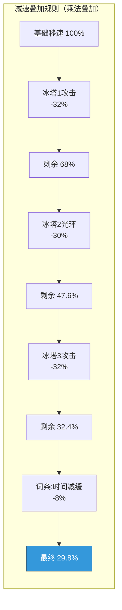
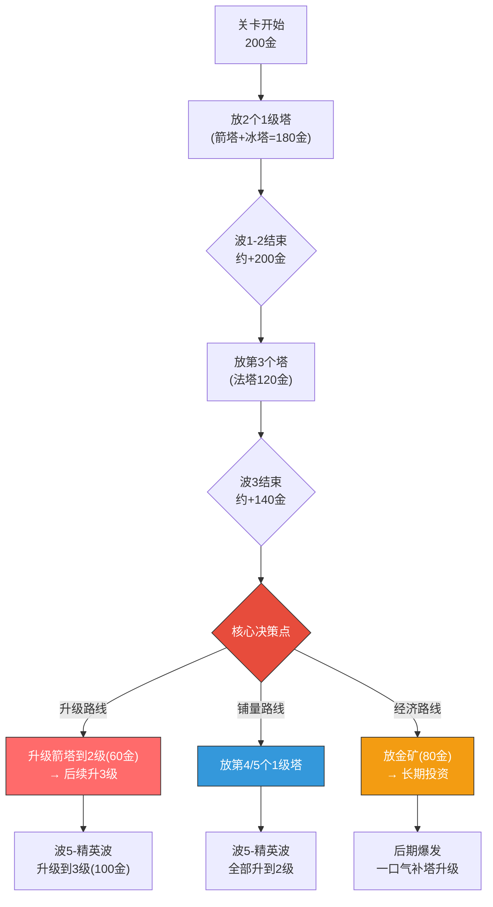
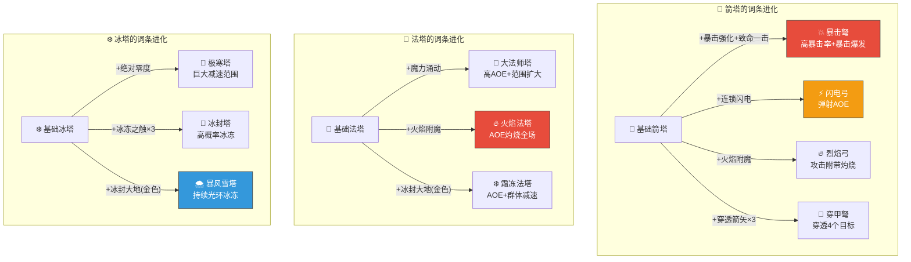
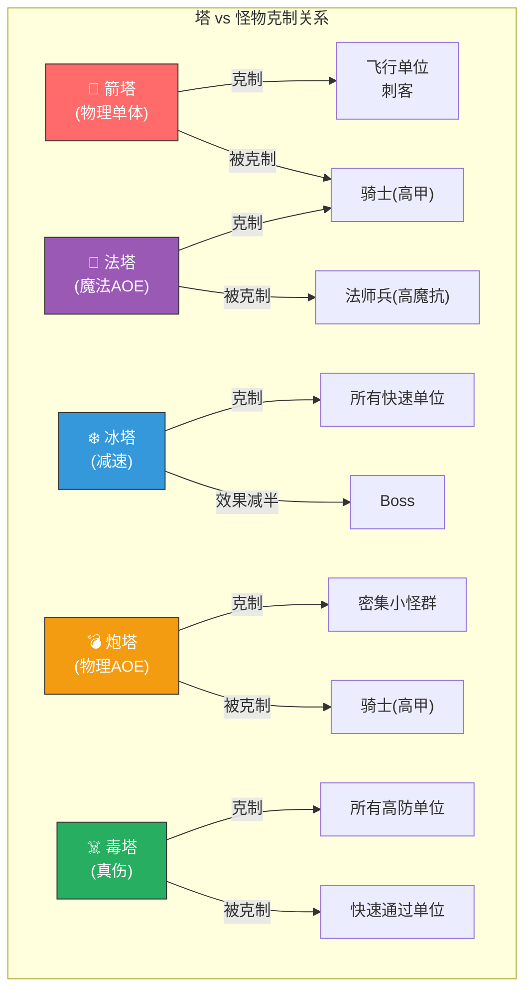


# 🗼 AetheraSurvivors — 塔体系详细设计

> **文档版本**：v1.0
> **最后更新**：2026-03-24
> **交互编号**：阶段一 #7
> **前置依赖**：GDD.md（v1.0）、核心战斗循环设计.md（v1.0）、Roguelike词条系统设计.md（v1.0）
> **验收标准**：✅ 每种塔有明确定位差异 + ✅ DPS/Cost曲线图

---

## 一、塔体系设计哲学

### 1.1 核心设计原则

| 原则 | 说明 | 反面案例（避免） |
|------|------|----------------|
| **六角色分工** | 6种塔各司其职，没有「完美塔」 | 1种塔通吃所有场景 |
| **定位鲜明** | 玩家看1眼图标就知道塔的作用 | 2种塔功能重叠分不清 |
| **简单但有深度** | 操作只有放+升级，深度来自位置选择和组合 | 复杂的操作序列 |
| **3级质变** | 1-2级是数值成长，3级解锁质变能力（改变玩法） | 3级只是数字变大 |
| **经济博弈** | 1个3级塔 vs 3个1级塔，两种路线各有优劣 | 永远升级优于铺量 |
| **词条放大器** | 塔是词条效果的载体，词条让塔从「能用」变成「超模」 | 塔本身足够强不需要词条 |

### 1.2 塔的角色定位六边形

```
          单体DPS
            ▲
           /|\
          / | \
         /  |  \
   控制 /   |   \ AOE
       /  🏹箭塔 \
      /     |     \
     ────── + ──────
     \     |     /
      \ 💣炮塔 /
       \  |  /
   经济 \ | / 持续
         \|/
          ▼
        真伤

🏹 箭塔: 单体DPS ████████ (9/10)
🔮 法塔: AOE    ███████░ (7/10) + 控制(3级减速)
❄️ 冰塔: 控制    █████████ (9/10)
💣 炮塔: AOE    █████████ (9/10) + 单体(高基础伤害)
☠️ 毒塔: 真伤    ████████ (8/10) + 持续
⛏️ 金矿: 经济    ██████████ (10/10)
```

### 1.3 塔的使用场景矩阵

| 场景 | 最优塔 | 次优塔 | 不推荐 | 原因 |
|------|--------|--------|--------|------|
| **密集小怪群** | 🔮法塔/💣炮塔 | ☠️毒塔 | 🏹箭塔 | 需要AOE清群 |
| **高护甲骑士** | ☠️毒塔(真伤) | 🔮法塔(魔法) | 🏹箭塔/💣炮塔(物理) | 物理被甲减免 |
| **高魔抗法师兵** | 🏹箭塔/💣炮塔(物理) | ☠️毒塔(真伤) | 🔮法塔/❄️冰塔(魔法) | 魔法被抗减免 |
| **快速刺客** | ❄️冰塔+🏹箭塔 | 💣炮塔(击退) | ⛏️金矿 | 需要减速+高单体DPS |
| **飞行单位** | 🏹箭塔(追踪弹) | 🔮法塔(AOE) | 💣炮塔(太慢) | 飞行走直线，需精准打击 |
| **Boss** | 🏹箭塔(单体)+❄️冰塔 | ☠️毒塔(持续) | ⛏️金矿 | 单体DPS+控制 |
| **前期铺基础** | 🏹箭塔(性价比) | ❄️冰塔(便宜) | 💣炮塔(太贵) | 经济紧张 |
| **经济投资** | ⛏️金矿 | — | — | 唯一经济塔 |

---

## 二、六种塔的完整设计

### 2.1 🏹 箭塔（Arrow Tower）——单体DPS之王

#### 基本信息

| 维度 | 内容 |
|------|------|
| **定位** | 单体高DPS输出核心 |
| **图标** | 弓箭/弩 |
| **伤害类型** | 物理 |
| **攻击方式** | 追踪弹（发射后锁定目标，100%命中） |
| **适用场景** | 快速单位/飞行单位/Boss |
| **弱点场景** | 密集小怪群（逐个击杀效率低） |
| **推荐词条** | 暴击强化、急速、穿甲、穿透箭矢、连锁闪电 |

#### 三级数值表

| 属性 | 1级 | 2级 | 3级 | 说明 |
|------|-----|-----|-----|------|
| 攻击力 | 25 | 33(+32%) | 50(+52%) | 物理伤害 |
| 攻速(次/s) | 1.2 | 1.3(+8%) | 1.44(+11%) | 较快的攻速 |
| 射程(格) | 3.0 | 3.0 | 3.0 | 中等射程 |
| DPS | 30.0 | 42.9 | 72.0 | 单体最高 |
| 弹道速度(格/s) | 12 | 12 | 14 | 追踪弹 |
| 建造费 | 100 | — | — | — |
| 升级到2级 | — | 60 | — | 造价×60% |
| 升级到3级 | — | — | 100 | 造价×100% |
| **累计花费** | **100** | **160** | **260** | — |
| **DPS/累计花费** | **0.300** | **0.268** | **0.277** | 先降后升（3级性价比恢复） |

#### 3级特殊能力：穿透

```
📋 穿透规则：
- 箭矢命中第1个目标后继续飞行
- 对第2个目标造成60%伤害
- 判定范围：弹道方向前方1.5格内最近的第2个目标
- 不可穿透第3个目标（词条「穿透箭矢」可扩展）
- 暴击仅对第1个目标判定，穿透目标不继承暴击

穿透等效DPS提升：
  假设平均穿透命中率50%（密集时更高）：
  等效DPS = 72.0 × (1 + 0.5 × 0.6) = 72.0 × 1.30 = 93.6
  提升约30%
```

#### 视觉设计

| 等级 | 外观 | 攻击特效 | 音效 |
|------|------|---------|------|
| 1级 | 木质弓架+简单弓臂 | 白色箭矢拖尾 | 轻弓弦声「嘣」 |
| 2级 | 加装铁制瞄准器+强化弓臂 | 蓝色箭矢拖尾 | 较重弓弦声 |
| 3级 | 黄金弩+发光箭矢+穿透气流特效 | 金色箭矢+穿透贯穿线特效 | 尖锐穿透音「嗖～叮」 |

---

### 2.2 🔮 法塔（Magic Tower）——AOE群攻核心

#### 基本信息

| 维度 | 内容 |
|------|------|
| **定位** | AOE群体魔法伤害 |
| **图标** | 魔法球/水晶 |
| **伤害类型** | 魔法 |
| **攻击方式** | 抛射弹（预判目标位置，到达后范围爆炸） |
| **适用场景** | 密集怪群/高护甲骑士（魔法伤害无视护甲） |
| **弱点场景** | 高魔抗法师兵/分散的快速单位（预判偏差） |
| **推荐词条** | 魔力涌动、火焰附魔、锋利、鹰眼 |

#### 三级数值表

| 属性 | 1级 | 2级 | 3级 | 说明 |
|------|-----|-----|-----|------|
| 攻击力 | 18 | 23(+28%) | 36(+57%) | 魔法伤害 |
| 攻速(次/s) | 0.8 | 0.88(+10%) | 0.96(+9%) | 较慢 |
| 射程(格) | 3.5 | 3.5 | 3.5 | 较远 |
| AOE范围(格) | 1.0 | 1.0 | 1.2 | 3级扩大 |
| 单体DPS | 14.4 | 20.2 | 34.6 | — |
| AOE有效DPS(×3) | ~43.2 | ~60.7 | ~103.7 | 按命中3目标 |
| 弹道速度(格/s) | 8 | 8 | 9 | 抛物线弧度 |
| 建造费 | 120 | — | — | 中等偏高 |
| 升级到2级 | — | 72 | — | — |
| 升级到3级 | — | — | 120 | — |
| **累计花费** | **120** | **192** | **312** | — |
| **DPS/累计花费(AOE)** | **0.360** | **0.316** | **0.332** | AOE性价比之王 |

#### 3级特殊能力：魔法减速

```
📋 减速规则：
- 命中目标减速20%，持续2秒
- 与冰塔减速乘法叠加
- AOE范围内所有被命中的目标都会被减速
- 不触发冰冻判定（仅减速，非冰冻状态）

战术价值：
  法塔3级 = AOE输出 + 群体减速
  不再需要额外冰塔即可拥有基础控制能力
  配合冰塔：-20%(法塔) × -32%(冰塔) = 最终移速 54.4%（减速45.6%）
```

#### 攻击预判逻辑（与炮塔共用）

```
// 法塔/炮塔的抛射弹预判公式
targetPredictedPos = target.position + target.velocity × (distance / projectileSpeed)

// 加入修正（防止怪物突然变向时完全打空）
correction = target.velocity.normalized × 0.3  // 0.3格提前量修正
finalAimPos = targetPredictedPos + correction

// 结果：大约85%命中率（对直线行走怪物接近100%，对拐弯处怪物约70%）
```

#### 视觉设计

| 等级 | 外观 | 攻击特效 | 音效 |
|------|------|---------|------|
| 1级 | 简易魔法台+小水晶 | 蓝色魔法球飞出+小爆炸 | 轻吟「嗡～砰」 |
| 2级 | 精致石柱+中型水晶球 | 紫蓝色魔法球+中型爆炸环 | 中频魔法声 |
| 3级 | 华丽法阵底座+大水晶+常驻粒子 | 多彩魔法球+减速冰雾+大爆炸 | 深沉魔法声+冰裂音 |

---

### 2.3 ❄️ 冰塔（Ice Tower）——减速控制核心

#### 基本信息

| 维度 | 内容 |
|------|------|
| **定位** | 减速/冰冻控制，不以伤害为目的 |
| **图标** | 冰晶/寒冰 |
| **伤害类型** | 魔法（微量） |
| **攻击方式** | 射线即时命中（蓝色冰冻射线） |
| **适用场景** | 所有场景（减速永远有用） |
| **弱点场景** | 单独使用时输出极低，需配合输出塔 |
| **推荐词条** | 绝对零度、冰冻之触、冰封大地、减速光环 |

#### 三级数值表

| 属性 | 1级 | 2级 | 3级 | 说明 |
|------|-----|-----|-----|------|
| 攻击力 | 8 | 10(+25%) | 16(+60%) | 魔法微量伤害 |
| 攻速(次/s) | 1.0 | 1.1(+10%) | 1.2(+9%) | 标准 |
| 射程(格) | 3.0 | 3.0 | 3.5 | 3级射程扩大 |
| 减速效果 | -20%移速 | -26%移速 | -32%移速 | 核心能力 |
| 减速持续 | 2.0s | 2.0s | 2.5s | 3级持续更久 |
| DPS | 8.0 | 11.0 | 19.2 | 极低（不是定位） |
| 建造费 | 80 | — | — | **最便宜** |
| 升级到2级 | — | 48 | — | — |
| 升级到3级 | — | — | 80 | — |
| **累计花费** | **80** | **128** | **208** | 最经济 |

#### 3级特殊能力：冰冻光环

```
📋 冰冻光环规则：
- 被动效果：射程范围内所有敌人持续-30%移速
- 不需要攻击，只要敌人在范围内就生效
- 与冰塔普通攻击的减速叠加（乘法）
- 光环减速 + 攻击减速 合计：
  最终移速 = 100% × (1-0.30光环) × (1-0.32攻击) = 70% × 68% = 47.6% 
  等于-52.4%移速

多冰塔叠加（3个3级冰塔覆盖区）：
  光环叠加: (1-0.30)³ = 0.343 → -65.7%移速（仅光环）
  加攻击: 0.343 × (1-0.32)³ = 0.343 × 0.314 = 0.108 → -89.2%移速
  再加词条更恐怖（见词条系统设计.md §5.3 Build B模拟）
```

#### 减速叠加公式详解



> **减速上限**：任何单位最终移速不低于原始的10%（防止完全不动的bug感），即减速上限-90%。Boss减速效果额外减半（Boss受到的减速效果仅为50%效力）。

#### 视觉设计

| 等级 | 外观 | 攻击特效 | 音效 |
|------|------|---------|------|
| 1级 | 冰柱基座+小冰晶 | 细蓝色射线 | 轻冰裂声 |
| 2级 | 更大冰晶+霜雾缠绕 | 粗蓝色射线+冰花 | 中频冰冻声 |
| 3级 | 巨型冰晶+冰冻光环地面特效 | 射线+持续冰霜地面环+冰花粒子 | 持续冰冻嗡鸣+攻击冰碎声 |

---

### 2.4 💣 炮塔（Cannon Tower）——范围爆破核心

#### 基本信息

| 维度 | 内容 |
|------|------|
| **定位** | 高伤害AOE爆炸，物理版范围杀手 |
| **图标** | 炮管/大炮 |
| **伤害类型** | 物理 |
| **攻击方式** | 抛物线高弧度炮弹+AOE爆炸 |
| **适用场景** | 密集怪群/汇聚点（路径拐角处效果最佳） |
| **弱点场景** | 高护甲骑士（物理被减免）/快速分散单位（炮弹飞行慢） |
| **推荐词条** | 爆裂弹药、穿甲、锋利、巨人杀手 |

#### 三级数值表

| 属性 | 1级 | 2级 | 3级 | 说明 |
|------|-----|-----|-----|------|
| 攻击力 | 45 | 59(+31%) | 90(+53%) | 单次最高伤害 |
| 攻速(次/s) | 0.5 | 0.55(+10%) | 0.6(+9%) | 最慢攻速 |
| 射程(格) | 3.5 | 3.5 | 3.5 | 较远 |
| AOE范围(格) | 1.2 | 1.2 | 1.5 | 3级扩大 |
| 伤害衰减 | 中心100%→边缘50% | 同 | 同 | 线性衰减 |
| 单体DPS | 22.5 | 32.5 | 54.0 | — |
| AOE有效DPS(×3) | ~67.5 | ~97.4 | ~162.0 | 按3目标×衰减均值 |
| 弹道速度(格/s) | 6 | 6 | 7 | 最慢（高弧线） |
| 建造费 | 150 | — | — | **最贵战斗塔** |
| 升级到2级 | — | 90 | — | — |
| 升级到3级 | — | — | 150 | — |
| **累计花费** | **150** | **240** | **390** | 最昂贵 |
| **DPS/累计花费(AOE)** | **0.450** | **0.406** | **0.415** | 粗暴但高DPS/金 |

#### 3级特殊能力：击退

```
📋 击退规则：
- 爆炸将AOE范围内敌人击退1格（沿路径方向向后推）
- 击退动画0.3秒，期间敌人不移动也不受攻击目标切换
- 免疫击退：Boss/精英怪（完全免疫）
- 击退与减速的战术配合：
  击退1格 + 冰塔减速区 = 敌人被推回减速区再走一遍
  等效移动距离增加1格 = 增加约15-20%的塔攻击时间

击退等效价值：
  假设每波击退3次，每次增加20%的停留时间（对普通怪）
  等效价值 ≈ 每波多出~3秒的攻击窗口
```

#### AOE伤害衰减公式

```
实际伤害 = 基础伤害 × max(0.5, 1.0 - distance/AOE半径 × 0.5)

距离分析（3级，AOE半径=1.5格）：
  中心(0格):   90 × 1.0 = 90
  0.5格:       90 × 0.833 = 75
  1.0格:       90 × 0.667 = 60
  1.5格(边缘): 90 × 0.5 = 45

平均伤害(假设怪物均匀分布): 90 × 0.75 ≈ 67.5/目标
```

#### 视觉设计

| 等级 | 外观 | 攻击特效 | 音效 |
|------|------|---------|------|
| 1级 | 木制炮架+铁炮管 | 烟雾+炮弹弧线+小爆炸 | 闷炮声「砰」 |
| 2级 | 铁制炮架+双管 | 更大烟雾+中爆炸+碎片 | 重炮声 |
| 3级 | 钢铁堡垒炮+发光弹药+击退气浪 | 巨大爆炸+地面裂纹+击退波纹 | 震撼爆炸声+地鸣 |

---

### 2.5 ☠️ 毒塔（Poison Tower）——真实伤害克星

#### 基本信息

| 维度 | 内容 |
|------|------|
| **定位** | 真实伤害区域持续输出，高甲克星 |
| **图标** | 毒瓶/毒雾 |
| **伤害类型** | 真实伤害（无视护甲和魔抗） |
| **攻击方式** | 区域持续伤害（无弹道，塔周围释放毒雾） |
| **适用场景** | 高护甲骑士/高魔抗法师兵（所有防御无效） |
| **弱点场景** | 快速通过的刺客/飞行单位（停留时间短） |
| **推荐词条** | 元素反应：腐蚀、鹰眼（扩大毒雾）、火焰附魔 |

#### 三级数值表

| 属性 | 1级 | 2级 | 3级 | 说明 |
|------|-----|-----|-----|------|
| 毒雾伤害/秒 | 12 | 16(+33%) | 24(+50%) | 真实伤害 |
| 毒雾范围(格) | 1.5 | 1.5 | 2.25 | 3级范围+50% |
| 伤害类型 | 真实 | 真实 | 真实 | 无视所有防御 |
| 作用频率 | 每秒 | 每秒 | 每秒 | 持续伤害 |
| 区域DPS(单体) | 12.0 | 16.0 | 24.0 | 看似低但无减免 |
| 建造费 | 100 | — | — | — |
| 升级到2级 | — | 60 | — | — |
| 升级到3级 | — | — | 100 | — |
| **累计花费** | **100** | **160** | **260** | — |

> **真实伤害价值换算**：对100甲骑士（50%减免），12真伤 = 24物理等效伤害。对200甲Boss（66.7%减免），12真伤 = 36物理等效伤害。越高甲越值钱！

#### 3级特殊能力：毒雾扩散

```
📋 扩散规则：
- 毒雾范围+50%（1.5格 → 2.25格）
- 范围扩大使覆盖面积增加125%（π×1.5² → π×2.25²）
- 这意味着3级毒塔几乎可以覆盖一个完整的路径拐角

覆盖面积对比：
  1级: π × 1.5² = 7.07 格²
  3级: π × 2.25² = 15.9 格² （2.25倍）

对怪物停留时间的影响：
  假设怪物移速2格/s，通过毒雾范围：
  1级: 3.0格/2.0格s = 1.5秒停留 → 1.5 × 12 = 18总伤害
  3级: 4.5格/2.0格s = 2.25秒停留 → 2.25 × 24 = 54总伤害（3倍提升）
```

#### 特殊交互规则

| 规则 | 说明 |
|------|------|
| **毒雾不触发暴击** | 持续伤害类型，不参与暴击判定 |
| **毒雾触发灼烧** | 「火焰附魔」词条可附加灼烧DOT（叠加真伤+灼烧=腐蚀触发） |
| **离开即消** | 敌人离开毒雾范围后，毒伤立即停止（非DOT持续） |
| **多毒塔不叠加** | 同时处于多个毒雾中，取最高伤害，不叠加 |
| **元素反应核心** | 毒+火=腐蚀（最强DOT），是元素反应流的关键塔 |

#### 视觉设计

| 等级 | 外观 | 攻击特效 | 音效 |
|------|------|---------|------|
| 1级 | 小毒瓶+简易支架 | 绿色小范围毒雾 | 冒泡声「咕噜」 |
| 2级 | 中型毒瓶+管道 | 更浓绿色毒雾+毒泡 | 较重冒泡声 |
| 3级 | 大型毒液桶+扩散管网+绿色发光 | 大范围浓烈紫绿毒雾+地面腐蚀纹理 | 持续腐蚀嘶嘶声 |

---

### 2.6 ⛏️ 金矿（Gold Mine）——经济产出核心

#### 基本信息

| 维度 | 内容 |
|------|------|
| **定位** | 唯一的被动经济产出单位 |
| **图标** | 金锭/矿镐 |
| **伤害类型** | — （不攻击） |
| **攻击方式** | — （不攻击） |
| **适用场景** | 任何需要经济投资的场景 |
| **弱点** | 占用宝贵的建造格位，前期牺牲防御力 |
| **推荐词条** | 金矿强化、矿脉开发、投资回报、金币帝国 |

#### 三级数值表

| 属性 | 1级 | 2级 | 3级 | 说明 |
|------|-----|-----|-----|------|
| 产出/波 | 15金 | 20金(+33%) | 30金(+50%) | 每波结算时 |
| 建造费 | 80 | — | — | 便宜 |
| 升级到2级 | — | 48 | — | — |
| 升级到3级 | — | — | 80 | — |
| **累计花费** | **80** | **128** | **208** | — |
| **回本波次** | **5.3波** | **4.0波(增量)** | **3.3波(增量)** | — |
| 建造上限 | 3个 | — | — | 词条可增加 |

#### 3级特殊能力：高效矿脉

```
📋 高效矿脉规则：
- 产出效率+50%（基础30金/波已含此加成）
- 每波额外5%概率产出翻倍（30→60金）
- 视觉：采矿动画+金币飞出特效

投资回报分析（9波制关卡，第2波建造1级金矿）：
  投入: 80金
  产出: 15金 × 7波（波2-8） = 105金
  利润: +25金（31%回报率）
  ROI break-even: 5.3波

3级金矿投资回报分析（第3波升满）：
  追加投入: 48 + 80 = 128金
  增量产出: (20-15)×1 + (30-15)×5 = 5 + 75 = 80金（不含初始）
  总投入: 80+128 = 208金
  总产出: 15×1 + 20×1 + 30×5 = 185金
  净利润: -23金（9波内不回本！需要经济词条辅助）

⚠️ 结论：3级金矿在标准9波内ROI为负！
   → 这是故意设计：鼓励配合经济词条（金矿强化+25%后即可回本）
   → 经济碾压流的"入场券"：必须有经济词条支撑
```

#### 特殊规则

| 规则 | 说明 |
|------|------|
| **建造上限** | 初始上限3个，词条「矿脉开发」每叠层+1 |
| **不参与战斗** | 不攻击、不可设置攻击目标 |
| **不可被攻击** | Boss吐息不影响金矿（矿太坚硬了？） |
| **占用建造格** | 和战斗塔共用格位，每放1矿=少1个战斗位 |
| **产出时机** | 每波**结束时**产出（不是波中产出） |

#### 视觉设计

| 等级 | 外观 | 产出特效 | 音效 |
|------|------|---------|------|
| 1级 | 简易矿坑+木支架 | 每波结束弹出3个小金币 | 叮叮铲矿声 |
| 2级 | 矿车轨道+铁支架 | 矿车推出金币 | 矿车声+金币声 |
| 3级 | 金矿山+发光矿脉+矿工精灵 | 金色光柱+金币喷泉 | 丰富采矿声+「叮叮当当」 |

---

## 三、塔的升级体系深度设计

### 3.1 升级经济学

#### 升级费用公式

```
升级到2级费用 = 造价 × 0.6
升级到3级费用 = 造价 × 1.0

总花费 = 造价 + 造价×0.6 + 造价×1.0 = 造价 × 2.6
```

#### 各塔升级费用总表

| 塔 | 造价 | →2级 | →3级 | 总花费(3级) | DPS(3级) | DPS/总花费 |
|----|------|------|------|-----------|---------|-----------|
| 🏹 箭塔 | 100 | 60 | 100 | **260** | 72.0 | 0.277 |
| 🔮 法塔 | 120 | 72 | 120 | **312** | 103.7* | 0.332 |
| ❄️ 冰塔 | 80 | 48 | 80 | **208** | 19.2 | 0.092† |
| 💣 炮塔 | 150 | 90 | 150 | **390** | 162.0* | 0.415 |
| ☠️ 毒塔 | 100 | 60 | 100 | **260** | 24.0 | 0.092† |
| ⛏️ 金矿 | 80 | 48 | 80 | **208** | — | — |

> *法塔/炮塔为AOE有效DPS（×3目标估算）
> †冰塔/毒塔DPS/Cost低是因为其价值不在纯DPS上

### 3.2 「1个3级 vs 多个1级」经济决策

这是塔防核心决策之一，我们需要确保**两种路线都可行但各有场景**。

| 策略 | 花费 | 获得什么 | 适用场景 | 风险 |
|------|------|---------|---------|------|
| **1个3级箭塔** | 260金 | 72 DPS + 穿透 | Boss/精英（单点爆发） | 覆盖面窄 |
| **2个1级箭塔+1个1级冰塔** | 280金 | 60 DPS + 减速 | 多路线/长路径（覆盖面广） | 单个塔弱 |
| **1个3级炮塔** | 390金 | 162 AOE DPS + 击退 | 密集怪群汇聚点 | 太贵，前期缺钱 |
| **3个1级法塔** | 360金 | 129.6 AOE DPS | 多路覆盖 | 无3级特殊能力 |

> **结论**：3级塔的特殊能力（穿透/减速/击退/扩散）是铺量无法获得的**质变效果**。纯数值上铺1级可能DPS更高，但3级特殊能力的战术价值无法量化。

### 3.3 升级决策时机推荐



### 3.4 升级视觉反馈设计

| 升级事件 | 视觉效果 | 音效 | 时长 |
|---------|---------|------|------|
| 1→2级 | 白色闪光环绕+塔模型切换 | 「叮——嗡」升级声 | 0.5秒 |
| 2→3级 | 金色光柱+特效爆发+塔模型大幅变化 | 「叮叮叮——轰！」壮观升级声 | 1.0秒 |
| 3级常驻效果 | 塔周围持续粒子效果（按塔类型不同） | 无额外常驻音效 | 持续 |

---

## 四、塔的进化/合成机制

### 4.1 设计决策：不做传统合成塔

| 传统合成塔方案 | 我们的方案 | 理由 |
|--------------|----------|------|
| 2个箭塔合成1个弩塔 | ❌ 不做 | 增加操作复杂度，与Roguelike词条系统功能重叠 |
| 塔+材料=进化塔 | ❌ 不做 | 需要局内材料系统，增加认知负担 |
| **词条=塔的进化** | ✅ 采用 | 词条改变塔的行为=无操作成本的「进化」 |

> **核心理念**：词条系统已经承担了「让塔变不同」的角色。传统合成会分散注意力，削弱词条系统的核心地位。

### 4.2 词条驱动的「软进化」体系

通过词条组合，每种塔可以「进化」出不同的变体形态。这不是真正的合成，而是**词条赋予塔新能力后的形态变化**。



### 4.3 词条进化的视觉变化

当塔获得特定关键词条后，塔的外观会产生微妙变化以提供视觉反馈：

| 条件 | 视觉变化 | 说明 |
|------|---------|------|
| 获得暴击相关词条 | 塔顶出现红色闪光粒子 | 表示这个塔会暴击 |
| 获得火焰附魔 | 塔的攻击特效带火焰尾迹 | 表示攻击附带灼烧 |
| 获得冰冻之触 | 冰塔周围冰花变多 | 表示有冰冻概率 |
| 获得绝对零度 | 冰塔射程圈变大+颜色变深蓝 | 直观感知范围扩大 |
| 获得爆裂弹药 | 炮塔炮管变红+更大更亮 | 表示AOE增强 |
| 获得金矿强化 | 金矿发出更亮的金光 | 表示产出增加 |
| Build Synergy II激活 | 对应路线颜色的光环覆盖所有塔 | 全场视觉统一 |

---

## 五、塔的放置与交互规则

### 5.1 放置规则

| 规则 | 详情 |
|------|------|
| **格子制** | 地图分为可建造格（绿色）和不可建造格（灰色） |
| **1格1塔** | 每个格子最多放1个塔 |
| **路径保护** | 放塔不能阻断怪物的最后一条路径（至少保留1条通路） |
| **金矿限制** | 金矿有建造上限（初始3个） |
| **即时生效** | 放下即开始攻击（无建造时间） |

### 5.2 目标选择策略系统

玩家可为每个塔独立切换攻击优先级（点击塔→切换按钮）：

| 策略 | 图标 | 说明 | 最佳搭配 |
|------|------|------|---------|
| **最近** | 🎯 | 攻击距离塔最近的敌人 | 默认，适用大多数情况 |
| **最前** | ➡️ | 攻击最接近终点的敌人 | 防止漏怪（冰塔/箭塔） |
| **血最少** | 💔 | 攻击剩余血量最低的敌人 | 快速收割（箭塔+赏金猎人） |
| **最强** | 💀 | 攻击血量最高的敌人 | 集火精英/Boss（所有塔） |

#### 目标切换逻辑

```
// 每次攻击冷却结束后重新评估目标
function SelectTarget(tower, enemies):
    candidateList = enemies.filter(e => inRange(tower, e) && e.alive)
    
    if candidateList.isEmpty: return null
    
    switch tower.targetStrategy:
        case NEAREST:
            return candidateList.sortBy(e => distance(tower, e)).first()
        case FIRST:
            return candidateList.sortBy(e => e.distanceToEnd).first() // 最小=最前
        case LOWEST_HP:
            return candidateList.sortBy(e => e.currentHP).first()
        case STRONGEST:
            return candidateList.sortBy(e => e.currentHP).last() // 最大HP=最强
    
    // 如果当前目标还在射程内且存活，优先保持攻击同一目标（减少切换）
    if tower.currentTarget in candidateList:
        return tower.currentTarget  // 粘性锁定
```

### 5.3 出售机制

| 规则 | 详情 |
|------|------|
| **返还比例** | 总投入金币 × 50%（基础） |
| **词条提升** | 「回收专家」词条可提升到65%/75%/85% |
| **即时返还** | 出售动画0.3秒，金币立即到账 |
| **格位释放** | 出售后该格位可立即建新塔 |
| **使用场景** | 拆掉过时的塔/调整布阵/经济应急 |

### 5.4 塔的相互作用（塔联动词条）

```
📋 塔联动规则（词条S01）：
- 效果：相邻塔（上下左右4格）互相+10%攻击力
- 叠加：每个相邻塔提供独立的+10%加成
- 最大加成：1个塔被4个塔包围 → +40%攻击力

最优布阵（十字阵型）：
  □ 🏹 □
  🏹 🔮 🏹   ← 中心法塔被4个箭塔包围 = +40%
  □ 🏹 □

  每个箭塔也被2-3个塔相邻 = +20%~30%
  总DPS提升约25%（平均每塔）
```

---

## 六、平衡性框架

### 6.1 DPS/Cost效率曲线图

```
DPS/Cost ↑
(效率)
0.50 ├                              ● 💣炮塔(AOE)
     │                         ╱
0.45 ├                    ╱●
     │               ╱
0.40 ├          ╱●
     │     ╱
0.35 ├● 🔮法塔(AOE)
     │  ╲
0.30 ├    ● 🏹箭塔(单体)
     │      ╲
0.25 ├        ●
     │          ╲
0.20 ├            ●
     │              ╲
0.15 ├
     │
0.10 ├● ❄️冰塔 ─────── ● ☠️毒塔
     │  (控制价值不可用DPS/Cost衡量)
0.05 ├
     │
   0 ├──┬──┬──┬──┬──┬──→ 累计花费(金)
     0  80 120 150 200 260 312 390

━━━ AOE塔DPS/Cost（按×3目标）
─── 单体塔DPS/Cost
··· 功能塔（冰塔/毒塔，价值不在DPS）
```

### 6.2 DPS/Cost详细数据

| 塔(等级) | DPS类型 | DPS | 累计花费 | DPS/Cost | 性价比排名 |
|---------|---------|-----|---------|---------|-----------|
| 💣炮塔(1级) | AOE×3 | 67.5 | 150 | **0.450** | 🥇 |
| 💣炮塔(2级) | AOE×3 | 97.4 | 240 | 0.406 | 2 |
| 💣炮塔(3级) | AOE×3 | 162.0 | 390 | 0.415 | 3 |
| 🔮法塔(1级) | AOE×3 | 43.2 | 120 | **0.360** | 4 |
| 🔮法塔(2级) | AOE×3 | 60.7 | 192 | 0.316 | 7 |
| 🔮法塔(3级) | AOE×3 | 103.7 | 312 | 0.332 | 5 |
| 🏹箭塔(1级) | 单体 | 30.0 | 100 | **0.300** | 6 |
| 🏹箭塔(2级) | 单体 | 42.9 | 160 | 0.268 | 9 |
| 🏹箭塔(3级) | 单体 | 72.0 | 260 | 0.277 | 8 |
| 🏹箭塔(3级穿透) | 等效 | 93.6 | 260 | 0.360 | =4 |
| ❄️冰塔(全级) | — | — | — | — | 控制价值无法量化 |
| ☠️毒塔(全级) | 真伤 | — | — | — | 对高甲倍增 |
| ⛏️金矿(全级) | — | — | — | — | 经济投资 |

### 6.3 DPS/Cost曲线分析与平衡结论

```
关键发现：

1. 💣炮塔DPS/Cost最高(0.450) → 但造价最贵(150)
   → 平衡手段：前期买不起，中后期才是AOE核心
   → 如果太强：降低攻速（当前0.5次/s已经很慢）

2. 🔮法塔DPS/Cost次高(0.360) → 造价中等(120)
   → 性价比之王，但单体DPS低，打Boss弱
   → 定位：AOE清怪主力，但需要箭塔/炮塔补Boss输出

3. 🏹箭塔DPS/Cost中等(0.300) → 造价便宜(100)
   → 单体DPS最高，打Boss/精英最强
   → 3级穿透后DPS/Cost跳至0.360，质变明显
   → 定位：前期万金油+后期Boss杀手

4. ❄️冰塔/☠️毒塔DPS/Cost极低
   → 设计预期！它们的价值不在DPS
   → 冰塔价值 = 减速让其他塔多打N秒 = 等效DPS放大器
   → 毒塔价值 = 真实伤害无视防御 = 高甲场景的DPS倍增器

5. ⛏️金矿无DPS
   → 经济投资，价值在后期铺量/升级能力
```

### 6.4 等效DPS分析（含冰塔减速增益）

冰塔虽然自身DPS低，但它通过减速让敌人在其他塔射程内停留更久，本质是**全场DPS放大器**。

```
冰塔减速的等效DPS贡献计算：

假设：敌人原始通过塔射程时间 = 3秒
      1个3级冰塔减速-32% → 通过时间 = 3 / 0.68 = 4.41秒
      增加时间 = 1.41秒 = +47%停留时间

如果射程内有1个3级箭塔(DPS 72)：
  额外伤害 = 72 × 1.41 = 101.5 点
  等效每波贡献DPS = 101.5 / 30(波时长) ≈ 3.4 DPS

如果射程内有3个塔（总DPS 200）：
  额外伤害 = 200 × 1.41 = 282 点/目标
  对整波20个怪物：282 × 20 = 5,640 总额外伤害
  
冰塔的等效DPS价值 = 随配合塔数量线性增长
配合3个以上输出塔时，冰塔的等效DPS贡献 > 箭塔自身DPS
```

### 6.5 六种塔的综合价值雷达图

```
              单体DPS
                10
                │
           8   ╱│╲   8
          ╱  ╱  │  ╲  ╲
    AOE  6 ╱    │    ╲ 6  控制
        ╱      │      ╲
       4───────5───────4
        ╲      │      ╱
    经济  2 ╲    │    ╱ 2  性价比
          ╲  ╲  │  ╱  ╱
           0   ╲│╱   0
                │
              真伤

🏹箭塔: 单体DPS(9) AOE(2) 控制(1) 性价比(7) 真伤(0) 经济(0) → 总分19 「精确猎手」
🔮法塔: 单体DPS(4) AOE(7) 控制(4) 性价比(8) 真伤(0) 经济(0) → 总分23 「全能法师」
❄️冰塔: 单体DPS(1) AOE(0) 控制(9) 性价比(6) 真伤(0) 经济(0) → 总分16 「战场指挥」
💣炮塔: 单体DPS(6) AOE(9) 控制(3) 性价比(5) 真伤(0) 经济(0) → 总分23 「暴力轰炸」
☠️毒塔: 单体DPS(3) AOE(5) 控制(0) 性价比(4) 真伤(9) 经济(0) → 总分21 「腐蚀之王」
⛏️金矿: 单体DPS(0) AOE(0) 控制(0) 性价比(3) 真伤(0) 经济(10) → 总分13 「财富引擎」
```

> **平衡性目标**：没有任何一种塔总分碾压其他塔。法塔/炮塔总分最高是因为AOE在群怪场景的普适性，但在Boss/精英场景中箭塔/毒塔更优。

### 6.6 塔的克制关系矩阵



#### 克制关系数值化

| 塔 \ 怪物 | 步兵 | 刺客 | 骑士 | 法师兵 | 飞行 | 精英 | Boss |
|-----------|------|------|------|--------|------|------|------|
| 🏹 箭塔 | ★★★ | ★★★★ | ★★ | ★★★ | ★★★★★ | ★★★ | ★★★★ |
| 🔮 法塔 | ★★★★ | ★★★ | ★★★★★ | ★★ | ★★★ | ★★★★ | ★★★ |
| ❄️ 冰塔 | ★★★ | ★★★★★ | ★★★ | ★★★ | ★★★★ | ★★★ | ★★ |
| 💣 炮塔 | ★★★★★ | ★★ | ★★ | ★★★★ | ★★ | ★★★ | ★★★ |
| ☠️ 毒塔 | ★★★ | ★★ | ★★★★★ | ★★★★★ | ★★ | ★★★★ | ★★★★ |
| ⛏️ 金矿 | — | — | — | — | — | — | — |

> ★的数量 = 克制程度（5=完美克制，1=被克制）

---

## 七、塔与词条的交互总表

### 7.1 词条对塔的影响矩阵

| 词条 | 🏹箭塔 | 🔮法塔 | ❄️冰塔 | 💣炮塔 | ☠️毒塔 | ⛏️金矿 | 说明 |
|------|--------|--------|--------|--------|--------|--------|------|
| A01 锋利(全塔+8%) | ✅ | ✅ | ✅ | ✅ | ✅ | — | 全塔受益 |
| A02 急速(全塔攻速+10%) | ✅✅ | ✅✅ | ✅ | ✅ | — | — | 箭塔法塔收益最高 |
| A03 穿甲(忽视20甲) | ✅✅ | — | — | ✅✅ | — | — | 仅物理塔 |
| A04 鹰眼(射程+0.5) | ✅ | ✅ | ✅✅ | ✅ | ✅✅ | — | 冰塔毒塔受益最大 |
| A05 暴击强化 | ✅✅✅ | ✅ | ✅ | ✅ | — | — | 箭塔暴击最爽 |
| A06 火焰附魔 | ✅ | ✅✅✅ | — | ✅ | ✅ | — | 法塔AOE全灼烧 |
| A07 连锁闪电 | ✅✅✅ | — | — | — | — | — | 箭塔变伪AOE |
| A09 穿透箭矢 | ✅✅✅ | — | — | — | — | — | 仅箭塔 |
| A10 爆裂弹药 | — | — | — | ✅✅✅ | — | — | 仅炮塔 |
| A11 魔力涌动 | — | ✅✅✅ | — | — | — | — | 仅法塔 |
| D04 冰冻之触 | — | — | ✅✅✅ | — | — | — | 仅冰塔 |
| D07 绝对零度 | — | — | ✅✅✅ | — | — | — | 仅冰塔 |
| E04 金矿强化 | — | — | — | — | — | ✅✅✅ | 仅金矿 |
| S01 塔联动 | ✅✅ | ✅✅ | ✅ | ✅✅ | ✅ | — | 鼓励紧密布阵 |

> ✅✅✅ = 核心词条（效果最大化）；✅✅ = 优质词条；✅ = 基础受益；— = 无效

### 7.2 每种塔的词条优先级推荐

| 塔 | 第1优先 | 第2优先 | 第3优先 | 避免 |
|----|---------|---------|---------|------|
| 🏹 箭塔 | 暴击强化 | 急速/连锁闪电 | 穿甲/穿透箭矢 | — |
| 🔮 法塔 | 魔力涌动 | 火焰附魔 | 锋利/急速 | 穿甲（魔法塔无用） |
| ❄️ 冰塔 | 绝对零度 | 冰冻之触 | 鹰眼 | 暴击强化（DPS太低） |
| 💣 炮塔 | 爆裂弹药 | 穿甲 | 锋利/急速 | — |
| ☠️ 毒塔 | 鹰眼 | 火焰附魔 | 锋利 | 暴击（毒雾不暴击） |
| ⛏️ 金矿 | 金矿强化 | 矿脉开发 | 金币帝国 | 所有攻击词条 |

---

## 八、推荐塔阵模板

### 8.1 各Build路线推荐塔阵

#### 🔴 暴力DPS流推荐塔阵

```
地图示意（10格可建造位）：

  [🏹] [🏹] [🏹]     ← 3箭塔：主力DPS
  [💣] [❄️]           ← 1炮塔(AOE补充) + 1冰塔(基础控制)
  [🏹]                ← 第4箭塔（后期）
  
  总DPS(3级全升): 72×4 + 162 + 19 = 469 DPS
  + 暴击/连锁/末日审判词条: ×3~5倍 → 1,400-2,300 等效DPS
  
  特点：单体超强，Boss快杀；密集小怪靠炮塔+连锁补
```

#### 🔵 绝对控制流推荐塔阵

```
  [❄️] [❄️] [❄️]     ← 3冰塔：全路径覆盖减速
  [🔮] [🔮]           ← 2法塔：AOE输出+3级减速叠加
  [☠️]                ← 1毒塔：真伤持续消耗
  
  等效移速：~12%（怪物几乎不动）
  毒塔在极慢移速下接触时间极长 → 海量真实伤害累积
  
  特点：怪物永远走不到终点；Boss较慢但稳
```

#### 🟢 经济碾压流推荐塔阵（前期→后期）

```
前期(波1-5):                    后期(波6+爆发):
  [🏹] [❄️]                       [🏹★] [❄️★] [🔮★]
  [⛏️] [⛏️] [⛏️]                  [⛏️] [⛏️] [⛏️]
                                   [💣★] [🏹★] [🔮★]
  2塔+3矿=防御弱但经济滚               全3级塔铺满！
  
  前期总DPS: ~38 → 后期总DPS: ~580+
  配合金币帝国: +30%全塔伤害 → ~750 DPS
  
  特点：前期刺激（随时可能崩），后期碾压
```

#### 🟡 元素反应流推荐塔阵

```
  [🔮] [❄️] [🔮]     ← 法塔(火系AOE) + 冰塔 + 法塔
  [☠️] [❄️]           ← 毒塔 + 冰塔
  [🏹]                ← 箭塔(基础输出)
  
  核心交互链：
  法塔灼烧 + 冰塔冰冻 = 蒸汽爆炸(AOE 200%)
  法塔灼烧 + 毒塔中毒 = 腐蚀(4秒真伤DOT)
  冰塔冰冻 + 冰塔冰冻 = 完全冻结(3秒)
  
  特点：视觉效果最华丽；上限最高但下限取决于词条
```

---

## 九、塔的数据配置格式

### 9.1 JSON配置模板

```json
{
  "towerId": "tower_arrow",
  "name": "箭塔",
  "nameEN": "ArrowTower",
  "icon": "icon_tower_arrow",
  "category": "DPS",
  "damageType": "Physical",
  "projectileType": "Homing",
  "description": "发射追踪箭矢，精确打击单体目标",
  "buildCost": 100,
  "sellRatio": 0.5,
  "maxCount": -1,
  "levels": [
    {
      "level": 1,
      "upgradeCost": 0,
      "attack": 25,
      "attackSpeed": 1.2,
      "range": 3.0,
      "projectileSpeed": 12,
      "aoeRange": 0,
      "specialAbility": null,
      "sprite": "tower_arrow_lv1",
      "attackVFX": "vfx_arrow_lv1",
      "attackSFX": "sfx_arrow_lv1"
    },
    {
      "level": 2,
      "upgradeCost": 60,
      "attack": 33,
      "attackSpeed": 1.3,
      "range": 3.0,
      "projectileSpeed": 12,
      "aoeRange": 0,
      "specialAbility": null,
      "sprite": "tower_arrow_lv2",
      "attackVFX": "vfx_arrow_lv2",
      "attackSFX": "sfx_arrow_lv2"
    },
    {
      "level": 3,
      "upgradeCost": 100,
      "attack": 50,
      "attackSpeed": 1.44,
      "range": 3.0,
      "projectileSpeed": 14,
      "aoeRange": 0,
      "specialAbility": {
        "type": "Penetrate",
        "penetrateCount": 1,
        "penetrateDamageRatio": 0.6,
        "penetrateDetectRange": 1.5
      },
      "sprite": "tower_arrow_lv3",
      "attackVFX": "vfx_arrow_lv3",
      "attackSFX": "sfx_arrow_lv3"
    }
  ],
  "targetStrategies": ["Nearest", "First", "LowestHP", "Strongest"],
  "defaultStrategy": "Nearest",
  "perkInteractions": {
    "bestPerks": ["A05", "A02", "A07", "A09"],
    "goodPerks": ["A01", "A03", "A04", "A06"],
    "noEffect": ["A10", "A11", "D04", "D07", "E04"]
  }
}
```

### 9.2 塔属性字段枚举

| 字段 | 类型 | 说明 |
|------|------|------|
| `towerId` | string | 唯一标识 |
| `damageType` | enum | Physical/Magical/True/None |
| `projectileType` | enum | Homing(追踪)/Ballistic(抛射)/Beam(射线)/Area(区域)/None |
| `specialAbility.type` | enum | Penetrate/Slow/Knockback/AreaExpand/GoldBoost/FreezeAura |
| `targetStrategies` | string[] | 可用的目标策略列表 |
| `maxCount` | int | 建造上限（-1=无限制） |
| `aoeRange` | float | AOE半径（0=无AOE） |

---

## 十、平衡性调整框架

### 10.1 平衡性红线指标

| 指标 | 红线值 | 当前值 | 状态 | 调参方向 |
|------|--------|--------|------|---------|
| 单塔DPS方差 | 各塔DPS/Cost差≤30% | 炮塔0.45 vs 箭塔0.30 → 差50% | ⚠️ | AOE vs 单体本身就有差距，可接受 |
| 冰塔等效价值 | ≥箭塔DPS的50% | ~47%停留时间增加→等效~50% | ✅ | 刚好达标 |
| 金矿ROI | 7波内回本 | 5.3波回本(1级) | ✅ | 健康 |
| 最强单塔vs平均 | ≤2倍 | 炮塔AOE 162 vs 平均75 → 2.16倍 | ⚠️ | 炮塔含AOE统计偏高，实际场景会更均衡 |
| Build路线DPS差 | ≤30% | DPS流1600 vs 控制流约800+等效 | ⚠️ | 控制流DPS低但不漏怪=通关，可接受 |
| 3级解锁必要性 | 3级塔使用率≥50% | 预估60-70%（特殊能力吸引力） | ✅ 预估 | 后续数据验证 |

### 10.2 平衡性调参优先级

| 优先级 | 调参项 | 方向 | 调参手段 |
|--------|--------|------|---------|
| P0 | 前期经济 | 前2波必须够放2塔 | 调初始金/波次奖励 |
| P0 | 3级质变感 | 升级到3级必须有明显体感 | 调特殊能力效果 |
| P1 | AOE vs 单体平衡 | 密集小怪场景AOE不应碾压 | 调出怪密度/AOE衰减 |
| P1 | 冰塔减速上限 | 3冰塔不能让怪完全不动 | 减速上限-90% |
| P2 | 金矿ROI曲线 | 经济Build需要风险 | 调金矿产出/造价 |
| P2 | 毒塔覆盖 | 毒塔不应成为万能解 | 保持多毒塔不叠加 |
| P3 | Boss抗减速 | Boss不能被完全冰冻 | Boss减速效力-50% |

### 10.3 调参公式与安全边界

```
=== 塔的DPS调参 ===
基础DPS = attack × attackSpeed
调参变量: attack(±10%), attackSpeed(±0.1次/s)
安全边界: DPS变动不超过±20%

=== 经济调参 ===
buildCost安全范围: 基准±20%
upgradeCost安全范围: 基准±15%
金矿产出安全范围: 基准±25%

=== 减速调参 ===
冰塔减速效果安全范围: 18-38%（当前32%）
全局减速上限: -85%~-95%（当前-90%）
Boss减速效力: 40-60%（当前50%）

=== 阈值边界 ===
1级塔DPS/Cost不低于0.08（否则1级塔没人用）
3级塔DPS/Cost不高于0.50（否则3级塔太强）
3级塔总花费不超过400金（否则标准局买不起）
```

---

## 十一、性能约束下的塔实现要点

### 11.1 微信小游戏性能预算

| 对象 | 上限 | 预算分配 | 说明 |
|------|------|---------|------|
| 塔总数(同屏) | 20 | DrawCall预算内 | 按12×12格地图，可建区约20格 |
| 塔攻击判定 | 20×每帧 | 分3帧轮转 | 每帧最多7个塔判定 |
| 弹道对象(同屏) | 30 | 对象池管理 | 追踪弹+抛射弹+射线 |
| 塔特效 | 每塔1个 | 合批渲染 | 3级常驻粒子效果 |
| 目标选择计算 | 每塔每次 | 空间分区优化 | 仅搜索相邻格内目标 |

### 11.2 关键优化策略

| 策略 | 应用场景 | 预期收益 |
|------|---------|---------|
| **空间分区** | 塔搜索射程内目标 | 从O(n×m)降至O(n×k)，k为邻格怪物数 |
| **攻击分帧** | 塔攻击判定 | 20塔分3帧=每帧7塔，避免单帧spike |
| **弹道对象池** | 弹道创建/销毁 | 零GC分配 |
| **射程圆预计算** | 射程检查 | 用距离平方避免sqrt |
| **合批渲染** | 同类型塔 | 同图集+同材质=1个DrawCall |

---

## 十二、统计汇总与验收自检

### 12.1 六种塔定位差异总结

| 塔 | 一句话定位 | 核心价值 | 不可替代性 |
|----|----------|---------|-----------|
| 🏹 箭塔 | 精确猎手 | 单体DPS最高+追踪弹100%命中 | 唯一高效打飞行/刺客的塔 |
| 🔮 法塔 | 全能法师 | AOE+魔法伤害+3级减速 | 唯一能AOE魔伤绕甲的塔 |
| ❄️ 冰塔 | 战场指挥 | 减速让全队多输出 | 唯一能大幅降低敌人移速的塔 |
| 💣 炮塔 | 暴力轰炸 | 最高AOE伤害+击退 | 唯一能击退敌人的塔 |
| ☠️ 毒塔 | 腐蚀之王 | 真实伤害无视一切防御 | 唯一打真实伤害的塔 |
| ⛏️ 金矿 | 财富引擎 | 被动经济产出 | 唯一能产金的塔 |

### 12.2 验收标准自检

| 验收标准 | 要求 | 实际 | 状态 |
|---------|------|------|------|
| ✅ 每种塔有明确定位差异 | 6种塔定位不同 | 6种塔各有不可替代的唯一价值 | ✅ |
| ✅ DPS/Cost曲线图 | 有清晰曲线 | 完整DPS/Cost数据表+文本曲线图+分析 | ✅ |
| 升级路线 | 有1-3级设计 | 每种塔3级数值+3级特殊能力质变 | ✅ |
| 合成/进化机制 | 有设计 | 词条驱动「软进化」+视觉变化 | ✅ |
| 平衡性框架 | 有框架 | 红线指标+调参优先级+安全边界 | ✅ |
| 与前置文档一致 | 数值一致 | 与核心战斗循环§3.2完全一致 | ✅ |

### 12.3 与前置文档一致性校验

| 对照项 | 核心战斗循环设计 | 本文档 | 一致性 |
|--------|-----------------|--------|--------|
| 箭塔3级DPS | 72.0 | 72.0 | ✅ |
| 法塔AOE有效DPS(3级) | 103.7 | 103.7 | ✅ |
| 冰塔减速(3级) | -32% | -32% | ✅ |
| 炮塔造价 | 150 | 150 | ✅ |
| 毒塔真伤(3级) | 24/s | 24/s | ✅ |
| 金矿产出(3级) | 30/波 | 30/波 | ✅ |
| 伤害公式 | §3.3 | 引用相同公式 | ✅ |
| Debuff系统 | §3.4 | 引用相同系统 | ✅ |
| 词条交互 | — | 与词条系统§四完整对照 | ✅ |

---

## 十三、附录

### 13.1 后续待办

| 待办 | 交互编号 | 说明 |
|------|---------|------|
| 塔精确数值调参 | #19 | 基于战斗模拟验证后微调 |
| 塔美术资源 | #12-14 | 6种塔×3级=18套Sprite |
| 塔攻击特效 | #12-14 | 弹道/爆炸/射线等特效 |
| 塔代码实现 | 阶段二#26 | TowerBase+6种子类C#代码 |
| 战斗模拟验证 | #31 | Python脚本模拟DPS/Cost平衡 |

### 13.2 设计变更日志

| 日期 | 变更 | 原因 |
|------|------|------|
| v1.0 | 初始塔体系设计 | 阶段一 #7 |

---

> 📝 **文档维护规则**：
> 1. 本文档为GDD第四章「塔体系」的详细展开
> 2. 数值与核心战斗循环设计.md §3.2完全对齐，修改需同步
> 3. 词条交互关系与Roguelike词条系统设计.md §四对齐
> 4. 任何平衡性调整需更新本文档§六红线指标+§十调参框架
> 5. 新增塔类型时需同步更新：数值表+克制矩阵+DPS/Cost曲线+词条交互表+JSON模板
