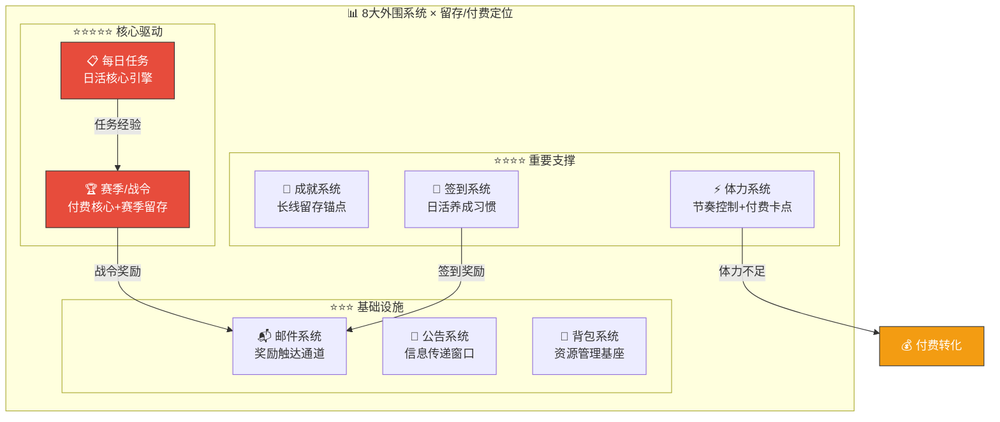
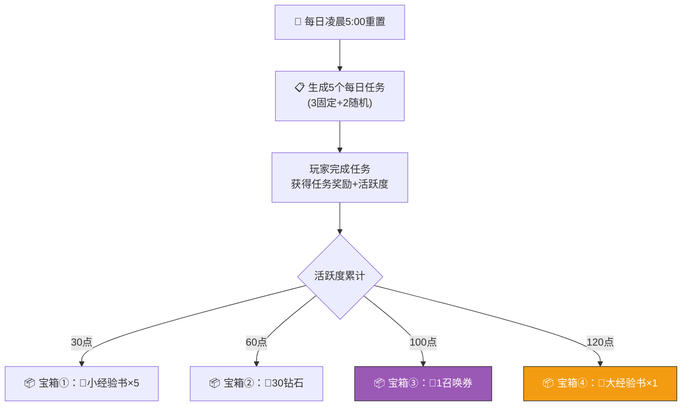
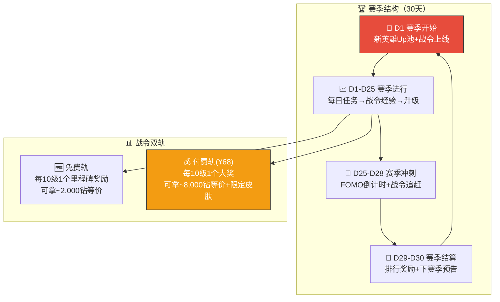
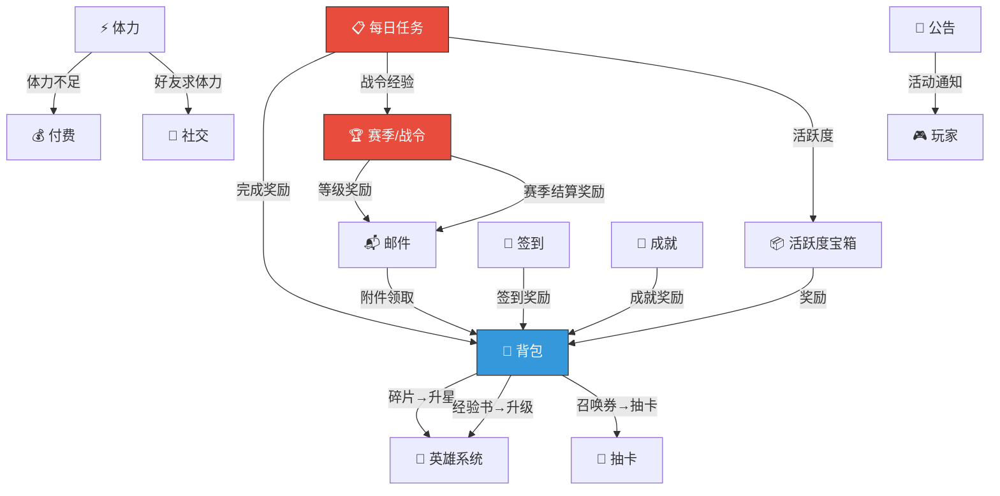


# 🔧 AetheraSurvivors — 外围系统骨架合集

> **文档版本**：v1.0
> **最后更新**：2026-03-24
> **交互编号**：阶段一 #16
> **前置依赖**：GDD.md（v1.18）、经济系统设计.md、付费系统与商业化方案.md、英雄系统骨架设计.md、爽感与留存钩子设计.md
> **验收标准**：✅ 每个系统有明确的留存/付费作用说明

---

## 总览：8大外围系统定位矩阵



| 系统 | 留存贡献 | 付费贡献 | 开发优先级 | 预估工作量 |
|------|---------|---------|-----------|-----------|
| 📋 每日任务 | ⭐⭐⭐⭐⭐ | ⭐⭐ | P0（MVP必备） | 3天 |
| 🏆 赛季/战令 | ⭐⭐⭐⭐⭐ | ⭐⭐⭐⭐⭐ | P0（MVP必备） | 5天 |
| 🏅 成就系统 | ⭐⭐⭐⭐ | ⭐ | P1（首版上线） | 3天 |
| 📅 签到系统 | ⭐⭐⭐⭐ | ⭐ | P0（MVP必备） | 1天 |
| ⚡ 体力系统 | ⭐⭐⭐ | ⭐⭐⭐ | P0（MVP必备） | 2天 |
| 📬 邮件系统 | ⭐⭐ | ⭐ | P0（MVP必备） | 2天 |
| 📢 公告系统 | ⭐⭐ | — | P1（首版上线） | 1天 |
| 🎒 背包系统 | ⭐ | — | P0（MVP必备） | 2天 |

---

## 一、📋 每日任务系统

### 1.1 系统定位

> **一句话**：每日任务是「日活核心引擎」——通过5个任务+活跃度宝箱，驱动玩家每天完成固定行为闭环，同时引导消耗资源和体验不同内容。

### 1.2 留存/付费作用

| 维度 | 作用 | 具体表现 |
|------|------|---------|
| **日留存** | ⭐⭐⭐⭐⭐ 核心驱动 | 每天5个任务=5个理由上线。活跃度宝箱是「今日必上」的诱饵 |
| **周留存** | ⭐⭐⭐ 间接驱动 | 周累计活跃度→额外周奖励（连续7天=大奖） |
| **付费引导** | ⭐⭐ 软引导 | 任务引导消耗体力/钻石/抽卡→资源不足时推付费 |
| **内容消费** | ⭐⭐⭐ 引导体验 | 「使用XX英雄通关」「升级塔到3级」→引导探索不同玩法 |

### 1.3 骨架设计



#### 每日任务池

| 类型 | 任务内容 | 活跃度 | 奖励 | 分类 |
|------|---------|--------|------|------|
| **固定①** | 通关任意关卡1次 | 20 | 📕小经验书×5 + 🪙5,000金币 | 核心行为 |
| **固定②** | 通关任意关卡3次 | 30 | 💎20钻石 | 核心行为 |
| **固定③** | 使用1次英雄技能 | 10 | 📕小经验书×3 | 核心行为 |
| 随机A | 使用[指定英雄]通关1次 | 20 | 🧩英雄碎片×5 | 英雄轮换 |
| 随机B | 选择3个[指定类型]词条 | 20 | 📕中经验书×2 | Build探索 |
| 随机C | 升级任意塔到3级 | 15 | 🪙8,000金币 | 策略教育 |
| 随机D | 3星通关任意关卡1次 | 25 | 💎10钻石 | 挑战驱动 |
| 随机E | 分享1次战斗卡片 | 10 | ⚡20体力 | 社交裂变 |
| 随机F | 观看1次广告 | 10 | 💎5钻石 | IAA驱动 |

> **设计要点**：3固定任务=60活跃度，2随机任务=30-45活跃度。完成全部5任务≥100点→拿到核心的召唤券奖励。120点满活跃需要额外行为（分享/看广告/多打几关）。

#### 关键规则

| 规则 | 说明 |
|------|------|
| 重置时间 | 每日凌晨5:00（与体力/签到同步） |
| 随机规则 | 从随机池中选2个，不重复 |
| 任务追踪 | 实时更新进度（如3/3关） |
| 未完成惩罚 | 无惩罚，但错过奖励=损失厌恶驱动 |
| 红点提示 | 有可完成/可领取任务时，主界面显示红点 |

### 1.4 技术要点

```
// 数据结构骨架
DailyQuestConfig:
  quest_id: string          // "daily_clear_1"
  type: fixed/random
  description: string       // "通关任意关卡1次"
  target_value: int         // 1
  activity_points: int      // 20
  rewards: [{item_id, amount}]

DailyQuestProgress:
  date: string              // "2026-03-24"
  quests: [{quest_id, current_value, is_claimed}]
  activity_points: int
  claimed_boxes: [bool×4]   // 4个活跃度宝箱领取状态
```

---

## 二、🏆 赛季/战令系统

### 2.1 系统定位

> **一句话**：赛季/战令是「付费核心+赛季留存引擎」——30天周期性内容重置，免费/付费双轨奖励，是游戏最重要的付费点（¥68战令）和中长期留存结构。

### 2.2 留存/付费作用

| 维度 | 作用 | 具体表现 |
|------|------|---------|
| **赛季留存** | ⭐⭐⭐⭐⭐ 核心结构 | 30天赛季=30天目标。新赛季=新英雄+新内容+排行重置 |
| **日留存** | ⭐⭐⭐⭐ 战令经验 | 每日做任务获得战令经验→「今天不做就落后了」 |
| **付费核心** | ⭐⭐⭐⭐⭐ 最重要付费点 | 战令¥68=付费率核心。禀赋效应+沉没成本+FOMO三重驱动 |
| **FOMO** | ⭐⭐⭐⭐ 稀缺性 | 赛季限定皮肤/称号→错过就没有 |
| **内容新鲜感** | ⭐⭐⭐⭐ 定期刷新 | 每赛季新英雄+新活动+排行重置→回归动力 |

### 2.3 骨架设计



#### 赛季参数

| 参数 | 值 | 说明 |
|------|-----|------|
| **赛季周期** | 30天 | 标准微信小游戏赛季 |
| **战令等级** | 60级 | 每级100经验 |
| **日均经验** | ~120 | 每日任务提供 |
| **满级天数** | ~25天 | 需每天完成日常 |
| **付费战令价格** | ¥68 | 核心付费产品 |
| **追赶机制** | 后期购买可补领 | 消除犹豫障碍 |

#### 赛季重置内容

| 重置内容 | 说明 |
|---------|------|
| ✅ 战令等级 | 归零，重新升级 |
| ✅ 排行榜 | 清空，重新竞争 |
| ✅ 赛季限定商店 | 新赛季新商品 |
| ✅ 赛季任务 | 新赛季专属成就 |
| ❌ 英雄等级/星级 | 不重置（长线养成） |
| ❌ 钻石/材料余额 | 不重置 |
| ❌ 关卡进度 | 不重置 |

#### 赛季奖励核心里程碑（简表）

| 战令等级 | 免费轨 | 付费轨 |
|---------|--------|--------|
| 10 | 💎100 + 🎫×1 | 💎300 + 🎫×2 |
| 20 | 📕大经验书×3 | 🧩SR碎片×20 + 💎500 |
| 30 | 💎200 + 📗技能书×5 | 🎨专属头像框 + 📕大经验书×10 |
| 40 | 🎫×3 + ⚡×100 | 💎800 + 🧩SSR碎片×10 |
| 50 | 💎300 + 🧩通用碎片×20 | 🏷️专属称号 + 📗技能书×20 |
| 60 | 📕大经验书×5 + 💎500 | 🧩SSR碎片×30 + 💎1,500 + 🎨**赛季限定皮肤** |

> **付费轨总价值约8,000钻等价**，战令售价¥68（≈680钻），价值比约12倍。核心付费转化逻辑：「你已经升到30级了，付费轨有3,000+钻等价奖励在等你，只要¥68」。

### 2.4 技术要点

```
SeasonConfig:
  season_id: string         // "s1_2026"
  start_time: timestamp
  end_time: timestamp
  max_level: int            // 60
  exp_per_level: int        // 100
  pass_price: float         // 68元

BattlePassProgress:
  season_id: string
  level: int
  exp: int
  is_premium: bool          // 是否购买付费战令
  free_claimed: [bool×60]
  premium_claimed: [bool×60]
```

---

## 三、🏅 成就系统

### 3.1 系统定位

> **一句话**：成就系统是「长线留存锚点」——通过分类成就追踪+稀有度分级奖励，给玩家提供跨赛季的长期目标，让「老玩家」有持续回来的理由。

### 3.2 留存/付费作用

| 维度 | 作用 | 具体表现 |
|------|------|---------|
| **长线留存** | ⭐⭐⭐⭐ 核心 | 成就=跨赛季的永久目标。「累计通关500关」→几个月才能完成 |
| **收集驱动** | ⭐⭐⭐ 强迫症 | 成就完成率展示→100%完美主义驱动 |
| **炫耀社交** | ⭐⭐⭐ 称号系统 | 稀有成就→专属称号/头像框→社交炫耀 |
| **付费引导** | ⭐ 间接 | 部分成就需要SR/SSR英雄才能完成→引导抽卡 |
| **回归拉力** | ⭐⭐⭐ 沉没成本 | 已完成80%成就→流失后想回来补完 |

### 3.3 骨架设计

#### 成就分类

| 分类 | 图标 | 成就数量(首版) | 示例 | 设计目标 |
|------|------|--------------|------|---------|
| ⚔️ **战斗** | 剑盾 | 15个 | 累计通关/3星通关/Boss击杀 | 核心玩法驱动 |
| 🦸 **英雄** | 皇冠 | 10个 | 英雄收集/升星/技能满级 | 养成目标 |
| 🗼 **建造** | 塔图标 | 10个 | 累计建造/升级/出售 | 策略探索 |
| 🎲 **词条** | 骰子 | 10个 | 选择词条次数/触发超模Build | Build探索 |
| 💰 **经济** | 金币 | 8个 | 累计获得金币/钻石消耗 | 经济行为 |
| 👥 **社交** | 握手 | 7个 | 分享/PK/好友数 | 裂变引导 |
| **合计** | — | **60个** | — | — |

#### 成就稀有度

| 稀有度 | 比例 | 奖励规模 | 示例 |
|--------|------|---------|------|
| ⬜ 普通 | 50% | 💎10-20 + 材料 | 「通关第1章」 |
| 🔵 稀有 | 30% | 💎50-100 + 材料 | 「累计通关100关」 |
| 🟣 史诗 | 15% | 💎200 + 🧩碎片 + 称号 | 「全英雄收集完毕」 |
| 🟡 传说 | 5% | 💎500 + 🎨头像框 + 限定称号 | 「所有关卡噩梦3星」 |

#### 成就示例（战斗分类）

| 成就名 | 条件 | 稀有度 | 奖励 |
|--------|------|--------|------|
| 初出茅庐 | 通关第1关 | ⬜ | 💎10 |
| 百战老兵 | 累计通关100关 | 🔵 | 💎50 + 📕大经验书×2 |
| 千里征途 | 累计通关500关 | 🟣 | 💎200 + 🏷️「征服者」称号 |
| 完美指挥官 | 普通难度全30章3星通关 | 🟡 | 💎500 + 🎨金色头像框 |
| 噩梦终结者 | 噩梦难度全30章3星通关 | 🟡 | 💎500 + 🏷️「噩梦终结者」限定称号 |

### 3.4 技术要点

```
AchievementConfig:
  achievement_id: string
  category: Battle/Hero/Build/Economy/Social
  name: string
  description: string
  rarity: Normal/Rare/Epic/Legendary
  condition_type: enum      // CumulativeClear/CollectHero/...
  target_value: int
  rewards: [{item_id, amount}]
  title_id: string?         // 可解锁的称号ID

AchievementProgress:
  achievement_id: string
  current_value: int
  is_completed: bool
  is_claimed: bool
```

---

## 四、📅 签到系统

### 4.1 系统定位

> **一句话**：签到系统是「日活养成习惯工具」——用极低操作成本（点1下）和递增奖励曲线，让玩家形成「每天打开游戏」的条件反射，尤其在玩家动力不足时提供最低限度的登录理由。

### 4.2 留存/付费作用

| 维度 | 作用 | 具体表现 |
|------|------|---------|
| **日留存** | ⭐⭐⭐⭐ 核心 | 签到是最低成本的日活行为：打开游戏→点一下→拿奖励 |
| **习惯养成** | ⭐⭐⭐⭐ 连续性 | 连签奖励递增→中断=损失→持续登录 |
| **沉没成本** | ⭐⭐⭐ 防流失 | 「已连签6天，明天就是大奖」→不舍得断 |
| **付费** | ⭐ 极弱 | 签到奖励为小额资源，不直接驱动付费 |

### 4.3 骨架设计

#### 7日签到循环

| 天数 | 奖励 | 说明 |
|------|------|------|
| D1 | 💎10 + ⚡30体力 | 小额入门 |
| D2 | 📕小经验书×10 | 养成材料 |
| D3 | 🪙10,000金币 + ⚡30体力 | 经济补充 |
| D4 | 📕中经验书×3 | 品质递增 |
| D5 | 💎30 + 📗小技能书×3 | 开始有价值 |
| D6 | 🎫召唤券×1 + ⚡50体力 | 高价值 |
| **D7** | **🧩SR碎片×10 + 💎50 + ⚡60** | **大奖（断签动力阻断）** |

> **7天循环后重置**，重新从D1开始。D7大奖是核心留存锚——已签6天的玩家极不愿意断签。

#### 累计签到里程碑（不重置）

| 累计天数 | 奖励 | 说明 |
|---------|------|------|
| 7天 | 🧩英雄碎片×10 | 首个里程碑 |
| 14天 | 💎100 + 📕大经验书×3 | 2周成就 |
| 30天 | 🧩SR碎片×20 + 🎨签到头像框 | 月度大奖 |
| 60天 | 🧩SSR碎片×10 + 💎300 | 老玩家奖励 |
| 90天 | 🏷️「勤勉指挥官」称号 + 💎500 | 长线奖励 |

#### 关键规则

| 规则 | 说明 |
|------|------|
| 签到时间 | 每日5:00重置（与每日任务同步） |
| 断签机制 | 7日循环签到断签→从D1重新开始（累计签到不受影响） |
| 补签 | 每月可补签2次（消耗50钻石/次）→付费小入口 |
| 自动签到 | 登录即自动签到，无需手动操作→降低操作成本 |
| 红点提醒 | 今日未签到→主界面签到图标红点 |

### 4.4 技术要点

```
SignInProgress:
  consecutive_days: int     // 当前连续签到天数(1-7循环)
  total_days: int           // 累计签到总天数
  last_sign_date: string    // 上次签到日期
  monthly_makeup_used: int  // 本月已用补签次数
  milestone_claimed: [bool] // 累计里程碑领取状态
```

---

## 五、⚡ 体力系统

### 5.1 系统定位

> **一句话**：体力系统是「节奏控制器+付费卡点」——通过限制每日免费游玩次数，控制内容消耗速度（30章不会1天打完），同时在「想玩但没体力」时创造自然的付费转化机会。

### 5.2 留存/付费作用

| 维度 | 作用 | 具体表现 |
|------|------|---------|
| **节奏控制** | ⭐⭐⭐ 核心功能 | 日均免费游玩~20-30关→30章内容至少10天才能打完 |
| **分次登录** | ⭐⭐⭐ 多次登录 | 体力5分钟恢复1点→每2小时玩2关→引导多次登录 |
| **付费卡点** | ⭐⭐⭐ 自然转化 | 「体力不足，买60体力只需50钻石」→小额高频付费 |
| **社交驱动** | ⭐⭐ 好友送体力 | 体力不足→向好友求体力→社交互动 |

### 5.3 骨架设计

#### 核心参数

| 参数 | 值 | 说明 |
|------|-----|------|
| **上限** | 120 | 约可打15-20关 |
| **恢复速度** | 1点/5分钟 | 日自然恢复288点 |
| **关卡消耗** | 6-10/关 | 随章节递增 |
| **免费日游玩量** | ~20-30关 | 足够但不溢出 |
| **购买价格** | 50/100/200钻石 | 阶梯递增（每日3次） |
| **购买数量** | 60体力/次 | 固定 |
| **好友赠送** | 10体力/次 | 每天最多领200(20人) |

#### 体力节奏设计

```
日体力收支模型（免费玩家）:
  
  收入:
    自然恢复:      288点/日（上限120，溢出不累积）
    每日任务奖励:    30点/日
    签到奖励:       30-60点/日
    好友送体力:     ~100点/日（10个活跃好友）
    看广告:         60点/日（3次×20点）
    ─────────────────────────────
    总计:           ~508点/日（实际可用~400点，因上限溢出）
  
  支出:
    前期(1-5章):    6点/关 × 25-30关 = 150-180点
    中期(6-15章):   7-8点/关 × 20-25关 = 160-200点
    后期(16-30章):  8-10点/关 × 15-20关 = 150-200点
    ─────────────────────────────
    结论: 免费玩家每天可打20-30关，体验充足但不会1天打完30章
    
  卡点:
    • 连续刷关/冲排行→体力不足→推送「买60体力仅50钻」
    • 每日体力购买上限3次→深度玩家不够用→月卡每日+20体力有价值
```

#### 体力恢复提醒

| 触发条件 | 提醒方式 | 说明 |
|---------|---------|------|
| 体力=0且>30分钟 | 微信服务通知（可选） | 「体力已恢复到30，快来继续战斗！」 |
| 体力溢出（120/120）| 登录时提醒 | 「体力已满，不玩就浪费了！」 |
| 体力<1关消耗 | 弹窗 | 「体力不足！购买/看广告/向好友求助」 |

### 5.4 技术要点

```
StaminaData:
  current: int              // 当前体力
  max_cap: int              // 上限120
  last_regen_time: timestamp // 上次恢复时间（用于离线计算）
  daily_buy_count: int      // 今日已购买次数
  
// 离线恢复计算
func CalculateOfflineRegen():
  elapsed = now - last_regen_time
  regen_count = elapsed / 300  // 每5分钟1点
  current = min(current + regen_count, max_cap)
```

---

## 六、📬 邮件系统

### 6.1 系统定位

> **一句话**：邮件系统是「奖励触达通道+运营工具」——承载系统奖励发放、活动补偿、运营通知等，是连接游戏运营和玩家的核心管道。没有邮件系统，其他系统的奖励无法可靠送达玩家。

### 6.2 留存/付费作用

| 维度 | 作用 | 具体表现 |
|------|------|---------|
| **奖励触达** | ⭐⭐ 基础设施 | 排行奖励/活动奖励/补偿→通过邮件发放 |
| **回归拉力** | ⭐⭐ 间接 | 流失玩家回归→「你有5封未读邮件(含奖励)」→好奇心驱动 |
| **运营能力** | ⭐⭐⭐ 必需 | 紧急补偿/全服奖励/定向奖励→邮件是唯一可靠通道 |
| **付费** | ⭐ 极弱 | 邮件本身不驱动付费，但可附带「限时礼包」链接 |

### 6.3 骨架设计

#### 邮件类型

| 类型 | 发送方 | 内容 | 有效期 | 示例 |
|------|--------|------|--------|------|
| **系统奖励** | 系统自动 | 附件(资源) + 说明 | 30天 | 赛季排行奖励、成就奖励 |
| **活动通知** | 运营后台 | 纯文字 + 可附件 | 7天 | 新赛季预告、活动说明 |
| **补偿邮件** | 运营后台 | 附件(资源) + 致歉说明 | 30天 | Bug补偿、维护补偿 |
| **好友消息** | 好友系统 | 体力/援军通知 | 3天 | 「好友XX送你10体力」 |
| **战令到期** | 系统自动 | 提醒 + 可附件 | 3天 | 「赛季还剩3天，未领奖励即将消失」 |

#### 关键规则

| 规则 | 说明 |
|------|------|
| 邮件上限 | 最多保存100封（超过自动删除最旧的已读邮件） |
| 附件领取 | 点击「领取」按钮一键领取附件 |
| 一键领取 | 支持「全部领取」一键领取所有邮件附件 |
| 过期机制 | 过期未领取的邮件自动删除（附件丢失） |
| 红点提示 | 有未读邮件→主界面邮件图标红点+数字角标 |
| 离线邮件 | 玩家离线期间的邮件在登录时统一送达 |

### 6.4 技术要点

```
MailData:
  mail_id: string
  type: SystemReward/Activity/Compensation/Friend/Reminder
  title: string
  content: string
  attachments: [{item_id, amount}]
  send_time: timestamp
  expire_time: timestamp
  is_read: bool
  is_claimed: bool          // 附件是否已领取

// 存储：本地缓存+服务端同步
// 全服邮件：服务端配置，客户端登录时拉取
// 个人邮件：服务端存储，推送通知
```

---

## 七、📢 公告系统

### 7.1 系统定位

> **一句话**：公告系统是「信息传递窗口」——在玩家登录时展示版本更新、活动预告、维护通知等信息，确保关键信息100%触达。与邮件系统的区别：公告是「强制阅读的全屏通知」，邮件是「可选领取的个人消息」。

### 7.2 留存/付费作用

| 维度 | 作用 | 具体表现 |
|------|------|---------|
| **信息触达** | ⭐⭐ 核心功能 | 活动/更新/维护信息100%触达 |
| **回归预热** | ⭐⭐ 间接 | 新赛季预告→提前激发期待→赛季首日回归 |
| **付费** | — | 公告本身不驱动付费（用邮件+弹窗做付费推送） |

### 7.3 骨架设计

#### 公告类型

| 类型 | 触发时机 | 展示方式 | 关闭条件 |
|------|---------|---------|---------|
| **版本更新** | 版本更新后首次登录 | 全屏弹窗 + 更新内容列表 | 手动关闭（标记「今日不再显示」） |
| **活动预告** | 活动开始前1-3天 | 半屏Banner | 手动关闭 或 活动开始后自动消失 |
| **维护通知** | 维护前6小时 | 顶部滚动条 + 弹窗 | 维护结束后消失 |
| **紧急公告** | 运营手动推送 | 全屏弹窗（不可跳过，需确认） | 点击「我知道了」 |
| **新赛季预告** | 赛季结束前3天 | 主界面浮窗 + 登录弹窗 | 新赛季开始后消失 |

#### 关键规则

| 规则 | 说明 |
|------|------|
| 展示优先级 | 紧急公告 > 维护通知 > 版本更新 > 活动预告 |
| 不重复展示 | 同一公告只弹窗1次（除非勾选「下次登录再提醒」） |
| 查看历史 | 主界面右上角「公告」按钮可查看历史公告列表 |
| 内容格式 | 支持富文本（标题+正文+图片+按钮） |
| 多语言 | 首版仅中文，预留多语言字段 |

### 7.4 技术要点

```
AnnouncementConfig:
  announcement_id: string
  type: VersionUpdate/Activity/Maintenance/Emergency/SeasonPreview
  title: string
  content: string           // 富文本(Markdown转HTML)
  image_url: string?        // 可选配图
  priority: int             // 展示优先级
  start_time: timestamp
  end_time: timestamp
  is_force_read: bool       // 是否强制阅读（紧急公告）

// 数据源：服务端JSON配置 → 客户端登录时拉取 → 与本地已读列表对比
```

---

## 八、🎒 背包系统

### 8.1 系统定位

> **一句话**：背包系统是「资源管理基座」——统一管理玩家拥有的所有道具、材料、碎片，为英雄养成/抽卡/交易等系统提供底层数据支撑。是最基础的基建系统，没有它其他系统无法正常运转。

### 8.2 留存/付费作用

| 维度 | 作用 | 具体表现 |
|------|------|---------|
| **基础设施** | ⭐ 必需但无直接留存 | 所有资源的存/取/展示都依赖背包 |
| **目标可视** | ⭐⭐ 间接留存 | 背包展示碎片进度→「还差20碎片就能解锁SR」→驱动继续玩 |
| **付费** | — | 背包本身不驱动付费 |

### 8.3 骨架设计

#### 道具分类

| 分类 | 图标 | 包含道具 | 堆叠规则 |
|------|------|---------|---------|
| 💎 **货币** | 金色 | 钻石、金币 | 显示数量（不占格子） |
| ⚡ **消耗品** | 绿色 | 体力药剂、经验加成药水 | 堆叠（最大999） |
| 📕 **材料** | 蓝色 | 经验书(小/中/大)、技能书(小/中/大) | 堆叠（最大999） |
| 🧩 **碎片** | 紫色 | 各英雄碎片、通用碎片 | 堆叠（最大999）+显示解锁/升星进度 |
| 🎫 **凭证** | 橙色 | 召唤券、活动券 | 堆叠（最大99） |
| 🎨 **装饰** | 彩色 | 头像框、称号、限定皮肤 | 不堆叠（每个独立条目） |

#### 界面设计骨架

```
┌─────────────────────────────────────────────┐
│  🎒 背包                    排序▼  筛选☐   │
├─────────────────────────────────────────────┤
│  [💎全部] [📕材料] [🧩碎片] [🎫凭证] [🎨装饰]  │
├──────┬──────┬──────┬──────┬──────┬──────────┤
│ 📕×52│ 📗×18│ 📘×3 │ 🧩×45│ 🎫×5 │          │
│小经验 │中经验 │大经验 │骑士碎│召唤券│          │
├──────┼──────┼──────┼──────┼──────┤          │
│ 📕×12│ 📗×8 │ 🧩×20│ 🧩×8 │ ...  │          │
│小技能 │中技能 │女巫碎│矿工碎│      │          │
└──────┴──────┴──────┴──────┴──────┴──────────┘
          点击道具 → 弹出详情面板
          ┌──────────────────┐
          │ 📕 小经验书 ×52  │
          │ 用于英雄升级     │
          │ [使用] [获取途径] │
          └──────────────────┘
```

#### 关键规则

| 规则 | 说明 |
|------|------|
| 上限 | 货币无上限（数值上限9,999,999）；材料/碎片每种最多999 |
| 排序 | 按稀有度/获取时间/数量排序 |
| 筛选 | 按分类Tab筛选 |
| 快捷入口 | 碎片详情可直接跳转到英雄升星界面 |
| 满仓提示 | 某种道具达到999时提示「已满，请使用」 |
| 获取途径 | 每个道具详情页显示「获取途径」（关卡/商城/活动） |

### 8.4 技术要点

```
ItemConfig:
  item_id: string           // "exp_book_small"
  name: string              // "小经验书"
  category: Currency/Consumable/Material/Fragment/Ticket/Cosmetic
  max_stack: int            // 999
  icon: string              // 图标资源路径
  description: string
  use_action: string?       // 可使用的道具才有

InventoryData:
  items: Map<item_id, amount>
  
// 存储：wx.setStorageSync + 内存加密(关键数值)
// 增删操作统一走InventoryManager，支持批量操作+事件通知
```

---

## 九、8系统协同矩阵

### 9.1 系统间数据流



### 9.2 玩家日常触达时序

```
典型日常登录流程（免费玩家）:

登录
  ├─① 📅 签到 → 领取今日签到奖励（自动）
  ├─② 📢 公告 → 查看新公告（如有）
  ├─③ 📬 邮件 → 一键领取未读邮件附件
  ├─④ 📋 每日任务 → 查看今日任务列表
  │     ├── 打3关 → ⚡消耗体力 → 🎒获得材料 → 🏅成就进度+1
  │     ├── 用指定英雄 → 🦸英雄经验 → 🏆战令经验+20
  │     └── 分享卡片 → 👥社交
  ├─⑤ 📋 领取任务奖励 → 🎒入背包
  ├─⑥ 📋 领取活跃度宝箱 → 🎒入背包
  ├─⑦ 🏆 查看战令进度 → 领取已达等级奖励
  └─⑧ 退出（或继续刷关）

时间: 5-10分钟完成全部日常 → 之后可自由刷关/PK/养成
```

### 9.3 留存钩子触发矩阵

| 时间点 | 触发系统 | 留存钩子 | 心理学原理 |
|--------|---------|---------|-----------|
| 登录时 | 📅签到 | 「连签第6天了！明天大奖」 | 沉没成本 |
| 登录时 | 📋每日任务 | 「今日5个任务，120活跃度=1召唤券」 | 目标设定 |
| 登录时 | 📬邮件 | 「你有3封未读邮件(含奖励)」 | 好奇心 |
| 打关后 | 🏆战令 | 「战令还差30经验升级！再打1关」 | 目标梯度 |
| 打关后 | 🏅成就 | 「累计通关99/100，差1关！」 | 蔡格尼克效应 |
| 体力耗尽 | ⚡体力 | 「2小时后体力恢复到30，设置提醒？」 | 预约回归 |
| 退出前 | 📋每日任务 | 「还有2个任务未完成，错过今日奖励」 | 损失厌恶 |
| 赛季末 | 🏆战令 | 「赛季还剩3天，你的战令在45级」 | FOMO |

---

## 十、技术实现优先级

### 10.1 MVP阶段必备（P0）

| 系统 | MVP最小功能 | 工作量 |
|------|-----------|--------|
| 🎒 背包 | 道具存取+分类展示+堆叠 | 2天 |
| ⚡ 体力 | 恢复+消耗+购买+好友送 | 2天 |
| 📅 签到 | 7日循环签到+累计里程碑 | 1天 |
| 📋 每日任务 | 5个任务+4级活跃度宝箱 | 3天 |
| 🏆 赛季/战令 | 60级双轨+经验+付费购买 | 5天 |
| 📬 邮件 | 收发+附件+一键领取 | 2天 |
| **P0合计** | — | **15天** |

### 10.2 首版上线（P1）

| 系统 | 补充功能 | 工作量 |
|------|---------|--------|
| 🏅 成就 | 60个成就+分类+进度追踪 | 3天 |
| 📢 公告 | 分类公告+弹窗+历史查看 | 1天 |
| **P1合计** | — | **4天** |

### 10.3 微信小游戏适配清单

| 系统 | 适配项 | 方案 |
|------|--------|------|
| 所有系统 | 数据存储 | wx.setStorageSync/getStorageSync |
| 体力 | 离线恢复 | 客户端计算 + 服务端校验 |
| 邮件 | 全服邮件 | 服务端JSON + CDN缓存 |
| 公告 | 公告内容 | 服务端JSON + 本地缓存 |
| 战令 | 付费购买 | 微信虚拟支付API + 服务端验签 |
| 签到 | 时间校验 | 服务端时间 + 防改时间作弊 |
| 背包 | 关键数值 | 内存加密存储(金币/钻石/碎片) |

---

## 十一、验收自检

| 验收标准 | 要求 | 实际 | 状态 |
|---------|------|------|------|
| ✅ **每个系统有留存/付费作用说明** | 8个系统各有表格说明 | §1-8每系统均有§X.2留存/付费作用表 | ✅ |
| **每日任务** | 骨架设计 | §1 任务池+活跃度宝箱+红点+规则 | ✅ |
| **赛季/战令** | 骨架设计 | §2 参数+重置内容+奖励表+心理设计 | ✅ |
| **成就系统** | 骨架设计 | §3 分类+稀有度+示例+进度追踪 | ✅ |
| **签到系统** | 骨架设计 | §4 7日循环+累计里程碑+补签 | ✅ |
| **体力系统** | 骨架设计 | §5 参数+收支模型+恢复提醒 | ✅ |
| **邮件系统** | 骨架设计 | §6 类型+规则+过期机制 | ✅ |
| **公告系统** | 骨架设计 | §7 类型+优先级+展示规则 | ✅ |
| **背包系统** | 骨架设计 | §8 分类+界面骨架+堆叠规则 | ✅ |
| **系统协同** | 系统间如何联动 | §9 数据流图+日常时序+留存钩子矩阵 | ✅ |
| **技术可行** | 微信小游戏可实现 | §10 优先级+适配清单 | ✅ |

---

> 📝 **文档维护规则**：
> 1. 本文档为GDD第十二章「外围系统骨架」的详细展开
> 2. 每个系统的详细实现设计将在阶段四（#258-#260）中完成
> 3. 数值调整需同步检查与经济系统/付费系统的一致性
> 4. 新增系统需先在此文档中添加骨架，再进入开发
