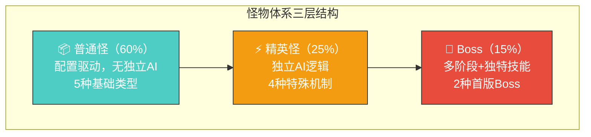
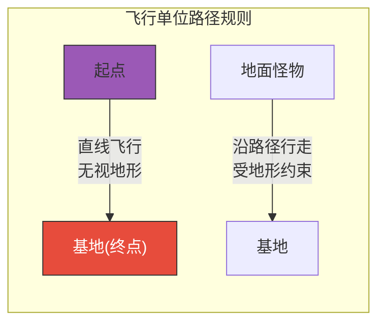
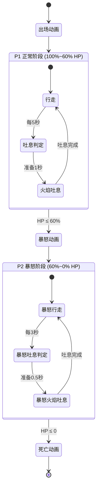
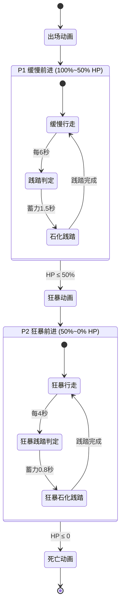
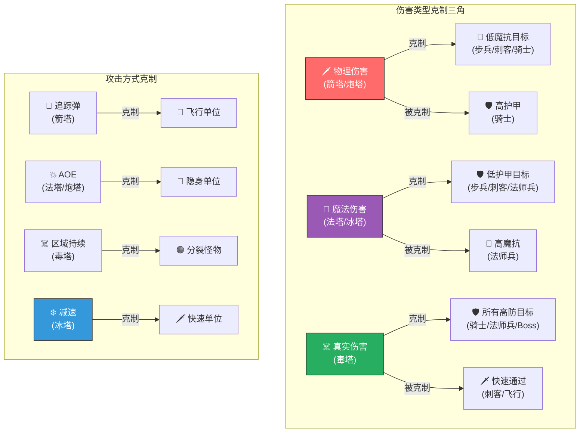


# 👹 AetheraSurvivors — 怪物体系详细设计

> **文档版本**：v1.0
> **最后更新**：2026-03-24
> **交互编号**：阶段一 #8
> **前置依赖**：GDD.md（v1.0）、核心战斗循环设计.md（v1.0）、塔体系设计.md（v1.0）
> **验收标准**：✅ 难度曲线图 + ✅ 怪物克制关系矩阵

---

## 一、怪物体系设计哲学

### 1.1 核心设计原则

| 原则 | 说明 | 反面案例（避免） |
|------|------|----------------|
| **功能驱动** | 每种怪物存在是为了考验玩家某种能力 | 怪物只是血量/速度数字不同 |
| **克制明确** | 看到怪物图标就知道该用什么塔应对 | 所有怪物用同一套塔就能打 |
| **渐进引入** | 新怪物类型首次出现时少量混入，给玩家学习时间 | 整波全新怪物让玩家不知所措 |
| **视觉区分** | 1秒内通过外观区分怪物类型 | 所有怪物长得差不多 |
| **精英有仪式** | 精英怪出场有音效+特效，死亡有独特奖励 | 精英怪混在普通怪里毫无存在感 |
| **Boss是考试** | Boss考验玩家整场Build的综合能力 | Boss只是血量超多的普通怪 |

### 1.2 怪物角色定位体系



### 1.3 怪物设计目标——考验玩家什么？

| 怪物类型 | 考验的能力 | 错误应对的后果 |
|---------|----------|-------------|
| 🗡️ 步兵 | 基础布阵能力 | 无（教学单位） |
| 🗡️ 刺客 | 减速/控制布局 | 刺客穿过防线漏怪 |
| 🛡️ 骑士 | 塔种多样性（魔法/真伤） | 物理塔打不动骑士 |
| 🔮 法师兵 | 塔种多样性（物理塔） | 魔法塔打不动法师兵 |
| 🦅 飞行 | 追踪弹/箭塔覆盖 | 飞行走直线绕过所有塔 |
| 🩹 治疗者 | 集火优先级判断 | 怪物一直回血打不完 |
| 🟢 分裂史莱姆 | AOE/DOT储备 | 小怪越杀越多 |
| 👻 隐身盗贼 | AOE覆盖能力 | 盗贼隐身穿过防线 |
| 🛡️ 护盾法师 | 集火/DPS储备 | 护盾不断刷新打不破 |
| 🐉 火龙Boss | 全面Build能力+塔位管理 | 塔被吐息摧毁/DPS不够 |
| 🗿 石巨人Boss | 持续DPS+控制能力 | Boss暴怒后冲到基地 |

---

## 二、普通怪物详细设计

### 2.1 基础属性公式

所有怪物的属性基于**基准值 × 章节倍率 × 难度模式倍率**计算：

```
怪物属性 = 基准值 × 章节倍率 × 难度模式倍率

章节倍率（30章）：
  第N章倍率 = 1.0 + (N-1) × 0.12
  第1章 = 1.00
  第5章 = 1.48
  第10章 = 2.08
  第15章 = 2.68
  第20章 = 3.28
  第25章 = 3.88
  第30章 = 4.48

难度模式倍率：
  普通 = 1.0
  困难 = 1.5
  噩梦 = 2.5
```

### 2.2 🗡️ 步兵（Infantry）——基准单位

#### 设计定位

| 维度 | 内容 |
|------|------|
| **定位** | 基准参考单位，纯血包，最常见的炮灰 |
| **设计目的** | 教学单位；所有数值的基准锚定；给玩家提供「击杀反馈」 |
| **出现频率** | 每波主力，始终占60-70%的数量 |
| **视觉** | 中等体型持剑士兵，行走动画4帧 |
| **击杀奖励** | 8金（基准） |

#### 基准属性表（第1章 普通难度）

| 属性 | 值 | 说明 |
|------|-----|------|
| 血量 | 200 | 基准血量 |
| 移速(格/s) | 1.5 | 基准速度 |
| 护甲 | 10 | 极低（9.1%物理减免） |
| 魔抗 | 10 | 极低（9.1%魔法减免） |
| 体型 | 1.0（标准） | 碰撞体积基准 |
| 击杀金币 | 8 | 基准击杀奖励 |
| 难度权重 | 1.0 | 难度计算基准 |

#### 30章属性递增表

| 章节 | 血量 | 移速 | 护甲 | 魔抗 | 击杀金币 |
|------|------|------|------|------|---------|
| 第1章 | 200 | 1.5 | 10 | 10 | 8 |
| 第5章 | 296 | 1.5 | 15 | 15 | 10 |
| 第10章 | 416 | 1.6 | 22 | 22 | 13 |
| 第15章 | 536 | 1.6 | 30 | 30 | 16 |
| 第20章 | 656 | 1.7 | 38 | 38 | 19 |
| 第25章 | 776 | 1.7 | 46 | 46 | 22 |
| 第30章 | 896 | 1.8 | 55 | 55 | 25 |

> **移速递增**：步兵移速每10章+0.1格/s（微量加快，保持紧张感但不突变）。
> **护甲/魔抗递增**：线性增长，第30章55护甲=35.5%物理减免。

#### 特殊规则

- **无特殊机制**：步兵是纯配置驱动单位，无任何独立AI逻辑
- **Debuff全接收**：减速/灼烧/冰冻/击退全部生效
- **最常见死因**：被AOE塔连带击杀

---

### 2.3 🗡️ 刺客（Assassin）——速度威胁

#### 设计定位

| 维度 | 内容 |
|------|------|
| **定位** | 高速低血量冲锋兵，考验玩家的减速/控制布局 |
| **设计目的** | 迫使玩家配备冰塔/减速手段，纯DPS流会漏怪 |
| **出现频率** | 每关2-4波含刺客，每波5-15只 |
| **视觉** | 黑色斗篷持匕首，快速奔跑动画（腿部动作频率×1.5） |
| **击杀奖励** | 10金（略高于步兵） |

#### 基准属性表（第1章 普通难度）

| 属性 | 值 | 与步兵对比 | 说明 |
|------|-----|----------|------|
| 血量 | 100 | 50% | 脆皮 |
| 移速(格/s) | 2.5 | 167% | 极快 |
| 护甲 | 0 | 0% | 无甲 |
| 魔抗 | 5 | 50% | 极低 |
| 体型 | 0.7（较小） | — | 碰撞体积小 |
| 击杀金币 | 10 | 125% | — |
| 难度权重 | 1.5 | — | — |

#### 30章属性递增表

| 章节 | 血量 | 移速 | 护甲 | 魔抗 | 击杀金币 |
|------|------|------|------|------|---------|
| 第1章 | 100 | 2.5 | 0 | 5 | 10 |
| 第5章 | 148 | 2.6 | 0 | 8 | 12 |
| 第10章 | 208 | 2.7 | 5 | 12 | 15 |
| 第15章 | 268 | 2.8 | 8 | 16 | 18 |
| 第20章 | 328 | 2.9 | 12 | 20 | 21 |
| 第25章 | 388 | 3.0 | 16 | 24 | 24 |
| 第30章 | 448 | 3.2 | 20 | 28 | 28 |

> **移速递增**：刺客速度增长比步兵更快（每5章+0.1~0.2），后期刺客非常快。

#### 对塔的威胁分析

| 塔 | 应对效果 | 说明 |
|----|---------|------|
| 🏹 箭塔 | ★★★★ | 追踪弹100%命中，高单体DPS快速击杀 |
| 🔮 法塔 | ★★★ | AOE可命中但预判偏差大（速度快→偏移大） |
| ❄️ 冰塔 | ★★★★★ | **完美克制**，减速后刺客失去唯一优势 |
| 💣 炮塔 | ★★ | 弹速太慢，大概率打空（30%以上miss率） |
| ☠️ 毒塔 | ★★ | 停留时间太短，真伤来不及生效 |

#### 特殊规则

- **出怪间隔**：0.5秒（密集出怪，一窝蜂冲过来）
- **成群结队**：刺客总是以5-15只为一组密集出现
- **不走拐弯**：刺客在拐弯处速度不降低（保持全速过弯）

---

### 2.4 🛡️ 骑士（Knight）——物理抗性墙

#### 设计定位

| 维度 | 内容 |
|------|------|
| **定位** | 高血量高护甲肉盾，物理伤害的克星 |
| **设计目的** | 迫使玩家配备魔法塔/毒塔，纯箭塔+炮塔会被卡住 |
| **出现频率** | 第3波+开始出现，每关1-3波含骑士 |
| **视觉** | 全身重甲持盾，行走缓慢但沉稳的动画 |
| **击杀奖励** | 15金（高于步兵） |

#### 基准属性表（第1章 普通难度）

| 属性 | 值 | 与步兵对比 | 说明 |
|------|-----|----------|------|
| 血量 | 500 | 250% | 极高血量 |
| 移速(格/s) | 0.8 | 53% | 慢如蜗牛 |
| 护甲 | 100 | 1000% | **50%物理减免** |
| 魔抗 | 15 | 150% | 略高 |
| 体型 | 1.3（较大） | — | 碰撞体积大 |
| 击杀金币 | 15 | 188% | — |
| 难度权重 | 2.0 | — | — |

#### 30章属性递增表

| 章节 | 血量 | 移速 | 护甲 | 魔抗 | 击杀金币 | 物理减免 |
|------|------|------|------|------|---------|---------|
| 第1章 | 500 | 0.8 | 100 | 15 | 15 | 50.0% |
| 第5章 | 740 | 0.8 | 130 | 20 | 19 | 56.5% |
| 第10章 | 1040 | 0.9 | 170 | 28 | 24 | 63.0% |
| 第15章 | 1340 | 0.9 | 210 | 36 | 29 | 67.7% |
| 第20章 | 1640 | 1.0 | 250 | 44 | 34 | 71.4% |
| 第25章 | 1940 | 1.0 | 290 | 52 | 39 | 74.4% |
| 第30章 | 2240 | 1.1 | 330 | 60 | 45 | 76.7% |

> **关键**：第30章骑士护甲330→76.7%物理减免！箭塔3级（50攻击力）实际只打11.7点。**必须用魔法塔/毒塔！**

#### 物理伤害vs骑士的实际DPS分析

```
伤害公式: 最终伤害 = 攻击力 × (1 - 护甲/(护甲+100))

箭塔3级(50攻击力) vs 骑士(100甲, 第1章):
  最终伤害 = 50 × (1 - 100/200) = 50 × 0.5 = 25
  DPS = 25 × 1.44 = 36.0（原72.0的50%）

箭塔3级 vs 骑士(330甲, 第30章):
  最终伤害 = 50 × (1 - 330/430) = 50 × 0.233 = 11.7
  DPS = 11.7 × 1.44 = 16.8（原72.0的23%！）

法塔3级(36攻击力) vs 骑士(15魔抗, 第1章):
  最终伤害 = 36 × (1 - 15/115) = 36 × 0.87 = 31.3
  DPS = 31.3 × 0.96 = 30.1（几乎无损）

毒塔3级(24真伤/s) vs 任何骑士:
  DPS = 24.0（100%！无视护甲）
```

#### 特殊规则

- **出怪间隔**：1.5秒（一个个缓慢走来，像阅兵式）
- **不被击退**：3级炮塔击退对骑士仅击退0.5格（减半）
- **护甲随章节指数增长**：后期骑士是玩家换阵的核心催化剂

---

### 2.5 🔮 法师兵（Mage）——魔法抗性兵

#### 设计定位

| 维度 | 内容 |
|------|------|
| **定位** | 高魔抗中血量，魔法伤害的克星 |
| **设计目的** | 与骑士形成「物理/魔法」双向克制，迫使玩家塔种多样化 |
| **出现频率** | 第4波+开始出现，常与骑士交替出现 |
| **视觉** | 蓝色法袍持法杖，身周有微弱魔法粒子 |
| **击杀奖励** | 12金 |

#### 基准属性表（第1章 普通难度）

| 属性 | 值 | 与步兵对比 | 说明 |
|------|-----|----------|------|
| 血量 | 250 | 125% | 中等偏高 |
| 移速(格/s) | 1.3 | 87% | 中等 |
| 护甲 | 10 | 100% | 低 |
| 魔抗 | 80 | 800% | **44.4%魔法减免** |
| 体型 | 1.0（标准） | — | 标准 |
| 击杀金币 | 12 | 150% | — |
| 难度权重 | 1.8 | — | — |

#### 30章属性递增表

| 章节 | 血量 | 移速 | 护甲 | 魔抗 | 击杀金币 | 魔法减免 |
|------|------|------|------|------|---------|---------|
| 第1章 | 250 | 1.3 | 10 | 80 | 12 | 44.4% |
| 第5章 | 370 | 1.3 | 15 | 108 | 15 | 51.9% |
| 第10章 | 520 | 1.4 | 22 | 148 | 19 | 59.7% |
| 第15章 | 670 | 1.4 | 30 | 188 | 23 | 65.3% |
| 第20章 | 820 | 1.5 | 38 | 228 | 27 | 69.5% |
| 第25章 | 970 | 1.5 | 46 | 268 | 31 | 72.8% |
| 第30章 | 1120 | 1.6 | 55 | 310 | 35 | 75.6% |

> **法师兵与骑士的对称设计**：骑士克制物理塔，法师兵克制魔法塔。玩家**必须**混搭塔种。

#### 魔法伤害vs法师兵的实际DPS分析

```
法塔3级(36攻击力) vs 法师兵(80魔抗, 第1章):
  最终伤害 = 36 × (1 - 80/180) = 36 × 0.556 = 20.0
  DPS = 20.0 × 0.96 = 19.2（原34.6单体DPS的55%）

法塔3级 vs 法师兵(310魔抗, 第30章):
  最终伤害 = 36 × (1 - 310/410) = 36 × 0.244 = 8.8
  DPS = 8.8 × 0.96 = 8.4（原34.6的24%！）

箭塔3级(50物理攻击) vs 法师兵(10甲, 第1章):
  最终伤害 = 50 × (1 - 10/110) = 50 × 0.91 = 45.5
  DPS = 45.5 × 1.44 = 65.5（接近满伤害）
```

#### 特殊规则

- **出怪间隔**：1.0秒（标准节奏）
- **常与骑士配合**：同一波中骑士在前吸收物理，法师兵在后吸收魔法
- **克制提示**：首次出现法师兵时，UI会提示「这个敌人抵抗魔法，试试物理塔！」

---

### 2.6 🦅 飞行单位（Flyer）——路径无视者

#### 设计定位

| 维度 | 内容 |
|------|------|
| **定位** | 无视地形走直线，考验塔的覆盖范围和追踪能力 |
| **设计目的** | 打破玩家「只关注路径」的思维惯性，迫使布阵考虑全地图 |
| **出现频率** | 第5波+出现，每关1-2波含飞行 |
| **视觉** | 有翅膀的飞行生物（蝙蝠/飞龙幼崽），浮空+影子 |
| **击杀奖励** | 12金 |

#### 基准属性表（第1章 普通难度）

| 属性 | 值 | 与步兵对比 | 说明 |
|------|-----|----------|------|
| 血量 | 120 | 60% | 较低 |
| 移速(格/s) | 2.0 | 133% | 较快 |
| 护甲 | 0 | 0% | 无甲 |
| 魔抗 | 0 | 0% | 无魔抗 |
| 体型 | 0.8（较小） | — | — |
| 击杀金币 | 12 | 150% | — |
| 难度权重 | 2.5 | — | 高难度权重 |

#### 30章属性递增表

| 章节 | 血量 | 移速 | 护甲 | 魔抗 | 击杀金币 |
|------|------|------|------|------|---------|
| 第1章 | 120 | 2.0 | 0 | 0 | 12 |
| 第5章 | 178 | 2.1 | 0 | 0 | 15 |
| 第10章 | 250 | 2.2 | 5 | 5 | 19 |
| 第15章 | 322 | 2.3 | 10 | 10 | 23 |
| 第20章 | 394 | 2.4 | 15 | 15 | 27 |
| 第25章 | 466 | 2.5 | 20 | 20 | 31 |
| 第30章 | 538 | 2.7 | 25 | 25 | 35 |

#### 飞行路径规则



```
飞行单位路径逻辑：
1. 从起点到基地的直线（最短距离）
2. 无视所有地形障碍和路径限制
3. 可从任何方向接近基地

飞行高度机制：
- 飞行单位在地面单位上方渲染（z-index更高）
- 飞行单位可「飞过」塔的上方
- 毒雾不影响飞行单位（飞在毒雾上方）
- 炮塔的AOE爆炸可以命中飞行单位（爆炸范围覆盖空中）
```

#### 对塔的特殊交互

| 塔 | 对飞行的效果 | 说明 |
|----|------------|------|
| 🏹 箭塔 | ★★★★★ **最佳** | 追踪弹锁定飞行单位，100%命中 |
| 🔮 法塔 | ★★★ | AOE可命中，但预判偏差（直线飞行反而好预判） |
| ❄️ 冰塔 | ★★★★ | 射线即时命中，减速飞行有效 |
| 💣 炮塔 | ★★ | 弹速慢，预判飞行路径可能偏差 |
| ☠️ 毒塔 | ★ **最差** | **毒雾不影响飞行单位！**（飞在上方） |

#### 特殊规则

- **毒塔免疫**：飞行单位不受毒雾伤害（核心机制）
- **击退免疫**：飞行单位不受炮塔击退效果
- **减速有效**：冰塔减速对飞行有效（降低飞行速度）
- **出怪间隔**：1.2秒（随机偏移±0.3秒，不规则编队感）
- **走直线反而好打？**：直线路径意味着飞行经过的塔射程更少，但追踪弹100%命中

---

### 2.7 五种普通怪物对比总表

| 属性 | 🗡️步兵 | 🗡️刺客 | 🛡️骑士 | 🔮法师兵 | 🦅飞行 |
|------|--------|--------|--------|---------|--------|
| **血量** | 200(基准) | 100(低) | 500(极高) | 250(中) | 120(较低) |
| **移速** | 1.5(基准) | 2.5(极快) | 0.8(极慢) | 1.3(中) | 2.0(快) |
| **护甲** | 10(低) | 0(无) | 100(极高) | 10(低) | 0(无) |
| **魔抗** | 10(低) | 5(极低) | 15(低) | 80(极高) | 0(无) |
| **特殊** | 无 | 高速密集 | 高物理防御 | 高魔法防御 | 走直线+毒免疫 |
| **难度权重** | 1.0 | 1.5 | 2.0 | 1.8 | 2.5 |
| **击杀金币** | 8 | 10 | 15 | 12 | 12 |
| **克制塔** | 全部有效 | ❄️冰塔 | 🔮法塔/☠️毒塔 | 🏹箭塔/💣炮塔 | 🏹箭塔 |
| **首次出现** | 第1章 | 第1章波2 | 第2章波3 | 第2章波4 | 第3章波5 |

---

## 三、精英怪物详细设计

### 3.1 精英怪通用规则

| 规则 | 详情 |
|------|------|
| **属性倍率** | 普通怪基准 × 3.0（血量/护甲/魔抗全部×3） |
| **体型** | 基准体型 × 1.5（视觉更大更显眼） |
| **出现时机** | 精英波（每关1-2波精英波） |
| **出场表现** | 专属音效+头顶精英标识+屏幕边缘闪烁提示 |
| **死亡奖励** | 击杀金币 × 3 + 保底蓝色以上词条 |
| **Debuff抗性** | 冰冻持续时间-50%（减速正常生效） |
| **击退抗性** | 完全免疫击退 |
| **难度权重** | 5.0-8.0 |

### 3.2 🩹 治疗者（Healer）——持续回血精英

#### 设计定位

| 维度 | 内容 |
|------|------|
| **定位** | 辅助型精英，为周围友军持续回血 |
| **考验能力** | 集火优先级判断——不优先击杀治疗者，其他怪永远打不死 |
| **视觉** | 绿色长袍+治疗光环+十字符号头顶 |
| **出场预告** | 「⚠️ 治疗者出现！优先击杀！」 |

#### 属性表（第1章 普通难度）

| 属性 | 值 | 说明 |
|------|-----|------|
| 血量 | 600 | 步兵×3 |
| 移速(格/s) | 1.2 | 略慢于步兵（走在中间） |
| 护甲 | 30 | 23.1%物理减免 |
| 魔抗 | 30 | 23.1%魔法减免 |
| 击杀金币 | 30 | — |
| 难度权重 | 5.0 | — |

#### 特殊机制：区域治疗

```
📋 治疗规则：
- 治疗范围：2.0格半径（以治疗者为中心）
- 治疗频率：每3秒1次
- 治疗量：范围内每个友军回复 最大HP × 5%
- 治疗目标：范围内所有友军（包括自己）
- 治疗上限：单次最多治疗5个单位（优先血量最低的）
- 不可叠加：2个治疗者的治疗范围重叠时，只取较高的1次（不叠加）

治疗效果分析：
  第1章步兵(200HP): 每3秒回复10HP
  箭塔3级DPS(72.0): 每3秒造成216伤害
  → 治疗量仅占DPS的4.6%（可控）

  第20章步兵(656HP): 每3秒回复32.8HP
  如果同时治疗5个步兵: 总回复164HP/3秒 = 54.7 HP/s
  → 需要集火治疗者，否则等效增加了~55 DPS的治疗量
```

#### 战术应对

| 策略 | 有效性 | 说明 |
|------|--------|------|
| **集火治疗者** | ★★★★★ | 切换塔目标为「最强」，治疗者血量最高会被优先攻击 |
| **AOE覆盖** | ★★★★ | 法塔/炮塔AOE同时伤害治疗者和被治疗的怪 |
| **毒塔持续消耗** | ★★★ | 真实伤害稳定削减所有单位HP，抵消治疗 |
| **冰冻控制** | ★★ | 减速治疗者不影响治疗（治疗是被动范围效果） |

#### 视觉表现

| 行为 | 视觉效果 | 音效 |
|------|---------|------|
| 常态行走 | 绿色光环缓慢旋转 | 无 |
| 施放治疗 | 绿色光波向外扩散+被治疗目标闪绿光+绿色飘字「+XX」 | 柔和治疗音「叮～」 |
| 被击杀 | 绿色光环碎裂消散 | 光环破碎声 |

---

### 3.3 🟢 分裂史莱姆（Split Slime）——越杀越多

#### 设计定位

| 维度 | 内容 |
|------|------|
| **定位** | 死后分裂的特殊精英，考验AOE/DOT储备 |
| **考验能力** | AOE清群能力——分裂后小怪数量暴增，单体DPS会被淹没 |
| **视觉** | 大号绿色果冻/史莱姆，弹跳行走动画 |
| **出场预告** | 「⚠️ 史莱姆来了！小心分裂！」 |

#### 属性表（第1章 普通难度）

| 属性 | 值 | 说明 |
|------|-----|------|
| **大史莱姆** | — | — |
| 血量 | 800 | 步兵×4 |
| 移速(格/s) | 1.0 | 慢 |
| 护甲 | 20 | 16.7%物理减免 |
| 魔抗 | 20 | 16.7%魔法减免 |
| 体型 | 1.8（大号） | 明显比其他怪大 |
| 击杀金币 | 20 | 本体击杀 |
| 难度权重 | 6.0 | — |
| | | |
| **分裂小史莱姆** | — | — |
| 血量 | 150 | 大史莱姆×18.75% |
| 移速(格/s) | 1.8 | 比大史莱姆快 |
| 护甲 | 10 | 低 |
| 魔抗 | 10 | 低 |
| 体型 | 0.6（小号） | — |
| 分裂数量 | 3个 | — |
| 击杀金币 | 3（每个） | 总计9金+本体20=29金 |

#### 特殊机制：死亡分裂

```
📋 分裂规则：
- 大史莱姆死亡时分裂为3个小史莱姆
- 小史莱姆从大史莱姆死亡位置向三个方向弹射（120°均分）
- 弹射距离：0.5格
- 弹射动画：0.3秒（期间不可被攻击）
- 小史莱姆继承大史莱姆当前的路径进度（从死亡位置继续前进）
- 小史莱姆不可再次分裂（只分裂1层）
- 小史莱姆速度比大史莱姆快80%（追赶效果）

等效血量分析：
  大史莱姆总有效HP = 800 + 3 × 150 = 1250HP
  相当于6.25个步兵的血量
  
  但分裂后的3个小怪需要AOE才能高效清理
  如果只有单体塔（箭塔），需要逐个击杀3个小怪
  = 额外450HP的单体击杀时间
```

#### 战术应对

| 策略 | 有效性 | 说明 |
|------|--------|------|
| **AOE提前准备** | ★★★★★ | 在史莱姆可能死亡的位置提前放法塔/炮塔 |
| **毒塔覆盖** | ★★★★★ | 毒雾对分裂后的小怪群持续伤害，无需切换目标 |
| **冰塔减速+AOE** | ★★★★ | 减速让分裂后的小怪扎堆，AOE一波清 |
| **纯单体DPS** | ★★ | 逐个击杀效率低，小怪可能漏过去 |

#### 视觉表现

| 行为 | 视觉效果 | 音效 |
|------|---------|------|
| 常态行走 | 弹跳移动（上下起伏） | 果冻弹跳声「噗叽」 |
| 受伤 | 身体抖动+水花飞溅 | 液体拍打声 |
| 分裂 | 膨胀→爆开→3个小球弹射+粘液飞溅 | 「噗叽～啪啦啦」爆裂声 |
| 小史莱姆行走 | 更快频率的弹跳 | 更轻快的弹跳声 |

---

### 3.4 👻 隐身盗贼（Stealth Rogue）——消失的威胁

#### 设计定位

| 维度 | 内容 |
|------|------|
| **定位** | 周期性隐身，单体塔的噩梦 |
| **考验能力** | AOE覆盖能力——隐身时无法被单体锁定，只有AOE可命中 |
| **视觉** | 暗影斗篷+闪烁效果，隐身时半透明→完全消失 |
| **出场预告** | 「⚠️ 隐身盗贼！需要AOE来揭露它！」 |

#### 属性表（第1章 普通难度）

| 属性 | 值 | 说明 |
|------|-----|------|
| 血量 | 450 | 步兵×2.25 |
| 移速(格/s) | 1.8 | 较快 |
| 护甲 | 15 | 低 |
| 魔抗 | 15 | 低 |
| 击杀金币 | 25 | — |
| 难度权重 | 7.0 | 高（隐身很烦） |

#### 特殊机制：周期隐身

```
📋 隐身规则：
- 隐身周期：显形5秒 → 隐身3秒 → 显形5秒 → ...
- 进入隐身：1秒渐隐动画（透明度100%→0%）
- 隐身状态：
  ✗ 不可被单体攻击锁定（箭塔/冰塔射线）
  ✓ 可被AOE伤害命中（法塔爆炸/炮塔爆炸/毒雾）
  ✓ 可被已有的DOT持续伤害（灼烧/腐蚀）
  ✗ 不可被新施加的单体Debuff（冰冻/减速攻击）
  ✓ 冰塔3级光环仍可减速（被动范围效果）
- 显形触发：
  ✓ 被AOE命中立即显形（显形持续5秒，CD重置）
  ✓ 隐身3秒结束自动显形
- 暴露Debuff：AOE打断隐身后施加「暴露」Debuff，5秒内不可再次隐身

隐身对DPS的影响：
  假设8秒周期（5秒显+3秒隐）：
  单体塔有效时间 = 5/8 = 62.5%（损失37.5% DPS）
  AOE塔有效时间 = 8/8 = 100%（不受影响）
  
  如果有AOE打断隐身（5秒暴露）：
  单体塔有效时间 ≈ 90%+（几乎全时间段可攻击）
```

#### 战术应对

| 策略 | 有效性 | 说明 |
|------|--------|------|
| **法塔/炮塔AOE** | ★★★★★ | AOE无视隐身，同时可打断隐身暴露5秒 |
| **毒塔覆盖** | ★★★★★ | 毒雾区域持续伤害，隐不隐身都吃毒 |
| **冰塔3级光环** | ★★★★ | 被动减速效果即使隐身也生效 |
| **纯箭塔** | ★★ | 隐身期间37.5%时间打不到 |
| **炮塔击退** | — | 精英怪免疫击退 |

#### 视觉表现

| 状态 | 视觉效果 | 音效 |
|------|---------|------|
| 显形行走 | 暗影斗篷飘动，脚步带暗影残影 | 轻快脚步声 |
| 进入隐身 | 1秒内透明度从100%→0%，最后闪一下消失 | 「嗖～」隐身声 |
| 隐身中 | 完全不可见（但行走路径偶尔有灰尘/脚印提示） | 无（保持紧张感） |
| 被AOE打断 | 透明度瞬间恢复100%+身上出现「暴露」debuff图标 | 「啪！」暴露声 |
| 自动显形 | 0.3秒渐现 | 轻微「嗖」声 |

---

### 3.5 🛡️ 护盾法师（Shield Mage）——护盾制造者

#### 设计定位

| 维度 | 内容 |
|------|------|
| **定位** | 为友军施加吸伤护盾，DPS检测器 |
| **考验能力** | DPS储备+集火能力——护盾不断刷新就永远打不死其他怪 |
| **视觉** | 蓝色法袍+悬浮能量盾+蓝色光环 |
| **出场预告** | 「⚠️ 护盾法师！集火击杀或提升DPS！」 |

#### 属性表（第1章 普通难度）

| 属性 | 值 | 说明 |
|------|-----|------|
| 血量 | 500 | 步兵×2.5 |
| 移速(格/s) | 1.0 | 慢（走在队伍后方） |
| 护甲 | 20 | 16.7%物理减免 |
| 魔抗 | 50 | 33.3%魔法减免 |
| 击杀金币 | 35 | 最高精英奖励 |
| 难度权重 | 8.0 | 最高精英权重 |

#### 特殊机制：能量护盾

```
📋 护盾规则：
- 施盾范围：2.5格半径
- 施盾频率：每4秒为范围内1个友军施加护盾
- 护盾量：200点（吸收所有类型伤害，含真实伤害）
- 护盾持续：5秒（到期自动消失，被打破也消失）
- 施盾优先级：优先给血量最高的友军（不给自己）
- 同时存在上限：最多3个护盾（第4个覆盖最早的）
- 护盾法师死亡：所有已施加的护盾立即消失

DPS检测：
  护盾200HP / 5秒 = 40 HP/s（等效增加40 DPS的EHP）
  如果DPS足够，1-2秒打破护盾后继续输出目标
  如果DPS不足，护盾5秒内打不破就被刷新=目标多了200HP缓冲

⚠️ 护盾吸收真实伤害！毒塔对护盾目标效率降低！
```

#### 战术应对

| 策略 | 有效性 | 说明 |
|------|--------|------|
| **集火护盾法师** | ★★★★★ | 击杀法师=所有护盾消失，优先切换目标策略为「最强」 |
| **高DPS暴力破盾** | ★★★★ | DPS够就能秒破护盾（200HP不算高）|
| **AOE全覆盖** | ★★★★ | 同时伤害法师+被护盾的友军 |
| **减速控制** | ★★★ | 减速法师让它施盾频率降低（不影响，但可让它少覆盖） |
| **毒塔** | ★★ | 护盾吸收真实伤害，毒塔效率对护盾目标降低 |

#### 视觉表现

| 行为 | 视觉效果 | 音效 |
|------|---------|------|
| 常态行走 | 蓝色光环缓慢旋转 | 无 |
| 施加护盾 | 蓝色能量线连接法师→目标+目标出现蓝色球形护盾 | 能量充能声「嗡～」 |
| 护盾存在 | 被护盾的怪物外围蓝色半透明球体 | 无 |
| 护盾被打破 | 蓝色碎片飞溅+破碎动画 | 玻璃碎裂声「啪！」 |
| 护盾到期 | 蓝色球体渐隐消失 | 轻微消散声 |
| 法师被击杀 | 蓝色光环+所有护盾同时碎裂 | 连串碎裂声 |

---

### 3.6 四种精英怪对比总表

| 属性 | 🩹治疗者 | 🟢分裂史莱姆 | 👻隐身盗贼 | 🛡️护盾法师 |
|------|---------|-------------|-----------|-----------|
| **血量** | 600 | 800(+分裂450) | 450 | 500 |
| **移速** | 1.2 | 1.0 | 1.8 | 1.0 |
| **护甲** | 30 | 20 | 15 | 20 |
| **魔抗** | 30 | 20 | 15 | 50 |
| **特殊机制** | 范围回血5%/3s | 死后分裂3小怪 | 周期隐身3s | 施加200HP护盾/4s |
| **考验能力** | 集火优先级 | AOE清群 | AOE覆盖 | DPS储备 |
| **最佳克制** | 切目标「最强」 | 毒塔/法塔AOE | 法塔/炮塔AOE | 集火+高DPS |
| **难度权重** | 5.0 | 6.0 | 7.0 | 8.0 |
| **击杀金币** | 30 | 20+9 | 25 | 35 |
| **首次出现** | 第4章精英波 | 第5章精英波 | 第7章精英波 | 第9章精英波 |

---

## 四、Boss详细设计

### 4.1 Boss通用规则

| 规则 | 详情 |
|------|------|
| **属性倍率** | 专属设计（不是普通怪×N） |
| **体型** | 占2×2格（大体型） |
| **出场** | 专属3秒出场动画+BGM切换 |
| **移速** | 极慢（给玩家输出时间） |
| **减速抗性** | 受到的减速效果仅50%效力 |
| **冰冻抗性** | 冰冻持续时间降为1/3 |
| **击退免疫** | 完全免疫 |
| **多阶段** | 至少2个阶段，HP阈值切换 |
| **伤害上限** | 单次受到的伤害不超过最大HP的5%（防秒杀） |
| **击杀奖励** | 极高金币+通关结算 |

### 4.2 🐉 火龙Boss（Fire Dragon）

#### 基本信息

| 维度 | 内容 |
|------|------|
| **定位** | 第一个Boss，教学性质，机制直观可读 |
| **核心威胁** | 火焰吐息可摧毁塔（唯一能毁塔的敌人） |
| **首次出现** | 第5章（约第25关） |
| **建议等级** | 第4章开始准备应对 |
| **视觉** | 红色巨龙，翅膀展开约4格宽 |

#### 属性表

| 属性 | 第5章(首次) | 第10章 | 第15章 | 第20章 | 第25章 | 第30章 |
|------|-----------|--------|--------|--------|--------|--------|
| 血量 | 5,000 | 8,000 | 12,000 | 18,000 | 26,000 | 38,000 |
| 移速(格/s) | 0.8 | 0.8 | 0.9 | 0.9 | 1.0 | 1.0 |
| 护甲 | 80 | 120 | 160 | 200 | 240 | 280 |
| 魔抗 | 60 | 90 | 120 | 150 | 180 | 210 |
| 击杀金币 | 150 | 200 | 250 | 300 | 380 | 500 |

> **减免分析（第5章）**：护甲80→44.4%物理减免，魔抗60→37.5%魔法减免。真实伤害（毒塔）依然0减免。

#### 多阶段设计



#### P1 正常阶段（100%~60% HP）

| 行为 | 详情 |
|------|------|
| **行走** | 沿路径正常行走，移速0.8格/s |
| **火焰吐息** | 每5秒释放1次 |
| 吐息预警 | 提前1秒显示锥形红色预警区域（让玩家反应） |
| 吐息范围 | 前方锥形2格，60°角 |
| 吐息伤害（对塔） | 150点/次（塔HP=500，3次半摧毁） |
| 吐息伤害（对基地） | 不对基地造成额外伤害（只有到达基地才扣HP） |
| 吐息方向 | 固定朝向行走方向前方 |

```
🐉 火焰吐息范围示意：

     ╱ ▓▓▓ ╲     ← 60°锥形范围
    ╱ ▓▓▓▓▓ ╲    ← 距离2格
   ╱ ▓▓▓▓▓▓▓ ╲
  [    🐉    ]    ← Boss位置
  
  ▓ = 伤害区域
  如果塔在吐息范围内，受到150伤害
  塔HP=500 → 被命中3次=HP降到50
  被命中4次=塔被摧毁！
```

#### P2 暴怒阶段（60%~0% HP）

| 行为 | 变化 |
|------|------|
| **移速** | +50%（0.8→1.2格/s） |
| **吐息频率** | 5秒→3秒 |
| **吐息预警** | 1秒→0.5秒（反应时间缩短） |
| **全屏表现** | 红色滤镜闪烁+Boss出现暴怒红光aura |
| **BGM** | 战斗BGM加速+鼓点加重 |

#### 塔被摧毁机制

```
📋 塔被吐息摧毁规则：
- 塔HP: 500（所有塔统一）
- 塔被摧毁后：
  1. 格位释放（可重新建塔）
  2. 不返还任何金币
  3. 出现塔废墟残骸（1秒后消失）
  4. 该塔的所有升级和投入全部损失

- 玩家应对策略：
  1. 在Boss行走路径旁边放塔（而非路径上方/前方）
  2. 观察吐息预警范围，必要时出售吐息范围内的塔（挽回50%金币）
  3. 放置多个低级塔分散风险（而非1个高级塔集中风险）

- Boss不攻击金矿（金矿太坚硬了？→ 保护经济系统）
```

#### 视觉表现

| 阶段 | 视觉效果 | 音效 |
|------|---------|------|
| 出场动画 | 从天空飞入+巨大阴影+翅膀展开+着陆震地 | 龙吼声+着陆轰鸣 |
| P1行走 | 缓慢踱步+翅膀微拍+尾巴摆动 | 沉重脚步声 |
| 吐息预警 | 龙张嘴+胸口发光+锥形红区闪烁 | 能量蓄积声「呜～～」 |
| 火焰吐息 | 橙红色火焰锥形喷射+地面灼烧残留 | 猛烈火焰喷射声 |
| P2暴怒转换 | 全屏震动+龙仰天怒吼+红色脉冲波 | 咆哮声+地震低频 |
| P2行走 | 更快步伐+身上持续红色火焰aura | 更急促脚步+火焰声 |
| 被击杀 | 身体膨胀→大爆炸→火焰漫天+骨架坠落 | 巨大爆炸声+龙临终嘶吼 |

---

### 4.3 🗿 石巨人Boss（Stone Colossus）

#### 基本信息

| 维度 | 内容 |
|------|------|
| **定位** | 第二个Boss，极高血量+范围践踏 |
| **核心威胁** | 血量极高需要持续DPS，P2狂暴速度大增 |
| **首次出现** | 第8章（约第40关） |
| **建议等级** | 第7章开始准备应对 |
| **视觉** | 灰色巨石人形，身高约3格，地面有震动效果 |

#### 属性表

| 属性 | 第8章(首次) | 第10章 | 第15章 | 第20章 | 第25章 | 第30章 |
|------|-----------|--------|--------|--------|--------|--------|
| 血量 | 8,000 | 11,000 | 16,000 | 24,000 | 35,000 | 50,000 |
| 移速(格/s) | 0.5 | 0.5 | 0.6 | 0.6 | 0.7 | 0.7 |
| 护甲 | 150 | 180 | 220 | 260 | 300 | 350 |
| 魔抗 | 100 | 130 | 170 | 210 | 250 | 300 |
| 击杀金币 | 200 | 250 | 320 | 400 | 500 | 650 |

> **减免分析（第8章）**：护甲150→60%物理减免，魔抗100→50%魔法减免。石巨人的防御比火龙更均衡，没有明显弱点。

#### 多阶段设计



#### P1 缓慢前进（100%~50% HP）

| 行为 | 详情 |
|------|------|
| **行走** | 极慢行走，0.5格/s |
| **石化践踏** | 每6秒释放1次 |
| 践踏预警 | 提前1.5秒显示圆形震动波纹（石巨人脚下） |
| 践踏范围 | 以石巨人为中心，2.0格半径圆形 |
| 践踏效果 | 范围内塔受到100伤害 + 范围内敌方无（对怪物无效） |
| 震屏效果 | 全屏轻微震动0.5秒 |

```
🗿 石化践踏范围示意：

    ╭──────────────╮
    │  ░░░░░░░░░░  │
    │  ░░░░░░░░░░  │   ← 2.0格半径圆形
    │  ░░░🗿░░░░  │   ← Boss中心
    │  ░░░░░░░░░░  │
    │  ░░░░░░░░░░  │
    ╰──────────────╯
  
  ░ = 震动区域
  范围内塔受到100伤害（塔HP=500→5次践踏摧毁）
  比火龙吐息伤害低，但范围更大
```

#### P2 狂暴前进（50%~0% HP）

| 行为 | 变化 |
|------|------|
| **移速** | +50%（0.5→0.75格/s），每下降10% HP再+5% |
| **践踏频率** | 6秒→4秒 |
| **践踏预警** | 1.5秒→0.8秒 |
| **践踏伤害** | 100→150 |
| **额外效果** | 践踏后地面留下裂纹（持续1秒的减速区域，-20%路过怪物移速） |
| **全屏表现** | 持续地面震动+Boss身上岩石碎片脱落 |

#### 石巨人vs火龙对比

| 维度 | 🐉 火龙 | 🗿 石巨人 |
|------|---------|----------|
| **HP** | 5,000(首次) | 8,000(首次) |
| **移速** | 0.8(快) | 0.5(极慢) |
| **核心威胁** | 吐息摧毁塔（定向） | 践踏范围伤害（圆形） |
| **防御特点** | 物理>魔法（物理更难打） | 均衡（没有明显弱点） |
| **P2变化** | 速度+50%+吐息加速 | 速度递增+践踏增强 |
| **克制策略** | 避开吐息方向放塔 | 持续DPS+控制减速 |
| **威胁类型** | 战术（塔位管理） | 数值（DPS检测） |
| **恐怖感** | 「我的塔被烧了！」 | 「它怎么还不死！」 |

#### 视觉表现

| 阶段 | 视觉效果 | 音效 |
|------|---------|------|
| 出场动画 | 从地面裂缝中钻出+碎石飞溅+地面塌陷 | 岩石碎裂声+低沉轰鸣 |
| P1行走 | 沉重踏步+脚下出现裂纹+碎石掉落 | 极重脚步声「咚～咚～」 |
| 践踏预警 | 抬脚+地面出现同心圆波纹 | 能量蓄积低频声 |
| 石化践踏 | 脚落地+地面裂开+冲击波扩散+碎石飞溅 | 巨大撞击声+碎石声 |
| P2狂暴转换 | 身体裂开露出内部橙色熔岩+全屏震动 | 岩石断裂声+熔岩涌出声 |
| P2行走 | 更快步伐+身上熔岩流淌+地面留下灼热脚印 | 急促脚步+岩浆声 |
| 被击杀 | 身体逐步崩塌→碎石堆+熔岩池+冲击波 | 巨大崩塌声+轰鸣余音 |

---

## 五、30章难度递增曲线

### 5.1 难度设计哲学

| 原则 | 说明 |
|------|------|
| **线性基础+阶梯新机制** | 数值线性增长提供基础难度，新怪物/机制引入制造难度阶梯 |
| **每5章一个难度台阶** | 每5章引入1个新的怪物类型或机制 |
| **前松后紧** | 第1-10章增长缓慢（新手友好），第20-30章增长加速（挑战老手） |
| **难度模式叠加** | 困难/噩梦通过数值倍率提供额外挑战，不引入新机制 |

### 5.2 30章难度递增总表

| 章节 | 难度倍率 | 新引入内容 | 怪物组合 | 波次模板 | 目标塔阵 |
|------|---------|----------|---------|---------|---------|
| **第1章** | 1.00 | 步兵+刺客 | 纯步兵+少量刺客 | A(教学) | 2塔开局 |
| **第2章** | 1.12 | 骑士+法师兵 | 混合基础4兵种 | A(教学) | 3塔+1升级 |
| **第3章** | 1.24 | 飞行单位 | 5兵种全出现 | A(教学) | 4塔+多样化 |
| **第4章** | 1.36 | 🩹治疗者精英 | 基础+治疗者 | B(标准) | 5塔+集火意识 |
| **第5章** | 1.48 | 🐉火龙Boss | 首次Boss | B(标准) | 塔位管理 |
| **第6章** | 1.60 | 多波密集刺客 | 刺客密度增加 | B(标准) | 减速布局 |
| **第7章** | 1.72 | 👻隐身盗贼精英 | +隐身精英 | B(标准) | AOE覆盖 |
| **第8章** | 1.84 | 🗿石巨人Boss | 双Boss轮替 | B(标准) | 持续DPS |
| **第9章** | 1.96 | 🛡️护盾法师精英 | 4精英全出 | B(标准) | DPS储备 |
| **第10章** | 2.08 | 🟢分裂史莱姆精英 | 综合 | B(标准) | 综合能力 |
| **第11章** | 2.20 | **双路线** | 分路攻击 | C(困难) | 分兵策略 |
| **第12章** | 2.32 | 骑士+法师兵混编 | 物魔双抗 | C(困难) | 全塔种多样 |
| **第13章** | 2.44 | 精英双出 | 同波2精英 | C(困难) | 多重应对 |
| **第14章** | 2.56 | 飞行+隐身同波 | 视觉压力 | C(困难) | AOE+追踪 |
| **第15章** | 2.68 | 双Boss同关 | Boss+精英护卫 | C(困难) | 终极测试 |
| **第16章** | 2.80 | 精英属性+30% | 数值压力 | C(困难) | 词条依赖 |
| **第17章** | 2.92 | 快速骑士 | 骑士移速+25% | C(困难) | 控制+破甲 |
| **第18章** | 3.04 | 治疗者+护盾同波 | 辅助组合 | C(困难) | 极限集火 |
| **第19章** | 3.16 | 三路线 | 三路进攻 | C(困难) | 全地图覆盖 |
| **第20章** | 3.28 | 中期大考 | 全机制综合 | C(困难) | 检验Build |
| **第21章** | 3.40 | 噩梦级步兵潮 | 50+步兵大波 | D(极限) | 超级AOE |
| **第22章** | 3.52 | 分裂+治疗组合 | 无限回血+分裂 | D(极限) | 持续伤害 |
| **第23章** | 3.64 | Boss+精英同时出 | Boss阶段精英支援 | D(极限) | 极限布阵 |
| **第24章** | 3.76 | 全精英波 | 4种精英混编 | D(极限) | 全面应对 |
| **第25章** | 3.88 | 双Boss同波 | 火龙+石巨人同时 | D(极限) | 终极考验 |
| **第26章** | 4.00 | 怪物减速抗性+20% | 控制被削弱 | D(极限) | DPS为王 |
| **第27章** | 4.12 | 飞行精英 | 高血飞行 | D(极限) | 追踪DPS |
| **第28章** | 4.24 | 隐身+分裂同波 | 看不见的分裂 | D(极限) | AOE地毯 |
| **第29章** | 4.36 | Boss暴怒加速 | Boss P2更快 | D(极限) | 极限控制 |
| **第30章** | 4.48 | **终极关卡** | 全部机制 | D(极限) | 完美Build |

### 5.3 难度曲线图

```
难度 ↑
(综合)
4.5 ├                                                        ●  第30章
    │                                                   ╱ ●
4.0 ├                                              ╱ ●
    │                                         ╱ ●      ← 极限区(21-30章)
3.5 ├                                    ╱ ●          双Boss/全精英/三路线
    │                               ╱ ●
3.0 ├                          ╱ ●
    │                     ╱ ●                          ← 困难区(11-20章)
2.5 ├                ╱ ●                               双路线/精英双出
    │           ╱ ●
2.0 ├      ╱ ●
    │  ╱ ●                                            ← 标准区(4-10章)
1.5 ├● ●                                               精英+Boss初见
    │●                                                 ← 教学区(1-3章)
1.0 ├●                                                  纯基础怪物
    │
0.5 ├
    │
  0 ├──┬──┬──┬──┬──┬──┬──┬──┬──┬──→ 章节
    0  3  5  8  10 13 15 18 20 23 25 28 30

━━━ 数值难度曲线（线性增长）
--- 机制难度曲线（阶梯式跳跃）
● 实际难度 = 数值 × 机制 组合

关键难度台阶：
  ▲ 第5章: 首次Boss
  ▲ 第11章: 双路线
  ▲ 第15章: 双Boss同关
  ▲ 第21章: 极限波次模板
  ▲ 第25章: 双Boss同波
  ▲ 第30章: 终极挑战
```

### 5.4 难度数值公式总表

```
=== 怪物HP计算 ===
HP(章,难度) = 基准HP × 章节倍率 × 难度倍率 × 波次倍率

其中:
  章节倍率 = 1.0 + (章节-1) × 0.12
  难度倍率 = {普通:1.0, 困难:1.5, 噩梦:2.5}
  波次倍率 = 1.0 + (波次序号-1) × 0.05

=== 怪物护甲/魔抗计算 ===
护甲(章) = 基准护甲 × (1 + (章节-1) × 0.08)
魔抗(章) = 基准魔抗 × (1 + (章节-1) × 0.08)

=== 击杀金币计算 ===
金币(章) = 基准金币 × (1 + (章节-1) × 0.06)

=== Boss HP计算 ===
BossHP(章) = 基准BossHP × (1 + (章节-首次出现章节) × 0.15)²
注: Boss HP增长使用二次曲线（比普通怪增长更快）

=== 示例计算 ===
第20章 困难模式 第5波 步兵HP:
  = 200 × 3.28 × 1.5 × 1.20
  = 200 × 5.904
  = 1,180 HP

第20章 困难模式 火龙Boss HP:
  = 5000 × (1 + (20-5) × 0.15)²
  = 5000 × (1 + 2.25)²
  = 5000 × 10.5625
  = 52,812 HP
```

### 5.5 DPS需求vs塔输出分析

```
关键检验：玩家在每章是否有足够的DPS通关？

=== 第1章 普通难度 ===
Boss波总有效HP: 5000 + 10×200 = 7,000
Boss波时长: ~60秒
需要DPS: 7000/60 = 117 DPS
可用塔阵(预估4个2级塔+1个3级塔):
  箭塔3级(72) + 法塔2级(20.2) + 冰塔2级(11) + 炮塔1级(22.5) = ~126 DPS
  + 冰塔减速增益 ≈ 150 DPS
  结论: 刚好通关(紧凑但可行) ✅

=== 第15章 普通难度 ===
Boss波总有效HP: 12000(火龙) + 16000(石巨人)/2 + 15×536 = ~28,000
Boss波时长: ~60秒
需要DPS: 28000/60 = 467 DPS
可用塔阵(预估6个3级塔):
  箭塔×2(144) + 法塔×1(103.7) + 冰塔×1(19.2) + 炮塔×1(162) + 毒塔×1(24) = ~453 DPS
  + 冰塔减速 + 词条加成(×1.5~2.0) ≈ 680-900 DPS
  结论: 需要词条加成才能轻松通关 ✅（设计预期）

=== 第30章 普通难度 ===
Boss波总有效HP: 38000 + 50000 + 20×896 = ~105,920
Boss波时长: ~60秒
需要DPS: 105920/60 = 1,765 DPS
可用塔阵(满配+词条):
  基础DPS ~550 × 词条加成(×3~5) = 1,650~2,750 DPS
  结论: 需要优质词条Build才能通关 ✅（设计预期：第30章是终极挑战）
```

---

## 六、怪物克制关系矩阵

### 6.1 怪物 vs 塔的详细克制矩阵

```
         🏹箭塔   🔮法塔   ❄️冰塔   💣炮塔   ☠️毒塔
         (物/单)  (魔/AOE) (魔/控)  (物/AOE) (真/区域)
────────┼────────┼────────┼────────┼────────┼────────
🗡️步兵  │ ★★★☆☆ │ ★★★★☆ │ ★★★☆☆ │ ★★★★★ │ ★★★☆☆ │ 各塔均有效
🗡️刺客  │ ★★★★☆ │ ★★★☆☆ │ ★★★★★ │ ★★☆☆☆ │ ★★☆☆☆ │ 冰塔完克
🛡️骑士  │ ★★☆☆☆ │ ★★★★★ │ ★★★☆☆ │ ★★☆☆☆ │ ★★★★★ │ 魔法/真伤克
🔮法师兵│ ★★★★☆ │ ★★☆☆☆ │ ★★★☆☆ │ ★★★★☆ │ ★★★★★ │ 物理/真伤克
🦅飞行  │ ★★★★★ │ ★★★☆☆ │ ★★★★☆ │ ★★☆☆☆ │ ★☆☆☆☆ │ 箭塔最佳
────────┼────────┼────────┼────────┼────────┼────────
🩹治疗者│ ★★★☆☆ │ ★★★★☆ │ ★★☆☆☆ │ ★★★★☆ │ ★★★☆☆ │ AOE+集火
🟢分裂  │ ★★☆☆☆ │ ★★★★★ │ ★★★★☆ │ ★★★★★ │ ★★★★★ │ AOE/DOT
👻隐身  │ ★★☆☆☆ │ ★★★★★ │ ★★★★☆ │ ★★★★★ │ ★★★★★ │ AOE无视隐身
🛡️护盾  │ ★★★★☆ │ ★★★☆☆ │ ★★☆☆☆ │ ★★★★☆ │ ★★☆☆☆ │ 高DPS破盾
────────┼────────┼────────┼────────┼────────┼────────
🐉火龙  │ ★★★★☆ │ ★★★☆☆ │ ★★★★☆ │ ★★★☆☆ │ ★★★★★ │ 真伤无视甲
🗿石巨人│ ★★★☆☆ │ ★★★☆☆ │ ★★★★★ │ ★★★☆☆ │ ★★★★★ │ 极慢→减速超有效
```

> ★数量含义：5=完美克制，4=优势，3=普通，2=劣势，1=极差

### 6.2 克制关系流程图



### 6.3 克制设计的平衡原则

| 原则 | 说明 | 具体实现 |
|------|------|---------|
| **没有万能塔** | 任何单一塔都有克制它的怪物 | 箭塔被骑士克，法塔被法师兵克... |
| **没有无敌怪** | 任何怪物都有至少2种塔能有效应对 | 骑士怕法塔和毒塔，飞行怕箭塔和冰塔... |
| **2-3塔组合通杀** | 3种塔的组合可以应对所有场景 | 箭塔+法塔+冰塔=基础万能组合 |
| **真伤是后门** | 毒塔真伤克制所有高防怪，但对快速怪效率低 | 平衡了真伤的强度 |
| **克制引导词条** | 出现某种怪物前，词条池会引导对应解决方案 | 骑士波前出现穿甲/魔力涌动词条 |

---

## 七、怪物与词条的交互

### 7.1 词条对怪物的影响

| 词条 | 对步兵 | 对刺客 | 对骑士 | 对法师兵 | 对飞行 | 对精英 | 对Boss |
|------|--------|--------|--------|---------|--------|--------|--------|
| A01 锋利(+8%伤害) | ✅ | ✅ | ⚠️ | ✅ | ✅ | ✅ | ✅ |
| A03 穿甲(-20甲) | ✅ | ✅ | ✅✅✅ | ✅ | ✅ | ✅ | ✅✅ |
| A05 暴击强化 | ✅ | ✅ | ⚠️ | ✅ | ✅ | ✅✅ | ✅✅ |
| A06 火焰附魔 | ✅ | ✅ | ✅ | ✅ | ✅ | ✅✅ | ✅ |
| A07 连锁闪电 | ✅✅ | ✅ | ✅ | ✅ | ⚠️ | ✅ | ⚠️ |
| D04 冰冻之触 | ✅ | ✅✅✅ | ✅ | ✅ | ✅ | ⚠️半效 | ⚠️1/3 |
| D07 绝对零度 | ✅ | ✅✅✅ | ✅ | ✅ | ✅ | ✅ | ⚠️ |
| A08 巨人杀手 | ⚠️ | ⚠️ | ⚠️ | ⚠️ | ⚠️ | ✅✅✅ | ✅✅✅ |

> ✅✅✅ = 极其有效；✅✅ = 很有效；✅ = 正常有效；⚠️ = 效果受限

### 7.2 怪物遇到特定词条Build的表现变化

| 怪物 | 遇到DPS流 | 遇到控制流 | 遇到经济流 | 遇到元素流 |
|------|----------|----------|----------|----------|
| 🗡️ 步兵 | 瞬间蒸发 | 慢慢走慢慢死 | 前期勉强后期秒杀 | 全屏特效死 |
| 🗡️ 刺客 | 可能漏1-2个 | 完全控住 | 前期可能漏很多 | 减速+爆炸 |
| 🛡️ 骑士 | 打不动(缺魔法) | 走不动(但也打不死) | 后期碾压 | 腐蚀真伤克 |
| 🔮 法师兵 | 物理秒杀 | 魔法打不动 | 后期碾压 | 蒸汽+物理 |
| 🦅 飞行 | 箭塔追踪秒 | 冰塔减速有效 | 可能漏 | 看塔配置 |
| 🐉 Boss | DPS刚好够 | 慢但稳 | 后期碾压 | 上限最高 |

---

## 八、怪物AI行为系统

### 8.1 行为树总览

```mermaid
graph TD
    subgraph "普通怪行为树（极简）"
        A1["根节点"] --> B1["沿路径移动"]
        B1 --> C1["到达终点?"]
        C1 -->|"是"| D1["扣基地HP<br/>自身消失"]
        C1 -->|"否"| E1["检查Debuff"]
        E1 --> F1["应用减速/冰冻/灼烧"]
        F1 --> B1
    end
    
    subgraph "精英怪行为树（带特殊机制）"
        A2["根节点"] --> B2["沿路径移动"]
        B2 --> C2["特殊技能CD好了?"]
        C2 -->|"是"| D2["释放特殊技能<br/>(治疗/护盾/隐身)"]
        C2 -->|"否"| E2["继续移动"]
        D2 --> E2
        E2 --> F2["检查HP"]
        F2 -->|"死亡"| G2["死亡处理<br/>(分裂/掉落)"]
        F2 -->|"存活"| B2
    end
    
    subgraph "Boss行为树（多阶段）"
        A3["根节点"] --> B3["检查HP阈值"]
        B3 -->|"P1"| C3["P1行为<br/>(正常行走+技能)"]
        B3 -->|"P2"| D3["P2行为<br/>(暴怒+强化技能)"]
        C3 --> E3["释放Boss技能"]
        D3 --> F3["释放强化Boss技能"]
        E3 & F3 --> G3["到达终点?"]
        G3 -->|"是"| H3["扣基地HP×3<br/>(Boss扣3点)"]
    end
```



### 8.2 路径移动逻辑

```
// 普通怪路径移动（所有怪物共用）
function MoveAlongPath(enemy, deltaTime):
    // 1. 获取当前速度（含减速效果）
    currentSpeed = enemy.baseSpeed × getSpeedMultiplier(enemy)
    
    // 2. 计算本帧移动距离
    moveDistance = currentSpeed × deltaTime
    
    // 3. 沿预计算路径移动
    enemy.pathProgress += moveDistance
    enemy.position = pathLerp(enemy.pathIndex, enemy.pathProgress)
    
    // 4. 检查是否到达下一个路径点
    if enemy.pathProgress >= segmentLength:
        enemy.pathIndex += 1
        enemy.pathProgress -= segmentLength
    
    // 5. 检查是否到达终点
    if enemy.pathIndex >= path.length:
        onReachEnd(enemy)
        return

// 飞行单位路径移动（直线）
function MoveFlying(enemy, deltaTime):
    direction = (endpoint - enemy.position).normalized
    enemy.position += direction × enemy.speed × deltaTime × getSpeedMultiplier(enemy)
    
    if distance(enemy.position, endpoint) < 0.1:
        onReachEnd(enemy)
```

### 8.3 Debuff处理优先级

```
每帧Debuff处理顺序（严格按优先级）：

1. 击退判定（即时效果，最高优先级）
   → 如果被击退中，跳过移动

2. 冰冻判定
   → 如果被冰冻，速度=0，跳过移动
   → 检查冰冻免疫CD

3. 减速叠加计算
   → 收集所有减速来源
   → 乘法叠加：finalSpeed = base × Π(1-slowᵢ)
   → 限制最低10%移速

4. DOT伤害结算
   → 灼烧DOT：每0.5秒tick
   → 腐蚀DOT：每0.5秒tick
   → 毒雾：每1秒tick（在毒雾范围内时）

5. 元素反应检查
   → 灼烧+冰冻 → 蒸汽爆炸
   → 灼烧+中毒 → 腐蚀
   → 冰冻+冰冻 → 完全冻结

6. Debuff过期检查
   → 移除过期Debuff
   → 刷新视觉效果
```

---

## 九、怪物数据配置格式

### 9.1 普通怪物JSON配置模板

```json
{
  "enemyId": "enemy_infantry",
  "name": "步兵",
  "nameEN": "Infantry",
  "category": "Normal",
  "icon": "icon_enemy_infantry",
  "description": "基础步兵单位，平衡的属性",
  "visual": {
    "sprite": "sprite_infantry",
    "scale": 1.0,
    "deathVFX": "vfx_death_normal",
    "deathSFX": "sfx_death_normal",
    "walkAnimFrames": 4,
    "walkAnimSpeed": 1.0
  },
  "baseStats": {
    "hp": 200,
    "speed": 1.5,
    "armor": 10,
    "magicResist": 10,
    "bodySize": 1.0,
    "killGold": 8,
    "difficultyWeight": 1.0
  },
  "scaling": {
    "hpPerChapter": 0.12,
    "armorPerChapter": 0.08,
    "magicResistPerChapter": 0.08,
    "speedPerChapter": 0.01,
    "goldPerChapter": 0.06
  },
  "spawnConfig": {
    "spawnInterval": 0.8,
    "spawnVariance": 0.0,
    "firstAppearChapter": 1,
    "firstAppearWave": 1
  },
  "pathType": "Ground",
  "debuffResistance": {
    "slowResist": 0,
    "freezeResist": 0,
    "knockbackResist": 0,
    "burnResist": 0,
    "poisonResist": 0
  },
  "specialAbility": null
}
```

### 9.2 精英怪物JSON配置模板

```json
{
  "enemyId": "elite_healer",
  "name": "治疗者",
  "nameEN": "Healer",
  "category": "Elite",
  "icon": "icon_elite_healer",
  "baseStats": {
    "hp": 600,
    "speed": 1.2,
    "armor": 30,
    "magicResist": 30,
    "bodySize": 1.5,
    "killGold": 30,
    "difficultyWeight": 5.0
  },
  "eliteMultiplier": 3.0,
  "debuffResistance": {
    "slowResist": 0,
    "freezeResist": 0.5,
    "knockbackResist": 1.0,
    "burnResist": 0,
    "poisonResist": 0
  },
  "specialAbility": {
    "type": "AreaHeal",
    "healRange": 2.0,
    "healInterval": 3.0,
    "healPercent": 0.05,
    "maxTargets": 5,
    "healSelf": true,
    "stackable": false,
    "healVFX": "vfx_heal_wave",
    "healSFX": "sfx_heal"
  },
  "spawnConfig": {
    "spawnInterval": 2.0,
    "spawnPosition": "Last",
    "firstAppearChapter": 4
  }
}
```

### 9.3 Boss JSON配置模板

```json
{
  "enemyId": "boss_fire_dragon",
  "name": "火龙",
  "nameEN": "FireDragon",
  "category": "Boss",
  "icon": "icon_boss_dragon",
  "baseStats": {
    "hp": 5000,
    "speed": 0.8,
    "armor": 80,
    "magicResist": 60,
    "bodySize": 2.0,
    "killGold": 150,
    "difficultyWeight": 25.0
  },
  "bossScaling": {
    "hpScaleFormula": "quadratic",
    "hpScaleBase": 0.15
  },
  "debuffResistance": {
    "slowResist": 0.5,
    "freezeResist": 0.67,
    "knockbackResist": 1.0,
    "burnResist": 0,
    "poisonResist": 0,
    "maxDamagePerHit": 0.05
  },
  "phases": [
    {
      "phaseId": 1,
      "hpThreshold": [1.0, 0.6],
      "speedMultiplier": 1.0,
      "ability": {
        "type": "ConeBreath",
        "interval": 5.0,
        "warmup": 1.0,
        "range": 2.0,
        "angle": 60,
        "towerDamage": 150,
        "direction": "Forward",
        "warningVFX": "vfx_breath_warning",
        "breathVFX": "vfx_fire_breath",
        "breathSFX": "sfx_fire_breath"
      }
    },
    {
      "phaseId": 2,
      "hpThreshold": [0.6, 0.0],
      "speedMultiplier": 1.5,
      "transitionVFX": "vfx_boss_enrage",
      "transitionSFX": "sfx_boss_roar",
      "ability": {
        "type": "ConeBreath",
        "interval": 3.0,
        "warmup": 0.5,
        "range": 2.0,
        "angle": 60,
        "towerDamage": 150,
        "direction": "Forward"
      }
    }
  ],
  "spawnConfig": {
    "spawnAlone": true,
    "entranceAnimation": "anim_dragon_entrance",
    "entranceDuration": 3.0,
    "firstAppearChapter": 5
  },
  "baseDamage": 3
}
```

### 9.4 怪物属性字段枚举

| 字段 | 类型 | 说明 |
|------|------|------|
| `category` | enum | Normal/Elite/Boss |
| `pathType` | enum | Ground(地面)/Flying(飞行) |
| `specialAbility.type` | enum | AreaHeal/SplitOnDeath/PeriodicStealth/ShieldCast/ConeBreath/GroundSlam |
| `debuffResistance.xxxResist` | float | 0=无抗性，0.5=50%效果，1.0=完全免疫 |
| `bossScaling.hpScaleFormula` | enum | linear(线性)/quadratic(二次) |
| `spawnConfig.spawnPosition` | enum | First(最先)/Last(最后)/Random(随机) |
| `baseDamage` | int | 到达基地时扣除的生命值（普通怪=1，Boss=3） |

---

## 十、波次配置系统

### 10.1 波次配置格式

```json
{
  "chapterId": 5,
  "chapterName": "第5章-火龙之巢",
  "template": "B",
  "waves": [
    {
      "waveIndex": 1,
      "waveType": "Normal",
      "enemies": [
        {"enemyId": "enemy_infantry", "count": 10, "delay": 0}
      ],
      "difficultyCoeff": 1.0,
      "rewardGold": 25
    },
    {
      "waveIndex": 2,
      "waveType": "Normal",
      "enemies": [
        {"enemyId": "enemy_infantry", "count": 8, "delay": 0},
        {"enemyId": "enemy_assassin", "count": 5, "delay": 6.4}
      ],
      "difficultyCoeff": 1.3,
      "rewardGold": 25
    },
    {
      "waveIndex": 6,
      "waveType": "Elite",
      "enemies": [
        {"enemyId": "enemy_infantry", "count": 20, "delay": 0},
        {"enemyId": "enemy_knight", "count": 10, "delay": 16},
        {"enemyId": "elite_healer", "count": 2, "delay": 40}
      ],
      "difficultyCoeff": 3.0,
      "rewardGold": 40
    },
    {
      "waveIndex": 9,
      "waveType": "Boss",
      "enemies": [
        {"enemyId": "enemy_infantry", "count": 10, "delay": 0},
        {"enemyId": "boss_fire_dragon", "count": 1, "delay": 8}
      ],
      "difficultyCoeff": 4.0,
      "rewardGold": 50
    }
  ]
}
```

### 10.2 出怪时序规则

```
出怪逻辑：
1. 同一波中的不同敌人组按delay值排序出怪
2. 同一组内按spawnInterval均匀出怪
3. 精英怪始终最后出场（spawnPosition=Last）
4. Boss单独出场（spawnAlone=true → 其他怪先出完Boss再出）

示例（精英波）：
  t=0.0s: 步兵#1
  t=0.8s: 步兵#2
  t=1.6s: 步兵#3
  ...
  t=16.0s: 骑士#1
  t=17.5s: 骑士#2
  ...
  t=40.0s: 治疗者精英#1（最后出场）
  t=42.0s: 治疗者精英#2
```

---

## 十一、性能约束下的怪物实现要点

### 11.1 同屏怪物性能预算

| 对象类型 | 上限 | 优化策略 |
|---------|------|---------|
| 同屏怪物（可见） | 50 | 超限暂缓出怪 |
| 同屏怪物（含不可见） | 80 | 不在可视区域的怪简化逻辑 |
| 精英特效 | 4个 | 特效复用 |
| Boss | 1-2个 | 专属预算 |
| Debuff图标 | 每怪最多3个 | 超过合并显示 |
| 血条UI | 20个 | 远处怪物不显示血条 |

### 11.2 关键优化策略

| 策略 | 应用场景 | 预期收益 |
|------|---------|---------|
| **对象池** | 怪物创建/销毁 | 零GC分配 |
| **路径预计算** | 怪物寻路 | O(1)移动（沿预算路径插值） |
| **可见性剔除** | 屏幕外怪物 | 简化渲染+逻辑 |
| **LOD血条** | 远处怪物 | 不渲染血条UI |
| **合批渲染** | 同类型怪物 | GPU Instancing |
| **分帧受击** | 多怪同时受伤 | 伤害计算分帧，避免单帧spike |
| **Debuff合并** | 大量减速叠加 | 预计算合并减速倍率 |
| **分裂延迟** | 史莱姆分裂 | 分裂动画0.3秒期间不加入物理计算 |

### 11.3 内存预算

```
单个怪物内存估算：
  基础数据结构: ~120字节
  Debuff列表: ~80字节（最多5个Debuff）
  渲染组件: ~200字节
  路径数据引用: ~16字节
  总计: ~416字节/怪

80个怪物总内存: 80 × 416 ≈ 33KB
+ 怪物Sprite图集: ~2MB（所有怪物共用1张2048×2048图集）
+ 精英/Boss特效: ~1MB

总怪物系统内存: ~3.1MB（远在256MB限制内）
```

---

## 十二、统计汇总与验收自检

### 12.1 怪物体系数量统计

| 类别 | 数量 | 列表 |
|------|------|------|
| **普通怪物** | 5种 | 步兵、刺客、骑士、法师兵、飞行 |
| **精英怪物** | 4种 | 治疗者、分裂史莱姆、隐身盗贼、护盾法师 |
| **Boss** | 2种 | 火龙、石巨人 |
| **总计** | 11种 | — |

### 12.2 所有怪物一句话定位总结

| 怪物 | 一句话 | 考验什么 |
|------|--------|---------|
| 🗡️ 步兵 | 基准炮灰 | 基础布阵 |
| 🗡️ 刺客 | 速度恶魔 | 减速控制 |
| 🛡️ 骑士 | 铁壁城墙 | 魔法/真伤多样性 |
| 🔮 法师兵 | 魔法屏障 | 物理/真伤多样性 |
| 🦅 飞行 | 空中威胁 | 追踪覆盖 |
| 🩹 治疗者 | 战场奶妈 | 集火优先级 |
| 🟢 分裂怪 | 越杀越多 | AOE储备 |
| 👻 隐身贼 | 消失的威胁 | AOE覆盖 |
| 🛡️ 护盾师 | 护盾制造者 | DPS储备 |
| 🐉 火龙 | 烧塔狂龙 | 塔位管理+综合 |
| 🗿 石巨人 | 不死巨石 | 持续DPS+控制 |

### 12.3 验收标准自检

| 验收标准 | 要求 | 实际 | 状态 |
|---------|------|------|------|
| ✅ 难度曲线图 | 有30章难度曲线 | 完整文本曲线图+30章详细表+DPS需求验算 | ✅ |
| ✅ 怪物克制关系矩阵 | 有矩阵 | 11种怪×5种塔完整克制矩阵+★评级+流程图 | ✅ |
| 普通怪属性模板 | 有模板 | 5种普通怪完整属性表+30章递增 | ✅ |
| 精英怪特殊机制 | 有机制设计 | 4种精英怪完整机制+视觉+战术应对 | ✅ |
| Boss多阶段 | 有阶段设计 | 2种Boss各2阶段+详细行为时序 | ✅ |
| 与前置文档一致 | 数值一致 | 与核心战斗循环§二§三一致 | ✅ |

### 12.4 与前置文档一致性校验

| 对照项 | 前置文档 | 本文档 | 一致性 |
|--------|---------|--------|--------|
| 伤害公式 | 核心战斗循环 §3.3 | 引用相同公式 | ✅ |
| 护甲减免公式 | 核心战斗循环 §3.3 | 减免=甲/(甲+100)一致 | ✅ |
| 波次模板A/B/C/D | 核心战斗循环 §2.3 | 完全对齐 | ✅ |
| 难度系数公式 | 核心战斗循环 §2.4 | 一致 | ✅ |
| 怪物基础难度权重 | 核心战斗循环 §2.4 | 一致 | ✅ |
| 塔vs怪物克制矩阵 | 塔体系设计 §6.6 | 互相对应一致 | ✅ |
| Debuff系统 | 核心战斗循环 §3.4 | 一致 | ✅ |
| Boss减速效力50% | 塔体系设计 §2.3 | 一致 | ✅ |
| GDD怪物骨架 | GDD §五 | 完整展开一致 | ✅ |

---

## 十三、附录

### 13.1 后续待办

| 待办 | 交互编号 | 说明 |
|------|---------|------|
| 怪物精确数值调参 | #18 | 怪物数值表CSV |
| 150关波次配置表 | #18 | 每关具体波次配置 |
| 怪物美术资源 | #12-14 | 11种怪物Sprite+动画 |
| Boss出场动画 | #12-14 | 2种Boss专属动画 |
| 怪物代码实现 | 阶段二#27 | EnemyBase+子类C#代码 |
| 战斗模拟验证 | #31 | Python脚本验证DPS vs HP平衡 |

### 13.2 后续可扩展怪物（赛季更新方向）

| 怪物 | 类别 | 特殊机制 | 建议引入时间 |
|------|------|---------|------------|
| 🏃 冲锋兵 | 普通 | 直线冲刺3格（突破减速区） | 第2赛季 |
| 🔗 召唤师 | 精英 | 周期召唤小怪（每5秒×2步兵） | 第2赛季 |
| 💀 亡灵骑士 | 精英 | 死后10秒复活（50% HP）+免疫真伤 | 第3赛季 |
| 🌊 海洋Boss | Boss | 水域地形+召唤漩涡 | 第2赛季 |
| 🌑 暗影Boss | Boss | 全场黑暗（只显示塔射程圈） | 第3赛季 |

### 13.3 设计变更日志

| 日期 | 变更 | 原因 |
|------|------|------|
| v1.0 | 初始怪物体系设计 | 阶段一 #8 |

---

> 📝 **文档维护规则**：
> 1. 本文档为GDD第五章「怪物体系」的详细展开
> 2. 数值与核心战斗循环设计.md §二/§三完全对齐，修改需同步
> 3. 克制关系与塔体系设计.md §六对齐
> 4. 新增怪物类型时需同步更新：属性表+克制矩阵+难度曲线+JSON模板+波次配置
> 5. 30章难度曲线调参需同步更新DPS需求验算
