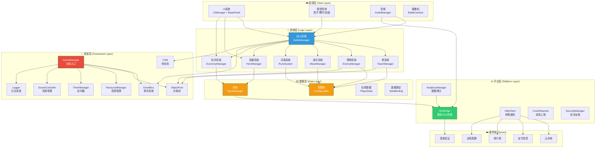
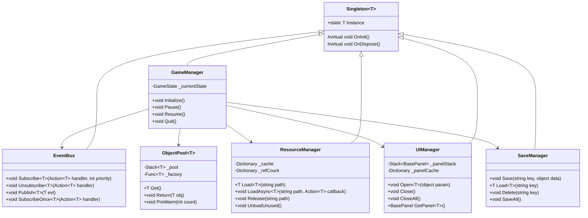
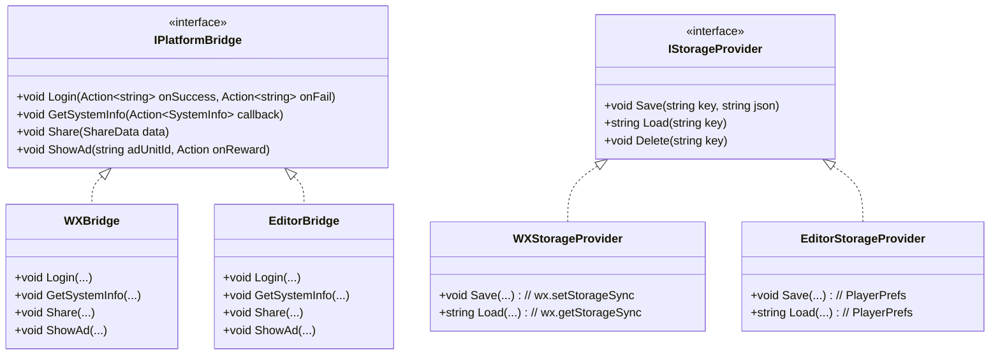
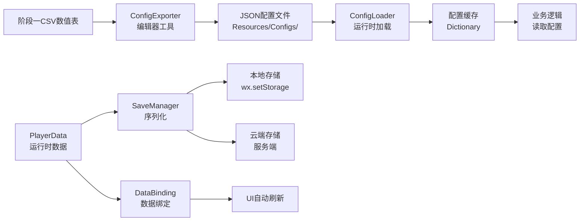
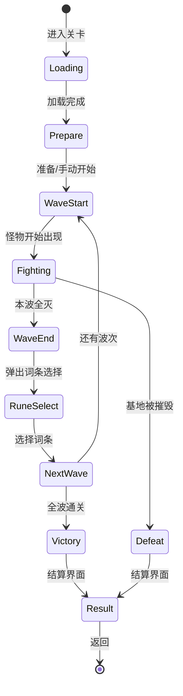
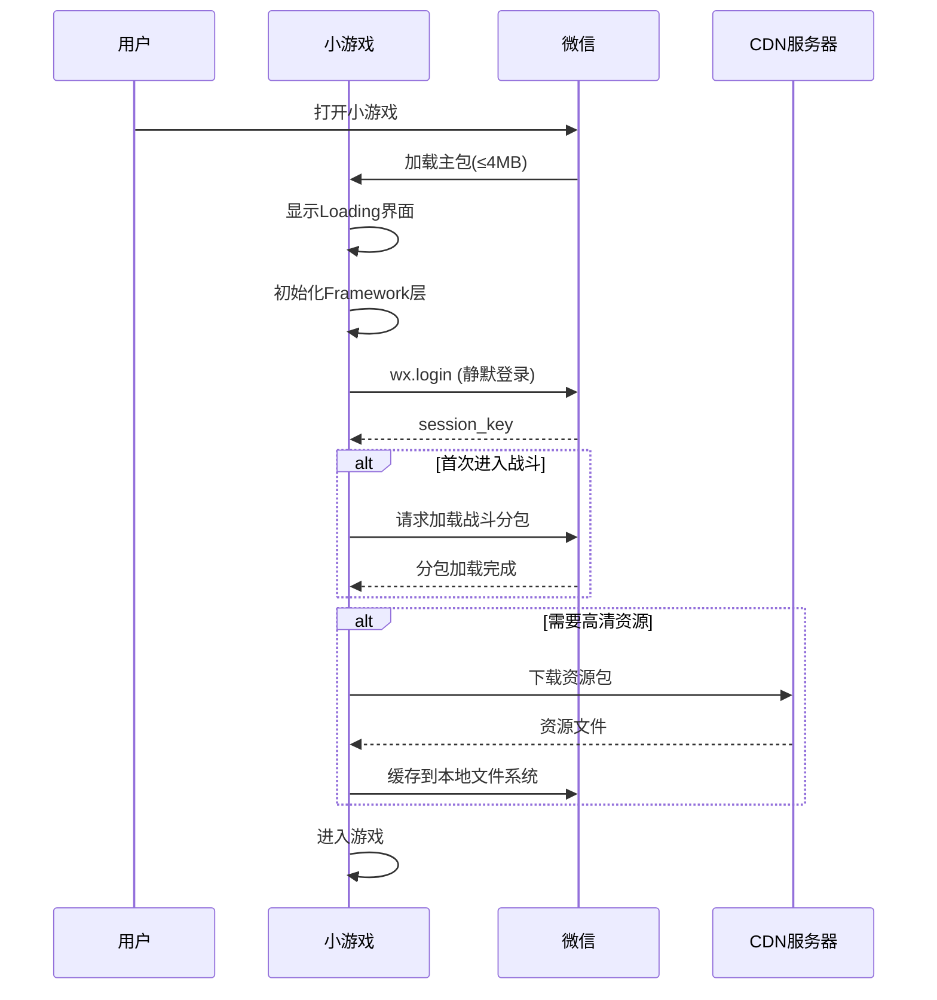
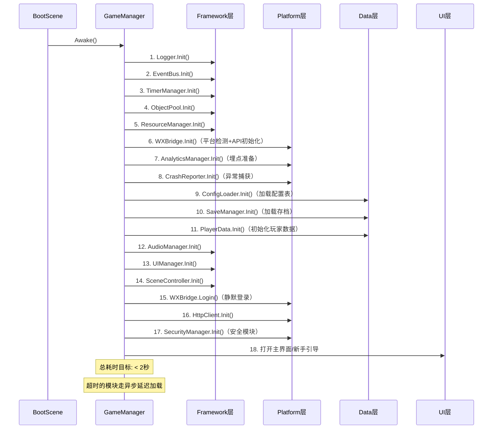
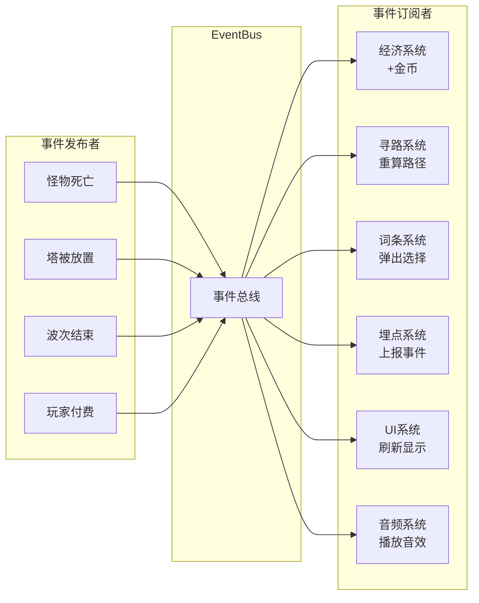
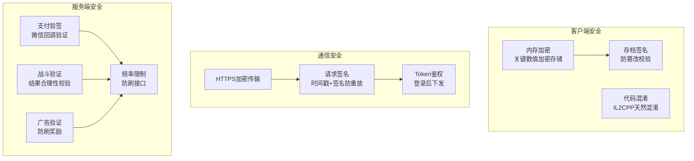

# 🏗️ AetheraSurvivors — 技术架构文档

> **文档版本**：v1.0
> **对应交互**：阶段二 #41
> **最后更新**：2026-03-25
> **Unity版本**：2022.3.62f3c1 LTS
> **SDK**：minigame-unity-sdk V2
> **目标平台**：微信小游戏（WebGL/WASM）

---

## 一、整体架构总览

### 1.1 架构分层图



### 1.2 架构设计原则

| 原则 | 说明 | 收益 |
|------|------|------|
| **分层解耦** | 表现→逻辑→数据→框架→平台，上层依赖下层，不反向依赖 | 可维护、可测试、可替换 |
| **配置驱动** | 怪物/塔/词条/波次全部走配置表（JSON/CSV），不硬编码 | 快速迭代、热更新 |
| **事件通信** | 模块间通过EventBus解耦，不直接引用 | 降低耦合度 |
| **对象池化** | 怪物/投射物/特效/飘字等高频对象全部池化 | 零GC、性能稳定 |
| **平台抽象** | 存储/音频/网络/登录等平台相关功能统一抽象接口 | 编辑器开发+微信部署 |
| **内存敏感** | 资源按需加载卸载，引用计数，不缓存不需要的资源 | 控制在256MB以内 |

### 1.3 架构选型决策

| 决策项 | 选型 | 对比方案 | 选型理由 |
|--------|------|---------|---------|
| **代码分层** | **MVC变体（Manager-Model-View）** | ECS(DOTS) | ECS在WebGL/WASM下性能收益有限，且Burst/Jobs在微信小游戏兼容性差；MVC简单直观，团队上手快，适合中小规模项目 |
| **UI框架** | **自建栈式UIManager** | 第三方UI框架 | 微信小游戏包体敏感，第三方框架bloat大；自建可精确控制 |
| **事件系统** | **自建类型安全EventBus** | C# event/delegate | 统一管理、支持优先级、一次性监听、可调试 |
| **异步方案** | **async/await + 回调** | UniTask/Coroutine | UniTask增加包体，Coroutine产生GC；async/await在.NET Standard 2.1下原生支持 |
| **序列化** | **LitJson（SDK自带）** | Newtonsoft/自写 | minigame-unity-sdk V2已自带LitJson.dll，零额外包体 |
| **资源管理** | **Resources + AssetBundle混合** | Addressables | Addressables在微信小游戏下兼容性有坑，Resources足够小项目使用；AB用于分包 |

---

## 二、项目目录结构

```
Assets/
├── Editor/                          # 🛠️ 编辑器扩展（不打入包体）
│   ├── TechProtoSetup.cs            #   技术原型一键配置（已有）
│   ├── LevelEditor/                 #   关卡编辑器
│   ├── ConfigExporter/              #   配置表导出工具
│   ├── BuildTool/                   #   一键打包脚本
│   └── GMPanel/                     #   GM调试面板
│
├── Plugins/                         # 🔌 原生插件
│   └── WebGL/                       #   WebGL JS桥接
│       └── WXBridge.jslib           #   微信API桥接（已有）
│
├── Resources/                       # 📦 Resources资源（主包，<4MB控制）
│   ├── Configs/                     #   配置表JSON（怪物/塔/词条/波次）
│   │   ├── Towers/                  #   塔配置
│   │   ├── Enemies/                 #   怪物配置
│   │   ├── Runes/                   #   词条配置
│   │   ├── Waves/                   #   波次配置
│   │   └── Levels/                  #   关卡配置
│   ├── Prefabs/                     #   预制体
│   │   ├── UI/                      #   UI预制体
│   │   ├── Towers/                  #   塔预制体
│   │   ├── Enemies/                 #   怪物预制体
│   │   ├── Projectiles/             #   投射物预制体
│   │   └── Effects/                 #   特效预制体
│   ├── Sprites/                     #   精灵图/图集
│   │   ├── UI/                      #   UI图标/按钮
│   │   ├── Towers/                  #   塔图标/动画帧
│   │   ├── Enemies/                 #   怪物图标/动画帧
│   │   ├── Maps/                    #   地图Tileset
│   │   └── Effects/                 #   特效序列帧
│   ├── Audio/                       #   音频资源
│   │   ├── BGM/                     #   背景音乐
│   │   └── SFX/                     #   音效
│   ├── Animations/                  #   动画控制器+动画片段
│   ├── Materials/                   #   材质球
│   └── Fonts/                       #   字体文件
│
├── Scenes/                          # 🎬 场景文件
│   ├── SampleScene.unity            #   技术原型场景（已有）
│   ├── BootScene.unity              #   启动场景（GameManager初始化）
│   ├── MainMenuScene.unity          #   主界面场景
│   └── BattleScene.unity            #   战斗场景
│
├── Scripts/                         # 💻 游戏代码（核心）
│   ├── Framework/                   #   🔧 框架层
│   │   ├── Singleton.cs             #     单例基类
│   │   ├── EventBus.cs              #     事件系统
│   │   ├── ObjectPool.cs            #     对象池
│   │   ├── ResourceManager.cs       #     资源管理器
│   │   ├── UIManager.cs             #     UI管理器
│   │   ├── BasePanel.cs             #     UI面板基类
│   │   ├── AudioManager.cs          #     音频管理器
│   │   ├── SaveManager.cs           #     存档管理器
│   │   ├── SceneController.cs       #     场景管理器
│   │   ├── TimerManager.cs          #     定时器系统
│   │   ├── FSM.cs                   #     有限状态机
│   │   ├── Logger.cs                #     日志系统
│   │   └── GameManager.cs           #     全局入口管理器
│   │
│   ├── Platform/                    #   🌐 平台层
│   │   ├── WXBridge.cs              #     微信SDK桥接（已有，需重构）
│   │   ├── WXLogin.cs               #     微信登录
│   │   ├── WXPayment.cs             #     微信支付
│   │   ├── WXShare.cs               #     微信分享
│   │   ├── WXAdManager.cs           #     微信广告
│   │   ├── HttpClient.cs            #     网络通信
│   │   ├── AnalyticsManager.cs      #     数据埋点
│   │   ├── CrashReporter.cs         #     崩溃上报
│   │   └── SecurityManager.cs       #     安全加密
│   │
│   ├── Data/                        #   📦 数据层
│   │   ├── ConfigLoader.cs          #     配置表加载系统
│   │   ├── PlayerData.cs            #     玩家数据模型
│   │   ├── DataBinding.cs           #     数据绑定
│   │   ├── LocalizationManager.cs   #     多语言
│   │   └── Configs/                 #     配置数据类定义
│   │       ├── TowerConfig.cs       #       塔配置数据类
│   │       ├── EnemyConfig.cs       #       怪物配置数据类
│   │       ├── RuneConfig.cs        #       词条配置数据类
│   │       ├── WaveConfig.cs        #       波次配置数据类
│   │       └── LevelConfig.cs       #       关卡配置数据类
│   │
│   ├── Battle/                      #   ⚔️ 战斗系统
│   │   ├── BattleManager.cs         #     战斗主控制器
│   │   ├── BattleInputHandler.cs    #     战斗输入处理
│   │   ├── BattleCamera.cs          #     战斗摄像机
│   │   ├── BattleEconomyManager.cs  #     局内经济
│   │   ├── DamageCalculator.cs      #     伤害计算
│   │   ├── Map/                     #     地图子系统
│   │   │   ├── GridSystem.cs        #       网格系统
│   │   │   ├── Pathfinding.cs       #       A*寻路
│   │   │   ├── PathVisualizer.cs    #       路径可视化
│   │   │   └── MapRenderer.cs       #       地图渲染
│   │   ├── Tower/                   #     塔子系统
│   │   │   ├── TowerBase.cs         #       塔基类
│   │   │   ├── TowerPlacement.cs    #       塔放置逻辑
│   │   │   ├── TowerManager.cs      #       塔管理器
│   │   │   └── Towers/              #       具体塔实现
│   │   │       ├── ArcherTower.cs   #         箭塔
│   │   │       ├── MageTower.cs     #         法塔
│   │   │       ├── IceTower.cs      #         冰塔
│   │   │       ├── CannonTower.cs   #         炮塔
│   │   │       ├── PoisonTower.cs   #         毒塔
│   │   │       └── GoldMine.cs      #         金矿
│   │   ├── Enemy/                   #     怪物子系统
│   │   │   ├── EnemyBase.cs         #       怪物基类
│   │   │   ├── EnemySpawner.cs      #       怪物生成器
│   │   │   ├── BuffSystem.cs        #       Buff/Debuff系统
│   │   │   ├── SpatialPartition.cs  #       空间分区（性能优化）
│   │   │   └── SpecialEnemies/      #       特殊怪物
│   │   │       ├── Healer.cs        #         治疗者
│   │   │       ├── Slime.cs         #         分裂史莱姆
│   │   │       ├── Rogue.cs         #         隐身盗贼
│   │   │       └── ShieldMage.cs    #         护盾法师
│   │   ├── Projectile/              #     投射物子系统
│   │   │   ├── ProjectileBase.cs    #       投射物基类
│   │   │   ├── LinearProjectile.cs  #       直线弹
│   │   │   ├── TrackingProjectile.cs#       追踪弹
│   │   │   ├── ParabolicProjectile.cs#      抛物线弹
│   │   │   └── LaserProjectile.cs   #       激光（即时命中）
│   │   ├── Wave/                    #     波次子系统
│   │   │   └── WaveManager.cs       #       波次管理器
│   │   ├── Rune/                    #     词条子系统
│   │   │   └── RuneSystem.cs        #       词条选择+效果应用
│   │   ├── Hero/                    #     英雄战斗子系统
│   │   │   └── HeroSkill.cs         #       英雄技能
│   │   └── Visual/                  #     战斗视觉
│   │       ├── DamagePopup.cs       #       伤害飘字
│   │       └── EffectManager.cs     #       特效管理
│   │
│   ├── MetaGame/                    #   🏠 元游戏系统
│   │   ├── MainMenuUI.cs            #     主界面
│   │   ├── LevelSelectSystem.cs     #     关卡选择
│   │   ├── HeroManager.cs           #     英雄养成
│   │   ├── ShopUI.cs                #     商城
│   │   ├── BattlePass.cs            #     战令
│   │   ├── GachaSystem.cs           #     抽卡
│   │   ├── DailyQuestSystem.cs      #     每日任务
│   │   ├── AchievementSystem.cs     #     成就
│   │   ├── CheckInSystem.cs         #     签到
│   │   ├── StaminaSystem.cs         #     体力
│   │   ├── MailSystem.cs            #     邮件
│   │   ├── RedDotManager.cs         #     红点
│   │   ├── ShareSystem.cs           #     分享
│   │   ├── FriendSystem.cs          #     好友
│   │   └── TutorialSystem.cs        #     新手引导
│   │
│   ├── UI/                          #   🖼️ UI面板
│   │   ├── Panels/                  #     各UI面板实现
│   │   │   ├── MainMenuPanel.cs     #       主界面面板
│   │   │   ├── BattleHUDPanel.cs    #       战斗HUD
│   │   │   ├── BattleResultPanel.cs #       战斗结算
│   │   │   ├── RuneSelectPanel.cs   #       词条选择
│   │   │   ├── HeroPanel.cs         #       英雄面板
│   │   │   ├── ShopPanel.cs         #       商城面板
│   │   │   ├── SettingsPanel.cs     #       设置面板
│   │   │   └── ...                  #       更多面板
│   │   ├── Widgets/                 #     通用UI组件
│   │   │   ├── HealthBar.cs         #       血条
│   │   │   ├── CurrencyDisplay.cs   #       货币显示
│   │   │   ├── ProgressBar.cs       #       进度条
│   │   │   └── ToastMessage.cs      #       弹窗消息
│   │   └── Effects/                 #     UI动效
│   │       ├── UITween.cs           #       UI缓动
│   │       └── UIParticle.cs        #       UI粒子
│   │
│   └── Utils/                       #   🔨 工具类
│       ├── MathUtils.cs             #     数学工具
│       ├── CollectionUtils.cs       #     集合扩展
│       ├── CoroutineUtils.cs        #     协程工具
│       └── PlatformUtils.cs         #     平台判断工具
│
├── WX-WASM-SDK-V2/                  # 📱 微信小游戏SDK（已导入，勿修改）
│   ├── Editor/                      #   SDK编辑器工具
│   └── Runtime/                     #   SDK运行时（含LitJson.dll）
│
├── WebGLTemplates/                  # 🌐 WebGL模板（已有）
│   ├── WXTemplate/
│   ├── WXTemplate2020/
│   ├── WXTemplate2022/
│   └── WXTemplate2022TJ/
│
├── StreamingAssets/                  # ⚠️ 微信小游戏不直接支持！
│   └── （留空，所有配置走Resources或远程加载）
│
└── Tests/                           # 🧪 单元测试
    ├── EditMode/                    #   编辑器模式测试
    │   ├── EventBusTests.cs
    │   ├── ObjectPoolTests.cs
    │   └── DamageCalculatorTests.cs
    └── PlayMode/                    #   运行模式测试
        └── BattleFlowTests.cs
```

---

## 三、代码分层详细设计

### 3.1 框架层（Framework Layer）

框架层是整个项目的地基，提供所有业务逻辑共用的基础设施。



**各模块职责**：

| 模块 | 职责 | 微信小游戏适配要点 |
|------|------|-------------------|
| `Singleton<T>` | 提供MonoBehaviour单例和纯C#单例基类 | DontDestroyOnLoad在微信小游戏中正常工作 |
| `GameManager` | 全局生命周期管理，初始化顺序编排 | 监听wx.onShow/wx.onHide切前后台 |
| `EventBus` | 类型安全的发布-订阅系统 | 无特殊适配，纯C#实现 |
| `ObjectPool<T>` | 通用对象池，减少GC | **关键**：微信小游戏GC压力大于原生 |
| `ResourceManager` | 资源加载/缓存/卸载，引用计数 | **不能用StreamingAssets**，走Resources |
| `UIManager` | 栈式UI管理，层级控制 | 适配安全区（刘海屏/全面屏） |
| `AudioManager` | BGM+SFX管理 | **必须适配wx.InnerAudioContext** |
| `SaveManager` | 数据持久化 | **必须适配wx.setStorageSync** |
| `SceneController` | 场景切换，异步加载 | 微信小游戏场景切换开销较大，需Loading |
| `TimerManager` | 延时/循环定时器 | 不依赖MonoBehaviour，纯C#计时 |
| `FSM<T>` | 有限状态机 | 战斗状态/游戏状态管理 |
| `Logger` | 分级日志 | 发布版关闭Debug级别，节省性能 |

### 3.2 平台层（Platform Layer）

平台层封装所有与微信小游戏平台相关的API调用，提供统一的C#接口。



**平台抽象策略**：

```csharp
// 核心思路：通过条件编译切换平台实现
#if UNITY_WEBGL && !UNITY_EDITOR
    // 微信小游戏环境 → 使用WXBridge/WXStorageProvider
#else
    // 编辑器环境 → 使用EditorBridge/EditorStorageProvider
#endif
```

| 平台功能 | 微信实现 | 编辑器Mock | 备注 |
|---------|---------|-----------|------|
| 登录 | wx.login | 返回假token | 调试用 |
| 存储 | wx.setStorageSync | PlayerPrefs | 10MB上限 |
| 音频 | InnerAudioContext | Unity AudioSource | 微信限制同时播放数 |
| 网络 | wx.request | UnityWebRequest | 域名需白名单 |
| 分享 | wx.shareAppMessage | Debug.Log | — |
| 广告 | wx.createRewardedVideoAd | 模拟回调 | 开发期跳过 |
| 支付 | wx虚拟支付API | 模拟支付 | 必须服务端验签 |

### 3.3 数据层（Data Layer）



**配置表加载流程**：

1. 阶段一的CSV文件通过 `ConfigExporter` 编辑器工具转换为JSON
2. JSON文件放入 `Resources/Configs/` 目录
3. 运行时通过 `ConfigLoader` 加载并反序列化为强类型C#对象
4. 配置加载后缓存在内存中，全局可读
5. 热更新时，从服务端拉取新配置覆盖本地缓存

### 3.4 逻辑层（Logic Layer）— 战斗系统架构



---

## 四、分包策略（⚠️ 最关键的包体控制方案）

### 4.1 包体预算分配

```
微信小游戏包体限制:
├── 主包（首次加载）: ≤ 4MB ⚠️ 
├── 分包总计: ≤ 20MB（可申请提升）
└── CDN资源: 无限制（按需下载）
```

| 包 | 预算 | 包含内容 | 加载时机 |
|---|------|---------|---------|
| **主包** | **≤4MB** | 启动场景+Framework层+Platform层+基础UI+Loading界面 | 首次打开 |
| **战斗分包** | ~6MB | 战斗系统代码+核心预制体+前3章地图 | 进入第一场战斗时 |
| **元游戏分包** | ~4MB | 商城/抽卡/战令/成就等外围系统 | 进入主界面时 |
| **CDN资源** | 不限 | 高清图片/音频/后续章节地图/活动资源 | 按需下载+缓存 |

### 4.2 主包瘦身策略

| 策略 | 预估节省 | 实施方式 |
|------|---------|---------|
| **Managed Stripping High** | 30-50% 代码体积 | ProjectSettings → Stripping Level → High |
| **Brotli 压缩** | 60-70% 压缩率 | minigame-unity-sdk 导出时自动处理 |
| **纹理压缩** | 40-60% | ASTC 6x6（iOS）+ ETC2（Android fallback） |
| **音频压缩** | 60-80% | BGM用Vorbis 64kbps，SFX用ADPCM |
| **精灵图集** | 20-30% DrawCall | SpriteAtlas 合批，减少纹理数量 |
| **代码分割** | 按需加载 | 分包+按需require |
| **字体裁剪** | 50%+ 字体体积 | 只保留常用3000汉字 |
| **移除未使用Package** | 0.5-1MB | 检查Packages/manifest.json |

### 4.3 资源加载流程



---

## 五、微信小游戏注意事项清单（⚠️ 必读！）

### 5.1 🚫 绝对不能做的事

| # | 禁忌 | 原因 | 替代方案 |
|---|------|------|---------|
| 1 | **不能用 `System.IO` 直接读写文件** | WebGL沙盒环境无文件系统 | 用 `wx.getFileSystemManager()` 或 `wx.setStorageSync` |
| 2 | **不能用 `XMLHttpRequest`** | 微信小游戏不支持 | 用 `wx.request` |
| 3 | **不能用 `System.Threading.Thread`** | WebGL单线程，会崩溃 | 用 `async/await` 或协程 |
| 4 | **不能用 `System.Reflection` 大量反射** | IL2CPP+WASM不支持动态反射 | 编译期代码生成或手动注册 |
| 5 | **不能用 `StreamingAssets` 直接路径** | 微信小游戏无此目录 | 用 `Resources.Load` 或 CDN |
| 6 | **不能使用 `UnityEngine.Application.persistentDataPath`** | 路径不可靠 | 用微信文件系统API |
| 7 | **不能直接播放 `AudioSource`** | 部分情况需要用户交互后才能播放 | 首次触摸后初始化音频，或用 `wx.InnerAudioContext` |
| 8 | **不能在 Start/Awake 中做重计算** | 会导致首帧卡顿/loading超时 | 用时间分片或延迟初始化 |

### 5.2 ⚠️ 需要特别注意的事

| # | 注意项 | 说明 | 应对 |
|---|--------|------|------|
| 1 | **GC非常敏感** | WebGL的GC会导致明显卡顿 | 对象池化一切高频对象；避免foreach/LINQ/string拼接 |
| 2 | **内存上限256MB** | 超出会被微信强制Kill | 资源引用计数+不用的及时卸载 |
| 3 | **首屏加载速度** | 超过5s用户会离开 | 主包<4MB+Loading动画+分步初始化 |
| 4 | **IL2CPP 泛型限制** | 值类型泛型需要AOT编译 | 在 link.xml 中保留必要类型 |
| 5 | **wx.onShow/wx.onHide** | 切前后台事件 | GameManager监听，暂停/恢复游戏 |
| 6 | **用户交互触发限制** | 某些API（如wx.authorize）必须用户主动触发 | UI按钮点击后再调用 |
| 7 | **域名白名单** | 所有网络请求域名需在管理后台配置 | 提前规划服务端域名 |
| 8 | **开放数据域隔离** | 好友排行榜数据在独立的开放数据域 | 需要单独的子游戏项目 |
| 9 | **审核敏感内容** | 聊天/UGC/虚拟货币展示需合规 | 概率公示、隐私协议、防沉迷 |
| 10 | **热更新限制** | 代码不能热更，但配置/资源可以 | 配置走服务端下发，代码改动需提审 |

### 5.3 ✅ 性能优化最佳实践

| # | 实践 | 目标指标 | 实施方式 |
|---|------|---------|---------|
| 1 | **对象池化** | 零GC | 怪物/投射物/特效/飘字全部池化 |
| 2 | **空间分区** | 查找O(1) | 网格分区加速塔攻击目标查找 |
| 3 | **DrawCall合批** | <50 | SpriteAtlas+动态合批+静态合批 |
| 4 | **寻路缓存** | 避免每帧寻路 | 路径缓存，只在放塔/卖塔时重算 |
| 5 | **LOD策略** | 降低渲染压力 | 远处怪物简化渲染/隐藏血条 |
| 6 | **纹理压缩** | 内存节省50%+ | ASTC 6x6 格式 |
| 7 | **音频按需加载** | 内存控制 | BGM流式播放，SFX预加载常用 |
| 8 | **字符串零分配** | 避免GC | StringBuilder/Span<T>/缓存字符串 |
| 9 | **Update优化** | 减少每帧开销 | Manager统一Tick，不在每个对象上挂Update |
| 10 | **条件编译** | 剥离调试代码 | `#if UNITY_EDITOR` 包裹调试逻辑 |

---

## 六、GameManager 初始化顺序



**初始化原则**：
- 日志系统最先初始化，确保后续模块的错误都能被记录
- 平台桥接在框架基础设施之后，数据层之前
- 配置表加载在存档之前（存档可能依赖配置验证）
- UI系统最后初始化（依赖资源管理器）
- 登录是异步的，不阻塞后续流程

---

## 七、关键模块通信机制

### 7.1 事件驱动通信



### 7.2 核心事件定义

| 事件类型 | 触发时机 | 携带数据 | 主要订阅者 |
|---------|---------|---------|-----------|
| `EnemyDeathEvent` | 怪物死亡 | 怪物ID、位置、掉落 | 经济系统、统计、UI |
| `TowerPlacedEvent` | 塔被放置 | 塔类型、位置、消耗 | 寻路系统、UI |
| `TowerSoldEvent` | 塔被出售 | 塔类型、返还金币 | 寻路系统、UI |
| `WaveEndEvent` | 一波结束 | 波次号、漏怪数 | 词条系统、UI |
| `WaveStartEvent` | 一波开始 | 波次号、怪物数 | UI、音频 |
| `RuneSelectedEvent` | 词条被选 | 词条ID、效果 | 塔系统、怪物系统 |
| `BattleEndEvent` | 战斗结束 | 胜负、星级、统计 | 结算UI、存档、埋点 |
| `CurrencyChangedEvent` | 货币变化 | 货币类型、变化量 | UI |
| `PlayerLevelUpEvent` | 玩家升级 | 新等级 | UI、红点 |

---

## 八、热更新方案

### 8.1 可热更 vs 不可热更

| 类型 | 可否热更 | 更新方式 | 备注 |
|------|---------|---------|------|
| **C#代码** | ❌ 不可 | 必须重新提审 | WebGL+IL2CPP限制 |
| **配置表JSON** | ✅ 可 | 服务端下发 → 本地覆盖 | 数值调整、活动配置 |
| **公告/活动文本** | ✅ 可 | 服务端下发 | 运营常用 |
| **图片资源** | ✅ 可 | CDN下载 → 本地缓存 | 活动banner等 |
| **AB包** | ✅ 可 | CDN下载 → 本地缓存 | 新增内容资源 |

### 8.2 配置热更流程

```
客户端启动 → 请求服务端配置版本号
    → 版本一致 → 使用本地缓存配置
    → 版本不一致 → 下载新配置 → 覆盖本地 → 重新加载
```

---

## 九、安全架构



---

## 十、验收标准

| # | 验收项 | 标准 | 状态 |
|---|--------|------|------|
| 1 | 架构分层图 | ✅ 5层架构清晰（表现/逻辑/数据/框架/平台） | ✅ |
| 2 | 目录结构树 | ✅ 每个文件夹有注释说明用途 | ✅ |
| 3 | 分包策略 | ✅ 主包<4MB方案 + CDN资源方案 | ✅ |
| 4 | 微信限制清单 | ✅ 8项禁忌 + 10项注意 + 10项最佳实践 | ✅ |
| 5 | 初始化顺序 | ✅ 18步初始化时序图 | ✅ |
| 6 | 事件通信 | ✅ 核心事件定义表 | ✅ |
| 7 | 热更新方案 | ✅ 配置热更流程 | ✅ |
| 8 | 安全架构 | ✅ 客户端+通信+服务端三层安全 | ✅ |

---

> 📝 本文档将作为阶段二所有编码工作的架构指导，后续#42-#115的实现都基于此架构展开。
