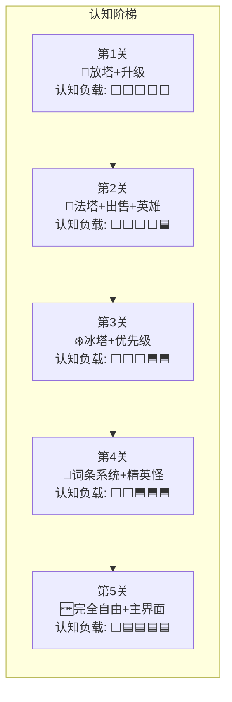
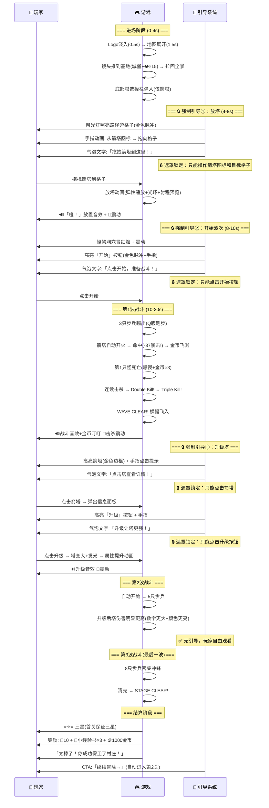
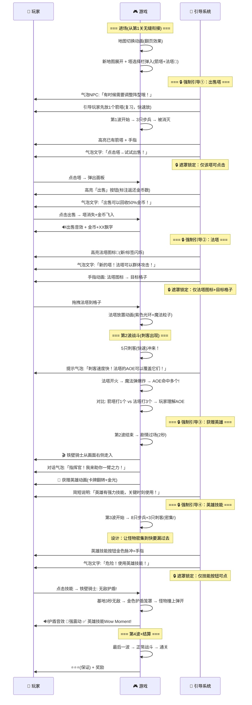
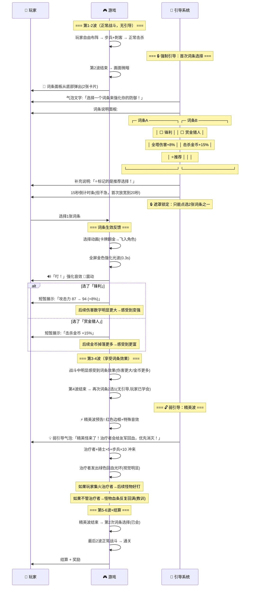
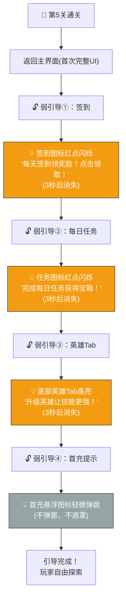
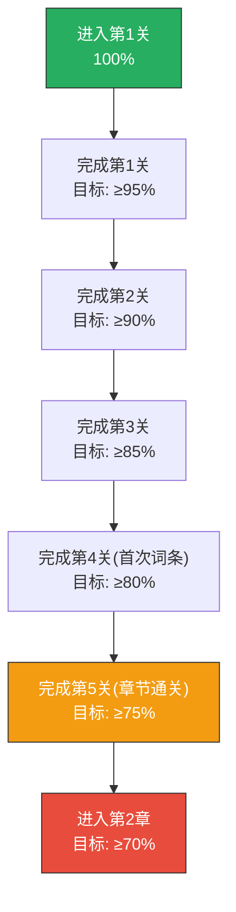


# 🎓 AetheraSurvivors — 新手引导流程设计

> **文档版本**：v1.0
> **最后更新**：2026-03-24
> **交互编号**：阶段一 #17（⭐关键任务）
> **前置依赖**：GDD.md（v1.19）、爽感与留存钩子设计.md、核心战斗循环设计.md、Roguelike词条系统设计.md、英雄系统骨架设计.md、UI_UX框架设计.md
> **验收标准**：✅ 有完整的步骤流程图，标注强制/弱引导

---

## 总览：前5关引导架构图

```mermaid
graph TD
    subgraph "🎓 新手引导5关总览"
        subgraph "第1关 · 守护村庄（🔒强制引导）"
            A1["教放塔(箭塔)"] --> A2["教开始波次"]
            A2 --> A3["教升级塔"]
            A3 --> A4["通关+首次奖励"]
        end
        
        subgraph "第2关 · 森林前哨（🔒强制引导）"
            B1["教出售塔"] --> B2["教第二种塔(法塔)"]
            B2 --> B3["获赠英雄(铁壁骑士)"]
            B3 --> B4["教英雄技能释放"]
        end
        
        subgraph "第3关 · 山谷伏击（🔓弱引导）"
            C1["教冰塔+减速概念"] --> C2["教攻击优先级切换"]
            C2 --> C3["自由布阵体验"]
        end
        
        subgraph "第4关 · 黑暗之路（🔒词条强制引导）"
            D1["首次词条2选1"] --> D2["词条效果即时展示"]
            D2 --> D3["教精英怪应对"]
        end
        
        subgraph "第5关 · 觉醒之战（🔓自由+赠英雄）"
            E1["完全自由操作"] --> E2["赠送精灵射手"]
            E2 --> E3["教主界面功能+外围系统"]
        end
    end
    
    A4 -->|"无缝衔接"| B1
    B4 -->|"返回主界面"| C1
    C3 -->|"主界面"| D1
    D3 -->|"主界面"| E1
    
    style A1 fill:#e74c3c,stroke:#333,color:white
    style B1 fill:#e74c3c,stroke:#333,color:white
    style C1 fill:#f39c12,stroke:#333,color:white
    style D1 fill:#e74c3c,stroke:#333,color:white
    style E1 fill:#4ecdc4,stroke:#333,color:white
```



### 引导核心原则

| 原则 | 说明 | 实现方式 |
|------|------|---------|
| 🎯 **30秒内Wow Moment** | 放塔→命中→击杀→金币飞溅在12秒内完成 | 首波暴击率100%+怪物HP-30% |
| 🧠 **认知负载递增** | 每关只教1-2个新机制，不超载 | 5关分5层认知阶梯 |
| 🎮 **做中学(Learning by Doing)** | 不用文字墙，让玩家动手体验 | 手指引导+即时反馈 |
| ⚡ **永不阻断乐趣** | 引导不暂停战斗（除必须操作点外） | 引导气泡叠加在战斗画面上 |
| 🔒/🔓 **强弱引导分明** | 必须操作=强制遮罩高亮；可选操作=箭头提示 | 两套引导UI组件 |
| 🎁 **每关有奖励驱动** | 通关奖励递增，第5关解锁大奖 | 奖励可视化+道具飞入动画 |
| 📱 **微信小游戏适配** | 竖屏/触屏操作引导，拖拽手感流畅 | 大区域触控热区+容错 |

### 认知负载递增图



---

## 一、第1关 ·「守护村庄」（🔒 强制引导）

### 1.1 关卡设定

| 维度 | 设定 | 说明 |
|------|------|------|
| **关卡名** | 1-1「守护村庄」 | 最简单的名字，零认知成本 |
| **地图** | 简单S形路径，1个出怪口→1个终点 | 最基础地图 |
| **可放塔格子** | 8个（引导只用1个） | 格子数少，降低选择焦虑 |
| **波次数** | 3波（精简版，正常8波） | 缩短首关时间 |
| **怪物种类** | 仅步兵（最基础） | 零机制怪物 |
| **总时长目标** | 2.5-3分钟 | 比正常关卡短一半 |
| **可用塔** | 仅🏹箭塔 | 只给1种塔，零选择焦虑 |
| **特殊调教** | 首波暴击率100%，怪物HP-30%，金币+50% | 确保首关极度「爽」 |
| **基地生命** | 15（保证通关） | 容错极高 |

### 1.2 教学目标

| 优先级 | 教学内容 | 引导类型 | 说明 |
|--------|---------|---------|------|
| P0 | 🎯 拖拽放塔 | 🔒 强制 | 核心操作第1步 |
| P0 | ▶️ 点击开始波次 | 🔒 强制 | 让玩家掌控节奏 |
| P1 | ⬆️ 点击升级塔 | 🔒 强制 | 第二核心操作 |
| — | 🎉 通关+领奖 | 自动 | 成就感+继续动机 |

### 1.3 逐步引导脚本



### 1.4 引导步骤详表

| 步骤# | 时间 | 引导类型 | 操作 | UI表现 | 遮罩行为 | 失败兜底 |
|-------|------|---------|------|--------|---------|---------|
| S1 | 4-8s | 🔒强制 | 拖拽箭塔到目标格子 | 聚光灯+手指动画+气泡文字 | 全屏遮罩，仅箭塔+目标格子可交互 | 5秒无操作→手指动画重播+文字闪烁 |
| S2 | 8-10s | 🔒强制 | 点击「开始」按钮 | 按钮金色脉冲+手指+文字 | 全屏遮罩，仅开始按钮可点击 | 3秒无操作→按钮放大弹跳 |
| S3 | 战斗后 | 🔒强制 | 点击已有塔 | 塔金色边框+手指 | 遮罩，仅该塔可点击 | 3秒无操作→箭头指向 |
| S4 | 面板展示 | 🔒强制 | 点击「升级」按钮 | 升级按钮高亮+手指 | 遮罩，仅升级按钮可点 | 3秒无操作→按钮弹跳 |

### 1.5 通关奖励

| 奖励项 | 数量 | 展示方式 |
|--------|------|---------|
| 💎 钻石 | 10 | 金色飞入HUD |
| 📕 小经验书 | ×3 | 从宝箱弹出 |
| 🪙 金币(局外) | 1,000 | 数字跳动 |
| ⭐ 评价 | 3星(保证) | 星星依次点亮 |

---

## 二、第2关 ·「森林前哨」（🔒 强制引导）

### 2.1 关卡设定

| 维度 | 设定 | 与第1关差异 |
|------|------|-----------|
| **关卡名** | 1-2「森林前哨」 | — |
| **地图** | L形路径，1个出怪口→1个终点 | 路径略长，有更多格子 |
| **可放塔格子** | 12个 | 多了4个格子 |
| **波次数** | 4波 | 多1波 |
| **怪物种类** | 步兵+刺客(快速) | 新增刺客引出法塔AOE需求 |
| **总时长目标** | 3-4分钟 | 略长 |
| **可用塔** | 🏹箭塔 + 🔮法塔(新增) | 解锁第二种塔 |
| **特殊调教** | 怪物HP-20%，金币+30% | 仍偏简单 |
| **基地生命** | 15 | 同第1关 |

### 2.2 教学目标

| 优先级 | 教学内容 | 引导类型 | 说明 |
|--------|---------|---------|------|
| P0 | 🗑️ 出售塔 | 🔒 强制 | 资源回收机制 |
| P0 | 🔮 法塔(第二种塔) | 🔒 强制 | AOE概念+多塔选择 |
| P0 | 🦸 获赠英雄(铁壁骑士) | 自动 | 英雄系统引入 |
| P0 | ⚔️ 英雄技能释放 | 🔒 强制 | 英雄技能操作 |

### 2.3 逐步引导脚本



### 2.4 引导步骤详表

| 步骤# | 时间 | 引导类型 | 操作 | UI表现 | 遮罩行为 |
|-------|------|---------|------|--------|---------|
| S1 | 波1后 | 🔒强制 | 点击已有塔→出售 | 塔高亮+面板出售按钮高亮 | 遮罩，仅塔→出售可交互 |
| S2 | 出售后 | 🔒强制 | 拖拽法塔到格子 | 法塔图标「新!」标签+手指 | 遮罩，仅法塔+目标格子 |
| S3 | 波2后 | 自动 | 观看英雄获赠过场 | 卡牌翻转+金光+对话 | 无遮罩，自动播放 |
| S4 | 波3中 | 🔒强制 | 点击英雄技能按钮 | 技能按钮脉冲+手指+文字 | 遮罩，仅技能按钮 |

### 2.5 通关奖励

| 奖励项 | 数量 | 展示方式 |
|--------|------|---------|
| 💎 钻石 | 20 | 金色飞入 |
| 📕 小经验书 | ×5 | 宝箱弹出 |
| 🦸 铁壁骑士 | 永久获得 | 英雄卡牌展示(金色边框) |
| ⭐ 评价 | 3星 | 星星点亮 |

---

## 三、第3关 ·「山谷伏击」（🔓 弱引导）

### 3.1 关卡设定

| 维度 | 设定 | 与前2关差异 |
|------|------|-----------|
| **关卡名** | 1-3「山谷伏击」 | — |
| **地图** | Z字形双弯路径 | 更复杂地图，有战略位置 |
| **可放塔格子** | 15个 | 选择空间增大 |
| **波次数** | 5波 | 接近正常关卡 |
| **怪物种类** | 步兵+刺客+骑士(高甲) | 新增骑士引出物理/魔法克制 |
| **总时长目标** | 4-5分钟 | 正常节奏 |
| **可用塔** | 🏹箭塔+🔮法塔+❄️冰塔(新增) | 解锁第三种塔 |
| **特殊调教** | 怪物HP-10% | 略微降低 |
| **基地生命** | 15 | 容错仍高 |

### 3.2 教学目标

| 优先级 | 教学内容 | 引导类型 | 说明 |
|--------|---------|---------|------|
| P1 | ❄️ 冰塔(减速) | 🔓 弱引导 | 第三种塔+控制概念 |
| P1 | 🎯 攻击优先级切换 | 🔓 弱引导 | 策略深度第一步 |
| P2 | 🛡️ 物理/魔法克制 | 🔓 弱引导（提示文字） | 骑士出现时自动弹 |
| — | 🆓 自由布阵 | 无引导 | 让玩家自己探索 |

### 3.3 引导脚本

```
┌─── 1-3「山谷伏击」引导脚本 ──────────────────────────────────┐
│                                                                │
│ 📍 进场（0-5s）                                                │
│   0.0s  地图展开 → 塔选择栏(箭塔+法塔+❄️冰塔[新!])            │
│   2.0s  💡 弱引导气泡：「新塔解锁！冰塔可以减速敌人！」        │
│         冰塔图标闪烁「新!」标签（3秒后消失）                    │
│         ※ 不锁遮罩，玩家可以忽略，自由操作                     │
│                                                                │
│ 📍 第1-2波（自由布阵）                                         │
│   玩家自由放塔+观看战斗                                        │
│   步兵+刺客组合 → 玩家用已学知识应对                           │
│   ※ 完全无引导，让玩家产生掌控感                               │
│                                                                │
│ 📍 第3波（骑士出现!）                                          │
│   波次预告：骑士图标+🛡️图标                                    │
│   💡 弱引导气泡：「骑士物理护甲很高！试试用法塔攻击！」        │
│         （文字3秒后自动消失）                                   │
│   骑士出场 → 箭塔伤害很低(灰色小数字) vs 法塔伤害正常          │
│   ※ 通过伤害数字颜色对比让玩家直观理解克制                     │
│                                                                │
│ 📍 第4波（引导冰塔+优先级）                                    │
│   大量刺客(快速)冲来！                                         │
│   如果玩家已放冰塔 → 显示减速效果 → 赞美「好策略!」           │
│   如果未放冰塔 → 💡 弱引导：「敌人太快了！冰塔可以减速它们！」│
│                                                                │
│   如果有塔被怪物跑过 →                                         │
│   💡 弱引导：「点击塔 → 可以切换攻击优先级！」                │
│         （首次出现攻击优先级按钮时给小箭头提示）                │
│                                                                │
│ 📍 第5波（自由战斗+结算）                                      │
│   混合波(步兵+刺客+骑士) → 考验综合策略                        │
│   通关 → 结算                                                  │
│                                                                │
│ 📍 通关后 → 返回主界面                                         │
│   💡 弱引导：指向主界面「英雄」Tab                              │
│       「升级英雄可以让他更强哦！」（首次主界面引导）            │
│                                                                │
└────────────────────────────────────────────────────────────────┘
```

### 3.4 弱引导设计规则

| 规则 | 说明 |
|------|------|
| **展示方式** | 半透明气泡+小箭头，不遮罩不锁定 |
| **展示时长** | 3-5秒后自动消失（可手动点击提前关闭） |
| **重复展示** | 同一弱引导只展示1次（标记已读） |
| **触发条件** | 特定事件触发（如骑士首次出现/刺客跑过塔等） |
| **可忽略** | 玩家可以完全忽略，不影响游戏继续 |
| **不阻断** | 战斗中显示，不暂停任何逻辑 |

### 3.5 通关奖励

| 奖励项 | 数量 | 展示方式 |
|--------|------|---------|
| 💎 钻石 | 20 | 金色飞入 |
| 📕 小经验书 | ×8 | 宝箱弹出 |
| 🪙 金币(局外) | 2,000 | 数字跳动 |
| ⭐ 评价 | 1-3星(首次不保证) | 根据实际表现 |

---

## 四、第4关 ·「黑暗之路」（🔒 词条强制引导）

### 4.1 关卡设定

| 维度 | 设定 | 说明 |
|------|------|------|
| **关卡名** | 1-4「黑暗之路」 | 氛围稍暗，暗示难度提升 |
| **地图** | U形路径 + 小分叉 | 更多策略位置 |
| **可放塔格子** | 16个 | — |
| **波次数** | 6波(含1精英波) | 首次出现精英波！ |
| **怪物种类** | 步兵+刺客+骑士+🩹治疗者(精英) | 首个精英怪 |
| **总时长目标** | 5-6分钟 | 接近正常时长 |
| **可用塔** | 🏹箭塔+🔮法塔+❄️冰塔 | 同第3关 |
| **词条机制** | 🎲 2选1，仅⬜白色词条 | 精简版词条（非完整3选1） |
| **特殊调教** | 首次词条必含「锋利(伤害+8%)」和「赏金猎人(金币+15%)」 | 两个最直观的词条让玩家理解 |
| **基地生命** | 15 | — |

### 4.2 教学目标

| 优先级 | 教学内容 | 引导类型 | 说明 |
|--------|---------|---------|------|
| P0 | 🎲 词条2选1 | 🔒 强制 | Roguelike核心机制 |
| P0 | ✨ 词条效果即时反馈 | 自动 | 选词条→伤害/金币变化 |
| P1 | ⚡ 精英怪特殊机制 | 🔓 弱引导 | 治疗者「优先击杀」提示 |
| P1 | ⭐ 推荐标签理解 | 自动 | 词条卡片带⭐推荐 |

### 4.3 逐步引导脚本



### 4.4 词条引导UI详细设计

```
┌──────────────── 词条选择面板(首次) ──────────────────┐
│                                                      │
│  ┌─ 标题区 ─────────────────────────────────────┐   │
│  │  🎲 选择一个词条来强化你的防御！              │   │
│  │  ⏱️ ████████████████░░░░ 15秒                 │   │
│  └───────────────────────────────────────────────┘   │
│                                                      │
│  ┌─ 词条A ──────────┐   ┌─ 词条B ──────────┐       │
│  │   ⚔️               │   │   💰               │       │
│  │  ⬜ 锋利           │   │  ⬜ 赏金猎人      │       │
│  │                    │   │                    │       │
│  │  全塔伤害+8%       │   │  击杀金币+15%     │       │
│  │                    │   │                    │       │
│  │  路线: 🔴攻击      │   │  路线: 🟢经济     │       │
│  │  ⭐ 推荐           │   │                    │       │ ← ⭐推荐标签
│  └────────────────────┘   └────────────────────┘       │
│                                                      │
│  💡 「⭐标记的是推荐选择！不确定就选推荐的！」       │   ← 首次专属提示
│                                                      │
└──────────────────────────────────────────────────────┘
```

### 4.5 通关奖励

| 奖励项 | 数量 | 展示方式 |
|--------|------|---------|
| 💎 钻石 | 30 | 金色飞入 |
| 📕 中经验书 | ×2 | 宝箱弹出(品质提升!) |
| 🪙 金币(局外) | 3,000 | 数字跳动 |
| ⭐ 评价 | 1-3星 | 根据实际表现 |

---

## 五、第5关 ·「觉醒之战」（🔓 自由+系统解锁）

### 5.1 关卡设定

| 维度 | 设定 | 说明 |
|------|------|------|
| **关卡名** | 1-5「觉醒之战」 | 第1章最终关，有仪式感 |
| **地图** | 复杂路径+2条分叉 | 最复杂的教学地图 |
| **可放塔格子** | 18个 | 充足空间 |
| **波次数** | 8波(标准)+1Boss | 首次完整体验！ |
| **怪物种类** | 全种类(步兵+刺客+骑士+法师兵+飞行) | 全怪物类型 |
| **总时长目标** | 6-8分钟 | 标准关卡时长 |
| **可用塔** | 🏹箭塔+🔮法塔+❄️冰塔+💣炮塔(新增) | 解锁第四种塔 |
| **词条机制** | 🎲 2选1，⬜白色+🔵蓝色少量 | 比第4关稍丰富 |
| **Boss** | 无(第1章最终关用精英组合代替) | 精英×2混合大波 |
| **基地生命** | 15 | — |

### 5.2 教学目标

| 优先级 | 教学内容 | 引导类型 | 说明 |
|--------|---------|---------|------|
| — | 🆓 完全自由操作 | 无引导 | 玩家用前4关知识自主通关 |
| P1 | 💣 炮塔(AOE+击退) | 🔓 弱引导(图标闪烁「新!」) | 最小提示 |
| 自动 | 🏹 赠送精灵射手 | 自动 | 通关奖励 |
| P1 | 🏠 主界面功能解锁 | 🔓 弱引导序列 | 引导签到/英雄/任务入口 |

### 5.3 引导脚本

```
┌─── 1-5「觉醒之战」引导脚本 ──────────────────────────────────┐
│                                                                │
│ 📍 进场（0-5s）                                                │
│   地图展开 → 塔选择栏(4种塔)                                   │
│   💡 弱引导：炮塔💣图标「新!」闪烁(3秒)                       │
│   ※ 无其他引导，完全自由                                       │
│                                                                │
│ 📍 第1-8波（完全自由战斗）                                     │
│   玩家自由放塔/升级/出售/使用英雄技能/选词条                   │
│   ※ 零引导。这是玩家首次「完全掌控」的关卡                    │
│   ※ 让玩家体验到自由策略的乐趣                                │
│                                                                │
│   仅在以下极端情况出现弱引导:                                  │
│   - 飞行怪首次出现 → 「飞行单位不沿路径！所有塔都可以打」     │
│   - 法师兵首次出现 → 「法师兵魔抗高！用物理塔更有效！」       │
│   - 基地生命<5 → 「危险！试试英雄技能！」                     │
│                                                                │
│ 📍 最终波（精英组合大决战）                                    │
│   治疗者×1 + 护盾法师×1 + 骑士×8 + 刺客×10 + 步兵×15         │
│   ※ 这是第1章最硬的一波，玩家需要综合运用所有所学              │
│                                                                │
│ 📍 通关结算                                                     │
│   🎉 CHAPTER 1 COMPLETE! (章节完成大庆祝)                     │
│   ⭐评级 + 数据摘要(DPS/击杀数/金币)                           │
│   🎁 赠送精灵射手(英雄卡牌翻转+金光)                          │
│      「精灵射手加入了你的队伍！她的万箭齐发威力惊人！」        │
│                                                                │
│ 📍 返回主界面 → 系统解锁引导序列                               │
│                                                                │
└────────────────────────────────────────────────────────────────┘
```

### 5.4 通关后主界面引导序列

通关第5关后，玩家首次看到完整的主界面，需要用弱引导序列引导认知各入口。



| 引导步骤 | 引导类型 | 内容 | 持续时间 | 可跳过 |
|---------|---------|------|---------|--------|
| ① 签到 | 🔓弱引导 | 红点+箭头+文字 | 3秒 | ✅ 自动消失 |
| ② 每日任务 | 🔓弱引导 | 红点+箭头+文字 | 3秒 | ✅ 自动消失 |
| ③ 英雄Tab | 🔓弱引导 | Tab高亮+文字 | 3秒 | ✅ 自动消失 |
| ④ 首充 | 极弱提示 | 图标弹跳(无文字) | 持续 | ✅ 不影响 |

### 5.5 通关奖励

| 奖励项 | 数量 | 展示方式 |
|--------|------|---------|
| 💎 钻石 | 50(章节奖励) | 大金色飞入 |
| 🏹 精灵射手 | 永久获得 | 英雄卡牌展示(蓝光) |
| 📕 中经验书 | ×5 | 宝箱弹出 |
| 🪙 金币(局外) | 5,000 | 数字跳动 |
| ⭐ 评价 | 1-3星 | 根据实际表现 |
| 🏆 成就 | 「章节通关者」 | 成就弹窗(首个成就!) |

---

## 六、引导完成后的自由度开放节奏

### 6.1 功能解锁时间线

```mermaid
gantt
    title 功能解锁时间线
    dateFormat X
    axisFormat 第%S关
    
    section 塔解锁
    🏹箭塔(第1关)              :t1, 1, 2
    🔮法塔(第2关)              :t2, 2, 3
    ❄️冰塔(第3关)              :t3, 3, 4
    💣炮塔(第5关)              :t4, 5, 6
    ☠️毒塔(第8关)              :t5, 8, 9
    ⛏️金矿(第10关)             :t6, 10, 11
    
    section 词条系统
    无词条(1-3关)              :p1, 1, 4
    2选1白色词条(4-5关)        :p2, 4, 6
    3选1白蓝词条(6-10关)       :p3, 6, 11
    3选1全稀有度(11关+)        :p4, 11, 15
    
    section 英雄
    无英雄(第1关)              :h1, 1, 2
    铁壁骑士(第2关获赠)        :h2, 2, 5
    精灵射手(第5关获赠)        :h3, 5, 11
    抽卡解锁(第10关)           :h4, 10, 15
    
    section 系统解锁
    签到(第5关通关)            :s1, 5, 6
    每日任务(第5关通关)        :s2, 5, 6
    英雄养成(第5关通关)        :s3, 5, 6
    首充推送(第5关通关)        :s4, 5, 6
    战令系统(第10关通关)       :s5, 10, 11
    抽卡系统(第10关通关)       :s6, 10, 11
    好友系统(第15关通关)       :s7, 15, 16
    排行榜(第15关通关)         :s8, 15, 16
```



### 6.2 系统解锁条件详表

| 功能 | 解锁条件 | 首次引导 | 引导类型 |
|------|---------|---------|---------|
| 🏹 箭塔 | 第1关（默认可用） | 第1关S1步骤 | 🔒强制 |
| 🔮 法塔 | 第2关自动解锁 | 第2关S2步骤 | 🔒强制 |
| ❄️ 冰塔 | 第3关自动解锁 | 第3关图标「新!」 | 🔓弱 |
| 💣 炮塔 | 第5关自动解锁 | 第5关图标「新!」 | 🔓弱 |
| ☠️ 毒塔 | 第8关自动解锁 | 图标「新!」+效果预览 | 🔓弱 |
| ⛏️ 金矿 | 第10关自动解锁 | 图标「新!」+产出说明 | 🔓弱 |
| 🦸 英雄选择 | 拥有2+英雄后 | 关卡选择界面英雄头像高亮 | 🔓弱 |
| 🎲 词条2选1 | 第4关 | 第4关全套引导 | 🔒强制 |
| 🎲 词条3选1 | 第6关 | 简短提示:「现在有3个词条可选了！」 | 🔓弱 |
| 📅 签到 | 第5关通关 | 主界面红点+箭头 | 🔓弱 |
| 📋 每日任务 | 第5关通关 | 主界面红点+箭头 | 🔓弱 |
| 🦸 英雄养成 | 第5关通关 | 英雄Tab高亮 | 🔓弱 |
| 💰 首充 | 第5关通关 | 浮窗图标(不弹窗) | 极弱 |
| 🏆 战令 | 第10关通关 | 首次弹窗+简短说明 | 🔓弱 |
| 🎰 抽卡 | 第10关通关 | 首次免费单抽(体验) | 🔒强制(赠送抽) |
| 👥 好友 | 第15关通关 | 好友Tab高亮+「加好友领体力」 | 🔓弱 |
| 📊 排行榜 | 第15关通关 | 排行Tab高亮+显示好友排名 | 🔓弱 |

### 6.3 自由度开放曲线

```
自由度
100% ├─────────────────────────────────────★ 完全自由
     │                              ╱
 80% ├                        ╱
     │                  ╱
 60% ├            ╱
     │      ╱
 40% ├  ╱
     │╱    第5关转折点:
 20% ├     引导结束,自由探索开始
     │
  0% ├──┬──┬──┬──┬──┬──┬──┬──→ 关卡
     1  2  3  4  5  8  10 15
     
     ←───教学区───→←───过渡区──→←─自由区──→
     🔒强制引导为主  🔓弱引导+解锁  零引导+全功能
```

| 阶段 | 关卡 | 自由度 | 引导密度 | 玩家状态 |
|------|------|--------|---------|---------|
| 🔒 教学区 | 1-3 | 20-40% | 高（每关3-4个强制步骤） | 学习基础操作 |
| 🔒/🔓 转折点 | 4 | 50% | 中（1个强制+弱引导） | 首次词条体验 |
| 🔓 过渡区 | 5-10 | 60-80% | 低（仅新功能弱引导） | 自主策略+系统解锁 |
| 🆓 自由区 | 11+ | 90-100% | 极低（仅极端情况提示） | 完全掌控 |

---

## 七、引导UI组件规范

### 7.1 强制引导组件（🔒）

```
┌─────────────────────────────────────────────────┐
│                                                   │
│  ████████  半透明黑色遮罩(70%不透明度)  █████████│
│  ██████                                    ██████│
│  ██████  ┌──── 高亮区域 ────┐              ██████│
│  ██████  │                  │  ← 目标UI高亮  ██████│
│  ██████  │   [按钮/格子]    │  (遮罩挖孔)    ██████│
│  ██████  │                  │              ██████│
│  ██████  └──────────────────┘              ██████│
│  ██████         ↑                          ██████│
│  ██████    👆 手指动画                     ██████│
│  ██████  ┌──────────────────┐              ██████│
│  ██████  │ 💬 引导文字气泡  │              ██████│
│  ██████  │  「拖拽箭塔到...」│              ██████│
│  ██████  └──────────────────┘              ██████│
│  ████████████████████████████████████████████████│
│                                                   │
│  ※ 点击遮罩区域无反应(已锁定)                     │
│  ※ 只有高亮区域可交互                             │
│                                                   │
└─────────────────────────────────────────────────┘
```

| 属性 | 值 |
|------|-----|
| 遮罩颜色 | rgba(0,0,0,0.7) |
| 高亮区域 | 圆角矩形镂空 + 金色边框呼吸效果 |
| 手指动画 | 卡通手指，从源位置→目标位置的循环动画 |
| 文字气泡 | 圆角白底+阴影，文字14px，最多2行 |
| 气泡位置 | 自动避让目标区域（上/下/左/右自适应） |
| 失败兜底 | 5秒无操作→手指动画加速+气泡文字闪烁 |

### 7.2 弱引导组件（🔓）

```
┌─────────────────────────────────────────────────┐
│                                                   │
│  正常游戏画面（无遮罩、不锁定）                   │
│                                                   │
│                    ┌─ 提示气泡 ─────┐             │
│  🏹  ❄️  💣  🔮  │ 💡 冰塔可以减   │             │
│                    │    速敌人哦！   │             │
│          ↑         └────────────────┘             │
│     [新!] 标签                                    │
│     + 轻微发光                                    │
│                                                   │
│  ※ 不锁遮罩，玩家可以点击任何地方                 │
│  ※ 气泡3-5秒后自动消失                           │
│  ※ 点击气泡可立即关闭                             │
│                                                   │
└─────────────────────────────────────────────────┘
```

| 属性 | 值 |
|------|-----|
| 背景 | 无遮罩，完全透明 |
| 气泡 | 半透明蓝底(rgba(52,152,219,0.9))+白字 |
| 「新!」标签 | 红色小标签，附着在新解锁的UI元素上 |
| 箭头 | 白色小箭头，指向目标，弹跳动画 |
| 持续时间 | 3-5秒后自动消失 |
| 可关闭 | 点击气泡/点击任意位置可关闭 |
| 只展示1次 | 同一弱引导只展示1次 |

---

## 八、引导数据存储与中断恢复

### 8.1 引导进度数据结构

```
TutorialProgress:
  // === 关卡引导进度 ===
  current_tutorial_chapter: int    // 当前引导章节(0=未开始, 1-5=第N关引导中, 6=引导完成)
  current_step_index: int          // 当前步骤索引(0-based)
  
  // === 各关引导完成状态 ===
  level_tutorials_completed: {
    "1-1": bool,    // 第1关引导是否完成
    "1-2": bool,    // 第2关引导是否完成
    "1-3": bool,    // 第3关引导是否完成
    "1-4": bool,    // 第4关引导是否完成
    "1-5": bool     // 第5关引导是否完成
  }
  
  // === 弱引导已读标记 ===
  weak_hints_shown: [string]       // 已展示过的弱引导ID列表
  // 如: ["ice_tower_unlock", "priority_switch", "elite_warn", ...]
  
  // === 主界面引导 ===
  main_ui_guided: bool             // 主界面引导序列是否完成
  
  // === 系统功能首次引导 ===
  first_use_guided: {
    "gacha": bool,         // 抽卡系统首次引导
    "battle_pass": bool,   // 战令系统首次引导
    "friend": bool,        // 好友系统首次引导
    "shop": bool           // 商城首次引导
  }
```

### 8.2 中断恢复策略

| 中断场景 | 恢复策略 | 说明 |
|---------|---------|------|
| 战斗中退出小游戏 | 重新进入→从关卡开头重开(不从中间恢复) | 战斗太短(3-8min)，不值得断点续传 |
| 强制引导中退出 | 重新进入→跳到该关卡开头→重新触发引导 | 引导步骤绑定在关卡流程中 |
| 弱引导中退出 | 重新进入→标记已展示的弱引导不再重复 | 弱引导只展示1次 |
| 主界面引导中退出 | 重新进入→未完成的引导步骤继续展示 | 主界面引导是独立序列 |
| 通关后奖励界面退出 | 重新进入→直接发放奖励到邮箱→进主界面 | 不卡奖励 |

### 8.3 跳过引导（可选）

| 场景 | 跳过方式 | 说明 |
|------|---------|------|
| 裂变新用户 | 精简版引导(第1关简化为1步:放塔) | 裂变用户有更明确的目的 |
| 老用户换设备 | 检测存档→如已通关第5关→跳过全部引导 | 云端存档同步 |
| 手动跳过 | **不提供** | 首5关引导是核心体验，不允许跳过 |

---

## 九、引导效果追踪KPI

### 9.1 漏斗指标



### 9.2 核心KPI

| 指标 | 目标值 | 测量方式 | 说明 |
|------|--------|---------|------|
| 第1关完成率 | ≥95% | 进入第1关→通关第1关 | 低于95%说明首关引导有问题 |
| 第5关完成率 | ≥75% | 进入第1关→通关第5关 | 核心转化漏斗 |
| 首次放塔时间 | <10秒 | 引导S1开始→放塔完成 | 引导操作的清晰度 |
| 首次词条选择时间 | <15秒 | 词条面板弹出→选择完成 | 词条引导的理解度 |
| 引导中流失率 | <5%/步 | 每个强制引导步骤的流失 | 发现卡点步骤 |
| 首充推送到达率 | ≥90% | 第5关通关→看到首充提示 | 确保付费入口曝光 |
| 签到首次领取率 | ≥70% | 引导签到→实际领取 | 弱引导有效性 |

### 9.3 A/B测试方案

| 测试项 | A方案(基准) | B方案(变体) | 测量指标 |
|--------|------------|------------|---------|
| 首关波次数 | 3波 | 2波(更短) | 第1关完成率+次留 |
| 词条引入时机 | 第4关 | 第3关(更早) | 词条选择理解率+Build满意度 |
| 英雄赠送时机 | 第2关 | 第1关通关后 | 英雄技能使用率+通关率 |
| 主界面引导方式 | 弱引导序列 | 强制引导(遮罩) | 各功能首次使用率 |
| 第5关Boss有无 | 无Boss(精英组合) | 有Baby Boss(弱化版火龙) | 通关率+爽感评分 |

---

## 十、裂变新用户差异化引导

### 10.1 自然用户 vs 裂变用户

| 维度 | 自然新用户 | 裂变新用户 |
|------|----------|----------|
| **首屏** | 品牌Logo+地图展开 | 好友信息+分享场景直达 |
| **教程** | 完整5关引导 | 精简1关引导(仅教放塔) |
| **首次奖励** | 标准奖励 | 标准+邀请礼包(💎100+🎫×1+⚡满体力) |
| **社交引导** | 第15关后 | 第1关通关后立即(已有1个好友) |
| **难度** | 标准 | 首关HP再降20%(确保必过) |
| **词条引入** | 第4关 | 第2关(裂变用户有目的性) |

### 10.2 裂变用户精简引导流程

```
裂变新用户快速引导(30秒版):

0:00  点击分享卡片进入 → 加载
0:03  落地页(好友信息+CTA)
0:08  点击CTA → 进入游戏
0:12  微信授权(如需)
0:15  进入第1关 → 🔒仅教放塔(1步强制引导)
0:20  放塔完成 → 自动开始波次(不教「开始」按钮)
0:30  战斗开始 → 怪物被消灭 → 金币飞溅
0:45  通关 → 🎁 奖励+邀请礼包一起发
1:00  展示好友信息 → 根据分享类型路由
1:30  进入正常流程(第2关起恢复弱引导)
```

---

## 十一、验收自检

| 验收标准 | 要求 | 实际 | 状态 |
|---------|------|------|------|
| ✅ **有完整的步骤流程图** | 前5关每关有详细步骤 | §1-5每关均有时序图/脚本 | ✅ |
| ✅ **标注强制/弱引导** | 每个引导步骤标注🔒/🔓 | 所有步骤均有引导类型标注 | ✅ |
| **第1关引导** | 放塔+开始+升级 | §1 4步强制引导+时序图 | ✅ |
| **第2关引导** | 出售+法塔+英雄+技能 | §2 4步强制引导+时序图 | ✅ |
| **第3关引导** | 冰塔+优先级(弱) | §3 全弱引导+条件触发 | ✅ |
| **第4关引导** | 词条系统(强制) | §4 词条2选1引导+UI设计 | ✅ |
| **第5关引导** | 自由+主界面引导 | §5 零引导+主界面弱引导序列 | ✅ |
| **自由度开放节奏** | 功能解锁时间线 | §6 功能解锁甘特图+详表 | ✅ |
| **UI组件规范** | 强制/弱引导组件设计 | §7 两套组件详细规范 | ✅ |
| **中断恢复** | 引导存储+中断策略 | §8 数据结构+5种恢复场景 | ✅ |
| **效果追踪** | KPI+A/B测试 | §9 漏斗+7项KPI+5项A/B测试 | ✅ |
| **裂变差异化** | 裂变用户专属引导 | §10 精简30秒引导流程 | ✅ |

---

> 📝 **文档维护规则**：
> 1. 本文档是GDD第十三章「新手引导骨架」的详细展开
> 2. 引导脚本实现在阶段三#246(原型)和阶段四#269-275(完整版)
> 3. 首关分镜细节可参考「爽感与留存钩子设计.md」§1.5
> 4. 引导步骤修改需同步检查与核心战斗循环设计的一致性
> 5. A/B测试结果出来后需回溯更新此文档
