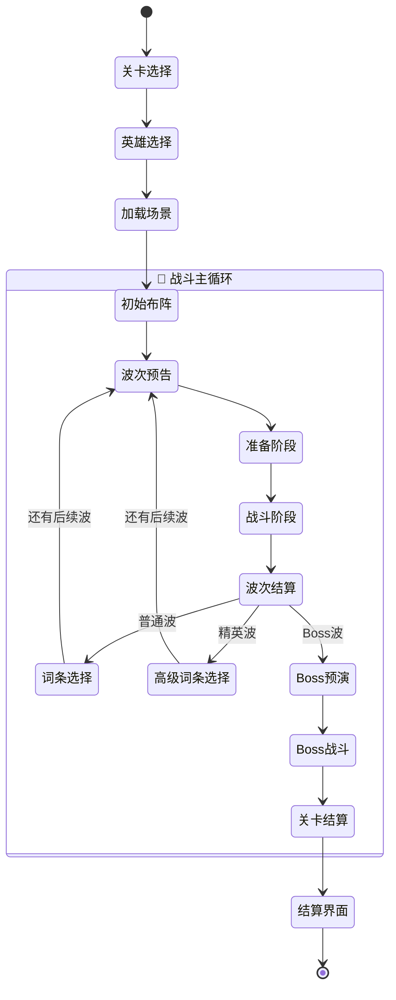
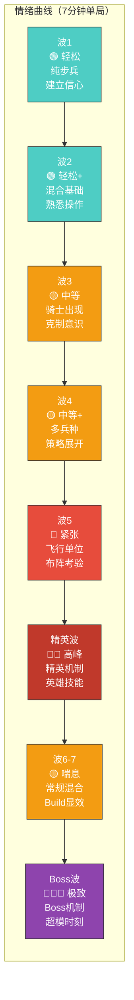
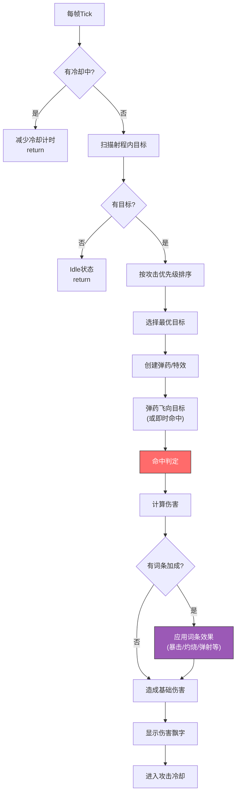
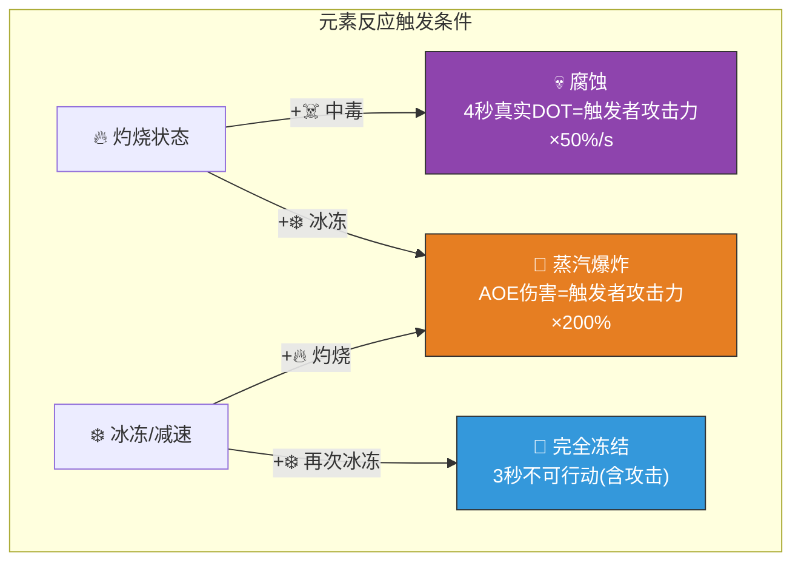
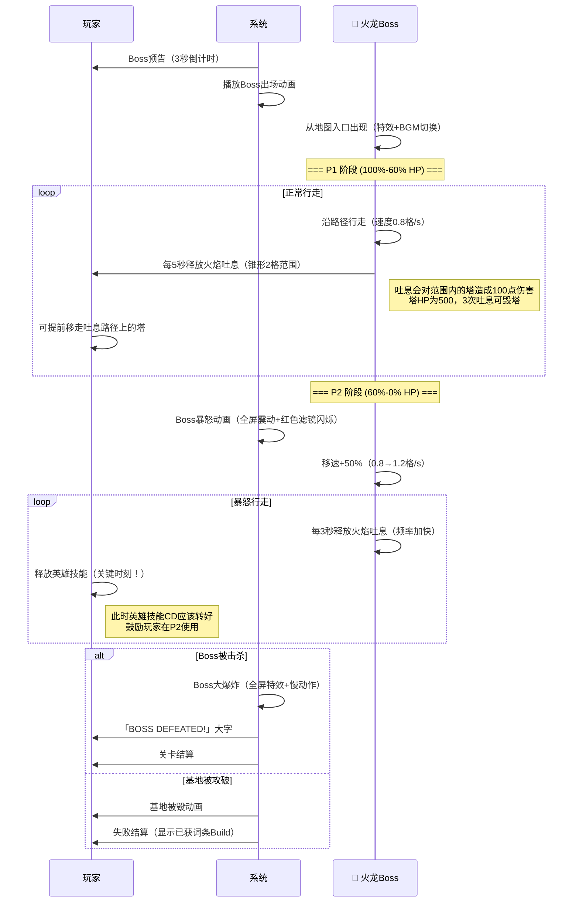


# ⚔️ AetheraSurvivors — 核心战斗循环详细设计

> **文档版本**：v1.0
> **最后更新**：2026-03-24
> **交互编号**：阶段一 #5
> **前置依赖**：GDD.md（v1.0）
> **验收标准**：✅ 完整的单局流程时序图 + ✅ 操作频率分析

---

## 一、战斗循环总览

### 1.1 设计哲学

| 原则 | 说明 | 竞品参考 |
|------|------|---------|
| **策略>操作** | 胜负取决于「选什么塔/放哪/选什么词条」而非手速 | 随机冲突（放塔简单但策略深） |
| **5分钟爽** | 单局7分钟内必须有至少3次「爽感高潮」 | 吸血鬼幸存者（5分钟一个Build成型） |
| **渐进复杂度** | 前2波纯观赏，中间4波策略展开，最后Boss波高潮 | Kingdom Rush（经典节奏曲线） |
| **零空闲** | 玩家在任何时刻都有事可做（放塔/选词条/观战/调整） | 无 |
| **容错但不容懒** | 允许偶尔失误（基地有3点血），但不允许完全不动脑 | Arknights（通关有门槛但不苛刻） |

### 1.2 单局状态机



### 1.3 状态详细定义

| 状态 | 时长 | 玩家可执行操作 | 系统行为 | 进入条件 | 退出条件 |
|------|------|-------------|---------|---------|---------|
| **关卡选择** | 不限 | 选关+选难度 | 显示关卡信息+星级+推荐等级 | 点击「开始战斗」 | 点击确认 |
| **英雄选择** | 不限 | 选1个英雄 | 显示英雄技能+属性 | 确认关卡 | 确认英雄 |
| **加载场景** | 1-3s | 无 | 加载地图+资源 | 确认英雄 | 加载完成 |
| **初始布阵** | 20s | 放塔(初始200金) | 倒计时+地图展示路径 | 加载完成 | 倒计时归零/手动跳过 |
| **波次预告** | 3s | 查看怪物信息 | UI预告怪物类型+数量 | 上一状态结束 | 预告动画完成 |
| **准备阶段** | 15s | 放塔/升级/出售/调整目标策略 | 倒计时+可视化建造区域 | 预告完成 | 倒计时归零/手动跳过 |
| **战斗阶段** | 25-40s | 升级塔/英雄技能/加速 | 怪物沿路径行走+塔自动攻击 | 准备结束 | 本波怪物全灭/到达终点 |
| **词条选择** | 15s | 从3张词条中选1张 | 显示词条效果+Build推荐 | 普通波结束 | 选择完成/超时随机 |
| **高级词条选择** | 15s | 从2张高级词条中选1张 | 保证蓝色以上 | 精英波结束 | 选择完成/超时随机 |
| **Boss预演** | 3s | 无 | Boss出场动画+技能预告 | 最后一波开始前 | 动画完成 |
| **Boss战斗** | 40-60s | 英雄技能+放塔+升级 | Boss多阶段战斗 | 预演完成 | Boss击杀/基地被毁 |
| **关卡结算** | 自动 | 无 | 计算评分+奖励 | 战斗结束 | 计算完成 |
| **结算界面** | 不限 | 查看/分享/再来一局/返回 | 显示Build卡片+奖励 | 结算完成 | 玩家选择 |

---

## 二、怪物波次设计原则

### 2.1 波次节奏总则



### 2.2 七条波次设计原则

| # | 原则名 | 规则 | 设计目的 |
|---|--------|------|---------|
| 1 | **渐进原则** | 每波怪物总血量递增15-25%，不允许跳跃式增长 | 让玩家感知到「越来越难」但不绝望 |
| 2 | **新怪预告原则** | 新怪物类型首次出现时，必须是少量混入（≤30%），不能整波全新怪 | 给玩家学习时间 |
| 3 | **克制引导原则** | 出现高护甲怪（骑士）前1-2波，词条池必须出现魔法/穿甲相关词条 | 让玩家有应对手段 |
| 4 | **喘息原则** | 精英波之后必须有1-2波普通难度的波次 | 避免疲劳，制造对比 |
| 5 | **多样性原则** | 连续2波不允许完全相同的怪物组合 | 保持新鲜感 |
| 6 | **极值控制原则** | 单波同屏怪物数量≤50（性能限制），总波次怪物≤120只 | 微信小游戏性能约束 |
| 7 | **Boss仪式感原则** | Boss波前有3秒出场动画，Boss波只含Boss+少量护卫兵 | 让Boss战斗有「决战」感 |

### 2.3 波次配置模板系统

每关由以下模板组合而成：

#### 模板A：教学波（第1-3章使用）

```
波次数: 5波 + Boss波
波次1: [步兵×8]                        难度系数: 1.0
波次2: [步兵×6, 刺客×4]                难度系数: 1.2
波次3: [步兵×10, 骑士×3]               难度系数: 1.5
波次4: [步兵×8, 刺客×6, 法师兵×3]      难度系数: 1.8
波次5: [混合×15]                        难度系数: 2.0
Boss:  [Boss + 步兵×6]                  难度系数: 3.0
```

#### 模板B：标准波（第4-10章使用）

```
波次数: 7波 + 1精英波 + Boss波
波次1: [步兵×10]                        难度系数: 1.0
波次2: [步兵×8, 刺客×5]                难度系数: 1.3
波次3: [骑士×5, 步兵×10]               难度系数: 1.6
波次4: [刺客×8, 法师兵×5]              难度系数: 1.8
波次5: [飞行×5, 步兵×15]               难度系数: 2.2
⚡精英: [精英怪×2, 骑士×10, 步兵×20]   难度系数: 3.0
波次6: [刺客×10, 法师兵×8]             难度系数: 2.0（喘息）
波次7: [全种类混合×25]                  难度系数: 2.5
🐉Boss: [Boss + 步兵×10]               难度系数: 4.0
```

#### 模板C：困难波（第11-20章使用）

```
波次数: 8波 + 2精英波 + Boss波
波次1: [步兵×12, 刺客×5]               难度系数: 1.5
波次2: [骑士×6, 法师兵×6]              难度系数: 1.8
波次3: [飞行×8, 步兵×12]               难度系数: 2.2
波次4: [刺客×12, 法师兵×8, 骑士×4]     难度系数: 2.5
⚡精英1: [精英怪×2, 混合×20]            难度系数: 3.5
波次5: [混合×20]                        难度系数: 2.0（喘息）
波次6: [飞行×6, 骑士×8, 刺客×10]       难度系数: 3.0
⚡精英2: [精英怪×3, 混合×25]            难度系数: 4.0
波次7: [全种类混合×30]                  难度系数: 3.5
🐉Boss: [Boss + 精英怪×1 + 混合×15]    难度系数: 5.0
```

#### 模板D：极限波（第21-30章使用）

```
波次数: 9波 + 2精英波 + Boss波
特殊规则: 部分波次为「双路线同时进攻」
波次1: [步兵×15, 刺客×8]               难度系数: 2.0
波次2: [骑士×8, 法师兵×8]              难度系数: 2.5
波次3: [飞行×10, 刺客×10]              难度系数: 3.0（双路线）
波次4: [全种类混合×25]                  难度系数: 3.5
⚡精英1: [精英怪×3, 混合×25]            难度系数: 4.5
波次5: [步兵×20]                        难度系数: 2.5（喘息）
波次6: [飞行×8, 骑士×10, 法师兵×10]    难度系数: 4.0（双路线）
波次7: [刺客×15, 隐身盗贼×3]           难度系数: 4.5
⚡精英2: [精英怪×4, 混合×30]            难度系数: 5.5
波次8: [全种类大混合×35]                难度系数: 5.0
🐉Boss: [Boss + 精英怪×2 + 混合×20]    难度系数: 7.0
```

### 2.4 难度系数计算公式

```
波次难度系数 = Σ(每只怪物的基础难度权重 × 章节倍率 × 难度模式倍率)

怪物基础难度权重:
  步兵     = 1.0
  刺客     = 1.5
  骑士     = 2.0
  法师兵   = 1.8
  飞行单位 = 2.5
  精英怪   = 5.0-8.0（按类型）
  Boss     = 20.0-30.0

章节倍率:
  第1章 = 1.0，每章递增0.1
  第30章 = 3.9

难度模式倍率:
  普通 = 1.0
  困难 = 1.5
  噩梦 = 2.5
```

### 2.5 怪物出怪间隔设计

| 怪物类型 | 出怪间隔 | 队列规则 | 说明 |
|---------|---------|---------|------|
| 步兵 | 0.8s | 均匀间隔 | 标准节奏 |
| 刺客 | 0.5s | 密集出怪 | 一窝蜂冲过来的压迫感 |
| 骑士 | 1.5s | 均匀间隔 | 一个个慢慢走来 |
| 法师兵 | 1.0s | 均匀间隔 | 标准节奏 |
| 飞行 | 1.2s | 随机偏移±0.3s | 不规则编队感 |
| 精英怪 | 2.0s | 最后出场 | 先出杂兵，精英压阵 |
| Boss | 独立波次 | 单独出场 | 出场动画后入场 |

### 2.6 多路线机制（第11章+解锁）

```
         ╔═══════════╗
    ─────╢  起点A     ╟─────┐
         ╚═══════════╝     │
                            ├───→ ═══ 路径A ═══ →──┐
                            │                       │
         ╔═══════════╗     │                  ╔════╧═════╗
    ─────╢  起点B     ╟─────┘                  ║  基地     ║
         ╚═══════════╝                         ║ (终点)   ║
                            ┌───→ ═══ 路径B ═══ →──╢          ║
         ╔═══════════╗     │                  ╚══════════╝
    ─────╢  起点C     ╟─────┘
         ╚═══════════╝
```

| 章节 | 路线数 | 规则 |
|------|--------|------|
| 1-10章 | 1条路线 | 经典单路径 |
| 11-20章 | 2条路线 | 部分波次从路线B出怪（提前预告） |
| 21-30章 | 2-3条路线 | 部分波次多路线同时出怪 |

---

## 三、塔的攻击逻辑详细设计

### 3.1 塔攻击总流程



### 3.2 六种塔的攻击逻辑详解

#### 🏹 箭塔（单体DPS核心）

| 属性 | 1级 | 2级 | 3级 |
|------|-----|-----|-----|
| 攻击力 | 25 | 33 | 50 |
| 攻速(次/s) | 1.2 | 1.3 | 1.44 |
| 射程(格) | 3.0 | 3.0 | 3.0 |
| DPS | 30.0 | 42.9 | 72.0 |
| 造价 | 100 | +60 | +100 |
| 累计花费 | 100 | 160 | 260 |
| DPS/总花费 | 0.30 | 0.27 | 0.28 |

**攻击逻辑**：
- **弹道类型**：追踪弹（生成后锁定目标，100%命中）
- **弹速**：12格/秒
- **目标数**：单体
- **3级特殊能力——穿透**：箭矢命中第一个目标后继续飞行，对第二个目标造成60%伤害
- **词条交互**：
  - 「暴击强化」→ 每次攻击独立计算暴击
  - 「连锁闪电」→ 命中后弹射到附近2个敌人
  - 「火焰附魔」→ 命中附带灼烧DOT

#### 🔮 法塔（AOE群体核心）

| 属性 | 1级 | 2级 | 3级 |
|------|-----|-----|-----|
| 攻击力 | 18 | 23 | 36 |
| 攻速(次/s) | 0.8 | 0.88 | 0.96 |
| 射程(格) | 3.5 | 3.5 | 3.5 |
| AOE范围(格) | 1.0 | 1.0 | 1.2 |
| 单体DPS | 14.4 | 20.2 | 34.6 |
| AOE有效DPS | ~43.2 | ~60.7 | ~103.7 |
| 造价 | 120 | +72 | +120 |
| 累计花费 | 120 | 192 | 312 |

> AOE有效DPS按平均命中3个目标计算

**攻击逻辑**：
- **弹道类型**：抛射弹（抛物线轨迹，飞向目标位置而非目标本体）
- **弹速**：8格/秒
- **AOE机制**：弹药到达目标位置后爆炸，对范围内所有敌人造成全额伤害
- **预判逻辑**：发射时预测目标位置（target.position + target.velocity × flyTime）
- **3级特殊能力——减速**：命中目标减速20%，持续2秒
- **词条交互**：
  - 「火焰附魔」→ 爆炸范围内全部附带灼烧
  - 「元素反应：蒸汽」→ 如果范围内有被冰冻的敌人，触发蒸汽爆炸

#### ❄️ 冰塔（减速控制核心）

| 属性 | 1级 | 2级 | 3级 |
|------|-----|-----|-----|
| 攻击力 | 8 | 10 | 16 |
| 攻速(次/s) | 1.0 | 1.1 | 1.2 |
| 射程(格) | 3.0 | 3.0 | 3.5 |
| 减速效果 | -20%移速 | -26%移速 | -32%移速 |
| 减速持续 | 2.0s | 2.0s | 2.5s |
| 造价 | 80 | +48 | +80 |
| 累计花费 | 80 | 128 | 208 |

**攻击逻辑**：
- **弹道类型**：射线即时命中（蓝色冰冻射线特效）
- **目标数**：单体
- **减速机制**：命中后施加减速Debuff，多个冰塔减速效果叠加（乘法叠加，非加法），上限-80%
- **减速叠加公式**：`最终移速 = 基础移速 × (1 - slow1) × (1 - slow2) × ...`
- **3级特殊能力——冰冻光环**：持续影响射程内所有敌人，-30%移速（不需要攻击，被动效果）
- **词条交互**：
  - 「冰冻之触」→ 15%概率将减速升级为冰冻（完全停止1秒）
  - 「绝对零度」→ 冰塔范围+50%，减速效果+25%
  - 「元素反应：冰封」→ 两层冰冻叠加=完全冻结3秒

#### 💣 炮塔（范围爆破核心）

| 属性 | 1级 | 2级 | 3级 |
|------|-----|-----|-----|
| 攻击力 | 45 | 59 | 90 |
| 攻速(次/s) | 0.5 | 0.55 | 0.6 |
| 射程(格) | 3.5 | 3.5 | 3.5 |
| AOE范围(格) | 1.2 | 1.2 | 1.5 |
| 单体DPS | 22.5 | 32.5 | 54.0 |
| AOE有效DPS | ~67.5 | ~97.4 | ~162.0 |
| 造价 | 150 | +90 | +150 |
| 累计花费 | 150 | 240 | 390 |

**攻击逻辑**：
- **弹道类型**：抛物线+AOE爆炸（高弧度抛射，视觉效果最强）
- **弹速**：6格/秒
- **AOE机制**：落点爆炸，中心全额伤害，边缘50%伤害（线性衰减）
- **伤害衰减公式**：`实际伤害 = 基础伤害 × max(0.5, 1.0 - distance/AOE半径 × 0.5)`
- **3级特殊能力——击退**：爆炸将范围内敌人击退1格（沿路径方向向后），精英怪/Boss免疫击退
- **词条交互**：
  - 「穿甲」→ AOE伤害同样忽视护甲
  - 「巨人杀手」→ 对Boss单体+30%伤害同样生效

#### ☠️ 毒塔（DOT持续核心）

| 属性 | 1级 | 2级 | 3级 |
|------|-----|-----|-----|
| 毒雾伤害/秒 | 12 | 16 | 24 |
| 毒雾范围(格) | 1.5 | 1.5 | 2.25 |
| 伤害类型 | 真实伤害 | 真实伤害 | 真实伤害 |
| 区域DPS | 12 | 16 | 24 |
| 造价 | 100 | +60 | +100 |
| 累计花费 | 100 | 160 | 260 |

**攻击逻辑**：
- **攻击方式**：区域持续伤害（无弹道，在塔周围释放毒雾区域）
- **毒雾机制**：每秒对范围内所有敌人造成真实伤害（无视护甲和魔抗）
- **目标数**：范围内全体
- **特殊规则**：毒雾伤害不触发暴击（但触发「火焰附魔」的灼烧）
- **3级特殊能力——毒雾扩散**：毒雾范围+50%（1.5格→2.25格）
- **词条交互**：
  - 「元素反应：腐蚀」→ 毒+火同时作用=持续腐蚀（真实伤害+50%）
  - 对高护甲目标（骑士）是核心克制手段

#### ⛏️ 金矿（经济产出核心）

| 属性 | 1级 | 2级 | 3级 |
|------|-----|-----|-----|
| 产出/波 | 15金 | 20金 | 30金 |
| 造价 | 80 | +48 | +80 |
| 累计花费 | 80 | 128 | 208 |
| 回本波次 | 5.3波 | 4.0波（增量） | 3.3波（增量） |

**经济逻辑**：
- **产出时机**：每波战斗结束时自动产出金币
- **不参与战斗**：金矿不攻击，不可设置攻击目标
- **建造上限**：初始3个，词条「矿脉开发」可+1
- **策略意义**：早期投资金矿=后期经济碾压，但牺牲了早期防御力
- **词条交互**：
  - 「金矿强化」→ 金矿产出+25%
  - 「投资回报」→ 每波开始获得已放塔数×5金（与金矿协同）

### 3.3 伤害计算公式

```
最终伤害 = 基础伤害 × 词条伤害加成 × 暴击倍率 - 护甲/魔抗减免

详细步骤：
1. 基础伤害 = 塔攻击力 × (1 + 词条伤害百分比加成之和)
2. 暴击判定 = random(0,1) < 暴击率 ? 暴击伤害倍率(默认1.5) : 1.0
3. 伤害类型判定：
   - 物理伤害 → 减免 = 护甲 / (护甲 + 100)
   - 魔法伤害 → 减免 = 魔抗 / (魔抗 + 100)
   - 真实伤害 → 减免 = 0
4. 最终伤害 = 基础伤害 × 暴击倍率 × (1 - 减免率)
5. 附加效果（灼烧/减速/冰冻等）在伤害结算后独立触发
```

**护甲/魔抗减免曲线**：

| 护甲/魔抗值 | 减免率 | 说明 |
|------------|--------|------|
| 0 | 0% | 无防御 |
| 20 | 16.7% | 刺客/飞行 |
| 50 | 33.3% | 法师兵基础魔抗 |
| 100 | 50.0% | 骑士基础护甲 |
| 150 | 60.0% | 精英骑士 |
| 200 | 66.7% | Boss |

> 设计意图：减免率有收益递减，不会出现100%减免。穿甲词条直接减少对方护甲值（可为负）。

### 3.4 Debuff系统

| Debuff | 来源 | 效果 | 持续时间 | 叠加规则 |
|--------|------|------|---------|---------|
| 🔥 灼烧 | 火焰附魔词条/炎魔法师 | 3秒内造成初始攻击30%的持续伤害 | 3s | 刷新持续时间，不叠加伤害 |
| ❄️ 减速 | 冰塔/减速光环词条 | 降低移动速度 | 2-2.5s | 乘法叠加（上限-80%） |
| 🧊 冰冻 | 冰冻之触词条 | 完全停止移动 | 1s | 不叠加，免疫1秒后可再次触发 |
| ☠️ 中毒 | 毒塔 | 持续真实伤害 | 持续（在毒雾范围内） | 不叠加，离开后立即消失 |
| 💔 腐蚀 | 元素反应：腐蚀 | 持续真实伤害+50% | 4s | 刷新持续时间 |
| 💥 击退 | 炮塔3级 | 沿路径后退1格 | 即时 | Boss/精英免疫 |
| 👁️ 暴露 | AOE命中隐身单位 | 取消隐身 | 5s | — |

### 3.5 元素反应详细设计



| 反应 | 触发条件 | 效果 | 消耗元素 | 冷却 |
|------|---------|------|---------|------|
| **蒸汽爆炸** | 灼烧+冰冻/减速 | 1.5格AOE，触发者攻击力×200% | 消耗灼烧和冰冻 | 2秒 |
| **腐蚀** | 灼烧+中毒 | 4秒真实DOT（忽视所有防御） | 消耗灼烧 | 3秒 |
| **完全冻结** | 冰冻+冰冻（双重来源） | 3秒完全停止（含精英怪，Boss减为1.5秒） | 消耗两层冰冻 | 5秒 |

---

## 四、玩家操作节奏分析

### 4.1 操作频率热力图

```
时间段        操作密度  主要操作              心理状态
───────────  ────────  ──────────────────  ──────────
0:00-0:20    ██████░░  选关+选英雄           期待
0:20-0:35    ████████  初始布阵(核心决策)     专注
0:35-1:05    ███░░░░░  观战+微调             放松/观赏
1:05-1:20    ████████  词条选择(核心决策)     兴奋/纠结
1:20-1:35    ██████░░  准备(放塔/升级)        思考
1:35-2:05    ███░░░░░  观战                  放松
2:05-2:20    ████████  词条选择              兴奋
2:20-3:35    ████░░░░  战斗+间歇词条          渐入佳境
3:35-4:00    ██████░░  词条+布阵调整          策略深化
4:00-4:40    █████░░░  精英波(可能用英雄技能)  紧张
4:40-4:55    ████████  高级词条选择           极度兴奋
4:55-6:25    ████░░░░  Build成型观战          满足/期待
6:25-7:25    ██████░░  Boss战斗(技能释放)     高潮/紧张
7:25-7:35    ████████  结算/分享              成就感
```

### 4.2 操作分类与频率统计

| 操作类型 | 每局平均次数 | 每分钟频率 | 决策权重 | 反馈强度 |
|---------|------------|----------|---------|---------|
| **放塔** | 6-10次 | ~1.2次/min | ⭐⭐⭐⭐⭐ | 立即看到塔出现+射程圈 |
| **升级塔** | 3-5次 | ~0.6次/min | ⭐⭐⭐⭐ | 外观变化+数值提升 |
| **出售塔** | 0-2次 | ~0.2次/min | ⭐⭐⭐ | 金币回收动画 |
| **选词条** | 5-7次 | ~0.8次/min | ⭐⭐⭐⭐⭐ | 词条效果立即显现 |
| **英雄技能** | 1-2次 | ~0.2次/min | ⭐⭐⭐⭐ | 全屏特效+大量伤害 |
| **加速切换** | 1-3次 | ~0.3次/min | ⭐ | 速度变化 |
| **查看怪物信息** | 2-4次 | ~0.4次/min | ⭐⭐ | 信息面板 |
| **合计** | 18-33次 | ~3.7次/min | — | — |

### 4.3 操作节奏设计目标

| 指标 | 目标值 | 说明 |
|------|--------|------|
| **APM（操作/分钟）** | 3-5次 | 远低于MOBA(~60APM)，适合单手操作 |
| **决策间隔** | 30-60秒 | 每30-60秒有一次关键决策（放塔or选词条） |
| **被动观战时间占比** | 40-50% | 允许玩家放松观赏战斗效果 |
| **高峰操作密度** | 6-8次/min | 仅在初始布阵和词条选择时 |
| **最长无操作时段** | ≤30秒 | 战斗阶段即使不操作也有飘字/特效可看 |

### 4.4 心流曲线设计

```
挑战难度 ↑
    │                                              ★ Boss战
    │                                         ╱
    │                              ★精英波  ╱
    │                         ╱         ╲╱
    │                    ╱              ╱
    │               ╱   ╱─ 喘息波    ╱
    │          ╱  ╱                 ╱
    │     ╱ ╱                    ╱
    │  ╱╱ ← 波次难度逐步上升    ╱
    │╱                        ╱
    ├──────────────────────────────────→ 时间
    0    1    2    3    4    5    6    7 分钟
    
    ───── 玩家技能水平（词条带来的Build强度，逐步上升）
    ─ ─ ─ 关卡难度（波浪式上升）
    
    心流区 = 技能水平略低于挑战难度 → 产生「刚好差一点」的紧张感
```

| 时间段 | 挑战/技能比 | 心理状态 | 设计手段 |
|--------|-----------|---------|---------|
| 0-2分钟 | 技能>挑战 | 轻松自信 | 前2波简单，建立信心 |
| 2-4分钟 | 挑战≈技能 | 专注心流 | 难度渐增，词条开始生效补偿 |
| 4-5分钟 | 挑战>技能 | 紧张刺激 | 精英波压力，英雄技能翻盘 |
| 5-6分钟 | 技能>挑战 | 满足爽快 | Build成型，喘息波+碾压体验 |
| 6-7分钟 | 挑战>>技能（短暂） | 高度紧张 | Boss多阶段，「差一点」的刺激 |
| 7分钟+ | 完成 | 成就感爆发 | 结算+Build评分+分享欲 |

---

## 五、局内经济详细设计

### 5.1 金币产出曲线（标准模板B，普通难度）

| 波次 | 怪物金币 | 波次奖励 | 金矿产出(1矿) | 金矿产出(2矿) | 金矿产出(3矿) | 累计总金(0矿) | 累计总金(2矿) |
|------|---------|---------|-------------|-------------|-------------|-------------|-------------|
| 开局 | — | — | — | — | — | 200 | 200 |
| 波1 | 80 | 25 | 15 | 30 | 45 | 305 | 335 |
| 波2 | 95 | 25 | 15 | 30 | 45 | 425 | 485 |
| 波3 | 110 | 30 | 15 | 30 | 45 | 565 | 645 |
| 波4 | 100 | 30 | 15 | 30 | 45 | 695 | 805 |
| 波5 | 120 | 30 | 15 | 30 | 45 | 845 | 985 |
| 精英波 | 180 | 40 | 15 | 30 | 45 | 1065 | 1235 |
| 波6 | 105 | 30 | 15 | 30 | 45 | 1200 | 1400 |
| 波7 | 130 | 35 | 15 | 30 | 45 | 1365 | 1595 |
| Boss波 | 200 | 50 | 15 | 30 | 45 | 1615 | 1875 |
| **总计** | **1120** | **295** | **135** | **270** | **405** | **1615** | **1875** |

### 5.2 金币消耗预算分析

| 消耗项 | 数量 | 单价 | 小计 | 说明 |
|--------|------|------|------|------|
| 初始放塔×2 | 2 | ~100 | 200 | 用完初始金 |
| 第1-2波放塔×2 | 2 | ~100 | 200 | — |
| 升级到2级×2 | 2 | ~60 | 120 | 核心塔升级 |
| 第3-4波放塔×2 | 2 | ~110 | 220 | — |
| 建金矿×1 | 1 | 80 | 80 | 中期投资 |
| 升级到3级×1 | 1 | ~100 | 100 | 核心塔突破 |
| 第5波后放塔×2 | 2 | ~120 | 240 | 后期补充 |
| 精英波后升级×2 | 2 | ~80 | 160 | 关键升级 |
| Boss前放塔/升级 | — | — | 200 | 最终调整 |
| **总消耗** | — | — | **~1520** | — |

### 5.3 经济健康度验证

```
=== 0金矿路线（纯战斗） ===
总产出: 1615金
总消耗: ~1520金
盈余: +95金（健康，略有余粮）

=== 2金矿路线（经济型） ===  
总产出: 1875金
金矿投资: 160金（2个金矿）
净额外收益: +260金 - 160金 = +100金
可多建1个塔或多升1个3级

=== 3金矿路线（经济碾压） ===
总产出: 2020金
金矿投资: 240金（3个金矿）
净额外收益: +405金 - 240金 = +165金
需要2波回本时间，早期防御薄弱（高风险高回报）
```

### 5.4 金币节奏设计原则

| 原则 | 规则 | 目的 |
|------|------|------|
| **首波够用** | 初始200金=至少2个基础塔 | 不让玩家第一波就空手 |
| **每波有收获** | 每波至少获得80+金币 | 持续的正反馈 |
| **升级有门槛** | 升级到3级需要积攒1-2波的收入 | 制造「差一点就能升级」的期待感 |
| **金矿是投资** | 金矿需要5波才能回本 | 前期建金矿=承担风险 |
| **经济词条显效** | 有经济词条时，中后期能多建1-2个塔 | 让经济Build有明显优势 |
| **Boss前有余粮** | Boss波前预留100-200金应急 | 允许Boss前最后调整 |
| **通关不差钱但也不富余** | 总金币比总需求多5-10% | 紧凑感但不绝望 |

### 5.5 金币产出/消耗曲线图

```
金币  ↑
1600 ├                                              ●─ 总产出(0矿)
     │                                         ╱
1400 ├                                    ╱●
     │                               ╱
1200 ├                          ╱●
     │                     ╱         ★─ 总消耗需求
1000 ├                ★╱
     │           ╱★╱
 800 ├      ╱╱★
     │  ╱★╱
 600 ├╱★
     │★    ← 波1-3：产出≈消耗（紧绷期）
 400 ├
     │  ← 初始金200
 200 ├●★
     │
   0 ├──┬──┬──┬──┬──┬──┬──┬──┬──→ 波次
     开局  1  2  3  4  5  精  6  7  Boss

● = 累计金币产出
★ = 累计金币消耗
间距 = 玩家手中的可用金币（越大越富裕）
```

**关键节奏点**：
- **波1-3**：产出≈消耗，紧绷期（每一枚金币都珍贵）
- **波4-5**：产出开始略超消耗（词条「赏金猎人」此时效果显现）
- **精英波后**：大量金币奖励，产生一次「富裕感」（冲动消费窗口）
- **Boss前**：适度盈余，允许最后调整

---

## 六、战斗反馈系统

### 6.1 视觉反馈层级

| 层级 | 触发条件 | 视觉效果 | 说明 |
|------|---------|---------|------|
| L1 基础 | 每次攻击 | 弹道+命中闪光+伤害飘字（白色） | 最基础的战斗反馈 |
| L2 暴击 | 暴击命中 | 放大飘字（黄色/金色）+ 震屏轻微 | 让暴击有「打到了」的感觉 |
| L3 击杀 | 敌人死亡 | 死亡动画+金币飞出+击杀计数+1 | 正反馈链 |
| L4 连杀 | 短时间内多次击杀 | 连杀特效+数字(x2,x3...)+音效升调 | 多巴胺加速 |
| L5 超模 | 超高伤害/全屏AOE | 全屏震动+慢动作0.3秒+粒子爆炸+特殊音效 | 超模时刻，分享冲动 |
| L6 Boss击杀 | Boss死亡 | 大爆炸+全屏白光+「VICTORY」大字+欢呼音效 | 最强正反馈 |

### 6.2 伤害飘字设计

| 类型 | 颜色 | 大小 | 动画 | 触发条件 |
|------|------|------|------|---------|
| 普通伤害 | 白色 | 标准 | 上浮0.5秒消失 | 每次命中 |
| 暴击伤害 | 金色 | 1.5倍 | 上浮+弹跳+0.8秒消失 | 暴击命中 |
| 真实伤害 | 紫色 | 标准 | 上浮0.5秒消失 | 毒塔/腐蚀 |
| 回血 | 绿色 | 标准 | 上浮0.5秒 | 治疗者回血 |
| 元素反应 | 橙色（蒸汽）/暗紫（腐蚀）/冰蓝（冻结） | 2倍 | 弹跳+震屏+1秒消失 | 元素反应触发 |
| 免疫/吸收 | 灰色 | 0.8倍 | 「MISS」或「IMMUNE」 | 特定免疫 |

### 6.3 音效节奏

| 阶段 | BGM风格 | 音效密度 | 说明 |
|------|---------|---------|------|
| 准备阶段 | 轻松策略风 | 低（放塔音效为主） | 让玩家安心思考 |
| 普通波 | 中速战斗风 | 中（攻击音+命中音） | 标准战斗氛围 |
| 精英波 | 紧张鼓点加重 | 高（精英特殊音效） | 制造紧迫感 |
| Boss波 | 史诗管弦乐 | 极高（Boss技能音效+环境音） | 决战氛围 |
| 超模时刻 | BGM高潮+音效叠加 | 爆发 | 配合慢动作 |
| 结算 | 胜利号角/轻快旋律 | 低（UI音效） | 满足感 |

---

## 七、战斗加速与暂停

### 7.1 加速系统

| 速度 | 倍率 | 适用场景 | 影响范围 |
|------|------|---------|---------|
| 1x（默认） | 1.0 | 新手/欣赏战斗 | 全部 |
| 2x | 2.0 | 熟练玩家/重复关卡 | 怪物移速+塔攻速+准备时间+倒计时 |

> **不提供3x**：微信小游戏性能限制 + 2x已经足够快（单局缩短到~3.5分钟）

**加速不影响的内容**：
- 词条选择时间（始终15秒，不被加速）
- 动画播放速度（弹道速度跟随加速，但粒子特效不变）
- Boss出场动画（始终正常速度，保持仪式感）

### 7.2 暂停系统

| 功能 | 说明 |
|------|------|
| 暂停战斗 | 冻结所有游戏逻辑 |
| 查看Build | 暂停后可查看当前已获词条列表 |
| 查看塔信息 | 暂停后可查看各塔属性和DPS |
| 继续 | 恢复战斗 |
| 退出 | 退出关卡（算失败，不奖励） |

---

## 八、特殊战斗场景设计

### 8.1 Boss战斗详细流程（以火龙为例）



### 8.2 精英怪特殊机制战斗表现

| 精英怪 | 出场 | 战斗表现 | 死亡表现 |
|--------|------|---------|---------|
| 🩹 治疗者 | 绿色光圈+治疗符号 | 每3秒释放绿色光波，范围内友军+5%HP | 绿色光波消散 |
| 🟢 分裂史莱姆 | 大号跳弹特效 | 正常行走（体型比普通怪大2倍） | 分裂为2-3个小史莱姆（50%HP，原速度） |
| 👻 隐身盗贼 | 闪烁出现 | 每5秒隐身3秒（半透明→完全消失），隐身时不可被单体攻击锁定 | 现形后死亡 |
| 🛡️ 护盾法师 | 蓝色护盾特效 | 每4秒为最近友军施加护盾（吸收200点伤害），护盾持续5秒 | 所有护盾立即消失 |

---

## 九、Build评分系统

### 9.1 评分维度

| 维度 | 权重 | 计算方式 | 满分 |
|------|------|---------|------|
| **词条协同** | 30% | 词条之间的Build路线一致性（同路线词条越多分越高） | 300分 |
| **DPS效率** | 25% | 总伤害 / 总金币消耗 | 250分 |
| **基地安全** | 20% | 剩余基地生命 / 最大生命 × 200 | 200分 |
| **速度奖励** | 15% | 通关时间 < 标准时间则加分 | 150分 |
| **击杀数** | 10% | 总击杀 / 总怪物数 × 100 | 100分 |
| **总分** | 100% | — | **1000分** |

### 9.2 评分等级

| 等级 | 分数范围 | 展示 | 说明 |
|------|---------|------|------|
| S | 900-1000 | 🌟金色大S+粒子特效 | 超模Build，强烈引导分享 |
| A | 750-899 | 🟣紫色A | 优秀Build |
| B | 550-749 | 🔵蓝色B | 良好 |
| C | 350-549 | ⬜白色C | 及格 |
| D | 0-349 | 灰色D | 较差 |

### 9.3 Build卡片分享内容

```
┌─────────────────────────────────┐
│  🏰 AetheraSurvivors             │
│  ─────────────────────────────  │
│  🏆 S级 Build — 暴力DPS流        │
│  ⭐⭐⭐ 完美通关                    │
│                                 │
│  📊 Build路线:                   │
│  [暴击强化] [穿甲] [急速]        │
│  [连锁闪电] [末日审判]           │
│                                 │
│  💥 总DPS: 1,247                 │
│  🎯 击杀数: 143/143 (100%)       │
│  ⏱️ 用时: 6分12秒                │
│  💰 经济效率: A+                 │
│                                 │
│  🌟 评分: 952/1000               │
│  ─────────────────────────────  │
│  [👆 点击挑战同一关卡]            │
└─────────────────────────────────┘
```

---

## 十、性能约束下的战斗优化方案

### 10.1 同屏对象控制

| 对象类型 | 上限数量 | 超限处理 |
|---------|---------|---------|
| 怪物 | 50 | 暂缓出怪（队列等待） |
| 弹道 | 30 | 对象池回收最旧的弹道 |
| 伤害飘字 | 20 | 合并显示（「×3」） |
| 粒子特效 | 15个发射器 | 复用+共享材质 |
| 塔 | 20 | 地图格子限制 |

### 10.2 性能优化策略

| 策略 | 应用场景 | 方案 |
|------|---------|------|
| **对象池** | 怪物/弹道/飘字/特效 | 预分配，重复使用 |
| **空间分区** | 塔搜索目标 | 格子空间划分，仅搜索相邻格 |
| **分帧处理** | 塔攻击判定 | 不是所有塔每帧都判定，分3帧轮转 |
| **LOD飘字** | 远距离伤害 | 超过一定范围的飘字简化或合并 |
| **批量渲染** | 同类型怪物 | GPU Instancing / SpriteAtlas |
| **寻路缓存** | 怪物寻路 | 预计算路径+缓存，路径变化时重算 |

---

## 十一、附录：关键数据汇总表

### 11.1 塔DPS/Cost效率对比

| 塔 | 1级DPS | 1级造价 | DPS/金 | 3级DPS | 3级总价 | DPS/金 | 定位优势 |
|----|--------|--------|--------|--------|--------|--------|---------|
| 🏹 箭塔 | 30.0 | 100 | 0.30 | 72.0 | 260 | 0.28 | 单体最高DPS |
| 🔮 法塔 | 43.2* | 120 | 0.36 | 103.7* | 312 | 0.33 | AOE性价比之王 |
| ❄️ 冰塔 | 8.0 | 80 | 0.10 | 19.2 | 208 | 0.09 | 输出不重要，控制价值无法量化 |
| 💣 炮塔 | 67.5* | 150 | 0.45 | 162.0* | 390 | 0.42 | AOE最高伤害(含衰减) |
| ☠️ 毒塔 | 12.0 | 100 | 0.12 | 24.0 | 260 | 0.09 | 真实伤害克制高甲 |
| ⛏️ 金矿 | 0 | 80 | — | — | 208 | — | 经济投资 |

> *标注为AOE有效DPS（按平均命中3个目标估算）

### 11.2 单局关键时间点

| 时间 | 事件 | 设计目的 |
|------|------|---------|
| 0:00-0:20 | 选择+加载 | 进入期 |
| 0:20-0:35 | 初始布阵 | 第一次策略决策 |
| 0:35 | 第一波怪出现 | 30秒内产生Wow Moment |
| 1:05 | 第一次词条选择 | Roguelike核心亮相 |
| ~3:00 | Build方向初步成型 | 3分钟进入心流 |
| ~4:00 | 精英波+英雄技能 | 第一次高潮 |
| ~4:40 | 高级词条选择 | Build定型 |
| ~5:00-6:00 | Build效果全面显现 | 超模时刻 |
| ~6:30 | Boss出场 | 最终高潮 |
| ~7:30 | 通关结算 | 成就感+分享冲动 |

---

> 📝 **文档维护规则**：
> 1. 本文档为GDD第二/三/四/五/七章的详细展开
> 2. 数值为初版骨架值，将在阶段一#18-22中进行精确调参
> 3. 性能优化方案将在阶段二代码实现时具体落地
> 4. 战斗模拟脚本（#31）将基于本文档的数值进行验证
