
# 📤 AetheraSurvivors — 社交裂变子系统详细设计（#11.1-11.4）

> **文档版本**：v1.0
> **最后更新**：2026-03-24
> **交互编号**：阶段一 #11.1 / #11.2 / #11.3 / #11.4
> **前置依赖**：社交裂变系统设计.md（v1.0 #11）、GDD.md（v1.0 §九）
> **验收标准**：
> - #11.1 ✅ 3套分享卡片方案各有定位差异
> - #11.2 ✅ 完整的群社交玩法流程
> - #11.3 ✅ PK流程完整，分享链路清晰
> - #11.4 ✅ 完整的30秒转化漏斗设计

---

# Part A：分享卡片深度设计（#11.1）

## A1. 三套分享卡片定位总览

| 维度 | 🏆 炫耀型 | 🆘 求助型 | ⚔️ 挑战型 |
|------|----------|----------|----------|
| **情绪驱动** | 自豪感 / 虚荣心 | 亲近感 / 互助 | 好胜心 / 好奇 |
| **核心文案调性** | 「看我多强」 | 「我需要你」 | 「你敢来吗」 |
| **分享者心理** | 我很厉害，值得炫耀 | 我遇到困难，好友会帮忙 | 我想试试你行不行 |
| **接收者心理** | 好奇/羡慕→想试试 | 被需要感→愿意帮忙 | 不服气→一较高下 |
| **适用场景** | 3星通关/SSR/超模Build/排行上升 | 卡关/体力不足/Boss差一点 | PK/超越好友/赛季冲刺 |
| **预估分享率** | 30-60% | 20-25% | 15-25% |
| **预估CTR** | 12-20% | 18-25% | 15-22% |
| **预估转化率** | 25-30% | 20-30% | 25-35% |
| **K因子贡献** | L2 ~0.14 | L3 ~0.16 | L4 ~0.09 |
| **色彩主调** | 金色 / 紫色（高贵稀有） | 暖橙 / 红色（紧迫温暖） | 蓝紫 / 火红（对抗激烈） |

## A2. 🏆 炫耀型卡片 — 3种子类型深度设计

### A2.1 成就炫耀卡

**触发条件**：3星通关 / 零伤通关 / 首次通关困难模式 / 首次通关噩梦模式

#### 视觉规范

```
尺寸: 500×400px (5:4微信最佳比例)
圆角: 16px

┌─────────────────────────────────────────────┐
│ ▓▓▓▓▓▓▓▓▓▓ 金色渐变头部 ▓▓▓▓▓▓▓▓▓▓        │ ← 高度60px
│   🏰 AetheraSurvivors                      │    Logo+游戏名(白色)
│                                              │
│ ═══════════════════════════════════════════  │
│                                              │
│        ✨  ⭐ ⭐ ⭐  ✨                      │ ← 星星带粒子动效(静态图表现为光芒)
│                                              │
│      ╔═══════════════════════╗               │ ← 成就徽章框(金色描边)
│      ║   🏆 完 美 防 御 🏆   ║               │    大号加粗(28px)
│      ║                       ║               │
│      ║  零伤通关 · 第15-3关  ║               │    副标题(18px)
│      ╚═══════════════════════╝               │
│                                              │
│  ┌──────────┐  ┌──────────┐  ┌──────────┐   │ ← 三列数据卡
│  │ 🦸 英雄   │  │ 💥 DPS   │  │ 💀 击杀   │   │
│  │ 天选者    │  │ 28,730   │  │ 142      │   │    16px 灰色标签
│  │ Lv.42    │  │          │  │          │   │    24px 白色数字
│  └──────────┘  └──────────┘  └──────────┘   │
│                                              │
│  📜 Build: 暴击强化×3 + 末日审判 + 连锁闪电  │ ← 14px 词条一行列出
│                                              │
│  ╭─────────────────────────────────────╮     │ ← CTA按钮(圆角渐变)
│  │   👉 你做得到吗？点击挑战同一关！    │     │    白色文字+手指emoji
│  ╰─────────────────────────────────────╯     │
│                                              │
│ ▓▓▓▓▓▓▓▓▓▓ 金色渐变底部 ▓▓▓▓▓▓▓▓▓▓        │ ← 高度30px
│   [玩家头像] [玩家昵称] 的战绩               │    小号灰色文字
└─────────────────────────────────────────────┘
```

#### 文案变体库（A/B测试用）

| 变体 | 标题文案 | CTA文案 | 调性 |
|------|---------|---------|------|
| A（傲娇） | 「零伤通关第15关！」 | 「你做得到吗？点击挑战！」 | 挑衅+激将 |
| B（轻松） | 「完美三星！一个都没漏！」 | 「来试试能不能比我厉害」 | 平和+邀请 |
| C（数据控） | 「DPS 28,730！第15关的终极Build」 | 「点击查看这个Build」 | 好奇+干货 |
| D（噩梦专用） | 「噩梦难度？不过如此！」 | 「最强防御，敢来挑战？」 | 自信+刺激 |

#### 色彩方案

| 元素 | 颜色值 | 说明 |
|------|--------|------|
| 头部/底部渐变 | `#FFD700 → #FFA500` | 金色渐变（成就感） |
| 成就徽章框 | `#FFE44D` 描边 + `rgba(255,215,0,0.15)` 填充 | 金色半透明 |
| 星星 | `#FFD700` + 外发光 `#FFF8DC` | 闪亮金星 |
| 数据卡片背景 | `rgba(0,0,0,0.3)` | 半透明深色 |
| CTA按钮 | `#FF6B35 → #FF4500` | 橙红渐变（行动号召） |
| 整体背景 | `#1A1A2E` | 深蓝黑（衬托金色） |

### A2.2 SSR英雄炫耀卡

**触发条件**：抽到SSR英雄

#### 视觉规范

```
尺寸: 500×400px

┌─────────────────────────────────────────────┐
│                                              │
│      ✨ ✨ ✨ ✨ ✨ ✨ ✨ ✨ ✨ ✨              │ ← 满屏金色粒子(静态光点)
│                                              │
│          ╔══════════════════╗                 │
│          ║  [英雄全身立绘]   ║                 │ ← 英雄立绘占位(200×260px)
│          ║                  ║                 │    占卡片主体视觉区域
│          ║  (天选者/霜雪...) ║                 │
│          ╚══════════════════╝                 │
│                                              │
│      ╭───── 🌟 SSR 🌟 ─────╮               │ ← SSR标签(闪光描边)
│      │    天 选 者           │               │    英雄名(28px加粗)
│      │  "命运垂青——词条4选1" │               │    被动技能文案(14px)
│      ╰───────────────────────╯               │
│                                              │
│    「欧皇附体！第37发就出金了！」            │ ← 个性化文案(含抽数)
│                                              │
│    ╭─────────────────────────────╮           │
│    │ 👉 点击试试你的运气！        │           │ ← CTA
│    ╰─────────────────────────────╯           │
│                                              │
│    [头像] [昵称] 刚刚获得                     │
└─────────────────────────────────────────────┘
```

#### 文案变体库

| 变体 | 标题文案 | CTA文案 |
|------|---------|---------|
| A（欧皇） | 「欧皇附体！第{N}发就出金了！」 | 「来试试你的欧气」 |
| B（命运） | 「天选者降临！SSR英雄入手！」 | 「命运之轮在转，你也来一发？」 |
| C（炸裂） | 「金光炸裂！{英雄名}来了！」 | 「下一个欧皇就是你」 |

#### 色彩方案

| 元素 | 颜色值 | 说明 |
|------|--------|------|
| 背景 | `#0D0D2B` → 径向渐变中心 `#1A1A5E` | 深紫黑（神秘感） |
| SSR标签 | `#FFD700` 描边 + `#FFF8DC` 内发光 | 极致金色 |
| 粒子 | `#FFD700`, `#FFF`, `#FFE44D` | 金/白/淡金混合 |
| 英雄名文字 | `#FFFFFF` + 金色阴影 | — |
| CTA按钮 | `#9B59B6 → #8E44AD` | 紫色渐变（神秘→行动） |

### A2.3 超模Build截图卡

**触发条件**：单局DPS破个人记录 / 单次暴击>10000 / Boss秒杀(<5s)

#### 视觉规范

```
尺寸: 500×400px

┌─────────────────────────────────────────────┐
│                                              │
│  ╔══════════════════════════════════════╗     │
│  ║                                      ║     │ ← 战斗截图区域(500×200px)
│  ║    [战斗画面截图]                     ║     │    自动截取高光时刻
│  ║    满屏伤害数字飞溅 + 爆炸特效        ║     │    叠加数字飘字效果
│  ║                                      ║     │
│  ║      💥 28,730!  💥 12,450!          ║     │ ← 关键伤害数字放大
│  ╚══════════════════════════════════════╝     │
│                                              │
│  ┌─ 📊 本局数据 ────────────────────────┐    │
│  │ 💥 最高暴击: 28,730                   │    │
│  │ 🔥 总DPS: 15,200/秒                  │    │
│  │ 💀 总击杀: 142                        │    │
│  │ ⏱️ 通关时间: 5分32秒                  │    │
│  └──────────────────────────────────────┘    │
│                                              │
│  📜 Build: 暴击强化×3 + 末日审判 + 连锁闪电 │ ← 词条列表(14px)
│                                              │
│  ╭─────────────────────────────────────╮     │
│  │ 👉 这个Build太逆天了！你也来凹一个  │     │ ← CTA
│  ╰─────────────────────────────────────╯     │
│                                              │
│  [头像] [昵称] 的高光时刻                     │
└─────────────────────────────────────────────┘
```

#### 文案变体库

| 变体 | 标题文案 | CTA文案 |
|------|---------|---------|
| A（暴击） | 「暴击{N}！这个Build太逆天！」 | 「你也来凹一个同款Build」 |
| B（秒杀） | 「{Boss名}被秒杀了！{N}秒通关！」 | 「点击查看这个Build怎么搭」 |
| C（数据） | 「DPS {N}/秒！个人纪录刷新！」 | 「来挑战我的DPS记录」 |

#### 色彩方案

| 元素 | 颜色值 | 说明 |
|------|--------|------|
| 背景 | `#1A0A0A` | 深红黑（爆炸/战斗感） |
| 伤害数字 | `#FF4444` 主数字 + `#FFD700` 暴击 | 红+金 |
| 数据区域 | `rgba(255,68,68,0.1)` 背景 + `#FF6B6B` 描边 | 微红半透明 |
| CTA按钮 | `#E74C3C → #C0392B` | 红色渐变 |
| Build文字 | `#FFD700` | 金色（突出词条） |

## A3. 🆘 求助型卡片 — 2种子类型深度设计

### A3.1 好友援军请求卡

**触发条件**：同关卡第2次失败后选择呼叫援军

#### 视觉规范

```
尺寸: 500×400px

┌─────────────────────────────────────────────┐
│ ▓▓▓▓▓▓▓▓▓▓ 暖橙渐变头部 ▓▓▓▓▓▓▓▓▓▓       │
│   🆘 好友求援                                │
│                                              │
│  ═══════════════════════════════════════════  │
│                                              │
│  ┌──────────────────────────────────────┐    │
│  │  [求助者头像]                         │    │ ← 头像+昵称(左对齐)
│  │  你的好友 小明 在第15关遇到了困难！   │    │    18px 正文
│  └──────────────────────────────────────┘    │
│                                              │
│  ╔══════════════════════════════════════╗     │ ← 关卡困境描述区
│  ║  💀 火龙Boss把他打得很惨...          ║     │
│  ║  ❤️ 基地血量: ■□□□□ 仅剩20%          ║     │ ← 血条可视化
│  ║  🌊 第8波/共9波 —— 差一点就能过！     ║     │ ← 强调"差一点"
│  ╚══════════════════════════════════════╝     │
│                                              │
│  🗼 他需要你的 [3级炮塔] 援助！              │ ← 具体化需求
│                                              │
│  🎁 派出援军你将获得:                         │ ← 奖励前置
│     💎10 + 📕经验书×2                        │
│                                              │
│  ╭─────────────────────────────────────╮     │
│  │ 👉 点击「派出援军」帮助好友！        │     │ ← CTA(橙色渐变)
│  ╰─────────────────────────────────────╯     │
│                                              │
└─────────────────────────────────────────────┘
```

#### 文案变体库

| 变体 | 困境文案 | CTA文案 |
|------|---------|---------|
| A（紧急） | 「Boss只剩一丝血了！帮我补刀！」 | 「紧急支援！点击派出援军」 |
| B（温情） | 「{玩家名}被第15关困住了，需要你的帮助」 | 「点击帮助好友过关」 |
| C（搞笑） | 「火龙把我打哭了😭 借你的炮塔用用！」 | 「英雄救美！派出你的塔」 |

#### 色彩方案

| 元素 | 颜色值 | 说明 |
|------|--------|------|
| 头部渐变 | `#FF8C42 → #FF6B35` | 暖橙色（求助温暖感） |
| 困境区域背景 | `rgba(255,68,68,0.08)` | 微红（紧迫感） |
| 血条-已损 | `#FF4444` | 红色 |
| 血条-剩余 | `#333333` | 深灰 |
| 奖励文字 | `#27AE60` | 绿色（利益吸引） |
| CTA按钮 | `#FF8C42 → #E67E22` | 暖橙渐变 |
| 背景 | `#FFF8F0` | 暖白（友好感） |

### A3.2 求体力卡

**触发条件**：体力不足时选择向好友求助

#### 视觉规范

```
尺寸: 500×280px (更紧凑的横版)

┌─────────────────────────────────────────────┐
│                                              │
│  ⚡ [头像] {玩家名} 的体力耗尽了！           │ ← 一行标题
│                                              │
│  他在第18关苦战，急需体力续战！               │ ← 副标题
│  ⚡ 当前体力: 0 / 120                        │ ← 体力条(空的)
│  ██████████████████████████  0%               │
│                                              │
│  🎁 赠送体力你也能获得: ⚡10体力回赠         │ ← 互惠文案
│                                              │
│  ╭────────────────────────────────────╮      │
│  │ 👉 点击赠送10体力给好友            │      │
│  ╰────────────────────────────────────╯      │
│                                              │
└─────────────────────────────────────────────┘
```

## A4. ⚔️ 挑战型卡片 — 3种子类型深度设计

### A4.1 PK挑战卡

**触发条件**：玩家主动发起好友PK

#### 视觉规范

```
尺寸: 500×400px

┌─────────────────────────────────────────────┐
│ ▓▓▓▓▓▓▓▓▓▓ 紫蓝渐变头部 ▓▓▓▓▓▓▓▓▓▓       │
│   ⚔️ PK挑战                                 │
│                                              │
│  ════════════════════════════════════════     │
│                                              │
│   ┌──────────┐    ⚔️     ┌──────────┐       │ ← 双方头像对决布局
│   │ [发起者]  │    VS     │ [被挑战]  │       │
│   │  小明     │           │   ???    │       │    被挑战者用?号
│   │  Lv.42   │           │  等你来! │       │
│   └──────────┘           └──────────┘       │
│                                              │
│   📍 关卡: 第15-3关                          │ ← 挑战详情
│   💪 他的成绩:                                │
│      ⭐⭐⭐ | DPS 12,450 | 5分32秒           │ ← 成绩一行展示
│                                              │
│   💬 "我零伤过了，你行吗？😏"                │ ← 挑衅文案
│                                              │
│   🎁 参与奖励: 💎10（赢了💎30！）            │ ← 利益点
│                                              │
│   ╭─────────────────────────────────╮        │
│   │ ⚔️ 接受挑战！                   │        │ ← CTA(紫色渐变)
│   ╰─────────────────────────────────╯        │
│                                              │
└─────────────────────────────────────────────┘
```

#### 文案变体库

| 变体 | 挑衅文案 | CTA文案 |
|------|---------|---------|
| A（嘲讽） | 「我零伤过了，你行吗？😏」 | 「接受挑战！」 |
| B（友好） | 「来比一把！看谁DPS更高」 | 「我也来试试」 |
| C（激将） | 「第15关对我来说太简单了！」 | 「不服？来战！」 |
| D（赌注） | 「赢了有💎30！来不来？」 | 「冲💎30！接受挑战」 |

#### 色彩方案

| 元素 | 颜色值 | 说明 |
|------|--------|------|
| 头部渐变 | `#6C5CE7 → #A29BFE` | 紫蓝渐变（对抗/神秘） |
| VS文字 | `#FF6B6B` + 外发光 | 红色VS（紧张感） |
| 成绩区域 | `rgba(108,92,231,0.1)` | 淡紫背景 |
| 奖励文字 | `#FFD700` | 金色（利益） |
| CTA按钮 | `#6C5CE7 → #5B4FCF` | 紫色渐变 |
| 背景 | `#F0EEFF` | 淡紫白 |

### A4.2 超越挑衅卡

**触发条件**：玩家在某关卡超越了好友的成绩，反超成功后分享

#### 视觉规范

```
尺寸: 500×350px

┌─────────────────────────────────────────────┐
│                                              │
│   ⚡ 排名变动！                              │
│                                              │
│   ┌────────┐ → ┌────────┐                   │ ← 排名变化动态
│   │ #2     │ → │ #1 🏆  │                   │    从第2变成第1
│   └────────┘   └────────┘                   │
│                                              │
│   📍 第15-3关 排行榜                         │
│   🏆 {玩家名}: DPS 13,200                   │ ← 新成绩(绿色)
│   📉 {被超越者}: DPS 12,450                  │ ← 被超越(灰色)
│                                              │
│   💬 "我又回来了！😎"                        │ ← 挑衅文案
│                                              │
│   ╭────────────────────────────────╮         │
│   │ ⚔️ 不服？来夺回你的位置！      │         │ ← CTA
│   ╰────────────────────────────────╯         │
│                                              │
└─────────────────────────────────────────────┘
```

### A4.3 赛季冲刺卡

**触发条件**：赛季最后3天自动强引导

```
尺寸: 500×350px

┌─────────────────────────────────────────────┐
│ ▓▓▓ 红色渐变头部 + 倒计时 ▓▓▓▓▓▓▓▓▓▓      │
│   ⏰ 赛季倒计时: 2天14小时                   │
│                                              │
│   {玩家名} 的赛季战绩:                       │
│   📊 通关: 87关  ⭐ 总星: 234               │
│   🏆 排名: 前15% —— 再进5%可拿额外奖励！    │ ← 目标感
│                                              │
│   💬 "赛季快结束了，来冲一波最终排名！"      │
│                                              │
│   ╭────────────────────────────────╮         │
│   │ 🔥 最后冲刺！点击挑战！        │         │
│   ╰────────────────────────────────╯         │
│                                              │
└─────────────────────────────────────────────┘
```

## A5. 卡片生成技术方案

### A5.1 客户端卡片生成流程

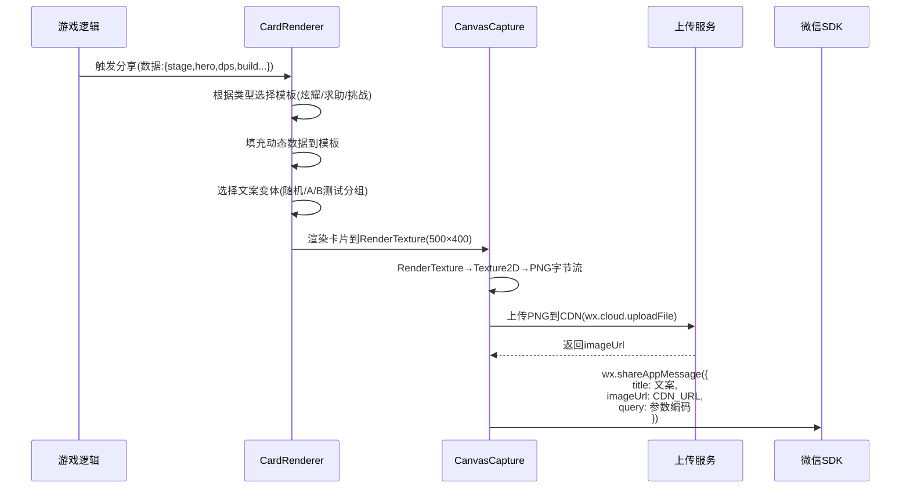

### A5.2 卡片渲染性能优化

| 优化点 | 方案 | 说明 |
|--------|------|------|
| **模板缓存** | 3种基础模板预加载到内存 | 避免每次分享重新创建 |
| **字体图集** | 所有卡片用字共享同一Font Atlas | 减少DrawCall |
| **异步渲染** | 卡片渲染在下一帧完成，不阻塞主线程 | 避免掉帧 |
| **图片压缩** | PNG输出质量80%，最大200KB | 微信分享图片限制 |
| **超模截图** | 高光时刻自动截屏缓存，分享时直接使用 | 不需要实时截图 |

### A5.3 wx.shareAppMessage query参数设计

```json
{
    "from": "share",                  // 来源标记
    "type": "boast|help|challenge",   // 卡片类型
    "uid": "openid_xiaoming",         // 分享者ID
    "sid": "15-3",                    // 关卡ID
    "data": "dps:12450,stars:3",      // 关键数据(压缩)
    "variant": "A",                   // 文案变体
    "ts": "1711296000",               // 时间戳
    "inv": "INV_CODE_123"             // 邀请码(可选)
}
```

> **注意**：微信query参数总长度限制128字节，需要压缩编码。使用Base64+简写Key。

## A6. 分享卡片CTR优化策略

### A6.1 CTR影响因素与优化方向

| 因素 | 影响权重 | 优化方向 |
|------|---------|---------|
| **标题文案** | 35% | A/B测试4套变体，按7天周期轮换 |
| **卡片图片** | 30% | 保持视觉冲击（大数字/金色/特效），图片清晰不模糊 |
| **社交关系** | 20% | 好友名字+头像前置展示（增强点击意愿） |
| **利益点** | 15% | CTA文案中包含奖励信息（💎30/新手礼包等） |

### A6.2 A/B测试框架

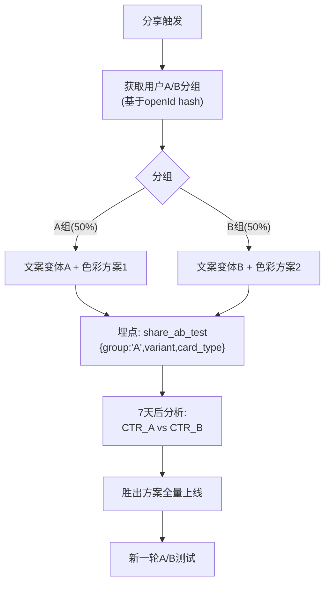

### A6.3 各卡片CTR基线与目标

| 卡片类型 | 初始CTR预估 | 优化目标CTR | 优化手段 |
|---------|------------|-----------|---------|
| 成就炫耀卡 | 12-15% | 18% | 文案A/B + 视觉迭代 |
| SSR英雄卡 | 18-22% | 25% | 英雄立绘吸引力 |
| 超模Build卡 | 15-18% | 22% | 战斗截图震撼度 |
| 援军请求卡 | 20-25% | 28% | 好友名称+互利文案 |
| 求体力卡 | 15-20% | 22% | 简洁+回赠文案 |
| PK挑战卡 | 15-20% | 24% | 挑衅文案+奖励前置 |
| 超越挑衅卡 | 18-22% | 26% | 竞争心理驱动 |

## A7. #11.1 验收自检

| 验收标准 | 要求 | 实际 | 状态 |
|---------|------|------|------|
| ✅ 3套方案各有定位差异 | 炫耀/求助/挑战定位明确 | 炫耀型(3子类)+求助型(2子类)+挑战型(3子类)=8种完整卡片设计 | ✅ |
| 每种卡片有视觉方案 | 有色彩+布局+尺寸 | 每张卡片有完整视觉规范+ASCII布局+色彩方案 | ✅ |
| 每种卡片有文案方案 | 有多套文案变体 | 每张卡片3-4套A/B测试文案变体 | ✅ |
| 预估点击率 | 有CTR预估 | §A6.3 完整CTR基线+优化目标表 | ✅ |
| 技术可实现 | 有技术方案 | §A5 卡片生成流程+性能优化+query参数设计 | ✅ |

---

# Part B：群排行榜和群任务详细设计（#11.2）

## B1. 群社交体系全景

### B1.1 群社交设计目标

| 目标 | 指标 | 说明 |
|------|------|------|
| **群渗透率** | ≥30%活跃用户加入至少1个群 | 通过分享自然关联群 |
| **群活跃率** | ≥40%群成员周活跃 | 排行+任务双驱动 |
| **群拉新** | K因子贡献≥0.20 | L5是最强裂变层 |
| **群留存** | 群用户7日留存≥25% | 高于非群用户的20% |

### B1.2 群社交完整玩法矩阵

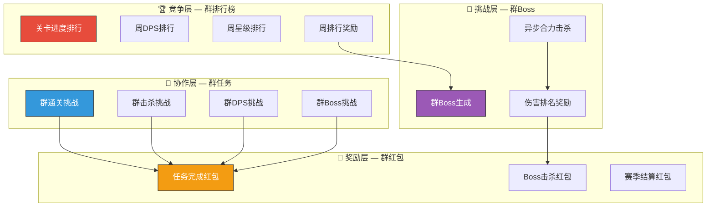

## B2. 群排行榜深度设计

### B2.1 群绑定流程

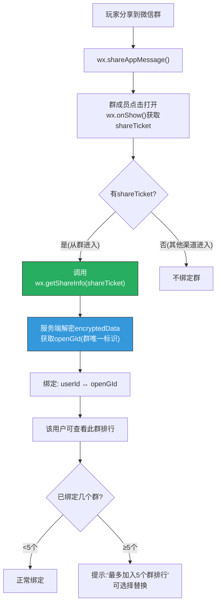

### B2.2 群排行榜UI详细设计

#### 排行榜主界面

```
╔════════════════════════════════════════════╗
║ 📊 排行榜                          [✕]    ║
╠════════════════════════════════════════════╣
║                                            ║
║  ┌──────┐ ┌──────┐ ┌──────┐ ┌──────┐     ║ ← Tab切换
║  │ 好友 │ │ 群1  │ │ 群2  │ │ 全服 │     ║
║  │      │ │ 🔴   │ │      │ │      │     ║    🔴=有新变化
║  └──────┘ └──────┘ └──────┘ └──────┘     ║
║                                            ║
║  「同学群」 周排行 (本周剩余: 3天14小时)    ║ ← 群名+倒计时
║                                            ║
║  排名维度: [进度▼] [DPS] [星级]            ║ ← 维度切换
║                                            ║
║  ┌────────────────────────────────────┐    ║
║  │ 🥇 小明    第22-3关  │ ⬆️+2       │    ║ ← 排名变化指示
║  │    [头像]  DPS: 28,730             │    ║
║  ├────────────────────────────────────┤    ║
║  │ 🥈 小红    第21-1关  │ ⬇️-1       │    ║
║  │    [头像]  DPS: 24,150             │    ║
║  ├────────────────────────────────────┤    ║
║  │ 🥉 大壮    第20-5关  │ ━━ 不变    │    ║
║  │    [头像]  DPS: 21,800             │    ║
║  ├────────────────────────────────────┤    ║
║  │ 4. 小丽    第18-2关  │ ⬆️+3       │    ║
║  │    [头像]  DPS: 15,200             │    ║
║  ├────────────────────────────────────┤    ║
║  │ ...                                │    ║
║  ├────────────────────────────────────┤    ║
║  │ 🔵 你 (第6名) 第15-3关 │ ⬇️-2     │    ║ ← 自己高亮蓝色
║  │    [头像]  DPS: 12,450             │    ║
║  │    「再进1名可拿第5名奖励！」       │    ║ ← 目标激励文案
║  └────────────────────────────────────┘    ║
║                                            ║
║  🏆 本周奖励预览:                          ║
║  🥇💎100+📕×3  🥈💎50+📕×5  🥉💎30+📕×10  ║
║                                            ║
║  ┌──────────────┐ ┌──────────────────┐    ║
║  │ 🎮 去通关     │ │ 📤 分享到群      │    ║ ← 双CTA
║  └──────────────┘ └──────────────────┘    ║
║                                            ║
╚════════════════════════════════════════════╝
```

### B2.3 排名变化通知系统

| 通知类型 | 触发条件 | 表现形式 | 频控 |
|---------|---------|---------|------|
| 被超越通知 | 群内有人超过你 | 游戏内红点+「⚠️ {名字}超越了你！」 | 每日每群最多2条 |
| 排名上升通知 | 你的排名上升 | 结算时「🎉 你在{群名}升到第{N}名！」 | 每次变化 |
| 周结算预告 | 距结算<24小时 | 推送「赛季还有1天结算，你在{群名}第{N}名」 | 仅1次 |
| 新人加入 | 新成员加入群排行 | 「{名字}加入了{群名}排行」 | 实时 |

### B2.4 开放数据域排行榜技术实现

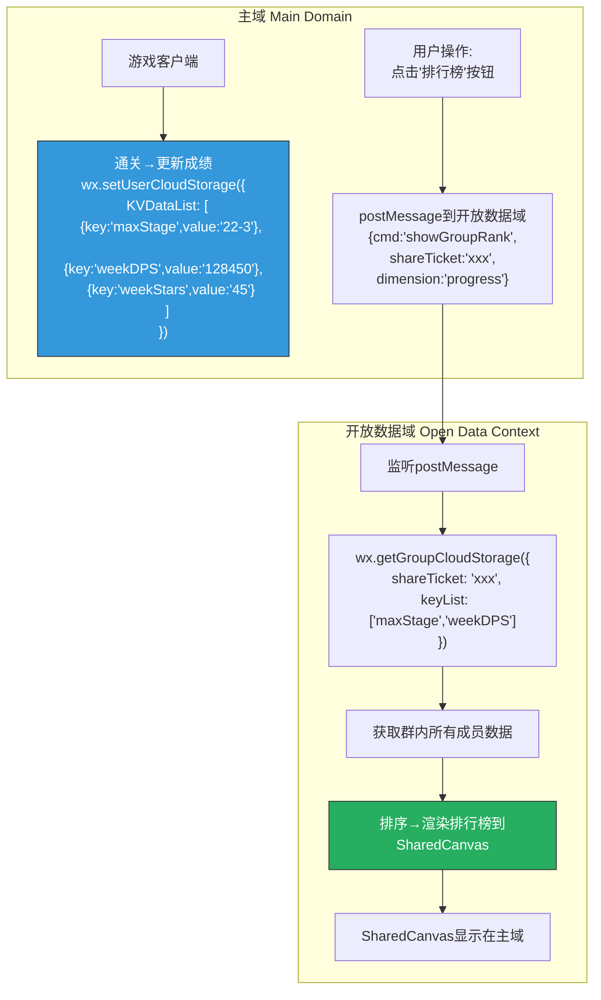

#### 开放数据域渲染注意事项

| 约束 | 说明 | 应对 |
|------|------|------|
| **隔离沙箱** | 开放数据域无法与主域直接通信 | 通过postMessage传递命令 |
| **SharedCanvas** | 开放数据域只能在SharedCanvas上绘制 | 主域用Texture显示SharedCanvas |
| **无DOM** | 开放数据域没有DOM API | 用Canvas 2D API手动绘制UI |
| **性能** | SharedCanvas刷新不能太频繁 | 切换Tab时才刷新，不实时更新 |
| **头像** | 需要下载好友头像 | 批量下载+缓存到本地 |
| **字体** | 需要自带字体文件 | 使用微信默认字体避免加载 |

## B3. 群任务深度设计

### B3.1 群任务生命周期

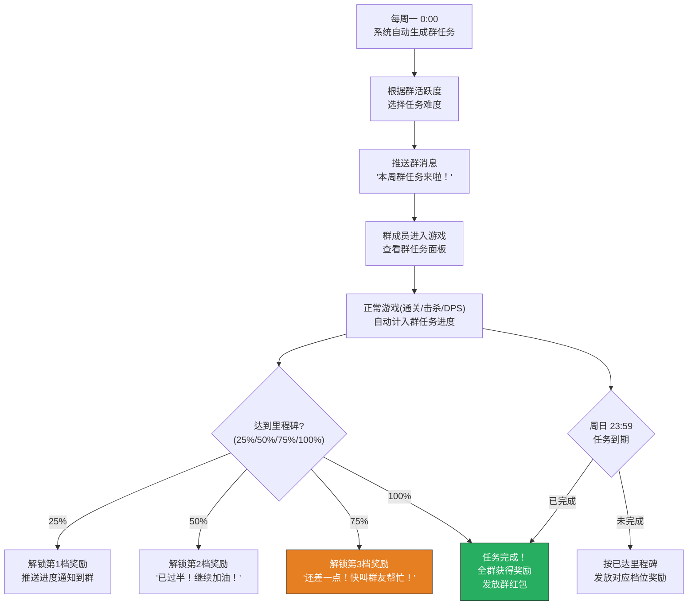

### B3.2 群任务难度自适应

| 群活跃等级 | 定义 | 任务目标倍率 | 奖励倍率 |
|----------|------|-----------|---------|
| 🟢 新群(1-3人) | 群内活跃人数1-3 | 0.5x | 1.0x |
| 🔵 小群(4-8人) | 群内活跃人数4-8 | 1.0x | 1.0x |
| 🟣 中群(9-15人) | 群内活跃人数9-15 | 1.8x | 1.3x |
| 🟡 大群(16+人) | 群内活跃人数16+ | 3.0x | 1.5x |

> **活跃定义**：过去7天内至少登录2次的群成员。

### B3.3 群任务4周轮换表（完整设计）

| 周次 | 任务名 | 目标(基数) | 里程碑奖励(每人) | 完成奖励(每人) |
|------|--------|----------|----------------|--------------|
| W1 | 📋 群通关挑战 | 通关50次 | 25%:⚡20 / 50%:💎20 / 75%:📕小×5 | 💎50+⚡60+📕中×2 |
| W2 | 💀 群击杀挑战 | 击杀5,000怪 | 25%:⚡20 / 50%:💎20 / 75%:📕小×5 | 💎80+📕大×2+🧩×5 |
| W3 | 💥 群DPS挑战 | 累计DPS 100万 | 25%:⚡20 / 50%:💎30 / 75%:📕中×3 | 💎100+🎫×1+📕大×3 |
| W4 | 🐉 群Boss挑战 | 击杀10个Boss | 25%:⚡20 / 50%:💎30 / 75%:🧩×5 | 💎150+🧩×10+🎫×1 |

> 第5周回到W1，但目标增加10%（防止重复无挑战感）。

### B3.4 群任务分享到群的消息设计

```
=== 群任务进度分享消息(微信卡片) ===

┌──────────────────────────────────────┐
│  📋 「同学群」本周群任务              │
│                                      │
│  🎯 群通关挑战: 37/50 (74%)         │
│  ██████████████░░░░░░                │
│                                      │
│  还差13次！再叫2个群友来就够了！      │
│                                      │
│  👉 点击参与，一起领💎50+⚡60        │
└──────────────────────────────────────┘
```

### B3.5 群任务贡献榜UI

```
╔════════════════════════════════════╗
║  📋 群任务 · 贡献榜               ║
╠════════════════════════════════════╣
║                                    ║
║  🏆 本周MVP: 小明 (贡献12次)       ║ ← MVP高亮
║                                    ║
║  ┌────────────────────────────┐    ║
║  │ 🥇 小明  12次  ████████   │    ║ ← 贡献条形图
║  │ 🥈 小红  10次  ███████    │    ║
║  │ 🥉 大壮   8次  █████      │    ║
║  │ 4. 小丽   4次  ██         │    ║
║  │ 5. 你     3次  ██         │    ║ ← 自己高亮
║  │    ↑ 再打2关追上小丽！     │    ║ ← 微竞争文案
║  └────────────────────────────┘    ║
║                                    ║
║  📊 群总进度: 37/50 (74%)          ║
║  ⏰ 剩余: 3天14小时                ║
║                                    ║
║  [🎮 去通关] [📤 催一催群友]       ║
║                                    ║
╚════════════════════════════════════╝
```

## B4. 群Boss深度设计

### B4.1 群Boss属性配置

| Boss | 基础血量 | 防御 | 弱点 | 时限 | 持续 |
|------|---------|------|------|------|------|
| 🐉 炎龙王 | 500万 × 群活跃人数 | 护甲高/魔抗低 | 冰系伤害+50% | 每人每次120秒 | 开启后72小时 |
| 🗿 巨岩守卫 | 600万 × 群活跃人数 | 魔抗高/护甲低 | 物理暴击+30% | 每人每次120秒 | 开启后72小时 |
| 👻 幽灵领主 | 400万 × 群活跃人数 | 均衡 | 真实伤害(毒塔)+40% | 每人每次120秒 | 开启后72小时 |
| 🌊 海妖女王 | 450万 × 群活跃人数 | 物理免疫(P1) / 魔法免疫(P2) | 需要物理+魔法配合 | 每人每次150秒 | 开启后72小时 |

> 4个Boss每月轮换，每周1个。

### B4.2 群Boss战斗界面

```
╔════════════════════════════════════════════╗
║  🐉 群Boss: 炎龙王                        ║
║  ❤️ 3,250,000 / 5,000,000  (65%)          ║ ← Boss血条
║  ████████████████░░░░░░░░░░               ║
║  ⏰ 剩余时间: 1天18小时                    ║
║                                            ║
║  ┌────────────────────────────────────┐    ║ ← 战斗区域
║  │                                    │    ║
║  │       [Boss战斗画面]               │    ║    正常塔防玩法
║  │       Boss在固定位置               │    ║    但Boss不移动
║  │       塔围绕Boss攻击               │    ║    纯DPS竞赛
║  │                                    │    ║
║  └────────────────────────────────────┘    ║
║                                            ║
║  💥 本次伤害: 125,000                      ║ ← 实时伤害统计
║  🏆 我的累计: 380,000 (排名第3)            ║
║  ⚡ 剩余挑战次数: 2/3                      ║
║                                            ║
║  👥 群内伤害排名:                           ║
║  🥇小明: 520,000  🥈小红: 410,000         ║
║  🥉你: 380,000    4.大壮: 290,000         ║
║                                            ║
║  [🔄 再打一次] [📤 分享到群求支援]         ║
║                                            ║
╚════════════════════════════════════════════╝
```

### B4.3 群Boss击杀后流程

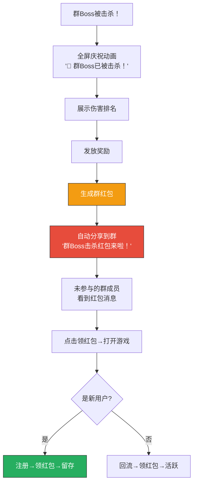

## B5. 群红包深度设计

### B5.1 红包生成规则

| 维度 | 规则 | 说明 |
|------|------|------|
| **份数** | 群活跃人数 × 80% (向上取整, 最少3份) | 制造抢红包紧迫感 |
| **总价值** | 基础💎50 + 群活跃人数 × 💎10 | 大群红包更丰厚 |
| **单份范围** | 💎5 ~ 💎50 (随机分配) | 手气最佳有展示 |
| **附带道具** | 30%概率附带随机道具(📕/⚡/🧩) | 增加惊喜感 |
| **领取时限** | 24小时 | 过期销毁 |
| **手气最佳** | 获得最多💎的人 | 群消息中展示 |

### B5.2 红包群消息设计

```
=== 红包到达消息 ===
┌──────────────────────────────────────┐
│  🧧 群Boss红包来啦！                 │
│                                      │
│  「同学群」齐心协力击杀了🐉炎龙王！  │
│  共8份红包，手快有手慢无！            │
│                                      │
│  👉 点击拆红包                       │
└──────────────────────────────────────┘

=== 红包领取后消息 ===
┌──────────────────────────────────────┐
│  🧧 你拆到了 💎28！                  │
│                                      │
│  🏆 手气最佳: 小明 💎50             │
│  已领: 6/8份                         │
│                                      │
│  小明💎50 小红💎15 你💎28            │
│  大壮💎12 小丽💎22 阿杰💎8          │
│                                      │
│  📦 还剩2份，快叫群友来抢！          │
└──────────────────────────────────────┘
```

## B6. #11.2 验收自检

| 验收标准 | 要求 | 实际 | 状态 |
|---------|------|------|------|
| ✅ 完整的群社交玩法流程 | 群排行+群任务有完整流程 | 群绑定→排行榜→任务→Boss→红包完整闭环 | ✅ |
| 群排行榜详细设计 | UI+技术方案 | §B2 完整UI+开放数据域技术方案+通知系统 | ✅ |
| 群任务详细设计 | 任务类型+奖励+难度 | §B3 4周轮换+自适应难度+4档里程碑+贡献榜 | ✅ |
| 群Boss详细设计 | 属性+战斗+奖励 | §B4 4种Boss+战斗UI+击杀流程 | ✅ |
| 群红包详细设计 | 规则+消息 | §B5 生成规则+群消息设计 | ✅ |
| 如何让玩家主动拉群 | 有拉群激励 | 群任务需≥3人+群排行奖励+群红包吸引 | ✅ |

---

# Part C：好友PK/好友围观详细设计（#11.3）

## C1. PK系统全景架构

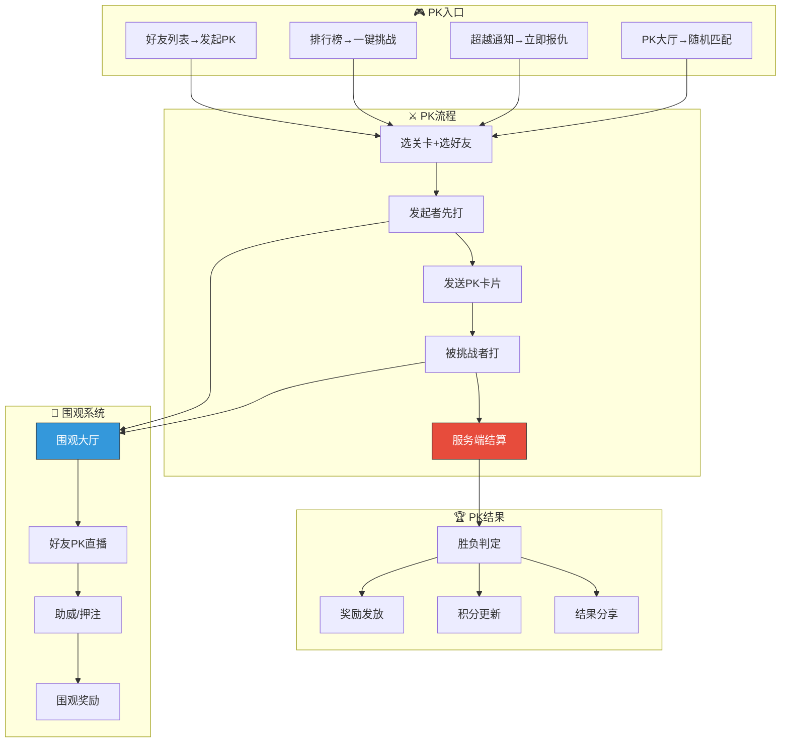

## C2. PK全流程详细设计

### C2.1 PK发起流程

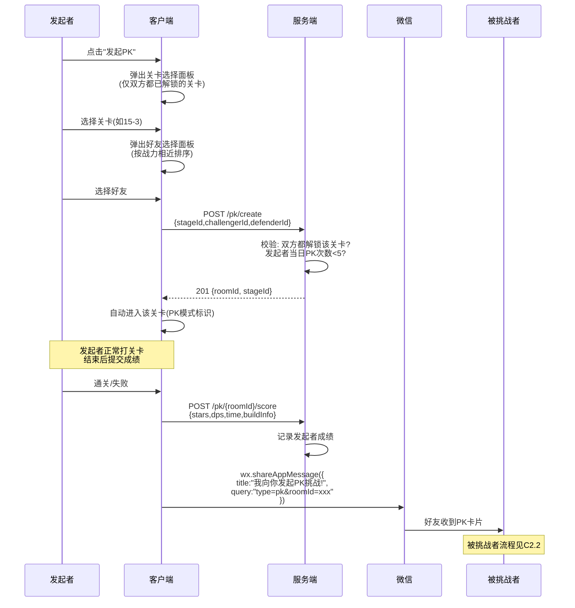

### C2.2 PK应战流程

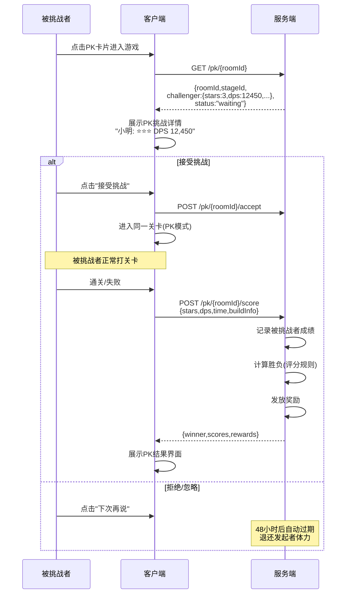

### C2.3 PK评分算法详细设计

```
总分 = 星级分(40%) + DPS分(30%) + 时间分(20%) + Build分(10%)

=== 星级分(满分100) ===
3星 = 100分
2星 = 60分
1星 = 30分
未通关 = 0分

=== DPS分(满分100) ===
if 双方DPS > 0:
    DPS分 = (我的DPS / max(双方DPS)) × 100
else:
    DPS分 = 0

=== 时间分(满分100) ===
if 双方都通关:
    时间分 = (对方时间 / max(双方时间)) × 100  // 越快越高
else if 只有我通关:
    时间分 = 100
else:
    时间分 = 0

=== Build分(满分100) ===
Build评价基于词条搭配合理性:
- 同系Build(如全暴击DPS流): 基础60分 + 词条数量×8分
- 混搭Build(有协同的元素反应): 基础70分 + 协同词条对数×10分
- 杂乱Build(无明显路线): 基础30分 + 词条数量×5分
- 有金色词条: +10分/个

=== 示例 ===
玩家A: ⭐⭐⭐(100×0.4=40) + DPS 12450(100×0.3=30) + 5:32(85×0.2=17) + Build(80×0.1=8) = 95分
玩家B: ⭐⭐(60×0.4=24)   + DPS 9800(78.6×0.3=23.6) + 6:15(100×0.2=20) + Build(65×0.1=6.5) = 74.1分
→ 玩家A胜
```

### C2.4 PK结果界面

```
╔════════════════════════════════════════════╗
║              ⚔️ PK结果 ⚔️                 ║
╠════════════════════════════════════════════╣
║                                            ║
║  ┌──────────┐    VS    ┌──────────┐       ║
║  │ [头像]   │  95:74   │ [头像]   │       ║
║  │  小明    │          │  小红    │       ║
║  │  🏆 WIN  │          │  LOSE   │       ║
║  └──────────┘          └──────────┘       ║
║                                            ║
║  ┌─────── 详细对比 ─────────────────┐     ║
║  │ 维度     小明(A)      小红(B)    │     ║
║  │ ⭐星级   ⭐⭐⭐(40)   ⭐⭐(24)   │     ║ ← 胜出项绿色高亮
║  │ 💥DPS    12,450(30)  9,800(23.6)│     ║
║  │ ⏱️时间   5:32(17)    6:15(20)   │     ║ ← B时间得分更高
║  │ 📜Build  80(8)       65(6.5)    │     ║
║  │ 📊总分   95          74.1       │     ║
║  └──────────────────────────────────┘     ║
║                                            ║
║  🎁 你的奖励:                              ║
║  💎30 + 🏆PK积分×15                       ║
║                                            ║
║  ┌────────────┐ ┌─────────────────┐       ║
║  │ 📤 炫耀分享│ │ ⚔️ 再来一局     │       ║
║  └────────────┘ └─────────────────┘       ║
║                                            ║
╚════════════════════════════════════════════╝
```

## C3. 围观系统详细设计

### C3.1 围观系统概述

| 维度 | 设计 |
|------|------|
| **定位** | 好友间PK时，其他好友可以「围观」，增加社交参与感 |
| **类型** | 异步围观（不是实时直播，而是查看PK状态+结果） |
| **入口** | 好友动态Feed → 「{A}向{B}发起了PK挑战」→ 点击围观 |
| **参与** | 围观者可以为某一方「助威」 |
| **奖励** | 助威正确方获得💎5 |

### C3.2 围观流程

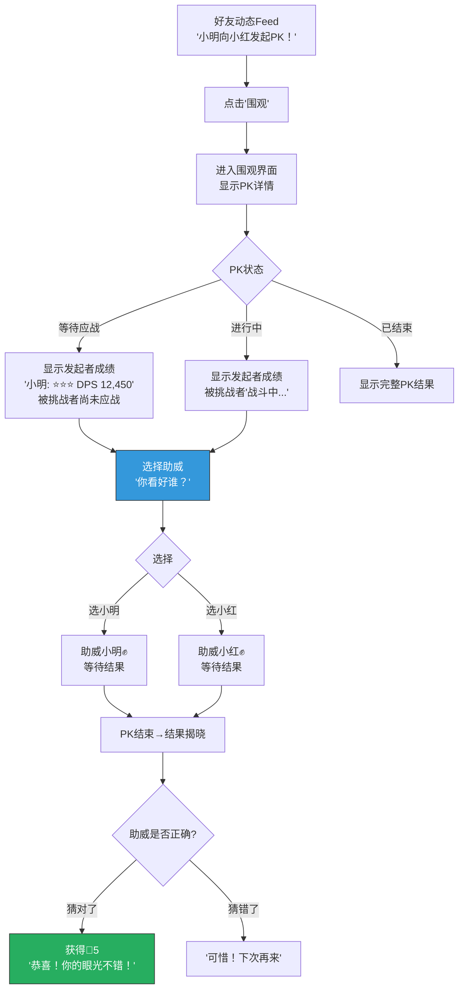

### C3.3 围观界面UI

```
╔════════════════════════════════════════════╗
║  👀 围观: 小明 vs 小红                     ║
╠════════════════════════════════════════════╣
║                                            ║
║  📍 关卡: 第15-3关                         ║
║  ⏰ 状态: 等待小红应战                     ║
║                                            ║
║  ┌──────────────────────────────────┐     ║
║  │ 小明的成绩:                      │     ║
║  │ ⭐⭐⭐ | DPS 12,450 | 5分32秒    │     ║
║  │ Build: 暴击强化×3+末日审判+...   │     ║
║  └──────────────────────────────────┘     ║
║                                            ║
║  ┌──────────────────────────────────┐     ║
║  │ 小红的成绩:                      │     ║
║  │ 🔒 等待应战...                   │     ║
║  └──────────────────────────────────┘     ║
║                                            ║
║  ── 你看好谁？助威可赢💎5 ──              ║
║                                            ║
║  [✊ 助威小明 (3人已选)]                   ║ ← 已选人数
║  [✊ 助威小红 (1人已选)]                   ║
║                                            ║
║  👥 围观中: 小丽、大壮、阿杰 等4人        ║
║                                            ║
╚════════════════════════════════════════════╝
```

### C3.4 好友动态Feed系统

| 动态类型 | 触发条件 | Feed文案 | 可操作 |
|---------|---------|---------|--------|
| PK发起 | 好友发起PK | 「{A}向{B}发起了PK挑战！」 | 围观/助威 |
| PK结果 | PK结束 | 「{A}在PK中击败了{B}！」 | 查看详情/发起PK |
| 排名超越 | 超越好友 | 「{A}超越了{B}在第15关的记录！」 | 查看/挑战 |
| 成就达成 | 完成稀有成就 | 「{A}完成了零伤通关第20关！」 | 查看/点赞 |
| 新英雄 | 获得SSR英雄 | 「{A}获得了SSR天选者！」 | 查看/点赞 |

#### 动态Feed界面

```
╔════════════════════════════════════════════╗
║  📰 好友动态                               ║
╠════════════════════════════════════════════╣
║                                            ║
║  ┌──────────────────────────────────┐     ║
║  │ [头像] 小明 · 5分钟前            │     ║
║  │ ⚔️ 向小红发起了PK挑战！          │     ║
║  │ 📍 第15-3关                      │     ║
║  │ [👀 围观] [✊ 助威]              │     ║
║  │ 👁️ 4人围观  💬 2                 │     ║
║  └──────────────────────────────────┘     ║
║                                            ║
║  ┌──────────────────────────────────┐     ║
║  │ [头像] 小红 · 30分钟前           │     ║
║  │ 🏆 在PK中击败了大壮！            │     ║
║  │ 95 : 74 (第12-2关)               │     ║
║  │ [📊 查看详情] [⚔️ 我也要PK]     │     ║
║  │ 👍 6  💬 3                       │     ║
║  └──────────────────────────────────┘     ║
║                                            ║
║  ┌──────────────────────────────────┐     ║
║  │ [头像] 大壮 · 1小时前            │     ║
║  │ 🌟 获得了SSR英雄「天选者」！     │     ║
║  │ [👍 点赞] [💬 评论]              │     ║
║  │ 👍 12  💬 5                      │     ║
║  └──────────────────────────────────┘     ║
║                                            ║
╚════════════════════════════════════════════╝
```

## C4. PK分享链路设计

### C4.1 完整PK分享闭环

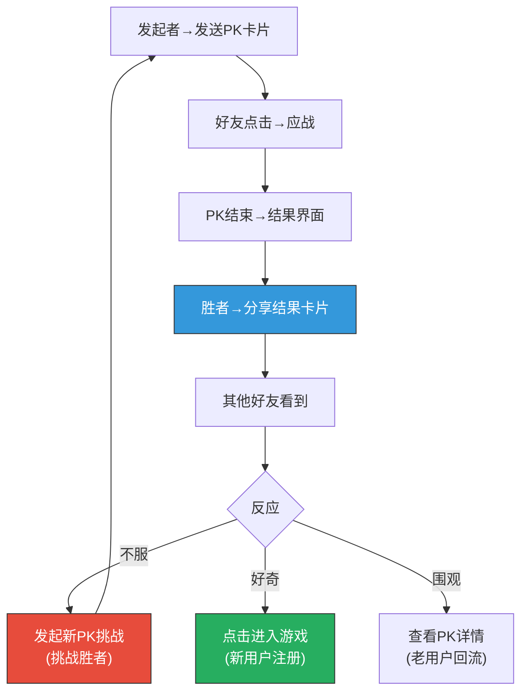

### C4.2 PK结果分享卡片

```
┌──────────── ⚔️ PK结果 ⚔️ ──────────────┐
│                                           │
│  [头像A] 小明  95 : 74  小红 [头像B]     │
│          🏆 WIN         LOSE              │
│                                           │
│  📍 第15-3关                              │
│  💥 DPS: 12,450 vs 9,800                 │
│  ⭐ 星级: ⭐⭐⭐ vs ⭐⭐                    │
│                                           │
│  💬 "碾压了！谁来挑战我？😎"              │
│                                           │
│  👉 点击发起PK，赢💎30！                  │
│                                           │
└───────────────────────────────────────────┘
```

## C5. PK赛季系统

### C5.1 PK段位设计

| 段位 | PK积分 | 段位图标 | 奖励加成 |
|------|--------|---------|---------|
| 🟤 青铜 | 0-99 | 铜盾 | 无 |
| ⚪ 白银 | 100-299 | 银盾 | PK奖励+10% |
| 🟡 黄金 | 300-599 | 金盾 | PK奖励+20% |
| 🟣 钻石 | 600-999 | 钻石 | PK奖励+30% |
| 🔴 传说 | 1000+ | 传说之翼 | PK奖励+50%+专属头像框 |

### C5.2 PK积分规则

| 场景 | 积分变化 | 说明 |
|------|---------|------|
| PK胜利 | +15 | 基础胜利积分 |
| PK失败 | +5 | 参与即有积分(不扣分) |
| 以弱胜强(对方段位高1级) | +25 | 鼓励挑战强者 |
| 以弱胜强(对方段位高2级+) | +35 | 大幅奖励 |
| 连胜3场 | 额外+10 | 连胜加成 |
| 连胜5场 | 额外+20 | — |
| 围观助威正确 | +2 | 围观也有积分 |

### C5.3 赛季PK排行榜奖励

| 排名 | 奖励 | 说明 |
|------|------|------|
| 总分前1% | 💎1,000 + 🏷️「PK至尊」称号 + 专属头像框 | 顶级荣誉 |
| 前5% | 💎500 + 🏷️「PK之王」称号 | — |
| 前10% | 💎300 + 🧩SSR碎片×5 | — |
| 前30% | 💎200 + 🧩通用碎片×20 | — |
| 前50% | 💎100 | — |
| 参与奖(≥10场) | 💎50 | 最低参与门槛 |

## C6. #11.3 验收自检

| 验收标准 | 要求 | 实际 | 状态 |
|---------|------|------|------|
| ✅ PK流程完整 | 发起→应战→结算完整 | §C2 完整时序图：发起→关卡选择→打关→发卡→应战→结算→奖励 | ✅ |
| ✅ 分享链路清晰 | PK各环节的分享路径 | §C4 PK分享闭环：发起卡→结果卡→引发新PK/新用户注册 | ✅ |
| 异步PK攻防 | 不需同时在线 | §C2.1/C2.2 发起者先打→发卡→48小时内应战 | ✅ |
| 观战助威 | 围观系统设计 | §C3 围观流程+界面+助威机制+💎5奖励 | ✅ |
| PK结果分享 | 结果卡片设计 | §C4.2 PK结果卡片+文案变体 | ✅ |
| PK排行/段位 | 竞争体系 | §C5 5段位+积分规则+赛季排行奖励 | ✅ |
| 好友动态Feed | 社交信息流 | §C3.4 5种动态类型+Feed界面设计 | ✅ |

---

# Part D：分享落地页转化优化详细设计（#11.4）

## D1. 落地页设计目标

| 指标 | 当前预估 | 优化目标 | 提升空间 |
|------|---------|---------|---------|
| 分享CTR | 12% | 18% | +50% |
| 加载完成率 | 90% | 95% | +5.6% |
| 授权率 | 75% | 85% | +13.3% |
| 完成首关率 | 70% | 80% | +14.3% |
| D1留存(裂变) | 45% | 50% | +11.1% |
| **综合转化率** | **2.55%** | **5.0%** | **+96%** |

## D2. 30秒转化漏斗详细设计

### D2.1 四种场景的落地页流程

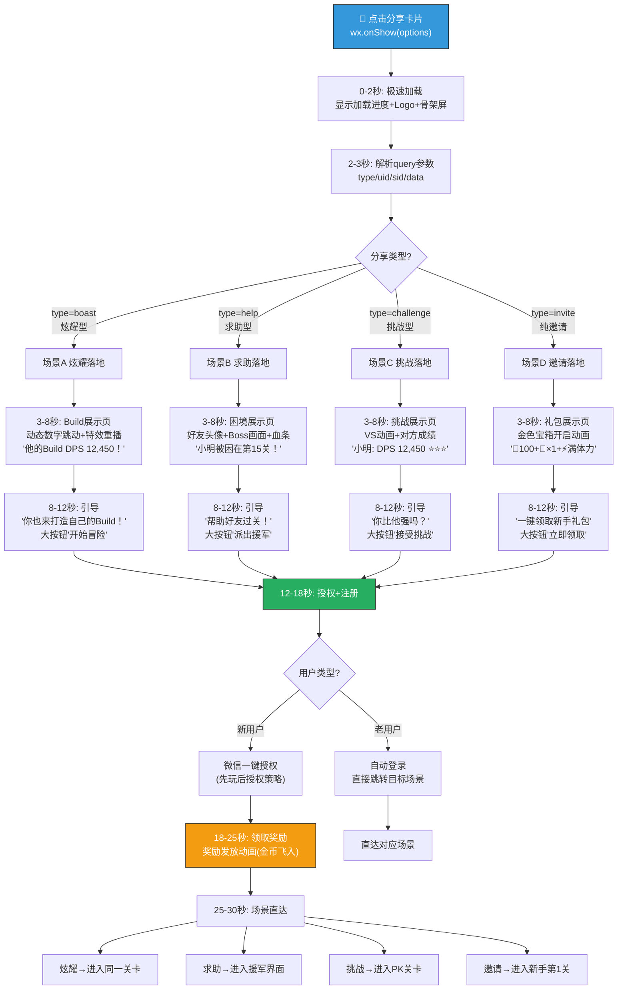

### D2.2 场景A — 炫耀型落地页UI详细设计

```
╔════════════════════════════════════════════╗
║           🏰 AetheraSurvivors              ║
╠════════════════════════════════════════════╣
║                                            ║
║  [好友头像] 小明 的 Build                  ║
║                                            ║
║  ╔══════════════════════════════════╗      ║ ← Build可视化区域
║  ║                                  ║      ║
║  ║  ⭐⭐⭐ 完美通关 第15-3关        ║      ║
║  ║                                  ║      ║
║  ║  💥 DPS                         ║      ║
║  ║  ╔═════════════════╗            ║      ║ ← 数字跳动动画
║  ║  ║    12,450       ║            ║      ║    从0跳到最终值
║  ║  ╚═════════════════╝            ║      ║    1.5秒内完成
║  ║                                  ║      ║
║  ║  📜 Build词条:                   ║      ║
║  ║  🔴 暴击强化×3                   ║      ║ ← 词条依次淡入
║  ║  🟡 末日审判                     ║      ║    每个间隔0.3秒
║  ║  🔴 连锁闪电                     ║      ║
║  ║  🔵 冰冻之触                     ║      ║
║  ║                                  ║      ║
║  ╚══════════════════════════════════╝      ║
║                                            ║
║  "你也来打造自己的超模Build！"             ║ ← 引导文案
║                                            ║
║  ╭────────────────────────────────────╮    ║ ← CTA按钮(大号，底部固定)
║  │      🎮 开始冒险 — 领💎100       │    ║    44px高度，橙色渐变
║  ╰────────────────────────────────────╯    ║    含奖励利益点
║                                            ║
║  已有 12,450 人在玩                        ║ ← 社交证明
║  你的好友 小明、小红 也在玩                 ║
║                                            ║
╚════════════════════════════════════════════╝
```

### D2.3 场景B — 求助型落地页UI

```
╔════════════════════════════════════════════╗
║           🏰 AetheraSurvivors              ║
╠════════════════════════════════════════════╣
║                                            ║
║  🆘 你的好友需要帮助！                     ║
║                                            ║
║  ┌──────────────────────────────────┐     ║
║  │ [小明头像]                       │     ║
║  │ 小明 在第15关被🐉火龙Boss困住了！│     ║
║  └──────────────────────────────────┘     ║
║                                            ║
║  ╔══════════════════════════════════╗      ║ ← Boss画面(简化版)
║  ║  [Boss图片占位]                  ║      ║
║  ║  🐉 火龙Boss                     ║      ║
║  ║  ❤️ ████░░░░░░ Boss还剩80%血    ║      ║ ← Boss血条(还很多)
║  ║  ❤️ ██░░░░░░░░ 基地只剩20%血    ║      ║ ← 基地血条(很少)
║  ╚══════════════════════════════════╝      ║
║                                            ║
║  🗼 他需要你的强力防塔援助！               ║
║                                            ║
║  🎁 帮助好友你将获得:                      ║
║     💎10 + 📕经验书×2                     ║ ← 利益前置
║                                            ║
║  ╭────────────────────────────────────╮    ║
║  │    🤝 派出援军 — 帮助小明过关！   │    ║ ← CTA
║  ╰────────────────────────────────────╯    ║
║                                            ║
╚════════════════════════════════════════════╝
```

### D2.4 场景C — 挑战型落地页UI

```
╔════════════════════════════════════════════╗
║           🏰 AetheraSurvivors              ║
╠════════════════════════════════════════════╣
║                                            ║
║  ⚔️ 好友向你发起挑战！                     ║
║                                            ║
║  ┌──────────┐    ⚔️     ┌──────────┐      ║ ← VS动画(头像从两侧飞入)
║  │ [小明]   │    VS     │ [你]     │      ║
║  │ Lv.42   │           │  ???    │      ║
║  └──────────┘           └──────────┘      ║
║                                            ║
║  📍 关卡: 第15-3关                         ║
║  💪 小明的成绩:                            ║
║     ⭐⭐⭐ | DPS 12,450 | 5分32秒          ║
║                                            ║
║  💬 "我零伤过了，你行吗？😏"              ║ ← 挑衅文案
║                                            ║
║  🎁 参与奖💎10 | 赢了💎30！               ║ ← 利益点
║                                            ║
║  ╭────────────────────────────────────╮    ║
║  │    ⚔️ 接受挑战！打败他！          │    ║ ← CTA
║  ╰────────────────────────────────────╯    ║
║                                            ║
║  已有 87人 参与过PK                        ║ ← 社交证明
║                                            ║
╚════════════════════════════════════════════╝
```

### D2.5 场景D — 邀请型落地页UI

```
╔════════════════════════════════════════════╗
║           🏰 AetheraSurvivors              ║
╠════════════════════════════════════════════╣
║                                            ║
║  🎁 新手专属礼包等你来拿！                 ║
║                                            ║
║  ╔══════════════════════════════════╗      ║ ← 宝箱开启动画
║  ║     [金色宝箱图]                 ║      ║    宝箱从关闭→打开
║  ║                                  ║      ║    奖励飞出
║  ║  💎100  🎫×1  ⚡满体力           ║      ║ ← 3个奖励图标依次弹出
║  ╚══════════════════════════════════╝      ║
║                                            ║
║  [小明头像] 小明 邀请你一起玩！            ║ ← 邀请者信息
║  他已经通关22章，等你来挑战！              ║
║                                            ║
║  ┌─ 游戏亮点 ─────────────────────┐       ║ ← 快速卖点
║  │ 🏰 经典塔防 × Roguelike Build  │       ║
║  │ 🎲 每局随机词条，每次都不一样    │       ║
║  │ 💥 超模时刻，伤害数字爆炸！      │       ║
║  │ ⚔️ 和好友PK，看谁更强！         │       ║
║  └────────────────────────────────┘       ║
║                                            ║
║  ╭────────────────────────────────────╮    ║
║  │   🎁 一键领取礼包 — 立即开玩！   │    ║ ← CTA
║  ╰────────────────────────────────────╯    ║
║                                            ║
║  已有 25,000+ 玩家在玩                     ║
║                                            ║
╚════════════════════════════════════════════╝
```

## D3. 先玩后授权策略

### D3.1 授权时机优化

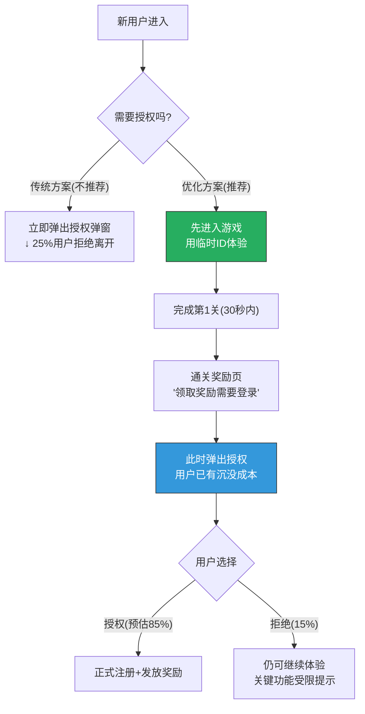

### D3.2 各触发场景的授权时机

| 落地类型 | 授权时机 | 说明 |
|---------|---------|------|
| 炫耀型 | 完成第1关后 | 先让玩家体验Build机制 |
| 求助型 | 点击「派出援军」时 | 援军功能需要好友关系 |
| 挑战型 | 点击「接受挑战」时 | PK需要登录记录成绩 |
| 邀请型 | 点击「领取礼包」时 | 礼包需要绑定账号 |

## D4. 场景直达技术方案

### D4.1 DeepLink路由表

```json
{
    "routes": {
        "boast": {
            "new_user": "/tutorial/stage1",
            "old_user": "/stage/{stageId}"
        },
        "help": {
            "new_user": "/tutorial/stage1",
            "old_user": "/social/assist/{requestId}"
        },
        "challenge": {
            "new_user": "/tutorial/stage1",
            "old_user": "/pk/{roomId}"
        },
        "invite": {
            "new_user": "/tutorial/stage1",
            "old_user": "/home"
        }
    }
}
```

### D4.2 路由解析流程

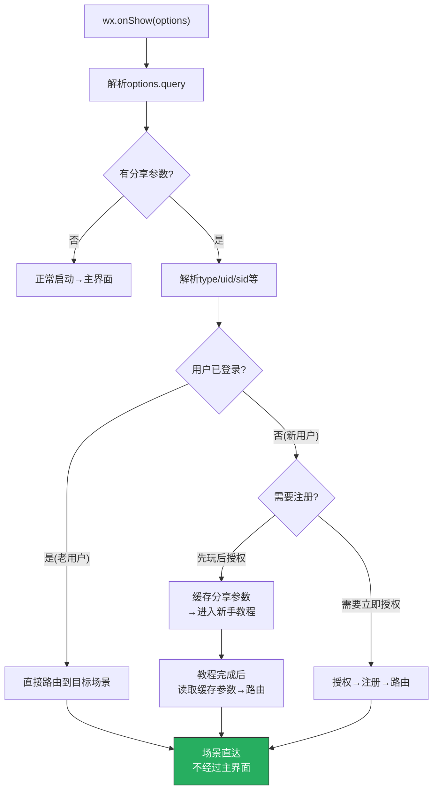

## D5. 加载优化策略

### D5.1 首屏加载优化

| 优化项 | 方案 | 效果 |
|--------|------|------|
| **骨架屏** | 加载时显示UI骨架+Logo | 感知加载更快 |
| **首屏资源** | 落地页资源独立打包<500KB | 3秒内可交互 |
| **预加载** | 展示落地页同时后台加载游戏资源 | 无缝衔接 |
| **CDN加速** | 静态资源使用微信CDN | 减少网络延迟 |
| **WASM分包** | 核心WASM<2MB先加载，其余延迟加载 | 首屏快速 |
| **进度动画** | 加载进度条+有趣文案轮播 | 减少等待焦虑 |

### D5.2 加载过程文案

| 进度 | 文案 | 说明 |
|------|------|------|
| 0-20% | 「正在召唤英雄...」 | — |
| 20-50% | 「正在加载怪物...」 | — |
| 50-80% | 「正在锻造词条...」 | 贴合游戏主题 |
| 80-100% | 「准备开战！」 | — |

## D6. A/B测试框架

### D6.1 落地页A/B测试计划

| 测试编号 | 测试变量 | A组 | B组 | 成功指标 | 测试周期 |
|---------|---------|-----|-----|---------|---------|
| AB-LP-01 | CTA按钮文案 | 「开始冒险」 | 「立即领取💎100」 | CTA点击率 | 7天 |
| AB-LP-02 | 授权时机 | 先授权后玩 | 先玩后授权 | 授权率+D1留存 | 14天 |
| AB-LP-03 | 落地页背景 | 暗色背景 | 亮色背景 | 停留时长+转化 | 7天 |
| AB-LP-04 | 社交证明 | 显示「已有N人在玩」 | 不显示 | 转化率 | 7天 |
| AB-LP-05 | 奖励展示 | 数字+图标 | 宝箱开启动画 | 新手礼包领取率 | 7天 |
| AB-LP-06 | 加载进度 | 纯进度条 | 进度条+游戏tips | 加载流失率 | 7天 |

### D6.2 A/B测试技术实现

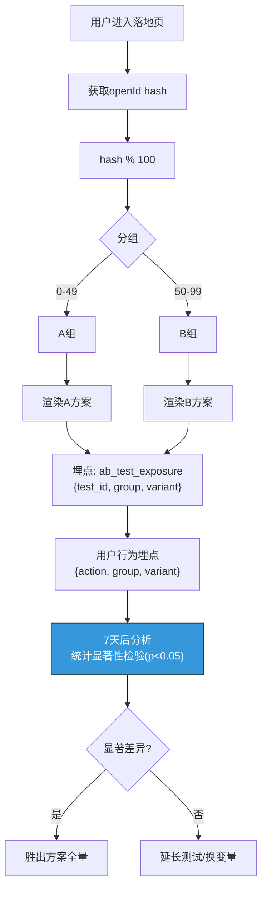

## D7. 新用户首体验优化

### D7.1 裂变新用户 vs 自然新用户的差异化首体验

| 维度 | 自然新用户 | 裂变新用户 |
|------|----------|----------|
| **首屏** | 品牌Logo+开场CG | 好友信息+分享场景直达 |
| **教程** | 完整3关教程 | 精简1关教程(裂变用户更有目的性) |
| **首次奖励** | 标准新手奖励 | 标准+额外邀请礼包 |
| **社交引导** | 第5关后引导 | 立即展示好友列表(已有1个好友) |
| **难度** | 标准 | 略微降低(确保首关必过) |

### D7.2 裂变新用户前5分钟时序

```
时间    行为                             系统反馈
──────  ─────────────────────────────   ──────────────
0:00    点击分享卡片进入                  骨架屏+加载
0:03    加载完成→落地页                  展示分享场景内容
0:08    点击CTA(开始冒险/接受挑战等)      转场动画
0:12    微信授权弹窗(如需要)              一键授权
0:15    进入游戏→精简教程(只教放塔)       「拖拽箭塔到这里」
0:30    第1关开始→第1波怪物               自动触发，不需要点开始
0:45    放1个塔→看到怪物被消灭            伤害飘字+金币掉落
1:00    第1关通关                          🎉通关动画+奖励发放
1:05    领取奖励(邀请礼包一起发)          💎100+🎫×1+⚡满体力
1:10    展示好友信息                      「你的好友小明也在玩！」
1:30    根据分享类型路由                  炫耀→打同关/求助→援军/PK→对战
2:00    进入主线关卡第2关(含词条教学)      第1次词条选择(2选1)
3:00    第2关通关→第3关                   渐入正常节奏
5:00    完成前3关→解锁更多功能            社交入口/好友列表/排行榜
```

## D8. 转化漏斗监控

### D8.1 漏斗埋点事件

| 漏斗步骤 | 事件名 | 参数 |
|---------|--------|------|
| 分享展示 | `share_impression` | `{share_id, type, channel}` |
| 点击进入 | `share_click` | `{share_id, source_user}` |
| 加载完成 | `landing_loaded` | `{load_time, share_type}` |
| 落地页展示 | `landing_show` | `{page_type, variant}` |
| CTA点击 | `landing_cta_click` | `{cta_text, share_type}` |
| 授权成功 | `auth_success` | `{auth_time, share_type}` |
| 奖励领取 | `reward_claimed` | `{reward_type, share_type}` |
| 完成首关 | `first_stage_clear` | `{clear_time, share_type}` |
| D1留存 | `d1_retention` | `{source: 'viral', share_type}` |
| D7留存 | `d7_retention` | `{source: 'viral', share_type}` |

### D8.2 转化漏斗仪表盘

```
╔════════════════════════════════════════════════════╗
║          📊 落地页转化漏斗 (今日)                  ║
╠════════════════════════════════════════════════════╣
║                                                    ║
║  分享展示  ████████████████████████  10,000 (100%) ║
║      ↓ CTR: 14.2%                                 ║
║  点击进入  ███████████░░░░░░░░░░░░   1,420 (14.2%)║
║      ↓ 加载: 94.5%                                ║
║  加载完成  ██████████░░░░░░░░░░░░░   1,342 (13.4%)║
║      ↓ CTA: 82.3%                                 ║
║  CTA点击   █████████░░░░░░░░░░░░░░   1,105 (11.1%)║
║      ↓ 授权: 83.7%                                ║
║  授权成功  ████████░░░░░░░░░░░░░░░     925 (9.3%) ║
║      ↓ 首关: 78.2%                                ║
║  完成首关  ██████░░░░░░░░░░░░░░░░░     723 (7.2%) ║
║      ↓ D1留存: 47.3%                              ║
║  D1留存    ████░░░░░░░░░░░░░░░░░░░     342 (3.4%) ║
║                                                    ║
║  📊 分场景转化率:                                  ║
║  炫耀型: 2.8% | 求助型: 4.2% | 挑战型: 3.8%      ║
║  邀请型: 2.5%                                      ║
║                                                    ║
║  ⚠️ 瓶颈: 加载→CTA环节流失17.7%                  ║
║  💡 建议: 优化落地页CTA视觉/文案                   ║
║                                                    ║
╚════════════════════════════════════════════════════╝
```

### D8.3 漏斗告警规则

| 环节 | 正常值 | 黄色告警 | 红色告警 | 应对 |
|------|--------|---------|---------|------|
| 分享CTR | 12-18% | <10% | <7% | 更换卡片设计/文案 |
| 加载完成率 | 92-96% | <90% | <85% | 检查包体大小/CDN |
| CTA点击率 | 78-85% | <75% | <70% | 优化落地页设计 |
| 授权率 | 80-88% | <78% | <72% | 优化授权时机/文案 |
| 首关完成率 | 75-85% | <72% | <65% | 降低首关难度 |
| D1留存 | 43-52% | <40% | <35% | 优化新用户首体验 |

## D9. #11.4 验收自检

| 验收标准 | 要求 | 实际 | 状态 |
|---------|------|------|------|
| ✅ 完整的30秒转化漏斗设计 | 4种场景各有30秒漏斗 | §D2 四种场景(炫耀/求助/挑战/邀请)完整30秒时序+UI | ✅ |
| 每种场景有落地页UI | 有详细UI设计 | §D2.2-D2.5 四种落地页完整ASCII UI设计 | ✅ |
| 先玩后授权策略 | 有授权优化 | §D3 先玩后授权流程+各场景授权时机 | ✅ |
| 场景直达方案 | 有DeepLink | §D4 路由表+路由解析流程 | ✅ |
| 加载优化 | 有加载方案 | §D5 首屏<500KB+骨架屏+预加载+CDN | ✅ |
| A/B测试框架 | 有测试计划 | §D6 6项A/B测试+技术实现方案 | ✅ |
| 漏斗监控 | 有监控方案 | §D8 完整埋点+仪表盘+告警规则 | ✅ |

---

# 总验收自检

| 子条 | 验收标准 | 状态 | 核心产出 |
|------|---------|------|---------|
| **#11.1** | 3套方案各有定位差异 | ✅ | 3套×8种卡片: 视觉规范+色彩方案+文案变体+CTR预估+A/B框架 |
| **#11.2** | 完整的群社交玩法流程 | ✅ | 群绑定→排行榜(3维度)→任务(4周轮换+自适应)→Boss(4种+战斗UI)→红包 |
| **#11.3** | PK流程完整，分享链路清晰 | ✅ | PK全流程时序→围观/助威→好友动态Feed→段位/赛季→分享闭环 |
| **#11.4** | 完整的30秒转化漏斗设计 | ✅ | 4场景落地页UI→先玩后授权→场景直达→A/B测试→漏斗监控告警 |

---

## 附录：设计变更日志

| 日期 | 变更 | 原因 |
|------|------|------|
| v1.0 | 初始#11.1-11.4子系统详细设计 | 阶段一 #11.1-11.4 |

---

> 📝 **文档维护规则**：
> 1. 本文档是「社交裂变系统设计.md」的深化子文档
> 2. 卡片视觉规范需配合美术团队细化为正式稿
> 3. A/B测试计划在上线后按计划执行
> 4. 转化漏斗数据需要上线后实测校准
> 5. 群Boss属性需要配合数值表(#18)校准
> 6. PK评分算法需要上线后根据实际数据调整权重
