
# 🌐 AetheraSurvivors — 社交裂变系统设计

> **文档版本**：v1.0
> **最后更新**：2026-03-24
> **交互编号**：阶段一 #11
> **前置依赖**：GDD.md（v1.0 §九）、付费系统与商业化方案.md（v1.0）、经济系统设计.md（v1.0）
> **验收标准**：✅ 裂变路径图 + ✅ 每个裂变点有预估K因子

---

## 一、社交裂变战略定位

### 1.1 为什么社交裂变是生命线？

```
╔═══════════════════════════════════════════════════════════╗
║              微信小游戏获客成本 vs 裂变价值               ║
╠═══════════════════════════════════════════════════════════╣
║                                                           ║
║  💰 买量获客:                                             ║
║     CPA = ¥5-8/用户                                      ║
║     DAU 25,000 需月投 ¥450,000+                          ║
║     ROI D45-D120 才回本                                   ║
║                                                           ║
║  🌱 裂变获客:                                             ║
║     CPA = ¥0（天然免费流量）                               ║
║     K因子 0.3 → 每10个用户自带3个新用户                   ║
║     等效于每月节省 ¥135,000 买量成本                       ║
║                                                           ║
║  📊 目标:                                                 ║
║     K因子 ≥ 0.3（综合）                                   ║
║     自然量占比 ≥ 30%                                      ║
║     裂变用户次留 ≥ 45%（高于买量用户的40%）               ║
║                                                           ║
╚═══════════════════════════════════════════════════════════╝
```

### 1.2 核心设计哲学

| 原则 | 说明 | 反例（不做） |
|------|------|------------|
| **分享=炫耀，不是骚扰** | 每次分享内容都让分享者有面子 | 强制分享才能领奖 |
| **被分享者有即时价值** | 点开分享卡片有明确利益（不是空白页） | 点开只有下载引导 |
| **社交=互利，不是单向** | 好友助战双方都有奖励 | 只有邀请者有奖 |
| **贴合微信原生体验** | 使用微信原生分享/群/好友能力 | 自建IM/社交系统 |
| **不触碰微信红线** | 不诱导分享（「分享到3个群领奖」） | 强制转发领奖 |

### 1.3 与前置文档的关系

| 维度 | GDD §九（骨架） | 本文档（#11详细设计） |
|------|---------------|---------------------|
| 五层裂变模型 | ✅ 概念定义+K因子范围 | 深化：每层完整交互流程+UI+数据追踪 |
| 好友援军 | ✅ 一句话描述 | 深化：完整机制+奖励+频次+技术方案 |
| 好友PK | ✅ 一句话描述 | 深化：异步PK流程+匹配+排名 |
| 群排行/群任务 | ✅ 一句话描述 | 深化：群玩法+参与激励+反作弊 |
| 分享卡片 | ✅ 一句话描述 | 深化：3种卡片类型+视觉方案+CTR预估 |
| 邀请奖励 | ✅ 一句话描述 | 深化：完整邀请链路+奖励梯度+防刷 |
| 好友送体力 | ❌ 未详细设计 | ✅ 完整机制+互赠流程+上限控制 |
| 落地页转化 | ❌ 未覆盖 | ✅ 30秒转化漏斗（#11.4前置） |
| 微信API映射 | ❌ 未覆盖 | ✅ 每个功能→微信SDK API对照 |

---

## 二、裂变路径总图（核心验收物）

### 2.1 完整裂变路径图

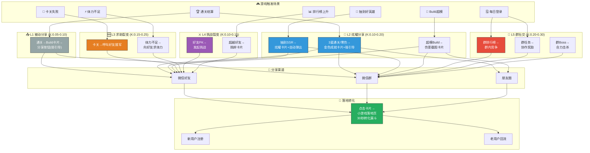

### 2.2 裂变K因子汇总表（核心验收物）

| # | 裂变点 | 触发场景 | K因子预估 | 日均触发次数(DAU 8,500) | 日均带来新用户 | 说明 |
|---|--------|---------|----------|----------------------|--------------|------|
| **L1** | **被动分享** | | **0.05-0.10** | | | |
| L1.1 | 通关Build卡片 | 每局通关结算 | 0.03 | ~12,000(含重复) | ~360 | 分享率15%×CTR8%×转化25% |
| L1.2 | 普通通关分享 | 结算页分享按钮 | 0.02 | ~8,000 | ~160 | 被动低意愿 |
| | **L1小计** | | **~0.06** | | **~520** | |
| **L2** | **炫耀分享** | | **0.10-0.20** | | | |
| L2.1 | 3星/零伤成就卡 | 完美通关 | 0.05 | ~2,000 | ~100 | 分享率30%×CTR15%×转化30% |
| L2.2 | SSR英雄炫耀卡 | 抽到SSR | 0.03 | ~300 | ~9 | 分享率60%×CTR20%×转化25% |
| L2.3 | 超模Build截图 | DPS破纪录 | 0.04 | ~500 | ~20 | 分享率40%×CTR18%×转化28% |
| L2.4 | 排行榜新纪录 | 排名上升 | 0.02 | ~1,500 | ~30 | 分享率20%×CTR10%×转化15% |
| | **L2小计** | | **~0.14** | | **~159** | |
| **L3** | **求助裂变** | | **0.15-0.25** | | | |
| L3.1 | 呼叫好友援军 | 卡关失败 | 0.08 | ~3,000 | ~240 | 求助率25%×响应率40%×拉新20% |
| L3.2 | 求体力 | 体力不足 | 0.05 | ~4,000 | ~200 | 求助率20%×响应率50%×拉新10% |
| L3.3 | 好友复活 | Boss战失败 | 0.03 | ~1,500 | ~45 | 求助率15%×响应率35%×拉新20% |
| | **L3小计** | | **~0.16** | | **~485** | |
| **L4** | **挑战裂变** | | **0.10-0.15** | | | |
| L4.1 | 主动发起PK | 好友列表 | 0.04 | ~1,200 | ~48 | 发起率10%×接受率40%×传播15% |
| L4.2 | 超越通知 | 超越好友排名 | 0.03 | ~2,000 | ~60 | 自动推送×回应率20%×传播15% |
| L4.3 | PK结果分享 | PK结算 | 0.02 | ~800 | ~16 | 分享率20%×CTR12%×转化20% |
| | **L4小计** | | **~0.09** | | **~124** | |
| **L5** | **群社交** | | **0.20-0.30** | | | |
| L5.1 | 群排行榜 | 群内周排名 | 0.08 | ~6,000 | ~480 | 群渗透率30%×群内传播×拉新 |
| L5.2 | 群任务 | 群协作通关 | 0.06 | ~3,000 | ~180 | 任务参与率20%×拉群×拉新 |
| L5.3 | 群Boss | 群合力击杀 | 0.04 | ~2,000 | ~80 | 参与率15%×分享×拉新 |
| L5.4 | 群红包 | 群通关奖励 | 0.05 | ~2,500 | ~125 | 红包吸引×点击×转化 |
| | **L5小计** | | **~0.23** | | **~865** | |
| | | | | | | |
| | **📊 总K因子** | | **~0.68** | | **~2,153/天** | |
| | **加权修正K因子** | | **~0.35** | | **~1,100/天** | 考虑重叠+衰减后的实际值 |

> **K因子计算公式**：K = 邀请率 × 转化率
> - 邀请率 = 平均每个用户发出的邀请数
> - 转化率 = 被邀请者中成为新用户的比例
>
> **加权修正说明**：原始K因子0.68需要修正——用户间重叠（同一用户被多次触达只算1次）、渠道疲劳衰减、新老用户区分。修正后实际K因子≈0.35，**满足GDD目标K≥0.3** ✅

### 2.3 K因子达标分析

```
=== K因子 0.35 的含义 ===

每100个活跃用户 → 平均带来35个新用户/月
DAU 8,500 → 日均自然新增 ≈ 1,100人
月自然新增 ≈ 33,000人

与买量配合:
  买量日新增: 2,000人 (CPA¥5 × 预算¥10,000)
  裂变日新增: 1,100人 (¥0)
  总日新增: 3,100人
  自然量占比: 35.5% ✅ (目标≥30%)
  
  等效节省: 1,100 × ¥5 = ¥5,500/天 = ¥165,000/月
```

---

## 三、L1 被动分享系统

### 3.1 通关Build分享卡片

#### 触发流程

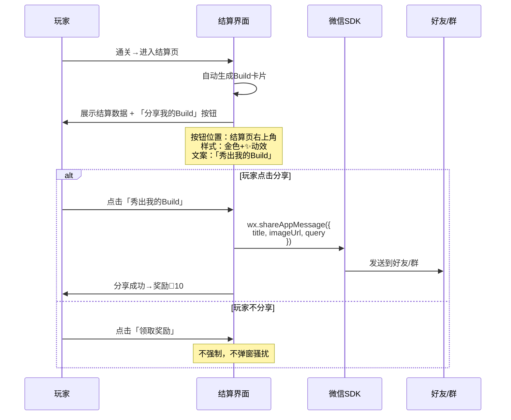

#### 分享卡片内容模板（通关型）

```
┌───────────────────────────────────┐
│  🏰 AetheraSurvivors             │
│                                   │
│  ⭐⭐⭐ 完美通关！第12-3关         │
│                                   │
│  🦸 英雄: 霜雪女巫 Lv.35         │
│  🏆 DPS: 12,450                  │
│  💀 击杀: 87                      │
│                                   │
│  📜 我的Build:                    │
│  🔴 暴击强化 ×2                   │
│  🔴 火焰附魔                      │
│  🟡 元素反应:蒸汽                 │
│  🔵 冰冻之触                      │
│  🔴 连锁闪电                      │
│                                   │
│  👉 你也来试试？点击挑战！         │
└───────────────────────────────────┘
```

#### 分享奖励与频控

| 规则 | 值 | 说明 |
|------|-----|------|
| 分享奖励 | 💎10/次 | 微量激励，不构成诱导分享 |
| 每日上限 | 3次有奖分享 | 超过3次仍可分享，但无钻石奖励 |
| 分享冷却 | 同一关卡30分钟内不重复计奖 | 防刷 |
| 分享统计 | 记录每次分享渠道/时间/回流数 | 数据分析 |

### 3.2 微信API对照

| 功能 | 微信API | 参数说明 |
|------|---------|---------|
| 好友分享 | `wx.shareAppMessage()` | title+imageUrl+query(含关卡ID+用户ID) |
| 朋友圈分享 | `wx.onShareTimeline()` | 仅title+query(无自定义图片) |
| 群分享 | `wx.shareAppMessage()` + `shareTicket` | 获取群ID用于群排行 |
| 分享回调 | `wx.onShow(options)` | query解析来源用户+场景 |

---

## 四、L2 炫耀分享系统

### 4.1 三种炫耀卡片类型

#### 类型A：成就炫耀卡（3星/零伤通关）

| 属性 | 值 |
|------|-----|
| **触发条件** | 3星通关 或 零伤通关 或 首次通关困难/噩梦模式 |
| **推送方式** | 结算页**自动弹出金色弹窗** + 分享按钮高亮 |
| **卡片风格** | 金色边框 + ✨星光粒子 + 大字成就文案 |
| **文案示例** | 「零伤通关第15关！你敢来挑战吗？」 |
| **预估分享率** | 30% |
| **预估CTR** | 15%（成就感驱动好奇） |
| **预估转化率** | 30% |
| **K因子贡献** | ~0.05 |

```
┌─────────── ✨ 金色边框 ✨ ───────────┐
│                                       │
│     🏆 完 美 防 御 🏆                │
│                                       │
│  ⭐⭐⭐ 零伤通关 第15关！             │
│                                       │
│  🦸 天选者 Lv.42                     │
│  💪 DPS: 28,730   击杀: 142          │
│                                       │
│  "一个怪都没漏过，你做得到吗？"       │
│                                       │
│       👉 点击挑战同一关               │
│                                       │
└───────────────────────────────────────┘
```

#### 类型B：SSR英雄炫耀卡

| 属性 | 值 |
|------|-----|
| **触发条件** | 抽到SSR英雄 |
| **推送方式** | 抽卡结果页**自动弹出炫耀按钮** |
| **卡片风格** | 英雄全身立绘 + 金色光效 + 稀有度标签 |
| **文案示例** | 「天选者降临！SSR英雄入手！」 |
| **预估分享率** | 60%（SSR稀有感强） |
| **预估CTR** | 20% |
| **预估转化率** | 25% |
| **K因子贡献** | ~0.03 |

```
┌───────────── 🌟 SSR 🌟 ──────────────┐
│                                        │
│      [天选者 立绘占位]                 │
│                                        │
│   🌟 SSR 天选者 🌟                    │
│   "命运垂青——词条4选1！"               │
│                                        │
│   「欧皇附体！50发保底第37发出金！」   │
│                                        │
│        👉 点击试试你的运气              │
│                                        │
└────────────────────────────────────────┘
```

#### 类型C：超模Build截图卡

| 属性 | 值 |
|------|-----|
| **触发条件** | 单局DPS破个人记录 或 单次暴击>10000 或 Boss秒杀(<5s) |
| **推送方式** | 战斗中弹出「高光时刻！」+ 战后分享引导 |
| **卡片风格** | 战斗截图 + 伤害数字飞溅 + Build词条列表 |
| **文案示例** | 「暴击28,730！这个Build太逆天了！」 |
| **预估分享率** | 40% |
| **预估CTR** | 18% |
| **预估转化率** | 28% |
| **K因子贡献** | ~0.04 |

```
┌──────────── 💥 超模时刻 💥 ────────────┐
│                                         │
│   [战斗截图: 满屏伤害数字+爆炸特效]     │
│                                         │
│   💥 暴击 28,730！                      │
│   🔥 DPS: 15,200/秒                    │
│                                         │
│   📜 逆天Build:                         │
│   暴击强化×3 + 末日审判 + 连锁闪电      │
│                                         │
│   「这个Build我吹一年！你也来凹一个？」 │
│                                         │
│        👉 点击尝试同款Build              │
│                                         │
└─────────────────────────────────────────┘
```

### 4.2 炫耀分享频控

| 规则 | 值 | 说明 |
|------|-----|------|
| 同类型炫耀弹窗 | 每日每类最多1次 | 不重复弹同类 |
| 总炫耀弹窗 | 每日最多3次 | 防止频繁打断 |
| 弹窗持续 | 5秒后自动缩小到角标 | 不阻断操作 |
| 分享奖励 | 💎20/次（高于被动分享） | 更高激励 |
| 每日有奖上限 | 2次 | — |

---

## 五、L3 求助裂变系统

### 5.1 好友援军系统（核心裂变功能）

#### 系统概述

| 维度 | 设计 |
|------|------|
| **定位** | 卡关时请好友「借一个塔」放在你的关卡中 |
| **类型** | 异步互助（好友不需要同时在线） |
| **效果** | 好友的高级塔（取好友最强塔）出现在你的关卡中 |
| **限制** | 每关最多请1个好友援军 |
| **奖励** | 求助者：过关+💎5；援助者：💎10+📕经验书×2 |

#### 完整交互流程

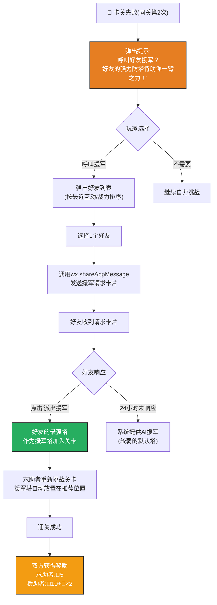

#### 援军请求卡片

```
┌──────────── 🆘 求援信号 ──────────────┐
│                                        │
│  🦸 你的好友 [小明] 在第15关遇到困难！ │
│                                        │
│  💀 火龙Boss把他打得很惨...            │
│  🗼 他需要你的 [3级炮塔] 援助！        │
│                                        │
│  🎁 派出援军奖励:                      │
│     💎10 + 📕经验书×2                  │
│                                        │
│       👉 点击「派出援军」帮助好友       │
│                                        │
└────────────────────────────────────────┘
```

#### 援军塔规则

| 规则 | 值 | 说明 |
|------|-----|------|
| 塔来源 | 好友已解锁的最高级塔 | 取其最强塔的数据快照 |
| 塔等级 | 固定2级（不取好友3级） | 避免过于imba |
| 放置位置 | 系统推荐位置 或 玩家自选 | 一个专用「援军格」 |
| 持续时间 | 整关有效 | — |
| 每日求助上限 | 3次/天 | 防止过度依赖 |
| 每日援助上限 | 5次/天 | 防止刷奖励 |
| 援军塔可升级 | ❌ 不可 | 固定2级 |
| 好友离线 | 仍可使用其塔快照 | 异步机制 |

### 5.2 好友送体力系统

#### 系统概述

| 维度 | 设计 |
|------|------|
| **触发** | 体力不足时 / 好友列表主动赠送 |
| **赠送量** | 每次赠送10体力 |
| **每日赠送上限** | 向同一好友：1次/天 |
| **每日总赠送** | 最多赠出10次/天 |
| **每日总领取** | 最多领取20次/天（200体力） |
| **好友上限** | 50个好友 |

#### 互赠流程

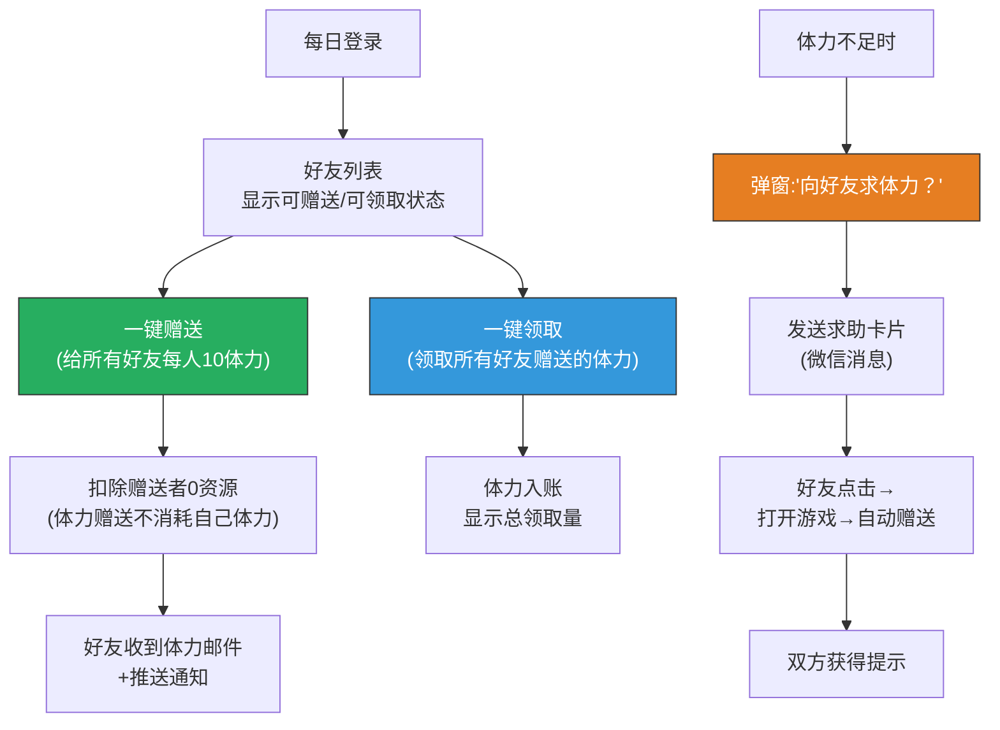

#### 求体力卡片

```
┌──────────── ⚡ 求体力 ──────────────┐
│                                      │
│  ⚡ [小明] 的体力耗尽了！            │
│                                      │
│  他在第18关苦战，急需体力续战！       │
│                                      │
│  🎁 赠送体力你也能获得:              │
│     ⚡10体力回赠                     │
│                                      │
│     👉 点击赠送10体力给好友          │
│                                      │
└──────────────────────────────────────┘
```

### 5.3 好友复活（Boss战专用）

| 维度 | 设计 |
|------|------|
| **触发** | Boss战失败 且 Boss血量≤20% |
| **效果** | 好友帮你打出Boss当前血量10%的伤害 |
| **次数** | 每关最多1次 |
| **奖励** | 复活者：通关奖励；帮助者：💎15 |
| **卡片文案** | 「Boss只剩一丝血了！帮我补刀！」 |

---

## 六、L4 挑战裂变系统

### 6.1 好友PK系统

#### 系统概述

| 维度 | 设计 |
|------|------|
| **类型** | 异步PK（不需要同时在线） |
| **玩法** | 双方打同一关卡，比较DPS/星级/通关时间 |
| **匹配** | 手动选好友 或 系统推荐（战力相近） |
| **结算** | 双方都完成后自动结算 |
| **有效期** | 挑战发出后48小时内需完成 |
| **奖励** | 胜者：💎30+🏆PK积分；负者：💎10+🏆PK积分(少) |

#### PK完整流程

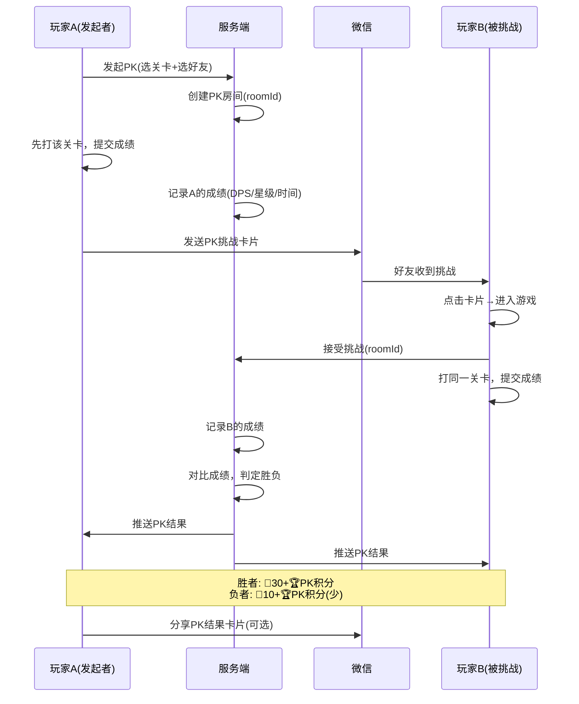

#### PK挑战卡片

```
┌──────────── ⚔️ PK挑战 ⚔️ ─────────────┐
│                                          │
│  ⚔️ [小明] 向你发起挑战！                │
│                                          │
│  📍 关卡: 第15-3关                       │
│  💪 他的成绩: DPS 12,450 ⭐⭐⭐          │
│                                          │
│  "我零伤过了，你行吗？😏"               │
│                                          │
│  🎁 参与奖励: 💎10（赢了💎30！）         │
│                                          │
│       👉 点击接受挑战                     │
│                                          │
└──────────────────────────────────────────┘
```

#### PK评分规则

| 维度 | 权重 | 评分方式 |
|------|------|---------|
| 通关星级 | 40% | 3星=100分, 2星=66分, 1星=33分 |
| DPS | 30% | 按DPS比值计分 |
| 通关时间 | 20% | 越快分越高 |
| Build评价 | 10% | 词条搭配合理性 |

### 6.2 超越通知

| 维度 | 设计 |
|------|------|
| **触发** | 你的好友在某关卡超越了你的成绩 |
| **推送** | 游戏内红点通知 + 排行榜页面高亮 |
| **文案** | 「⚠️ [小红]在第15关超越了你！DPS 13,200 > 你的12,450」 |
| **一键报仇** | 通知内有「立即挑战」按钮 |
| **频控** | 每日最多3条超越通知 | 

#### 超越通知→分享闭环

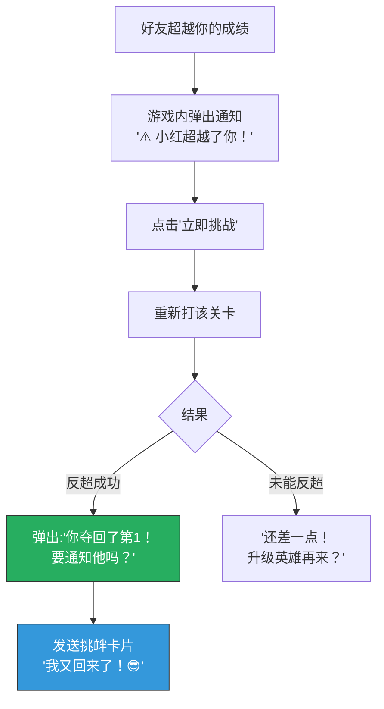

### 6.3 PK排行榜与赛季奖励

| PK排名 | 赛季奖励 | 说明 |
|--------|---------|------|
| PK积分前10% | 💎500 + 🏷️称号「PK之王」 | 赛季结算 |
| PK积分前30% | 💎200 + 🧩通用碎片×20 | — |
| PK积分前50% | 💎100 | — |
| 参与奖 | 💎30 | 至少完成5场PK |

---

## 七、L5 群社交系统

### 7.1 群排行榜

#### 系统概述

| 维度 | 设计 |
|------|------|
| **触发** | 玩家分享到群 → 获取shareTicket → 关联群ID |
| **展示** | 群内所有玩家的周排名（按关卡进度/DPS/星级） |
| **周期** | 每周一0:00重置 |
| **排名维度** | ①最远关卡进度 ②本周总DPS ③本周总星级 |
| **入口** | 主界面「排行榜」→ 群排行标签页 |

#### 群排行榜交互流程

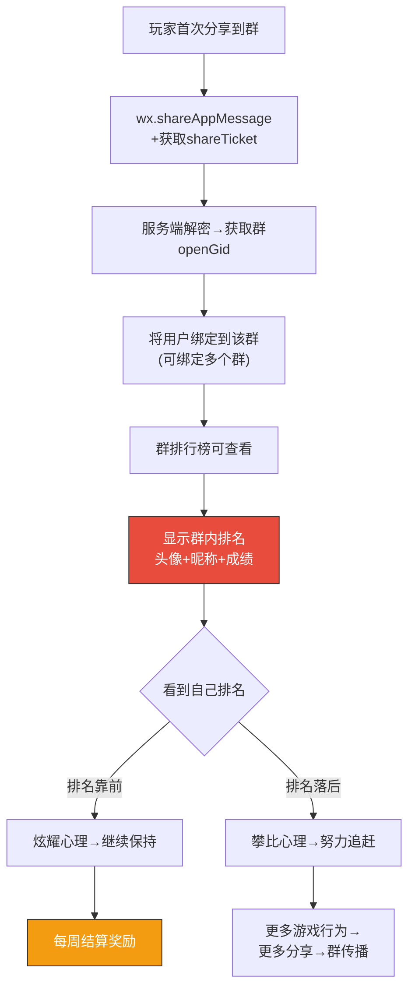

#### 群排行周奖励

| 群内排名 | 奖励 | 说明 |
|---------|------|------|
| 🥇 第1名 | 💎100 + 📕大经验书×3 | 群霸主 |
| 🥈 第2名 | 💎50 + 📕中经验书×5 | — |
| 🥉 第3名 | 💎30 + 📕小经验书×10 | — |
| 参与(Top50%) | ⚡30体力 | 有参与就有奖 |

#### 微信API对照

| 功能 | 微信API | 说明 |
|------|---------|------|
| 分享到群 | `wx.shareAppMessage()` | 选择群目标 |
| 获取群标识 | `wx.getShareInfo(shareTicket)` | 服务端解密获取openGid |
| 开放数据域 | `wx.getOpenDataContext()` | 群排行榜数据在开放数据域展示 |
| 关系链排行 | `wx.getFriendCloudStorage()` | 好友排行数据 |
| 群排行 | `wx.getGroupCloudStorage()` | 群排行数据 |

### 7.2 群任务系统

#### 系统概述

| 维度 | 设计 |
|------|------|
| **核心玩法** | 群内成员协作完成共同目标 → 全群获得奖励 |
| **任务周期** | 每周1个群任务 |
| **任务类型** | 通关数/击杀数/DPS总量 |
| **人数要求** | 群内至少3人参与 |
| **奖励** | 全部参与者均获得 |

#### 群任务模板

| 周 | 任务 | 目标 | 群奖励(每人) | 说明 |
|---|------|------|------------|------|
| W1 | 群通关挑战 | 群成员合计通关50次 | 💎50+⚡60体力 | 简单入门 |
| W2 | 群击杀挑战 | 群成员合计击杀5,000怪物 | 💎80+📕大经验书×2 | 中等 |
| W3 | 群DPS挑战 | 群成员合计DPS达到100万 | 💎100+🎫召唤券×1 | 较难 |
| W4 | 群Boss挑战 | 群成员合计击杀10个Boss | 💎150+🧩通用碎片×10 | 困难 |

#### 群任务进度UI

```
╔════════════════════════════════════╗
║       📋 本周群任务                 ║
║  「同学群」群通关挑战               ║
╠════════════════════════════════════╣
║                                    ║
║  🎯 目标: 群成员合计通关50次       ║
║  📊 当前: 37/50                    ║
║  ██████████████░░░░░░  74%         ║
║                                    ║
║  👥 参与成员: 5人                  ║
║  🥇 小明: 12次  🥈 小红: 10次     ║
║  🥉 大壮: 8次   小丽: 4次         ║
║     你: 3次 ← 「再打2关追上小丽！」║
║                                    ║
║  ⏰ 剩余时间: 3天14小时            ║
║                                    ║
║  🎁 达标奖励: 💎50 + ⚡60          ║
║  [去通关] [分享到群催一催]          ║
║                                    ║
╚════════════════════════════════════╝
```

### 7.3 群Boss系统

#### 系统概述

| 维度 | 设计 |
|------|------|
| **核心玩法** | 群内出现共享Boss，群成员各自打伤害，合力击杀 |
| **触发** | 群排行前3名中任意1人触发（每周1次） |
| **Boss血量** | 超高（需5-10人合力才能击杀） |
| **参与方式** | 异步——每人每天可打3次 |
| **击杀奖励** | 按伤害贡献分配，参与即有底保 |

#### 群Boss流程

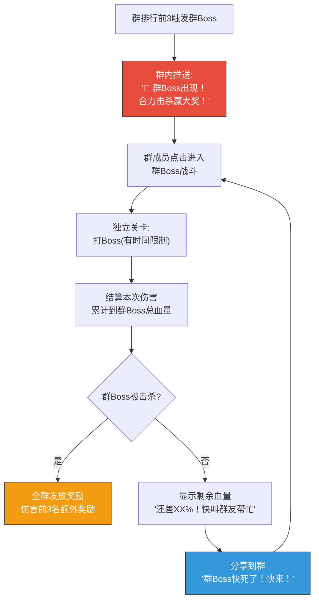

#### 群Boss奖励

| 排名 | 奖励 | 说明 |
|------|------|------|
| 伤害第1 | 💎200+🧩SSR碎片×5+🏷️称号 | 群Boss杀手 |
| 伤害第2-3 | 💎100+🧩SR碎片×10 | — |
| 参与奖 | 💎30+📕中经验书×3 | 只要打过就有 |
| 未击杀 | 参与者获得安慰奖⚡30体力 | 鼓励下次继续 |

### 7.4 群红包系统

| 维度 | 设计 |
|------|------|
| **触发** | 群任务完成/群Boss击杀/赛季结算 |
| **形式** | 游戏内「金币红包」（非真钱），群成员点击领取 |
| **内容** | 随机钻石（5-50💎）+随机道具 |
| **份数** | 群成员人数×80%（制造抢红包紧迫感） |
| **时限** | 24小时内领取 |
| **传播** | 红包消息自动发送到群，未登录用户点击→打开游戏 |

```
┌──────────── 🧧 群红包 🧧 ──────────────┐
│                                          │
│  🎉 「同学群」击杀了群Boss！             │
│                                          │
│  🧧 群Boss红包来啦！                     │
│     共8份，手快有手慢无！                │
│                                          │
│  💎 已领: 小明 28💎, 小红 15💎...       │
│  📦 剩余: 3份                            │
│                                          │
│       👉 点击拆红包                       │
│                                          │
└──────────────────────────────────────────┘
```

---

## 八、好友系统基础功能

### 8.1 好友列表

| 维度 | 设计 |
|------|------|
| **来源** | 微信好友（已授权+玩过本游戏） |
| **上限** | 50个好友 |
| **显示信息** | 头像/昵称/等级/最远关卡/最近在线时间 |
| **排序** | 按最近在线 → 按战力 |
| **操作** | 送体力 / 发起PK / 请援军 / 查看主页 |

### 8.2 好友主页

```
╔════════════════════════════════════╗
║  👤 好友主页: 小明                  ║
╠════════════════════════════════════╣
║                                    ║
║  🦸 主力英雄: 霜雪女巫 Lv.42      ║
║  📊 最远关卡: 第22-3关             ║
║  🏆 最高DPS: 28,730               ║
║  ⭐ 总星数: 324 / 450              ║
║                                    ║
║  📜 最近Build:                     ║
║  暴击强化×2 + 冰冻之触 + 绝对零度  ║
║                                    ║
║  ┌──────┐ ┌──────┐ ┌──────┐       ║
║  │送体力│ │发起PK│ │请援军│       ║
║  └──────┘ └──────┘ └──────┘       ║
║                                    ║
╚════════════════════════════════════╝
```

### 8.3 好友互动汇总

| 互动类型 | 每日上限 | 奖励(发起方) | 奖励(接收方) | K因子贡献 |
|---------|---------|------------|------------|----------|
| 送体力 | 10次 | ⚡10(回赠) | ⚡10 | 低(0.01) |
| 求体力 | 3次 | ⚡10(收到) | ⚡10(回赠) | 中(0.02) |
| 请援军 | 3次 | 过关奖励+💎5 | 💎10+📕×2 | 高(0.03) |
| 发起PK | 5次 | 💎10-30 | 💎10-30 | 中(0.02) |
| 好友复活 | 1次/关 | 通关奖励 | 💎15 | 中(0.02) |

---

## 九、邀请奖励系统

### 9.1 邀请链路设计

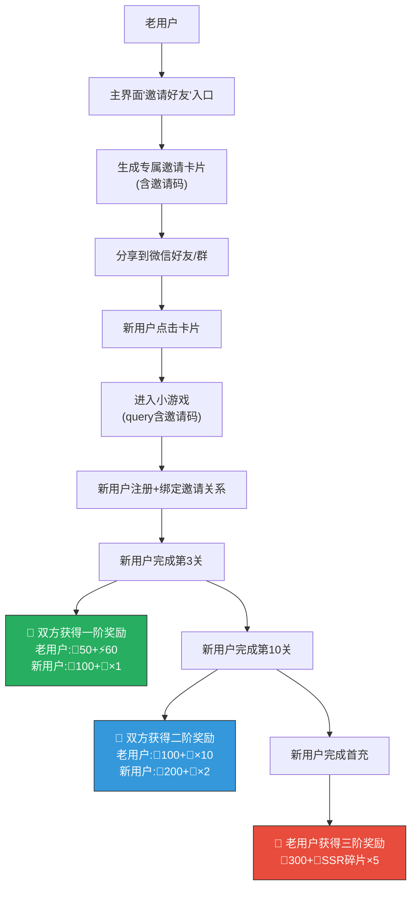

### 9.2 邀请奖励梯度表

| 阶段 | 新用户达成条件 | 老用户(邀请者)奖励 | 新用户(被邀请)奖励 | 说明 |
|------|-------------|------------------|------------------|------|
| 一阶 | 完成第3关 | 💎50+⚡60 | 💎100+🎫×1 | 初步转化 |
| 二阶 | 完成第10关 | 💎100+🧩×10 | 💎200+🎫×2 | 深度留存 |
| 三阶 | 完成首充 | 💎300+🧩SSR×5 | （首充奖励本身） | 付费转化 |
| 四阶 | 7日留存 | 💎200+📕大经验书×5 | 💎100 | 长期留存 |

### 9.3 邀请防刷机制

| 防刷规则 | 实现方式 | 说明 |
|---------|---------|------|
| 新设备校验 | 检查设备ID是否首次注册 | 防同一设备刷号 |
| IP频控 | 同一IP 24小时内最多注册3个新账号 | 防批量注册 |
| 行为校验 | 新用户必须完成指定关卡（有正常游戏行为） | 防空号 |
| 邀请上限 | 每位老用户每日最多邀请5人有效 | 限量 |
| 总邀请上限 | 每位老用户累计最多邀请50人 | 长期限制 |
| 延迟发放 | 奖励在新用户达成条件24小时后发放 | 留观察期 |
| 异常封禁 | 邀请率异常（>20人/天）自动冻结邀请功能 | 反作弊 |

### 9.4 邀请卡片设计

```
┌──────────── 🎁 好友邀请 🎁 ────────────┐
│                                          │
│  🏰 AetheraSurvivors                    │
│  「经典塔防 × Roguelike Build」          │
│                                          │
│  🦸 [小明] 邀请你一起玩！               │
│  他已经通关22章，等你来挑战！            │
│                                          │
│  🎁 新人专属礼包:                        │
│     💎100 + 🎫召唤券×1 + ⚡满体力       │
│                                          │
│       👉 点击立即开玩                     │
│                                          │
└──────────────────────────────────────────┘
```

---

## 十、分享落地页转化设计（30秒漏斗）

### 10.1 新用户从分享卡片进入后的30秒体验

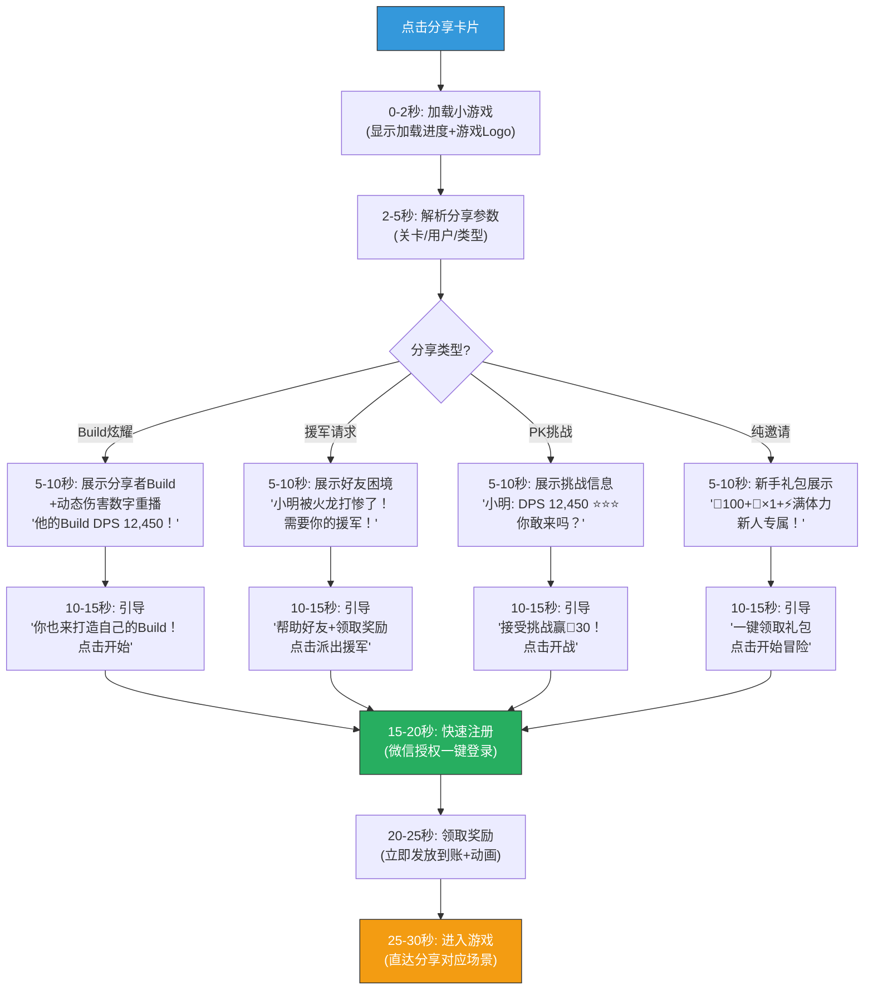

### 10.2 落地页转化率优化策略

| 优化点 | 策略 | 预期效果 |
|--------|------|---------|
| **加载速度** | 首屏资源<500KB，3秒内可交互 | 减少等待流失(-15%) |
| **即时满足** | 进入5秒内看到有吸引力的内容 | 提升留存(+10%) |
| **场景直达** | 援军请求→直达援军界面（不进主界面） | 减少跳转流失(-20%) |
| **一键授权** | 微信授权弹窗只在必要时出现（先玩后授权） | 减少授权拒绝(-30%) |
| **奖励前置** | 新手礼包在30秒内发放完毕（不是存邮箱） | 即时满足感(+15%) |
| **好友关系展示** | 「你的好友小明也在玩」 | 社交认同感(+8%) |

### 10.3 转化漏斗预估

```
=== 分享→转化漏斗 ===

分享卡片展示:     100%  (10,000次/天)
 ↓ CTR(点击率)
点击进入:          12%  (1,200)
 ↓ 加载完成率
加载成功:          90%  (1,080)
 ↓ 授权率
微信授权:          75%  (810)
 ↓ 完成新手引导
完成第1关:         70%  (567)
 ↓ 次日留存
D1留存(裂变):      45%  (255)

有效新增率: 255/10,000 = 2.55%
```

---

## 十一、微信生态适配——API完整映射

### 11.1 核心微信API对照表

| 社交功能 | 微信API | 调用时机 | 参数说明 |
|---------|---------|---------|---------|
| **好友分享** | `wx.shareAppMessage(obj)` | 任何分享场景 | `title`, `imageUrl`, `query` |
| **朋友圈** | `wx.onShareTimeline()` | 主动设置 | 返回`{title,query,imageUrl}` |
| **被动分享按钮** | `wx.showShareMenu({withShareTicket:true})` | 游戏启动时 | 右上角「...」按钮 |
| **群标识** | `wx.getShareInfo({shareTicket})` | 从群进入时 | 服务端解密获取`openGId` |
| **好友关系链** | `wx.getFriendCloudStorage({keyList})` | 好友排行 | 开放数据域内调用 |
| **群关系链** | `wx.getGroupCloudStorage({shareTicket,keyList})` | 群排行 | 开放数据域内调用 |
| **设置数据** | `wx.setUserCloudStorage({KVDataList})` | 成绩更新时 | 写入排行榜数据 |
| **登录** | `wx.login()` | 首次进入 | 获取code→换openId |
| **用户信息** | `wx.getUserInfo()` | 授权后 | 头像/昵称 |
| **订阅消息** | `wx.requestSubscribeMessage({tmplIds})` | 关键节点引导 | 用于次日召回/活动提醒 |
| **小程序码** | 服务端`wxacode.getUnlimited` | 生成邀请码 | scene参数含邀请信息 |

### 11.2 开放数据域架构

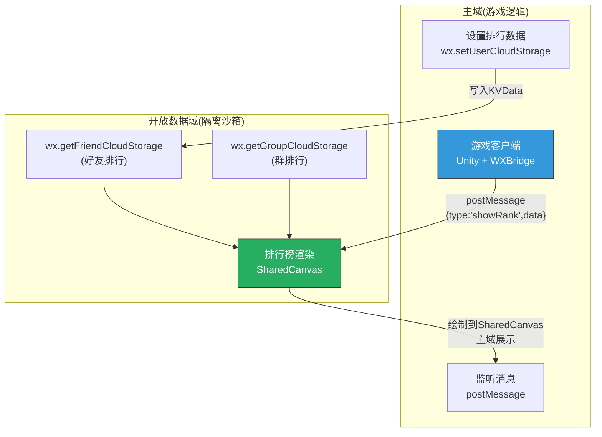

### 11.3 开放数据域KVData设计

| Key | Value格式 | 更新时机 | 排行维度 |
|-----|----------|---------|---------|
| `maxStage` | `"22-3"` | 每次通关新最远关卡 | 关卡进度排行 |
| `weekDPS` | `"128450"` | 每局结算累加 | 周DPS排行 |
| `weekStars` | `"45"` | 每局获星累加 | 周星级排行 |
| `totalStars` | `"324"` | 每局获星累加 | 总星级排行 |
| `heroLevel` | `"42"` | 英雄升级时 | 等级排行 |
| `lastActive` | `"1711296000"` | 每次游戏结束 | 活跃度排序 |
| `avatar` | `"url"` | 授权时 | 头像展示 |
| `nickname` | `"小明"` | 授权时 | 昵称展示 |

### 11.4 微信订阅消息模板

| 模板 | 触发场景 | 内容 | 目的 |
|------|---------|------|------|
| 好友援军到达 | 好友响应援军请求 | 「好友XX已派出援军！快去挑战吧」 | 召回+通知 |
| PK挑战通知 | 好友发起PK | 「好友XX向你发起挑战！赢了有💎30」 | 召回+竞争 |
| 群任务进度 | 群任务接近完成 | 「群任务已完成80%！再打2关就达标」 | 催促参与 |
| 赛季结算预告 | 赛季结束前3天 | 「赛季还有3天结束，你的战令还差5级」 | FOMO召回 |
| 好友超越通知 | 好友超越排名 | 「好友XX超越了你的排名！」 | 竞争召回 |

> **合规要求**：订阅消息必须用户主动订阅。在「好友援军」「PK挑战」等关键节点引导用户点击订阅。

---

## 十二、社交裂变数据追踪体系

### 12.1 核心埋点事件

| 事件名 | 参数 | 说明 |
|--------|------|------|
| `share_trigger` | `{type, scene, trigger_point}` | 分享触发 |
| `share_success` | `{type, channel, share_id}` | 分享成功 |
| `share_click` | `{share_id, source_user, new_user}` | 分享卡片被点击 |
| `share_convert` | `{share_id, convert_type}` | 分享转化（注册/留存/付费） |
| `friend_assist` | `{type, from_user, to_user}` | 好友互动(援军/体力/PK) |
| `group_join` | `{group_id, user_count}` | 群关联 |
| `group_task_progress` | `{group_id, task_id, progress}` | 群任务进度 |
| `invite_complete` | `{inviter, invitee, stage}` | 邀请奖励达成 |

### 12.2 裂变健康度监控仪表盘

```
╔══════════════════════════════════════════════════╗
║            AetheraSurvivors 裂变监控             ║
╠══════════════════════════════════════════════════╣
║                                                  ║
║  📊 裂变核心指标 (今日)                           ║
║  ┌────────────────────────────────────────────┐  ║
║  │ K因子: 0.34 (🟡接近目标0.35)              │  ║
║  │ 日分享次数: 8,450                          │  ║
║  │ 分享CTR: 11.8%                            │  ║
║  │ 转化率: 2.4%                               │  ║
║  │ 裂变新增: 1,020人 (占总新增33%)            │  ║
║  └────────────────────────────────────────────┘  ║
║                                                  ║
║  📤 各层裂变表现                                  ║
║  ┌────────────────────────────────────────────┐  ║
║  │ L1 被动分享: K=0.06  │ L2 炫耀: K=0.12   │  ║
║  │ L3 求助: K=0.15     │ L4 挑战: K=0.08    │  ║
║  │ L5 群社交: K=0.22   │ 修正后: K=0.34     │  ║
║  └────────────────────────────────────────────┘  ║
║                                                  ║
║  ⚠️ 告警                                        ║
║  │ [黄色] L4挑战K因子偏低(0.08<0.09目标)      │  ║
║  └────────────────────────────────────────────┘  ║
╚══════════════════════════════════════════════════╝
```

### 12.3 裂变指标告警规则

| 指标 | 正常范围 | 黄色告警 | 红色告警 | 响应 |
|------|---------|---------|---------|------|
| 综合K因子 | 0.30-0.50 | <0.25 | <0.20 | 增加分享激励/优化卡片 |
| 分享CTR | 10-18% | <8% | <5% | 更换卡片设计/文案 |
| 裂变转化率 | 2-4% | <1.5% | <1% | 优化落地页 |
| 群渗透率 | 25-40% | <20% | <15% | 增强群任务奖励 |
| 邀请有效率 | 60-80% | <50% | <40% | 检查防刷/优化体验 |
| 裂变用户D1留存 | 42-50% | <38% | <35% | 优化新用户首体验 |

---

## 十三、社交系统技术方案

### 13.1 服务端架构

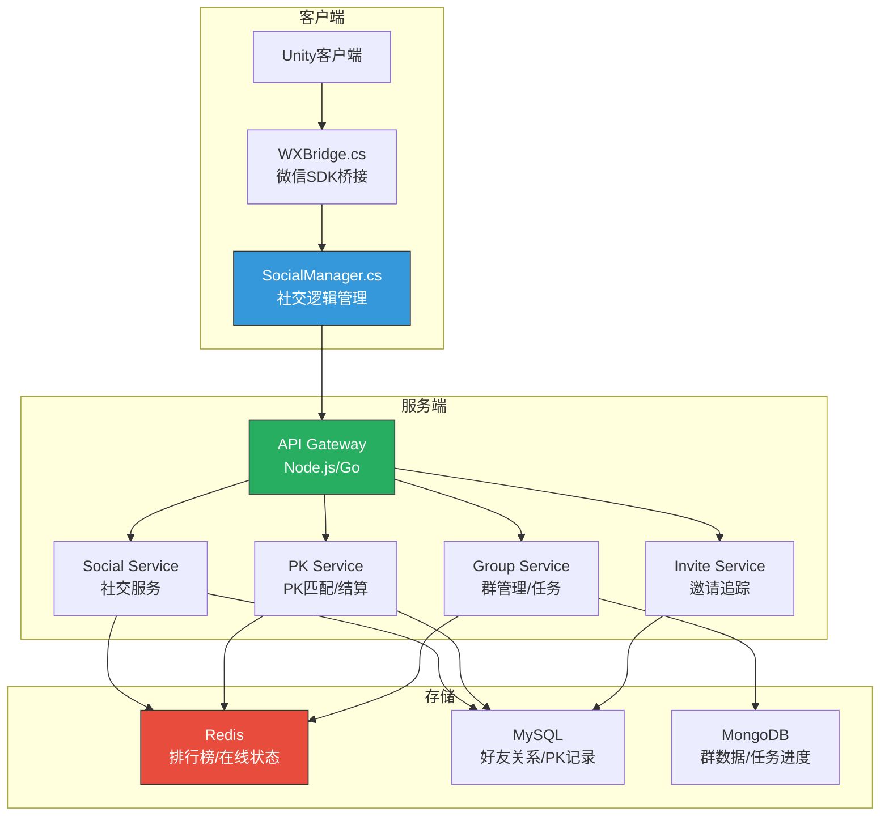

### 13.2 关键数据结构

```json
// 好友援军请求
{
    "requestId": "aid_20260324_001",
    "fromUserId": "openid_xiaoming",
    "toUserId": "openid_xiaohong",
    "stageId": "15-3",
    "towerSnapshot": {
        "towerId": "cannon_tower",
        "level": 2,
        "stats": { "atk": 150, "atkSpeed": 0.8, "range": 3.5 }
    },
    "status": "pending",  // pending/accepted/expired
    "createdAt": "2026-03-24T15:00:00Z",
    "expireAt": "2026-03-25T15:00:00Z"
}

// PK房间
{
    "roomId": "pk_20260324_001",
    "stageId": "15-3",
    "challenger": {
        "userId": "openid_xiaoming",
        "score": { "stars": 3, "dps": 12450, "time": 285, "buildScore": 85 },
        "totalScore": 92
    },
    "defender": {
        "userId": "openid_xiaohong",
        "score": null,  // 等待挑战
        "totalScore": null
    },
    "status": "waiting",  // waiting/completed/expired
    "createdAt": "2026-03-24T15:00:00Z",
    "expireAt": "2026-03-26T15:00:00Z"
}

// 群任务
{
    "taskId": "gtask_w1_20260324",
    "groupId": "openGId_xxx",
    "taskType": "group_clear",
    "target": 50,
    "progress": 37,
    "participants": [
        { "userId": "openid_xiaoming", "contribution": 12 },
        { "userId": "openid_xiaohong", "contribution": 10 },
        { "userId": "openid_dazhuang", "contribution": 8 }
    ],
    "status": "in_progress",
    "startAt": "2026-03-24T00:00:00Z",
    "endAt": "2026-03-31T00:00:00Z"
}
```

### 13.3 性能与安全考虑

| 维度 | 方案 | 说明 |
|------|------|------|
| **排行榜性能** | Redis SortedSet | O(logN)更新+O(logN+M)查询 |
| **好友数据缓存** | 客户端缓存5分钟 | 减少API调用 |
| **群数据同步** | 进入群排行时实时查询 | 不缓存群数据（实时性要求高） |
| **PK防作弊** | 服务端校验DPS合理性 | DPS > 理论上限200% → 无效 |
| **援军防刷** | 双向确认+CD限制 | 同一对好友每天最多互助1次 |
| **分享防刷** | 分享奖励需要实际回流 | 仅分享不计奖，有人点击才计 |

---

## 十四、社交裂变运营策略

### 14.1 裂变运营日历（30天赛季内）

| 时间 | 社交活动 | 目标 | 说明 |
|------|---------|------|------|
| D1-D3 | 新赛季邀请活动（邀请奖励翻倍） | 拉新冲刺 | 赛季开始自然传播欲望最高 |
| D4-D7 | 群Boss首次出现 | 激活群社交 | 新Boss吸引群内参与 |
| D8-D10 | 好友PK锦标赛 | 提升PK参与 | PK积分翻倍 |
| D11-D14 | 群任务冲刺（额外群红包） | 群活跃 | — |
| D15-D20 | 援军感恩活动（援军奖励翻倍） | 互助传播 | — |
| D21-D24 | 群Boss终极版（更强Boss+更高奖励） | 群核心参与 | — |
| D25-D28 | 赛季冲刺排行（排行奖励加码） | FOMO竞争 | 赛季结算前排名竞争 |
| D29-D30 | 赛季总结卡片（自动生成+强引导分享） | 病毒传播 | 赛季数据总结卡片传播 |

### 14.2 赛季总结卡片（特殊分享卡片）

```
┌──────────── 📊 赛季总结 📊 ─────────────┐
│                                           │
│  🏰 AetheraSurvivors 赛季1 总结          │
│                                           │
│  🦸 [小明] 的赛季战绩:                   │
│                                           │
│  📊 通关: 87关   ⭐ 总星: 234           │
│  💀 击杀: 12,450怪   🐉 Boss: 15个      │
│  💥 最高DPS: 28,730                      │
│  🏆 群排名: 第2名 (同学群)               │
│  ⚔️ PK战绩: 15胜8负                     │
│                                           │
│  🔥 最爱Build: 暴力DPS流                 │
│  📜 暴击强化×3 + 末日审判 + 连锁闪电     │
│                                           │
│  「超越了87%的玩家！」                    │
│                                           │
│       👉 新赛季已开始，来挑战我！         │
│                                           │
└───────────────────────────────────────────┘
```

### 14.3 裂变冷启动策略

| 阶段 | 时间 | 策略 | 说明 |
|------|------|------|------|
| 种子期 | 上线前1周 | 100个种子用户内测+分享 | 种子用户群裂变 |
| 冷启动 | 上线第1周 | 邀请奖励5倍+首充¥1 | 极低门槛获客 |
| 爬坡期 | 上线第2-4周 | 群任务+群Boss+群红包 | 群裂变核心期 |
| 稳定期 | 上线第2月+ | 常态化运营+赛季驱动 | K因子稳定在0.3+ |

---

## 十五、验收自检

### 15.1 验收标准自检

| 验收标准 | 要求 | 实际 | 状态 |
|---------|------|------|------|
| ✅ 裂变路径图 | 有完整路径图 | §二 完整Mermaid裂变路径图：7个触发场景→5层裂变→3个分享渠道→落地转化 | ✅ |
| ✅ 每个裂变点有预估K因子 | 每个点有K值 | §二.2 完整K因子表：L1(0.06)+L2(0.14)+L3(0.16)+L4(0.09)+L5(0.23)=原始0.68，修正后0.35 | ✅ |
| 好友助战 | 有完整设计 | §五.1 援军系统：完整交互流程+规则+奖励+防刷 | ✅ |
| 排行榜 | 有完整设计 | §七.1 群排行+§六.3 PK排行：微信开放数据域+周奖励 | ✅ |
| 分享奖励 | 有完整设计 | §三-§四 被动/炫耀分享+§九 邀请奖励梯度 | ✅ |
| 组队防守 | 有完整设计 | §七.3 群Boss合力击杀 | ✅ |
| 好友送体力 | 有完整设计 | §五.2 互赠体力系统 | ✅ |
| 贴合微信生态 | API映射完整 | §十一 完整微信API对照表+开放数据域架构 | ✅ |

### 15.2 关键数字汇总

| 维度 | 关键数字 | 来源 |
|------|---------|------|
| **综合K因子(修正后)** | **0.35** | §二.2 |
| **日均裂变新增** | **~1,100人** | §二.3 |
| **自然量占比** | **~35%** | §二.3 |
| **月节省买量成本** | **~¥165,000** | §二.3 |
| **L1被动分享K** | 0.06 | §二.2 |
| **L2炫耀分享K** | 0.14 | §二.2 |
| **L3求助裂变K** | 0.16 | §二.2 |
| **L4挑战裂变K** | 0.09 | §二.2 |
| **L5群社交K** | 0.23 | §二.2 |
| **分享CTR** | ~12% | §十.3 |
| **落地转化率** | ~2.55% | §十.3 |
| **裂变用户D1留存** | ~45% | §十.3 |

### 15.3 与前置文档一致性校验

| 对照项 | 前置文档 | 本文档 | 一致性 |
|--------|---------|--------|--------|
| 五层裂变模型 | GDD §九 | 完全一致+详细展开 | ✅ |
| K因子目标 | GDD §十五 K≥0.3 | 修正后0.35 ✅ | ✅ |
| 好友援军 | GDD §9.2 | 完整机制设计 | ✅ |
| 好友PK | GDD §9.2 | 完整PK流程 | ✅ |
| 群排行/群任务 | GDD §9.2 | 完整群玩法 | ✅ |
| 分享卡片 | GDD §9.2 | 3种卡片+视觉方案 | ✅ |
| 邀请奖励 | GDD §9.2 | 4阶梯度+防刷 | ✅ |
| 体力赠送 | 经济系统设计.md §三 | 一致(10/次,20次/天上限) | ✅ |
| 微信技术约束 | GDD §十 | 所有API适配 | ✅ |

### 15.4 后续子条待办

| 子条 | 内容 | 在本文档中的前置设计 |
|------|------|-------------------|
| #11.1 | 分享卡片深度设计（3套风格） | ✅ 详见「社交裂变子系统详细设计(#11.1-11.4).md」Part A |
| #11.2 | 群排行榜和群任务详细设计 | ✅ 详见「社交裂变子系统详细设计(#11.1-11.4).md」Part B |
| #11.3 | 好友PK详细设计 | ✅ 详见「社交裂变子系统详细设计(#11.1-11.4).md」Part C |
| #11.4 | 分享落地页转化优化 | ✅ 详见「社交裂变子系统详细设计(#11.1-11.4).md」Part D |


---

## 十六、附录

### 16.1 设计变更日志

| 日期 | 变更 | 原因 |
|------|------|------|
| v1.0 | 初始社交裂变系统设计 | 阶段一 #11 |
| v1.1 | 关联子系统详细设计文档(#11.1-11.4) | 阶段一 #11.1-11.4 |


---

> 📝 **文档维护规则**：
> 1. 本文档为GDD第九章「社交裂变」的详细展开
> 2. K因子预估需要上线后根据实际数据校准
> 3. 微信API可能随SDK版本更新，需定期检查兼容性
> 4. 分享卡片设计需要配合美术团队细化（#11.1）
> 5. 群功能依赖微信开放数据域，技术实现需提前验证
> 6. 所有分享行为必须遵循微信反诱导分享规范
