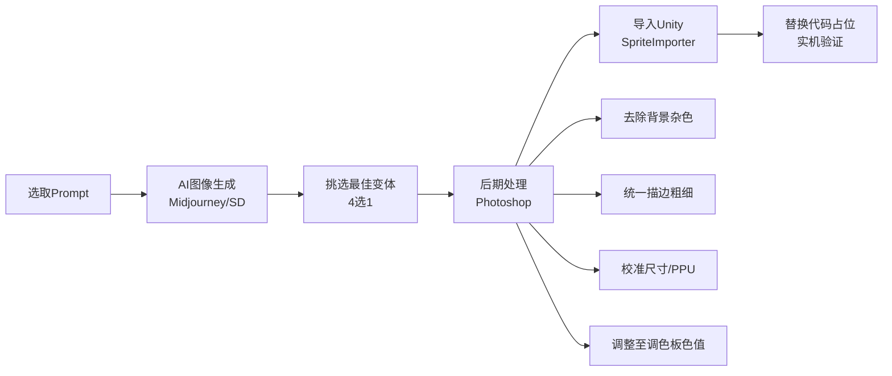

# 🎨 AetheraSurvivors — 第一关美术资源生产指南（最终品质）

> **文档版本**：v1.0  
> **最后更新**：2026-03-25  
> **交互编号**：#160.1 ~ #160.8（调整版：聚焦第一关最终品质）  
> **前置依赖**：美术风格方案.md（方案A「精致卡通」已确认）、GDD.md、WaveManager.cs  
> **目标**：为第一关全部视觉资源提供 **可直接用于AI图像生成** 的完整Prompt，产出按发布品质要求

---

## 一、生产规范总则

### 1.1 风格锁定：方案A「精致卡通」

| 维度 | 规范 | 说明 |
|------|------|------|
| **风格定位** | 皇室战争×王国保卫战 式精致卡通 | 不幼稚不沉重，25-40岁男性高接受度 |
| **线条** | 2px深色描边（`#2C3E50`） | 所有单位/建筑统一描边，增强辨识度 |
| **渲染** | 2D手绘+微立体感（1层高光+1层阴影） | 不是纯扁平，要有体积感 |
| **透视** | 45度俯视（isometric偏正面） | 塔防标准视角，能看到正面和顶部 |
| **背景** | 所有单位/建筑图必须 **透明背景（PNG）** | 方便引擎合成 |

### 1.2 调色板（正式生产版）

| 色彩角色 | HEX | RGB | 使用场景 |
|---------|-----|-----|---------|
| 翠绿（草地） | `#2ECC71` | 46,204,113 | 地图草地底色 |
| 天蓝（天空） | `#3498DB` | 52,152,219 | 天空/水面/法系 |
| 暖金（金币） | `#F39C12` | 243,156,18 | 金币/奖励/升级高亮 |
| 暖棕（路径） | `#8B6914` | 139,105,20 | 泥土路径/木质建筑 |
| 火红（伤害） | `#E74C3C` | 231,76,60 | 伤害/危险/火系 |
| 皇紫（魔法） | `#9B59B6` | 155,89,182 | 魔法/稀有标识 |
| 冰蓝（冰系） | `#00BCD4` | 0,188,212 | 冰系效果/冰塔 |
| 毒绿（毒系） | `#27AE60`→`#BFFF00` | — | 毒塔/DOT效果 |
| 深灰（UI） | `#2C3E50` | 44,62,80 | UI文字/描边 |
| 浅灰（底色） | `#ECF0F1` | 236,240,241 | 弹窗底色 |

### 1.3 分辨率规范

| 资源类型 | 尺寸（像素） | PPU | 说明 |
|---------|------------|-----|------|
| 塔（1-2级） | 64×64 | 64 | 正方形，占1格 |
| 塔（3级） | 64×80 | 64 | 向上延伸，体现升级感 |
| 普通怪物 | 48×48 | 64 | 比塔略小 |
| Boss怪物 | 128×128 | 64 | 大尺寸，威慑感 |
| 地图Tile | 32×32 | 32 | 可无缝拼接 |
| 投射物 | 16×16 | 64 | 小尺寸飞行物 |
| UI图标 | 48×48 | 48 | 清晰可辨识 |
| 词条图标 | 48×48 | 48 | 卡片上的小图标 |

### 1.4 AI图像生成工具推荐

| 工具 | 推荐度 | 适合场景 | 说明 |
|------|-------|---------|------|
| **Midjourney v6** | ⭐⭐⭐⭐⭐ | 角色/建筑/Boss | 风格一致性最强 |
| **Stable Diffusion XL** | ⭐⭐⭐⭐ | 批量同类资源 | 可用ControlNet控制构图 |
| **DALL-E 3** | ⭐⭐⭐ | 快速原型/概念 | 透明背景支持好 |
| **Photoshop AI** | ⭐⭐⭐⭐ | 后期精修/去背 | 统一化处理必备 |

### 1.5 统一Prompt模板

所有资源的Prompt遵循以下结构：

```
[主体描述], [风格关键词], [技术要求]

风格关键词（所有资源统一）:
"2D game asset, cartoon fantasy style, clash royale inspired, 
thick dark outline, vibrant saturated colors, hand-painted look 
with subtle shading, warm lighting, --no 3D render realistic dark gloomy"

技术要求（所有资源统一）:
"single sprite, transparent background, centered composition, 
pixel perfect edges, high detail, clean design"
```

---

## 二、第一关资源清单与Prompt

### 2.1 🏗️ 塔资源（6种塔 × 3级 = 18张）

> 第一关所有6种塔均可解锁放置，因此全部制作。

---

#### 2.1.1 🏹 箭塔（Archer Tower）— 3级

**设计方向**：木质→石砖→金属华丽，体现物理射击的力量感递增

**Prompt #T01 — 箭塔1级**
```
A level 1 wooden archer tower for a 2D tower defense game. Simple wooden 
platform base with a basic bow rack on top. Rustic brown wood texture 
(#8B6914). Small green pennant flag. Cartoon fantasy style inspired by 
Clash Royale and Kingdom Rush. Thick dark outline (#2C3E50, 2px). 
Hand-painted look with warm lighting and subtle cel-shading. 
45-degree top-down isometric view showing front and top. 
Single sprite, transparent background, centered, 64x64 pixels.
--no 3D realistic dark gloomy modern sci-fi
```

**Prompt #T02 — 箭塔2级**
```
A level 2 stone archer tower for a 2D tower defense game. Upgraded from 
wood to stone brick base. Mechanical crossbow device replacing simple bow. 
Stone gray base (#7F8C8D) with blue banner flag (#3498DB). More detailed 
and taller. Cartoon fantasy style inspired by Clash Royale and Kingdom Rush. 
Thick dark outline (#2C3E50, 2px). Hand-painted with warm lighting and 
cel-shading. 45-degree isometric view. 
Single sprite, transparent background, centered, 64x64 pixels.
--no 3D realistic dark gloomy modern
```

**Prompt #T03 — 箭塔3级**
```
A level 3 magnificent archer tower for a 2D tower defense game. Grand 
metal and gold reinforced structure. Ornate ballista cannon on top with 
golden trim (#F39C12). Glowing arrow tips, royal blue and gold color 
scheme. Visibly more complex and powerful than lower levels. Cartoon 
fantasy style inspired by Clash Royale and Kingdom Rush. Thick dark outline 
(#2C3E50, 2px). Rich detail with hand-painted shading and warm lighting. 
45-degree isometric view. 
Single sprite, transparent background, centered, 64x80 pixels.
--no 3D realistic dark gloomy modern
```

---

#### 2.1.2 🔮 法塔（Mage Tower）— 3级

**设计方向**：石柱水晶→雕花符文→华丽浮空魔法塔，体现魔法能量递增

**Prompt #T04 — 法塔1级**
```
A level 1 mage tower for a 2D tower defense game. Simple stone pillar 
base with a small glowing blue crystal orb (#3498DB) on top. Clean and 
mystical appearance. Cartoon fantasy style inspired by Clash Royale and 
Kingdom Rush. Thick dark outline (#2C3E50, 2px). Hand-painted with warm 
lighting and cel-shading. 45-degree isometric view. 
Single sprite, transparent background, centered, 64x64 pixels.
--no 3D realistic dark gloomy modern sci-fi
```

**Prompt #T05 — 法塔2级**
```
A level 2 mage tower for a 2D tower defense game. Ornately carved stone 
pillar with glowing blue-purple arcane runes (#9B59B6). Larger crystal 
orb with inner light. Magical aura effect around the tower. Cartoon 
fantasy style inspired by Clash Royale and Kingdom Rush. Thick dark 
outline (#2C3E50, 2px). Hand-painted with magical glow effects. 
45-degree isometric view. 
Single sprite, transparent background, centered, 64x64 pixels.
--no 3D realistic dark gloomy
```

**Prompt #T06 — 法塔3级**
```
A level 3 grand mage tower for a 2D tower defense game. Magnificent 
arcane tower with floating runic symbols orbiting around it. Large 
radiant crystal shifting between blue (#3498DB) and purple (#9B59B6). 
Elaborate gold-trimmed stone architecture. Visible magical particle 
trails. The most impressive and powerful-looking tower. Cartoon fantasy 
style inspired by Clash Royale and Kingdom Rush. Thick dark outline. 
Rich detail with hand-painted shading. 45-degree isometric view. 
Single sprite, transparent background, centered, 64x80 pixels.
--no 3D realistic dark gloomy
```

---

#### 2.1.3 ❄️ 冰塔（Ice Tower）— 3级

**设计方向**：冰晶基座→冰柱→冰霜宫殿，体现冰冻控制力递增

**Prompt #T07 — 冰塔1级**
```
A level 1 ice tower for a 2D tower defense game. A crystalline ice 
formation base with a small ice shard on top. Translucent icy blue 
color (#00BCD4) with white frost highlights. Cool and clean appearance. 
Cartoon fantasy style inspired by Clash Royale and Kingdom Rush. 
Thick dark outline (#2C3E50, 2px). Hand-painted with shimmering ice 
reflections. 45-degree isometric view. 
Single sprite, transparent background, centered, 64x64 pixels.
--no 3D realistic dark gloomy warm fire
```

**Prompt #T08 — 冰塔2级**
```
A level 2 ice tower for a 2D tower defense game. Taller ice crystal 
spire with frost mist emanating from the base. Multiple ice shards 
pointing upward. Deeper ice blue (#00BCD4) with bright cyan highlights 
and frost particles. More imposing than level 1. Cartoon fantasy style 
inspired by Clash Royale and Kingdom Rush. Thick dark outline. 
Hand-painted with ice reflection effects. 45-degree isometric view. 
Single sprite, transparent background, centered, 64x64 pixels.
--no 3D realistic dark gloomy warm
```

**Prompt #T09 — 冰塔3级**
```
A level 3 majestic ice tower for a 2D tower defense game. Grand frozen 
palace-like structure with multiple ice crystal spires. Swirling ice 
mist and frost aura surrounding the tower. Brilliant ice blue (#00BCD4) 
with white and cyan gradients. Frozen snowflake patterns visible on the 
surface. The most spectacular ice structure. Cartoon fantasy style 
inspired by Clash Royale and Kingdom Rush. Thick dark outline. 
Hand-painted with glowing frost effects. 45-degree isometric view. 
Single sprite, transparent background, centered, 64x80 pixels.
--no 3D realistic dark gloomy warm
```

---

#### 2.1.4 💣 炮塔（Cannon Tower）— 3级

**设计方向**：小型火炮→铁甲炮台→烈焰巨炮，体现爆炸AOE威力递增

**Prompt #T10 — 炮塔1级**
```
A level 1 cannon tower for a 2D tower defense game. Sturdy small wooden 
and iron cannon on a stone platform. Dark reddish-brown (#8B4513) iron 
cannon barrel. Compact and simple design with visible cannonballs stacked 
nearby. Cartoon fantasy style inspired by Clash Royale and Kingdom Rush. 
Thick dark outline (#2C3E50, 2px). Hand-painted with warm lighting. 
45-degree isometric view. 
Single sprite, transparent background, centered, 64x64 pixels.
--no 3D realistic dark gloomy modern sci-fi
```

**Prompt #T11 — 炮塔2级**
```
A level 2 cannon tower for a 2D tower defense game. Iron-plated cannon 
on a reinforced stone fortress base. Larger barrel with visible heat 
glow at the muzzle. Red accent markings (#E74C3C). More armored and 
battle-hardened look. Cartoon fantasy style inspired by Clash Royale 
and Kingdom Rush. Thick dark outline (#2C3E50, 2px). Hand-painted with 
warm fiery lighting. 45-degree isometric view. 
Single sprite, transparent background, centered, 64x64 pixels.
--no 3D realistic dark gloomy modern
```

**Prompt #T12 — 炮塔3级**
```
A level 3 devastating cannon tower for a 2D tower defense game. Massive 
double-barrel siege cannon on a fortified metal platform. Glowing ember 
effects and fire runes on the barrel. Dark iron with gold (#F39C12) and 
red (#E74C3C) accents. Flame vents visible on the sides. The most 
powerful-looking artillery. Cartoon fantasy style inspired by Clash Royale 
and Kingdom Rush. Thick dark outline. Rich detail with hand-painted 
fiery shading. 45-degree isometric view. 
Single sprite, transparent background, centered, 64x80 pixels.
--no 3D realistic dark gloomy modern
```

---

#### 2.1.5 ☠️ 毒塔（Poison Tower）— 3级

**设计方向**：毒液瓶→炼金装置→剧毒实验室，体现持续毒害范围递增

**Prompt #T13 — 毒塔1级**
```
A level 1 poison tower for a 2D tower defense game. A bubbling cauldron 
on a simple wooden stand, filled with bright green toxic liquid (#27AE60). 
Small green vapor bubbles rising from the top. Eerie but cartoonish. 
Cartoon fantasy style inspired by Clash Royale and Kingdom Rush. 
Thick dark outline (#2C3E50, 2px). Hand-painted with green glow effects. 
45-degree isometric view. 
Single sprite, transparent background, centered, 64x64 pixels.
--no 3D realistic dark gloomy modern sci-fi
```

**Prompt #T14 — 毒塔2级**
```
A level 2 poison tower for a 2D tower defense game. An alchemical apparatus 
with glass tubes and a larger cauldron. Neon green (#BFFF00) toxic liquid 
flowing through visible pipes. More vapor and dripping poison effects. 
Glass flasks hanging from the structure. Cartoon fantasy style inspired 
by Clash Royale and Kingdom Rush. Thick dark outline (#2C3E50, 2px). 
Hand-painted with toxic green glow. 45-degree isometric view. 
Single sprite, transparent background, centered, 64x64 pixels.
--no 3D realistic dark gloomy modern
```

**Prompt #T15 — 毒塔3级**
```
A level 3 deadly poison tower for a 2D tower defense game. An elaborate 
toxic laboratory structure with multiple bubbling vats, winding glass 
tubes, and a large central reactor emitting bright neon green (#BFFF00) 
toxic mist. Poison dripping and splashing everywhere. Skull decoration 
on the front. The most dangerous-looking alchemical device. Cartoon 
fantasy style inspired by Clash Royale and Kingdom Rush. Thick dark 
outline. Rich detail with toxic glow effects. 45-degree isometric view. 
Single sprite, transparent background, centered, 64x80 pixels.
--no 3D realistic dark gloomy modern
```

---

#### 2.1.6 ⛏️ 金矿（Gold Mine）— 3级

**设计方向**：小矿洞→矿车轨道→黄金矿场，体现产金效率递增

**Prompt #T16 — 金矿1级**
```
A level 1 gold mine for a 2D tower defense game. A small rocky cave 
entrance with visible gold ore veins. A few gold nuggets scattered 
nearby. Warm golden glow (#F39C12) from inside the cave. Simple wooden 
support beams. Cartoon fantasy style inspired by Clash Royale and 
Kingdom Rush. Thick dark outline (#2C3E50, 2px). Hand-painted with 
warm golden lighting. 45-degree isometric view. 
Single sprite, transparent background, centered, 64x64 pixels.
--no 3D realistic dark gloomy modern
```

**Prompt #T17 — 金矿2级**
```
A level 2 gold mine for a 2D tower defense game. A larger mine entrance 
with mine cart tracks leading out. Stacks of gold bars visible. Brighter 
golden glow (#F39C12) and lanterns. A small mine cart filled with gold 
ore. More developed mining infrastructure. Cartoon fantasy style inspired 
by Clash Royale and Kingdom Rush. Thick dark outline (#2C3E50, 2px). 
Hand-painted with rich golden lighting. 45-degree isometric view. 
Single sprite, transparent background, centered, 64x64 pixels.
--no 3D realistic dark gloomy modern
```

**Prompt #T18 — 金矿3级**
```
A level 3 prosperous gold mine for a 2D tower defense game. A grand 
mining complex with golden support beams, overflowing treasure chests, 
and sparkling gold coins spilling out. Multiple mine carts on tracks. 
Brilliant golden glow (#F39C12) illuminating the whole structure. 
Gold dust particles in the air. The richest and most productive mine. 
Cartoon fantasy style inspired by Clash Royale and Kingdom Rush. 
Thick dark outline. Rich detail with dazzling gold effects. 
45-degree isometric view. 
Single sprite, transparent background, centered, 64x80 pixels.
--no 3D realistic dark gloomy modern
```

---

### 2.2 👹 怪物资源（第一关出现的5种）

> **第一关波次配置：**
> - 波1：步兵×5
> - 波2：步兵×8 + 刺客×2
> - 波3：骑士×5 + 步兵×5
> - 波4：骑士×3 + 刺客×4 + 治疗者×1
> - 波5：步兵×6 + 炎龙Boss×1

---

#### 2.2.1 ⚔️ 步兵（Infantry）

**设计方向**：最基础的敌人，粗壮但不太聪明，红绿配色代表"杂兵"

**Prompt #E01 — 步兵**
```
A fantasy infantry soldier enemy for a 2D tower defense game. Stocky 
and muscular goblin-like creature with grayish-green skin (#7F8C8D). 
Wearing crude leather armor and a small wooden shield. Carrying a short 
rusty sword. Angry fierce expression with small red eyes. Head-to-body 
ratio 1:2.5. Side-facing walking pose (facing left). Cartoon fantasy 
style inspired by Clash Royale enemies. Thick dark outline (#2C3E50, 2px). 
Hand-painted with warm lighting. 
Single sprite, transparent background, centered, 48x48 pixels.
--no 3D realistic dark gloomy cute kawaii
```

---

#### 2.2.2 🗡️ 刺客（Assassin）

**设计方向**：瘦长敏捷，暗紫色系，双刀+兜帽，体现速度和隐秘

**Prompt #E02 — 刺客**
```
A fantasy assassin enemy for a 2D tower defense game. Slim and agile 
humanoid figure in a dark purple (#8E44AD) hooded cloak. Dual-wielding 
two curved daggers with faint purple glow. Mysterious shadowy face under 
the hood with glowing eyes. Lean athletic body type. Head-to-body ratio 
1:3. Side-facing running pose (facing left), showing speed and agility. 
Cartoon fantasy style inspired by Clash Royale. Thick dark outline 
(#2C3E50, 2px). Hand-painted with subtle purple glow effects. 
Single sprite, transparent background, centered, 48x48 pixels.
--no 3D realistic dark gloomy cute bulky heavy
```

---

#### 2.2.3 🛡️ 骑士（Knight）

**设计方向**：厚重铁灰色盔甲，大盾长枪，行动缓慢但坚不可摧

**Prompt #E03 — 骑士**
```
A fantasy armored knight enemy for a 2D tower defense game. Heavy and 
imposing figure in full plate armor, iron gray (#95A5A6) with darker 
steel accents. Large rectangular shield in one hand and a long lance in 
the other. Closed helmet with red glowing eye slit. Broad shoulders, 
thick body. Head-to-body ratio 1:3. Side-facing marching pose (facing 
left), slow and deliberate movement. Cartoon fantasy style inspired by 
Clash Royale knights. Thick dark outline (#2C3E50, 2px). Hand-painted 
with metallic shading and reflections. 
Single sprite, transparent background, centered, 48x48 pixels.
--no 3D realistic dark gloomy cute thin
```

---

#### 2.2.4 💚 治疗者（Healer）

**设计方向**：绿色长袍，手持法杖发光，慈祥但是敌人阵营的危险角色

**Prompt #E04 — 治疗者**
```
A fantasy healer enemy for a 2D tower defense game. A robed figure 
wearing a flowing green (#2ECC71) hooded robe with gold trim. Holding 
a wooden staff topped with a glowing green crystal that emits healing 
light particles. Calm but sinister expression visible under the hood. 
Slightly floating/gliding movement. Head-to-body ratio 1:2.5. Side-facing 
pose (facing left) with staff raised. Cartoon fantasy style inspired by 
Clash Royale. Thick dark outline (#2C3E50, 2px). Hand-painted with 
green healing glow effects. 
Single sprite, transparent background, centered, 48x48 pixels.
--no 3D realistic dark gloomy cute aggressive
```

---

#### 2.2.5 🐉 炎龙Boss（Boss Dragon）

**设计方向**：第一关最终Boss，火红+金色鳞片，翅膀张开，极具威慑感

**Prompt #E05 — 炎龙Boss**
```
A fearsome fire dragon boss for a 2D tower defense game. Massive and 
powerful dragon with crimson red (#E74C3C) scales and golden (#F39C12) 
underbelly plates. Large spread wings with orange membrane. Fierce 
expression with burning eyes and fire breath wisps from nostrils. 
Sharp horns and claws. Muscular body with spiky tail. Side-facing 
intimidating pose (facing left) with wings partially spread. Much 
larger and more detailed than regular enemies. Cartoon fantasy style 
inspired by Clash Royale and Kingdom Rush bosses. Thick dark outline 
(#2C3E50, 2px). Hand-painted with fiery glow effects and warm dramatic 
lighting. 
Single sprite, transparent background, centered, 128x128 pixels.
--no 3D realistic cute kawaii chibi small
```

---

### 2.3 🗺️ 地图Tile资源（草地主题 — 6张）

> 第一关为草地/森林主题，需要可无缝拼接的32×32像素Tile。

---

**Prompt #M01 — 草地地面Tile**
```
A seamless grass ground tile for a 2D tower defense game. Lush green 
(#2ECC71) grass with subtle darker and lighter patches for natural 
variation. Small flowers and grass blade details. Top-down view. 
Seamlessly tileable on all 4 edges. Cartoon fantasy style with hand-
painted texture. Warm sunlit appearance. 
Single tile, transparent or filled, 32x32 pixels.
--no 3D realistic dark path road dirt
```

**Prompt #M02 — 泥土路径Tile**
```
A seamless dirt path tile for a 2D tower defense game. Warm brown 
(#8B6914) packed earth with subtle stone pebbles and footprint marks. 
Slightly worn center, grass edges blending in from sides. Top-down view. 
Seamlessly tileable. Cartoon fantasy style with hand-painted texture. 
32x32 pixels.
--no 3D realistic dark modern asphalt
```

**Prompt #M03 — 石块障碍Tile**
```
A decorative stone rock obstacle for a 2D tower defense game. Gray 
stone boulder (#7F8C8D) with moss spots, sitting on grass. Not 
walkable terrain. Rounded natural rock shape with cartoon shading. 
Top-down 45-degree view. Cartoon fantasy style with hand-painted 
texture. 
Single sprite, transparent background, 32x32 pixels.
--no 3D realistic dark sharp crystal
```

**Prompt #M04 — 花草装饰Tile**
```
A decorative flowers and bushes tile for a 2D tower defense game. 
Colorful wildflowers (red, yellow, blue small blooms) and small green 
bushes on grass. Adds visual variety to the grass areas. Top-down view. 
Cartoon fantasy style with hand-painted, vibrant colors. 
Single sprite, transparent background, 32x32 pixels.
--no 3D realistic dark barren dead
```

**Prompt #M05 — 水面Tile**
```
A seamless water surface tile for a 2D tower defense game. Clear blue 
(#3498DB) water with cartoon-style ripple highlights and light reflections. 
Slightly transparent look with lighter blue center. Top-down view. 
Seamlessly tileable. Cartoon fantasy style with hand-painted sparkle 
effects. 32x32 pixels.
--no 3D realistic dark murky dirty
```

**Prompt #M06 — 城墙/终点Tile**
```
A stone castle wall tile for a 2D tower defense game. This represents 
the base/endpoint that enemies attack. Gray stone bricks with a wooden 
gate and small defensive banner (blue #3498DB). Crenellated top edge. 
Warm golden torch light. Cartoon fantasy style inspired by Kingdom Rush 
bases. Hand-painted with medieval feel. Top-down 45-degree view. 
Single sprite, transparent background, 32x32 pixels.
--no 3D realistic dark ruined destroyed modern
```

---

### 2.4 🏹 投射物资源（4种）

> 对应第一关可用的4种攻击型塔的弹药。

---

**Prompt #P01 — 箭矢（Arrow）**
```
A flying arrow projectile for a 2D tower defense game. Wooden shaft with 
iron arrowhead and small feather fletching. Brown and silver colors. 
Diagonal angle (flying right-to-left). Slight motion blur trail. 
Cartoon fantasy style. Thick dark outline. Clean and sharp design. 
Single sprite, transparent background, 16x16 pixels.
--no 3D realistic dark modern bullet gun
```

**Prompt #P02 — 魔法弹（Magic Bolt）**
```
A magical energy bolt projectile for a 2D tower defense game. A glowing 
orb of arcane energy, blue (#3498DB) core with purple (#9B59B6) swirling 
outer ring. Magical sparkle particles trailing behind. Cartoon fantasy 
style with bright glow effect. 
Single sprite, transparent background, 16x16 pixels.
--no 3D realistic dark physical arrow
```

**Prompt #P03 — 冰锥（Ice Shard）**
```
An ice crystal projectile for a 2D tower defense game. A sharp pointed 
ice shard, translucent icy blue (#00BCD4) with white frost highlights 
and small ice particle trail. Crystalline and angular shape. Cartoon 
fantasy style with shimmering ice glow. 
Single sprite, transparent background, 16x16 pixels.
--no 3D realistic dark warm fire
```

**Prompt #P04 — 炮弹（Cannonball）**
```
A flaming cannonball projectile for a 2D tower defense game. A dark iron 
sphere with orange-red (#E74C3C) fire trail and ember sparks behind it. 
Glowing hot surface. Cartoon fantasy style with fiery glow effect. 
Single sprite, transparent background, 16x16 pixels.
--no 3D realistic dark ice cold modern missile
```

---

### 2.5 🎮 UI图标资源（12张）

---

**Prompt #U01 — 金币图标**
```
A gold coin icon for a 2D tower defense game UI. Shiny round gold coin 
(#F39C12) with an embossed star or gem symbol in the center. Bright 
golden glow and sparkle. Cartoon fantasy style. Thick dark outline. 
Clean and recognizable at small size. 
Single icon, transparent background, 48x48 pixels.
--no 3D realistic dark silver copper
```

**Prompt #U02 — 生命/红心图标**
```
A health heart icon for a 2D tower defense game UI. Bright red (#E74C3C) 
cartoon heart with a glossy highlight spot. Clean and simple. Represents 
player lives/HP. Cartoon fantasy style. Thick dark outline. 
Single icon, transparent background, 48x48 pixels.
--no 3D realistic dark broken cracked
```

**Prompt #U03 — 波次/旗帜图标**
```
A wave/flag icon for a 2D tower defense game UI. A small medieval banner 
flag on a pole, red fabric with a sword emblem. Represents enemy wave 
number. Cartoon fantasy style. Thick dark outline. Clean design. 
Single icon, transparent background, 48x48 pixels.
--no 3D realistic dark modern white flag
```

**Prompt #U04 — 箭塔按钮图标**
```
A small archer tower icon for tower selection button in a 2D TD game. 
Simplified version of the archer tower - wooden base with a bow on top. 
Brown (#8B6914) main color. Recognizable at small size. Cartoon style. 
Thick dark outline. 
Single icon, transparent background, 48x48 pixels.
--no 3D realistic dark detailed large
```

**Prompt #U05 — 法塔按钮图标**
```
A small mage tower icon for tower selection button in a 2D TD game. 
Simplified version - stone pillar with blue crystal orb (#3498DB) on top. 
Blue and gray colors. Recognizable at small size. Cartoon style. 
Thick dark outline. 
Single icon, transparent background, 48x48 pixels.
--no 3D realistic dark detailed large
```

**Prompt #U06 — 冰塔按钮图标**
```
A small ice tower icon for tower selection button in a 2D TD game. 
Simplified version - ice crystal formation in icy blue (#00BCD4). 
Cool blue with white frost highlights. Recognizable at small size. 
Cartoon style. Thick dark outline. 
Single icon, transparent background, 48x48 pixels.
--no 3D realistic dark detailed large warm
```

**Prompt #U07 — 炮塔按钮图标**
```
A small cannon tower icon for tower selection button in a 2D TD game. 
Simplified version - iron cannon on stone base. Dark red-brown with 
orange fire accent (#E74C3C). Recognizable at small size. Cartoon style. 
Thick dark outline. 
Single icon, transparent background, 48x48 pixels.
--no 3D realistic dark detailed large
```

**Prompt #U08 — 毒塔按钮图标**
```
A small poison tower icon for tower selection button in a 2D TD game. 
Simplified version - bubbling cauldron with green (#27AE60) toxic vapor. 
Green and dark colors. Recognizable at small size. Cartoon style. 
Thick dark outline. 
Single icon, transparent background, 48x48 pixels.
--no 3D realistic dark detailed large
```

**Prompt #U09 — 金矿按钮图标**
```
A small gold mine icon for tower selection button in a 2D TD game. 
Simplified version - cave entrance with golden glow (#F39C12) and gold 
nuggets. Gold and brown colors. Recognizable at small size. Cartoon style. 
Thick dark outline. 
Single icon, transparent background, 48x48 pixels.
--no 3D realistic dark detailed large
```

**Prompt #U10 — 升级箭头图标**
```
An upgrade arrow icon for a 2D tower defense game UI. A bold upward 
pointing arrow in bright green (#2ECC71) with a golden star (#F39C12) 
above it. Represents tower upgrade action. Clean and bold design. 
Cartoon style. Thick dark outline. 
Single icon, transparent background, 48x48 pixels.
--no 3D realistic dark downward red
```

**Prompt #U11 — 出售图标**
```
A sell/demolish icon for a 2D tower defense game UI. A golden coin 
(#F39C12) with a small red "X" or return arrow overlay. Represents 
selling a tower for gold refund. Clean and recognizable. Cartoon style. 
Thick dark outline. 
Single icon, transparent background, 48x48 pixels.
--no 3D realistic dark buy purchase green
```

**Prompt #U12 — 加速/快进图标**
```
A speed-up icon for a 2D tower defense game UI. Double right-pointing 
arrows (>>), golden yellow (#F39C12) with a slight glow effect. 
Represents game speed acceleration. Clean bold design. Cartoon style. 
Thick dark outline. 
Single icon, transparent background, 48x48 pixels.
--no 3D realistic dark pause stop rewind
```

---

### 2.6 🃏 词条/Buff图标资源（8张）

> 第一关5波结束后可能获得的Roguelike词条图标，选择第一关最可能出现的基础词条。

---

**Prompt #R01 — 攻击力提升词条图标**
```
A power-up buff icon for a 2D Roguelike tower defense game. A red 
(#E74C3C) upward sword with golden sparkles, representing attack damage 
increase. Bold and impactful design. White background glow. Cartoon 
fantasy style. Thick dark outline. 
Single icon, transparent background, 48x48 pixels.
--no 3D realistic dark shield defense
```

**Prompt #R02 — 攻速提升词条图标**
```
A speed buff icon for a 2D Roguelike tower defense game. A pair of 
lightning bolts (#F39C12 gold) crossing each other, representing 
attack speed increase. Dynamic and energetic design. Cartoon fantasy 
style. Thick dark outline. 
Single icon, transparent background, 48x48 pixels.
--no 3D realistic dark slow down
```

**Prompt #R03 — 射程提升词条图标**
```
A range buff icon for a 2D Roguelike tower defense game. A target 
crosshair with expanding rings (#3498DB blue), representing increased 
attack range. Clean geometric design with glow effect. Cartoon fantasy 
style. Thick dark outline. 
Single icon, transparent background, 48x48 pixels.
--no 3D realistic dark melee close
```

**Prompt #R04 — 暴击率词条图标**
```
A critical hit buff icon for a 2D Roguelike tower defense game. A golden 
(#F39C12) starburst explosion with a red (#E74C3C) exclamation mark "!" 
in the center, representing critical hit chance. Explosive and exciting 
design. Cartoon fantasy style. Thick dark outline. 
Single icon, transparent background, 48x48 pixels.
--no 3D realistic dark normal plain
```

**Prompt #R05 — 冰冻效果词条图标**
```
A freeze effect buff icon for a 2D Roguelike tower defense game. A 
snowflake crystal (#00BCD4 ice blue) with frost particle effects around 
it, representing ice/slow effect enhancement. Cool and crystalline. 
Cartoon fantasy style. Thick dark outline. 
Single icon, transparent background, 48x48 pixels.
--no 3D realistic dark warm fire hot
```

**Prompt #R06 — 金币加成词条图标**
```
A gold bonus buff icon for a 2D Roguelike tower defense game. A stack 
of golden coins (#F39C12) with a green plus "+" symbol and sparkles, 
representing increased gold income. Prosperous and rewarding look. 
Cartoon fantasy style. Thick dark outline. 
Single icon, transparent background, 48x48 pixels.
--no 3D realistic dark loss minus red
```

**Prompt #R07 — 毒伤加深词条图标**
```
A poison enhancement buff icon for a 2D Roguelike tower defense game. 
A dripping poison vial with neon green (#BFFF00) liquid and a skull 
symbol, representing enhanced poison DOT damage. Toxic and dangerous 
look. Cartoon fantasy style. Thick dark outline. 
Single icon, transparent background, 48x48 pixels.
--no 3D realistic dark healthy clean pure
```

**Prompt #R08 — AOE范围扩大词条图标**
```
An AOE range buff icon for a 2D Roguelike tower defense game. An 
explosion circle (#E74C3C red/orange) with expanding shockwave rings, 
representing increased area of effect damage. Dynamic and powerful. 
Cartoon fantasy style. Thick dark outline. 
Single icon, transparent background, 48x48 pixels.
--no 3D realistic dark single target precise
```

---

## 三、资源命名规范与目录结构

### 3.1 文件命名规范

```
格式：{类型}_{名称}_{等级/变体}.png

示例：
tower_archer_lv1.png
tower_archer_lv2.png
tower_archer_lv3.png
tower_mage_lv1.png
enemy_infantry.png
enemy_assassin.png
enemy_boss_dragon.png
tile_grass.png
tile_path.png
projectile_arrow.png
projectile_magic_bolt.png
ui_icon_coin.png
ui_icon_heart.png
ui_btn_tower_archer.png
roguelike_atk_up.png
roguelike_aspd_up.png
```

### 3.2 目录结构

```
Assets/Resources/Sprites/
├── Towers/
│   ├── tower_archer_lv1.png
│   ├── tower_archer_lv2.png
│   ├── tower_archer_lv3.png
│   ├── tower_mage_lv1.png
│   ├── tower_mage_lv2.png
│   ├── tower_mage_lv3.png
│   ├── tower_ice_lv1.png
│   ├── tower_ice_lv2.png
│   ├── tower_ice_lv3.png
│   ├── tower_cannon_lv1.png
│   ├── tower_cannon_lv2.png
│   ├── tower_cannon_lv3.png
│   ├── tower_poison_lv1.png
│   ├── tower_poison_lv2.png
│   ├── tower_poison_lv3.png
│   ├── tower_goldmine_lv1.png
│   ├── tower_goldmine_lv2.png
│   └── tower_goldmine_lv3.png
├── Enemies/
│   ├── enemy_infantry.png
│   ├── enemy_assassin.png
│   ├── enemy_knight.png
│   ├── enemy_healer.png
│   └── enemy_boss_dragon.png
├── Maps/
│   ├── tile_grass.png
│   ├── tile_path.png
│   ├── tile_rock.png
│   ├── tile_flowers.png
│   ├── tile_water.png
│   └── tile_castle_wall.png
├── Effects/
│   ├── projectile_arrow.png
│   ├── projectile_magic_bolt.png
│   ├── projectile_ice_shard.png
│   └── projectile_cannonball.png
└── UI/
    ├── ui_icon_coin.png
    ├── ui_icon_heart.png
    ├── ui_icon_wave_flag.png
    ├── ui_btn_tower_archer.png
    ├── ui_btn_tower_mage.png
    ├── ui_btn_tower_ice.png
    ├── ui_btn_tower_cannon.png
    ├── ui_btn_tower_poison.png
    ├── ui_btn_tower_goldmine.png
    ├── ui_icon_upgrade.png
    ├── ui_icon_sell.png
    ├── ui_icon_speedup.png
    ├── roguelike_atk_up.png
    ├── roguelike_aspd_up.png
    ├── roguelike_range_up.png
    ├── roguelike_crit_up.png
    ├── roguelike_freeze.png
    ├── roguelike_gold_bonus.png
    ├── roguelike_poison_up.png
    └── roguelike_aoe_up.png
```

---

## 四、资源总清单汇总

| 类别 | 编号范围 | 数量 | 尺寸 | 状态 |
|------|---------|------|------|------|
| 塔（6种×3级） | T01~T18 | 18张 | 64×64 / 64×80 | ⬜ 待生成 |
| 怪物（4普通+1Boss） | E01~E05 | 5张 | 48×48 / 128×128 | ⬜ 待生成 |
| 地图Tile（草地主题） | M01~M06 | 6张 | 32×32 | ⬜ 待生成 |
| 投射物 | P01~P04 | 4张 | 16×16 | ⬜ 待生成 |
| UI图标 | U01~U12 | 12张 | 48×48 | ⬜ 待生成 |
| 词条图标 | R01~R08 | 8张 | 48×48 | ⬜ 待生成 |
| **合计** | — | **53张** | — | — |

---

## 五、AI图像生成流程指南

### 5.1 推荐工作流



### 5.2 Midjourney使用技巧

| 参数 | 建议值 | 说明 |
|------|--------|------|
| `--ar` | `1:1`（塔/图标）或 `4:5`（3级塔） | 纵横比 |
| `--s` | `250` | 风格化程度，250较高保证卡通风格 |
| `--q` | `2` | 质量，最高清 |
| `--no` | 见每个Prompt末尾 | 排除不想要的元素 |
| `--seed` | 固定种子号 | 同类资源用同一seed保持风格一致 |
| `--style raw` | 可选 | 减少AI自由发挥，更贴合Prompt |

### 5.3 风格一致性保障

1. **批量生成同类资源时先锁定seed**：例如6种塔1级先全部生成，确认风格一致后再做2级3级
2. **使用同一个style reference**：Midjourney V6支持 `--sref [图片URL]`，可用第一张满意的图作为后续参考
3. **后期Photoshop统一化处理**：
   - 统一描边颜色为 `#2C3E50`，2px
   - 统一亮度/对比度/饱和度范围
   - 统一背景为纯透明（alpha=0）
4. **每类资源做完后排列对比**：把同类（如6种塔1级）排成一行检查风格是否统一

### 5.4 Stable Diffusion 替代方案

如使用SD XL + ControlNet：

```
Model: dreamshaper_xl 或 juggernautXL
Sampler: DPM++ 2M Karras
Steps: 30-40
CFG Scale: 7
ControlNet: openpose（怪物姿态）/ canny（塔轮廓）

正向Prompt增加：
"masterpiece, best quality, game asset sheet, consistent art style"

负向Prompt固定为：
"worst quality, low quality, 3D render, realistic, photograph, 
dark, gloomy, blurry, watermark, text, signature, frame, border"
```

---

## 六、后续步骤

| 步骤 | 对应交互 | 说明 | 状态 |
|------|---------|------|------|
| ① 生成图像 | 用户手动使用AI工具 | 按本文档Prompt逐个生成53张图 | ⬜ 待执行 |
| ② 后期处理 | 用户Photoshop处理 | 去背/统一描边/调色/裁切/校准尺寸 | ⬜ 待执行 |
| ③ SpriteImporter | #160.9 | 编写编辑器工具自动导入+设置PPU+压缩 | ⬜ 待开发 |
| ④ 替换代码占位 | #160.9 | SpriteImporter自动替换代码中Texture2D | ⬜ 待开发 |
| ⑤ 视觉验证 | #160.10 | 实机截图验证整体视觉一致性 | ⬜ 待执行 |

---

> 📝 **使用说明**：
> 1. 本文档的Prompt可直接复制粘贴到Midjourney / Stable Diffusion使用
> 2. 所有Prompt已统一了风格关键词、描边规范、透视角度
> 3. 生成后若风格不够统一，优先使用 `--sref` 锁定参考图
> 4. 53张资源预计2-3天可完成（含后期处理时间）
> 5. 完成后执行 #160.9 SpriteImporter 工具自动导入Unity
