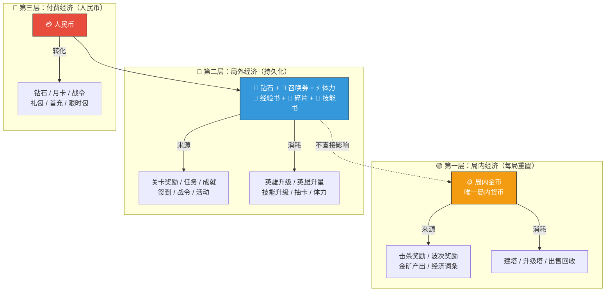
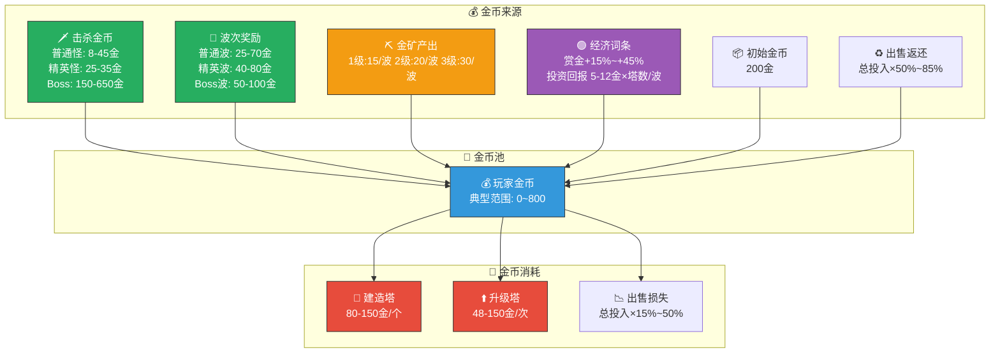
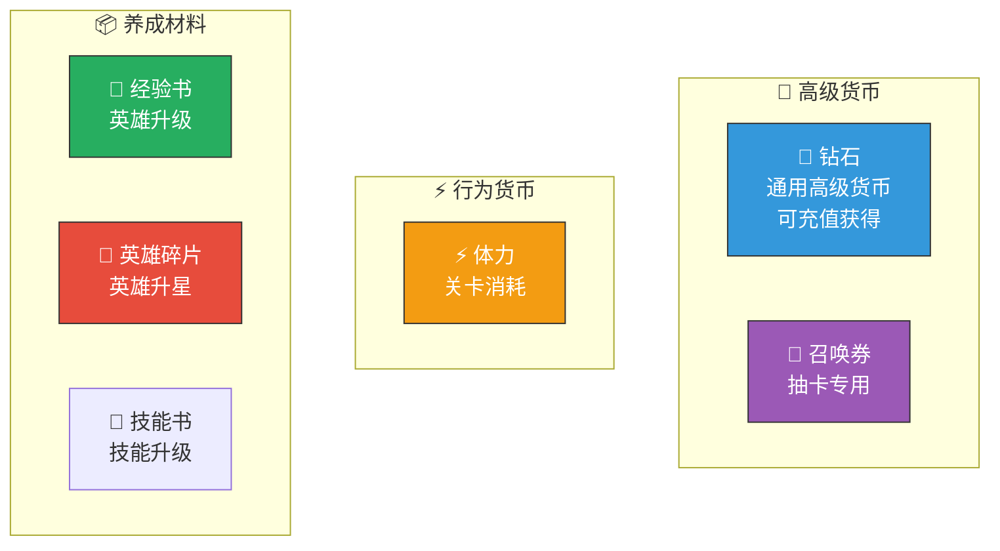
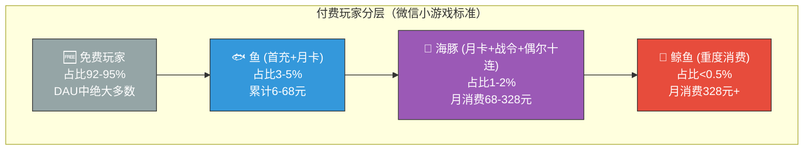
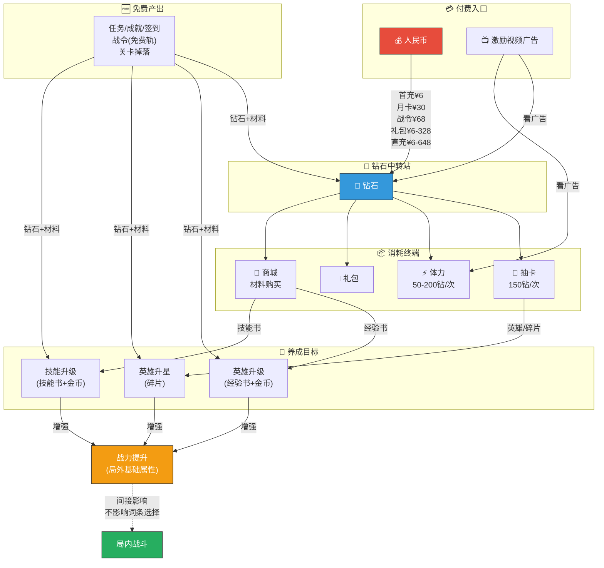
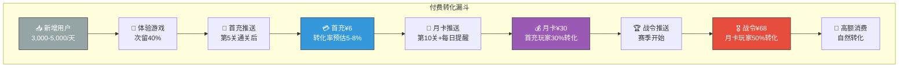
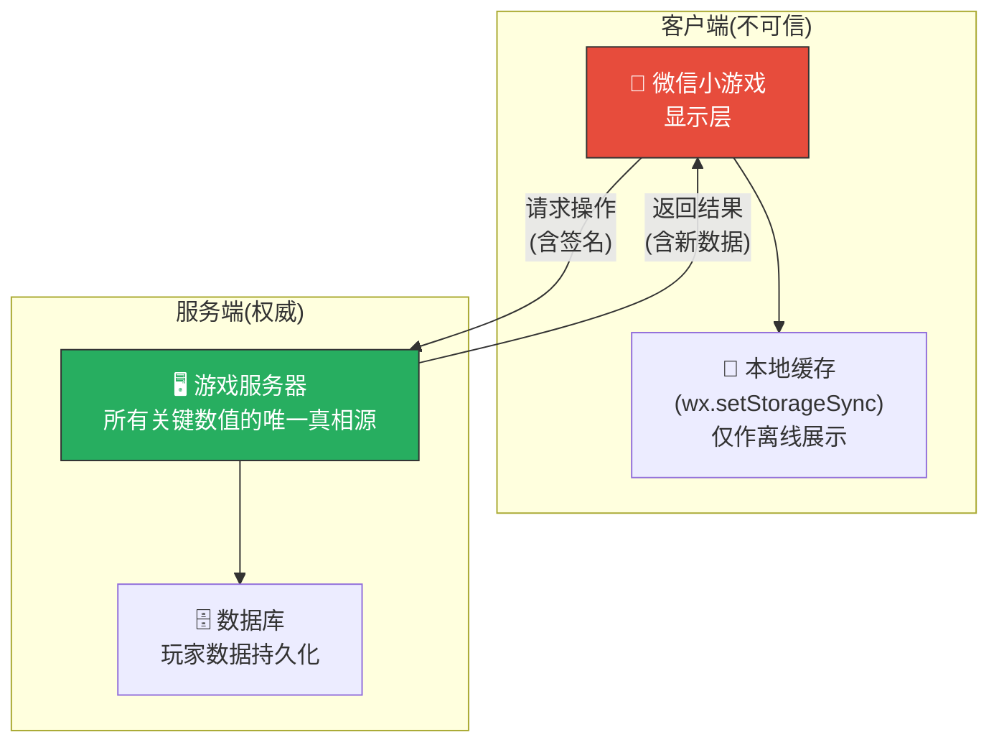
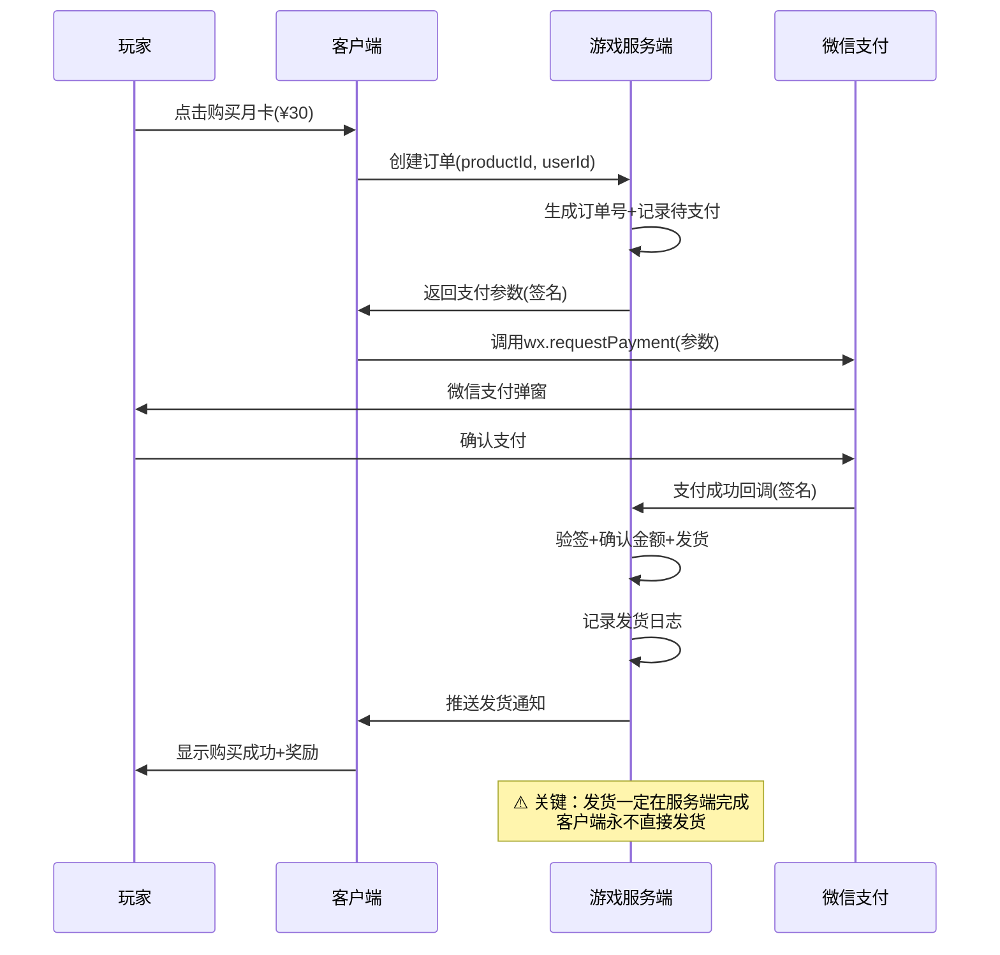


# 💰 AetheraSurvivors — 经济系统详细设计

> **文档版本**：v1.0
> **最后更新**：2026-03-24
> **交互编号**：阶段一 #9
> **前置依赖**：GDD.md（v1.0）、核心战斗循环设计.md（v1.0）、塔体系设计.md（v1.0）、怪物体系设计.md（v1.0）、Roguelike词条系统设计.md（v1.0）
> **验收标准**：✅ 完整的资源流向图 + ✅ 产出消耗比合理

---

## 一、经济系统设计哲学

### 1.1 核心设计原则

| 原则 | 说明 | 反面案例（避免） |
|------|------|----------------|
| **免费可玩** | 不花钱也能在合理时间内通关30章普通难度 | 付费墙——不充钱第5章就卡死 |
| **付费加速不P2W** | 付费加速养成进度，但不影响局内策略公平性 | 充钱直接买超强词条/塔——破坏策略乐趣 |
| **双循环独立** | 局内金币每局重置，局外资源跨局持久化，两套经济独立 | 局外资源能直接影响局内选词条——P2W |
| **资源不断档** | 每3-5关必有1次「资源充裕」感，避免长期贫穷感 | 连续10关没有任何收获感 |
| **付费卡点自然** | 在玩家「差一点」时推送付费（不是强制），保底有免费替代方案 | 弹窗逼氪——影响留存 |
| **通胀可控** | 每种资源都有明确的「水龙头」和「水池」，不会溢出 | 后期钻石溢出没处花——经济崩溃 |
| **付费深度分层** | 免费/小月卡/中氪/大R各有清晰体验差异 | 只有不充和充很多两种体验 |

### 1.2 经济系统三层架构



### 1.3 「付费加速不P2W」的边界定义

| 维度 | 付费可以做什么 | 付费不能做什么 |
|------|-------------|-------------|
| **局内战斗** | — | ❌ 不能购买局内金币/词条/直接跳波 |
| **英雄养成** | ✅ 加速升级/升星（更强基础属性） | ❌ 不能解锁独占的超强英雄（免费也能获得） |
| **塔永久升级** | ✅ 加速解锁塔的永久提升 | ❌ 不能解锁付费独占的塔 |
| **词条系统** | ✅ 天选者英雄4选1（免费抽卡可得） | ❌ 不能付费刷新词条/指定词条 |
| **体力** | ✅ 购买体力多玩几把 | ❌ 无限体力也只是玩更多，不是变更强 |
| **进度** | ✅ 30天达到免费玩家60天的养成度 | ❌ 不能跳过关卡/直达30章 |

---

## 二、局内经济详细设计

> 局内经济在核心战斗循环设计.md §五中已有基础框架，本节将其完善为完整的生产级设计。

### 2.1 局内资源：金币（Gold）

| 属性 | 值 |
|------|-----|
| **唯一性** | 局内唯一货币 |
| **生命周期** | 每局开始时获得初始金币，每局结束清零 |
| **精度** | 整数（无小数） |
| **显示位置** | 战斗界面右上角，始终可见 |
| **数值范围** | 0 ~ 9,999（理论上限） |
| **内存存储** | 加密存储（防止内存修改作弊） |

### 2.2 金币来源（水龙头）详细表

#### 2.2.1 击杀金币

| 怪物类型 | 基准金币(第1章) | 30章金币 | 章节递增公式 | 说明 |
|---------|----------------|---------|------------|------|
| 🗡️ 步兵 | 8 | 25 | `8 × (1 + (章-1)×0.06)` | 基准 |
| 🗡️ 刺客 | 10 | 28 | `10 × (1 + (章-1)×0.06)` | 略高（速度危险） |
| 🛡️ 骑士 | 15 | 45 | `15 × (1 + (章-1)×0.06)` | 高（血厚难打） |
| 🔮 法师兵 | 12 | 35 | `12 × (1 + (章-1)×0.06)` | 中等 |
| 🦅 飞行 | 12 | 35 | `12 × (1 + (章-1)×0.06)` | 中等 |
| 🩹 治疗者 | 30 | — | `30 × 精英倍率` | 精英固定 |
| 🟢 分裂(大) | 20 | — | 本体+小怪3×3=29 | 含分裂 |
| 👻 隐身盗贼 | 25 | — | 精英固定 | — |
| 🛡️ 护盾法师 | 35 | — | 最高精英 | — |
| 🐉 火龙Boss | 150 | 500 | `5000 × (1+(章-5)×0.15)²` 对应金币递增 | Boss击杀 |
| 🗿 石巨人Boss | 200 | 650 | 同上 | — |

#### 2.2.2 波次完成奖励

| 波次类型 | 基准奖励(第1章) | 30章奖励 | 递增公式 |
|---------|----------------|---------|---------|
| 普通波（前期） | 25 | 50 | `25 × (1 + (章-1)×0.03)` |
| 普通波（中期） | 30 | 60 | `30 × (1 + (章-1)×0.03)` |
| 普通波（后期） | 35 | 70 | `35 × (1 + (章-1)×0.03)` |
| 精英波 | 40 | 80 | `40 × (1 + (章-1)×0.03)` |
| Boss波 | 50 | 100 | `50 × (1 + (章-1)×0.03)` |

> **波次奖励递增比击杀金币慢**（0.03 vs 0.06），确保后期金币主要来自击杀而非固定奖励——鼓励玩家打光所有怪。

#### 2.2.3 金矿产出

| 金矿等级 | 产出/波 | 升级费用 | 累计花费 | 回本波次 |
|---------|---------|---------|---------|---------|
| 1级 | 15金/波 | 80(建造) | 80 | 5.3波 |
| 2级 | 20金/波 | +48 | 128 | 4.0波(增量) |
| 3级 | 30金/波 | +80 | 208 | 3.3波(增量) |

| 金矿词条 | 效果 | 对金矿产出的影响 |
|---------|------|----------------|
| E04 金矿强化(×1) | 产出+25% | 1级:18.8, 2级:25, 3级:37.5 |
| E04 金矿强化(×3) | 产出+75% | 1级:26.3, 2级:35, 3级:52.5 |
| E06 矿脉开发 | 上限+1, 升级费-30% | 多1个金矿=+15~30金/波 |
| E09 金币帝国 | 金矿+50% | 1级:22.5, 2级:30, 3级:45 |

#### 2.2.4 词条经济加成汇总

| 经济词条 | 影响来源 | 第1章标准局增量 | 第15章标准局增量 |
|---------|---------|---------------|---------------|
| E01 赏金猎人×1(+15%) | 击杀金币 | +168金 | +280金 |
| E02 折扣建造×1(-10%) | 建塔费 | 节省~120金 | 节省~150金 |
| E03 回收专家×1(50%→65%) | 出售回收 | +~50金(如出售2塔) | +~80金 |
| E04 金矿强化×1(+25%) | 金矿 | +34金(1矿9波) | +34金 |
| E05 投资回报×1(塔数×5金/波) | 波开始 | +225金(5塔×5×9波) | +315金(7塔) |
| E08 升级折扣×1(-20%) | 升级费 | 节省~80金 | 节省~120金 |

### 2.3 金币消耗（水池）详细表

#### 2.3.1 建塔费用

| 塔 | 建造费(1级) | 升2级 | 升3级 | 1级总计 | 满级总计 |
|----|-----------|-------|-------|--------|---------|
| 🏹 箭塔 | 100 | 60 | 100 | 100 | **260** |
| 🔮 法塔 | 120 | 72 | 120 | 120 | **312** |
| ❄️ 冰塔 | 80 | 48 | 80 | 80 | **208** |
| 💣 炮塔 | 150 | 90 | 150 | 150 | **390** |
| ☠️ 毒塔 | 100 | 60 | 100 | 100 | **260** |
| ⛏️ 金矿 | 80 | 48 | 80 | 80 | **208** |

#### 2.3.2 出售返还

| 规则 | 值 | 说明 |
|------|-----|------|
| 基础返还比例 | 50% | 返还总投入的50% |
| 词条「回收专家」×1 | 65% | — |
| 词条「回收专家」×2 | 75% | — |
| 词条「回收专家」×3 | 85% | 接近全返还 |
| 返还计算基准 | 总投入金币 | 含建造+所有升级费用 |
| 返还时机 | 即时 | 出售动画0.3秒，金币立即到账 |

#### 2.3.3 典型单局消耗预算（模板B，第5章普通难度）

| 时间段 | 操作 | 消耗 | 说明 |
|--------|------|------|------|
| 开局 | 放箭塔+冰塔 | 180 | 用完初始金(200-180=20) |
| 波1-2后 | 放法塔 | 120 | — |
| 波3后 | 升级箭塔→2级 | 60 | 核心塔升级 |
| 波4后 | 放炮塔 | 150 | — |
| 波5后 | 建金矿 | 80 | 中期投资 |
| 精英波后 | 升级箭塔→3级 | 100 | 质变时刻 |
| 波6后 | 升级法塔→2级 | 72 | — |
| 波7后 | 放第5个战斗塔 | ~110 | 补充 |
| Boss前 | 升级/微调 | ~150 | 最终准备 |
| **总消耗** | — | **~1,022** | — |

### 2.4 局内经济平衡验证（30章全覆盖）

#### 2.4.1 金币产出/消耗对比总表

| 章节 | 击杀金币(预估) | 波次奖励 | 金矿(1矿) | 初始金 | **总产出** | **预估消耗** | **盈余率** |
|------|--------------|---------|-----------|--------|----------|------------|----------|
| 第1章 | 1,120 | 295 | 135 | 200 | **1,750** | 1,520 | +15.1% |
| 第5章 | 1,390 | 316 | 135 | 200 | **2,041** | 1,780 | +14.7% |
| 第10章 | 1,730 | 340 | 135 | 200 | **2,405** | 2,120 | +13.4% |
| 第15章 | 2,070 | 368 | 135 | 200 | **2,773** | 2,480 | +11.8% |
| 第20章 | 2,410 | 395 | 135 | 200 | **3,140** | 2,860 | +9.8% |
| 第25章 | 2,750 | 423 | 135 | 200 | **3,508** | 3,260 | +7.6% |
| 第30章 | 3,090 | 450 | 135 | 200 | **3,875** | 3,680 | +5.3% |

> **盈余率递减设计**：后期盈余率从15%→5%，越来越紧凑。这是故意的——后期需要经济词条/金矿才能轻松通关，否则「刚好够用但不富裕」。

#### 2.4.2 关键经济检验点

```
=== 检验1: 第1波能放塔吗？ ===
初始金币: 200
最便宜2塔: 冰塔(80)+箭塔(100) = 180 ✅ 刚好够，剩20金

=== 检验2: 前3波能活下来吗？===
前3波总产出: 200+80+25+95+25 = 425
前3波合理消耗: 180(初始)+120(法塔)+60(升级) = 360
盈余: +65 → 紧凑但可行 ✅

=== 检验3: 何时能升3级？ ===
升级3级需额外100金(箭塔)
累计波5结束: ~845金产出, ~700金已消耗 → 剩余145金
可以在波5后升3级 ✅（正好是精英波前，体验好）

=== 检验4: 经济Build vs 标准Build总金差距 ===
经济Build(3矿+3经济词条): 约3,438金
标准Build(0矿): 约1,615金
差距: 2.13倍 → 可多建6个3级塔
体验差异明显但前期有风险 ✅

=== 检验5: Boss波前有余粮吗？ ===
标准Build Boss前累计产出: ~1,365
累计消耗: ~1,100
剩余: ~265金 → 足够做最后调整 ✅

=== 检验6: 第30章困难模式能通过吗？ ===
困难模式怪物×1.5倍属性
金币产出同普通（不因难度增加）
需要更高效的经济决策 + 词条加成才能达到足够DPS
→ 困难/噩梦是后期挑战，需要养成加持 ✅（设计预期）
```

### 2.5 局内金币流向图（完整版）



### 2.6 局内经济节奏设计

```
金币 ↑
(手持)
 400 ├         ●                     ●
     │        ╱ ╲                   ╱ ╲
 300 ├       ╱   ╲         ●      ╱   ╲              ●
     │      ╱     ╲       ╱ ╲    ╱     ╲            ╱ ╲
 200 ├─●   ╱       ╲     ╱   ╲  ╱       ╲     ●   ╱   ╲
     │  ╲ ╱         ╲   ╱     ╲╱         ╲   ╱ ╲ ╱     ╲
 100 ├   ●            ╲ ╱                 ╲ ╱   ●        ╲
     │  放塔            ●                   ●              ●
  50 ├                 放塔/升级            放塔/升级    Boss前调整
     │
   0 ├──┬──┬──┬──┬──┬──┬──┬──┬──→ 波次
     初始 1  2  3  4  5  精  6  7  Boss

🔑 关键节奏设计：
  • 波1-3: 紧绷期 → 每一金都珍贵
  • 波4-5: 小富裕 → 可以做1次升级决策
  • 精英波后: 大富裕 → 冲动消费窗口(升3级!)
  • Boss前: 适度盈余 → 允许最后调整
  • 永远不归零: 最低保持50+金 → 避免绝望感
```

---

## 三、局外经济详细设计

### 3.1 局外资源总览



### 3.2 💎 钻石（Diamond）——通用高级货币

#### 基本属性

| 属性 | 值 |
|------|-----|
| **定位** | 通用高级货币，联通免费和付费体系 |
| **获取** | 免费（任务/成就/战令/签到/关卡）+ 付费（充值） |
| **消耗** | 抽卡/体力购买/礼包/特殊购买 |
| **精度** | 整数 |
| **上限** | 无上限 |
| **内存存储** | 加密存储 + 服务端校验 |
| **核心兑换率** | 1元 ≈ 10钻石（月卡折算） |

#### 免费钻石产出渠道

| 渠道 | 日均产出 | 周均产出 | 月均产出 | 说明 |
|------|---------|---------|---------|------|
| 每日任务(5个) | 30 | 210 | 900 | 完成5个日常任务 |
| 活跃度宝箱 | 20 | 140 | 600 | 累计活跃度奖励 |
| 成就解锁 | ~5 | ~35 | ~150 | 长线收益，前期多后期少 |
| 新关首通奖励 | ~8 | ~56 | ~240 | 前期探索收益 |
| 战令(免费轨) | ~10 | ~70 | ~300 | 30天60级免费轨 |
| 签到(每日) | 10 | 70 | 300 | 每日签到奖励 |
| 看广告(3次/日) | 15 | 105 | 450 | 激励视频广告 |
| **免费日均合计** | **~98** | **~686** | **~2,940** | — |

> **设计意图**：免费玩家日均~100钻石，月均~3,000钻石。10连抽需要1,500钻 → 月均2次10连 → 合理节奏。

#### 钻石消耗渠道

| 消耗 | 单价 | 频率 | 月均消耗(免费) | 说明 |
|------|------|------|--------------|------|
| 抽卡(单抽) | 150钻 | 偶尔 | ~300 | 当月不抽10连时 |
| 抽卡(十连) | 1,500钻 | 2次/月 | 3,000 | 主要钻石消耗 |
| 体力购买 | 50钻/次(递增) | 1-2次/日 | 1,500-3,000 | 第二大消耗 |
| 限时礼包 | 100-500钻 | 偶尔 | ~300 | 高价值礼包 |
| **月均消耗** | — | — | **~3,000-5,000** | — |

> **关键平衡**：免费月产出~3,000 vs 月消耗~3,000-5,000 → 免费玩家「刚好不够」→ 看广告/月卡的动力。

#### 钻石产出/消耗平衡图

```
钻石 ↑
(月累计)
5000 ├                                    ★ 消耗曲线(含十连抽)
     │                              ╱ ★
4000 ├                        ╱ ★
     │                  ╱ ★         ● 产出曲线(纯免费)
3000 ├            ╱ ★         ╱ ●
     │      ╱ ★         ╱ ●
2000 ├ ╱ ★         ╱ ●
     │★       ╱ ●
1000 ├    ╱ ●
     │╱ ●
   0 ├──┬──┬──┬──→ 天数
     0  7  14 21 30

缺口 ≈ 800-2,000钻/月
→ 月卡(30天×100钻=3,000钻) 完美补充
→ 看广告(每天15钻×30=450钻) 部分补充
```

### 3.3 🎫 召唤券（Summon Ticket）——抽卡专用

| 属性 | 值 |
|------|-----|
| **定位** | 抽卡专用代币（不可转化为钻石） |
| **兑换** | 1张 = 1次抽卡（等价150钻） |
| **获取** | 任务奖励/活动奖励/战令奖励/商城兑换 |
| **不可获取** | 不可充值直购（只能通过钻石在商城兑换或活动获取） |

| 获取渠道 | 周均获取 | 月均获取 | 说明 |
|---------|---------|---------|------|
| 每周任务完成 | 2张 | 8张 | 完成周任务组 |
| 战令(免费轨) | 1张 | 4张 | 每周约1张 |
| 活动奖励 | ~1张 | ~4张 | 不固定 |
| 商城兑换(钻石) | 按需 | — | 150钻→1张(平价) |
| **月均获取** | — | **~16张** | ≈16次免费单抽 |

### 3.4 ⚡ 体力（Stamina）——游玩频率控制器

#### 基本属性

| 属性 | 值 |
|------|-----|
| **定位** | 控制每日游玩频率，平衡内容消耗速度 |
| **上限** | 120点 |
| **自然恢复** | 5分钟/1点（1小时12点，24小时288点） |
| **关卡消耗** | 6-10点/关（随章节递增） |
| **溢出规则** | 超过120的体力来自外部赠送（邮件/任务），不自然恢复但不消失 |

#### 体力消耗设计

| 章节 | 体力消耗/关 | 日均可玩关数(纯自然) | 说明 |
|------|-----------|-------------------|------|
| 第1-5章 | 6点 | ~48关 | 新手大量免费体验 |
| 第6-10章 | 7点 | ~41关 | 略减 |
| 第11-15章 | 8点 | ~36关 | 标准 |
| 第16-20章 | 8点 | ~36关 | 维持 |
| 第21-25章 | 9点 | ~32关 | 后期 |
| 第26-30章 | 10点 | ~28关 | 高难 |

> **日均28-48关**：按单局7分钟计算 = 每天3.3-5.6小时满体力消耗。大多数玩家每天玩30-60分钟（4-8关），体力充足不影响体验。

#### 体力获取渠道

| 渠道 | 获取量 | 频率 | 说明 |
|------|--------|------|------|
| 自然恢复 | 288点/天 | 持续 | 核心来源 |
| 每日任务 | 20点 | 1次/天 | 完成日常 |
| 好友赠送 | 10点/人 | 最多5人/天 | 社交留存 |
| 签到 | 30点 | 部分天数 | — |
| 看广告 | 30点 | 1次/天 | 激励视频 |
| 钻石购买 | 60点/次 | 每日上限3次 | 50/100/200钻(递增) |
| 月卡 | 20点/天 | 购买月卡 | — |
| **日均获取** | **~378点(免费)** | — | 含社交和广告 |

#### 体力购买价格递增

| 次数 | 价格 | 获得体力 | 每钻体力 | 说明 |
|------|------|---------|---------|------|
| 第1次/天 | 50钻 | 60点 | 1.2点/钻 | 性价比最高 |
| 第2次/天 | 100钻 | 60点 | 0.6点/钻 | 中等 |
| 第3次/天 | 200钻 | 60点 | 0.3点/钻 | 高价 |
| 第4次+ | 不可购买 | — | — | 硬上限 |

> **递增价格设计**：第1次便宜鼓励小额付费，第3次极贵限制大R无限刷。每日体力上限 = 288自然 + 20任务 + 50社交 + 30广告 + 180购买 = **568点** ≈ ~57-95关。

### 3.5 📕 经验书（EXP Book）——英雄升级材料

| 属性 | 值 |
|------|-----|
| **定位** | 英雄升级的主要消耗材料 |
| **品质** | 小经验书(100EXP) / 中经验书(500EXP) / 大经验书(2000EXP) |
| **获取** | 关卡掉落/每日任务/商城购买/活动 |
| **消耗** | 英雄升级（1-60级） |

#### 英雄升级消耗表

| 等级区间 | 每级所需EXP | 区间总EXP | 所需大经验书 | 说明 |
|---------|-----------|----------|------------|------|
| 1-10 | 200-500 | 3,500 | 2本 | 新手快速成长 |
| 11-20 | 600-1,200 | 9,000 | 5本 | 正常成长 |
| 21-30 | 1,500-2,500 | 20,000 | 10本 | 开始放缓 |
| 31-40 | 3,000-5,000 | 40,000 | 20本 | 明显放缓 |
| 41-50 | 6,000-10,000 | 80,000 | 40本 | 需要投入 |
| 51-60 | 12,000-20,000 | 160,000 | 80本 | 长线目标 |
| **总计** | — | **312,500** | **~157本** | — |

#### 经验书产出速度

| 渠道 | 日均(大书等价) | 月均 | 说明 |
|------|-------------|------|------|
| 关卡掉落(~8关/天) | ~3本 | 90本 | 主要来源 |
| 每日任务 | ~1本 | 30本 | — |
| 商城(钻石购买) | 按需 | — | 50钻/大书 |
| 活动 | ~0.5本 | ~15本 | 不固定 |
| **月均获取** | — | **~135本** | 免费 |

> **升级节奏**：月均135大书 → 月均可升~24级(前30级)，后期(31-60)需要约2个月。这与GDD目标用户「轻度付费玩家1-2个月满级」一致。

### 3.6 🧩 英雄碎片（Hero Fragment）——英雄升星材料

| 属性 | 值 |
|------|-----|
| **定位** | 英雄升星的核心材料 |
| **品类** | 通用碎片（任意英雄）+ 指定碎片（特定英雄） |
| **获取** | 抽卡重复/活动/商城/战令 |
| **消耗** | 英雄升星（1-6星） |

#### 英雄升星消耗表

| 升星 | 所需碎片(R英雄) | 所需碎片(SR英雄) | 所需碎片(SSR英雄) | 属性提升 |
|------|---------------|----------------|-----------------|---------|
| 1→2星 | 10 | 15 | 20 | +5%全属性 |
| 2→3星 | 20 | 30 | 50 | +10%全属性+解锁星级被动1 |
| 3→4星 | 40 | 60 | 100 | +15%全属性 |
| 4→5星 | 80 | 120 | 200 | +20%全属性+解锁星级被动2 |
| 5→6星 | 160 | 240 | 400 | +30%全属性+终极被动 |
| **总计** | **310** | **465** | **770** | — |

#### 碎片获取速度

| 渠道 | 月均获取(指定碎片) | 说明 |
|------|-----------------|------|
| 抽卡重复(R英雄) | ~30碎片 | 抽到重复R英雄=10碎片 |
| 抽卡重复(SR英雄) | ~10碎片 | 抽到重复SR英雄=30碎片 |
| 碎片商城 | ~20碎片 | 钻石/通用碎片兑换 |
| 活动奖励 | ~10碎片 | 不固定 |
| 战令(免费+付费) | ~15碎片 | 赛季奖励 |
| **月均合计(R英雄)** | **~50碎片** | 6星需~6.2个月(免费) |
| **月均合计(SSR英雄)** | **~25碎片** | 6星需~30个月(免费)/~8个月(付费) |

### 3.7 📗 技能书（Skill Book）——技能升级材料

| 属性 | 值 |
|------|-----|
| **定位** | 英雄技能升级材料 |
| **获取** | 关卡掉落/每日任务/活动/商城 |
| **消耗** | 技能升级（1-10级） |

| 技能等级 | 所需技能书 | 效果 |
|---------|----------|------|
| 1→2 | 5 | 技能数值+5% |
| 2→3 | 10 | 技能数值+5% |
| 3→4 | 15 | 技能数值+8% |
| 4→5 | 25 | 技能数值+8%, CD-5% |
| 5→6 | 35 | 技能数值+10% |
| 6→7 | 50 | 技能数值+10% |
| 7→8 | 70 | 技能数值+12%, CD-5% |
| 8→9 | 100 | 技能数值+12% |
| 9→10 | 150 | 技能数值+15%, CD-10% |
| **总计** | **460本** | — |

---

## 四、付费经济详细设计

### 4.1 付费层级模型



### 4.2 付费产品线详细设计

#### 4.2.1 首充（First Purchase）

| 属性 | 值 |
|------|-----|
| **价格** | ¥6 |
| **购买次数** | 1次（终身） |
| **内容** | SSR碎片×30 + 💎500钻石 + 🎫3召唤券 + ⚡120体力 |
| **价值倍率** | ~10倍（极高性价比吸引首充） |
| **目标** | 破冰——让0→1的付费行为发生 |
| **触发时机** | 第5关通关后推送（玩家已熟悉游戏+有一定投入感） |

#### 4.2.2 月卡（Monthly Card）

| 属性 | 值 |
|------|-----|
| **价格** | ¥30/月 |
| **内容** | 购买即得💎300钻 + 每日💎100钻 + ⚡20体力 |
| **30天总价值** | 300 + 100×30 + 20×30(体力价值~300钻) = 3,600钻等价 |
| **折算** | ~¥0.83/100钻（充值原价~¥1/10钻 → 3.6倍性价比） |
| **目标** | 日活留存驱动——每天必须上线领 |
| **触发时机** | 第10关通关后首次推送，此后每天登录提醒 |

#### 4.2.3 战令（Battle Pass）

| 属性 | 值 |
|------|-----|
| **价格** | ¥68/赛季（30天） |
| **结构** | 双轨奖励（免费轨 + 付费轨），共60级 |
| **每级所需经验** | 100战令经验（每日任务约给120经验=每天1.2级） |
| **满级时间** | ~25-28天（需要几乎每天完成日常） |
| **目标** | 赛季核心付费产品，驱动30天长线留存 |

##### 战令奖励表（每10级关键节点）

| 等级 | 免费轨奖励 | 付费轨额外奖励 |
|------|----------|-------------|
| 10级 | 💎100 + 📕中经验书×5 | 💎300 + 🎫召唤券×2 |
| 20级 | 📕大经验书×3 + 🧩通用碎片×10 | 🧩SR碎片×20 + 💎500 |
| 30级 | 💎200 + 📗技能书×5 | 专属头像框 + 📕大经验书×10 |
| 40级 | 🎫召唤券×3 + ⚡体力×100 | 💎800 + 🧩SSR碎片×10 |
| 50级 | 💎300 + 🧩通用碎片×20 | 专属称号 + 📗技能书×20 |
| 60级 | 📕大经验书×5 + 💎500 | **🧩SSR碎片×30** + 💎1,500 + 专属皮肤 |

##### 战令经济分析

| 指标 | 免费轨总价值 | 付费轨总价值 | 说明 |
|------|-----------|-----------|------|
| 钻石 | 1,100 | 3,100 | — |
| 召唤券(等价钻石) | 450(3张) | 750(5张) | — |
| 经验书 | ~3,000钻等价 | ~5,000钻等价 | — |
| 碎片 | ~1,500钻等价 | ~5,000钻等价 | — |
| 技能书 | ~1,000钻等价 | ~2,500钻等价 | — |
| 体力 | ~500钻等价 | — | — |
| **总等价钻石** | **~7,550钻** | **~16,350钻** | — |
| **付费轨性价比** | — | 16,350钻/68元 ≈ **¥0.42/100钻** | 约8倍性价比 |

#### 4.2.4 抽卡系统（Gacha）

| 属性 | 值 |
|------|-----|
| **单抽** | 150钻石 或 1张召唤券 |
| **十连** | 1,500钻石 或 10张召唤券 |
| **十连保底** | 必出SR以上 |
| **SSR保底** | 50次必出SSR（约7,500钻 = ~¥750） |
| **概率** | R:80% / SR:17% / SSR:3% |
| **重复机制** | 重复英雄自动转化为对应碎片（R:10/SR:30/SSR:80） |

##### 抽卡概率表

| 稀有度 | 单次概率 | 十连至少1个概率 | 50次至少1个概率 |
|--------|---------|---------------|---------------|
| R | 80% | ~99.9% | ~100% |
| SR | 17% | ~84.4% | ~99.97% |
| SSR | 3% | ~26.3% | ~78.2% |
| SSR(含保底) | — | — | **100%（50次保底）** |

##### 抽卡期望成本

| 目标 | 期望次数 | 期望钻石 | 期望人民币 |
|------|---------|---------|----------|
| 获得任意SR | ~5.9次 | 885钻 | ~¥88 |
| 获得任意SSR | ~33.3次 | 4,995钻 | ~¥500 |
| SSR保底触发 | 50次 | 7,500钻 | ~¥750 |
| SSR满6星 | ~1,500次(考虑碎片) | 225,000钻 | ~¥22,500 |

> **设计原则**：保底50次是硬保底，不会让玩家无限投入还没有SSR。SSR满6星是超长期目标（约2年免费 / 付费大幅缩短）。

#### 4.2.5 限时礼包系统

| 礼包 | 价格 | 内容 | 触发条件 | 性价比 |
|------|------|------|---------|--------|
| **新手礼包** | ¥6 | 💎300+📕大经验书×3+⚡100 | 注册3天内 | 5倍 |
| **升级礼包** | ¥12 | 💎500+📕大经验书×5+🧩通用碎片×20 | 英雄达到20级 | 4倍 |
| **进阶礼包** | ¥30 | 💎1,000+🎫召唤券×5+📗技能书×10 | 通关第10章 | 4倍 |
| **精英礼包** | ¥68 | 💎2,000+🧩SR碎片×50+📕大经验书×20 | 通关第20章 | 3.5倍 |
| **周末特惠** | ¥18 | 💎600+⚡200+📕中经验书×20 | 每周末限时 | 3倍 |
| **月度大礼包** | ¥128 | 💎5,000+🎫十连×1+🧩SSR碎片×20 | 每月1次 | 3倍 |
| **鲸鱼礼包** | ¥328 | 💎15,000+🎫十连×3+全材料大量 | 累计充值达标 | 2.5倍 |

#### 4.2.6 钻石直充包

| 金额 | 钻石 | 单位价格 | 首充翻倍 | 说明 |
|------|------|---------|---------|------|
| ¥6 | 60 | ¥10/100钻 | 120 | 最小充值 |
| ¥30 | 300 | ¥10/100钻 | 600 | 标准 |
| ¥68 | 680 | ¥10/100钻 | 1,360 | — |
| ¥128 | 1,280 | ¥10/100钻 | 2,560 | — |
| ¥328 | 3,600 | ¥9.1/100钻 | 7,200 | 大额折扣 |
| ¥648 | 7,500 | ¥8.6/100钻 | 15,000 | 最大额 |

> **首充翻倍**：每个档位首次购买钻石×2（终身每档限1次）。

### 4.3 广告变现设计

| 广告位 | 类型 | 触发时机 | 奖励 | 每日上限 | 说明 |
|--------|------|---------|------|---------|------|
| **战斗加速** | 激励视频 | 通关后（可选） | 奖励×2 | 5次/天 | 核心广告位 |
| **免费抽卡** | 激励视频 | 抽卡界面 | 免费单抽×1 | 1次/天 | 高eCPM |
| **体力恢复** | 激励视频 | 体力不足时 | 30体力 | 1次/天 | — |
| **钻石奖励** | 激励视频 | 签到界面 | 5钻石 | 3次/天 | — |
| **词条刷新** | 激励视频（预留） | 词条选择时 | 刷新3张词条 | 1次/局 | 后续版本考虑 |
| **插屏广告** | 插屏 | 返回主界面 | — | 3次/天 | 非核心路径 |

#### 广告收入预估

| 广告类型 | eCPM（预估） | 日均展示(DAU 8,500) | 日均收入 |
|---------|------------|-------------------|---------|
| 激励视频 | ¥40-80 | ~25,000次(人均~3次) | ¥1,000-2,000 |
| 插屏广告 | ¥15-30 | ~8,500次(人均~1次) | ¥130-255 |
| **合计** | — | — | **¥1,130-2,255/天** |

### 4.4 付费完整资源流向图



---

## 五、通胀控制系统

### 5.1 通胀控制矩阵

| 资源 | 水龙头(产出) | 水池(消耗) | 溢出风险 | 控制手段 |
|------|------------|----------|---------|---------|
| 💎 钻石 | 免费~100/天+付费 | 抽卡+体力+商城 | ⚠️ 中（后期消耗点减少） | 新英雄/新赛季不断刷新消耗需求 |
| ⚡ 体力 | 288/天自然+外部 | 每关6-10 | ✅ 低（有上限120） | 自然恢复有上限 |
| 📕 经验书 | ~4大书/天 | 升级消耗指数增长 | ✅ 低（60级需很久） | 升级曲线后期极陡 |
| 🧩 碎片 | 抽卡+活动+商城 | 升星消耗指数增长 | ✅ 低（6星需大量） | 升星需求远超产出 |
| 📗 技能书 | ~2本/天 | 技能10级需460本 | ✅ 低（10级需230天） | 后期稀缺 |
| 🎫 召唤券 | ~4张/周 | 抽卡1:1消耗 | ✅ 低（不可囤积太多） | 限时活动提供消耗动力 |

### 5.2 长线通胀应对策略

| 风险 | 触发条件 | 应对方案 |
|------|---------|---------|
| **钻石溢出** | 免费老玩家3个月后钻石无处花 | 每赛季新英雄+新皮肤+限时商城 |
| **经验书溢出** | 6个英雄全60级后 | 新英雄发布消耗存量 |
| **碎片不足** | SSR碎片需求极高 | 碎片商城+活动提供稳定少量渠道 |
| **体力无感** | 老玩家不再缺体力 | 后期挑战模式消耗更多体力 |
| **养成到顶** | 全英雄满级满星满技能 | 需要6个月+的持续投入，在此之前发布新英雄 |

### 5.3 赛季重置机制

| 重置内容 | 周期 | 说明 |
|---------|------|------|
| 战令等级 | 30天 | 每赛季重置，需重新升级 |
| 排行榜 | 7天/30天 | 周排行+赛季排行重置 |
| 限时商城 | 30天 | 赛季限定商品轮换 |
| 活动 | 不定期 | 主题活动驱动消耗 |
| **不重置** | — | 英雄等级/星级/技能/钻石余额 |

### 5.4 资源溢出紧急预案

```
如果检测到以下指标异常，触发调控：

1. 平均玩家钻石余额 > 日均产出×30（即1个月产出未消耗）
   → 投放限时高价值礼包/新皮肤消耗钻石

2. 前10%玩家经验书存量 > 100大书
   → 投放新英雄消耗存量

3. 抽卡SSR获取率过高（因保底叠加）
   → 新赛季新SSR英雄保持稀缺性

4. DAU下降但ARPU上升
   → 免费玩家流失信号 → 加大免费福利
```

---

## 六、付费定价策略

### 6.1 定价心理学设计

| 策略 | 实现方式 | 心理学原理 |
|------|---------|----------|
| **锚定效应** | 直充¥10/100钻作为锚，月卡¥30/3000钻体现「超值」 | 对比效应 |
| **首充破冰** | ¥6极低门槛+10倍性价比 | 行为惯性（花过1次后更容易花第2次） |
| **损失厌恶** | 月卡必须每天领取（不领会「亏」） | 损失>获得的心理权重 |
| **倒计时稀缺** | 限时礼包3天倒计时 | 稀缺性原理 |
| **阶梯收益递减** | 体力购买价格递增 | 边际效用递减感知 |
| **免费试用** | 战令免费轨让玩家「尝到甜头」后推付费轨 | 禀赋效应 |
| **社交攀比** | 排行榜+好友战力对比 | 社会比较理论 |

### 6.2 各层级玩家月消费预估

| 玩家类型 | 占比 | 月消费 | 主要购买 | 月ARPU贡献 |
|---------|------|--------|---------|-----------|
| 🆓 免费 | 93% | ¥0 | — | ¥0 |
| 🐟 鱼 | 4% | ¥30-68 | 月卡/战令 | ¥1.2-2.7 |
| 🐬 海豚 | 2% | ¥100-300 | 月卡+战令+礼包+十连 | ¥2.0-6.0 |
| 🐋 鲸鱼 | 1% | ¥500+ | 全部+大额直充 | ¥5.0+ |
| **加权ARPU** | — | — | — | **¥4.2-6.7** |

> **月流水目标验证**：DAU 8,500 × ARPU ¥4.2 × 30天 = **¥107万/月** ✅（与GDD KPI目标一致）

### 6.3 付费漏斗设计



| 漏斗节点 | 预估转化率 | 日均人数(基于3000新增) | 说明 |
|---------|----------|---------------------|------|
| 新增→次日留存 | 40% | 1,200 | — |
| 留存→体验首充推送 | ~80% | 960 | 大部分人打到第5关 |
| 推送→首充 | 5-8% | 48-77人 | — |
| 首充→月卡 | 30% | 14-23人 | — |
| 月卡→战令 | 50% | 7-12人 | — |
| 战令→鲸鱼 | 10% | 1-2人 | — |

---

## 七、30天新玩家资源曲线

### 7.1 免费新玩家30天资源获取模拟

| 天数 | 累计钻石 | 累计大经验书 | 累计碎片(通用) | 累计抽卡次数 | 英雄等级(1号) | 进度 |
|------|---------|------------|-------------|------------|-------------|------|
| 1天 | 200(新手) | 5 | 0 | 1(首次免费) | 5 | 第1章 |
| 3天 | 500 | 12 | 5 | 3 | 10 | 第2章 |
| 7天 | 1,200 | 30 | 15 | 8 | 18 | 第4章 |
| 14天 | 2,600 | 60 | 30 | 16 | 28 | 第8章 |
| 21天 | 4,000 | 90 | 50 | 24 | 35 | 第12章 |
| 30天 | 5,500 | 125 | 70 | 35 | 42 | 第16章 |

### 7.2 月卡玩家30天资源获取模拟

| 天数 | 累计钻石 | 累计大经验书 | 累计碎片 | 累计抽卡次数 | 英雄等级(1号) | 进度 |
|------|---------|------------|---------|------------|-------------|------|
| 1天 | 500(首充+月卡即时) | 8 | 30(首充SSR碎片) | 3(首充券) | 8 | 第2章 |
| 7天 | 2,200 | 38 | 40 | 14 | 22 | 第5章 |
| 14天 | 4,200 | 72 | 55 | 26 | 32 | 第10章 |
| 30天 | 8,600 | 150 | 90 | 55(已触发SSR保底) | 48 | 第20章 |

> **月卡玩家30天 vs 免费玩家30天**：
> - 钻石：8,600 vs 5,500（+56%）
> - 抽卡：55次 vs 35次（+57%，月卡玩家已触发SSR保底）
> - 英雄等级：48 vs 42（+14%）
> - 进度：第20章 vs 第16章（快约4章 ≈ 加速25%）
> - **符合「付费加速不P2W」原则**：差距在25-60%范围，明显但不碾压。

### 7.3 资源充裕感节点设计

| 天数/进度 | 资源充裕感事件 | 心理效果 |
|---------|-------------|---------|
| 第1天 | 新手奖励大量体力+钻石 | 「好多东西可以用！」 |
| 第3天 | 首次十连抽（积累钻石） | 「抽到了SR英雄！」 |
| 第5关 | 获赠精灵射手 + 首充推送 | 「多了一个新英雄！」 |
| 第7天 | 签到累计奖励 | 「签了7天值了」 |
| 第10章 | 通关奖励 + 解锁困难模式 | 「困难模式挑战！」 |
| 第14天 | 第二次十连（可能已有2-3个SR） | 「阵容逐渐丰富」 |
| 第20章 | 大量通关奖励 | 「中期里程碑！」 |
| 第30天 | 赛季结算 + 战令奖励 | 「一个月的累积成果」 |

---

## 八、反作弊与安全设计

### 8.1 经济安全风险与对策

| 风险 | 严重程度 | 对策 |
|------|---------|------|
| **局内金币修改** | 🔴 高 | 内存加密存储(EncryptedInt)，服务端不信任客户端金币数据 |
| **钻石修改** | 🔴 高 | 服务端存储+签名校验，客户端显示值来自服务端 |
| **体力修改** | 🟡 中 | 服务端时间戳计算恢复，客户端不可自行增加 |
| **付费绕过** | 🔴 高 | 微信支付服务端验签+发货流程在服务端完成 |
| **抽卡结果修改** | 🔴 高 | 抽卡逻辑在服务端执行，客户端只负责展示 |
| **广告刷量** | 🟡 中 | 每日广告次数限制+服务端校验广告回调 |
| **加速刷关** | 🟡 中 | 关卡通关时间验证（不可能30秒通关7分钟的关卡） |

### 8.2 关键数值存储架构



| 数据 | 存储位置 | 加密方式 | 说明 |
|------|---------|---------|------|
| 💎 钻石余额 | 服务端 | AES加密+签名 | 绝不信任客户端 |
| 🧩 碎片/材料 | 服务端 | 同上 | — |
| 🦸 英雄数据 | 服务端 | 同上 | — |
| ⚡ 体力 | 服务端(时间戳) | 恢复计算在服务端 | — |
| 🪙 局内金币 | 客户端(加密) | EncryptedInt | 局内数据不上报，但通关结算校验 |
| 📊 通关结果 | 客户端→服务端 | 签名校验 | 防止伪造通关 |

### 8.3 支付安全流程



---

## 九、经济系统数据配置格式

### 9.1 局内经济配置JSON

```json
{
  "inGameEconomy": {
    "initialGold": 200,
    "killGold": {
      "infantry": {"base": 8, "chapterScale": 0.06},
      "assassin": {"base": 10, "chapterScale": 0.06},
      "knight": {"base": 15, "chapterScale": 0.06},
      "mage": {"base": 12, "chapterScale": 0.06},
      "flyer": {"base": 12, "chapterScale": 0.06},
      "elite_healer": {"base": 30},
      "elite_slime": {"base": 20, "splitChildGold": 3},
      "elite_rogue": {"base": 25},
      "elite_shield": {"base": 35},
      "boss_dragon": {"base": 150},
      "boss_colossus": {"base": 200}
    },
    "waveReward": {
      "normalEarly": {"base": 25, "chapterScale": 0.03},
      "normalMid": {"base": 30, "chapterScale": 0.03},
      "normalLate": {"base": 35, "chapterScale": 0.03},
      "elite": {"base": 40, "chapterScale": 0.03},
      "boss": {"base": 50, "chapterScale": 0.03}
    },
    "sellRatio": {
      "base": 0.5,
      "perkBonus": [0.15, 0.25, 0.35]
    }
  }
}
```

### 9.2 局外经济配置JSON

```json
{
  "outerEconomy": {
    "stamina": {
      "maxCap": 120,
      "regenRate": 1,
      "regenInterval": 300,
      "costPerLevel": {
        "chapter1_5": 6,
        "chapter6_10": 7,
        "chapter11_15": 8,
        "chapter16_20": 8,
        "chapter21_25": 9,
        "chapter26_30": 10
      },
      "buyPrices": [50, 100, 200],
      "buyAmount": 60,
      "dailyBuyLimit": 3
    },
    "diamond": {
      "dailyQuest": 30,
      "activityBox": 20,
      "dailySign": 10,
      "adReward": 5,
      "adDailyLimit": 3
    },
    "gacha": {
      "singleCost": 150,
      "tenCost": 1500,
      "rates": {
        "R": 0.80,
        "SR": 0.17,
        "SSR": 0.03
      },
      "pity": {
        "SR_guarantee_in_ten": true,
        "SSR_hard_pity": 50
      },
      "duplicate": {
        "R_fragments": 10,
        "SR_fragments": 30,
        "SSR_fragments": 80
      }
    }
  }
}
```

### 9.3 付费产品配置JSON

```json
{
  "iap": {
    "firstPurchase": {
      "productId": "first_purchase_6",
      "price": 6,
      "rewards": {
        "diamond": 500,
        "summonTicket": 3,
        "stamina": 120,
        "ssrFragment": 30
      },
      "maxPurchase": 1,
      "triggerCondition": "chapter5_clear"
    },
    "monthlyCard": {
      "productId": "monthly_card_30",
      "price": 30,
      "duration": 30,
      "instantReward": {"diamond": 300},
      "dailyReward": {"diamond": 100, "stamina": 20},
      "triggerCondition": "chapter10_clear"
    },
    "battlePass": {
      "productId": "battle_pass_68",
      "price": 68,
      "duration": 30,
      "maxLevel": 60,
      "expPerLevel": 100,
      "dailyExpFromQuests": 120
    },
    "directPurchase": [
      {"productId": "diamond_6", "price": 6, "diamond": 60, "firstDouble": true},
      {"productId": "diamond_30", "price": 30, "diamond": 300, "firstDouble": true},
      {"productId": "diamond_68", "price": 68, "diamond": 680, "firstDouble": true},
      {"productId": "diamond_128", "price": 128, "diamond": 1280, "firstDouble": true},
      {"productId": "diamond_328", "price": 328, "diamond": 3600, "firstDouble": true},
      {"productId": "diamond_648", "price": 648, "diamond": 7500, "firstDouble": true}
    ]
  }
}
```

---

## 十、经济系统KPI指标

### 10.1 核心经济指标

| 指标 | 目标值 | 监控频率 | 异常阈值 |
|------|--------|---------|---------|
| **付费率** | 5-8% | 日 | <3% 需加大免费体验/推送优化 |
| **ARPPU** | ¥50-80 | 周 | <¥30 需优化付费产品 |
| **ARPU** | ¥4.0+ | 月 | <¥3.0 需优化商业化 |
| **月卡购买率(付费中)** | ≥70% | 月 | <50% 月卡性价比不足 |
| **战令购买率(月卡中)** | ≥50% | 赛季 | <30% 战令内容不够吸引 |
| **广告人均次数** | 2-3次/天 | 日 | <1次 奖励不够吸引 / >5次 影响体验 |
| **体力购买率** | 15-25% | 日 | <10% 体力太充足 / >40% 体力太紧缺 |
| **钻石人均余额** | 500-1500 | 周 | >3000 消耗不足(通胀) / <200 产出不足 |
| **首充转化率** | 5-8% | 日 | <3% 需优化首充包 |
| **次日留存(付费)** | ≥60% | 日 | <50% 付费体验差 |

### 10.2 经济健康度仪表盘

```
=== 经济健康度实时监控 ===

┌──────────────────────────────────────────┐
│ 💎 钻石生态                              │
│  人均余额: 850 (✅ 健康)                  │
│  日产出/消耗比: 0.95 (✅ 微不足=购买动力)  │
│  付费/免费产出比: 1:3.2 (✅ 免费为主)      │
├──────────────────────────────────────────┤
│ ⚡ 体力生态                              │
│  平均消耗率: 72% (✅ 大部分用完)           │
│  购买率: 18% (✅ 适度)                    │
│  溢出率: 15% (✅ 少量溢出可接受)           │
├──────────────────────────────────────────┤
│ 🎰 抽卡生态                              │
│  月均抽卡次数: 22次 (✅ 2次十连+2单抽)     │
│  SSR获取率: 4.8% (✅ 含保底在预期内)       │
│  碎片转化率: 35% (✅ 重复转碎片正常)       │
├──────────────────────────────────────────┤
│ 📊 付费生态                              │
│  付费率: 6.2% (✅ 达标)                   │
│  ARPPU: ¥62 (✅ 健康)                    │
│  月卡续费率: 65% (⚠️ 略低，需优化)        │
└──────────────────────────────────────────┘
```

---

## 十一、统计汇总与验收自检

### 11.1 资源体系数量统计

| 资源类型 | 数量 | 列表 |
|---------|------|------|
| 局内资源 | 1种 | 金币 |
| 局外高级货币 | 2种 | 钻石、召唤券 |
| 局外行为货币 | 1种 | 体力 |
| 局外养成材料 | 3种 | 经验书、碎片、技能书 |
| 付费产品 | 5类 | 首充、月卡、战令、抽卡、礼包/直充 |
| **总计** | 7种资源 + 5类产品 | — |

### 11.2 验收标准自检

| 验收标准 | 要求 | 实际 | 状态 |
|---------|------|------|------|
| ✅ 完整的资源流向图 | 有完整流向图 | 局内金币流向图+付费完整流向图+30天曲线 | ✅ |
| ✅ 产出消耗比合理 | 比例合理 | 局内盈余5-15%+局外钻石缺口800-2000/月 | ✅ |
| 局内经济 | 有完整设计 | 6个来源+3个消耗+30章全覆盖验证 | ✅ |
| 局外经济 | 有完整设计 | 7种资源详细产出/消耗表+30天模拟 | ✅ |
| 付费货币 | 有付费体系 | 5类付费产品+定价心理学+漏斗分析 | ✅ |
| 通胀控制 | 有控制手段 | 6种资源通胀矩阵+赛季重置+紧急预案 | ✅ |
| 反作弊 | 有安全设计 | 服务端权威+内存加密+支付验签 | ✅ |
| 月流水验证 | 达标 | DAU 8,500×ARPU ¥4.2×30=¥107万 ✅ | ✅ |

### 11.3 与前置文档一致性校验

| 对照项 | 前置文档 | 本文档 | 一致性 |
|--------|---------|--------|--------|
| 局内金币来源/消耗 | 核心战斗循环 §五 | 完全引用+扩展30章验证 | ✅ |
| 塔建造/升级费用 | 塔体系设计 §三 | 完全一致 | ✅ |
| 怪物击杀金币 | 怪物体系设计 §二-§四 | 完全一致 | ✅ |
| 经济词条效果 | 词条系统设计 §4.3 | 完全一致（9个词条） | ✅ |
| 英雄养成消耗 | GDD §六 | 扩展为详细升级/升星表 | ✅ |
| 付费定价骨架 | GDD §8.4 | 完全一致+详细展开 | ✅ |
| KPI目标 | GDD §十五 | 月流水/付费率/ARPU 一致 | ✅ |
| 安全约束 | 技术约束清单 | 加密/验签/服务端架构一致 | ✅ |

---

## 十二、附录

### 12.1 后续待办

| 待办 | 交互编号 | 说明 |
|------|---------|------|
| 经济数值精确表 | #22 | 30天资源曲线CSV |
| 30天数值模拟 | #23 | Python脚本验证经济平衡 |
| 付费点位UI设计 | #12-14 | 商城/抽卡/月卡界面 |
| 服务端支付流程 | 阶段四 | 微信支付+验签实现 |
| A/B测试框架 | 阶段六 | 定价/礼包A/B测试 |
| 反作弊实现 | 阶段二 | EncryptedInt+服务端校验代码 |

### 12.2 设计变更日志

| 日期 | 变更 | 原因 |
|------|------|------|
| v1.0 | 初始经济系统详细设计 | 阶段一 #9 |

---

> 📝 **文档维护规则**：
> 1. 本文档为GDD第八章「经济系统」的详细展开
> 2. 局内金币数值与核心战斗循环设计.md §五完全对齐，修改需同步
> 3. 塔费用与塔体系设计.md §三对齐
> 4. 击杀金币与怪物体系设计.md §二-§四对齐
> 5. 经济词条效果与Roguelike词条系统设计.md §4.3对齐
> 6. 付费定价调整需同步更新月流水预估和KPI验证
> 7. 所有关键数值的精确调参将在#22/#23中通过Python模拟验证
