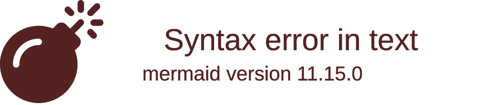
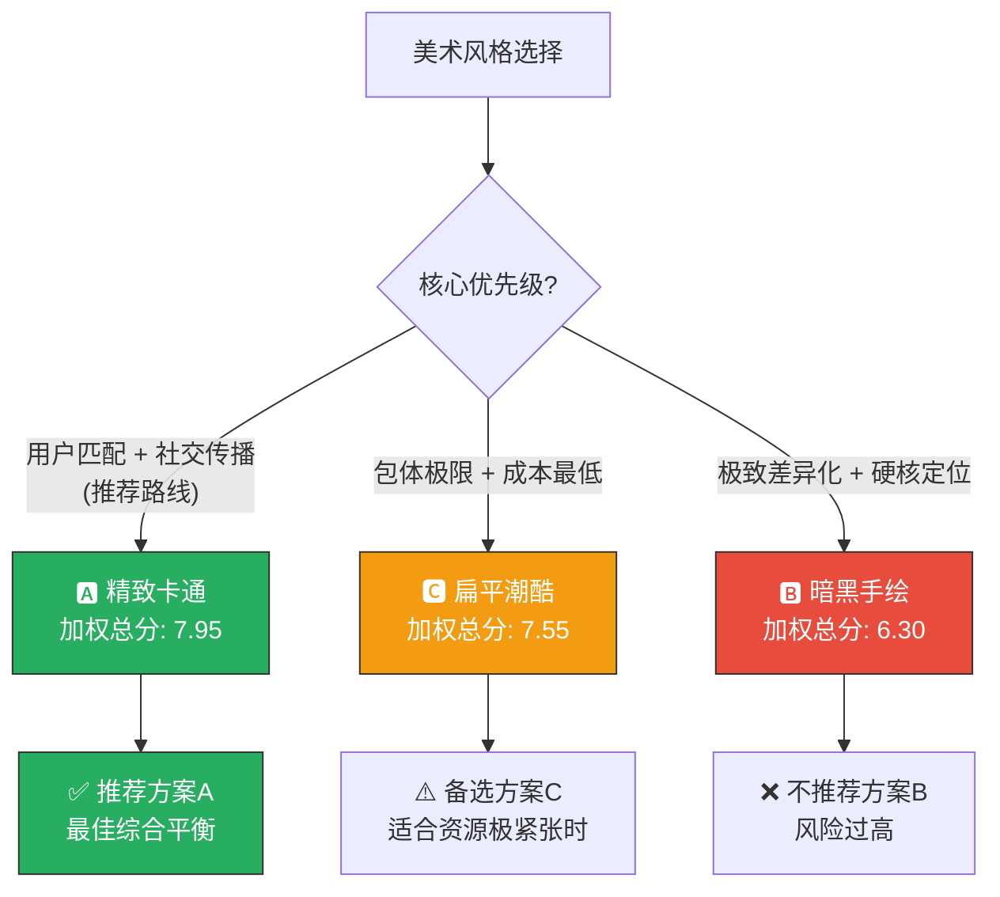


# 🎨 AetheraSurvivors — 美术风格方案（#12）

> **文档版本**：v1.0
> **最后更新**：2026-03-24
> **交互编号**：阶段一 #12
> **前置依赖**：GDD.md（v1.0 §十一 美术风格方向骨架）、竞品分析（12款）
> **验收标准**：3种方案有风格关键词、色调、参考游戏

---

## 一、美术风格设计约束

### 1.1 硬性约束（来自技术约束 + 目标平台）

| 约束 | 要求 | 原因 |
|------|------|------|
| **2D为主** | 全部角色/塔/怪物/地图使用2D精灵（Sprite） | 微信小游戏主包<4MB，3D模型占用过大 |
| **图集管理** | 所有同类资源合入SpriteAtlas（单张≤2048×2048） | DrawCall<50，合批优化 |
| **运行内存** | 总美术资源内存占用<80MB（256MB预算的30%） | 运行内存限制<256MB |
| **动画方式** | 序列帧 / Spine 2D 骨骼动画 | 骨骼动画节省包体，序列帧简单直观 |
| **分辨率** | 设计基准720×1280（竖屏），支持刘海屏适配 | 微信小游戏标准 |
| **特效** | 粒子系统+序列帧特效混合，同屏粒子<200个 | 性能限制 |
| **字体** | 使用BMFont位图字体（中文常用3000字） | WebGL不支持系统字体动态渲染 |

### 1.2 目标用户审美偏好（基于用户画像）

| 维度 | 偏好 | 来源 |
|------|------|------|
| **年龄段** | 25-40岁男性为主（70%） | GDD §1.1 |
| **审美偏好** | 偏好精致感而非Q版低龄，接受卡通但排斥过于幼稚 | 竞品分析：此年龄段用户更接受皇室战争风格而非Candy Crush风格 |
| **色彩偏好** | 偏好鲜明对比+适度饱和，不喜欢灰暗沉闷 | 微信小游戏用户碎片化场景，需要第一眼抓眼球 |
| **品质感** | 期待"小游戏但不廉价"的品质感 | 塔防类竞品用户反馈 |
| **文化偏好** | 接受西方魔幻/奇幻元素（项目世界观为西方奇幻类） | 项目定位 |

### 1.3 竞品美术参考分析

| 竞品 | 风格 | 优点 | 缺点 | 对本项目参考价值 |
|------|------|------|------|----------------|
| 皇室战争 | 精致卡通3D→2D渲染 | 辨识度极高，全球通用 | 3D制作成本高 | ⭐⭐⭐⭐⭐ 色彩+比例参考 |
| 随机点防御 | 像素风+霓虹配色 | 包体极小，风格独特 | 不适合25-40岁主流审美 | ⭐⭐ 配色参考 |
| 王国保卫战 | 手绘卡通风 | 有质感，不低龄 | 单帧美术量大 | ⭐⭐⭐⭐ 整体调性参考 |
| 弓箭传说 | 扁平简约风 | 极度包体友好 | 略显廉价 | ⭐⭐⭐ 简约元素参考 |
| 明日方舟 | 日系精致风 | 品质感极强 | 制作成本过高 | ⭐⭐ 品质标杆 |
| 部落冲突 | 欧美卡通风 | 全球认知度 | 偏低龄 | ⭐⭐⭐ 角色设计参考 |

---

## 二、三种美术风格方案

### 2.1 方案总览对比

| 维度 | 🅰️ 方案A「精致卡通」 | 🅱️ 方案B「暗黑手绘」 | 🅲️ 方案C「扁平潮酷」 |
|------|-------------------|--------------------|-------------------|
| **一句话定位** | 皇室战争式明亮精致卡通 | 暗黑地牢式手绘质感 | 现代潮流扁平+霓虹点缀 |
| **风格关键词** | 精致、明亮、活力、亲和、高辨识 | 硬核、质感、暗黑、手绘、沉浸 | 潮酷、简约、霓虹、现代、轻量 |
| **色调** | 高饱和暖色系（金+绿+蓝+红） | 低饱和冷色系（深蓝+棕+暗红+金） | 中饱和撞色系（蓝紫+荧光绿+白+黑） |
| **参考游戏** | 皇室战争、王国保卫战、部落冲突 | 暗黑地牢、墓园守护者、恶魔塔防 | 弓箭传说、贪吃蛇大作战、几何冲刺 |
| **目标受众匹配** | ⭐⭐⭐⭐⭐ 25-40岁主流 | ⭐⭐⭐⭐ 偏硬核30-40岁 | ⭐⭐⭐ 偏年轻20-30岁 |
| **包体友好度** | ⭐⭐⭐⭐ 中高 | ⭐⭐⭐ 中（手绘纹理较大） | ⭐⭐⭐⭐⭐ 极高（扁平矢量） |
| **辨识度** | ⭐⭐⭐⭐ 高（但市面同类多） | ⭐⭐⭐⭐⭐ 极高（差异化强） | ⭐⭐⭐⭐ 高（潮流但可能同质） |
| **制作成本** | ⭐⭐⭐ 中等 | ⭐⭐ 较高（手绘工时长） | ⭐⭐⭐⭐⭐ 最低（扁平易量产） |
| **微信生态适配** | ⭐⭐⭐⭐⭐ 最佳 | ⭐⭐⭐ 中等（偏硬核可能劝退轻度玩家） | ⭐⭐⭐⭐ 良好 |
| **推荐度** | ⭐⭐⭐⭐⭐ **首选推荐** | ⭐⭐⭐ 备选 | ⭐⭐⭐⭐ 次选 |

---

### 2.2 🅰️ 方案A：「精致卡通」（⭐ 首选推荐）

#### 推荐理由

> 本方案是微信小游戏生态验证最成功的美术风格路线。皇室战争/王国保卫战/部落冲突/英雄战歌等多款同类产品证明：**精致卡通风是塔防类游戏在25-40岁男性用户中接受度最高的风格**。它既不低龄（与Q版拉开距离），又不沉重（适合碎片化轻松场景），色彩丰富利于分享传播（社交裂变的关键），且2D制作管线成熟可控。

#### 风格关键词

`精致` `明亮` `活力` `饱和色` `圆润线条` `微立体` `高辨识度` `卡通写实之间`

#### 色调方案

| 色彩角色 | 颜色值 | 预览 | 使用场景 |
|---------|--------|------|---------|
| **主色-翠绿** | `#2ECC71` | 🟢 | 地图底色/草地/安全区 |
| **主色-天蓝** | `#3498DB` | 🔵 | 天空/水面/UI背景 |
| **辅色-暖金** | `#F39C12` | 🟡 | 金币/奖励/高亮/按钮 |
| **辅色-暖棕** | `#8B6914` | 🟤 | 路径/木质建筑/泥土 |
| **强调色-火红** | `#E74C3C` | 🔴 | 伤害数字/危险/Boss/火焰 |
| **强调色-皇紫** | `#9B59B6` | 🟣 | 稀有/魔法/SSR标识 |
| **强调色-冰蓝** | `#00BCD4` | 🔵 | 冰系效果/冰塔/冻结 |
| **中性-深灰** | `#2C3E50` | ⬛ | UI文字/面板底色 |
| **中性-浅灰** | `#ECF0F1` | ⬜ | 弹窗底色/分割线 |
| **特殊-毒绿** | `#27AE60` (偏暗) → `#BFFF00` (荧光) | 🟢 | 毒系效果/DOT指示 |

#### 色彩搭配示意

```
┌─────────────────────────────────────────────────────────┐
│                  🟦🟦🟦🟦🟦 天空渐变 🟦🟦🟦🟦🟦         │
│              #3498DB → #AED6F1 (天蓝到浅蓝渐变)          │
│                                                          │
│  ┌─ 🟫路径 ─────────────────── 🟫路径 ──────────────┐   │
│  │  #8B6914                                           │   │
│  │  ┌───┐  ┌───┐    [怪物行进]    ┌───┐  ┌───┐     │   │
│  │  │🏹│  │🔮│    ←←←←←←←←    │💣│  │❄️│     │   │
│  │  └───┘  └───┘               └───┘  └───┘     │   │
│  │                                                    │   │
│  └────────────────────────────────────────────────────┘   │
│           🟩🟩🟩🟩🟩🟩 草地 🟩🟩🟩🟩🟩🟩                │
│           #2ECC71 (翠绿，有明暗变化的草地纹理)              │
│                                                          │
│  ┌── UI底部 ────────────────────────────────────────┐    │
│  │  ⬛ #2C3E50 半透明面板                             │    │
│  │  [🏹80💰] [🔮100💰] [❄️90💰] [💣120💰] [☠️110💰] │    │ ← 塔选择栏
│  │  🟡#F39C12 金币图标  🔴#E74C3C HP图标              │    │
│  └──────────────────────────────────────────────────┘    │
└─────────────────────────────────────────────────────────┘
```

#### 角色/单位设计规范

| 维度 | 规范 | 说明 |
|------|------|------|
| **头身比** | 1:2.5 ~ 1:3 | 偏Q但不过度变形，保留身体细节 |
| **线条** | 2px深色描边（`#2C3E50`） | 增强辨识度，与背景区分 |
| **面部** | 大眼睛(占脸部30%)+简化五官+表情丰富 | 远距离可辨识 |
| **轮廓** | 圆润为主，避免尖锐棱角 | 亲和感，减少攻击性 |
| **配色** | 每个角色1个主色+1个辅色，不超过3色 | 64px图标下仍可辨识 |
| **阵营色** | 友军暖色调为主，敌军冷色/灰色为主 | 快速区分敌我 |

#### 塔的美术设计方向

```
尺寸规范: 单格塔 64×64px (1级) → 64×80px (3级，向上延伸)

🏹 箭塔
┌──── 1级 ────┐  ┌──── 2级 ────┐  ┌──── 3级 ────┐
│ 木质底座     │  │ 石砖底座     │  │ 金属底座     │
│ 简单弓架     │  │ 弩机装置     │  │ 华丽弩炮     │
│ 棕色为主     │  │ +蓝色旗帜   │  │ +金色描边    │
│              │  │              │  │ +发光箭头    │
└──────────────┘  └──────────────┘  └──────────────┘
主色: #8B6914(棕)→#3498DB(蓝)→#F39C12(金)
视觉升级感: 材质从木→石→金属，复杂度递增，3级带特效

🔮 法塔
┌──── 1级 ────┐  ┌──── 2级 ────┐  ┌──── 3级 ────┐
│ 石柱+水晶球 │  │ 雕花石柱     │  │ 华丽魔法塔   │
│ 蓝色水晶     │  │ +发光符文   │  │ +浮空符文    │
│ 简洁         │  │ +蓝紫渐变   │  │ +粒子环绕    │
└──────────────┘  └──────────────┘  └──────────────┘
主色: #3498DB(蓝)→#9B59B6(紫)→渐变发光

❄️ 冰塔
主色: #00BCD4(冰蓝) → 3级时向外散发冰晶粒子
特征: 晶莹质感，有反射高光点，3级带冰雾效果

💣 炮塔
主色: #E74C3C(红棕) → 3级金属质感+火焰纹
特征: 粗壮厚重感，炮管从小变大，3级带火焰光效

☠️ 毒塔
主色: #27AE60(深绿) → #BFFF00(荧光绿)
特征: 流动的毒液瓶，冒泡效果，3级毒雾弥漫

⛏️ 金矿
主色: #F39C12(金) → 3级闪闪发光+金币溢出效果
特征: 矿洞+金矿石，产出时有金币飞出动画
```

#### 怪物设计方向

```
尺寸规范: 普通怪 48×48px, 精英怪 64×64px, Boss 128×128px

普通怪配色原则: 冷灰色基调 + 类型标识色
┌─ 步兵(灰绿) ─┐  ┌─ 刺客(暗紫) ─┐  ┌─ 骑士(铁灰) ─┐
│ 粗壮身体      │  │ 瘦长敏捷体型 │  │ 厚重盔甲      │
│ 木盾+短剑     │  │ 双刀+兜帽    │  │ 长枪+大盾     │
│ 表情凶恶      │  │ 隐秘感       │  │ 威武感        │
│ #7F8C8D灰绿  │  │ #8E44AD暗紫  │  │ #95A5A6铁灰  │
└───────────────┘  └───────────────┘  └───────────────┘

Boss配色: 高饱和+大尺寸+独立动画
🐉 火龙 Boss: 主色#E74C3C火红 + #F39C12金色鳞片
   - 128×128px，有翅膀展开/吐息/暴怒3套动画
   - 出场时全屏变暗+聚光灯效果
   
🗿 石巨人 Boss: 主色#7F8C8D石灰 + #F39C12金色裂纹(暴怒后发光)
   - 128×128px，有行走/践踏/碎裂3套动画
   - 践踏时画面震屏效果
```

#### 特效设计方向

| 特效类型 | 表现 | 颜色 | 性能策略 |
|---------|------|------|---------|
| **伤害飘字** | 数字从命中点弹出+上漂+淡出 | 白色普通/🔴红色暴击/🟡金色超暴击 | 对象池复用，最多同屏20个 |
| **箭矢飞行** | 追踪弹轨迹+尾焰 | 塔对应色系 | 简单粒子拖尾 |
| **AOE爆炸** | 圆形扩散+光晕+碎片 | 火红/冰蓝/毒绿 | 序列帧6帧 |
| **冰冻效果** | 冰晶覆盖怪物+减速拖影 | 🔵#00BCD4 | 叠加冰层贴图 |
| **中毒效果** | 绿色冒泡+身体变绿 | 🟢#BFFF00 | 颜色叠加+2个泡泡粒子 |
| **灼烧效果** | 身体边缘火焰+伤害跳字 | 🔴#FF6B35 | 序列帧4帧循环 |
| **词条选择** | 3张卡片飞入+光芒+选中爆发 | 🟡金色底光 | 序列帧+Tween |
| **通关庆祝** | 星星飞出+金币雨+彩带 | 🟡金色+多彩 | 粒子<50个 |
| **Boss登场** | 全屏暗化+聚光+震屏+音效 | 红色警报光 | 预渲染序列帧 |

#### AI绘图Prompt参考（Stable Diffusion / Midjourney）

```
=== 箭塔1级 Prompt ===
"game asset, 2D tower defense, wooden archer tower, simple bow mount on 
wooden platform, brown and blue color scheme, cartoon style, thick outline, 
cute but not childish, top-down view, single sprite, transparent background, 
pixel perfect, 64x64 resolution, clash royale art style"

Negative: "3D, realistic, dark, gloomy, low quality, blurry"

=== 火龙Boss Prompt ===
"game asset, 2D dragon boss, red and gold scales, fierce expression, 
spread wings, breathing fire, cartoon fantasy style, thick dark outline, 
detailed but stylized, side view, game sprite sheet, transparent background, 
128x128 resolution, clash royale and kingdom rush art style"

Negative: "3D, realistic, cute, kawaii, chibi, low quality"

=== 战斗场景 Prompt ===
"2D game level background, fantasy tower defense map, green grass field 
with winding dirt path, bright blue sky, colorful flowers and trees, 
medieval castle in distance, warm lighting, cartoon style, kingdom rush 
inspiration, vibrant saturated colors, 720x1280 portrait orientation"

Negative: "dark, gloomy, realistic, 3D render, low saturation"
```

#### 方案A分享卡片视觉预览

```
┌──────────────── 分享卡片 ──────────────────┐
│ ▓▓▓▓▓▓ #F39C12金色顶部 ▓▓▓▓▓▓            │ ← 品牌辨识度高
│   🏰 AetheraSurvivors (白色Logo)           │
│                                             │
│   🟢#2ECC71 背景绿 + 🟦#3498DB 天空蓝     │ ← 明亮活力
│                                             │
│   [战斗截图区域]                            │ ← 高饱和战斗画面
│   💥红色伤害数字 + 🟡金色暴击              │    抓眼球
│   ❄️蓝色冰冻 + 🟢绿色毒雾                 │    色彩丰富
│                                             │
│   🟡金色数据区                              │ ← 数据展示
│   ⭐⭐⭐ | DPS 12,450 | Build: 暴击流       │
│                                             │
│   🔴#E74C3C CTA按钮 「来挑战！」           │ ← 行动号召醒目
│                                             │
└─────────────────────────────────────────────┘

视觉优势: 明亮色彩在微信聊天列表中极度抓眼球
```

---

### 2.3 🅱️ 方案B：「暗黑手绘」

#### 风格关键词

`暗黑` `手绘` `质感` `深沉` `硬核` `哥特` `暗色调` `成人向`

#### 色调方案

| 色彩角色 | 颜色值 | 预览 | 使用场景 |
|---------|--------|------|---------|
| **主色-深蓝黑** | `#1A1A2E` | ⬛ | 背景底色/天空 |
| **主色-暗棕** | `#4A3728` | 🟤 | 地面/路径/建筑 |
| **辅色-血红** | `#C0392B` | 🔴 | 伤害/危险/Boss/火焰 |
| **辅色-陈旧金** | `#D4A745` | 🟡 | 金币/UI高亮/奖励 |
| **强调色-幽光蓝** | `#4A90D9` | 🔵 | 魔法/冰系/法术 |
| **强调色-毒雾绿** | `#6B8E23` | 🟢 | 毒系/自然/治疗 |
| **强调色-灵魂紫** | `#7D3C98` | 🟣 | 稀有/暗黑魔法/SSR |
| **中性-烟灰** | `#4A4A4A` | ⬛ | UI文字/次要信息 |
| **中性-羊皮纸** | `#F5DEB3` | 🟨 | 弹窗底色/文字底 |

#### 角色/单位设计规范

| 维度 | 规范 | 说明 |
|------|------|------|
| **头身比** | 1:3 ~ 1:4 | 接近正常人体比例，不Q版 |
| **线条** | 3px手绘粗线条（不规则） | 模仿手绘笔触，有笔刷感 |
| **面部** | 简化但有个性（伤疤/纹身/獠牙） | 暗黑风角色需要个性化细节 |
| **纹理** | 所有元素带手绘纹理叠加（paper/grunge） | 增加质感但增大包体 |
| **配色** | 低饱和色系，高光用金色/红色点缀 | 暗色基底+亮色点缀 |
| **阵营色** | 友军暖棕色调，敌军冷蓝/灰色调 | 与暗黑主题一致 |

#### 整体画面示意

```
┌─────────────────────────────────────────────────────────┐
│              ⬛⬛⬛⬛ 暗蓝灰天空 ⬛⬛⬛⬛                 │
│           #1A1A2E → #2C3E50 (深蓝到灰蓝渐变)            │
│           远处有乌云+闪电微光(偶尔)                       │
│                                                          │
│  ┌─ 🟤路径(泥泞感) ─────────── 🟤路径 ─────────────┐   │
│  │  #4A3728 + 手绘纹理叠加                            │   │
│  │  ┌───┐  ┌───┐    [怪物行进]    ┌───┐  ┌───┐     │   │
│  │  │🏹│  │🔮│    ←←←←←←←←    │💣│  │❄️│     │   │
│  │  │暗棕│  │幽蓝│               │暗红│  │冰蓝│     │   │
│  │  └───┘  └───┘               └───┘  └───┘     │   │
│  │                                                    │   │
│  └────────────────────────────────────────────────────┘   │
│         🟤🟤🟤🟤 暗色草地+枯叶 🟤🟤🟤🟤                  │
│         带手绘笔刷纹理的暗色地面                           │
│                                                          │
│  ┌── UI底部(羊皮纸风格) ────────────────────────────┐    │
│  │  🟨 #F5DEB3 羊皮纸底色 + 手写字体                  │    │
│  │  [🏹80🪙] [🔮100🪙] [❄️90🪙] [💣120🪙]          │    │
│  │  🟡#D4A745 金币  🔴#C0392B HP                     │    │
│  └──────────────────────────────────────────────────┘    │
└─────────────────────────────────────────────────────────┘
```

#### 优势与风险

| 维度 | 评价 |
|------|------|
| ✅ **辨识度极高** | 微信小游戏塔防中暗黑风极少，强差异化 |
| ✅ **硬核玩家吸引** | 30-40岁策略硬核玩家可能更偏好 |
| ✅ **质感强** | 手绘纹理带来的品质感超越同类 |
| ⚠️ **包体风险** | 手绘纹理图片尺寸较大，可能突破4MB主包限制 |
| ⚠️ **受众窄** | 偏暗黑可能劝退轻度/女性/低龄玩家 |
| ⚠️ **分享不利** | 暗色系在微信聊天列表中视觉冲击力弱于明亮色系 |
| ⚠️ **制作成本** | 手绘纹理需要逐个绘制，不如卡通风可复用 |
| ❌ **不适合碎片化** | 暗色调在户外/强光手机屏幕下可视性差 |

#### AI绘图Prompt参考

```
=== 暗黑箭塔 Prompt ===
"game asset, 2D dark fantasy tower defense, dark wooden archer tower, 
weathered and ancient, hand-drawn style, grunge texture overlay, 
thick irregular outline, dark brown and gold accents, darkest dungeon 
art style, moody lighting, single sprite, transparent background, 64x64"

Negative: "bright, colorful, cute, kawaii, cartoon, 3D, clean"

=== 暗黑Boss Prompt ===
"game asset, 2D dark fantasy dragon boss, crimson scales with gold cracks, 
menacing, hand-painted style, dark and gritty, fire breathing, gothic 
horror, darkest dungeon inspiration, side view, 128x128, transparent bg"

Negative: "cute, bright, cheerful, 3D, kawaii, clean lines"
```

---

### 2.4 🅲️ 方案C：「扁平潮酷」

#### 风格关键词

`扁平` `潮酷` `霓虹` `极简` `几何` `现代` `轻量` `矢量感`

#### 色调方案

| 色彩角色 | 颜色值 | 预览 | 使用场景 |
|---------|--------|------|---------|
| **主色-深空蓝** | `#1B2838` | ⬛ | 背景底色 |
| **主色-纯白** | `#FFFFFF` | ⬜ | 主要UI文字/图标 |
| **辅色-电光蓝** | `#00D4FF` | 🔵 | 主UI强调色/冰系 |
| **辅色-荧光绿** | `#39FF14` | 🟢 | 经济/治疗/毒系 |
| **强调色-霓虹粉** | `#FF2D78` | 🔴 | 伤害/危险/火系 |
| **强调色-赛博紫** | `#BD00FF` | 🟣 | 稀有/魔法/SSR |
| **强调色-日落橙** | `#FF6B35` | 🟠 | CTA按钮/金币/奖励 |
| **中性-浅灰** | `#B0BEC5` | ⬜ | 次要文字 |
| **中性-中灰** | `#37474F` | ⬛ | 面板底色 |

#### 角色/单位设计规范

| 维度 | 规范 | 说明 |
|------|------|------|
| **头身比** | 1:2 ~ 1:2.5 | 偏Q版但几何化 |
| **线条** | 无描边或1px极细描边 | 扁平风不需要粗描边 |
| **造型** | 几何化简化（圆形头+矩形身体+三角武器） | 极简辨识 |
| **纹理** | 纯色填充，无纹理，最多1层渐变 | 极度包体友好 |
| **配色** | 单色+1个亮色点缀 | 霓虹色在深底上发光 |
| **动画** | Tween动画为主（平移/缩放/旋转），少量序列帧 | 矢量感 |

#### 整体画面示意

```
┌─────────────────────────────────────────────────────────┐
│              ⬛⬛⬛⬛ 深空蓝背景 ⬛⬛⬛⬛                  │
│           #1B2838 纯色 (无渐变，极简)                     │
│           可选: 微弱网格线(科技感)                         │
│                                                          │
│  ┌─ 路径(发光线条) ─────────── 路径 ────────────────┐   │
│  │  #37474F 底色 + #00D4FF 发光边线                   │   │
│  │  ┌───┐  ┌───┐    [怪物行进]    ┌───┐  ┌───┐     │   │
│  │  │ ▲ │  │ ◆ │    ←←←←←←←←    │ ● │  │ ✦ │     │   │
│  │  │蓝色│  │紫色│               │橙色│  │青色│     │   │
│  │  └───┘  └───┘               └───┘  └───┘     │   │
│  │  (塔用几何图形表示，颜色区分类型)                  │   │
│  └────────────────────────────────────────────────────┘   │
│         ⬛⬛⬛⬛ 暗色地面+微弱网格 ⬛⬛⬛⬛                  │
│                                                          │
│  ┌── UI底部(磨砂玻璃效果) ──────────────────────────┐    │
│  │  rgba(27,40,56,0.85) 半透明深色                     │    │
│  │  [▲80] [◆100] [✦90] [●120] [☠110]                │    │
│  │  #FF6B35 金币  #FF2D78 HP                          │    │
│  │  所有按钮有微妙的霓虹发光边框                       │    │
│  └──────────────────────────────────────────────────┘    │
└─────────────────────────────────────────────────────────┘
```

#### 优势与风险

| 维度 | 评价 |
|------|------|
| ✅ **极度包体友好** | 纯色+几何=最小资源占用，主包轻松<4MB |
| ✅ **制作成本最低** | 扁平矢量风格量产效率极高 |
| ✅ **现代感强** | 潮流设计语言，年轻用户好感度高 |
| ✅ **特效出彩** | 霓虹色在深色背景上的发光效果极具视觉冲击 |
| ⚠️ **偏年轻** | 可能不符合30-40岁主流男性的游戏审美预期 |
| ⚠️ **品类违和** | 塔防+奇幻题材用扁平潮酷风，用户可能困惑 |
| ⚠️ **深度感不足** | 几何化角色难以承载丰富的英雄/怪物个性 |
| ❌ **养成感弱** | 扁平风格的塔升级视觉变化不够明显 |

#### AI绘图Prompt参考

```
=== 扁平箭塔 Prompt ===
"game asset, 2D flat design tower, geometric minimalist archer tower, 
triangle top with circle base, neon blue accent color on dark background, 
vector art style, no texture, solid colors, glowing edge effect, 
modern UI design, transparent background, 64x64"

Negative: "realistic, hand-drawn, textured, detailed, 3D, grunge"

=== 扁平Boss Prompt ===  
"game asset, 2D flat design dragon boss, geometric shapes, minimal detail, 
neon pink and orange color scheme, dark background, vector style, 
glowing effects, modern game art, cyberpunk inspired fantasy, 128x128"

Negative: "realistic, detailed, hand-drawn, textured, 3D"
```

---

## 三、三方案详细对比与推荐

### 3.1 评分矩阵（10分制）

| 评分维度 | 权重 | 🅰️ 精致卡通 | 🅱️ 暗黑手绘 | 🅲️ 扁平潮酷 |
|---------|------|------------|------------|------------|
| **目标用户匹配度** | 25% | 9 | 7 | 6 |
| **包体友好度** | 20% | 7 | 5 | 10 |
| **辨识度/差异化** | 15% | 7 | 10 | 8 |
| **制作成本/效率** | 15% | 7 | 4 | 10 |
| **社交分享视觉效果** | 10% | 9 | 5 | 7 |
| **养成感/升级视觉** | 10% | 9 | 8 | 5 |
| **微信生态适配** | 5% | 9 | 6 | 7 |
| **加权总分** | 100% | **7.95** | **6.30** | **7.55** |

### 3.2 雷达图对比



### 3.3 决策矩阵



### 3.4 最终推荐：🅰️ 方案A「精致卡通」

#### 推荐结论

> **强烈推荐方案A「精致卡通」作为 AetheraSurvivors 的美术风格方向。**

#### 推荐理由（5点）

| # | 理由 | 详细说明 |
|---|------|---------|
| 1 | **用户匹配最佳** | 25-40岁男性用户对精致卡通接受度最高（皇室战争全球验证），既不幼稚也不沉重 |
| 2 | **社交传播最优** | 明亮高饱和色彩在微信分享卡片/群消息中极度抓眼球，利于K因子提升 |
| 3 | **养成体感最强** | 塔从木→石→金属的升级视觉变化明显，英雄升星的品质感提升直观 |
| 4 | **管线成熟** | 2D卡通风格的美术管线最成熟，AI辅助绘图效率高，外包市场资源丰富 |
| 5 | **包体可控** | 虽非最省，但通过图集优化+序列帧压缩+分包策略，4MB主包完全可行 |

#### 包体优化策略（应对方案A包体非最优的风险）

| 策略 | 说明 | 预估节省 |
|------|------|---------|
| SpriteAtlas合图 | 所有塔/怪/英雄合入Atlas | -30% 内存 |
| ASTC/ETC2压缩 | WebGL纹理压缩格式 | -50% 包体 |
| 分包加载 | 首包仅含前3章资源 | 主包<4MB |
| 多级LOD | 远距离怪物用简化精灵 | -20% 内存 |
| 动画复用 | 同类怪物共享动画+换色 | -40% 动画资源 |

#### 方案A实施路线（与后续交互衔接）

| 步骤 | 对应交互 | 产出 |
|------|---------|------|
| 1. 确定色板 | 本文档已完成 | §2.2色调方案 |
| 2. UI/UX框架 | #13 | 基于方案A色板的UI布局 |
| 3. 视觉规范 | #14 | 字体/按钮/图标的完整规范 |
| 4. 角色原型绘制 | 阶段二 | 6英雄+5普通怪+4精英+2Boss原型 |
| 5. 塔原型绘制 | 阶段二 | 6塔×3级=18个塔精灵 |
| 6. 地图原型绘制 | 阶段二 | 第1章5关地图底图 |
| 7. 特效制作 | 阶段三 | 伤害飘字/AOE爆炸/冰冻等 |

---

## 四、混合方案可能性

> 如果对方案A稍显"大众化"有顾虑，可考虑以下混合策略：

### 4.1 A+C混合：「精致卡通 + 霓虹特效」

| 维度 | 方案 |
|------|------|
| **角色/塔/怪物** | 使用方案A的精致卡通风格 |
| **战斗特效** | 使用方案C的霓虹发光效果（暴击/元素反应/超模时刻） |
| **UI** | 使用方案A的暖色UI + 方案C的磨砂玻璃面板 |
| **效果** | 日常画面明亮亲切，战斗高光时刻霓虹炫酷，形成反差记忆 |

### 4.2 A+B混合：「精致卡通 + 手绘Boss」

| 维度 | 方案 |
|------|------|
| **普通怪/塔** | 使用方案A的精致卡通风格 |
| **Boss** | 使用方案B的暗黑手绘风格（增加Boss威慑感） |
| **效果** | Boss登场时画面风格切换，增强紧张感和仪式感 |

---

## 五、验收自检

| 验收标准 | 要求 | 实际 | 状态 |
|---------|------|------|------|
| ✅ 3种方案 | 给出3个风格方案 | A精致卡通+B暗黑手绘+C扁平潮酷 | ✅ |
| ✅ 有风格关键词 | 每种方案有风格关键词 | 每种8个关键词 | ✅ |
| ✅ 有色调 | 每种方案有色调方案 | 每种9-10色完整色板+使用场景 | ✅ |
| ✅ 有参考游戏 | 每种方案有参考游戏 | A:皇室战争/王国保卫战/部落冲突 B:暗黑地牢/墓园守护者 C:弓箭传说/几何冲刺 | ✅ |
| ✅ 有明确推荐 | 有推荐方案和理由 | 推荐方案A，5点理由+评分矩阵+决策树 | ✅ |
| ✅ 包体友好评估 | 评估包体影响 | 每种方案有包体评分+优化策略 | ✅ |
| 有参考图描述 | 有AI绘图Prompt | 每种方案有SD/MJ Prompt示例 | ✅ |
| 角色设计规范 | 有头身比/线条/配色 | 每种方案有完整角色设计规范表 | ✅ |

---

## 附录：设计变更日志

| 版本 | 变更 | 原因 |
|------|------|------|
| v1.0 | 初始美术风格方案 | 阶段一 #12 |

---

> 📝 **文档维护规则**：
> 1. 确认方案后，本文档的选定方案色板将成为后续#13 UI/UX、#14 视觉规范的基准
> 2. 角色设计规范在阶段二实际绘制时可能微调
> 3. AI绘图Prompt需要在实际生成时根据工具版本调整参数
> 4. 混合方案需要在#14视觉规范中进一步细化可行性
