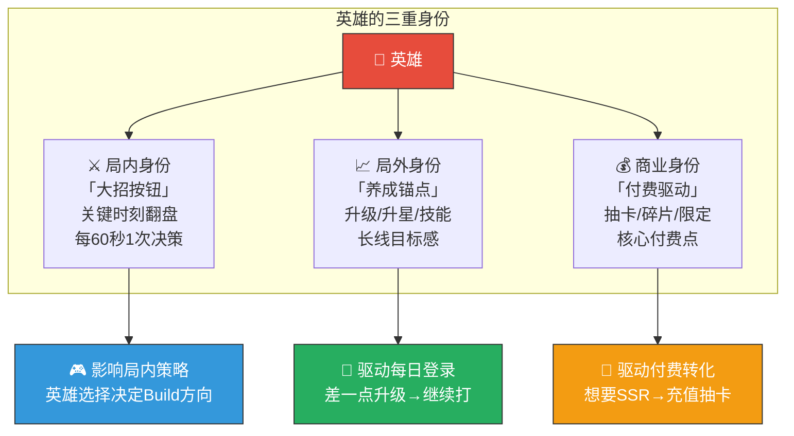
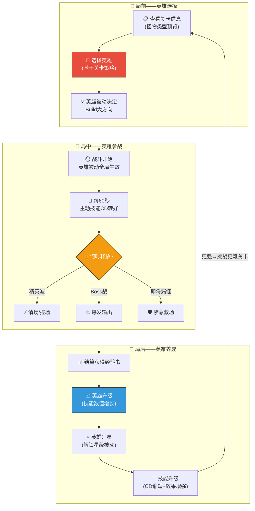
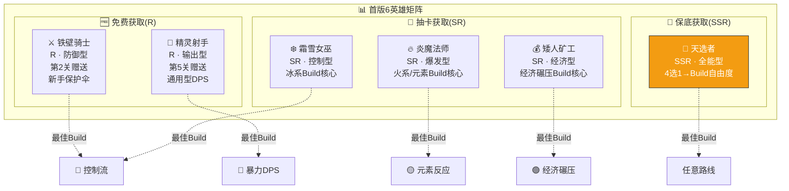
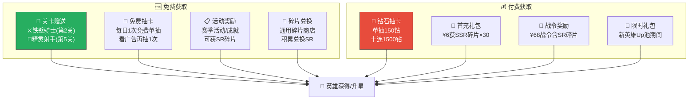
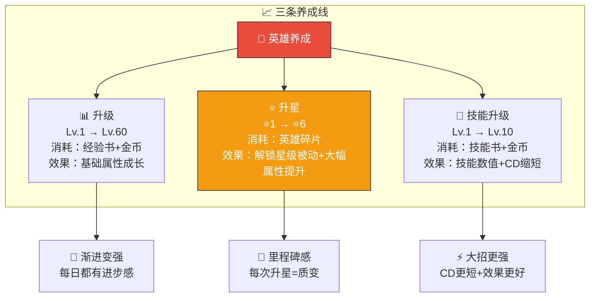
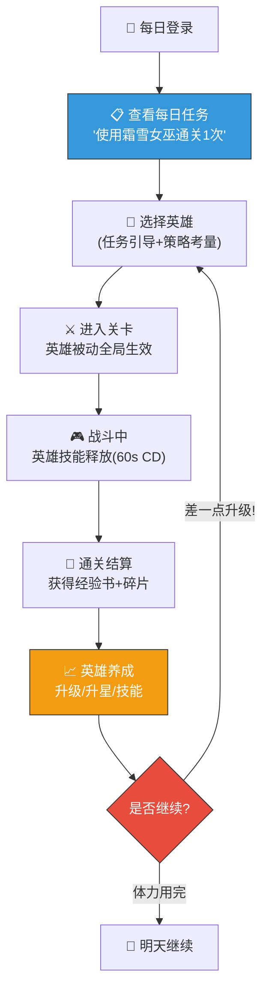
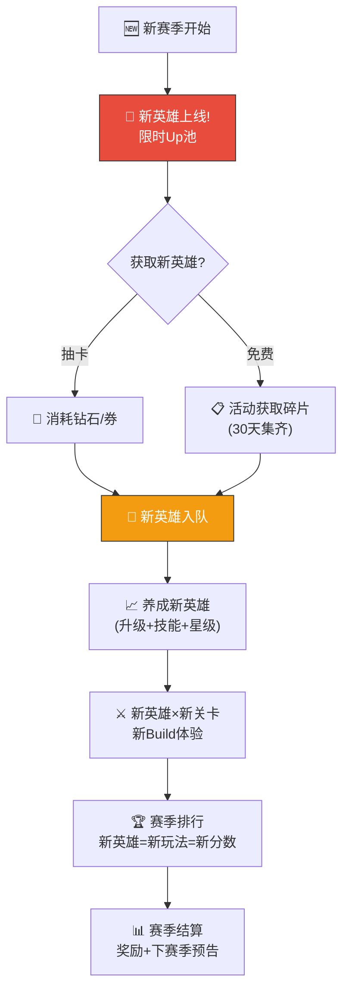


# 🦸 AetheraSurvivors — 英雄/指挥官系统骨架设计

> **文档版本**：v1.0
> **最后更新**：2026-03-24
> **交互编号**：阶段一 #15
> **前置依赖**：GDD.md（v1.17）、Roguelike词条系统设计.md（v1.0）、付费系统与商业化方案.md（v1.0）、爽感与留存钩子设计.md
> **验收标准**：✅ 明确英雄在核心循环中的作用

---

## 一、英雄系统定位

### 1.1 设计哲学

> **一句话定位**：英雄是「战略级大招按钮 + 局外长线养成锚点 + 付费核心驱动」三位一体的角色。



### 1.2 核心设计原则

| # | 原则 | 说明 | 反面案例 |
|---|------|------|---------|
| 1 | **大招而非常态** | 英雄技能CD 60s，是关键时刻的「战略资源」，不是持续输出 | 英雄自动攻击（变成第7种塔） |
| 2 | **选择即策略** | 英雄选择决定Build方向——炎魔法师→火系Build，矮人矿工→经济Build | 所有英雄通用，选谁都一样 |
| 3 | **被动塑造风格** | 被动技能全局生效，是「这局和上局不一样」的底层差异 | 被动效果太弱，感知不到 |
| 4 | **养成不锁策略** | 英雄等级影响技能数值（伤害/持续时间），不影响词条选择公平性 | 高级英雄独占强力词条（P2W） |
| 5 | **付费加速不垄断** | 免费玩家可通过时间获得所有R/SR英雄，SSR是锦上添花 | SSR独占核心机制 |

### 1.3 英雄在核心循环中的作用



---

## 二、英雄数量规划

### 2.1 版本规划总览

| 版本 | 英雄总量 | 新增英雄 | 稀有度分布 | 说明 |
|------|---------|---------|-----------|------|
| **首版（v1.0）** | 6个 | — | R×2 + SR×3 + SSR×1 | MVP核心阵容 |
| **赛季1（v1.1）** | 8个 | +2 | +SR×1 + SSR×1 | 新赛季Up池驱动付费 |
| **赛季2（v1.2）** | 10个 | +2 | +SR×1 + SSR×1 | 持续扩充 |
| **赛季3（v1.3）** | 12个 | +2 | +R×1 + SSR×1 | 补充免费英雄+高端 |
| **长期目标** | 20-24个 | — | R×4 + SR×10 + SSR×10 | 约2年运营内容 |

### 2.2 数量控制原则

| 原则 | 说明 |
|------|------|
| **精而非多** | 每个英雄必须有独特的gameplay感知，不做数值换皮 |
| **每赛季+2** | 30天赛季节奏，每赛季2个新英雄（1个Up池SSR + 1个活动SR） |
| **免费可得** | 每次新增至少1个免费可获取的英雄（活动/任务） |
| **6个即可玩** | 首版6个英雄覆盖所有Build路线+难度梯度 |

### 2.3 首版6英雄设计意图



---

## 三、英雄稀有度体系

### 3.1 稀有度定义

| 稀有度 | 颜色 | 英雄数量(首版) | 技能插槽 | 星级上限 | 基础属性倍率 | 获取难度 |
|--------|------|--------------|---------|---------|------------|---------|
| **R（稀有）** | ⬜白色 | 2 | 1主动+1被动 | 6星 | 1.0x | 🟢 容易 |
| **SR（超稀有）** | 🟣紫色 | 3 | 1主动+1被动 | 6星 | 1.15x | 🟡 中等 |
| **SSR（超超稀有）** | 🟡金色 | 1 | 1主动+1被动 | 6星 | 1.3x | 🔴 困难 |

### 3.2 稀有度影响范围（重要边界）

| 维度 | R vs SR vs SSR | 说明 |
|------|----------------|------|
| **基础属性** | SSR > SR > R（约15%梯度） | 技能伤害/持续时间/范围有差异 |
| **被动技能强度** | SSR被动更独特（如4选1），SR被动更专精，R被动更通用 | 差异化体验 |
| ❌ **不影响词条池** | 所有英雄共享同一词条池 | **公平性底线** |
| ❌ **不影响塔属性** | R英雄和SSR英雄放同一种塔，塔基础属性完全一样 | **策略公平** |
| ❌ **不影响通关性** | 所有关卡（含普通/困难）R英雄均可通关 | **免费可玩** |
| ✅ **影响养成上限** | SSR满级满星的技能数值更高 | 高端追求 |
| ✅ **影响便利性** | SSR的被动让Build更容易成型（如4选1） | 加速而非独占 |

> **核心承诺**：用R英雄可以通关所有内容。SR/SSR让你通关更爽、Build更容易成型、分数更高——但不是必须的。

---

## 四、首版6英雄详细设计

### 4.1 英雄详情卡

---

#### ⚔️ 铁壁骑士（Iron Guardian）

| 维度 | 设计 |
|------|------|
| **稀有度** | R |
| **定位** | 防御型·新手之友 |
| **获取** | 第2关教学赠送（100%获得） |
| **设计意图** | 给新手一个「救命按钮」，减少前期挫败感。被动+2生命=允许更多犯错 |

| 技能 | 名称 | 效果 | CD | 范围 |
|------|------|------|-----|------|
| **主动** | 无敌护盾 | 基地获得无敌状态，持续3秒（不受任何伤害） | 60s | 基地 |
| **被动** | 坚韧意志 | 基地最大生命+2（从5→7） | — | 全局 |

**局内使用场景**：
- 精英波冲破防线→无敌3秒争取塔的输出时间
- Boss P2暴怒冲刺→无敌护盾挡住最后一击
- 漏怪即将到达基地→无敌救命

**最佳Build路线**：🔵 控制流（被动+2生命=容错高→可以大胆走纯控制不要DPS）

**星级被动（升星解锁）**：

| 星级 | 解锁被动 | 说明 |
|------|---------|------|
| ⭐2 | 护盾反击：无敌期间对接触基地的敌人造成100伤害 | 从纯防御→有反击能力 |
| ⭐4 | 铁壁之心：基地生命低于30%时，自动触发一次1秒护盾（每局1次） | 自动救命机制 |
| ⭐6 | 不屈意志：基地生命+2→+4 | 被动翻倍 |

---

#### 🏹 精灵射手（Elven Archer）

| 维度 | 设计 |
|------|------|
| **稀有度** | R |
| **定位** | 输出型·通用DPS |
| **获取** | 第5关通关赠送 |
| **设计意图** | 通用型输出英雄，适合所有DPS向Build。被动+10%射程=所有塔受益 |

| 技能 | 名称 | 效果 | CD | 范围 |
|------|------|------|-----|------|
| **主动** | 万箭齐发 | 全屏随机落下箭雨，每0.5秒造成1次伤害，持续5秒（共10次伤害） | 60s | 全屏 |
| **被动** | 鹰眼 | 全塔攻击射程+10% | — | 全局 |

**局内使用场景**：
- 密集怪群→万箭齐发清场（群体AOE）
- 精英波→配合塔集火（万箭齐发补充DPS）
- Boss P2暴怒→万箭齐发争取输出时间

**最佳Build路线**：🔴 暴力DPS流（被动射程+10%=暴击覆盖更广→连锁闪电弹射更多目标）

**星级被动（升星解锁）**：

| 星级 | 解锁被动 | 说明 |
|------|---------|------|
| ⭐2 | 精准射击：万箭齐发对精英/Boss伤害+50% | 万箭齐发从纯清场→兼顾打Boss |
| ⭐4 | 猎手直觉：每波前3秒全塔暴击率+20% | 开波爆发，配合DPS流更强 |
| ⭐6 | 鹰眼精通：射程+10%→+18% | 被动大幅增强 |

---

#### ❄️ 霜雪女巫（Frost Witch）

| 维度 | 设计 |
|------|------|
| **稀有度** | SR |
| **定位** | 控制型·冰系专精 |
| **获取** | 抽卡获取（SR概率17%） |
| **设计意图** | 冰系Build的核心英雄。暴风雪是最强控制技能，被动让冰塔更强 |

| 技能 | 名称 | 效果 | CD | 范围 |
|------|------|------|-----|------|
| **主动** | 暴风雪 | 全屏冰冻所有敌人，完全定身3秒（不可行动+不可被推） | 60s | 全屏 |
| **被动** | 寒冰之力 | 冰塔效果+15%（减速百分比提升15%） | — | 全局 |

**局内使用场景**：
- 精英波怪群密集→暴风雪冻住→塔全力输出3秒
- Boss即将到达基地→暴风雪冻住→争取输出窗口
- 配合元素反应：暴风雪冻住→火塔攻击→蒸汽爆炸AOE

**最佳Build路线**：🔵 控制流 / 🟡 元素反应流

**星级被动（升星解锁）**：

| 星级 | 解锁被动 | 说明 |
|------|---------|------|
| ⭐2 | 冰封余韵：暴风雪结束后，敌人额外减速50%持续3秒 | 控制时间实质延长 |
| ⭐4 | 霜之共鸣：场上每个冰塔使暴风雪冰冻时间+0.3秒（最多+1.5秒） | 鼓励多放冰塔 |
| ⭐6 | 绝对零度亲和：寒冰之力+15%→+25% | 被动大幅增强 |

---

#### 🔥 炎魔法师（Pyromancer）

| 维度 | 设计 |
|------|------|
| **稀有度** | SR |
| **定位** | 爆发型·火系/元素专精 |
| **获取** | 抽卡获取（SR概率17%） |
| **设计意图** | 元素反应流的核心英雄。陨石术是单体最高伤害技能，被动增强火系词条 |

| 技能 | 名称 | 效果 | CD | 范围 |
|------|------|------|-----|------|
| **主动** | 陨石术 | 指定区域（直径3格）降下陨石，造成大量AOE伤害+灼烧（6秒内持续伤害） | 60s | 指定区域(3格直径) |
| **被动** | 火焰亲和 | 火系词条效果+20%（如火焰附魔灼烧30%→36%） | — | 全局 |

**局内使用场景**：
- Boss战→陨石术对Boss造成巨量伤害（单体最强技能）
- 密集怪群→陨石术AOE清场+灼烧持续伤害
- 元素反应触发：陨石灼烧+冰塔冻→蒸汽反应连锁

**最佳Build路线**：🟡 元素反应流 / 🔴 暴力DPS流

**星级被动（升星解锁）**：

| 星级 | 解锁被动 | 说明 |
|------|---------|------|
| ⭐2 | 灼热余烬：陨石术灼烧区域持续8秒（造成持续伤害区域） | 地形控制能力 |
| ⭐4 | 连锁点燃：灼烧的敌人被击杀时爆炸，对周围造成50%伤害 | 连锁AOE |
| ⭐6 | 火焰大师：火焰亲和+20%→+35% | 被动大幅增强 |

---

#### 💰 矮人矿工（Dwarf Miner）

| 维度 | 设计 |
|------|------|
| **稀有度** | SR |
| **定位** | 经济型·金币专精 |
| **获取** | 抽卡获取（SR概率17%） |
| **设计意图** | 经济碾压流的核心英雄。淘金热让击杀金币翻倍，被动增强金矿——走经济路线的必选英雄 |

| 技能 | 名称 | 效果 | CD | 范围 |
|------|------|------|-----|------|
| **主动** | 淘金热 | 10秒内所有击杀获得的金币翻倍（×2） | 60s | 全局 |
| **被动** | 矿脉感知 | 金矿产出+20% | — | 全局 |

**局内使用场景**：
- 密集波次→淘金热+怪群死亡=金币爆炸（经济碾压的核心爆发点）
- 精英波→精英怪高金币奖励×2
- 配合经济词条（赏金猎人+15% × 淘金热×2 = 实质2.3倍金币）

**最佳Build路线**：🟢 经济碾压流

**星级被动（升星解锁）**：

| 星级 | 解锁被动 | 说明 |
|------|---------|------|
| ⭐2 | 宝藏嗅觉：每5波额外获得50金币（平白多出的钱） | 稳定经济加成 |
| ⭐4 | 金矿扩建：金矿建造上限+1（从3→4） | 核心经济优势 |
| ⭐6 | 矿脉精通：矿脉感知+20%→+35% | 被动大幅增强 |

---

#### 🌟 天选者（The Chosen One）

| 维度 | 设计 |
|------|------|
| **稀有度** | SSR |
| **定位** | 全能型·Build自由度 |
| **获取** | 抽卡获取（SSR概率3%，50次保底） |
| **设计意图** | 唯一的SSR英雄，不走任何特定路线，而是让「Build更容易成型」。4选1比3选1多25%选择权 |

| 技能 | 名称 | 效果 | CD | 范围 |
|------|------|------|-----|------|
| **主动** | 神之裁决 | 对全屏所有敌人造成其当前生命值20%的伤害（百分比伤害，对Boss极有效） | 60s | 全屏 |
| **被动** | 命运垂青 | 词条选择时多看1张（3选1→4选1） | — | 全局 |

**局内使用场景**：
- Boss P1→神之裁决砍掉20%血（百分比伤害，血越多砍得越多）
- 精英波→对高血量精英极有效
- 被动4选1→更容易凑齐超模Build

**最佳Build路线**：任意路线（被动让任何Build都更容易成型）

**星级被动（升星解锁）**：

| 星级 | 解锁被动 | 说明 |
|------|---------|------|
| ⭐2 | 命运指引：词条选择界面会标注「推荐」标签（基于当前Build方向） | 新手友好 |
| ⭐4 | 双重审判：神之裁决释放后3秒内，全塔暴击率+30% | 爆发窗口 |
| ⭐6 | 天命所归：4选1→5选1 | 极致Build自由度 |

---

### 4.2 英雄阵容覆盖矩阵

| 英雄 | 🔴 DPS | 🔵 控制 | 🟢 经济 | 🟡 元素 | 通用 |
|------|--------|--------|--------|--------|------|
| ⚔️ 铁壁骑士(R) | ☆ | ⭐⭐⭐ | ☆ | ☆ | ⭐⭐ |
| 🏹 精灵射手(R) | ⭐⭐⭐ | ☆ | ☆ | ☆ | ⭐⭐ |
| ❄️ 霜雪女巫(SR) | ☆ | ⭐⭐⭐ | ☆ | ⭐⭐ | ☆ |
| 🔥 炎魔法师(SR) | ⭐⭐ | ☆ | ☆ | ⭐⭐⭐ | ☆ |
| 💰 矮人矿工(SR) | ☆ | ☆ | ⭐⭐⭐ | ☆ | ☆ |
| 🌟 天选者(SSR) | ⭐⭐ | ⭐⭐ | ⭐⭐ | ⭐⭐ | ⭐⭐⭐ |

> ⭐⭐⭐=最佳匹配  ⭐⭐=可用  ☆=不推荐

**设计验证**：
- 每条Build路线至少有1个⭐⭐⭐英雄
- 免费英雄(R)覆盖2条最基础的Build路线（DPS+控制）
- SSR英雄不垄断任何路线，是「万能辅助」而非「必须」

---

## 五、英雄获取体系

### 5.1 获取途径总览



### 5.2 免费玩家获取时间线

| 时间节点 | 可获得英雄 | 获取方式 | 累计英雄数 |
|---------|-----------|---------|-----------|
| **D1 第2关** | ⚔️ 铁壁骑士(R) | 教学赠送 | 1 |
| **D1 第5关** | 🏹 精灵射手(R) | 关卡赠送 | 2 |
| **D3-D7** | 可能获得1个SR | 免费抽+广告抽（累计~10次） | 2-3 |
| **D14** | 大概率获得1个SR | 累计抽卡约25次 | 3 |
| **D30** | 可能获得SSR | 累计抽卡约50次（保底） | 3-4 |
| **D60** | 所有SR至少1个 | 抽卡+碎片兑换 | 5-6 |

> **关键设计**：免费玩家在**第1天**即拥有2个英雄，**2周内**大概率获得3个英雄——覆盖3条Build路线的基本需求。

### 5.3 抽卡系统参数

| 参数 | 值 | 说明 |
|------|-----|------|
| **SSR概率** | 3% | 与GDD/付费系统一致 |
| **SR概率** | 17% | — |
| **R概率** | 80% | — |
| **SSR保底** | 50次硬保底 | 50次内必出1个SSR |
| **SR保底** | 10次软保底 | 每10次至少1个SR |
| **重复英雄** | 转化为对应碎片 | R=5碎片，SR=20碎片，SSR=50碎片 |
| **单抽消耗** | 150钻 或 1召唤券 | — |
| **十连消耗** | 1500钻 或 10召唤券 | 十连保底SR |
| **保底继承** | 保底计数跨池继承 | 换池不清空保底 |

### 5.4 碎片系统

| 英雄稀有度 | 解锁所需碎片 | 每次升星所需碎片 | 碎片来源 |
|-----------|------------|----------------|---------|
| R | 10碎片 | 10→20→40→60→80→100 | 抽卡重复(5个/次)、关卡掉落、商店 |
| SR | 30碎片 | 20→40→60→80→120→160 | 抽卡重复(20个/次)、活动、战令、商店 |
| SSR | 50碎片 | 30→50→80→120→160→200 | 抽卡重复(50个/次)、首充、限时商店 |

> **关键点**：碎片不仅用于解锁英雄，也是升星的核心材料——这让重复抽到同一个英雄不是「浪费」而是「升星进度」。

---

## 六、英雄养成体系

### 6.1 养成总览



### 6.2 升级系统

| 维度 | 设计 |
|------|------|
| **等级上限** | 60级 |
| **升级消耗** | 经验书（小/中/大） + 金币 |
| **经验曲线** | 前30级较平缓（快速成长感），30-60级渐陡（长线目标） |
| **属性成长** | 技能伤害/持续时间/范围 随等级线性成长 |

**升级里程碑**：

| 等级 | 里程碑 | 奖励/效果 |
|------|--------|---------|
| Lv.10 | 技能解锁第2段描述 | 技能说明更详细（新手友好） |
| Lv.20 | 外观变化①（轻微） | 英雄立绘加装饰 |
| Lv.30 | 技能效果增强阈值 | 技能伤害/持续时间跳一大步 |
| Lv.40 | 外观变化②（明显） | 英雄立绘大幅变化 |
| Lv.50 | 技能动画强化 | 技能特效更华丽 |
| Lv.60 | 满级标识+专属称号 | 英雄头像金框+称号「大师级XXX」 |

### 6.3 升星系统

| 星级 | 消耗碎片(R/SR/SSR) | 属性倍率 | 解锁内容 | 视觉变化 |
|------|---------------------|---------|---------|---------|
| ⭐1 | 初始 | 1.0x | 基础主动+被动 | 基础外观 |
| ⭐2 | 10/20/30 | 1.1x | **星级被动①** | 头像+1星标 |
| ⭐3 | 20/40/50 | 1.2x | 属性提升 | +1星标 |
| ⭐4 | 40/60/80 | 1.35x | **星级被动②** | +1星标+发光边框 |
| ⭐5 | 60/80/120 | 1.5x | 属性提升 | +1星标+特效 |
| ⭐6 | 80/120/160 | 1.7x | **星级被动③**+满星标识 | 金色全身特效+专属头像框 |

> **设计要点**：⭐2/⭐4/⭐6 解锁星级被动 = 质变感。中间星级为数值提升 = 量变。

### 6.4 技能升级系统

| 技能等级 | 消耗（技能书+金币） | 效果提升 | 说明 |
|---------|-------|---------|------|
| Lv.1 | 初始 | 基础效果 | — |
| Lv.2-5 | 小技能书+少量金币 | 每级+5%数值 | 低门槛，快速体感 |
| Lv.6-8 | 中技能书+中量金币 | 每级+8%数值 | 中期追求 |
| Lv.9 | 大技能书+大量金币 | +10%数值 + CD-3秒 | 接近满级 |
| Lv.10 | 大技能书×3+大量金币 | +15%数值 + CD-5秒 | 满级，技能CD从60s→52s |

> **CD缩短是最有感知的提升**：60s→52s = 每局多用1次大招 = 显著体感差异。

### 6.5 养成资源产出控制

| 资源 | 日均免费产出 | 主要来源 | 消耗节奏 |
|------|------------|---------|---------|
| **📕小经验书** | ~30个 | 关卡掉落(3-5/关) × 6-10关/日 | 前30级大量消耗 |
| **📗中经验书** | ~8个 | 任务奖励、活动 | 30-50级消耗 |
| **📘大经验书** | ~2个 | 战令、成就、商店 | 50-60级消耗 |
| **📗小技能书** | ~5个 | 关卡掉落、任务 | 技能Lv.1-5 |
| **📕中技能书** | ~2个 | 活动、战令 | 技能Lv.6-8 |
| **📘大技能书** | ~0.5个 | 战令、商店、成就 | 技能Lv.9-10 |
| **🧩英雄碎片** | ~5-10个(R)/1-3个(SR) | 抽卡重复、关卡 | 升星消耗 |

### 6.6 养成深度预估

| 目标 | 免费玩家预计达成时间 | 月卡玩家 | 说明 |
|------|-------------------|---------|----|
| 1个R英雄Lv.30⭐3 | ~7天 | ~4天 | 首个英雄「养熟」 |
| 1个SR英雄Lv.30⭐2 | ~14天 | ~8天 | 第一个SR「够用」 |
| 主力英雄Lv.60⭐4 | ~60天 | ~35天 | 中期养成目标 |
| 全英雄Lv.60⭐6 | ~180天+ | ~90天+ | 长线追求（鲸鱼向） |

> **关键节奏**：让免费玩家在**第1周**就有1个「养熟」的英雄，**第2周**有2个可用英雄——避免前期空窗感。

---

## 七、英雄核心玩法循环

### 7.1 单日循环



### 7.2 赛季循环



### 7.3 英雄收集循环

```
收集驱动力:
  
  英雄图鉴: 6/6 ████████████ 100% — 完美收藏家!
  ⚔️ 铁壁骑士  ⭐⭐⭐⭐⭐⭐  Lv.60 ✅
  🏹 精灵射手  ⭐⭐⭐⭐⭐☆  Lv.55
  ❄️ 霜雪女巫  ⭐⭐⭐⭐☆☆  Lv.48
  🔥 炎魔法师  ⭐⭐⭐☆☆☆  Lv.35
  💰 矮人矿工  ⭐⭐☆☆☆☆  Lv.22
  🌟 天选者    ⭐☆☆☆☆☆  Lv.10 ← 刚抽到!
  
  心理驱动:
  • 收集完整度(100%强迫症)
  • 升星进度(每个英雄6星)
  • 英雄故事(每次升星解锁背景故事片段)
```

---

## 八、英雄与其他系统联动

### 8.1 联动矩阵

| 联动系统 | 联动方式 | 影响 |
|---------|---------|------|
| **词条系统** | 英雄被动增强特定词条类型（火焰亲和+20%） | 英雄选择→Build方向偏好 |
| **塔体系** | 英雄被动增强特定塔（冰塔效果+15%） | 英雄选择→塔布阵策略 |
| **经济系统** | 矮人矿工被动增强金矿产出 | 英雄选择→经济节奏 |
| **超模Build** | 英雄被动+词条=更容易/更快触发超模 | 英雄=超模催化剂 |
| **高光时刻** | 英雄技能释放可触发高光（Boss秒杀等） | 大招=高光时刻的常见来源 |
| **分享卡片** | 分享卡片展示英雄信息+英雄立绘 | 英雄=个人标识 |
| **排行榜** | 英雄选择写入排行榜数据 | 攀比+参考 |
| **每日任务** | 「使用XX英雄通关」任务 | 驱动英雄轮换使用 |
| **成就系统** | 「英雄满级/满星/全收集」成就 | 长线养成目标 |
| **抽卡/付费** | 英雄是抽卡池的核心产出 | 付费核心驱动 |

### 8.2 英雄-词条协同设计

> 以下协同矩阵确保每个英雄都有「最佳拍档」词条，引导玩家形成Build策略。

| 英雄 | 最佳词条组合 | 协同原理 | 超模触发加速 |
|------|------------|---------|------------|
| ⚔️ 铁壁骑士 | 不屈意志+坚韧+冰封大地 | 被动+2生命=更多不屈意志触发机会 | 控制流超模(永恒冰封)的容错保障 |
| 🏹 精灵射手 | 暴击强化+急速+连锁闪电 | 被动射程+10%=暴击覆盖更广+连锁弹射更多 | DPS流超模(末日审判)的数值基础 |
| ❄️ 霜雪女巫 | 绝对零度+冰冻之触+蒸汽 | 被动冰塔+15%=冰冻更持久→蒸汽反应更频繁 | 控制流/元素流超模 |
| 🔥 炎魔法师 | 火焰附魔+腐蚀+元素风暴 | 被动火系+20%=灼烧更强→元素反应伤害更高 | 元素流超模(元素风暴)核心 |
| 💰 矮人矿工 | 金矿强化+矿脉开发+金币帝国 | 被动金矿+20%叠加金矿强化=极致经济 | 经济流超模(金币帝国)核心 |
| 🌟 天选者 | 命运之轮+全能之力 | 被动4选1=更容易拿到稀有金色词条 | 任意超模路线均加速 |

### 8.3 英雄与留存钩子联动

| 留存钩子 | 英雄相关触发 | 说明 |
|---------|------------|------|
| **差一点升级** | 「英雄还差50经验就能升级! 打1关就够」 | 驱动续玩 |
| **差一点升星** | 「⭐4升星需要60碎片，你已经有55个了!」 | 驱动抽卡/活动 |
| **新英雄预告** | 「新英雄下周上线! 提前攒钻石」 | 赛季期待 |
| **英雄任务** | 「使用炎魔法师通关3次→获得碎片×20」 | 驱动英雄轮换 |
| **排行超越** | 「好友用霜雪女巫超过了你的纪录!」 | 社交攀比+英雄尝试 |

---

## 九、未来赛季英雄规划（S1-S3预览）

### 9.1 赛季1新英雄

| 英雄 | 稀有度 | 定位 | 主动技能 | 被动技能 | 设计意图 |
|------|--------|------|---------|---------|---------|
| ⚡ **雷霆战士** | SR | 爆发/控制混合 | 雷暴：指定区域连续5次雷击，每次造成伤害+0.5秒眩晕 | 雷电亲和：全塔攻击5%概率附带雷击（小额伤害+0.3秒眩晕） | 填补「爆发+控制」混合定位空白 |
| 🌙 **月影刺客** | SSR | 单体极致 | 暗影突袭：锁定血量最高的敌人，瞬间造成其最大生命值30%伤害（单体最强） | 暗影之刃：对Boss/精英伤害+15% | 单体Boss杀手，与天选者(AOE百分比)差异化 |

### 9.2 赛季2新英雄

| 英雄 | 稀有度 | 定位 | 主动技能 | 被动技能 | 设计意图 |
|------|--------|------|---------|---------|---------|
| 🌿 **大地守护者** | SR | 防御/经济混合 | 自然之力：所有塔回复到满血+获得50金币 | 大地之赐：每波结束时基地回复1点生命（如果受过伤） | 填补「防御+经济」混合定位 |
| 🔮 **时空法师** | SSR | 操控/特殊 | 时间回溯：所有敌人倒退3秒的位置（等于多了3秒输出时间） | 时空感知：词条选择限时15秒→20秒 | 极其独特的控制方式，赛季卖点 |

### 9.3 赛季3新英雄

| 英雄 | 稀有度 | 定位 | 主动技能 | 被动技能 | 设计意图 |
|------|--------|------|---------|---------|---------|
| 🛡️ **圣骑士** | R | 防御型(免费) | 神圣庇护：全屏减速50%持续5秒+基地回复2点生命 | 圣光：基地生命>80%时全塔伤害+5% | 免费防御英雄补充 |
| 💀 **死灵法师** | SSR | 特殊/召唤 | 亡灵召唤：召唤5个骷髅兵在路径上阻挡敌人5秒 | 灵魂收割：击杀敌人时5%概率获得双倍金币 | 全新「召唤+阻挡」机制 |

---

## 十、英雄系统与核心循环的关系总结

### 10.1 英雄如何「不抢戏」

> **核心担忧**：英雄系统会不会抢了「塔+词条」的主角地位？

| 防护措施 | 设计 | 说明 |
|---------|------|------|
| **技能CD长** | 60秒（满级52秒），每局只释放2-3次 | 90%时间是塔在打，英雄技能是「画龙点睛」 |
| **不自动攻击** | 英雄站在场上但不自动攻击敌人 | 避免变成「第7种塔」 |
| **被动是增幅不是替代** | 射程+10%、冰塔效果+15%——增强塔，而非替代塔 | 塔仍然是核心 |
| **不影响词条池** | 所有英雄共享同一词条池，英雄只影响词条收益 | 词条选择仍是核心策略 |

### 10.2 英雄如何「驱动付费」

```
付费漏斗:
  
  免费体验(D1-D7)
    ├── 获得2个R英雄 → 体验基本功能
    ├── 看到SR英雄(霜雪女巫)的暴风雪大招视频 → 「好厉害!我也想要!」
    └── 首充¥6 → SSR碎片×30 → 「距离天选者只差20碎片!」
  
  付费转化(D7-D30)
    ├── 月卡¥30 → 每日100钻 → 累计抽卡 → 获得SR英雄
    ├── 战令¥68 → SR碎片大量 → 升星已有英雄
    └── 抽卡¥10/次 → 追SSR保底
  
  深度付费(D30+)
    ├── 新赛季Up池 → 新SSR英雄 → 限时池刺激
    ├── 英雄升星需要大量碎片 → 持续抽卡
    └── 满星称号+专属外观 → 炫耀驱动

  关键节点:
  • ¥6首充: 获得SSR碎片 → 种下「我差一点就有SSR」的种子
  • ¥30月卡: 每日钻石 → 持续抽卡 → SR全收集
  • ¥68战令: 碎片大量 → 升星加速
  • ¥100+深度: 追SSR保底 + 新赛季Up池
```

### 10.3 英雄如何「驱动留存」

| 留存维度 | 英雄的贡献 | 具体表现 |
|---------|-----------|---------|
| **日留存** | 每日任务「使用XX英雄」 | 驱动每日至少1局 |
| **周留存** | 英雄升级里程碑 | 「Lv.30马上到了! 再打几关」 |
| **月留存** | 英雄升星进度 | 「碎片快够了! 再抽几次」 |
| **赛季留存** | 新英雄+Up池 | 「新赛季新英雄! 我要第一时间抽到」 |
| **长线留存** | 英雄图鉴收集+满星 | 收集控+完美主义 |

---

## 十一、技术实现要点

### 11.1 数据结构骨架

```
// 英雄配置（策划配置表，JSON）
HeroConfig:
  hero_id: string           // "hero_iron_guardian"
  name: string              // "铁壁骑士"
  rarity: R/SR/SSR
  role: Defense/Attack/Control/Economy/Support
  
  active_skill:
    name: string
    description: string
    cooldown: float         // 60s
    effect_type: enum       // Shield/Damage/Freeze/GoldBuff/PercentDamage
    effect_params: {}       // 各技能独立参数
    
  passive_skill:
    name: string
    description: string
    effect_type: enum       // BaseHpUp/RangeUp/IceUp/FireUp/GoldUp/ExtraChoice
    effect_value: float
    
  star_passives: [          // ⭐2/⭐4/⭐6 解锁
    {star: 2, name: "", effect: ""},
    {star: 4, name: "", effect: ""},
    {star: 6, name: "", effect: ""}
  ]
  
  level_growth:             // 每级成长系数
    skill_damage_per_level: float
    skill_duration_per_level: float

// 英雄实例（玩家数据，存档）
HeroInstance:
  hero_id: string
  level: int                // 1-60
  star: int                 // 1-6
  skill_level: int          // 1-10
  fragments: int            // 当前碎片数
  is_unlocked: bool
```

### 11.2 性能预算

| 资源 | 预算 | 说明 |
|------|------|------|
| **英雄立绘** | 每个英雄3张（选择界面/战斗头像/分享卡片） | 共6×3=18张 |
| **技能特效** | 每个技能1套粒子系统（≤100粒子） | 共6套 |
| **技能音效** | 每个技能1组音效（释放+命中） | 共12个音频文件 |
| **内存占用** | 英雄系统总占用<8MB | 含立绘+特效+音效 |
| **DrawCall** | 技能释放时额外+3 DrawCall | 不超过总预算(50) |

### 11.3 微信小游戏适配

| 适配项 | 方案 |
|--------|------|
| **英雄立绘** | 图集打包+按需加载（进入选择界面才加载） |
| **技能特效** | 预制Prefab+对象池复用 |
| **英雄数据** | wx.setStorageSync存储 + 内存加密(关键数值) |
| **抽卡动画** | 预渲染序列帧（非实时3D） |
| **碎片/经验** | 服务端验签（防篡改） |

---

## 十二、A/B测试方案

| 测试项 | A方案 | B方案 | 核心指标 |
|--------|------|------|---------|
| **技能CD** | 60秒 | 45秒 | 技能使用频率、爽感评分、DPS平衡 |
| **被动强度** | 当前值(+10%/+15%/+20%) | 减半(+5%/+8%/+10%) | Build方向感知、英雄选择差异率 |
| **SSR保底** | 50次 | 40次 | 付费转化率、SSR获取满意度 |
| **免费英雄时间** | D1获2个(R) | D1获3个(R+SR) | 首日留存、付费率 |
| **升星碎片量** | 当前值 | 减少30% | 升星速度、付费意愿 |
| **星级被动强度** | 当前值 | 增强50% | 升星动力、英雄差异感 |
| **技能动画时长** | 1.5秒 | 0.8秒 | 战斗节奏满意度 |
| **英雄任务频率** | 每日1个英雄任务 | 每日2个 | 英雄轮换使用率 |

---

## 十三、验收自检

| 验收标准 | 要求 | 实际 | 状态 |
|---------|------|------|------|
| ✅ **英雄在核心循环中的作用** | 明确英雄定位和作用 | §1.3 三段核心循环图(局前/局中/局后) + §10.1 不抢戏设计 | ✅ |
| **英雄数量规划** | 有版本规划 | §2.1 首版6→长期20-24，每赛季+2 | ✅ |
| **核心玩法循环** | 有完整循环 | §7.1 单日循环 + §7.2 赛季循环 + §7.3 收集循环 | ✅ |
| **获取途径** | 免费+付费双线 | §5.1 免费4途径+付费4途径 + §5.2 免费时间线 | ✅ |
| **养成深度** | 有养成体系 | §6.1-6.6 三线养成(升级/升星/技能) + 深度预估 | ✅ |
| **首版阵容** | 有具体英雄设计 | §4.1 6个英雄完整详情卡(技能/被动/星级被动/使用场景) | ✅ |
| **Build关联** | 英雄与词条/Build联动 | §8.2 英雄-词条协同矩阵 | ✅ |
| **付费驱动** | 英雄如何驱动付费 | §10.2 付费漏斗完整分析 | ✅ |
| **留存驱动** | 英雄如何驱动留存 | §10.3 日/周/月/赛季/长线5维留存 | ✅ |
| **未来规划** | 有赛季新英雄预览 | §9 S1-S3共6个新英雄设计 | ✅ |
| **技术可行** | 微信小游戏可实现 | §11 数据结构+性能预算+微信适配 | ✅ |
| **可测试** | 有A/B测试 | §12 8项A/B测试 | ✅ |

---

> 📝 **文档维护规则**：
> 1. 本文档为GDD第六章「英雄/指挥官系统」的详细展开
> 2. 数值为骨架级，将在阶段一#21中进行精确数值设计
> 3. 新增英雄时需同步更新：英雄阵容表 + 覆盖矩阵 + 协同矩阵
> 4. 英雄修改需同步检查与词条系统/付费系统/经济系统的一致性

